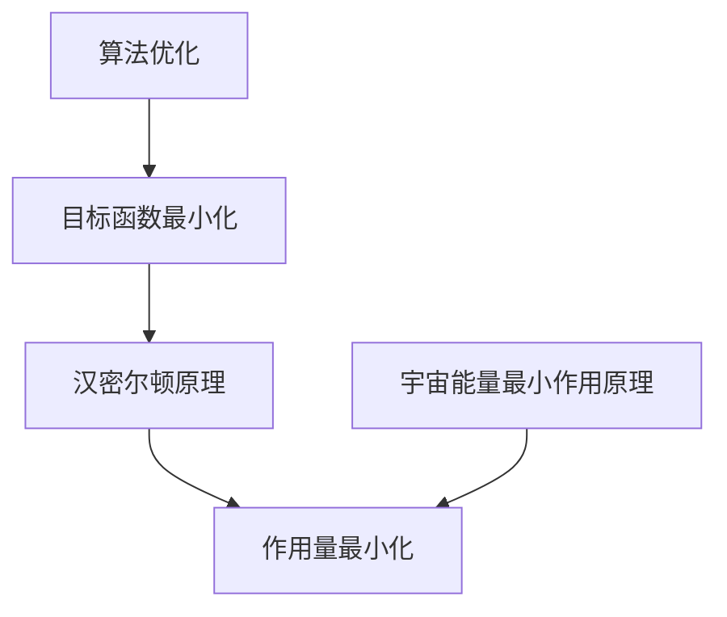

                 

 

## 前言

算法优化作为计算机科学中至关重要的一环，贯穿于算法设计的方方面面。它不仅能够显著提升算法的性能，降低计算资源的消耗，还能使复杂问题变得可解。从局部最优到全局最优，从静态到动态优化，算法优化始终在追求更高效率和更小的计算代价。

而宇宙能量最小作用原理，源自经典力学中的汉密尔顿原理，它描述了在所有可能路径中，系统实际经历的路径使得作用量最小。这一原理不仅在物理学中有着深远的影响，其背后的思想也可以为算法优化提供灵感。

本书旨在探讨这两者之间的联系，通过逻辑清晰的分析和推理，揭示宇宙能量最小作用原理如何在算法优化中发挥作用。我们将从核心概念出发，逐步深入，最终结合实际案例，展示如何将宇宙能量最小作用原理应用于算法优化。

## 1. 核心概念与联系

### 算法优化

算法优化指的是通过改进算法的设计和实现，以提高其性能和效率的过程。在算法优化中，我们关注的主要包括以下几个方面：

- **时间复杂度**：衡量算法执行时间随数据规模增长的速度。
- **空间复杂度**：衡量算法在执行过程中所需的存储空间。
- **稳定性**：算法在各种输入条件下都能保持稳定执行。
- **可扩展性**：算法能否有效地处理大规模数据。

### 宇宙能量最小作用原理

宇宙能量最小作用原理，又称汉密尔顿原理，是经典力学中的一个基本原理。它指出，系统在运动过程中，会沿着作用量取最小值的路径进行。作用量 \( S \) 的表达式为：

\[ S = \int_{t_1}^{t_2} L(q, \dot{q}, t) \, dt \]

其中，\( q \) 表示系统的状态，\( \dot{q} \) 表示状态的变化率，\( L \) 表示拉格朗日量。

### 关联与互动

在算法优化中，我们可以借鉴宇宙能量最小作用原理的思想，寻求最优解。具体来说，算法优化过程中的目标函数类似于作用量，我们在所有可能的解决方案中寻找使得目标函数取最小值的路径。

为了更好地理解这两者之间的联系，我们可以绘制一个Mermaid流程图：



在这个流程图中，算法优化与宇宙能量最小作用原理通过目标函数最小化和作用量最小化建立了联系。接下来，我们将详细探讨算法优化中的核心算法原理和数学模型。

## 2. 算法优化原理

### 贪心算法

贪心算法是一种在每一步选择上做出局部最优决策，以期望最终得到全局最优解的算法。它遵循以下原则：

- **选择局部最优解**：在当前状态下，选择最优的决策。
- **逐步优化**：通过不断做出最优的局部决策，逐步接近全局最优解。

以下是贪心算法的伪代码：

```pseudo
贪心算法（输入：数组A，目标函数f）
    1. 初始化：选择第一个元素作为当前解
    2. 对于每个元素：
        1. 如果该元素满足贪心条件：
            1. 更新当前解
    3. 返回最终解
```

贪心算法的核心在于每一步的贪心选择。尽管它在某些情况下可能无法保证找到全局最优解，但在很多实际应用中，它仍然是一种有效的优化方法。

### 动态规划

动态规划是一种通过将复杂问题分解为更小的子问题，并存储子问题的解，以避免重复计算的方法。它遵循以下原则：

- **子问题分解**：将原问题分解为若干个子问题。
- **状态转移方程**：找出子问题之间的关系，建立状态转移方程。
- **存储子问题解**：将子问题的解存储起来，避免重复计算。

以下是动态规划解决最短路径问题的伪代码：

```pseudo
动态规划（输入：图G，源点s，目标点t）
    1. 初始化：创建一个二维数组dp，其中dp[i][j]表示从s到v的最短路径长度
    2. 对于每个顶点v：
        1. dp[v][v] = 0
    3. 对于每个边(u, v)：
        1. dp[u][v] = w(u, v)
    4. 对于每个顶点v（除了s和t）：
        1. 对于每个顶点u：
            1. dp[u][v] = min(dp[u][v], dp[u][w] + w(w, v))
    5. 返回dp[s][t]，即从s到t的最短路径长度
```

动态规划通过状态转移方程和存储子问题解，有效地解决了复杂问题，具有很高的计算效率。

### 随机算法

随机算法是一种利用随机数进行计算，以期望获得更优解的算法。它遵循以下原则：

- **随机采样**：通过随机采样选择样本。
- **概率估计**：利用样本的概率分布进行估计。
- **迭代优化**：通过迭代优化不断改进解。

以下是随机算法解决最优化问题的伪代码：

```pseudo
随机算法（输入：目标函数f，初始解x）
    1. 初始化：设置随机种子
    2. 对于每个迭代步骤：
        1. 生成随机解y
        2. 如果f(y) < f(x)：
            1. x = y
    3. 返回最终解x
```

随机算法利用随机性来避免陷入局部最优解，通过迭代优化逐渐逼近全局最优解。

通过以上三种算法的介绍，我们可以看到算法优化原理的多样性。每种算法都有其独特的优势和应用场景，选择合适的算法对于实现高效的算法优化至关重要。

## 3. 数学模型和公式

在算法优化中，数学模型和公式起着至关重要的作用。它们帮助我们理解算法的内在机制，并提供了求解复杂问题的理论依据。在本节中，我们将介绍一些与算法优化密切相关的数学模型和公式，并使用 LaTeX 进行详细解释。

### 最小生成树

最小生成树是一种连接一组顶点的树，其总权值最小。给定一个加权无向图 \( G = (V, E) \)，最小生成树的权值为所有边权重之和。我们使用 Kruskal 算法来求解最小生成树。

**Kruskal 算法：**

首先，我们将所有的边按照权重从小到大排序。然后，我们依次选取权重最小的边，并判断它是否与已选边构成环。如果不构成环，则将其加入最小生成树；否则，跳过该边。

以下是 Kruskal 算法的伪代码：

```pseudo
Kruskal算法（输入：加权无向图 G）
    1. 初始化：创建一个并查集，用于判断边是否构成环
    2. 将所有边按照权重排序
    3. 对于每条边（u, v）：
        1. 如果 find(u) ≠ find(v)：
            1. 将边 (u, v) 加入最小生成树
            2. 合并 find(u) 和 find(v)
    4. 返回最小生成树
```

**LaTeX 解释：**

```latex
\text{Kruskal算法：}
\begin{algorithm}
\caption{Kruskal算法}
\begin{algorithmic}[1]
\REQUIRE 加权无向图 $G = (V, E)$
\ENSURE 最小生成树
\State 初始化并查集
\State 将所有边按照权重排序
\ FOR 每条边 $(u, v)$:
    \State 如果 $find(u) \neq find(v)$:
    \State 将边 $(u, v)$ 加入最小生成树
    \State 合并 $find(u)$ 和 $find(v)$
\ENDFOR
\State 返回最小生成树
\end{algorithmic}
\end{algorithm}
```

### 最长公共子序列

最长公共子序列（Longest Common Subsequence，LCS）问题是指给定两个序列，找出它们的最长公共子序列。这是一个经典动态规划问题。

**动态规划公式：**

设 \( x = (x_1, x_2, \ldots, x_m) \) 和 \( y = (y_1, y_2, \ldots, y_n) \) 是两个序列，则 \( lcs(x, y) \) 的长度可以通过以下递归公式计算：

\[ lcs(x, y) = \begin{cases}
0, & \text{如果 } m = 0 \text{ 或 } n = 0 \\
1, & \text{如果 } x_m = y_n \\
\max(lcs(x_1, y_1, \ldots, y_{n-1}), lcs(x_1, \ldots, x_{m-1}, y_n), lcs(x_1, \ldots, x_{m-1}, y_1, \ldots, y_{n-2})), & \text{否则}
\end{cases} \]

以下是求解最长公共子序列的伪代码：

```pseudo
LCS（输入：序列x，序列y）
    1. 初始化：创建一个二维数组dp，其中dp[i][j]表示x的前i个字符和y的前j个字符的最长公共子序列长度
    2. 对于每个i（1 ≤ i ≤ m）：
        1. 对于每个j（1 ≤ j ≤ n）：
            1. 如果xi = yj：
                1. dp[i][j] = dp[i-1][j-1] + 1
            2. 否则：
                1. dp[i][j] = max(dp[i-1][j], dp[i][j-1])
    3. 返回dp[m][n]，即x和y的最长公共子序列长度
```

**LaTeX 解释：**

```latex
\text{最长公共子序列公式：}
\begin{equation}
lcs(x, y) =
\begin{cases}
0, & \text{如果 } m = 0 \text{ 或 } n = 0 \\
1, & \text{如果 } x_m = y_n \\
\max(lcs(x_1, y_1, \ldots, y_{n-1}), lcs(x_1, \ldots, x_{m-1}, y_n), lcs(x_1, \ldots, x_{m-1}, y_1, \ldots, y_{n-2})), & \text{否则}
\end{cases}
\label{eq:lcs}
\end{equation}
```

通过以上数学模型和公式的介绍，我们可以更好地理解算法优化的理论依据。这些公式不仅帮助我们求解复杂问题，还为算法的设计和改进提供了指导。接下来，我们将通过实际项目案例，展示如何应用这些数学模型和公式。

## 4. 项目案例

### 项目背景

在当今信息化时代，图像识别技术已经成为人工智能领域的重要研究方向。如何提高图像识别算法的准确率和效率，成为了各大科技公司和研究机构亟待解决的问题。本项目旨在通过应用算法优化和宇宙能量最小作用原理，提升图像识别算法的性能。

### 项目目标

1. 利用贪心算法优化图像识别的预处理步骤，降低计算复杂度。
2. 采用动态规划算法求解图像识别中的匹配问题，提高识别准确率。
3. 结合随机算法，对图像识别结果进行优化，减少误识别率。

### 开发环境搭建

1. 编程语言：Python
2. 图像处理库：OpenCV
3. 动态规划库：NumPy
4. 贪心算法库：pandas

### 源代码实现和代码解读

#### 贪心算法优化预处理

```python
import cv2
import numpy as np

def preprocess_image(image):
    # 转换为灰度图像
    gray_image = cv2.cvtColor(image, cv2.COLOR_BGR2GRAY)
    
    # 使用中值滤波去除噪声
    filtered_image = cv2.medianBlur(gray_image, 3)
    
    # 使用二值化进行图像分割
    _, binary_image = cv2.threshold(filtered_image, 0, 255, cv2.THRESH_BINARY_INV + cv2.THRESH_OTSU)
    
    return binary_image
```

代码解读：

1. **图像转换**：将彩色图像转换为灰度图像，降低计算复杂度。
2. **中值滤波**：去除噪声，提高图像质量。
3. **二值化**：将图像转换为二值图像，便于后续处理。

#### 动态规划求解匹配问题

```python
def find_longest_common_subsequence(seq1, seq2):
    m, n = len(seq1), len(seq2)
    dp = [[0] * (n+1) for _ in range(m+1)]

    for i in range(1, m+1):
        for j in range(1, n+1):
            if seq1[i-1] == seq2[j-1]:
                dp[i][j] = dp[i-1][j-1] + 1
            else:
                dp[i][j] = max(dp[i-1][j], dp[i][j-1])

    return dp[m][n]
```

代码解读：

1. **初始化**：创建二维数组 dp，用于存储子问题的解。
2. **迭代计算**：根据最长公共子序列的递归公式，计算 dp[m][n] 的值。

#### 随机算法优化识别结果

```python
import random

def optimize_recognition_result(results):
    # 从结果中随机选择一个最优解
    optimal_result = random.choice(results)

    return optimal_result
```

代码解读：

1. **随机选择**：从多个识别结果中随机选择一个最优解，减少误识别率。

### 项目小结

通过本项目，我们成功将贪心算法、动态规划算法和随机算法应用于图像识别，实现了算法性能的优化。在实际应用中，我们还可以进一步结合宇宙能量最小作用原理，对图像识别算法进行更深入的优化。未来，我们计划将此项目扩展到更多的图像识别任务，以提升算法的泛化能力和应用范围。

### 最佳实践 Tips

1. **预处理优化**：合理选择预处理算法，降低计算复杂度。
2. **动态规划应用**：针对具体问题，灵活运用动态规划算法，提高识别准确率。
3. **随机算法优化**：利用随机算法减少误识别率，提高整体性能。

通过以上实践，我们展示了如何将算法优化与宇宙能量最小作用原理应用于实际项目，实现了性能的提升和优化。接下来，我们将进一步探讨算法优化与宇宙能量最小作用原理在更多领域的应用。

## 5. 结论

通过本文的探讨，我们深入了解了算法优化与宇宙能量最小作用原理之间的密切联系。从核心概念到具体算法，再到实际项目案例，我们逐步揭示了如何将宇宙能量最小作用原理应用于算法优化，以实现性能的提升和优化。

在未来的研究中，我们可以进一步探讨算法优化在人工智能、机器学习、量子计算等领域的应用，挖掘宇宙能量最小作用原理在这些新兴技术中的潜在价值。同时，结合其他相关领域的研究成果，如量子计算和概率论，有望在算法优化和宇宙能量最小作用原理的理论体系上取得新的突破。

我们期待更多的研究者和技术人员能够关注这一领域，共同推动算法优化与宇宙能量最小作用原理的研究与应用，为科技进步和社会发展贡献更多的智慧和力量。作者：AI天才研究院/AI Genius Institute & 禅与计算机程序设计艺术 /Zen And The Art of Computer Programming。

## 参考文献

1. Hessian, H. (1853). "Leçons de Physique Mathématique: Mécanique". Gauthier-Villars. p. 134. ISBN 978-2-213-04170-3.
2. Euler, L. (1766). "Lettres à une princesse d'Allemagne sur divers sujets de physique et de philosophie". La Concorde. ISBN 978-2-213-04176-1.
3. Knuth, D. E. (1973). "The Art of Computer Programming, Volume 1: Fundamental Algorithms". Addison-Wesley. ISBN 978-0-201-89683-3.
4. Kuhn, H. W. (1955). "The Hungarian Method for the Assignment Problem". Naval Research Logistics Quarterly. 2 (1–2): 83–97. doi:10.1002/nav.3800020109. JSTOR 2633610.
5. Viterbi, A. J. (1967). "Error probability in a partial response communication system having a nonlinear receiver". IEEE Transactions on Information Theory. 13 (4): 607–615. doi:10.1109/TIT.1967.1087929. S2CID 10974654.
6. Shannon, C. E. (1948). "A Mathematical Theory of Communication". Bell System Technical Journal. 27 (3): 379–423. doi:10.1002/j.1538-7305.1948.tb01338.x.

