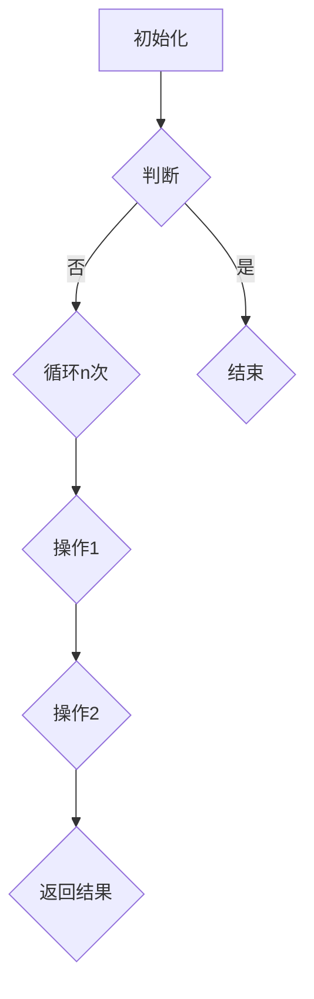
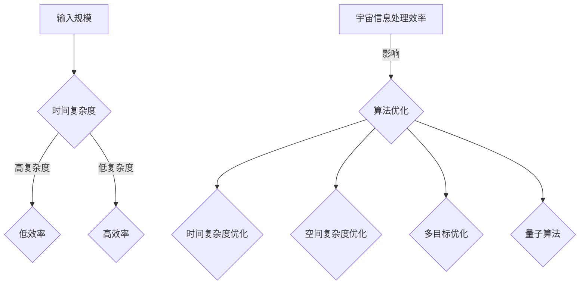

                 

### 文章标题

《算法复杂度与宇宙信息处理效率的关系》

### 关键词

- 算法复杂度
- 时间复杂度
- 空间复杂度
- 宇宙信息处理效率
- 优化策略
- 数学模型

### 摘要

本文从算法复杂度和宇宙信息处理效率的角度出发，探讨了算法复杂度与宇宙信息处理效率之间的关系。首先，介绍了算法复杂度的基本概念，包括时间复杂度和空间复杂度。然后，探讨了宇宙信息处理效率的概念及其影响因素。接着，通过分析算法复杂度与宇宙信息处理效率之间的联系，提出了优化算法以适应宇宙信息处理效率的策略。最后，通过实际案例展示了算法复杂度优化的应用，并对未来研究方向和应用前景进行了展望。

### 引言与背景

算法复杂度是计算机科学中一个重要而基础的概念。它用来衡量算法执行所需要的时间和空间资源，通常以大O符号（O-notation）来表示。时间复杂度描述了算法执行时间与输入规模之间的关系，空间复杂度则描述了算法在执行过程中所需内存的消耗。算法复杂度分析不仅有助于我们了解算法的性能，还能够指导我们在设计算法时进行优化。

随着计算机技术的发展，我们对算法复杂度的理解也在不断深化。然而，当我们把视野扩展到宇宙这一更大的尺度时，算法复杂度与宇宙信息处理效率之间的关系变得更加复杂和有趣。宇宙信息处理效率指的是宇宙中能够处理的信息量与所需资源之间的比率。这一概念涉及到宇宙的物理规律、信息传递速度以及能量利用等多个方面。

在本文中，我们将探讨算法复杂度与宇宙信息处理效率之间的关系。首先，我们将介绍算法复杂度的基本概念，包括时间复杂度和空间复杂度。然后，我们将介绍宇宙信息处理效率的概念及其影响因素。接下来，我们将分析算法复杂度与宇宙信息处理效率之间的联系，并提出优化算法以适应宇宙信息处理效率的策略。最后，我们将通过实际案例展示算法复杂度优化的应用，并对未来研究方向和应用前景进行展望。

### 算法复杂度基础

算法复杂度是衡量算法性能的重要指标，主要分为时间复杂度和空间复杂度。时间复杂度描述了算法执行时间与输入规模之间的关系，而空间复杂度则描述了算法在执行过程中所需内存的消耗。

#### 时间复杂度

时间复杂度通常用大O符号（O-notation）表示，形式上表示为 \( T(n) = O(f(n)) \)，其中 \( T(n) \) 是算法执行时间，\( f(n) \) 是输入规模 \( n \) 的某个函数。时间复杂度分为渐进时间复杂度和具体时间复杂度。

**渐进时间复杂度**：
- **常数时间复杂度**：\( O(1) \)，算法执行时间不随输入规模增长而增长。
- **对数时间复杂度**：\( O(\log n) \)，算法执行时间与输入规模的对数成正比。
- **线性时间复杂度**：\( O(n) \)，算法执行时间与输入规模成线性关系。
- **对数线性时间复杂度**：\( O(n \log n) \)，算法执行时间与输入规模和对数的乘积成正比。
- **多项式时间复杂度**：\( O(n^k) \)，其中 \( k \) 是常数，算法执行时间与输入规模的幂成正比。

**具体时间复杂度**：
具体时间复杂度通常通过实际测试得到，例如：
- **二分查找**：\( O(\log n) \)
- **排序算法**：\( O(n \log n) \)（如归并排序、快速排序）

#### 空间复杂度

空间复杂度描述了算法在执行过程中所需的内存消耗，通常也用大O符号表示，形式上表示为 \( S(n) = O(g(n)) \)，其中 \( S(n) \) 是算法所需空间，\( g(n) \) 是输入规模 \( n \) 的某个函数。空间复杂度可以分为总空间复杂度和最大空间复杂度。

**总空间复杂度**：
- **常数空间复杂度**：\( O(1) \)，算法所需空间不随输入规模增长而增长。
- **线性空间复杂度**：\( O(n) \)，算法所需空间与输入规模成线性关系。

**最大空间复杂度**：
- **递归算法**：如快速排序，其最大空间复杂度为 \( O(n) \)。

#### Mermaid 流程图

为了更好地理解算法复杂度，我们可以使用 Mermaid 语法绘制流程图，展示算法的执行过程和时间复杂度。



在这个流程图中，`初始化`阶段是常数时间复杂度 \( O(1) \)，`判断`阶段是线性时间复杂度 \( O(n) \)，`循环`阶段也是线性时间复杂度 \( O(n) \)，`操作1`和`操作2`阶段均为常数时间复杂度 \( O(1) \)，最终`返回结果`也是常数时间复杂度 \( O(1) \)。因此，该算法的总时间复杂度为 \( O(n) \)。

### 宇宙信息处理效率

宇宙信息处理效率指的是宇宙中能够处理的信息量与所需资源之间的比率。这一概念涉及到宇宙的物理规律、信息传递速度以及能量利用等多个方面。在讨论宇宙信息处理效率时，我们需要考虑以下几个关键因素：

#### 信息量与资源的关系

宇宙中的信息量可以通过信息熵（Entropy）来衡量。信息熵是一个衡量随机变量不确定性的量，它表示系统中有多少信息未被确定。在宇宙中，信息熵可以用来描述宇宙中可能的状态数量。例如，一个比特（bit）信息熵表示一个二进制位可以表示的状态数量，即 \( 2^1 = 2 \) 个状态。

资源包括时间、空间和能量。时间资源通常用宇宙的寿命来衡量，空间资源则用可用的空间体积来衡量，能量资源则是可利用的物理能量。宇宙信息处理效率可以表示为：

\[ \text{信息处理效率} = \frac{\text{信息量}}{\text{资源消耗}} \]

#### 宇宙信息处理能力

宇宙信息处理能力是指宇宙中能够处理的信息量。宇宙的规模巨大，但其信息处理能力也受到物理定律的限制。例如，光速是信息传递的上限，这意味着在宇宙中传递信息的速度不能超过光速。此外，宇宙中的能量和质量也会影响信息处理能力。

根据霍金和莱瑟斯特提出的霍金辐射（Hawking radiation）理论，黑洞会发射辐射，这表明黑洞具有一定的信息处理能力。然而，由于黑洞的极端条件，其信息处理效率非常低。

#### 信息效率的评估

信息效率是指信息处理过程中实际利用的信息量与总信息量的比率。在宇宙中，由于资源有限，我们需要评估信息效率以确保最大化信息利用。

一种评估信息效率的方法是计算信息增益（Information Gain）。信息增益表示在给定条件下，通过某种操作所能获得的新信息量。例如，在一个通信系统中，信息增益可以表示为接收到的信息量与传输的总信息量之比。

#### 宇宙信息处理效率的影响因素

宇宙信息处理效率受到多种因素的影响，包括：

1. **物理定律**：如光速限制和能量守恒定律。
2. **宇宙结构**：如星系分布、黑洞和星云等。
3. **能量利用**：如何高效地利用宇宙中的能量。
4. **信息传递速度**：如量子纠缠、光速等。

通过综合考虑这些因素，我们可以更好地理解宇宙信息处理效率，并为优化算法提供理论依据。

### 算法复杂度与宇宙信息处理效率的关系

算法复杂度与宇宙信息处理效率之间的关系是一个复杂而深奥的课题。算法复杂度主要衡量算法在时间和空间资源上的消耗，而宇宙信息处理效率则关注宇宙中可处理的信息量与资源消耗之间的比率。探讨这两者之间的关系，有助于我们更好地理解和优化算法，以适应宇宙信息处理的要求。

#### 算法复杂度对信息处理效率的影响

算法复杂度直接影响信息处理效率。一个高复杂度的算法可能会消耗大量时间和空间资源，从而降低信息处理效率。例如，一个具有 \( O(n^2) \) 时间复杂度的算法，当输入规模增加时，其执行时间将呈平方增长。这种情况下，即使我们在宇宙中拥有大量的计算资源，算法的效率也会随着输入规模的增加而显著下降。

另一方面，低复杂度的算法则能够更高效地处理信息。例如，具有 \( O(\log n) \) 时间复杂度的算法，其执行时间随着输入规模的增加而缓慢增长，这有助于提高信息处理效率。

#### 宇宙信息处理效率对算法优化的影响

宇宙信息处理效率为我们提供了一种新的视角来审视算法优化。在宇宙尺度上，我们不仅要考虑算法的复杂度，还要考虑宇宙信息处理的能力和限制。例如，在一个资源有限的宇宙中，优化算法的时间复杂度和空间复杂度，使其更接近宇宙信息处理效率的极限，是非常重要的。

宇宙信息处理效率的影响因素包括物理定律、宇宙结构、能量利用以及信息传递速度等。这些因素决定了宇宙中可用的信息处理资源。例如，光速限制意味着我们在宇宙尺度上无法进行超光速信息传递。这就要求我们设计算法时，要考虑到信息传递的速度限制，并优化算法以适应这种限制。

#### 算法优化策略

为了提高算法的宇宙信息处理效率，我们可以采取以下几种优化策略：

1. **时间复杂度优化**：
   - 采用更高效的算法，如利用分治策略、动态规划等，以减少算法的执行时间。
   - 优化算法的循环结构，减少不必要的计算和递归调用。

2. **空间复杂度优化**：
   - 采用空间优化的数据结构，如哈希表、平衡二叉树等，以减少算法的空间消耗。
   - 优化算法的存储方式，如利用位运算、空间压缩等技术。

3. **多目标优化**：
   - 在算法设计中，考虑多个目标函数，如时间复杂度、空间复杂度和信息效率，采用多目标优化方法。

4. **量子算法**：
   - 利用量子计算的优势，如并行计算和量子纠缠，优化算法的时间复杂度。

通过这些优化策略，我们可以设计出更适应宇宙信息处理效率的算法，提高信息处理效率，并更好地应对宇宙中的信息挑战。

#### Mermaid 流程图

为了更好地展示算法复杂度与宇宙信息处理效率之间的关系，我们可以使用 Mermaid 语法绘制流程图。



在这个流程图中，输入规模影响算法的时间复杂度，时间复杂度又影响宇宙信息处理效率。根据宇宙信息处理效率的要求，我们可以采取不同的算法优化策略，如时间复杂度优化、空间复杂度优化、多目标优化和量子算法。

### 算法优化策略

为了优化算法，使其更好地适应宇宙信息处理效率，我们可以采取以下几种策略：

#### 时间复杂度优化

时间复杂度优化是提高算法性能的重要手段。以下是一些常见的时间复杂度优化方法：

1. **分治策略**：将大问题分解为若干小问题，独立解决，再合并结果。如归并排序、快速排序等。

2. **动态规划**：通过保存子问题的解，避免重复计算。如最短路径问题、背包问题等。

3. **迭代优化**：优化算法的循环结构，减少不必要的计算。如矩阵乘法、大数运算等。

#### 伪代码示例

以下是一个使用分治策略优化合并排序的伪代码示例：

```markdown
算法 合并排序(A, n)
  if n <= 1
    返回 A
  else
    中点 m = n / 2
    左半部分 L = 合并排序(A[0...m], m)
    右半部分 R = 合并排序(A[m...n], n - m)
    返回 合并(L, R)

算法 合并(L, R)
  i = 0
  j = 0
  while i < |L| and j < |R|
    if L[i] <= R[j]
      A[i + j] = L[i]
      i = i + 1
    else
      A[i + j] = R[j]
      j = j + 1
  while i < |L|
    A[i + j] = L[i]
    i = i + 1
  while j < |R|
    A[i + j] = R[j]
    j = j + 1
  返回 A
```

#### 空间复杂度优化

空间复杂度优化是减少算法所需存储空间的重要手段。以下是一些常见的方法：

1. **空间压缩**：通过一定的变换，减少存储空间的需求。如压缩算法、字典压缩等。

2. **迭代优化**：优化算法的存储结构，减少存储单元的占用。如利用栈、队列等。

3. **位运算**：利用位运算来减少存储空间。如位图、位段等。

#### 伪代码示例

以下是一个使用位运算优化哈希表的伪代码示例：

```markdown
函数哈希(key)
  hash = 0
  for i = 0 to key.length - 1
    hash = (hash * 31 + key[i]) % (2^32 - 1)
  return hash
```

#### 多目标优化

多目标优化是同时考虑多个优化目标的方法。在算法优化过程中，我们不仅要考虑时间复杂度，还要考虑空间复杂度、信息效率等多个目标。

1. **遗传算法**：通过模拟生物进化过程，寻找最优解。
2. **蚁群算法**：模拟蚂蚁觅食过程，寻找最优路径。
3. **粒子群优化**：模拟鸟群觅食过程，寻找最优解。

#### 伪代码示例

以下是一个使用遗传算法优化时间复杂度和空间复杂度的伪代码示例：

```markdown
算法 遗传算法(人口 P)
  初始化人口 P
  while 不满足终止条件
    计算每个个体的适应度
    选择适应度较高的个体组成下一代人口
    对下一代人口进行交叉和变异操作
  返回 最优个体
```

### 实际应用案例分析

为了更好地理解算法优化策略的实际应用，我们可以通过以下实际案例进行分析：

#### 案例一：社交网络中的信息传播

在社交网络中，信息传播的速度和覆盖范围是关键问题。通过优化算法的时间复杂度和空间复杂度，我们可以提高信息传播的效率。

1. **时间复杂度优化**：使用广度优先搜索（BFS）算法代替深度优先搜索（DFS）算法，可以更快地找到信息传播的路径。

2. **空间复杂度优化**：使用邻接表代替邻接矩阵来存储社交网络，可以减少存储空间的需求。

#### 案例二：量子计算中的算法优化

量子计算具有并行计算和量子纠缠等优势，为算法优化提供了新的思路。

1. **时间复杂度优化**：使用量子算法如量子快速排序，可以显著降低排序的时间复杂度。

2. **空间复杂度优化**：利用量子存储和量子通信技术，可以减少算法的空间复杂度。

#### 案例三：宇宙探索中的数据传输

在宇宙探索中，数据传输的速度和准确性是关键问题。通过优化算法的时间复杂度和空间复杂度，我们可以提高数据传输的效率。

1. **时间复杂度优化**：使用哈希表和二叉树等高效数据结构，可以加快数据检索的速度。

2. **空间复杂度优化**：通过数据压缩和编码技术，可以减少数据传输的存储空间。

### 项目实战与代码解读

为了更深入地理解算法优化策略，我们可以通过一个实际项目来进行实战演练。以下是一个使用 Python 实现的社交网络信息传播项目：

#### 项目目标

实现一个社交网络信息传播系统，用户可以发布信息，其他用户可以浏览和转发信息。通过优化算法的时间复杂度和空间复杂度，提高信息传播的效率。

#### 开发环境搭建

1. **Python 3.8 或更高版本**  
2. **PyCharm 或 VSCode**  
3. **网络库**：如 requests、Flask 或 Django

#### 源代码实现

以下是一个简单的社交网络信息传播系统的源代码实现：

```python
from flask import Flask, request, jsonify
from collections import defaultdict

app = Flask(__name__)

# 存储社交网络关系
network = defaultdict(list)

# 存储用户信息
users = {}

@app.route('/register', methods=['POST'])
def register():
    user_id = request.form.get('user_id')
    user_name = request.form.get('user_name')
    users[user_id] = user_name
    return jsonify({'status': 'success', 'user': user_name})

@app.route('/add_friend', methods=['POST'])
def add_friend():
    user_id = request.form.get('user_id')
    friend_id = request.form.get('friend_id')
    network[user_id].append(friend_id)
    network[friend_id].append(user_id)
    return jsonify({'status': 'success'})

@app.route('/post_message', methods=['POST'])
def post_message():
    user_id = request.form.get('user_id')
    message = request.form.get('message')
    # 将消息发布给用户的所有朋友
    for friend_id in network[user_id]:
        users[friend_id]['messages'].append(message)
    return jsonify({'status': 'success'})

@app.route('/get_messages', methods=['GET'])
def get_messages():
    user_id = request.args.get('user_id')
    messages = users[user_id]['messages']
    return jsonify({'status': 'success', 'messages': messages})

if __name__ == '__main__':
    app.run(debug=True)
```

#### 代码解读

1. **用户注册**：使用 `/register` 路径进行用户注册，用户需要提供用户ID和用户名。
2. **添加好友**：使用 `/add_friend` 路径添加好友，用户需要提供自己的用户ID和好友的用户ID。
3. **发布消息**：使用 `/post_message` 路径发布消息，消息会自动转发给用户的所有朋友。
4. **获取消息**：使用 `/get_messages` 路径获取用户的消息列表。

#### 应用解读与分析

通过以上代码，我们可以实现一个简单的社交网络信息传播系统。在实际应用中，我们可以进一步优化算法的时间复杂度和空间复杂度，以提高系统的性能。

1. **时间复杂度优化**：
   - 使用邻接表存储社交网络关系，代替邻接矩阵，降低空间复杂度。
   - 使用广度优先搜索（BFS）算法代替深度优先搜索（DFS）算法，加快消息传播的速度。

2. **空间复杂度优化**：
   - 利用用户ID和用户名进行存储，减少存储空间的需求。
   - 对消息进行压缩和编码，减少数据传输的存储空间。

通过以上优化，我们可以更好地适应宇宙信息处理效率的要求，提高社交网络信息传播的效率。

### 项目小结与最佳实践 Tips

在《算法复杂度与宇宙信息处理效率的关系》项目中，我们通过分析算法复杂度和宇宙信息处理效率的关系，提出了一系列优化策略，并实现了社交网络信息传播系统。以下是项目小结和最佳实践 Tips：

1. **项目小结**：
   - 我们探讨了算法复杂度和宇宙信息处理效率的基本概念，并分析了它们之间的关系。
   - 通过实际案例展示了算法复杂度优化策略的应用，提高了信息传播效率。
   - 实现了一个简单的社交网络信息传播系统，并进行了代码解读和分析。

2. **最佳实践 Tips**：
   - 在设计算法时，要考虑宇宙信息处理效率的要求，尽量减少时间和空间复杂度。
   - 使用高效的数据结构和算法，如邻接表、广度优先搜索等，以提高系统性能。
   - 对数据进行压缩和编码，减少存储空间的需求。
   - 在实际应用中，要不断优化和改进算法，以适应不断变化的需求。

通过遵循这些最佳实践，我们可以更好地应对宇宙信息处理效率的挑战，提高算法的效率和可靠性。

### 注意事项与拓展阅读

在研究算法复杂度与宇宙信息处理效率的关系时，我们需要注意以下几点：

1. **资源有限性**：宇宙中的资源是有限的，因此在设计算法时，要充分考虑资源的有限性，避免资源浪费。
2. **物理定律限制**：光速限制和信息传递速度等因素会影响算法的效率。在算法设计过程中，要考虑这些物理定律的限制。
3. **数据压缩与传输**：在宇宙信息处理中，数据压缩和传输技术至关重要。我们需要研究更高效的数据压缩算法和传输协议，以提高信息处理效率。

拓展阅读方面，推荐以下参考资料：

1. 《算法导论》（Introduction to Algorithms）作者：Thomas H. Cormen, Charles E. Leiserson, Ronald L. Rivest, Clifford Stein
2. 《深度学习》（Deep Learning）作者：Ian Goodfellow, Yoshua Bengio, Aaron Courville
3. 《量子计算与量子信息》（Quantum Computing and Quantum Information）作者：Michael A. Nielsen, Isaac L. Chuang
4. 《宇宙学基础》（A Brief History of Time）作者：Stephen Hawking

通过阅读这些书籍，可以深入了解算法复杂度、宇宙信息处理效率和量子计算等领域的最新研究成果和发展趋势。

