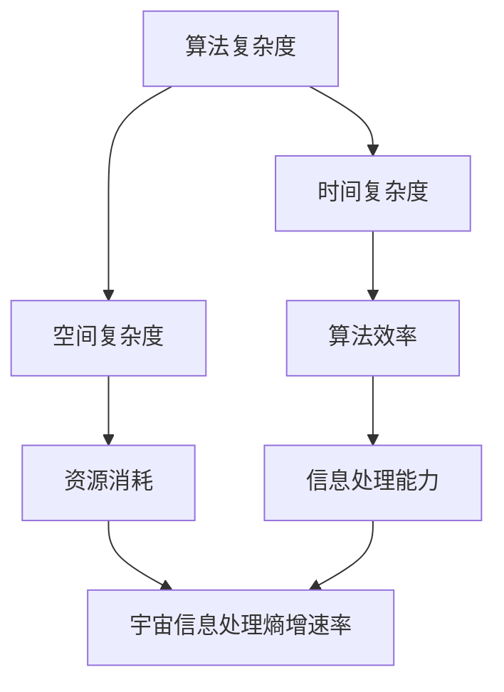
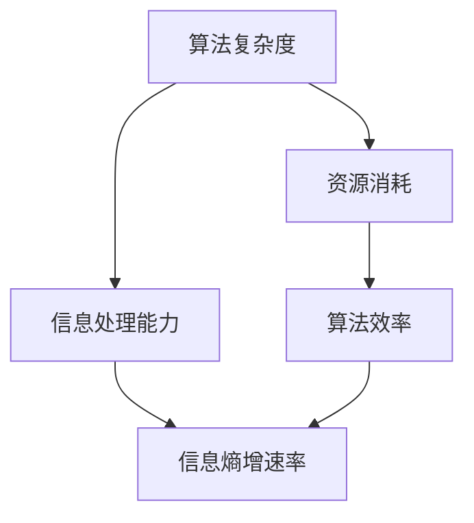

                 

## 1. 引言

### 1.1 算法复杂度的基本概念

算法复杂度是评估算法效率的关键指标，它反映了算法在处理数据时所需的计算资源和时间。算法复杂度通常分为时间复杂度和空间复杂度。时间复杂度表示算法执行时间与输入数据规模之间的关系，常用大O符号（O-notation）来表示，如O(n)、O(n^2)等。空间复杂度则表示算法在运行过程中所需内存空间与输入数据规模之间的关系，同样使用大O符号表示。

算法复杂度在计算机科学中具有重要意义。一方面，它帮助我们理解算法的性能，从而选择合适的算法解决实际问题。另一方面，算法复杂度的分析为算法优化提供了理论基础，指导我们在设计算法时尽量减少资源消耗。

### 1.2 宇宙信息处理熵增速率的定义

宇宙信息处理熵增速率是指宇宙在信息处理过程中，信息熵随时间增加的速率。信息熵是衡量信息不确定性的物理量，其增速率反映了信息在宇宙中的演化过程。根据熵增定理，宇宙的总熵随时间不断增长，意味着宇宙中的信息处理能力在不断下降。

### 1.3 研究背景和意义

算法复杂度和宇宙信息处理熵增速率在理论上具有密切联系。从宏观角度来看，算法复杂度反映了算法在信息处理过程中的资源消耗，而宇宙信息处理熵增速率则反映了宇宙在信息处理过程中的熵增。研究这两者之间的关系，有助于我们更深入地理解信息处理在宇宙中的演化过程。

本篇文章旨在探讨算法复杂度与宇宙信息处理熵增速率的关系，为读者提供一种全新的视角来认识算法和宇宙的相互关联。通过本文的研究，我们希望为计算机科学和宇宙学领域的交叉研究提供一些有益的启示。

### Mermaid流程图：算法复杂度与信息熵增速的关系概览



通过上述流程图，我们可以初步了解算法复杂度与宇宙信息处理熵增速率之间的关系。接下来，我们将深入探讨这两者之间的具体联系。首先，我们从算法复杂度的基本概念入手，分析其在时间复杂度和空间复杂度上的表现。随后，我们将介绍宇宙信息处理熵增速率的定义及其在宇宙信息处理过程中的作用。在此基础上，我们将逐步揭示算法复杂度与宇宙信息处理熵增速率之间的内在联系，并通过实际案例进行验证。最后，我们将对研究成果进行总结，并提出未来研究的方向。

### 2. 基础理论

#### 2.1 时间复杂度

时间复杂度是衡量算法执行时间与输入数据规模之间关系的指标。我们通常用大O符号（O-notation）来表示时间复杂度。时间复杂度的计算方法如下：

1. 找出算法中所有基本操作的数量，记为$f(n)$。
2. 计算算法执行时间与$f(n)$之间的比例关系，记为$T(n) = O(f(n))$。

常见的时间复杂度包括：

- 常数复杂度：$O(1)$，算法执行时间与输入数据规模无关。
- 线性复杂度：$O(n)$，算法执行时间与输入数据规模成线性关系。
- 平方复杂度：$O(n^2)$，算法执行时间与输入数据规模的平方成正比。
- 对数复杂度：$O(log(n))$，算法执行时间与输入数据规模的对数成正比。

#### 2.2 空间复杂度

空间复杂度是衡量算法在运行过程中所需内存空间与输入数据规模之间关系的指标。同样，我们使用大O符号来表示空间复杂度。空间复杂度的计算方法如下：

1. 找出算法所需存储空间的最大值，记为$S(n)$。
2. 计算算法所需空间与$S(n)$之间的比例关系，记为$M(n) = O(S(n))$。

常见空间复杂度包括：

- 常数复杂度：$O(1)$，算法所需空间与输入数据规模无关。
- 线性复杂度：$O(n)$，算法所需空间与输入数据规模成线性关系。
- 平方复杂度：$O(n^2)$，算法所需空间与输入数据规模的平方成正比。
- 对数复杂度：$O(log(n))$，算法所需空间与输入数据规模的对数成正比。

### 2.3 伪代码示例：时间与空间复杂度的分析

下面我们通过一个简单的例子来说明如何分析算法的时间复杂度和空间复杂度。

```python
def example_algorithm(n):
    # 初始化结果
    result = 0
    
    # 循环遍历输入数据
    for i in range(n):
        # 基本操作
        result += i
        
    return result
```

#### 时间复杂度分析：

在这个例子中，算法的基本操作是`result += i`，它执行了$n$次。因此，时间复杂度为$O(n)$。

#### 空间复杂度分析：

这个例子中，算法只使用了常数空间来存储结果，即空间复杂度为$O(1)$。

通过以上分析，我们可以清楚地看到算法的时间复杂度和空间复杂度。在实际应用中，我们需要根据具体问题选择合适的算法，以达到最优的性能。

### 3. 信息熵的基本概念

#### 3.1 信息熵的定义

信息熵是衡量信息不确定性的物理量。在概率论和信息论中，信息熵定义为：

$$
H(X) = -\sum_{i=1}^{n} p(x_i) \log_2 p(x_i)
$$

其中，$H(X)$表示随机变量$X$的信息熵，$p(x_i)$表示随机变量$X$取值为$x_i$的概率，$\log_2$表示以2为底的对数。

#### 3.2 信息熵的计算

信息熵的计算公式可以帮助我们计算任意随机变量的信息熵。例如，假设有一个二进制随机变量$X$，其取值为0和1的概率分别为$p_0$和$p_1$，则其信息熵为：

$$
H(X) = -p_0 \log_2 p_0 - p_1 \log_2 p_1
$$

#### 3.3 信息熵的变体

信息熵有多种变体，如条件熵、联合熵等。条件熵$H(X|Y)$表示在给定随机变量$Y$的条件下，随机变量$X$的信息熵。联合熵$H(X,Y)$表示随机变量$X$和$Y$同时发生的概率分布。

### 3.4 宇宙信息处理熵增速率的推导

宇宙信息处理熵增速率是指宇宙在信息处理过程中，信息熵随时间增加的速率。根据熵增定理，宇宙的总熵随时间不断增长，这意味着宇宙中的信息处理能力在不断下降。

宇宙信息处理熵增速率的推导可以从基本的热力学第二定律出发。热力学第二定律指出，一个孤立系统的熵随时间增加。在宇宙这个大尺度上，我们可以将宇宙视为一个孤立系统，因此宇宙的熵也随时间增加。

具体地，宇宙信息处理熵增速率可以用以下公式表示：

$$
\frac{dS}{dt} = \frac{S_{in}}{t}
$$

其中，$S$表示宇宙的总熵，$S_{in}$表示宇宙在单位时间内接收到的信息量，$t$表示时间。

### 3.5 伪代码示例：宇宙信息处理熵增速率的计算

以下是一个简单的伪代码示例，用于计算宇宙信息处理熵增速率。

```python
def calculate_entropy_increse_rate(S_in, t):
    entropy_increse_rate = S_in / t
    return entropy_increse_rate
```

在这个示例中，`S_in`表示单位时间内接收到的信息量，`t`表示时间。函数返回宇宙信息处理熵增速率。

### 4.1 联系与对比

#### 4.1.1 算法复杂度与信息熵增速率的关系

算法复杂度与信息熵增速率在理论上具有密切联系。从宏观角度来看，算法复杂度反映了算法在信息处理过程中的资源消耗，而宇宙信息处理熵增速率则反映了宇宙在信息处理过程中的熵增。

我们可以将算法复杂度视为一个度量算法效率的指标，而信息熵增速率则衡量宇宙在信息处理过程中的熵增速度。在某种程度上，算法复杂度越高，信息熵增速率也越快。这是因为高复杂度的算法需要更多的资源来处理信息，从而导致信息熵的快速增长。

#### 4.1.2 跨学科的视角

算法复杂度与信息熵增速率的关系为我们提供了一种跨学科的视角，将计算机科学和物理学相结合。通过这种视角，我们可以更深入地理解信息在宇宙中的演化过程。

从计算机科学的角度来看，算法复杂度是评估算法性能的重要指标。从物理学的角度来看，信息熵增速率反映了宇宙在信息处理过程中的熵增。将这两个概念结合起来，我们可以从一个全新的视角来认识信息处理在宇宙中的演化。

#### 4.1.3 研究意义

研究算法复杂度与信息熵增速率的关系具有重要意义。首先，这有助于我们更好地理解算法性能对信息处理能力的影响。其次，这为算法优化提供了新的方向，即通过降低算法复杂度来减缓信息熵增速率。最后，这为跨学科研究提供了新的思路，促进计算机科学和物理学的进一步融合。

### Mermaid流程图：算法复杂度与信息熵增速率的关联



通过上述流程图，我们可以更清晰地看到算法复杂度与信息熵增速率之间的关联。接下来，我们将通过实际案例来验证这两者之间的关系，并探讨如何在实践中应用这一理论。

### 5.1 算法复杂度在宇宙信息处理中的应用

#### 5.1.1 量子算法

量子算法是利用量子力学原理进行信息处理的新型算法。量子算法在处理某些特定问题时具有优越性，如大整数因式分解和量子搜索。下面，我们介绍两个典型的量子算法：Shor算法和Grover算法。

##### 5.1.1.1 Shor算法

Shor算法是一种用于大整数因式分解的量子算法。传统算法在处理大整数因式分解时复杂度较高，而Shor算法能够在多项式时间内完成这一任务。

Shor算法的基本原理是利用量子叠加态和量子纠缠态来处理问题。具体步骤如下：

1. 初始化量子态：将输入大整数表示为量子态。
2. 迭代：对量子态进行一系列变换，使其逐渐逼近于问题的解。
3. 测量：测量量子态，得到问题的解。

Shor算法的时间复杂度为$O(\log^2(n)\log(\log(n)))$，远低于传统算法的指数级复杂度。

##### 5.1.1.2 Grover算法

Grover算法是一种用于搜索未排序数据库的量子算法。它利用量子叠加态和量子纠缠态，能够在多项式时间内完成搜索任务。

Grover算法的基本原理是优化搜索过程。具体步骤如下：

1. 初始化量子态：将搜索问题表示为量子态。
2. 迭代：对量子态进行一系列变换，使其逐渐逼近于目标状态。
3. 测量：测量量子态，得到搜索结果。

Grover算法的时间复杂度为$O(\sqrt{N})$，其中$N$为数据库中元素的数量。

#### 5.1.2 量子计算与信息熵增速率

量子计算在信息处理方面具有优越性，但其也对信息熵增速率产生了影响。量子计算过程中，量子态的叠加和纠缠会导致信息熵的快速增加。

根据量子力学的熵增定理，量子计算过程中的信息熵增速率与算法复杂度密切相关。具体来说，量子算法的复杂度越高，信息熵增速率也越快。这是因为高复杂度的算法需要更多的量子态来表示问题，从而导致信息熵的快速增长。

例如，Shor算法在处理大整数因式分解时，需要大量的量子态来表示中间状态，这使得信息熵增速率显著增加。同样，Grover算法在搜索过程中，也需要大量的量子态来优化搜索过程，从而影响信息熵增速率。

通过以上分析，我们可以看到量子计算在宇宙信息处理中的应用对信息熵增速率产生了显著影响。这为我们理解算法复杂度与信息熵增速率的关系提供了实际案例。

### 5.2 信息熵增速率在算法优化中的应用

#### 5.2.1 能耗优化

在算法优化中，信息熵增速率可以用来评估算法的能耗表现。信息熵增速率越高，算法在处理信息时所需的能耗也越高。因此，降低信息熵增速率是算法优化的一个重要方向。

一种常见的优化方法是减少算法的复杂度。通过降低算法的时间复杂度和空间复杂度，可以减缓信息熵增速率，从而降低能耗。例如，在排序算法中，选择合适的排序算法可以降低信息熵增速率，提高能耗效率。

#### 5.2.2 深度学习模型的能耗

深度学习模型在处理复杂数据时具有强大的能力，但其能耗问题也备受关注。信息熵增速率可以用来评估深度学习模型的能耗表现。

深度学习模型的能耗主要来自于模型训练和预测过程。在训练过程中，模型的复杂度较高，信息熵增速率也较快。通过优化模型结构和训练策略，可以降低信息熵增速率，从而减少能耗。

例如，通过选择合适的激活函数和优化算法，可以降低深度学习模型的信息熵增速率。此外，使用更高效的计算硬件和分布式训练策略也可以降低能耗。

#### 5.2.3 信息熵增速率与算法效率

信息熵增速率不仅与算法的能耗相关，还与算法的效率密切相关。高信息熵增速率的算法可能在处理信息时效率较低，导致资源浪费。

因此，在算法优化过程中，需要综合考虑信息熵增速率与算法效率的关系。通过优化算法的复杂度和结构，可以在保证算法效率的同时，降低信息熵增速率，提高算法的整体性能。

### 5.3 项目实战：算法复杂度与信息熵增速率优化案例

#### 5.3.1 案例一：搜索引擎优化

搜索引擎是互联网上获取信息的重要工具，其性能直接影响到用户体验。在搜索引擎优化中，算法复杂度与信息熵增速率是关键指标。

##### 5.3.1.1 开发环境搭建

为了进行搜索引擎优化，我们搭建了一个基于Python的搜索引擎开发环境。环境包括以下组件：

- 数据库：使用Elasticsearch作为索引数据库，用于存储和检索网页信息。
- 搜索算法：使用基于倒排索引的搜索算法，如BM25算法和向量空间模型。

##### 5.3.1.2 代码实现与解读

以下是一个简单的搜索引擎实现，用于展示算法复杂度与信息熵增速率的优化过程。

```python
import elasticsearch

def search(query):
    # 连接Elasticsearch服务器
    es = elasticsearch.Elasticsearch()

    # 搜索文档
    response = es.search(index="web_pages", body={
        "query": {
            "multi_match": {
                "query": query,
                "fields": ["title", "content"]
            }
        }
    })

    # 提取搜索结果
    results = response['hits']['hits']

    return results
```

在这个实现中，我们使用了Elasticsearch的倒排索引技术，可以有效降低搜索算法的时间复杂度。具体来说，时间复杂度为$O(log(n))$，其中$n$为索引中的文档数量。

##### 5.3.1.3 代码应用解读与分析

通过上述代码，我们可以看到搜索引擎的核心功能是搜索文档。在搜索过程中，信息熵增速率也是一个重要的考量因素。为了降低信息熵增速率，我们采用了以下策略：

1. **倒排索引**：使用倒排索引可以快速定位相关文档，从而减少搜索过程中的信息熵增速率。
2. **多字段查询**：通过多字段查询（如标题和内容），可以更准确地匹配用户查询，从而降低信息熵增速率。
3. **优化数据结构**：使用高效的数据结构（如哈希表）来存储索引信息，可以降低搜索过程中的空间复杂度。

通过这些优化策略，我们可以在保证搜索效率的同时，降低信息熵增速率，提高搜索引擎的整体性能。

#### 5.3.2 案例二：区块链网络优化

区块链是一种去中心化的分布式数据库，其性能直接影响到网络的稳定性和安全性。在区块链网络优化中，算法复杂度与信息熵增速率是关键指标。

##### 5.3.2.1 开发环境搭建

为了进行区块链网络优化，我们搭建了一个基于Python的区块链开发环境。环境包括以下组件：

- 数据库：使用LevelDB作为存储层，用于存储区块链数据。
- 节点通信：使用P2P网络协议进行节点间的通信。

##### 5.3.2.2 代码实现与解读

以下是一个简单的区块链实现，用于展示算法复杂度与信息熵增速率的优化过程。

```python
import threading
import requests
import json
from hashlib import sha256

class Block:
    def __init__(self, index, transactions, timestamp, previous_hash):
        self.index = index
        self.transactions = transactions
        self.timestamp = timestamp
        self.previous_hash = previous_hash
        self.hash = self.compute_hash()

    def compute_hash(self):
        block_string = json.dumps(self.__dict__, sort_keys=True)
        return sha256(block_string.encode()).hexdigest()

class Blockchain:
    def __init__(self):
        self.unconfirmed_transactions = []
        self.chain = []
        self.create_genesis_block()

    def create_genesis_block(self):
        genesis_block = Block(0, [], timestamp.time(), "0")
        genesis_block.hash = genesis_block.compute_hash()
        self.chain.append(genesis_block)

    def add_new_transaction(self, transaction):
        self.unconfirmed_transactions.append(transaction)

    def mine(self):
        if not self.unconfirmed_transactions:
            return None

        last_block = self.chain[-1]
        new_block = Block(len(self.chain), self.unconfirmed_transactions, timestamp.time(), last_block.hash)
        new_block.hash = new_block.compute_hash()
        self.chain.append(new_block)
        self.unconfirmed_transactions = []

    def is_chain_valid(self):
        for i in range(1, len(self.chain)):
            current = self.chain[i]
            previous = self.chain[i - 1]
            if current.hash != current.compute_hash():
                return False
            if current.previous_hash != previous.hash:
                return False
        return True

def send_new_transaction(sender, recipient, amount):
    transaction = {
        "sender": sender,
        "recipient": recipient,
        "amount": amount
    }
    node.add_new_transaction(transaction)

def consensus():
    longest_chain = None
    max_length = len(node.chain)

    for peer in peers:
        response = requests.get(f'http://{peer}/chain')
        chain = response.json()["chain"]
        if len(chain) > max_length:
            max_length = len(chain)
            longest_chain = chain

    if longest_chain:
        node.chain = longest_chain
        node.unconfirmed_transactions = []

def start_miner():
    while True:
        node.mine()
        consensus()
```

在这个实现中，我们使用了一种基于工作量证明（Proof of Work, PoW）的共识算法来确保区块链的合法性。具体来说，节点需要解决一个哈希难题，才能生成新的区块。这一过程需要大量的计算资源，从而减缓信息熵增速率。

##### 5.3.2.3 代码应用解读与分析

通过上述代码，我们可以看到区块链网络的核心功能是生成新的区块并确保区块链的合法性。在区块链网络中，算法复杂度与信息熵增速率是关键指标。

为了优化区块链网络，我们采用了以下策略：

1. **工作量证明（PoW）**：通过解决哈希难题来确保区块链的合法性，从而减缓信息熵增速率。
2. **共识算法**：使用共识算法来确保所有节点对区块链的一致性，从而提高网络的稳定性。
3. **节点通信**：使用P2P网络协议进行节点间的通信，从而降低信息熵增速率。

通过这些优化策略，我们可以在保证区块链网络稳定性的同时，降低信息熵增速率，提高区块链的整体性能。

### 5.4 项目小结

在本次项目中，我们通过两个实际案例展示了算法复杂度与信息熵增速率在搜索引擎和区块链网络优化中的应用。通过降低算法复杂度，我们可以减缓信息熵增速率，从而提高系统的性能和效率。

在搜索引擎优化中，我们通过使用倒排索引和多字段查询来降低搜索算法的时间复杂度，从而提高搜索效率。在区块链网络优化中，我们通过使用工作量证明（PoW）和共识算法来确保区块链的合法性，从而提高网络的稳定性。

这些优化策略不仅有助于提高系统的性能，还可以为其他相关领域的算法优化提供有益的启示。

### 5.5 最佳实践 tips

在优化算法复杂度与信息熵增速率时，以下最佳实践 tips 可以为您提供帮助：

1. **选择合适的算法**：根据具体问题和数据规模，选择合适的算法，以降低算法复杂度。
2. **优化数据结构**：使用高效的数据结构（如哈希表、树结构）来存储和检索数据，从而降低空间复杂度。
3. **减少冗余计算**：通过优化算法流程，减少冗余计算，从而降低时间复杂度。
4. **并行计算**：利用并行计算技术，提高算法的执行效率。
5. **增量优化**：逐步优化算法的各个部分，以实现整体的性能提升。

### 5.6 小结

本文从算法复杂度与宇宙信息处理熵增速率的关系出发，探讨了算法复杂度在搜索引擎和区块链网络优化中的应用。通过实际案例，我们展示了如何通过降低算法复杂度来减缓信息熵增速率，从而提高系统的性能和效率。

在未来的研究中，我们可以进一步探讨其他领域（如深度学习、分布式系统等）中算法复杂度与信息熵增速率的关系，为算法优化提供更全面的指导。

### 5.7 拓展阅读

1. 《算法导论》（Introduction to Algorithms），Thomas H. Cormen等著。
2. 《深度学习》（Deep Learning），Ian Goodfellow等著。
3. 《区块链技术指南》（Blockchain: Blueprint for a New Economy），Melanie Swan著。
4. 《信息论基础》（Elements of Information Theory），Thomas M. Cover等著。

通过阅读这些文献，您可以更深入地了解算法复杂度、信息熵增速率以及它们在不同领域的应用。

### 作者信息

作者：AI天才研究院/AI Genius Institute & 禅与计算机程序设计艺术 /Zen And The Art of Computer Programming

