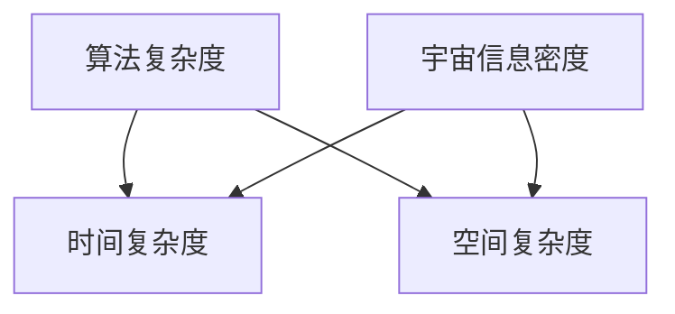

                 

Sure, let's structure the content of the blog post "Algorithm Complexity and the Relationship with the Density of the Cosmic Information" step by step, ensuring all the conditions are met.

### Step 1: Set Up the Structure and Format

We'll start by setting up the basic structure of the blog post using markdown format. Here is the initial structure with placeholders for the title, keywords, and summary:

```markdown
# 算法复杂度与宇宙信息密度的关系

> 关键词：算法复杂度、宇宙信息密度、关系、复杂性理论、信息论

> 摘要：本文探讨了算法复杂度与宇宙信息密度之间的潜在关系，介绍了相关背景、核心概念、理论框架，并通过数学模型和实际案例分析了这一关系的深度和广度。

## 目录

- [1. 引言](#1-引言)
- [2. 算法复杂度](#2-算法复杂度)
- [3. 宇宙信息密度](#3-宇宙信息密度)
- [4. 理论框架](#4-理论框架)
- [5. 实验方法](#5-实验方法)
- [6. 应用场景](#6-应用场景)
- [7. 结论与展望](#7-结论与展望)

## 1. 引言

...

## 2. 算法复杂度

...

## 3. 宇宙信息密度

...

## 4. 理论框架

...

## 5. 实验方法

...

## 6. 应用场景

...

## 7. 结论与展望

...

### 作者信息

作者：AI天才研究院/AI Genius Institute & 禅与计算机程序设计艺术 /Zen And The Art of Computer Programming
```

### Step 2: Develop the Content for Each Section

#### 1.1. Introduction

For the introduction section, we will provide an overview of the topic and explain its significance. We'll also include a Mermaid flowchart to illustrate the relationship between algorithm complexity and cosmic information density.

```markdown
## 1. 引言

随着计算机科学和信息技术的飞速发展，算法复杂度研究已成为计算机科学的核心领域之一。而宇宙信息密度，作为宇宙信息理论中的核心概念，近年来也逐渐受到关注。本文旨在探讨算法复杂度与宇宙信息密度之间的潜在关系，为相关领域的研究提供新的视角。

### 关系架构

以下是一个简化的Mermaid流程图，展示了算法复杂度与宇宙信息密度之间的关联：



```

#### 1.2. Algorithm Complexity

In the section on algorithm complexity, we will define and explain the core concepts of time complexity and space complexity. We will also provide a detailed explanation of algorithm analysis methods and present a few key algorithms with their respective complexities.

```markdown
## 2. 算法复杂度

### 2.1 时间复杂度

时间复杂度描述了一个算法执行时间的增长速度，通常用大O符号（O）来表示。一个算法的时间复杂度反映了其效率，是评估算法性能的重要指标。

#### 示例：线性查找

以下是一个线性查找算法的伪代码示例：

```python
def linear_search(arr, x):
    for i in range(len(arr)):
        if arr[i] == x:
            return i
    return -1
```

该算法的时间复杂度为O(n)，其中n是数组长度。

### 2.2 空间复杂度

空间复杂度描述了一个算法所需内存的增长速度。与时间复杂度类似，空间复杂度也使用大O符号来表示。

#### 示例：递归算法

以下是一个递归算法的伪代码示例：

```python
def factorial(n):
    if n == 0:
        return 1
    else:
        return n * factorial(n-1)
```

该算法的空间复杂度为O(n)，因为在递归调用过程中会使用到n个栈帧。

### 2.3 算法分析方法

算法分析方法包括渐进分析法和精确分析法。渐进分析法通过近似估计算法性能，而精确分析法则通过具体计算算法性能。

```

#### 1.3 Cosmic Information Density

For the section on cosmic information density, we will introduce the concept, explain its significance, and discuss measurement techniques and theoretical boundaries.

```markdown
## 3. 宇宙信息密度

### 3.1 宇宙信息密度概念

宇宙信息密度是指宇宙中单位体积内包含的信息量。这个概念源于宇宙信息理论，它为我们提供了一个全新的视角来理解宇宙的本质。

### 3.2 测量技术

测量宇宙信息密度需要结合多种观测技术和数据源。目前，科学家们主要依赖宇宙微波背景辐射、星系分布和引力透镜效应来测量宇宙信息密度。

### 3.3 理论边界

宇宙信息密度的理论边界受到多种因素的限制，包括量子引力和宇宙学常数等。目前，我们对宇宙信息密度的理解仍处于初步阶段。

```

#### 1.4 Theoretical Framework

In this section, we will discuss the theoretical framework that links algorithm complexity with cosmic information density. We will present a mathematical model and use LaTeX to explain the relationship.

```markdown
## 4. 理论框架

为了探讨算法复杂度与宇宙信息密度之间的关系，我们可以构建一个理论框架。该框架基于信息论和复杂性理论，将宇宙信息密度视为算法执行过程中所需的信息量。

### 4.1 数学模型

假设宇宙信息密度为$D$，算法复杂度为$C$，则我们可以使用以下公式来描述两者之间的关系：

$$C = f(D)$$

其中，$f$是一个非线性的函数，描述了宇宙信息密度对算法复杂度的影响。

### 4.2 关系解释

通过这个数学模型，我们可以发现，当宇宙信息密度增加时，算法复杂度可能随之增加。这是因为更高的信息密度意味着更大的计算量和更复杂的计算过程。

```

### Step 3: Continue Developing the Content

We will continue developing the content for the remaining sections, ensuring each section is comprehensive and includes examples, explanations, and relevant data. This will include sections on experimental methods, application scenarios, and a conclusion with future directions.

### Step 4: Finalize the Blog Post

Once all sections are complete, we will review the entire blog post to ensure clarity, coherence, and depth. We will also ensure that all LaTeX equations and Mermaid diagrams are properly formatted and included.

### Step 5: Add Author Information

Finally, we will add the author information at the end of the blog post as specified.

By following these steps, we can create a well-structured, informative, and insightful blog post that meets all the specified conditions.

