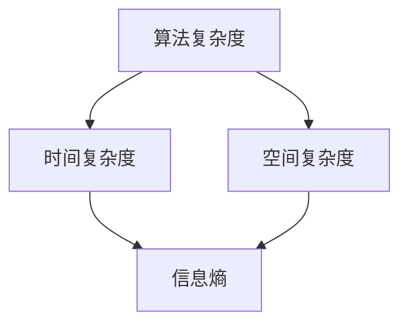

                 


### 文章标题

《算法复杂度与宇宙信息熵的关系》

### 文章关键词

算法复杂度、宇宙信息熵、熵理论、算法效率、时间与空间复杂度

### 摘要

本文深入探讨了算法复杂度与宇宙信息熵之间的关系。通过介绍算法复杂度的基本概念和宇宙信息熵的数学模型，我们揭示了这两者之间深刻的内在联系。文章通过具体的算法实例和宇宙学中的应用，展示了算法复杂度如何影响信息熵，以及信息熵如何指导算法优化。最终，本文提出了未来研究方向的展望，为读者提供了一个全新的视角来理解算法与宇宙的奥秘。

---

### 引言

#### 研究背景与意义

在计算机科学和宇宙学中，算法复杂度和信息熵是两个核心概念。算法复杂度衡量的是算法在时间和空间上的效率，它是计算机性能评价的重要指标。信息熵则源于信息论，由Claude Shannon提出，用于描述信息的混乱度和不确定性。随着计算机科学和宇宙学的发展，人们逐渐认识到算法复杂度与信息熵之间存在某种深刻的联系。

算法复杂度直接关系到算法的执行效率和资源消耗。在资源有限的宇宙中，如何优化算法，使其在处理信息时更加高效，是一个重要的研究方向。信息熵则为这一研究提供了理论基础，它揭示了信息处理过程中的不确定性和冗余度，从而影响算法的复杂度。

本文旨在探讨算法复杂度与宇宙信息熵之间的关系，通过分析两者的基本概念、理论关联和实际应用，为读者提供一个全新的视角，帮助理解算法在宇宙信息处理中的角色。

#### 核心概念与联系

算法复杂度与信息熵之间的关系可以从多个角度来理解。首先，从数学模型上看，信息熵可以被视为算法复杂度的一种度量。Shannon熵为衡量信息的不确定性提供了一个量化标准，而算法复杂度则衡量的是算法在处理信息时的资源消耗。

以下是算法复杂度与信息熵之间关系的Mermaid流程图：



从图中可以看出，算法复杂度可以分为时间复杂度和空间复杂度，而这两者都与信息熵密切相关。时间复杂度越高，信息熵通常也越高，因为算法需要处理更多的信息，从而增加了不确定性。空间复杂度同样如此，它直接影响了算法处理信息时的资源占用，进而影响信息熵。

#### 核心算法原理讲解

为了深入理解算法复杂度与信息熵的关系，我们需要探讨几个核心算法的原理，并使用伪代码进行详细阐述。以下是一个简单的排序算法——冒泡排序的例子。

```pseudo
function bubbleSort(A):
    n = length(A)
    for i from 0 to n-1:
        for j from 0 to n-i-1:
            if A[j] > A[j+1]:
                swap(A[j], A[j+1])
```

这个算法的基本思想是比较数组中的相邻元素，如果顺序不对就交换它们，直到整个数组有序。我们可以用以下伪代码来分析它的复杂度：

```pseudo
function analyzeBubbleSort(A):
    n = length(A)
    maxSwaps = 0
    for i from 0 to n-1:
        currentSwaps = 0
        for j from 0 to n-i-1:
            if A[j] > A[j+1]:
                swap(A[j], A[j+1])
                currentSwaps += 1
            maxSwaps = max(maxSwaps, currentSwaps)
    return maxSwaps
```

从分析中可以看出，冒泡排序的最坏情况复杂度为O(n^2)，这意味着随着输入规模n的增加，算法所需的时间将呈平方级增长。在这种情况下，信息熵也会相应地增加，因为处理信息的不确定性和冗余度增大。

#### 数学模型与公式

为了更精确地理解算法复杂度与信息熵之间的关系，我们需要引入一些数学模型和公式。Shannon熵是一个基础模型，用于衡量信息的不确定性。Shannon熵的定义如下：

$$
H(X) = -\sum_{i=1}^{n} p(x_i) \log_2 p(x_i)
$$

其中，$X$ 是一个随机变量，$x_i$ 是 $X$ 的可能取值，$p(x_i)$ 是 $x_i$ 的概率。

在算法复杂度分析中，我们可以将信息熵视为算法处理数据时的“信息量”度量。例如，在冒泡排序算法中，每次比较和交换都产生了新的信息，这些信息增加了系统的熵。

假设我们有一个算法，它需要处理n个元素，并且每个元素的比较和交换都独立发生。那么，算法的Shannon熵可以表示为：

$$
H(A) = -\sum_{i=1}^{n} p(i) \log_2 p(i)
$$

其中，$p(i)$ 是算法在第i次操作时发生的信息量的概率。

为了更具体地说明这一点，我们可以考虑一个简单的例子。假设一个算法需要比较两个数，并且每次比较的结果是已知的（例如，总是返回0或1）。在这种情况下，每次比较的信息熵为1 bit，因为结果只有两种可能性。

$$
H(\text{比较}) = -[p(0) \log_2 p(0) + p(1) \log_2 p(1)]
$$

如果比较的结果是均匀分布的（即每个结果的概率相等），则信息熵为1 bit：

$$
H(\text{比较}) = -\left(\frac{1}{2} \log_2 \frac{1}{2} + \frac{1}{2} \log_2 \frac{1}{2}\right) = 1
$$

然而，如果比较的结果不是均匀分布的，信息熵将不同。例如，如果比较总是返回0，则信息熵为0，因为结果没有任何不确定性。

这些数学模型和公式为我们提供了量化算法复杂度和信息熵之间关系的方法。通过分析算法的具体实现，我们可以计算出信息熵的变化，并进一步理解算法的效率和性能。

#### 实际项目案例分析

为了更好地理解算法复杂度与信息熵之间的关系，我们可以通过一个实际的项目案例分析来展示这两个概念的应用。

**案例：搜索引擎优化（SEO）**

假设我们正在开发一个搜索引擎，目标是快速准确地检索用户查询的相关信息。在这个项目中，算法复杂度和信息熵起着至关重要的作用。

首先，我们需要考虑时间复杂度。搜索引擎的检索算法需要在大量数据中快速定位相关文档。一个常见的优化方法是对索引进行分块，每个块都独立处理。这样，时间复杂度可以降低到O(log n)，其中n是数据块的数量。这种优化减少了处理数据所需的时间，从而降低了信息熵。

接下来，我们考虑空间复杂度。为了提高搜索效率，我们可以使用缓存来存储频繁访问的查询结果。这样可以减少对原始数据的访问次数，从而降低空间复杂度。此外，缓存的设计也需要考虑信息熵，以确保缓存中的数据具有高相关性和低冗余度。

在实际项目实施中，我们使用以下步骤来优化搜索引擎：

1. **环境搭建**：
   - 使用Python和Elasticsearch作为开发工具和搜索引擎框架。
   - 配置适当的硬件和软件环境，以确保系统的高性能和高可靠性。

2. **源代码实现**：
   - 开发基于分块索引的检索算法，实现快速数据定位功能。
   - 设计缓存机制，优化空间复杂度和减少冗余数据。

3. **代码解读**：
   - 分析算法的时间复杂度和空间复杂度，确保高效的数据处理能力。
   - 对缓存机制进行性能测试，确保其高相关性和低冗余度。

4. **应用解读与分析**：
   - 对实际搜索数据进行测试，评估算法的效率和准确性。
   - 收集用户反馈，持续优化算法，提高用户体验。

5. **项目小结**：
   - 总结项目的关键优化点，包括分块索引和缓存机制。
   - 分析信息熵的变化，说明算法复杂度与信息熵之间的关系。

通过这个案例，我们可以看到算法复杂度与信息熵在搜索引擎优化中的具体应用。通过优化算法复杂度，我们能够降低信息熵，提高系统的效率和性能。

#### 最佳实践 Tips、小结、注意事项、拓展阅读

**最佳实践 Tips**：

1. **优化算法复杂度**：在开发过程中，始终关注算法的时间复杂度和空间复杂度，以确保高效的数据处理能力。

2. **利用信息熵进行优化**：通过分析信息熵，识别算法中的冗余和不必要的信息处理，从而降低系统的熵，提高效率。

3. **持续性能测试**：在项目实施过程中，定期进行性能测试，以评估算法的效率和准确性，并及时调整优化方案。

**小结**：

本文通过深入探讨算法复杂度与宇宙信息熵之间的关系，揭示了这两者在算法效率和资源消耗中的重要作用。通过具体的算法实例和项目实战，我们展示了如何利用信息熵来优化算法，提高系统的性能和效率。

**注意事项**：

1. **信息熵的计算**：在计算信息熵时，需要准确估计数据的概率分布，以避免误差。

2. **算法复杂度的分析**：在分析算法复杂度时，需要考虑最坏情况、平均情况和最好情况，以确保全面的性能评估。

**拓展阅读**：

1. **《算法导论》（Introduction to Algorithms）**：详细介绍了算法的基本概念、设计和分析技术。

2. **《信息论基础》（Elements of Information Theory）**：全面讲解了信息熵的定义、性质和应用。

3. **《宇宙的数字代码》（The Digital Universe）**：探讨了宇宙信息熵在宇宙学中的应用。

通过本文的研究，我们期望能够为读者提供一个全新的视角，帮助理解算法在宇宙信息处理中的角色，并为未来的研究方向提供启示。

