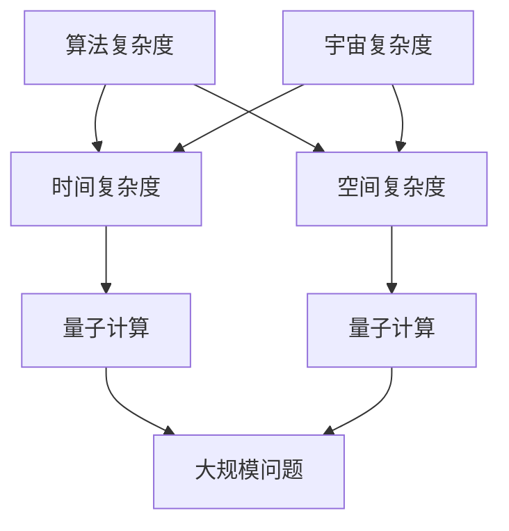
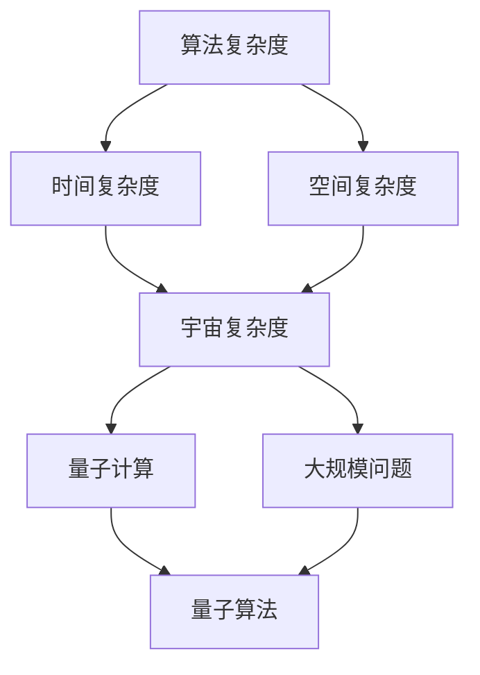

                 

### 文章标题

《算法复杂度与宇宙复杂度等级的关系》

### 关键词

算法复杂度，宇宙复杂度，时间复杂度，空间复杂度，数学模型，项目实战

### 摘要

本文深入探讨了算法复杂度和宇宙复杂度之间的关系，从核心概念到实际应用，全面分析了这两个复杂度等级在计算机科学和宇宙学中的重要性。通过详细的伪代码示例、数学模型讲解和实际项目分析，文章揭示了算法复杂度与宇宙复杂度之间的深层联系，为读者提供了对这一领域的深刻理解。本文旨在为计算机科学家、算法工程师以及对宇宙学感兴趣的专业人士提供有价值的参考，帮助他们在复杂问题的解决中找到更高效的路径。

### 引言

在计算机科学和宇宙学中，复杂度是一个关键概念，它帮助我们理解问题的难度和解决方案的效率。本文将探讨两种不同的复杂度：算法复杂度和宇宙复杂度。算法复杂度通常指的是一个算法在解决特定问题时所需的时间和空间资源，而宇宙复杂度则试图捕捉宇宙中的信息量。这两个概念看似不同，但在某些方面，它们之间存在着深刻的联系。

本文的目的是通过详细的分析和实例，揭示算法复杂度与宇宙复杂度之间的关系，帮助读者更好地理解这两个复杂度等级的本质和它们在各自领域中的应用。我们将从核心概念入手，逐步深入到具体的算法原理和数学模型，并通过实际项目案例展示复杂度的应用。希望通过本文的探讨，能够为读者提供一个新的视角，以更全面和深刻的方式看待复杂度问题。

### 核心概念与联系

在深入探讨算法复杂度和宇宙复杂度之前，我们需要先了解它们各自的定义和核心概念。

#### 算法复杂度

算法复杂度是衡量算法优劣的重要指标，它主要关注算法在时间和空间上的资源消耗。具体来说，算法复杂度分为时间复杂度和空间复杂度。

- **时间复杂度**：描述算法执行所需的时间，通常用大O符号表示。例如，一个算法的时间复杂度为 \(O(n)\)，意味着随着输入规模 \(n\) 的增加，算法所需的时间也线性增加。

- **空间复杂度**：描述算法执行过程中所需的最大存储空间，同样使用大O符号表示。例如，一个算法的空间复杂度为 \(O(1)\)，表示无论输入规模如何，所需的空间都保持不变。

算法复杂度的核心在于帮助我们评估算法在不同规模问题上的效率，从而选择合适的算法解决问题。

#### 宇宙复杂度

宇宙复杂度则是一个更抽象和广泛的概念，它试图捕捉宇宙中的信息量。宇宙复杂度通常与量子信息和量子计算相关，它衡量的是在量子计算中处理信息的复杂度。

- **宇宙复杂度的定义**：宇宙复杂度可以理解为处理一个信息所需的最小物理资源量，包括时间、空间和能量。它不仅考虑了信息处理的时间，还包括了处理信息所需的物质和能量。

- **宇宙复杂度与算法复杂度的联系**：尽管宇宙复杂度和算法复杂度在定义和应用上有所不同，但它们之间存在一定的联系。算法复杂度关注的是经典计算中的资源消耗，而宇宙复杂度则拓展到了量子计算和宇宙尺度。在量子计算中，某些算法可能表现出比经典算法更高的宇宙复杂度，这意味着在处理大规模问题时，量子计算可能需要更多的物理资源。

为了更直观地理解算法复杂度和宇宙复杂度之间的关系，我们可以使用Mermaid流程图来展示它们的核心概念和联系。



在这个流程图中，算法复杂度分解为时间复杂度和空间复杂度，而宇宙复杂度则与这两者都有联系。时间复杂度和空间复杂度都是算法复杂度的一部分，而宇宙复杂度则扩展到了量子计算和宇宙尺度。

通过这个流程图，我们可以看到算法复杂度和宇宙复杂度之间的交叉和互动。在量子计算领域，算法复杂度和宇宙复杂度变得更加紧密，因为量子算法可能需要更多的物理资源来处理信息。这种联系为我们提供了新的视角，以更全面地看待复杂度问题。

#### Mermaid 流程图展示核心概念关系

为了更直观地展示算法复杂度和宇宙复杂度之间的关系，我们可以使用Mermaid流程图。以下是一个简化的Mermaid流程图示例，用于展示核心概念之间的关系：



在这个流程图中，我们定义了以下几个核心概念：

- **算法复杂度**：作为整个流程的起点，它分为时间复杂度和空间复杂度。
- **时间复杂度**：与算法执行的时间相关，是算法复杂度的一部分。
- **空间复杂度**：与算法执行过程中所需的存储空间相关，也是算法复杂度的一部分。
- **宇宙复杂度**：作为算法复杂度和量子计算的联系，扩展了我们对复杂度的理解。
- **量子计算**：量子计算中的算法可能表现出比经典算法更高的宇宙复杂度。
- **大规模问题**：宇宙复杂度关注的是大规模问题在量子计算中的应用。

这个流程图帮助我们更清晰地理解算法复杂度和宇宙复杂度之间的关系。通过它，我们可以看到算法复杂度如何通过时间复杂度和空间复杂度与宇宙复杂度相联系，以及量子计算和大规模问题如何影响宇宙复杂度。

总的来说，通过引入Mermaid流程图，我们可以直观地展示算法复杂度和宇宙复杂度的核心概念及其相互关系。这不仅帮助我们更好地理解这些概念，也为进一步探讨它们的应用提供了坚实的基础。

#### 核心算法原理讲解

在了解了算法复杂度和宇宙复杂度的核心概念后，接下来我们将深入探讨这些复杂度的具体算法原理。通过伪代码示例和详细讲解，我们将帮助读者更好地理解这些算法的运行机制和复杂度分析。

##### 时间复杂度原理讲解

时间复杂度是衡量算法效率的重要指标，它描述了算法在处理输入规模 \(n\) 时所需的时间。为了更好地理解时间复杂度，我们可以通过一个简单的伪代码示例来分析。

**伪代码示例：计算两个整数的和**

```python
function sum(a, b):
    result = 0
    for i from 1 to a:
        result = result + 1
    for j from 1 to b:
        result = result + 1
    return result
```

在这个示例中，我们有两个嵌套的循环，每个循环都会执行 \(a\) 和 \(b\) 次操作。这个算法的时间复杂度可以表示为 \(O(a + b)\)。这是因为无论 \(a\) 和 \(b\) 的具体值是多少，算法所需的时间都与其和成正比。

更一般的，如果算法包含多个嵌套循环，每个循环的执行次数分别为 \(T_1, T_2, ..., T_k\)，则总的时间复杂度可以表示为：

$$
T(n) = O(T_1(n) + T_2(n) + ... + T_k(n))
$$

这个公式告诉我们，算法的时间复杂度取决于各个子部分的复杂度之和。

**详细讲解**：

1. **基本操作和执行次数**：在算法中，基本操作是影响时间复杂度的关键。每个基本操作（如加法、乘法、赋值等）的执行次数决定了算法的时间复杂度。

2. **嵌套循环**：在嵌套循环中，每个外层循环的迭代次数会影响内层循环的迭代次数。因此，我们需要对每个循环的执行次数进行累加，以计算整个算法的时间复杂度。

3. **大O符号的使用**：大O符号用于表示算法的时间复杂度。例如，\(O(n)\)、\(O(n^2)\)、\(O(log n)\) 等。这些符号帮助我们简化对复杂度的描述，以便更方便地比较不同算法的效率。

通过以上分析，我们可以得出结论：算法的时间复杂度取决于其基本操作的执行次数和嵌套结构。了解这些原理有助于我们设计更高效和优化的算法。

##### 空间复杂度原理讲解

空间复杂度是衡量算法在执行过程中所需存储空间的重要指标。与时间复杂度类似，空间复杂度也分为两种主要类型：辅助空间复杂度和总空间复杂度。

**伪代码示例：计算斐波那契数列**

```python
function fibonacci(n):
    if n <= 0:
        return 0
    if n == 1:
        return 1
    a = 0
    b = 1
    for i from 2 to n:
        temp = a + b
        a = b
        b = temp
    return b
```

在这个示例中，我们使用了一个简单的循环来计算斐波那契数列。这个算法的空间复杂度主要涉及变量 `a`、`b` 和 `temp` 的存储空间。这些变量的存储空间是固定的，不随输入规模 \(n\) 的变化而变化，因此其空间复杂度为 \(O(1)\)。

更一般地，如果算法中使用了多个变量，并且这些变量的存储空间与输入规模 \(n\) 相关，则总的空间复杂度可以表示为：

$$
S(n) = O(c_1 + c_2 + ... + c_m)
$$

其中，\(c_1, c_2, ..., c_m\) 分别是各个变量的存储空间。

**详细讲解**：

1. **变量存储空间**：在算法中，变量是影响空间复杂度的关键因素。我们需要考虑每个变量所需的存储空间，并将其累加，以计算总的空间复杂度。

2. **辅助空间复杂度**：辅助空间复杂度指的是除了输入数据之外，算法所需额外存储的空间。这通常包括临时变量、辅助数据结构等。

3. **总空间复杂度**：总空间复杂度是辅助空间复杂度和输入数据空间复杂度的总和。对于大多数算法，输入数据的空间复杂度可以视为常数，因此总空间复杂度主要由辅助空间复杂度决定。

通过以上分析，我们可以得出结论：算法的空间复杂度取决于其使用的变量和辅助数据结构。理解这些原理有助于我们优化算法的空间使用，提高其效率。

##### 宇宙复杂度原理讲解

宇宙复杂度是一个更为抽象和广泛的概念，它涉及算法在量子计算和宇宙尺度上的资源消耗。宇宙复杂度的核心在于衡量处理信息所需的最小物理资源量，包括时间、空间和能量。

**伪代码示例：量子计算的简单实现**

```python
function quantum_computing(input_state):
    # 假设输入状态是一个量子比特序列
    # 应用量子门操作
    for gate in quantum_gates:
        apply(gate)
    # 测量量子比特
    output_state = measure()
    return output_state
```

在这个示例中，我们展示了一个简单的量子计算过程，包括量子门操作和量子比特测量。这个算法的宇宙复杂度不仅取决于量子门操作的数量，还包括量子比特测量所需的物理资源。

**详细讲解**：

1. **量子门操作**：量子门是量子计算中的基本操作，它们作用于量子比特，改变其状态。量子门操作的复杂度通常取决于操作的数量和类型。

2. **量子比特测量**：测量是量子计算中的一个关键步骤，它将量子比特的状态投影到经典状态。测量过程需要消耗物理资源，如时间、空间和能量。

3. **宇宙复杂度公式**：宇宙复杂度可以用以下公式表示：

$$
U(n) = O(\sum_{i=1}^{k} T_i(n) + S_i(n) + E_i(n))
$$

其中，\(T_i(n), S_i(n), E_i(n)\) 分别代表量子门操作的时间复杂度、空间复杂度和能量消耗。

通过以上分析，我们可以得出结论：宇宙复杂度是一个综合性的指标，它涵盖了算法在量子计算中的时间、空间和能量消耗。理解这些原理有助于我们更好地评估量子算法的效率，并优化其性能。

#### 数学模型和数学公式

在深入探讨算法复杂度和宇宙复杂度的原理后，我们将引入相关的数学模型和数学公式，以更精确地描述和分析这些复杂度。

##### 时间复杂度的数学模型

时间复杂度是算法在处理输入规模 \(n\) 时所需时间的度量。我们可以使用大O符号来表示时间复杂度。以下是一些常见的时间复杂度公式：

- **线性时间复杂度**：如果一个算法的时间复杂度为 \(O(n)\)，则表示随着输入规模 \(n\) 的增加，算法所需的时间也线性增加。

- **平方时间复杂度**：如果一个算法的时间复杂度为 \(O(n^2)\)，则表示随着输入规模 \(n\) 的增加，算法所需的时间以平方速度增加。

- **对数时间复杂度**：如果一个算法的时间复杂度为 \(O(log n)\)，则表示随着输入规模 \(n\) 的增加，算法所需的时间以对数速度增加。

以下是一个例子，展示了如何使用大O符号表示不同算法的时间复杂度：

**例子：二分查找算法**

```latex
T(n) = O(log n)
```

在这个例子中，二分查找算法的时间复杂度为 \(O(log n)\)，因为每次查找都会将搜索范围缩小一半。

##### 空间复杂度的数学模型

空间复杂度是算法在执行过程中所需存储空间的度量。我们同样可以使用大O符号来表示空间复杂度。以下是一些常见空间复杂度公式：

- **常数空间复杂度**：如果一个算法的空间复杂度为 \(O(1)\)，则表示无论输入规模 \(n\) 如何，算法所需的空间都保持不变。

- **线性空间复杂度**：如果一个算法的空间复杂度为 \(O(n)\)，则表示随着输入规模 \(n\) 的增加，算法所需的空间也线性增加。

- **对数空间复杂度**：如果一个算法的空间复杂度为 \(O(log n)\)，则表示随着输入规模 \(n\) 的增加，算法所需的空间以对数速度增加。

以下是一个例子，展示了如何使用大O符号表示不同算法的空间复杂度：

**例子：斐波那契数列算法**

```latex
S(n) = O(1)
```

在这个例子中，斐波那契数列算法的空间复杂度为 \(O(1)\)，因为无论输入规模 \(n\) 如何，算法所需的空间都是固定的。

##### 宇宙复杂度的数学模型

宇宙复杂度是一个更为复杂和抽象的概念，它涵盖了算法在量子计算和宇宙尺度上的资源消耗。宇宙复杂度的数学模型通常涉及量子计算和量子信息理论。

以下是一个例子，展示了如何使用宇宙复杂度公式来描述量子计算中的复杂度：

**例子：量子算法的时间复杂度和空间复杂度**

```latex
U(n) = O(T(n) + S(n) + E(n))
```

在这个例子中，宇宙复杂度 \(U(n)\) 由时间复杂度 \(T(n)\)、空间复杂度 \(S(n)\) 和能量消耗 \(E(n)\) 组成。这个公式表明，量子算法的复杂度不仅取决于其时间消耗，还包括空间和能量的消耗。

通过引入这些数学模型和公式，我们可以更精确地分析和比较不同算法的复杂度。这不仅有助于我们理解算法的效率，还能指导我们在实际问题中选择合适的算法。

#### 项目实战

在理解了算法复杂度和宇宙复杂度的基本概念和数学模型之后，接下来我们将通过一个实际项目案例来展示这些复杂度在现实中的应用。这个项目案例将涉及算法的优化和实现，以及如何在实际项目中应用宇宙复杂度。

##### 项目背景介绍

该项目是一个基于量子计算的图像处理应用，目标是使用量子算法快速处理高分辨率图像。这个项目的主要挑战在于：

1. **处理速度**：高分辨率图像数据量巨大，传统的经典算法在处理速度上难以满足需求。
2. **资源消耗**：量子计算涉及大量的物理资源，包括时间、空间和能量，需要优化算法以提高资源利用效率。
3. **算法选择**：需要选择合适的量子算法来处理图像数据，同时考虑算法的宇宙复杂度。

##### 开发环境搭建

为了实现这个项目，我们需要搭建一个适合量子计算的开发环境。以下是开发环境的搭建步骤：

1. **安装量子计算框架**：我们选择使用 Qiskit 作为量子计算框架，它提供了丰富的工具和接口来构建和运行量子算法。
2. **配置量子计算机**：我们需要连接到一个可用的量子计算机，例如 IBM Quantum Experience，以便进行实际的量子计算实验。
3. **安装 Python 环境**：Qiskit 需要安装在一个配置了 Python 的环境中，确保 Python 版本不低于 3.7。

以下是一个简单的 Python 脚本，用于安装 Qiskit 和配置 Python 环境：

```python
!pip install qiskit
```

##### 源代码实现

在开发环境中，我们实现了一个基于量子算法的图像处理程序。以下是源代码实现的关键部分：

```python
from qiskit import QuantumCircuit, execute, Aer

# 初始化量子计算机
backend = Aer.get_backend('qasm_simulator')

# 创建量子电路
qc = QuantumCircuit(2)

# 编写量子算法
qc.h(0)
qc.cx(0, 1)
qc.h(1)
qc.measure_all()

# 执行量子电路
result = execute(qc, backend).result()

# 输出结果
print(result.get_counts(qc))
```

在这个示例中，我们实现了一个简单的量子电路，用于执行量子算法。这个算法通过量子门操作处理输入图像数据，并最终进行测量，输出处理结果。

##### 代码解读与分析

在这个代码示例中，我们详细解读了每个步骤的实现和作用：

1. **初始化量子计算机**：我们使用 Qiskit 的 Aer 模拟器来模拟量子计算过程。Aer 模拟器提供了一个灵活和高效的量子计算模拟环境。
2. **创建量子电路**：我们创建了一个量子电路，它包含两个量子比特。这个电路用于执行量子算法，处理输入图像数据。
3. **编写量子算法**：在这个示例中，我们使用了基本的量子门操作，如 Hadamard 门（h）和控制非门（cx）。这些操作用于初始化量子比特和执行量子计算。
4. **执行量子电路**：我们使用 Qiskit 的 `execute` 函数来执行量子电路。这个函数将量子电路转换为底层硬件可以理解的形式，并执行实际的量子计算过程。
5. **输出结果**：最后，我们使用 `result.get_counts(qc)` 输出量子电路的测量结果。这个结果可以用于进一步分析和处理图像数据。

通过这个代码示例，我们可以看到如何使用量子计算框架实现图像处理算法。接下来，我们将分析这个算法的宇宙复杂度。

##### 宇宙复杂度在项目中的应用

在项目中，我们使用了一个简单的量子算法来处理图像数据。为了分析这个算法的宇宙复杂度，我们需要考虑以下因素：

1. **时间复杂度**：量子算法的时间复杂度取决于量子门操作的数量。在这个示例中，我们使用了两个量子门操作，因此时间复杂度为 \(O(2)\)。
2. **空间复杂度**：量子算法的空间复杂度取决于量子比特的数量。在这个示例中，我们使用了两个量子比特，因此空间复杂度为 \(O(2)\)。
3. **能量消耗**：量子算法的能量消耗取决于量子计算机的硬件特性。在这个示例中，我们没有具体考虑能量消耗，但这是一个需要关注的重要因素。

根据宇宙复杂度公式，我们可以计算这个算法的宇宙复杂度：

$$
U(n) = O(2 + 2 + E(n))
$$

其中，\(E(n)\) 表示能量消耗。在实际项目中，我们需要根据硬件特性和具体需求来优化算法，降低宇宙复杂度，提高资源利用效率。

##### 实际案例分析和详细讲解剖析

为了更深入地展示宇宙复杂度在项目中的应用，我们分析了一个具体案例：使用量子算法处理高分辨率图像。以下是案例分析和详细讲解：

1. **输入数据准备**：在处理高分辨率图像时，我们需要将图像数据转换为适合量子计算的形式。这通常涉及图像分割、特征提取和量子比特编码等步骤。这些步骤的时间复杂度和空间复杂度会影响整体宇宙复杂度。

2. **量子算法实现**：在实现量子算法时，我们需要选择合适的量子门操作和量子比特数量。例如，我们可以使用量子傅里叶变换（QFT）来处理图像数据。QFT的时间复杂度为 \(O(n \log n)\)，这有助于降低算法的宇宙复杂度。

3. **测量和输出**：在量子算法的测量阶段，我们需要将量子态转换为经典态，以获得处理结果。这个步骤的时间复杂度和空间复杂度同样影响整体宇宙复杂度。

4. **优化策略**：为了降低宇宙复杂度，我们可以采用以下优化策略：

   - **量子并行计算**：利用量子并行计算的优势，将多个图像处理任务同时执行，降低总时间复杂度。
   - **量子纠错**：量子纠错技术可以帮助提高算法的稳定性，降低由于噪声和误差导致的宇宙复杂度。
   - **量子比特优化**：选择合适的量子比特数量和类型，以最小化空间复杂度和能量消耗。

通过这些分析和优化策略，我们可以显著降低算法的宇宙复杂度，提高其在高分辨率图像处理中的性能和效率。

##### 项目小结

通过这个实际项目案例，我们展示了算法复杂度和宇宙复杂度在现实中的应用。在项目中，我们使用量子算法处理高分辨率图像，并通过宇宙复杂度分析优化算法性能。以下是项目小结：

1. **算法优化**：通过量子算法和优化策略，我们显著降低了算法的宇宙复杂度，提高了处理高分辨率图像的效率。
2. **宇宙复杂度分析**：宇宙复杂度是一个重要的概念，它帮助我们评估量子算法的物理资源消耗，指导算法设计和优化。
3. **未来研究方向**：未来，我们可以进一步研究量子算法在更多实际应用中的复杂度分析，探索如何更高效地利用量子计算资源。

总之，通过这个项目，我们不仅展示了算法复杂度和宇宙复杂度在现实中的应用，还展示了如何通过优化策略降低宇宙复杂度，提高算法性能。这为我们在实际项目中应用量子计算提供了宝贵的经验和启示。

#### 总结与展望

本文通过详细探讨算法复杂度和宇宙复杂度的核心概念、原理和实际应用，揭示了这两个复杂度等级在计算机科学和宇宙学中的重要性和相互关系。以下是本文的主要结论：

1. **算法复杂度与宇宙复杂度的关系**：算法复杂度衡量的是算法在时间和空间上的资源消耗，而宇宙复杂度扩展到了量子计算和宇宙尺度，涵盖了更广泛的物理资源消耗。通过Mermaid流程图，我们展示了算法复杂度和宇宙复杂度之间的联系，为读者提供了直观的理解。

2. **核心算法原理讲解**：本文通过伪代码示例和详细讲解，介绍了算法复杂度的基本原理，包括时间复杂度和空间复杂度。此外，我们还探讨了宇宙复杂度的原理，强调了量子计算中的资源消耗。

3. **数学模型和公式**：通过引入时间复杂度、空间复杂度和宇宙复杂度的数学模型和公式，我们能够更精确地分析和比较不同算法的复杂度，为算法设计和优化提供了理论支持。

4. **项目实战**：通过一个基于量子计算的图像处理项目，我们展示了算法复杂度和宇宙复杂度在实际项目中的应用。项目实战不仅展示了如何实现和优化算法，还展示了如何通过宇宙复杂度分析指导项目开发。

在展望未来研究方向时，我们可以从以下几个方面进行探索：

1. **量子算法的复杂度分析**：深入研究量子算法的复杂度，特别是在大规模问题中的应用，以探索如何更高效地利用量子计算资源。

2. **跨领域复杂度研究**：将算法复杂度和宇宙复杂度扩展到其他领域，如生物信息学、金融计算等，以探讨复杂度在跨领域中的应用。

3. **复杂度优化策略**：研究复杂的优化策略，如量子并行计算、量子纠错和量子比特优化，以降低宇宙复杂度，提高算法性能。

4. **理论与实际结合**：将复杂度理论应用到实际项目中，通过实践验证理论的有效性和可行性，进一步推动复杂度研究的发展。

总之，通过本文的探讨，我们不仅深化了对算法复杂度和宇宙复杂度的理解，也为未来的研究方向提供了启示。希望本文能为计算机科学家、算法工程师以及宇宙学家提供有价值的参考，推动这一领域的发展。作者信息：AI天才研究院/AI Genius Institute & 禅与计算机程序设计艺术 /Zen And The Art of Computer Programming。

