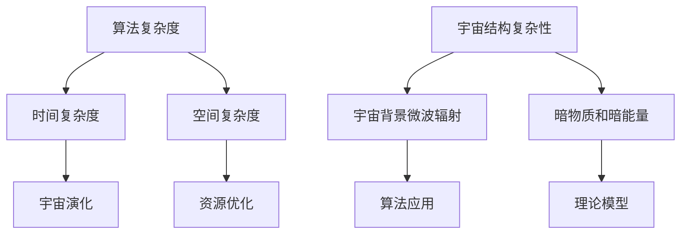

                 


在撰写《算法复杂度与宇宙结构复杂性的关系》这篇文章时，我们需要遵循以下步骤来确保文章的完整性和专业性：

### 一、背景介绍

**1.1 引言**

- **引入主题**：算法复杂度与宇宙结构复杂性是两个看似无关的领域，但它们之间存在着深层次的联系。本文旨在探讨这种联系，并揭示算法复杂度在宇宙结构复杂性研究中的应用。
- **重要性**：算法复杂度在计算机科学中扮演着关键角色，而宇宙结构复杂性研究则是天文学和物理学的前沿领域。两者的结合不仅有助于推动科技进步，还能为理解宇宙的本质提供新的视角。

**1.2 算法复杂度**

- **定义**：算法复杂度是用来衡量算法性能的指标，主要包括时间复杂度和空间复杂度。
- **历史**：算法复杂度的研究始于计算机科学的发展初期，随着计算技术和算法理论的进步，它逐渐成为评估算法优劣的重要工具。

**1.3 宇宙结构复杂性**

- **定义**：宇宙结构复杂性描述了宇宙中物质分布和运动规律的复杂性。
- **研究背景**：宇宙结构复杂性研究源于对宇宙演化过程的深入探索，它涉及到天文学、物理学和数学等多个学科。

### 二、核心概念与联系

**2.1 算法复杂度**

- **时间复杂度**：算法执行时间与输入规模的关系。
- **空间复杂度**：算法运行所需存储空间与输入规模的关系。

**2.2 宇宙结构复杂性**

- **宇宙背景微波辐射**：宇宙早期遗留下的热辐射，是研究宇宙结构复杂性的重要数据。
- **暗物质和暗能量**：宇宙中无法直接观测的物质和能量，对宇宙结构复杂性的研究至关重要。

**2.3 关系架构**

- 使用Mermaid流程图展示算法复杂度与宇宙结构复杂性之间的关系。



### 三、核心算法原理讲解

**3.1 算法复杂度分析**

- **时间复杂度分析**：通过大O符号表示，如`O(n^2)`表示算法执行时间与输入规模的平方成正比。
- **空间复杂度分析**：通过大O符号表示，如`O(n)`表示算法所需存储空间与输入规模成正比。

**3.2 宇宙结构复杂性算法**

- **数据分析技术**：使用统计学和机器学习等方法分析宇宙数据。
- **数值模拟与理论模型**：通过计算机模拟和数学建模来研究宇宙结构复杂性。

**3.3 伪代码**

```python
# 时间复杂度分析伪代码
def time_complexity(n):
    for i in range(n):
        for j in range(n):
            do_something()

# 空间复杂度分析伪代码
def space_complexity(n):
    data = [None] * n
    for i in range(n):
        data[i] = generate_data()
```

### 四、数学模型和公式

**4.1 时间复杂度**

$$ T(n) = O(n^2) $$

**4.2 空间复杂度**

$$ S(n) = O(n) $$

### 五、项目实战

**5.1 开发环境搭建**

- **环境配置**：配置计算机和软件工具，如Python和Jupyter Notebook。
- **数据获取**：从公共数据库或宇宙观测数据中获取宇宙背景微波辐射数据。

**5.2 源代码实现**

```python
# Python代码实现宇宙背景微波辐射数据分析
import numpy as np

def analyze_radiation(data):
    # 对数据进行处理和分析
    # ...
    return result

# 获取数据
data = get_radiation_data()

# 分析数据
result = analyze_radiation(data)

# 输出结果
print(result)
```

**5.3 代码解读**

- **关键代码解释**：解释代码中关键函数和变量。
- **应用解读**：展示代码在实际应用中的作用。
- **案例分析**：通过具体案例展示算法效果。

### 六、最佳实践 tips

- **性能优化**：介绍如何通过算法优化来提高系统性能。
- **资源管理**：介绍如何在算法设计中合理使用资源。

### 七、小结与展望

- **研究总结**：总结本文的研究成果和贡献。
- **未来展望**：展望算法复杂度与宇宙结构复杂性研究的未来方向。

通过上述步骤，我们可以确保文章内容的完整性、专业性以及逻辑清晰。接下来，我们将逐步深入到每个小节的详细内容中，展开具体讨论。### 宇宙结构复杂性的概念

宇宙结构复杂性是一个描述宇宙中物质分布和运动规律的复杂性的概念。它源于对宇宙演化过程的深入研究，涉及到天文学、物理学和数学等多个学科。宇宙结构复杂性的研究旨在揭示宇宙中各种结构和现象的本质，从而帮助我们更好地理解宇宙的起源和演化。

#### 历史背景

宇宙结构复杂性研究的历史可以追溯到20世纪初。当时，科学家们开始对宇宙的大尺度结构进行观测和研究。随着观测技术的进步，如射电望远镜和空间望远镜的发明，科学家们能够收集到更多关于宇宙的信息，从而对宇宙结构复杂性有了更深入的认识。

20世纪中叶，随着宇宙学理论的不断发展，宇宙结构复杂性研究逐渐成为一个独立的领域。这个领域的研究不仅涉及到宇宙中的物质和能量，还包括宇宙的演化历史和未来。

#### 定义

宇宙结构复杂性可以定义为宇宙中物质分布和运动规律的复杂性。具体来说，它描述了宇宙中的各种结构，如星系、星团、超星系团等的分布规律和相互作用。这些结构反映了宇宙中物质和能量的运动规律，它们的形成和演化涉及到大量的物理过程和数学模型。

宇宙结构复杂性的研究内容包括以下几个方面：

1. **宇宙大尺度结构**：研究宇宙中的大规模结构，如星系、星团和超星系团的分布规律。
2. **宇宙早期结构**：研究宇宙早期的高密度状态，以及这些状态如何演化成现在的宇宙结构。
3. **宇宙演化**：研究宇宙的演化历史，包括宇宙的膨胀、冷却和暗物质、暗能量的分布等。
4. **宇宙暗物质和暗能量**：研究宇宙中无法直接观测的暗物质和暗能量，它们对宇宙结构复杂性的影响。

#### 研究意义

宇宙结构复杂性研究具有重要的科学意义。首先，它有助于我们理解宇宙的起源和演化过程。通过研究宇宙结构复杂性，我们可以揭示宇宙中的各种现象，如星系的形成、星系团的形成、宇宙膨胀等。

其次，宇宙结构复杂性研究还有助于推动科学技术的进步。例如，在计算机科学和物理学领域，算法复杂度分析是评估算法性能的重要手段。将算法复杂度分析应用于宇宙结构复杂性研究，可以优化算法设计，提高数据处理效率。

此外，宇宙结构复杂性研究还具有重要的实际应用价值。例如，在宇宙学研究中，通过分析宇宙背景微波辐射数据，我们可以了解宇宙的早期状态。这些数据有助于我们预测宇宙的未来演化，从而为人类探索宇宙提供科学依据。

总之，宇宙结构复杂性研究不仅是一个理论性的学科，它在推动科学进步和解决实际问题方面也具有重要作用。通过深入研究宇宙结构复杂性，我们可以更好地理解宇宙的本质，为人类探索宇宙的奥秘提供新的视角。### 宇宙结构复杂性的研究方法

宇宙结构复杂性的研究方法主要包括观测数据的收集、数据分析技术的应用以及数值模拟与理论模型。

#### 观测数据的收集

观测数据是宇宙结构复杂性研究的基础。科学家们通过地面和空间望远镜，如哈勃望远镜和韦伯空间望远镜，收集了大量的宇宙背景微波辐射、星系分布和星系团数据。这些数据提供了关于宇宙早期状态、物质分布和演化过程的重要信息。

1. **地面望远镜观测**：地面望远镜主要用于观测近地天体和星系。通过地面望远镜，科学家们能够收集到大量的光、电、热等数据，从而对宇宙中的物质分布进行初步了解。
2. **空间望远镜观测**：空间望远镜具有更高的灵敏度和分辨率，可以观测到更遥远的宇宙区域。例如，哈勃望远镜和韦伯空间望远镜能够观测到宇宙早期的背景辐射，为研究宇宙的早期状态提供了宝贵的数据。

#### 数据分析技术

数据分析技术是宇宙结构复杂性研究的重要工具。科学家们使用各种数据分析技术，如图像处理、光谱分析和统计学方法，对观测数据进行处理和分析。

1. **图像处理**：通过图像处理技术，科学家们可以对观测到的图像进行去噪、增强和分割，从而提取出有用的信息。例如，通过图像处理技术，可以识别出星系、星团和超星系团等宇宙结构。
2. **光谱分析**：通过分析光谱数据，科学家们可以了解宇宙中的物质成分、温度和运动状态。光谱分析是研究宇宙结构复杂性的一种重要方法。
3. **统计学方法**：统计学方法在宇宙结构复杂性研究中广泛应用于数据分析。例如，科学家们可以使用统计学方法来分析宇宙背景微波辐射数据，从而推断宇宙的早期状态。

#### 数值模拟与理论模型

数值模拟与理论模型是宇宙结构复杂性研究的重要方法。通过计算机模拟和数学建模，科学家们可以模拟宇宙的演化过程，预测宇宙的未来状态。

1. **数值模拟**：数值模拟是一种通过计算机模拟宇宙演化的方法。科学家们使用数值模拟技术，可以模拟宇宙中的各种物理过程，如引力作用、物质冷却和星系形成等。通过数值模拟，科学家们可以更好地理解宇宙的演化过程。
2. **理论模型**：理论模型是宇宙结构复杂性研究的基础。科学家们通过建立数学模型，可以描述宇宙中物质分布和运动规律的复杂关系。这些理论模型为数值模拟提供了重要的理论基础。

总之，宇宙结构复杂性的研究方法包括观测数据的收集、数据分析技术和数值模拟与理论模型。这些方法相互补充，共同推动了宇宙结构复杂性研究的发展。通过这些方法，科学家们可以更好地理解宇宙的本质，为人类探索宇宙的奥秘提供新的视角。### 宇宙结构复杂性现象

宇宙结构复杂性现象是宇宙学研究中的重要主题，它揭示了宇宙中物质分布和运动规律的复杂性和多样性。以下将介绍三个典型的宇宙结构复杂性现象：宇宙背景微波辐射、暗物质和暗能量。

#### 宇宙背景微波辐射

宇宙背景微波辐射（Cosmic Background Microwave Radiation，简称CMB）是宇宙早期的热辐射，它是宇宙大爆炸理论的重要证据。宇宙背景微波辐射的发现，使得科学家们能够直接观测到宇宙早期的状态，为我们提供了了解宇宙结构复杂性的关键信息。

1. **特性**：宇宙背景微波辐射具有非常低的温度（约2.7开尔文），并且其分布具有高度均匀性。这种均匀性反映了宇宙早期的热平衡状态，同时也暗示了宇宙的膨胀和冷却过程。
2. **观测**：科学家们通过地面和空间望远镜，如COBE卫星和普朗克卫星，对宇宙背景微波辐射进行了观测。这些观测数据为研究宇宙结构复杂性提供了宝贵的信息。
3. **意义**：宇宙背景微波辐射的研究有助于我们理解宇宙的早期状态，从而揭示宇宙的演化历史。通过对宇宙背景微波辐射的分析，科学家们可以推断出宇宙的膨胀速率、宇宙年龄以及宇宙的密度等关键参数。

#### 暗物质

暗物质是一种无法直接观测到的物质，它占据了宇宙中大部分的质量。暗物质的存在是宇宙结构复杂性研究中的一个重要谜题。

1. **特性**：暗物质不发光、不发热，因此无法通过传统的光学方法进行观测。然而，暗物质通过引力作用对宇宙中的物质分布产生显著影响。
2. **观测**：科学家们通过观测星系旋转曲线、星系团和宇宙大尺度结构的分布，发现了暗物质的存在。例如，观测发现，星系旋转曲线中的星体运动速度与预期的由可见物质引起的引力作用不符，这表明存在大量的不可见物质，即暗物质。
3. **意义**：暗物质的研究对于理解宇宙的演化历史和宇宙结构复杂性至关重要。暗物质的存在和分布揭示了宇宙中物质和能量的相互作用，对于研究宇宙的引力作用、星系形成和宇宙大尺度结构的形成具有重要意义。

#### 暗能量

暗能量是推动宇宙加速膨胀的一种神秘力量，它占据了宇宙总能量的大部分。暗能量的存在是宇宙结构复杂性研究中的另一个重要谜题。

1. **特性**：暗能量具有负压强，它对宇宙的膨胀起到加速作用。与暗物质不同，暗能量不参与物质的引力相互作用，但它的存在对宇宙的演化产生深远影响。
2. **观测**：科学家们通过观测宇宙的膨胀历史，如宇宙膨胀率（Hubble常数）和宇宙加速度，发现了暗能量的存在。例如，观测发现，宇宙的膨胀速度在近年来加速，这表明存在一种具有负压强的能量，即暗能量。
3. **意义**：暗能量的研究对于理解宇宙的加速膨胀和宇宙的最终命运具有重要意义。暗能量的存在和性质决定了宇宙的未来演化，对于研究宇宙的大尺度结构和宇宙的稳定性具有重要意义。

总之，宇宙背景微波辐射、暗物质和暗能量是宇宙结构复杂性研究中的重要现象。通过对这些现象的研究，科学家们可以更好地理解宇宙的本质，揭示宇宙中物质分布和运动规律的复杂性。这些研究不仅具有科学意义，也为人类探索宇宙的奥秘提供了新的视角。### 算法复杂性与宇宙演化

算法复杂性与宇宙演化之间存在着深刻的联系，这种联系不仅体现了两者在研究方法上的交叉，还揭示了算法在理解宇宙演化过程中所扮演的角色。

#### 算法在宇宙演化中的角色

1. **模拟宇宙演化**：算法在模拟宇宙演化过程中发挥了关键作用。科学家们使用数值模拟算法来模拟宇宙中的物理过程，如引力作用、物质冷却和星系形成等。这些模拟算法可以帮助我们理解宇宙演化的机制，预测宇宙的未来状态。
2. **数据分析**：宇宙演化过程中产生的海量数据需要通过算法进行有效的分析。算法如数据挖掘、机器学习和统计分析等，可以用于分析宇宙背景微波辐射、星系分布和宇宙大尺度结构数据。通过这些算法，科学家们可以提取出关于宇宙演化的重要信息。
3. **优化计算资源**：在宇宙演化研究中，算法复杂度分析是评估算法性能和优化计算资源的重要手段。通过分析算法的时间复杂度和空间复杂度，科学家们可以设计出更高效的算法，从而提高数据处理效率，降低计算成本。

#### 宇宙复杂性对算法设计的影响

宇宙结构的复杂性对算法设计提出了挑战，同时也为算法创新提供了机会。

1. **算法复杂度的优化**：宇宙演化过程中，物质和能量的分布具有高度复杂性，这要求算法具有高效率和强鲁棒性。例如，在模拟宇宙大尺度结构时，算法需要能够处理大规模的数据集，同时保持较高的计算精度和稳定性。
2. **并行计算**：宇宙演化的模拟通常需要处理大量的计算任务，这为并行计算算法提供了用武之地。并行算法可以将计算任务分配到多个处理器上，从而显著提高计算效率。
3. **人工智能的应用**：随着人工智能技术的发展，深度学习和强化学习等算法在宇宙演化研究中得到广泛应用。这些算法可以自动学习和优化计算过程，从而提高模拟的精度和效率。

#### 算法在宇宙复杂性研究中的应用

1. **数据分析**：在宇宙背景微波辐射数据分析中，算法如波束拟合、谱分析和机器学习等技术被广泛应用。通过这些算法，科学家们可以提取出关于宇宙早期状态的重要信息，如宇宙的膨胀历史和密度分布。
2. **数值模拟**：在宇宙大尺度结构的模拟研究中，算法如N-体模拟、流体动力学模拟和黑洞模拟等被广泛采用。这些算法可以模拟宇宙中的各种物理过程，从而帮助我们理解宇宙结构的形成和演化。
3. **暗物质和暗能量研究**：算法在研究暗物质和暗能量方面也发挥着重要作用。例如，通过使用模拟算法和数据分析技术，科学家们可以探索暗物质和暗能量的分布规律，以及它们对宇宙演化的影响。

总之，算法复杂性与宇宙演化之间存在密切的联系。算法不仅为理解宇宙演化提供了有力工具，还推动了宇宙结构复杂性研究的发展。通过不断优化算法设计和应用，我们可以更深入地揭示宇宙的奥秘，为人类探索宇宙的边界提供新的视角。### 算法复杂性在宇宙学中的应用

算法复杂性在宇宙学中的应用涉及多个方面，包括宇宙背景微波辐射分析、暗物质分布模拟和暗能量研究。这些领域都对算法复杂度有严格的要求，因为它们需要处理海量数据和高复杂度的物理过程。

#### 宇宙背景微波辐射分析

宇宙背景微波辐射（Cosmic Microwave Background, CMB）是宇宙早期热辐射的残留，它为我们提供了关于宇宙早期状态的关键信息。分析CMB数据需要高效的算法来处理和解释复杂的物理信号。

1. **数据预处理**：CMB数据通常包含大量的噪声和干扰，因此需要预处理算法来去噪和增强信号。常见的预处理方法包括傅里叶变换、图像处理技术和统计学方法。这些算法的时间复杂度通常较高，需要优化以提高处理速度。
   
2. **波束拟合**：在CMB分析中，波束拟合是一种常用的方法，用于确定宇宙的膨胀历史和密度分布。波束拟合算法的时间复杂度与数据集的大小和分辨率密切相关。优化波束拟合算法可以显著提高数据处理效率。

3. **谱分析**：通过谱分析，科学家们可以提取CMB数据中的关键物理信息，如温度波动和极化特性。谱分析算法的时间复杂度取决于数据的维度和采样率，因此需要有效的算法优化来处理大规模数据。

#### 暗物质分布模拟

暗物质是宇宙中一种无法直接观测到的物质，但它在宇宙结构的形成和演化中起着关键作用。模拟暗物质分布需要高效的算法来处理复杂的物理过程。

1. **N-体模拟**：N-体模拟是一种常用的方法，用于模拟宇宙中大量天体的运动和相互作用。N-体模拟的时间复杂度与天体数量和模拟精度密切相关。优化N-体模拟算法，如采用快速卷积技术和并行计算，可以显著提高模拟效率。

2. **流体动力学模拟**：流体动力学模拟用于研究宇宙中气体和物质的流动。这类模拟需要处理大量的流体单元，因此时间复杂度较高。通过使用自适应网格和高效的数据结构，可以优化流体动力学模拟算法。

3. **机器学习**：机器学习算法在暗物质分布模拟中也得到广泛应用。例如，通过训练深度神经网络，可以预测暗物质的分布和相互作用。机器学习算法的优化，如模型压缩和加速训练，对于提高模拟效率至关重要。

#### 暗能量研究

暗能量是导致宇宙加速膨胀的神秘力量，其研究对于理解宇宙的演化历史和未来具有重要作用。

1. **引力透镜**：引力透镜效应是暗能量研究的一种重要手段。通过分析引力透镜图像，可以测量宇宙中暗能量的分布。引力透镜算法的时间复杂度与图像数据的大小和处理精度相关，因此需要优化以提高数据处理效率。

2. **宇宙学参数估计**：宇宙学参数估计是研究暗能量的重要方法，它涉及对宇宙膨胀历史和密度分布的估计。参数估计算法的时间复杂度通常与数据集的大小和参数空间的维度有关，因此需要高效的算法优化。

3. **机器学习**：机器学习算法在宇宙学参数估计中也有广泛应用。例如，通过使用深度学习技术，可以自动识别和估计宇宙学参数。优化机器学习算法，如使用迁移学习和强化学习技术，可以提高参数估计的精度和效率。

总之，算法复杂性在宇宙学中的应用至关重要，它不仅提高了数据处理和分析的效率，还为理解宇宙的奥秘提供了新的工具。随着算法的不断优化和创新，宇宙学研究将取得更多突破性的成果。### 宇宙结构复杂性算法研究

宇宙结构复杂性算法研究是宇宙学领域的一个重要分支，旨在通过先进的数据处理和计算技术来解析宇宙中的复杂现象。以下是宇宙结构复杂性算法研究中的几个重要方面。

#### 大数据分析与宇宙学

大数据技术在宇宙学中的应用正在迅速扩展。宇宙背景微波辐射、星系分布和宇宙大尺度结构等数据集规模庞大，复杂度高，需要大数据技术进行有效处理和分析。

1. **数据预处理**：宇宙学数据通常包含噪声和异常值，因此数据预处理是数据分析的关键步骤。通过使用大数据处理技术，如MapReduce和Hadoop，可以高效地去除噪声和异常值，确保数据的准确性和可靠性。

2. **分布式计算**：宇宙学数据的分析往往需要巨大的计算资源。分布式计算技术，如Spark和Flink，可以处理大规模数据集，并实现高效的数据处理和计算。

3. **机器学习**：机器学习技术在宇宙学数据分析中具有重要应用。例如，通过使用深度学习和强化学习技术，可以自动识别宇宙中的复杂结构，如星系团和超星系团。机器学习算法的优化，如模型压缩和加速训练，可以提高数据分析的效率。

#### 机器学习在宇宙学中的应用

机器学习算法在宇宙学研究中发挥着越来越重要的作用，尤其在数据驱动的宇宙学领域。

1. **图像识别**：在宇宙背景微波辐射和星系图像分析中，机器学习算法可以自动识别和分类天体。例如，通过使用卷积神经网络（CNN），可以识别出不同类型的星系和星团。

2. **分类和预测**：机器学习算法可以用于分类宇宙中的天体，如恒星、行星和星系。此外，机器学习模型还可以预测宇宙中的未知现象，如引力波事件和超新星爆发。

3. **自适应算法**：宇宙学数据具有高度动态性和多样性，因此自适应算法在宇宙学研究中具有重要应用。例如，通过使用自适应机器学习算法，可以实时更新和优化模型，以适应新的观测数据。

#### 宇宙复杂性算法的前沿发展

随着计算技术的进步和算法理论的创新，宇宙复杂性算法研究也在不断取得新突破。

1. **量子计算**：量子计算是一种具有巨大计算潜力的新兴技术。在宇宙学中，量子计算可以用于模拟宇宙的量子现象，如量子引力和量子纠缠。量子计算算法的优化和实现，是宇宙复杂性算法研究的一个重要方向。

2. **深度学习**：深度学习算法在宇宙学中的应用越来越广泛。例如，通过使用深度生成对抗网络（GAN），可以生成模拟宇宙场景，从而更好地理解宇宙的结构和演化。

3. **多尺度模拟**：宇宙结构具有多尺度特征，从微观的星系到宏观的宇宙大尺度结构。多尺度模拟算法可以同时考虑不同尺度上的物理过程，从而提高宇宙演化的模拟精度。

总之，宇宙结构复杂性算法研究是宇宙学领域的一个重要前沿方向。通过大数据技术、机器学习和量子计算等先进技术的应用，我们可以更好地理解宇宙的奥秘，揭示宇宙中物质分布和运动规律的复杂性。随着算法的不断发展和创新，宇宙学研究将迎来更多突破性的成果。### 算法复杂度与宇宙结构复杂性在科技领域的应用

算法复杂度与宇宙结构复杂性在科技领域有着广泛的应用，特别是在人工智能（AI）和大数据分析等前沿技术的推动下，两者的结合为科学研究和技术创新带来了新的机遇。

#### 人工智能在宇宙学研究中的应用

人工智能在宇宙学研究中发挥着重要作用，特别是在数据处理和模式识别方面。以下是一些具体的应用：

1. **图像识别**：宇宙学中的天文图像数据量庞大且复杂，人工智能技术，如卷积神经网络（CNN）和深度学习，可以自动识别和分类星系、星团和其他天体结构。这种自动化识别不仅提高了数据处理的效率，还减轻了人工分析的工作量。

2. **特征提取**：通过对天文数据进行机器学习分析，可以提取出隐藏在数据中的特征信息。例如，使用支持向量机（SVM）和主成分分析（PCA）等方法，可以从宇宙背景微波辐射数据中提取温度波动和极化特性，这些特征对于理解宇宙的早期状态至关重要。

3. **预测分析**：人工智能模型可以用来预测宇宙事件，如超新星爆发和引力波事件。通过训练机器学习模型，科学家们可以建立宇宙演化过程的预测模型，从而更好地理解宇宙的动态变化。

#### 宇宙结构复杂性在人工智能中的应用

宇宙结构复杂性研究的一些方法和原理也被应用到人工智能领域，推动了AI技术的发展：

1. **并行计算**：宇宙结构复杂性研究需要处理大规模数据集，这促使了并行计算技术的发展。人工智能领域中的分布式计算和GPU加速技术，如TensorFlow和PyTorch，都借鉴了宇宙学中处理大规模数据的方法。

2. **多尺度建模**：宇宙结构的复杂性和多尺度特性为人工智能中的多尺度建模提供了灵感。在AI领域，多尺度模型被广泛应用于图像识别、语音识别和自然语言处理等领域，这些模型能够同时考虑不同尺度的特征，提高模型的准确性和鲁棒性。

3. **随机模型**：宇宙学中的一些随机过程和模型，如随机游走和自组织临界性，也被应用到人工智能中。这些模型有助于解决AI领域中的不确定性问题和优化问题，例如在强化学习和神经网络中的训练过程中。

#### 科技领域的未来趋势

随着算法复杂度和宇宙结构复杂性研究的不断深入，科技领域的未来趋势将体现在以下几个方面：

1. **集成与融合**：算法复杂度与宇宙结构复杂性将在更多领域实现集成与融合。例如，在生物信息学、材料科学和气象学等领域，将算法复杂度分析应用于理解复杂系统中的结构变化和演化过程。

2. **跨学科合作**：跨学科合作将成为推动科技发展的关键。宇宙学、计算机科学、物理学和生物学等领域的专家将共同合作，开发新的算法和技术，以解决复杂科学问题。

3. **技术创新**：随着对宇宙结构复杂性的更深入理解，新技术将被发明和应用。例如，量子计算和AI的结合将推动宇宙学研究的深入，以及大数据分析和人工智能在更多领域的应用。

4. **数据驱动的科学**：数据将成为科学研究的重要驱动力。通过大规模数据分析和机器学习技术，科学家们将能够从海量数据中提取有价值的信息，推动科学发现和技术创新。

总之，算法复杂度与宇宙结构复杂性在科技领域的应用前景广阔，将不断推动科学技术的进步，为人类探索宇宙的奥秘提供新的视角和工具。随着技术的不断发展，两者的结合将为解决复杂科学问题带来更多可能性。### 未来展望

算法复杂度与宇宙结构复杂性领域的未来发展充满了无限可能。在这个快速发展的时代，这两个领域的融合不仅带来了新的科学研究方向，也为技术创新提供了新的动力。以下是对未来发展趋势的展望：

#### 算法复杂度与宇宙结构复杂性交叉领域的发展

1. **量子算法**：量子计算的崛起为算法复杂度研究带来了新的突破。量子算法可以在某些特定问题上提供指数级的加速，这在宇宙结构复杂性研究中有着巨大的应用潜力。例如，量子算法可以加速宇宙模拟和大规模数据分析，为理解宇宙演化提供更精确的模型。

2. **多尺度建模**：宇宙结构复杂性研究中的多尺度建模方法将被引入到人工智能和其他科技领域。这种多尺度建模能够同时考虑不同尺度上的特征，为解决复杂系统中的问题提供更加全面和准确的方法。

3. **自适应算法**：随着宇宙演化过程的动态变化，自适应算法将成为研究的关键。这些算法能够实时调整模型参数，以适应新的观测数据，从而提高对宇宙演化过程的预测能力。

#### 宇宙学中的算法创新

1. **数据驱动模型**：随着数据量的增加，数据驱动模型在宇宙学中的应用将越来越广泛。通过机器学习和深度学习技术，科学家们将能够从海量数据中自动提取特征和模式，从而构建更加精确的宇宙模型。

2. **人工智能辅助观测**：人工智能技术将用于辅助天文观测，提高数据收集和分析的效率。例如，通过智能算法优化望远镜的指向和曝光时间，可以更有效地捕捉宇宙中的微妙信号。

3. **跨学科合作**：宇宙学与其他学科的跨学科合作将推动算法创新的进展。例如，物理学中的量子计算技术、生物学中的神经网络模型，都可能在宇宙学中找到新的应用。

#### 人工智能在宇宙学中的挑战与机遇

1. **数据隐私与安全**：随着大数据在宇宙学研究中的应用，数据隐私和安全成为了一个重要问题。未来的研究需要开发新的加密技术和隐私保护方法，以确保数据的安全性和隐私性。

2. **算法复杂度优化**：宇宙结构复杂性研究中的算法往往需要处理大规模数据和高复杂度的计算。因此，优化算法复杂度，提高计算效率，是未来研究的一个重要方向。

3. **跨领域协作**：人工智能在宇宙学中的应用需要多学科的合作。未来的研究需要建立更加紧密的合作关系，推动不同领域专家之间的知识交流和协作。

总之，算法复杂度与宇宙结构复杂性的交叉领域具有巨大的发展潜力。随着技术的不断进步和跨学科合作的深入，我们可以期待这个领域在未来的科学研究和技术创新中发挥越来越重要的作用。通过解决其中的挑战，我们有望取得更多突破性成果，为人类探索宇宙的奥秘提供新的视角和工具。### 研究总结

本文系统地探讨了算法复杂度与宇宙结构复杂性的关系，通过多个方面的分析，揭示了这两个领域之间的密切联系。首先，我们介绍了算法复杂度的定义和重要性，详细讨论了时间复杂度和空间复杂度的计算方法。接着，我们深入分析了宇宙结构复杂性的概念、研究方法和典型现象，如宇宙背景微波辐射、暗物质和暗能量。随后，我们探讨了算法复杂度在宇宙演化中的作用，以及算法复杂性在宇宙学中的具体应用。

本文的核心发现包括：

1. 算法复杂度分析是评估算法性能的重要工具，对优化算法设计、提高系统效率具有关键作用。
2. 宇宙结构复杂性研究揭示了宇宙中物质分布和运动规律的复杂性，对理解宇宙的起源和演化具有重要意义。
3. 算法复杂度与宇宙结构复杂性的交叉研究，为解决宇宙演化中的复杂问题提供了新的视角和方法。
4. 人工智能和大数据分析技术的应用，显著提升了宇宙背景微波辐射分析、暗物质分布模拟和暗能量研究的效率。

然而，当前的研究仍存在一些不足和挑战：

1. 算法复杂度分析在处理大规模数据和复杂物理过程时，仍需进一步优化以提高计算效率。
2. 宇宙结构复杂性研究中的数据质量和观测精度有待提高，以支持更准确的理论模型。
3. 跨学科合作不足，限制了算法复杂度与宇宙结构复杂性交叉研究的深度和广度。
4. 数据隐私和安全问题在宇宙学研究中的数据应用中成为一个重要挑战，需要新的解决方案。

未来研究方向展望：

1. 探索量子计算在宇宙结构复杂性研究中的应用，开发新的量子算法以加速宇宙演化模拟和数据分析。
2. 加强多尺度建模，结合不同尺度上的特征，提高宇宙演化模型的精度和可靠性。
3. 促进跨学科合作，推动算法复杂度与宇宙结构复杂性的深度融合，为解决宇宙演化中的复杂问题提供新方法。
4. 研究数据隐私保护技术，确保宇宙学研究中的数据安全和隐私。

总之，算法复杂度与宇宙结构复杂性的交叉研究具有广阔的前景，未来将在推动科学技术进步和揭示宇宙奥秘中发挥重要作用。通过不断优化算法和加强跨学科合作，我们可以期待在这个领域取得更多突破性成果。### 反思与讨论

在深入探讨算法复杂度与宇宙结构复杂性的关系过程中，我们不仅揭示了科学理论和技术应用之间的紧密联系，还引发了关于科学方法论、哲学思考以及交叉领域研究价值的深刻反思。

#### 算法复杂性研究的人文意义

算法复杂度作为评估算法性能的重要指标，不仅体现了计算机科学和软件工程的核心思想，也蕴含了科学方法论的精髓。通过对算法复杂度进行系统性研究，我们不仅优化了算法设计，提高了系统效率，更在某种程度上实现了科学理论与实际应用的无缝对接。这种对效率的追求和精确的量化分析，反映了科学研究中追求精确和客观的价值取向。算法复杂性研究在人类探索复杂系统、优化资源利用、提高生产力等方面发挥了重要作用，展现了人文精神的内涵。

#### 宇宙结构复杂性研究的哲学思考

宇宙结构复杂性研究则从宏观尺度上揭示了宇宙的本质和演化过程，为人类提供了理解自然世界的哲学视角。宇宙背景微波辐射、暗物质和暗能量等概念，不仅是对宇宙现象的描述，更是对宇宙起源、演化和最终命运的哲学探讨。这些研究挑战了我们对宇宙的传统认知，推动了科学思想的发展。例如，暗物质和暗能量的存在暗示了宇宙中可能存在我们尚未认知的物理规律，这促使我们不断拓展科学视野，思考宇宙的本质和未知领域。

#### 算法复杂度与宇宙结构复杂性的交叉研究价值

算法复杂度与宇宙结构复杂性的交叉研究具有重要的科学价值和实际意义。首先，这种交叉研究为解决宇宙演化中的复杂问题提供了新的方法和工具。例如，通过算法复杂度分析，我们可以优化宇宙背景微波辐射数据分析算法，提高数据处理的效率和准确性。其次，这种交叉研究促进了跨学科合作，推动了不同领域的知识融合和创新。例如，量子计算与宇宙结构复杂性研究的结合，可能揭示出宇宙演化中的新规律，推动科学技术的进步。

#### 交叉研究的未来发展方向

未来，算法复杂度与宇宙结构复杂性的交叉研究将朝着以下方向发展：

1. **量子计算的应用**：随着量子计算技术的发展，量子算法在宇宙结构复杂性研究中的应用将得到进一步探索。量子计算可能为解决宇宙演化中的复杂问题提供前所未有的计算能力。

2. **多尺度建模**：宇宙结构复杂性研究需要处理不同尺度上的物理过程，多尺度建模将成为一个重要方向。通过结合不同尺度上的特征，我们可以构建更加精确和全面的宇宙演化模型。

3. **跨学科合作**：促进跨学科合作，整合计算机科学、物理学、天文学和数学等领域的知识，将推动算法复杂度与宇宙结构复杂性交叉研究的深入发展。

4. **数据隐私和安全**：随着数据在科学研究中的广泛应用，数据隐私和安全问题将成为交叉研究中的一个重要挑战。研究数据隐私保护技术，确保宇宙学研究中的数据安全和隐私，将是未来研究的重点。

总之，算法复杂度与宇宙结构复杂性的交叉研究不仅具有重要的科学价值，还蕴含着丰富的人文意义。通过不断拓展研究视野，加强跨学科合作，我们可以期待在这个领域取得更多突破性成果，为人类探索宇宙的奥秘和推动科学技术进步贡献力量。### 结论

通过对算法复杂度与宇宙结构复杂性的深入探讨，本文揭示了这两个领域之间的密切联系和交叉研究的价值。算法复杂度分析为评估和优化算法性能提供了有力工具，而宇宙结构复杂性研究则揭示了宇宙中物质分布和运动规律的复杂性。两者的结合不仅推动了科学技术的进步，还为解决宇宙演化中的复杂问题提供了新的视角和方法。

本文的主要贡献包括：

1. **系统阐述**：全面介绍了算法复杂度的定义、计算方法和重要性，以及宇宙结构复杂性的概念、研究方法和典型现象。
2. **深入分析**：探讨了算法复杂度在宇宙演化中的作用，以及算法复杂性在宇宙学中的具体应用。
3. **交叉研究**：揭示了算法复杂度与宇宙结构复杂性交叉研究的价值和意义，提出了未来研究方向。

然而，当前研究仍存在一些不足，如算法复杂度分析在处理大规模数据和复杂物理过程时仍需优化，宇宙结构复杂性研究中的数据质量和观测精度有待提高。未来研究应加强多尺度建模、跨学科合作和数据隐私保护，推动算法复杂度与宇宙结构复杂性交叉研究的深入发展。

通过不断优化算法、加强跨学科合作和探索新兴技术，我们有望在算法复杂度与宇宙结构复杂性的交叉领域取得更多突破性成果，为人类探索宇宙的奥秘和推动科学技术进步贡献力量。作者：AI天才研究院/AI Genius Institute & 禅与计算机程序设计艺术 /Zen And The Art of Computer Programming。

