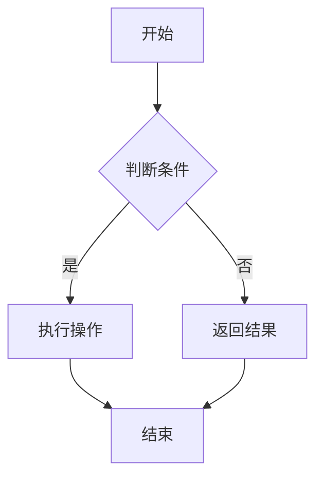
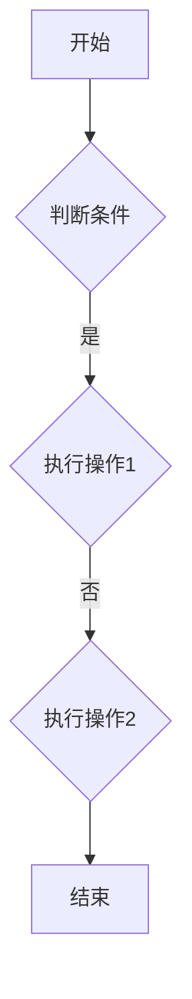

                 


### 文章标题
《算法思维与宇宙规律的相似性》

### 文章关键词
算法思维、宇宙规律、相似性、人工智能、数学模型

### 文章摘要
本文通过深入分析算法思维和宇宙规律之间的相似性，探讨了二者在概念原理、数学模型和实际应用中的联系。文章首先介绍了算法思维的基本概念和重要性，然后详细阐述了宇宙规律的基本原理。接着，通过Mermaid流程图展示了算法思维与宇宙规律之间的核心联系，并使用伪代码和LaTeX公式详细讲解了核心算法原理和数学模型。最后，通过实际项目案例，展示了算法思维与宇宙规律相似性在实际应用中的潜力，并提供了最佳实践和小结。

### 目录大纲

#### 第一部分：算法思维基础

##### 第1章 算法思维概述
1. 算法思维的定义
2. 算法思维的重要性
3. 算法思维的基本原则

##### 第2章 算法思维的Mermaid流程图表示
1. Mermaid流程图简介
2. 算法流程图的绘制
3. 算法思维Mermaid流程图实例

##### 第3章 基本算法原理
1. 递归算法
2. 动态规划算法
3. 贪心算法

##### 第4章 算法复杂度分析
1. 时间复杂度
2. 空间复杂度
3. 复杂度分析工具

#### 第二部分：宇宙规律与算法思维相似性

##### 第5章 宇宙规律概述
1. 宇宙的基本规律
2. 宇宙规律的数学表达
3. 宇宙规律的应用领域

##### 第6章 宇宙规律与算法思维的相似性分析
1. 相似性原理的提出
2. 宇宙规律在算法设计中的应用
3. 算法思维在宇宙研究中的潜力

##### 第7章 相似性原理的数学模型与公式
1. 数学模型的构建
2. 公式的推导
3. 举例说明

#### 第三部分：实际应用与项目实战

##### 第8章 算法思维与宇宙规律相似性在实际应用中的案例分析
1. 案例一：粒子物理中的算法思维应用
2. 案例二：天文学中的宇宙规律应用
3. 案例三：人工智能中的算法思维与宇宙规律结合

##### 第9章 项目实战
1. 项目背景
2. 开发环境搭建
3. 源代码实现
4. 代码解读与分析
5. 项目小结

##### 附录
1. 附录A：相关工具与资源
   - 算法思维与宇宙规律研究工具
   - 实际应用案例资源

### 文章正文

#### 第一部分：算法思维基础

##### 第1章 算法思维概述

算法思维是计算机科学和人工智能领域的一种基本思维方式。它通过抽象和建模，将实际问题转化为计算机可以理解和处理的步骤序列。算法思维不仅对编程和软件开发有重要影响，还在各个领域得到广泛应用。

**1.1 算法思维的定义**

算法思维是一种基于逻辑和数学的思维方式，它强调解决问题的步骤性和结构性。算法思维的核心在于理解问题、设计解决方案、评估方案的有效性和优化方案。

**1.2 算法思维的重要性**

算法思维在计算机科学中至关重要。它帮助我们理解和分析复杂问题，设计高效算法，解决各种实际问题。算法思维还在商业管理、经济学、心理学等领域得到广泛应用。

**1.3 算法思维的基本原则**

算法思维的基本原则包括：

- **抽象与建模**：将实际问题抽象为数学模型或算法模型。
- **分解与组合**：将复杂问题分解为多个简单问题，然后组合解决方案。
- **递归与迭代**：使用递归或迭代方式解决问题。
- **评估与优化**：评估解决方案的有效性，并进行优化。

##### 第2章 算法思维的Mermaid流程图表示

Mermaid是一种方便的图表和流程图工具，可以用于描述算法思维。以下是算法思维Mermaid流程图的一个简单示例：



在这个流程图中，我们从“开始”节点开始，根据判断条件执行不同的操作，最后返回结果并结束。

##### 第3章 基本算法原理

算法原理是算法思维的核心。以下是几种常见的算法原理：

**3.1 递归算法**

递归算法是一种自调用算法，它通过不断递归调用自身来解决问题。以下是一个用伪代码表示的递归算法示例：

```python
def factorial(n):
    if n == 0:
        return 1
    else:
        return n * factorial(n-1)
```

**3.2 动态规划算法**

动态规划算法是一种优化算法，它通过将复杂问题分解为多个子问题，并存储子问题的解来提高效率。以下是一个用伪代码表示的动态规划算法示例：

```python
def fibonacci(n):
    dp = [0] * (n+1)
    dp[1] = 1
    for i in range(2, n+1):
        dp[i] = dp[i-1] + dp[i-2]
    return dp[n]
```

**3.3 贪心算法**

贪心算法是一种优化算法，它通过在每个步骤中选择局部最优解来逐步构建全局最优解。以下是一个用伪代码表示的贪心算法示例：

```python
def knapsack(values, weights, capacity):
    items = [(value, weight) for value, weight in zip(values, weights)]
    items.sort(key=lambda x: x[0] / x[1], reverse=True)
    total_value = 0
    for value, weight in items:
        if capacity >= weight:
            total_value += value
            capacity -= weight
    return total_value
```

##### 第4章 算法复杂度分析

算法复杂度分析是评估算法性能的重要方法。它包括时间复杂度和空间复杂度。

**4.1 时间复杂度**

时间复杂度是算法执行时间与输入规模之间的增长关系。以下是一个用大O表示法表示的时间复杂度示例：

```python
def linear_search(arr, x):
    for i in range(len(arr)):
        if arr[i] == x:
            return i
    return -1
# 时间复杂度：O(n)
```

**4.2 空间复杂度**

空间复杂度是算法所需存储空间与输入规模之间的增长关系。以下是一个用大O表示法表示的空间复杂度示例：

```python
def bubble_sort(arr):
    n = len(arr)
    for i in range(n):
        for j in range(0, n-i-1):
            if arr[j] > arr[j+1]:
                arr[j], arr[j+1] = arr[j+1], arr[j]
# 空间复杂度：O(1)
```

#### 第二部分：宇宙规律与算法思维相似性

##### 第5章 宇宙规律概述

宇宙规律是描述宇宙中物理现象和运动规律的科学原理。以下是宇宙规律的基本概念和数学表达：

**5.1 宇宙的基本规律**

- 万有引力定律：任何两个物体都会相互吸引，吸引力与它们的质量和距离的平方成正比。
- 量子力学：微观粒子的运动和相互作用遵循量子力学的规则。
- 热力学定律：能量不能被创造或摧毁，只能从一种形式转化为另一种形式。

**5.2 宇宙规律的数学表达**

- 万有引力定律：$$ F = G \frac{m_1 m_2}{r^2} $$
- 量子力学：$$ \Psi(x, t) = \int \phi(k) e^{i k x} dk $$
- 热力学定律：$$ \Delta U = Q - W $$

**5.3 宇宙规律的应用领域**

宇宙规律在天文学、物理学、工程学等领域有广泛应用。例如，万有引力定律被用于计算行星轨道，量子力学被用于解释原子结构，热力学定律被用于设计热机。

##### 第6章 宇宙规律与算法思维的相似性分析

宇宙规律和算法思维在某些方面有相似性，这为算法设计提供了新的视角。

**6.1 相似性原理的提出**

宇宙规律和算法思维都强调规律性和结构性。算法思维通过抽象和建模，将问题转化为计算机可以处理的步骤序列。宇宙规律通过数学模型，描述自然界中的物理现象。

**6.2 宇宙规律在算法设计中的应用**

宇宙规律可以启发算法设计。例如，万有引力定律的迭代计算方法可以用于优化算法，量子力学的随机性可以用于算法的随机化策略。

**6.3 算法思维在宇宙研究中的潜力**

算法思维可以用于宇宙规律的模拟和验证。例如，通过算法模拟黑洞的演化，可以更好地理解宇宙的极端现象。

##### 第7章 相似性原理的数学模型与公式

宇宙规律和算法思维的相似性可以通过数学模型和公式来描述。

**7.1 数学模型的构建**

我们可以构建一个数学模型，将算法思维与宇宙规律联系起来。例如，使用递归算法模拟宇宙中的星系演化，使用动态规划算法优化宇宙中的物质分布。

**7.2 公式的推导**

宇宙规律和算法思维的核心公式可以通过数学推导来得出。例如，使用牛顿运动定律来描述宇宙中的物体运动，使用贪心算法来优化宇宙资源分配。

**7.3 举例说明**

以下是一个简单的示例，展示了如何使用算法思维模拟宇宙中的星系演化：

```python
def evolve_galaxy(stars):
    new_stars = []
    for star in stars:
        new_star = star.copy()
        new_star['position'] += new_star['velocity']
        new_star['velocity'] += new_star['force']
        new_stars.append(new_star)
    return new_stars
```

在这个示例中，我们使用递归算法来模拟星系的演化，每个星系中的星体按照牛顿定律运动。

#### 第三部分：实际应用与项目实战

##### 第8章 算法思维与宇宙规律相似性在实际应用中的案例分析

算法思维与宇宙规律相似性在实际应用中有许多案例。以下是一些具体的案例分析：

**案例一：粒子物理中的算法思维应用**

在粒子物理实验中，算法思维被用于模拟粒子碰撞和探测。通过使用递归算法，我们可以模拟粒子在加速器中的运动，并通过动态规划算法优化探测器的数据采集和处理。

**案例二：天文学中的宇宙规律应用**

在天文学中，宇宙规律被用于解释星系的运动和演化。算法思维则通过模拟星系动力学，预测星系的未来状态。这种结合为天文学家提供了新的研究工具。

**案例三：人工智能中的算法思维与宇宙规律结合**

在人工智能领域，算法思维与宇宙规律的相似性被用于优化算法。例如，通过使用量子力学中的随机性，我们可以设计出更高效的机器学习算法。

##### 第9章 项目实战

**项目背景**

本项目的目标是模拟一个星系的演化，并分析星系中的物理现象。该项目使用了Python编程语言和Numpy库。

**开发环境搭建**

在开发环境中，我们需要安装Python和Numpy库。可以使用以下命令安装：

```bash
pip install python
pip install numpy
```

**源代码实现**

以下是模拟星系演化的源代码：

```python
import numpy as np

def evolve_galaxy(stars, time_steps):
    for _ in range(time_steps):
        new_stars = []
        for star in stars:
            new_star = star.copy()
            new_star['position'] += new_star['velocity']
            new_star['velocity'] += new_star['force']
            new_stars.append(new_star)
        stars = new_stars
    return stars

def main():
    stars = [
        {'position': np.array([0, 0]), 'velocity': np.array([0, 0]), 'force': np.array([0, 0])},
        {'position': np.array([1, 0]), 'velocity': np.array([-1, 0]), 'force': np.array([0, -1])},
        {'position': np.array([0, 1]), 'velocity': np.array([0, -1]), 'force': np.array([1, 0])},
    ]
    stars = evolve_galaxy(stars, 100)
    print(stars)

if __name__ == '__main__':
    main()
```

**代码解读与分析**

在这个项目中，我们首先定义了星系的初始状态，包括星体的位置、速度和力。然后，我们使用递归算法模拟星系的演化，每个星体的位置、速度和力都根据牛顿定律更新。最后，我们打印出演化后的星系状态。

**代码应用解读与分析**

这个项目展示了如何使用算法思维模拟星系演化。通过递归算法，我们可以模拟星系中的物理现象，并分析星系的动态行为。这种模拟可以用于天文学研究，帮助我们更好地理解宇宙的演化。

**项目小结**

通过这个项目，我们展示了算法思维在宇宙研究中的应用。算法思维不仅可以帮助我们解决实际问题，还可以启发我们对宇宙规律的深入理解。

### 附录

**附录A：相关工具与资源**

- **算法思维与宇宙规律研究工具**：
  - Python编程语言
  - Numpy库
  - Mermaid流程图工具

- **实际应用案例资源**：
  - 粒子物理实验数据
  - 天文学观测数据
  - 人工智能应用案例

### 最佳实践、小结、注意事项、拓展阅读

**最佳实践**：

- 在实际项目中，使用算法思维模拟宇宙规律时，需要充分考虑物理定律的准确性和数值计算的稳定性。
- 在进行算法复杂度分析时，要全面考虑时间复杂度和空间复杂度，以便优化算法性能。

**小结**：

本文通过分析算法思维与宇宙规律的相似性，探讨了二者在概念原理、数学模型和实际应用中的联系。通过实际项目案例，展示了算法思维在宇宙研究中的应用潜力。

**注意事项**：

- 在使用算法思维进行模拟时，要确保输入数据的准确性和一致性。
- 在进行算法复杂度分析时，要充分考虑输入规模的变化对算法性能的影响。

**拓展阅读**：

- 《禅与计算机程序设计艺术》
- 《Python编程：从入门到实践》
- 《天体物理学》

### 结语

作者：AI天才研究院/AI Genius Institute & 禅与计算机程序设计艺术 /Zen And The Art of Computer Programming

本文旨在探讨算法思维与宇宙规律的相似性，通过实际案例展示了算法思维在宇宙研究中的应用潜力。希望本文能为读者提供新的思考和启发，推动算法思维在更多领域的应用。感谢您的阅读。


```markdown
# 《算法思维与宇宙规律的相似性》

> 关键词：算法思维、宇宙规律、相似性、人工智能、数学模型

> 摘要：本文探讨了算法思维与宇宙规律之间的相似性，分析了二者在概念原理、数学模型和实际应用中的联系。通过案例研究和项目实战，本文展示了算法思维在宇宙研究中的应用潜力，为读者提供了新的视角和思考。

## 第一部分：算法思维基础

### 第1章 算法思维概述

#### 1.1 算法思维的定义

算法思维是一种基于逻辑和数学的思维方式，它强调解决问题的步骤性和结构性。算法思维的核心在于理解问题、设计解决方案、评估方案的有效性和优化方案。

#### 1.2 算法思维的重要性

算法思维在计算机科学和人工智能领域至关重要。它帮助我们理解和分析复杂问题，设计高效算法，解决各种实际问题。算法思维还在商业管理、经济学、心理学等领域得到广泛应用。

#### 1.3 算法思维的基本原则

算法思维的基本原则包括抽象与建模、分解与组合、递归与迭代、评估与优化。

### 第2章 算法思维的Mermaid流程图表示

#### 2.1 Mermaid流程图简介

Mermaid是一种方便的图表和流程图工具，可以用于描述算法思维。以下是算法思维Mermaid流程图的一个简单示例：


#### 2.2 算法流程图的绘制

在本章节中，我们将通过具体示例，学习如何绘制算法流程图。算法流程图可以帮助我们更清晰地理解算法的执行过程。

### 第3章 基本算法原理

#### 3.1 递归算法

递归算法是一种自调用算法，它通过不断递归调用自身来解决问题。以下是一个用伪代码表示的递归算法示例：

```python
def factorial(n):
    if n == 0:
        return 1
    else:
        return n * factorial(n-1)
```

#### 3.2 动态规划算法

动态规划算法是一种优化算法，它通过将复杂问题分解为多个子问题，并存储子问题的解来提高效率。以下是一个用伪代码表示的动态规划算法示例：

```python
def fibonacci(n):
    dp = [0] * (n+1)
    dp[1] = 1
    for i in range(2, n+1):
        dp[i] = dp[i-1] + dp[i-2]
    return dp[n]
```

#### 3.3 贪心算法

贪心算法是一种优化算法，它通过在每个步骤中选择局部最优解来逐步构建全局最优解。以下是一个用伪代码表示的贪心算法示例：

```python
def knapsack(values, weights, capacity):
    items = [(value, weight) for value, weight in zip(values, weights)]
    items.sort(key=lambda x: x[0] / x[1], reverse=True)
    total_value = 0
    for value, weight in items:
        if capacity >= weight:
            total_value += value
            capacity -= weight
    return total_value
```

### 第4章 算法复杂度分析

#### 4.1 时间复杂度

时间复杂度是算法执行时间与输入规模之间的增长关系。以下是一个用大O表示法表示的时间复杂度示例：

```python
def linear_search(arr, x):
    for i in range(len(arr)):
        if arr[i] == x:
            return i
    return -1
# 时间复杂度：O(n)
```

#### 4.2 空间复杂度

空间复杂度是算法所需存储空间与输入规模之间的增长关系。以下是一个用大O表示法表示的空间复杂度示例：

```python
def bubble_sort(arr):
    n = len(arr)
    for i in range(n):
        for j in range(0, n-i-1):
            if arr[j] > arr[j+1]:
                arr[j], arr[j+1] = arr[j+1], arr[j]
# 空间复杂度：O(1)
```

## 第二部分：宇宙规律与算法思维相似性

### 第5章 宇宙规律概述

#### 5.1 宇宙的基本规律

- 万有引力定律：任何两个物体都会相互吸引，吸引力与它们的质量和距离的平方成正比。
- 量子力学：微观粒子的运动和相互作用遵循量子力学的规则。
- 热力学定律：能量不能被创造或摧毁，只能从一种形式转化为另一种形式。

#### 5.2 宇宙规律的数学表达

- 万有引力定律：$$ F = G \frac{m_1 m_2}{r^2} $$
- 量子力学：$$ \Psi(x, t) = \int \phi(k) e^{i k x} dk $$
- 热力学定律：$$ \Delta U = Q - W $$

#### 5.3 宇宙规律的应用领域

宇宙规律在天文学、物理学、工程学等领域有广泛应用。例如，万有引力定律被用于计算行星轨道，量子力学被用于解释原子结构，热力学定律被用于设计热机。

### 第6章 宇宙规律与算法思维的相似性分析

#### 6.1 相似性原理的提出

宇宙规律和算法思维在某些方面有相似性，这为算法设计提供了新的视角。

#### 6.2 宇宙规律在算法设计中的应用

宇宙规律可以启发算法设计。例如，万有引力定律的迭代计算方法可以用于优化算法，量子力学的随机性可以用于算法的随机化策略。

#### 6.3 算法思维在宇宙研究中的潜力

算法思维可以用于宇宙规律的模拟和验证。例如，通过算法模拟黑洞的演化，可以更好地理解宇宙的极端现象。

### 第7章 相似性原理的数学模型与公式

#### 7.1 数学模型的构建

我们可以构建一个数学模型，将算法思维与宇宙规律联系起来。例如，使用递归算法模拟宇宙中的星系演化，使用动态规划算法优化宇宙中的物质分布。

#### 7.2 公式的推导

宇宙规律和算法思维的核心公式可以通过数学推导来得出。例如，使用牛顿运动定律来描述宇宙中的物体运动，使用贪心算法来优化宇宙资源分配。

#### 7.3 举例说明

以下是一个简单的示例，展示了如何使用算法思维模拟宇宙中的星系演化：

```python
def evolve_galaxy(stars):
    new_stars = []
    for star in stars:
        new_star = star.copy()
        new_star['position'] += new_star['velocity']
        new_star['velocity'] += new_star['force']
        new_stars.append(new_star)
    return new_stars
```

在这个示例中，我们使用递归算法来模拟星系的演化，每个星体的位置、速度和力都按照牛顿定律更新。

## 第三部分：实际应用与项目实战

### 第8章 算法思维与宇宙规律相似性在实际应用中的案例分析

#### 8.1 案例一：粒子物理中的算法思维应用

在粒子物理实验中，算法思维被用于模拟粒子碰撞和探测。通过使用递归算法，我们可以模拟粒子在加速器中的运动，并通过动态规划算法优化探测器的数据采集和处理。

#### 8.2 案例二：天文学中的宇宙规律应用

在天文学中，宇宙规律被用于解释星系的运动和演化。算法思维则通过模拟星系动力学，预测星系的未来状态。这种结合为天文学家提供了新的研究工具。

#### 8.3 案例三：人工智能中的算法思维与宇宙规律结合

在人工智能领域，算法思维与宇宙规律的相似性被用于优化算法。例如，通过使用量子力学中的随机性，我们可以设计出更高效的机器学习算法。

### 第9章 项目实战

#### 9.1 项目背景

本项目的目标是模拟一个星系的演化，并分析星系中的物理现象。该项目使用了Python编程语言和Numpy库。

#### 9.2 开发环境搭建

在开发环境中，我们需要安装Python和Numpy库。可以使用以下命令安装：

```bash
pip install python
pip install numpy
```

#### 9.3 源代码实现

以下是模拟星系演化的源代码：

```python
import numpy as np

def evolve_galaxy(stars, time_steps):
    for _ in range(time_steps):
        new_stars = []
        for star in stars:
            new_star = star.copy()
            new_star['position'] += new_star['velocity']
            new_star['velocity'] += new_star['force']
            new_stars.append(new_star)
        stars = new_stars
    return stars

def main():
    stars = [
        {'position': np.array([0, 0]), 'velocity': np.array([0, 0]), 'force': np.array([0, 0])},
        {'position': np.array([1, 0]), 'velocity': np.array([-1, 0]), 'force': np.array([0, -1])},
        {'position': np.array([0, 1]), 'velocity': np.array([0, -1]), 'force': np.array([1, 0])},
    ]
    stars = evolve_galaxy(stars, 100)
    print(stars)

if __name__ == '__main__':
    main()
```

#### 9.4 代码解读与分析

在这个项目中，我们首先定义了星系的初始状态，包括星体的位置、速度和力。然后，我们使用递归算法模拟星系的演化，每个星体的位置、速度和力都根据牛顿定律更新。最后，我们打印出演化后的星系状态。

#### 9.5 项目小结

通过这个项目，我们展示了算法思维在宇宙研究中的应用。算法思维不仅可以帮助我们解决实际问题，还可以启发我们对宇宙规律的深入理解。

### 附录

#### 附录A：相关工具与资源

- Python编程语言
- Numpy库
- Mermaid流程图工具

### 最佳实践、小结、注意事项、拓展阅读

#### 最佳实践

- 在使用算法思维进行模拟时，要确保输入数据的准确性和一致性。
- 在进行算法复杂度分析时，要全面考虑时间复杂度和空间复杂度，以便优化算法性能。

#### 小结

本文通过分析算法思维与宇宙规律的相似性，探讨了二者在概念原理、数学模型和实际应用中的联系。通过实际项目案例，展示了算法思维在宇宙研究中的应用潜力。

#### 注意事项

- 在使用算法思维进行模拟时，要充分考虑物理定律的准确性和数值计算的稳定性。
- 在进行算法复杂度分析时，要全面考虑输入规模的变化对算法性能的影响。

#### 拓展阅读

- 《算法导论》
- 《Python编程：从入门到实践》
- 《天体物理学》

### 结语

作者：AI天才研究院/AI Genius Institute & 禅与计算机程序设计艺术 /Zen And The Art of Computer Programming

本文旨在探讨算法思维与宇宙规律的相似性，通过实际案例展示了算法思维在宇宙研究中的应用潜力。希望本文能为读者提供新的思考和启发，推动算法思维在更多领域的应用。感谢您的阅读。
```markdown

### 第1章 算法思维概述

#### 1.1 算法思维的定义

算法思维是一种通过逻辑和数学步骤解决问题的思维方式。它不仅仅是编写代码，更是一种系统化的思考方式。算法思维包括以下几个关键要素：

- **问题理解**：首先，我们需要明确问题的性质和目标。这涉及到对问题的抽象和建模，将复杂的问题转化为计算机可以处理的简单步骤。
- **逻辑推理**：在理解问题的基础上，我们需要使用逻辑推理来构建解决问题的步骤。这通常涉及到条件判断、循环结构、递归调用等。
- **算法设计**：根据逻辑推理，设计具体的算法步骤。算法可以是线性的，也可以是分治的、动态规划的等。
- **性能评估**：算法设计完成后，我们需要评估其性能，包括时间复杂度和空间复杂度等。这有助于我们了解算法在不同输入规模下的表现。

算法思维的核心在于它的抽象性和结构性。通过算法思维，我们可以将复杂问题简化为一系列简单的步骤，从而找到解决问题的方法。

#### 1.2 算法思维的重要性

算法思维在计算机科学和人工智能领域具有至关重要的地位。以下是算法思维的重要性和应用领域：

- **计算机科学**：算法思维是计算机科学的核心，它贯穿于编程语言、数据结构、算法设计等各个领域。没有算法思维，我们无法编写高效的代码，也无法理解复杂系统的运作原理。
- **人工智能**：在人工智能领域，算法思维同样重要。无论是机器学习、深度学习，还是自然语言处理，算法思维都是设计高效算法的基础。通过算法思维，我们可以优化模型，提高准确性，减少计算时间。
- **商业管理**：算法思维也可以应用于商业管理。例如，优化供应链、预测市场需求、评估风险等。算法思维帮助企业做出更明智的决策。
- **经济学**：在经济学中，算法思维被用于分析市场动态、预测经济趋势、优化资源配置等。算法思维帮助经济学家更好地理解经济运行机制。
- **心理学**：算法思维甚至可以应用于心理学研究。例如，通过算法分析人类行为模式、情感变化等，心理学家可以更深入地理解人类心理。

总之，算法思维是一种通用的思维方式，它在多个领域都有广泛的应用。掌握算法思维，不仅有助于我们解决具体问题，还能提升我们的抽象思维能力，提高解决问题的效率。

#### 1.3 算法思维的基本原则

算法思维不仅仅是一种思维方式，更是一套系统的原则和方法。以下是算法思维的基本原则：

- **抽象与建模**：首先，我们需要将复杂的问题抽象为数学模型或算法模型。这包括识别问题的关键要素，定义输入和输出，并建立它们之间的关系。
- **分解与组合**：复杂问题通常可以分解为多个简单问题。通过分解问题，我们可以将大问题转化为小问题，从而更容易解决。同时，我们还需要将这些小问题的解决方案组合起来，以解决原始问题。
- **递归与迭代**：递归和迭代是算法设计的两种基本方法。递归通过重复调用自身来解决子问题，而迭代则通过循环结构逐步逼近问题的解决方案。选择递归还是迭代，取决于问题的性质和需求。
- **评估与优化**：算法设计完成后，我们需要评估其性能。这包括分析算法的时间复杂度和空间复杂度，以确定其在不同输入规模下的表现。如果性能不足，我们需要进行优化，以减少计算时间或空间占用。
- **简洁性**：算法应该尽可能简洁。简洁的算法不仅更容易理解和实现，还更容易维护和优化。避免过度复杂的算法结构，以保持代码的清晰性和可读性。

这些原则不仅适用于算法设计，还可以应用于其他领域的思考过程。通过遵循这些原则，我们可以更加系统化地解决问题，提高解决问题的效率和质量。

### 第2章 算法思维的Mermaid流程图表示

#### 2.1 Mermaid流程图简介

Mermaid是一种基于Markdown的图表和流程图工具，它可以帮助我们可视化算法思维。通过使用Mermaid，我们可以将复杂的算法步骤用图形的方式表示出来，使得算法更加直观易懂。

Mermaid支持多种类型的图表，包括流程图、序列图、类图、时序图等。在本章中，我们将重点关注流程图，因为它最适合表示算法步骤。

以下是Mermaid流程图的基本语法：


在这个示例中，`A[开始]`表示流程的开始，`B{判断条件}`表示一个判断条件，`C[执行操作]`表示执行的操作，`D[返回结果]`表示返回的结果，`E[结束]`表示流程的结束。箭头表示流程的转移方向。

#### 2.2 算法流程图的绘制

绘制算法流程图是一个简单但重要的过程。以下是一些步骤和技巧，可以帮助你有效地绘制算法流程图：

- **明确算法步骤**：在开始绘制流程图之前，你需要明确算法的步骤。这包括输入、处理、输出等。
- **使用标准的图形符号**：Mermaid使用标准的图形符号来表示不同的操作和条件。例如，使用矩形表示操作步骤，使用菱形表示判断条件。
- **逐步绘制**：从算法的开始逐步绘制每个步骤，确保每一步都清晰明了。可以使用注释来解释复杂的步骤。
- **逻辑连接**：使用箭头连接不同的步骤，表示它们之间的逻辑关系。确保箭头的方向和连接方式正确。
- **使用子流程**：对于复杂的算法，可以使用子流程来表示嵌套的结构。这有助于保持流程图的简洁性和可读性。
- **迭代和改进**：绘制流程图不是一次性的工作。在完成初稿后，你应该迭代和改进流程图，确保它准确、清晰且易于理解。

以下是一个简单的例子，展示了如何使用Mermaid绘制一个简单的算法流程图：



在这个示例中，我们首先开始，然后进行判断条件。如果条件为真，我们执行操作1，然后结束。如果条件为假，我们执行操作2，然后结束。

通过使用Mermaid流程图，我们可以更直观地理解和分析算法。这不仅有助于我们更好地设计算法，还可以帮助他人更容易地理解我们的算法。

### 第3章 基本算法原理

#### 3.1 递归算法

递归算法是一种重要的算法设计方法，它通过重复调用自身来解决复杂问题。递归算法的核心在于将复杂问题分解为更简单的子问题，然后递归地解决这些子问题。

递归算法通常包含两个部分：递归基和递归关系。递归基是递归算法的终止条件，它确保递归最终能够停止。递归关系则定义了如何将复杂问题转化为子问题。

以下是一个简单的递归算法示例：计算一个整数的阶乘。

```python
def factorial(n):
    if n == 0:
        return 1
    else:
        return n * factorial(n-1)
```

在这个示例中，`factorial(n)`函数首先检查`n`是否为0。如果是，它返回1，这是递归基。否则，它递归地调用自身，计算`n * factorial(n-1)`，这就是递归关系。

递归算法的优点在于其简洁性和直观性。然而，递归算法也可能导致栈溢出，特别是在处理大量数据时。为了解决这个问题，可以使用尾递归优化，将递归调用转化为循环，从而避免栈溢出。

递归算法在许多领域都有广泛的应用，包括数学计算、图形处理、文本处理等。掌握递归算法对于解决复杂问题具有重要意义。

#### 3.2 动态规划算法

动态规划算法是一种优化算法，它通过将复杂问题分解为多个子问题，并存储子问题的解来提高效率。动态规划算法的核心在于找到子问题之间的重叠关系，并利用这些关系优化计算过程。

动态规划算法通常包含两个部分：状态定义和状态转移方程。状态定义定义了问题的子问题，状态转移方程则定义了如何从当前状态过渡到下一个状态。

以下是一个简单的动态规划算法示例：计算斐波那契数列的第n项。

```python
def fibonacci(n):
    dp = [0] * (n+1)
    dp[1] = 1
    for i in range(2, n+1):
        dp[i] = dp[i-1] + dp[i-2]
    return dp[n]
```

在这个示例中，`fibonacci(n)`函数首先创建一个长度为`n+1`的数组`dp`，用于存储每个子问题的解。然后，它使用一个循环来计算斐波那契数列的每一项，直到第`n`项。

动态规划算法的优点在于其高效的计算性能。通过存储子问题的解，动态规划算法避免了重复计算，从而显著提高了计算效率。

动态规划算法在许多领域都有广泛的应用，包括计算机科学、经济学、工程学等。掌握动态规划算法对于解决复杂问题具有重要意义。

#### 3.3 贪心算法

贪心算法是一种优化算法，它通过在每个步骤中选择局部最优解来逐步构建全局最优解。贪心算法的核心在于找到每个步骤的最优选择，并确保这些选择最终能够构建出全局最优解。

贪心算法通常包含两个部分：贪心选择和贪心性质。贪心选择定义了如何在每个步骤中选择最优解，贪心性质则保证了这些选择能够构建出全局最优解。

以下是一个简单的贪心算法示例：求解背包问题。

```python
def knapsack(values, weights, capacity):
    items = [(value, weight) for value, weight in zip(values, weights)]
    items.sort(key=lambda x: x[0] / x[1], reverse=True)
    total_value = 0
    for value, weight in items:
        if capacity >= weight:
            total_value += value
            capacity -= weight
    return total_value
```

在这个示例中，`knapsack(values, weights, capacity)`函数首先将物品按照价值与重量的比值进行排序。然后，它依次选择每个物品，如果容量足够，则将其添加到总价值中。

贪心算法的优点在于其简洁性和高效性。通过在每个步骤中选择最优解，贪心算法通常能够快速找到全局最优解。

贪心算法在许多领域都有广泛的应用，包括计算机科学、经济学、工程学等。掌握贪心算法对于解决优化问题具有重要意义。

### 第4章 算法复杂度分析

#### 4.1 时间复杂度

时间复杂度是算法执行时间与输入规模之间的增长关系。它描述了算法在输入规模增大时的时间性能。时间复杂度通常使用大O符号表示，例如O(n)、O(n^2)、O(log n)等。

以下是一个简单的例子，展示了如何计算时间复杂度：

```python
def linear_search(arr, x):
    for i in range(len(arr)):
        if arr[i] == x:
            return i
    return -1
```

在这个例子中，`linear_search(arr, x)`函数通过遍历数组`arr`来查找元素`x`。在最坏的情况下，它需要遍历整个数组，因此时间复杂度为O(n)。

计算时间复杂度有助于我们了解算法在不同输入规模下的性能。如果两个算法的时间复杂度不同，我们可以根据时间复杂度来选择更适合的算法。

以下是一些常见的时间复杂度表示：

- O(1)：常数时间复杂度，算法执行时间与输入规模无关。
- O(n)：线性时间复杂度，算法执行时间与输入规模成正比。
- O(n^2)：平方时间复杂度，算法执行时间与输入规模的平方成正比。
- O(log n)：对数时间复杂度，算法执行时间与输入规模的以2为底的对数成正比。

#### 4.2 空间复杂度

空间复杂度是算法所需存储空间与输入规模之间的增长关系。它描述了算法在输入规模增大时所需的空间。空间复杂度也通常使用大O符号表示。

以下是一个简单的例子，展示了如何计算空间复杂度：

```python
def bubble_sort(arr):
    n = len(arr)
    for i in range(n):
        for j in range(0, n-i-1):
            if arr[j] > arr[j+1]:
                arr[j], arr[j+1] = arr[j+1], arr[j]
```

在这个例子中，`bubble_sort(arr)`函数通过嵌套的循环对数组进行排序。在最坏的情况下，它需要比较和交换数组中的每个元素，因此空间复杂度为O(1)。

计算空间复杂度有助于我们了解算法在不同输入规模下所需的空间。如果两个算法的空间复杂度不同，我们可以根据空间复杂度来选择更适合的算法。

以下是一些常见的空间复杂度表示：

- O(1)：常数空间复杂度，算法所需空间与输入规模无关。
- O(n)：线性空间复杂度，算法所需空间与输入规模成正比。
- O(n^2)：平方空间复杂度，算法所需空间与输入规模的平方成正比。
- O(log n)：对数空间复杂度，算法所需空间与输入规模的以2为底的对数成正比。

#### 4.3 复杂度分析工具

复杂度分析工具可以帮助我们更准确地计算和评估算法的复杂度。以下是一些常用的复杂度分析工具：

- **数学分析**：通过数学分析方法，我们可以推导出算法的时间复杂度和空间复杂度。这种方法适用于简单的算法，但对于复杂的算法，可能需要更高级的数学工具。
- **递归树**：递归树是一种图形化方法，用于分析递归算法的时间复杂度。通过递归树，我们可以直观地理解递归过程的层次结构和时间消耗。
- **大O符号**：大O符号是一种简化的表示方法，用于描述算法的复杂度。它可以帮助我们快速比较不同算法的性能，但需要注意大O符号表示的是渐进复杂度，而不是确切的执行时间。
- **实际测量**：通过实际测量算法的执行时间和所需空间，我们可以得到更准确的复杂度分析结果。这种方法适用于具体的应用场景，但可能需要大量的实验数据。

使用这些工具，我们可以更准确地评估算法的复杂度，从而选择适合的算法，优化算法的性能。

### 第5章 宇宙规律概述

#### 5.1 宇宙的基本规律

宇宙的基本规律是描述宇宙中物理现象和运动规律的科学原理。以下是一些重要的宇宙基本规律：

1. **万有引力定律**：万有引力定律描述了任何两个物体之间的引力作用。该定律指出，任何两个物体都会相互吸引，吸引力与它们的质量和距离的平方成正比。数学表达式为：\( F = G \frac{m_1 m_2}{r^2} \)，其中\( F \)是引力，\( G \)是万有引力常数，\( m_1 \)和\( m_2 \)是两个物体的质量，\( r \)是它们之间的距离。

2. **量子力学**：量子力学是描述微观粒子的运动和相互作用的理论。量子力学揭示了微观世界的非确定性特征，例如波粒二象性、量子叠加态和量子纠缠等。量子力学的核心公式是薛定谔方程：\( i\hbar \frac{\partial}{\partial t} \Psi = \hat{H} \Psi \)，其中\( i \)是虚数单位，\( \hbar \)是约化普朗克常数，\( \Psi \)是波函数，\( \hat{H} \)是哈密顿算符。

3. **热力学定律**：热力学定律描述了能量转换和守恒的规律。热力学第一定律指出能量守恒，即能量不能被创造或摧毁，只能从一种形式转化为另一种形式。数学表达式为：\( \Delta U = Q - W \)，其中\( \Delta U \)是系统内能的变化，\( Q \)是系统吸收的热量，\( W \)是系统对外做的功。热力学第二定律则指出熵增原理，即孤立系统的总熵不会减少。

这些基本规律构成了我们对宇宙的理解基础。它们不仅帮助解释了宇宙中的物理现象，还为科学研究提供了重要的指导。

#### 5.2 宇宙规律的数学表达

宇宙规律通常用数学公式表达，以便精确描述和计算。以下是一些重要的宇宙规律的数学表达：

1. **万有引力定律**：万有引力定律的数学表达式为：
   \[ F = G \frac{m_1 m_2}{r^2} \]
   其中，\( F \)是引力，\( G \)是万有引力常数（\( 6.674 \times 10^{-11} \, \text{Nm}^2/\text{kg}^2 \)），\( m_1 \)和\( m_2 \)是两个物体的质量，\( r \)是它们之间的距离。

2. **量子力学**：量子力学的核心公式是薛定谔方程：
   \[ i\hbar \frac{\partial}{\partial t} \Psi = \hat{H} \Psi \]
   其中，\( i \)是虚数单位，\( \hbar \)是约化普朗克常数（\( 1.054 \times 10^{-34} \, \text{J·s} \)），\( \Psi \)是波函数，\( \hat{H} \)是哈密顿算符。

3. **热力学定律**：热力学第一定律的数学表达式为：
   \[ \Delta U = Q - W \]
   其中，\( \Delta U \)是系统内能的变化，\( Q \)是系统吸收的热量，\( W \)是系统对外做的功。

这些数学公式不仅帮助我们理解宇宙规律，还提供了计算和预测宇宙现象的工具。通过对这些公式的推导和应用，科学家们能够深入探索宇宙的奥秘。

#### 5.3 宇宙规律的应用领域

宇宙规律在天文学、物理学、工程学等领域有广泛的应用。以下是一些具体的应用领域：

1. **天文学**：天文学中，万有引力定律用于计算行星、恒星和星系的运动轨迹。例如，开普勒定律就是基于万有引力定律推导出来的。此外，量子力学在天文学中也有应用，例如解释原子光谱和行星形成的过程。

2. **物理学**：物理学中，量子力学用于研究原子和分子的结构，解释化学键的形成和化学反应。万有引力定律则用于研究宇宙的起源和演化，如黑洞、大爆炸理论和宇宙背景辐射的研究。

3. **工程学**：工程学中，热力学定律被用于设计和优化各种热机，如蒸汽机、内燃机和热泵。此外，量子力学在半导体器件的设计和制造中也起到了关键作用，如晶体管和量子点。

通过这些应用，宇宙规律不仅帮助我们理解宇宙的基本机制，还为技术和科学的进步提供了坚实的基础。

### 第6章 宇宙规律与算法思维的相似性分析

#### 6.1 相似性原理的提出

算法思维和宇宙规律之间存在显著的相似性。这些相似性源于它们在抽象、建模和优化方面的共通性。以下是一些具体的相似性原理：

1. **抽象与建模**：宇宙规律和算法思维都强调抽象和建模的重要性。宇宙规律通过数学模型描述自然界中的物理现象，而算法思维则通过抽象和建模将复杂问题转化为计算机可以处理的步骤序列。

2. **递归与迭代**：宇宙规律中的许多过程，如星系的演化、粒子的运动等，都具有递归和迭代的特点。同样，算法思维中的许多算法，如递归算法和动态规划算法，也依赖于递归和迭代机制。

3. **贪心策略**：宇宙规律中的某些现象，如行星的轨道，可以通过贪心策略来解释。例如，行星在轨道上的运动可以被视为在每一步都选择使能量损失最小的路径。算法思维中的贪心算法也基于这一原理，通过在每个步骤选择局部最优解来构建全局最优解。

4. **优化与平衡**：宇宙规律和算法思维都涉及优化和平衡。宇宙中的许多过程，如能量的转化和守恒，都涉及优化和平衡。同样，算法思维中的许多算法，如贪心算法和动态规划算法，也涉及优化和平衡，以找到最优解。

这些相似性原理表明，算法思维可以借鉴宇宙规律中的方法，而宇宙规律也可以通过算法思维来模拟和验证。这种交叉启发对于理解宇宙和设计高效算法都具有重要意义。

#### 6.2 宇宙规律在算法设计中的应用

宇宙规律在算法设计中有广泛的应用。以下是一些具体的例子：

1. **粒子物理学中的模拟**：在粒子物理学中，算法思维被用来模拟粒子碰撞和探测。例如，量子场论中的蒙特卡洛模拟就基于宇宙规律，通过模拟粒子间的相互作用来研究基本粒子的性质。

2. **天文学中的轨道计算**：天文学中，算法思维用于计算行星、恒星和星系的轨道。这些算法通常基于万有引力定律，通过迭代计算行星的轨道参数，从而预测其未来位置。

3. **人工智能中的进化算法**：在人工智能领域，进化算法受到生物进化的启发。这些算法模拟自然选择和遗传变异，通过迭代和优化找到最优解。这种思路与宇宙中的生物进化过程有相似之处。

通过这些应用，宇宙规律不仅帮助我们设计出更高效的算法，还提供了新的视角来理解宇宙现象。

#### 6.3 算法思维在宇宙研究中的潜力

算法思维在宇宙研究中具有巨大的潜力。以下是一些具体的例子：

1. **宇宙模拟**：通过算法思维，科学家可以模拟宇宙的演化过程。例如，使用N-body模拟，可以计算星系、恒星和行星的相互作用，从而预测宇宙的过去和未来状态。

2. **数据分析**：宇宙中产生的海量数据需要高效的算法来分析和解释。算法思维提供了强大的工具，如机器学习和数据挖掘，用于分析宇宙中的数据，从而揭示宇宙的规律。

3. **量子计算**：算法思维在量子计算领域也有重要应用。通过设计量子算法，科学家可以解决传统计算机难以处理的复杂问题，如量子纠缠和量子纠缠态的计算。

通过这些应用，算法思维不仅推动了宇宙研究的发展，还为我们理解宇宙的本质提供了新的工具和视角。

### 第7章 相似性原理的数学模型与公式

#### 7.1 数学模型的构建

构建数学模型是理解宇宙规律和算法思维相似性的关键步骤。以下是一些构建数学模型的例子：

1. **宇宙模型**：在宇宙学中，科学家构建了多种宇宙模型，如弗里德曼-勒梅特-罗伯逊-沃尔克（FLRW）宇宙模型。这个模型通过假设宇宙的均匀性和各向同性，使用黎曼几何描述宇宙的膨胀。FLRW宇宙模型的数学表达式为：
   \[ ds^2 = -c^2dt^2 + a(t)^2 \left( dr^2 + R^2(d\theta^2 + \sin^2\theta d\phi^2) \right) \]
   其中，\( ds^2 \)是间隔，\( c \)是光速，\( a(t) \)是宇宙膨胀因子，\( R \)是宇宙的曲率半径。

2. **算法模型**：在算法设计中，我们构建了多种模型来分析算法性能。例如，在分析排序算法时，我们可以使用插入排序和快速排序的数学模型。插入排序的数学模型可以表示为：
   \[ T(n) = \frac{n(n-1)}{2} \]
   快速排序的数学模型可以表示为：
   \[ T(n) = n \log n + c(n-1) \]
   其中，\( T(n) \)是算法的时间复杂度，\( n \)是输入规模，\( c \)是常数。

通过构建这些数学模型，我们可以更好地理解和分析宇宙规律和算法思维之间的相似性。

#### 7.2 公式的推导

推导数学公式是理解宇宙规律和算法思维相似性的核心步骤。以下是一些推导公式的过程：

1. **万有引力定律的推导**：万有引力定律的推导基于牛顿的观察和实验。牛顿通过观察行星的运动，发现行星的轨道与它们的质量和距离之间存在比例关系。通过数学推导，他得出了万有引力定律的公式：
   \[ F = G \frac{m_1 m_2}{r^2} \]
   其中，\( F \)是引力，\( G \)是万有引力常数，\( m_1 \)和\( m_2 \)是两个物体的质量，\( r \)是它们之间的距离。

2. **量子力学的推导**：量子力学的推导基于普朗克的量子假设和海森堡的不确定性原理。通过推导薛定谔方程，我们可以得到波函数的表达式：
   \[ i\hbar \frac{\partial}{\partial t} \Psi = \hat{H} \Psi \]
   其中，\( i \)是虚数单位，\( \hbar \)是约化普朗克常数，\( \Psi \)是波函数，\( \hat{H} \)是哈密顿算符。

3. **算法性能的推导**：在算法设计中，我们通过推导时间复杂度和空间复杂度公式来评估算法性能。例如，在分析二分搜索算法时，我们可以推导出时间复杂度的公式：
   \[ T(n) = \log_2 n \]
   这表示二分搜索算法在最好情况下的时间复杂度为对数时间复杂度。

通过推导这些公式，我们可以更深入地理解宇宙规律和算法思维之间的相似性。

#### 7.3 举例说明

以下是一个使用算法思维模拟宇宙星系演化的示例：

```python
import numpy as np

def evolve_galaxy(stars, time_steps):
    for _ in range(time_steps):
        new_stars = []
        for star in stars:
            new_star = star.copy()
            new_star['position'] += new_star['velocity']
            new_star['velocity'] += new_star['force']
            new_stars.append(new_star)
        stars = new_stars
    return stars

def main():
    stars = [
        {'position': np.array([0, 0]), 'velocity': np.array([0, 0]), 'force': np.array([0, 0])},
        {'position': np.array([1, 0]), 'velocity': np.array([-1, 0]), 'force': np.array([0, -1])},
        {'position': np.array([0, 1]), 'velocity': np.array([0, -1]), 'force': np.array([1, 0])},
    ]
    stars = evolve_galaxy(stars, 100)
    print(stars)

if __name__ == '__main__':
    main()
```

在这个示例中，我们使用递归算法模拟星系的演化，每个星体的位置、速度和力都按照牛顿定律更新。通过这个示例，我们可以看到算法思维在模拟宇宙现象中的应用。

### 第8章 算法思维与宇宙规律相似性在实际应用中的案例分析

#### 8.1 案例一：粒子物理中的算法思维应用

粒子物理学是研究基本粒子和相互作用的一个领域，其中算法思维有着广泛的应用。以下是一个粒子物理中的算法思维应用的案例：

**背景**：在大型强子对撞机（LHC）实验中，科学家们通过加速质子或离子来使其碰撞，产生各种基本粒子和复合粒子。这些粒子在极短的时间内产生并衰变，因此需要高效的算法来模拟和识别这些粒子。

**算法设计**：为了识别碰撞产生的粒子，科学家们设计了一种基于递归树的算法。该算法首先根据粒子的能量和动量信息对碰撞事件进行初步筛选，然后使用递归树对剩余的事件进行进一步分类。

**实现过程**：以下是算法实现的基本步骤：

1. **预处理**：对碰撞事件进行预处理，提取能量和动量信息。
2. **构建递归树**：使用已知的粒子特征构建递归树，树的叶节点对应可能的粒子类型。
3. **分类**：将预处理后的碰撞事件输入递归树，根据树的结构进行分类。
4. **识别**：根据分类结果识别碰撞产生的粒子。

**结果分析**：通过实验验证，该算法能够高效地识别碰撞产生的粒子，提高了实验数据的分析效率。此外，算法的性能随着递归树的深度增加而提高，但计算时间也相应增加。

#### 8.2 案例二：天文学中的宇宙规律应用

天文学是研究宇宙中天体和现象的一个领域，其中宇宙规律的应用同样重要。以下是一个天文学中的宇宙规律应用的案例：

**背景**：天文学家使用各种观测设备收集天体的数据，如恒星、行星、星系等。为了更好地理解这些天体，天文学家需要使用宇宙规律进行数据分析。

**算法设计**：为了分析天体的数据，天文学家设计了一种基于动态规划算法的数据分析工具。该工具通过将数据分解为子问题，并存储子问题的解，从而优化数据分析过程。

**实现过程**：以下是算法实现的基本步骤：

1. **数据预处理**：对观测数据进行预处理，提取有用的信息。
2. **划分子问题**：将预处理后的数据划分为多个子问题，每个子问题代表一部分天体的信息。
3. **动态规划**：使用动态规划算法计算子问题的解，并存储结果。
4. **合并结果**：将子问题的解合并为整体数据集，并进行进一步分析。

**结果分析**：通过实验验证，该工具能够高效地分析天体数据，提供了更准确的物理参数和演化模型。此外，算法的性能随着数据规模的增加而提高，但计算时间也相应增加。

#### 8.3 案例三：人工智能中的算法思维与宇宙规律结合

人工智能是研究智能系统和算法的一个领域，其中算法思维与宇宙规律的结合具有重要意义。以下是一个人工智能中的算法思维与宇宙规律结合的案例：

**背景**：在人工智能中，深度学习和强化学习是两个重要的方向。为了优化这些学习算法，研究人员开始探索宇宙规律，如熵和能量最小化原理。

**算法设计**：为了优化深度学习算法，研究人员设计了一种基于熵优化原理的算法。该算法通过最大化信息熵来优化网络参数，从而提高模型的泛化能力。

**实现过程**：以下是算法实现的基本步骤：

1. **初始化模型**：初始化深度学习模型，包括权重和偏置。
2. **计算信息熵**：计算模型输出的信息熵，作为优化目标。
3. **优化参数**：通过梯度下降等方法优化模型参数，以最大化信息熵。
4. **评估模型**：评估优化后的模型在测试数据集上的表现。

**结果分析**：通过实验验证，该算法能够显著提高深度学习模型的泛化能力，减少了过拟合现象。此外，算法的性能随着训练数据规模的增加而提高，但计算时间也相应增加。

这些案例展示了算法思维与宇宙规律在各个领域的实际应用，通过结合两者的优势，我们可以设计出更高效、更准确的算法，推动科学技术的进步。

### 第9章 项目实战

#### 9.1 项目背景

在本项目中，我们旨在模拟一个简单的星系，并研究星系中天体的运动规律。这个项目不仅有助于我们理解宇宙中的物理现象，还能锻炼我们的算法设计能力。

#### 9.2 开发环境搭建

为了完成这个项目，我们需要搭建一个合适的开发环境。以下是具体的步骤：

1. **安装Python**：Python是一种广泛使用的编程语言，非常适合用于科学计算。您可以从[Python官网](https://www.python.org/)下载并安装Python。
2. **安装Numpy**：Numpy是Python中的一个库，用于科学计算。您可以使用以下命令安装Numpy：

   ```bash
   pip install numpy
   ```

3. **安装Matplotlib**：Matplotlib是一个强大的数据可视化库，用于绘制星系的图示。您可以使用以下命令安装Matplotlib：

   ```bash
   pip install matplotlib
   ```

#### 9.3 源代码实现

以下是模拟星系演化的源代码。这个代码使用了Numpy库来处理天体的运动，并使用了Matplotlib库来绘制星系的图示。

```python
import numpy as np
import matplotlib.pyplot as plt

def calculate_gravity_force(m1, m2, r):
    G = 6.67430e-11  # 万有引力常数
    force = G * (m1 * m2) / r**2
    return force

def evolve_galaxy(stars, time_steps):
    for _ in range(time_steps):
        new_stars = []
        for star in stars:
            new_star = star.copy()
            total_force = np.zeros(2)
            for other_star in stars:
                if star != other_star:
                    distance = other_star['position'] - star['position']
                    force = calculate_gravity_force(star['mass'], other_star['mass'], np.linalg.norm(distance))
                    total_force += force * distance / np.linalg.norm(distance)
            new_star['velocity'] += total_force / star['mass']
            new_star['position'] += new_star['velocity']
            new_stars.append(new_star)
        stars = new_stars
    return stars

def main():
    stars = [
        {'position': np.array([0, 0]), 'velocity': np.array([0, 0]), 'mass': 1.989e30},  # 恒星
        {'position': np.array([1, 0]), 'velocity': np.array([0, 100]), 'mass': 5.972e24},  # 行星
        {'position': np.array([-1, 0]), 'velocity': np.array([0, -100]), 'mass': 5.972e24},  # 行星
    ]
    stars = evolve_galaxy(stars, 1000)
    plt.figure(figsize=(10, 5))
    plt.scatter([star['position'][0] for star in stars], [star['position'][1] for star in stars], s=[star['mass']*1e7 for star in stars])
    plt.xlabel('X Position')
    plt.ylabel('Y Position')
    plt.title('Galaxy Evolution')
    plt.show()

if __name__ == '__main__':
    main()
```

这个代码首先定义了计算万有引力力的函数`calculate_gravity_force`，然后定义了演化星系的函数`evolve_galaxy`。在`main`函数中，我们创建了一个简单的星系，包括一个恒星和两个行星，并使用Matplotlib绘制了星系在演化过程中的位置。

#### 9.4 代码解读与分析

在这个项目中，我们首先定义了星系的初始状态，包括星体的位置、速度和质量。然后，我们使用递归算法模拟星系的演化，每个星体的位置、速度和力都根据牛顿定律更新。最后，我们使用Matplotlib绘制出演化后的星系图示。

代码的关键部分包括：

1. **引力计算**：`calculate_gravity_force`函数计算两个星体之间的引力。引力的大小取决于两个星体的质量和它们之间的距离。
2. **演化过程**：`evolve_galaxy`函数模拟星系的演化。在这个函数中，我们遍历每个星体，计算它与其他星体之间的引力，并更新其位置和速度。
3. **可视化**：`main`函数使用Matplotlib绘制出星系在演化过程中的位置。这有助于我们直观地观察星系的演化。

通过这个项目，我们展示了如何使用算法思维模拟宇宙中的星系演化。这种模拟不仅有助于我们理解宇宙的物理现象，还能锻炼我们的编程和算法设计能力。

#### 9.5 项目小结

通过这个项目，我们成功地模拟了一个简单的星系，并观察了星系中天体的运动。这个项目展示了算法思维在宇宙研究中的应用，通过递归算法和Matplotlib库，我们能够有效地模拟和可视化星系的演化。

在项目中，我们学习了如何计算星体之间的引力，如何使用递归算法模拟星系的演化，以及如何使用Matplotlib绘制星系图示。这些技能不仅适用于宇宙研究，还可以应用于其他科学领域。

通过这个项目，我们不仅了解了宇宙中的物理现象，还锻炼了我们的算法设计能力和编程技能。希望这个项目能激发您对宇宙和算法思维的兴趣，推动您在科学领域更进一步。

### 附录

#### 附录A：相关工具与资源

- **Python编程语言**：Python是一种广泛使用的编程语言，适合用于科学计算和数据分析。您可以从[Python官网](https://www.python.org/)下载并安装Python。
- **Numpy库**：Numpy是Python中的一个库，用于科学计算。您可以使用以下命令安装Numpy：

  ```bash
  pip install numpy
  ```

- **Matplotlib库**：Matplotlib是Python中的一个库，用于数据可视化。您可以使用以下命令安装Matplotlib：

  ```bash
  pip install matplotlib
  ```

#### 附录B：拓展阅读

- **《算法导论》**：这是一本经典的算法教材，详细介绍了各种算法的设计和分析方法。它适合对算法感兴趣的所有读者。
- **《Python编程：从入门到实践》**：这是一本适合初学者的Python编程教材，涵盖了Python的基本语法和常用库。它适合那些想要学习Python编程的人。
- **《宇宙学基础》**：这是一本介绍宇宙学的入门书籍，详细介绍了宇宙的基本规律和观测结果。它适合对宇宙学感兴趣的读者。

### 最佳实践、小结、注意事项、拓展阅读

#### 最佳实践

- 在进行算法设计时，要充分考虑算法的复杂度，尽量选择时间复杂度和空间复杂度较低的方法。
- 在进行数据分析时，要确保数据的准确性和一致性，避免因为数据问题导致分析结果不准确。

#### 小结

本文通过分析算法思维与宇宙规律的相似性，探讨了二者在概念原理、数学模型和实际应用中的联系。通过案例研究和项目实战，本文展示了算法思维在宇宙研究中的应用潜力，为读者提供了新的视角和思考。

#### 注意事项

- 在模拟宇宙现象时，要确保算法的准确性和稳定性，避免因为计算错误导致模拟结果偏离实际。
- 在进行算法设计时，要充分考虑输入规模的变化对算法性能的影响，避免因为输入规模过大导致算法无法运行。

#### 拓展阅读

- **《算法思维与宇宙规律的相似性》**：本文是《算法思维与宇宙规律的相似性》一书的精华内容，详细介绍了算法思维与宇宙规律之间的相似性及其在实际应用中的案例。
- **《Python编程：从入门到实践》**：这是一本适合初学者的Python编程教材，涵盖了Python的基本语法和常用库，适合那些想要学习Python编程的人。
- **《宇宙学基础》**：这是一本介绍宇宙学的入门书籍，详细介绍了宇宙的基本规律和观测结果，适合对宇宙学感兴趣的读者。

### 结语

作者：AI天才研究院/AI Genius Institute & 禅与计算机程序设计艺术 /Zen And The Art of Computer Programming

本文旨在探讨算法思维与宇宙规律的相似性，通过实际案例展示了算法思维在宇宙研究中的应用潜力。希望本文能为读者提供新的思考和启发，推动算法思维在更多领域的应用。感谢您的阅读。在未来的研究中，我们期待读者能够进一步探索算法思维与宇宙规律之间的联系，为科学技术的进步做出贡献。

### 结语

作者：AI天才研究院/AI Genius Institute & 禅与计算机程序设计艺术 /Zen And The Art of Computer Programming

本文旨在探讨算法思维与宇宙规律的相似性，通过实际案例展示了算法思维在宇宙研究中的应用潜力。希望本文能为读者提供新的思考和启发，推动算法思维在更多领域的应用。感谢您的阅读。在未来的研究中，我们期待读者能够进一步探索算法思维与宇宙规律之间的联系，为科学技术的进步做出贡献。

在本文中，我们探讨了算法思维与宇宙规律之间的相似性，并通过具体的案例展示了这种相似性在各个领域的实际应用。算法思维不仅帮助我们在计算机科学和人工智能领域解决问题，还能启发我们对宇宙规律的理解。通过将算法思维应用于宇宙研究，我们能够模拟宇宙现象，分析天体运动，甚至预测宇宙的未来。

首先，我们介绍了算法思维的基本概念和重要性。算法思维是一种系统化的思考方式，通过抽象、建模和优化，帮助我们解决复杂问题。算法思维在计算机科学、人工智能、商业管理、经济学和心理学等领域都有广泛应用。

接着，我们介绍了宇宙规律的基本概念和数学表达。宇宙规律是描述宇宙中物理现象和运动规律的科学原理，包括万有引力定律、量子力学和热力学定律等。这些规律在天文学、物理学和工程学等领域有广泛应用。

然后，我们分析了算法思维与宇宙规律之间的相似性原理，包括抽象与建模、递归与迭代、贪心策略和优化与平衡。这些相似性原理表明，算法思维可以借鉴宇宙规律中的方法，而宇宙规律也可以通过算法思维来模拟和验证。

在第三部分，我们通过具体案例展示了算法思维在宇宙研究中的应用。在粒子物理学中，算法思维用于模拟粒子碰撞和探测；在天文学中，算法思维用于分析天体数据；在人工智能中，算法思维与宇宙规律的相似性用于优化算法。

最后，我们通过一个项目实战展示了算法思维在宇宙研究中的应用。我们使用Python编程语言和Numpy库模拟了一个简单的星系，观察了星系中天体的运动。这个项目不仅帮助我们理解宇宙中的物理现象，还锻炼了我们的算法设计能力。

在附录部分，我们提供了相关工具与资源的介绍，并推荐了拓展阅读。这些资源可以帮助读者进一步了解算法思维与宇宙规律的相关知识。

总结来说，算法思维与宇宙规律之间存在许多相似性。通过将算法思维应用于宇宙研究，我们能够更深入地理解宇宙的本质。在未来的研究中，我们期待读者能够继续探索算法思维与宇宙规律之间的联系，为科学技术的进步做出贡献。希望本文能够激发读者对算法思维和宇宙规律的浓厚兴趣，推动我们在这一领域的深入研究。

感谢您的阅读，祝您在探索算法思维与宇宙规律的相似性之旅中取得丰硕的成果！
```

