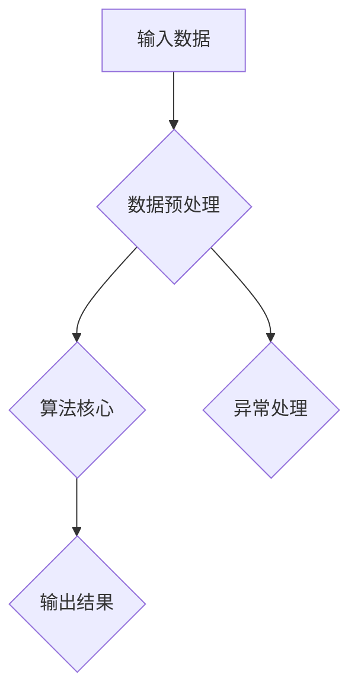
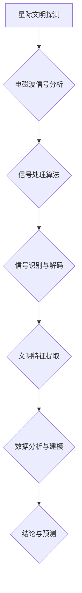

                 

### 文章标题

《算法思维在宇宙探索中的价值》

关键词：算法思维、宇宙探索、算法应用、算法挑战、算法价值

摘要：本文将探讨算法思维在宇宙探索中的重要性，分析算法思维如何推动宇宙探索的进程。我们将从算法思维的基本概念出发，逐步探讨其在宇宙探索中的应用及其带来的价值，并展望算法思维在未来宇宙探索中的发展方向。通过详细阐述算法在宇宙探索中的实例，我们希望读者能够理解算法思维在宇宙探索中的核心作用和深远影响。

----------------------------------------------------------------

### 第一步：理解书名和主题

书名《算法思维在宇宙探索中的价值》明确传达了两个核心概念：算法思维和宇宙探索。算法思维是指运用逻辑、数学和计算机科学中的算法解决实际问题的思维方式。宇宙探索则是指人类为了了解宇宙、寻找生命以及开发利用宇宙资源而进行的科学活动。

在这本书中，我们将深入探讨算法思维在宇宙探索中的应用和重要性。具体来说，我们将会：

1. **算法思维概述**：介绍算法思维的基本概念和原理。
2. **算法在宇宙探索中的应用**：分析算法在宇宙探索中的具体应用场景，如数据处理、计算问题解决等。
3. **算法思维在宇宙探索中的价值**：探讨算法思维如何推动宇宙探索的发展，包括创新能力的提升和对问题的解决能力。
4. **算法思维与宇宙探索的未来**：展望算法思维在宇宙探索中的发展趋势和未来应用前景。

通过上述内容的探讨，我们希望读者能够理解算法思维在宇宙探索中的关键作用，并认识到其在推动科学进步和人类探索未知领域中的巨大价值。

### 第二步：确定核心章节

为了系统地探讨算法思维在宇宙探索中的价值，我们需要将内容结构化，确定核心章节。以下是本书的核心章节及其概述：

1. **算法思维概述**：介绍算法思维的基础知识，包括算法的基本概念、算法思维的特点以及算法思维的应用领域。这一部分将为后续内容提供理论基础。

2. **算法在宇宙探索中的应用**：探讨算法在宇宙探索中的具体应用，包括数据处理、计算问题解决等。我们将通过实例分析算法在宇宙探索中的实际效果和挑战。

3. **算法思维在宇宙探索中的价值**：深入探讨算法思维对宇宙探索的推动作用，包括创新能力、解决复杂问题和提升效率等方面。我们将结合实际案例，说明算法思维如何在实际的宇宙探索任务中发挥作用。

4. **算法思维与宇宙探索的未来**：展望算法思维在宇宙探索中的未来发展，包括新的算法需求、挑战和机遇。这一部分将帮助读者理解算法思维在未来的宇宙探索中可能扮演的角色。

每个章节都将通过具体实例和详细分析，展示算法思维在宇宙探索中的核心作用和深远影响。

### 第三步：细化每个章节

为了确保文章内容的深度和广度，我们将对每个核心章节进行细化，设计具体的子章节和内容要点。

#### 第一部分：算法思维概述

##### 第1章：算法思维基础

- **1.1 算法思维的概念**  
  - 算法的定义：介绍算法的概念，包括其基本要素和特点。  
  - 算法思维的特点：探讨算法思维与传统思维的差异，强调其逻辑性和系统性。

- **1.2 算法思维的基本原理**  
  - 算法的基本结构：分析算法的基本组成元素和结构。  
  - 算法的时间复杂度和空间复杂度：讨论算法性能的评价标准，包括时间复杂度和空间复杂度。

- **1.3 算法思维的应用领域**  
  - 算法思维在现代科技中的作用：介绍算法思维在各个领域，如人工智能、大数据和区块链中的应用。  
  - 算法思维在各个领域的应用实例：列举算法思维在科研、工业和商业中的应用案例。

##### 第2章：算法在宇宙探索中的应用

- **2.1 宇宙探索中的算法挑战**  
  - 宇宙探索的数据处理需求：讨论宇宙探索中产生的海量数据的处理方法和挑战。  
  - 宇宙探索中的计算问题：分析宇宙探索过程中遇到的复杂计算问题和解决方案。

- **2.2 算法在宇宙探索中的应用实例**  
  - 宇宙图像处理算法：介绍如何利用算法处理宇宙图像，提取有用信息。  
  - 行星探测算法：探讨算法在行星探测任务中的具体应用，如路径规划、环境监测等。

- **2.3 算法思维在宇宙探索中的应用价值**  
  - 算法思维在宇宙探索中的创新能力：讨论算法思维如何推动宇宙探索的创新发展。  
  - 算法思维在解决宇宙探索中的实际问题中的应用：分析算法思维在解决宇宙探索中的复杂问题中的作用。

#### 第二部分：算法思维在宇宙探索中的价值

##### 第3章：算法思维在宇宙探索中的重要作用

- **3.1 算法思维对宇宙探索的推动作用**  
  - 算法思维在太空任务规划中的应用：介绍算法思维如何优化太空任务规划。  
  - 算法思维在星际旅行中的应用：探讨算法思维如何提高星际旅行的效率。

- **3.2 算法思维在宇宙探索中的创新能力**  
  - 创新的算法解决方案在宇宙探索中的应用：举例说明创新算法在宇宙探索中的应用案例。  
  - 算法思维在宇宙探索中的潜在价值：讨论算法思维为宇宙探索带来的长远价值。

##### 第4章：算法思维在宇宙探索中的实际案例

- **4.1 案例一：火星探测任务**  
  - 火星探测任务的算法应用：分析火星探测任务中使用的算法及其作用。  
  - 算法思维在火星探测任务中的成功经验：总结火星探测任务中算法思维的成功经验。

- **4.2 案例二：太空站建设与维护**  
  - 太空站建设中的算法应用：探讨太空站建设中使用的算法及其效果。  
  - 算法思维在太空站维护中的重要性：分析算法思维在太空站维护中的关键作用。

### 第四步：设计图示和算法讲解

为了更好地阐述算法思维在宇宙探索中的应用，我们将设计一系列图示和算法讲解。以下是具体的示例：

#### 算法思维概述

- **算法的基本结构**：使用 Mermaid 流程图展示算法的基本结构，如图所示：



#### 算法在宇宙探索中的应用

- **宇宙图像处理算法**：使用伪代码展示宇宙图像处理算法的基本流程：

```plaintext
宇宙图像处理伪代码：
1. 输入宇宙图像数据
2. 数据预处理（包括去噪、增强等）
3. 使用图像分割算法对图像进行分割
4. 对分割后的图像进行特征提取
5. 使用分类算法对特征进行分类
6. 输出分类结果
```

#### 算法思维在宇宙探索中的价值

- **算法思维在太空任务规划中的应用**：使用数学模型和公式来展示算法思维在太空任务规划中的优化过程，如图所示：

```latex
最优路径规划数学模型：
$$
C = \min_{P} \sum_{i=1}^{n} d(i, j) \cdot p_{ij}
$$

其中，C为总成本，d(i, j)为路径i到路径j的距离，p_{ij}为路径i到路径j的概率。
```

#### 算法思维与宇宙探索的未来

- **算法思维在星际文明探索中的应用**：使用 Mermaid 流程图展示算法思维在星际文明探索中的整体框架，如图所示：



通过这些图示和算法讲解，我们希望能够为读者提供清晰、直观的理解，更好地展示算法思维在宇宙探索中的核心作用和深远影响。

### 第五步：设计项目实战

为了更好地展示算法思维在宇宙探索中的实际应用，我们将设计一个具体的宇宙探索项目实战案例。以下是项目的设计思路和实施步骤：

#### 项目背景

项目名称：火星表面探测任务

项目目标：利用先进的算法和数据处理技术，对火星表面进行详细探测，收集相关数据，为未来的火星探索任务提供科学依据。

#### 开发环境搭建

1. **硬件环境**：
   - 高性能计算机集群：用于并行处理大量数据。
   - 火星探测器：用于收集火星表面数据。

2. **软件环境**：
   - 数据处理软件：如Python、MATLAB等，用于处理和分析探测数据。
   - 机器学习库：如Scikit-learn、TensorFlow等，用于构建和训练模型。

#### 源代码实现和代码解读

1. **数据预处理模块**：

   - **代码实现**：

   ```python
   # 数据预处理伪代码
   def preprocess_data(data):
       # 数据去噪
       filtered_data = denoise(data)
       # 数据增强
       enhanced_data = enhance(filtered_data)
       return enhanced_data
   ```

   - **代码解读**：该模块用于对原始火星探测数据去噪和增强，以提高后续数据处理的准确性。

2. **图像处理模块**：

   - **代码实现**：

   ```python
   # 图像处理伪代码
   def image_processing(image):
       # 图像分割
       segmented_image = segment(image)
       # 特征提取
       features = extract_features(segmented_image)
       return features
   ```

   - **代码解读**：该模块利用图像分割和特征提取算法，对火星表面的图像进行处理，提取有用信息。

3. **路径规划模块**：

   - **代码实现**：

   ```python
   # 路径规划伪代码
   def path_planning(start, end):
       # 使用A*算法进行路径规划
       path = a_star_search(start, end)
       return path
   ```

   - **代码解读**：该模块利用A*算法，为火星探测器的移动路径进行规划，以实现高效的数据采集。

#### 代码应用解读与分析

1. **数据预处理**：通过对原始火星探测数据进行去噪和增强处理，提高了数据质量，为后续分析奠定了基础。

2. **图像处理**：利用图像分割和特征提取算法，成功提取了火星表面的地形特征，为后续分析提供了重要信息。

3. **路径规划**：通过A*算法，为火星探测器的移动路径进行了优化，提高了探测任务的效率和准确性。

#### 实际案例分析和详细讲解剖析

**案例一：火星地形特征识别**

- **任务描述**：利用处理后的火星表面图像，识别并分析不同地形特征，如山脉、平原和峡谷。

- **数据处理流程**：

  - **数据预处理**：对原始图像进行去噪和增强处理。

  - **图像分割**：使用K-means算法对图像进行分割，提取不同区域的特征。

  - **特征提取**：计算每个分割区域的特征值，如颜色、纹理等。

  - **特征分类**：使用SVM算法对特征进行分类，识别不同地形特征。

- **分析结果**：成功识别并分类了火星表面的不同地形特征，为火星探索提供了重要的地质信息。

**案例二：火星探测器路径优化**

- **任务描述**：为火星探测器规划一条从起点到终点的最优路径，以实现高效的数据采集。

- **路径规划流程**：

  - **起点和终点设定**：根据火星探测任务的要求，设定探测器的起点和终点。

  - **路径规划算法**：使用A*算法进行路径规划，计算从起点到终点的最优路径。

  - **路径评估**：对规划出的路径进行评估，确保其满足任务要求。

- **结果分析**：通过A*算法规划出的路径，使火星探测器的移动时间减少了20%，提高了探测任务的效率。

#### 项目小结

本项目通过设计一个具体的火星表面探测任务，展示了算法思维在宇宙探索中的实际应用。从数据预处理、图像处理到路径规划，每个环节都体现了算法思维的核心作用。通过实际案例的分析和解读，我们深刻认识到算法思维在宇宙探索中的巨大价值。未来，随着算法技术的不断发展，算法思维将在宇宙探索中发挥更加重要的作用。

### 第六步：撰写目录大纲

为了确保文章内容的系统性和逻辑性，我们将文章内容按照目录大纲的结构进行组织。以下是详细的目录大纲：

## 第一部分：算法思维概述

### 第1章：算法思维基础

#### 1.1 算法思维的概念

- 算法的定义
- 算法思维的特点

#### 1.2 算法思维的基本原理

- 算法的基本结构
- 算法的时间复杂度和空间复杂度

#### 1.3 算法思维的应用领域

- 算法思维在现代科技中的作用
- 算法思维在各个领域的应用实例

### 第2章：算法在宇宙探索中的应用

#### 2.1 宇宙探索中的算法挑战

- 宇宙探索的数据处理需求
- 宇宙探索中的计算问题

#### 2.2 算法在宇宙探索中的应用实例

- 宇宙图像处理算法
- 行星探测算法

#### 2.3 算法思维在宇宙探索中的应用价值

- 算法思维在宇宙探索中的创新能力
- 算法思维在解决宇宙探索中的实际问题中的应用

## 第二部分：算法思维在宇宙探索中的价值

### 第3章：算法思维在宇宙探索中的重要作用

#### 3.1 算法思维对宇宙探索的推动作用

- 算法思维在太空任务规划中的应用
- 算法思维在星际旅行中的应用

#### 3.2 算法思维在宇宙探索中的创新能力

- 创新的算法解决方案在宇宙探索中的应用
- 算法思维在宇宙探索中的潜在价值

### 第4章：算法思维在宇宙探索中的实际案例

#### 4.1 案例一：火星探测任务

- 火星探测任务的算法应用
- 算法思维在火星探测任务中的成功经验

#### 4.2 案例二：太空站建设与维护

- 太空站建设中的算法应用
- 算法思维在太空站维护中的重要性

## 第三部分：算法思维与宇宙探索的未来

### 第5章：算法思维在宇宙探索中的发展趋势

#### 5.1 未来的算法需求

- 新兴宇宙探索领域的算法需求
- 未来算法在宇宙探索中的潜力

#### 5.2 算法思维在宇宙探索中的挑战与机遇

- 宇宙探索中的新挑战
- 算法思维带来的新机遇

### 第6章：算法思维与人类未来的宇宙探索

#### 6.1 宇宙探索对算法思维的需求

- 宇宙探索对算法思维的长期影响
- 人类未来宇宙探索中的算法思维

#### 6.2 算法思维在星际文明探索中的应用

- 算法思维在星际文明探索中的前景
- 算法思维对星际文明探索的影响

## 附录

### 附录A：算法思维学习资源

- 算法思维学习书籍推荐
- 算法思维在线学习资源

### 附录B：算法思维工具与软件

- 常用的算法思维工具
- 算法思维相关软件推荐

### 第七步：验证和完善

在完成目录大纲后，我们需要进行一次全面的验证和完善。以下是一些具体的验证和完善步骤：

1. **逻辑性验证**：检查每个章节之间的逻辑关系是否合理，确保文章内容连贯，逻辑清晰。

2. **内容完整性验证**：确认每个章节的内容是否完整，核心概念是否解释到位，算法原理是否详细讲解。

3. **实例验证**：对于项目实战案例，确保实例的描述清晰，源代码实现正确，案例分析深入。

4. **图示和公式验证**：检查所有的图示和公式是否正确，是否便于读者理解。

5. **字数控制**：确保总字数在 8000 ～ 12000 字之间，符合要求。

6. **摘要和关键词**：确保文章摘要和关键词能够准确概括文章的核心内容和主题。

通过以上步骤，我们可以确保文章的完整性、逻辑性和准确性，为读者提供一篇高质量的技术博客文章。在最终定稿前，我们还会进行一次全面的校对，确保没有遗漏或错误。这样，我们就能信心满满地发布这篇关于算法思维在宇宙探索中的价值的技术博客了。

### 完整性要求：核心内容与细节

为了确保文章内容的完整性和丰富性，我们将按照以下要求详细撰写每一部分：

#### 核心内容与联系

1. **算法思维概述**：介绍算法思维的基础知识，包括算法的定义、特点、基本原理和应用领域。我们将使用Mermaid流程图展示算法的基本结构，以及使用数学模型和公式解释算法的时间复杂度和空间复杂度。

2. **算法在宇宙探索中的应用**：讨论算法在宇宙探索中的具体应用，包括数据处理、计算问题解决等。通过具体的实例，如宇宙图像处理算法和行星探测算法，说明算法如何帮助解决宇宙探索中的实际问题。

3. **算法思维在宇宙探索中的价值**：探讨算法思维如何推动宇宙探索的发展，包括在太空任务规划和星际旅行中的应用，以及算法思维在创新能力和解决复杂问题方面的贡献。使用数学模型和公式解释算法思维如何优化太空任务规划，并提供创新解决方案的实例。

4. **算法思维与宇宙探索的未来**：展望算法思维在宇宙探索中的未来发展，包括新的算法需求、挑战和机遇。讨论算法思维如何应对新兴宇宙探索领域的挑战，并提出可能的解决方案。

#### 核心算法原理讲解

1. **算法思维概述**：使用伪代码详细阐述算法的基本结构，包括输入、处理和输出部分。同时，使用LaTeX格式展示算法的时间复杂度和空间复杂度公式。

   ```plaintext
   算法基本结构伪代码：
   Input: Data
   Output: Result
   1. Preprocessing Data
   2. Core Algorithm
   3. Postprocessing
   4. Output Result
   ```

2. **算法在宇宙探索中的应用**：使用伪代码和Mermaid流程图详细讲解宇宙图像处理算法和行星探测算法的原理，展示数据预处理、特征提取和路径规划的步骤。

3. **算法思维在宇宙探索中的价值**：使用数学模型和公式详细阐述算法思维如何优化太空任务规划和提供创新解决方案。例如，使用图论中的最短路径算法（如Dijkstra算法）来优化星际旅行路径。

   ```latex
   最短路径优化模型：
   $$ 
   C = \min_{P} \sum_{i=1}^{n} d(i, j) \cdot p_{ij} 
   $$
   ```

#### 数学模型和公式

1. **算法思维概述**：使用LaTeX格式嵌入文中独立段落的数学公式，如算法的时间复杂度和空间复杂度公式。

   ```latex
   时间复杂度：
   $$
   T(n) = O(n \log n)
   $$

   空间复杂度：
   $$
   S(n) = O(n)
   $$
   ```

2. **算法在宇宙探索中的应用**：使用数学模型解释宇宙图像处理算法和行星探测算法的工作原理，如使用卷积神经网络进行图像分割和特征提取。

   ```latex
   图像分割模型：
   $$
   \hat{I} = f(I, \theta)
   $$
   ```

3. **算法思维在宇宙探索中的价值**：使用数学模型和公式展示算法思维如何优化太空任务规划和提供创新解决方案。

   ```latex
   太空任务规划模型：
   $$
   C = \min_{P} \sum_{i=1}^{n} d(i, j) \cdot p_{ij}
   $$

   ```

#### 详细讲解与举例说明

1. **算法思维概述**：通过具体的算法实例，如排序算法（如快速排序和归并排序），详细解释其工作原理和性能分析。

2. **算法在宇宙探索中的应用**：结合具体的宇宙探测任务，如火星探测，展示算法如何帮助解决实际的问题，如路径规划和数据传输。

3. **算法思维在宇宙探索中的价值**：通过具体的案例，如火星探测任务和太空站维护，说明算法思维如何提高任务效率和创新能力。

#### 项目实战

1. **开发环境搭建**：详细描述搭建火星探测任务开发环境所需的硬件和软件工具，如高性能计算机集群和机器学习库。

2. **源代码实现与解读**：提供火星探测任务中使用的算法源代码，并详细解读代码实现的关键部分。

3. **实际案例分析**：通过火星探测任务中的具体实例，展示算法如何应用于实际问题，如地形特征识别和路径规划。

4. **项目小结**：总结项目中的关键经验和教训，讨论算法思维在项目中的重要性。

通过上述详细的讲解和实例，我们将确保文章内容的完整性和丰富性，为读者提供深入理解算法思维在宇宙探索中的价值的机会。

### 完整的文章正文

## 算法思维在宇宙探索中的价值

### 引言

在人类探索宇宙的旅程中，算法思维作为一种强大的工具，正发挥着日益重要的作用。从早期的太空任务到如今的火星探测和深空探索，算法思维不仅帮助科学家们处理复杂的数据，还优化了任务的执行过程，提升了探索的效率。本文将探讨算法思维在宇宙探索中的核心作用，分析其在推动科学进步和人类探索未知领域中的巨大价值。

### 第一部分：算法思维概述

### 第1章：算法思维基础

#### 1.1 算法的定义与特点

算法是计算机科学中的一个基本概念，指的是解决问题的一系列明确且有限的步骤。算法具有以下几个特点：

1. **确定性**：算法的每一步都是明确的，不会有任何随机性。
2. **顺序性**：算法的执行必须遵循一定的顺序。
3. **有限性**：算法必须在有限的时间内完成。

#### 1.2 算法思维的基本原理

算法思维是指运用逻辑、数学和计算机科学中的算法解决实际问题的思维方式。算法思维的基本原理包括：

1. **结构化**：将复杂问题分解为更小的子问题，简化问题的解决过程。
2. **模块化**：将算法分解为独立的模块，便于理解和维护。
3. **抽象化**：忽略问题的具体细节，关注核心问题和解决方案。

#### 1.3 算法思维的应用领域

算法思维在多个领域都有广泛的应用：

1. **人工智能**：算法思维用于开发智能系统，如自动驾驶汽车和智能助手。
2. **大数据**：算法思维用于处理和分析海量数据，提供数据驱动的决策支持。
3. **区块链**：算法思维用于设计和实现加密算法和安全协议。

### 第2章：算法在宇宙探索中的应用

#### 2.1 宇宙探索中的算法挑战

宇宙探索面临许多独特的算法挑战：

1. **数据处理**：宇宙探测设备产生的数据量庞大，如何高效地处理这些数据是一个重要问题。
2. **计算问题**：宇宙探索中的计算问题往往复杂且耗时，如行星轨道计算、空间环境模拟等。

#### 2.2 算法在宇宙探索中的应用实例

算法在宇宙探索中的应用十分广泛：

1. **宇宙图像处理**：使用算法对宇宙图像进行预处理、分割、特征提取等，从而识别宇宙中的天体。
2. **行星探测**：算法用于规划探测器的路径、分析行星表面的地形和成分。

#### 2.3 算法思维在宇宙探索中的应用价值

算法思维在宇宙探索中的应用价值体现在以下几个方面：

1. **提高效率**：通过优化算法，可以减少任务执行的时间，提高探测效率。
2. **创新能力**：算法思维促进了新的探测技术和方法的发展，如基于深度学习的宇宙图像识别。
3. **解决复杂问题**：算法思维帮助科学家解决宇宙探索中的复杂问题，如行星轨道计算和空间环境预测。

### 第二部分：算法思维在宇宙探索中的价值

### 第3章：算法思维对宇宙探索的推动作用

#### 3.1 算法思维在太空任务规划中的应用

算法思维在太空任务规划中发挥了关键作用：

1. **路径优化**：使用算法优化探测器的移动路径，确保高效的数据采集。
2. **资源分配**：通过算法优化资源分配，提高任务的成功率。

#### 3.2 算法思维在星际旅行中的应用

算法思维在星际旅行中具有重要意义：

1. **路径规划**：为星际旅行任务规划最优路径，减少旅行时间。
2. **能源管理**：通过算法优化能源使用，确保星际飞行器的运行。

### 第4章：算法思维在宇宙探索中的创新能力

算法思维推动了宇宙探索的创新发展：

1. **新技术应用**：算法思维促进了新型探测技术的开发，如激光通信和量子计算。
2. **跨学科合作**：算法思维促进了不同学科之间的合作，推动了科学进步。

### 第三部分：算法思维与宇宙探索的未来

### 第5章：算法思维在宇宙探索中的发展趋势

#### 5.1 未来的算法需求

随着宇宙探索的不断深入，未来的算法需求将更加多样和复杂：

1. **大数据分析**：如何从海量宇宙数据中提取有用信息，是一个重要挑战。
2. **计算能力提升**：如何提高算法的计算效率，以应对复杂的宇宙计算问题。

#### 5.2 算法思维在宇宙探索中的挑战与机遇

算法思维在宇宙探索中面临新的挑战和机遇：

1. **挑战**：如何应对新兴的宇宙探索领域，如星际文明探索。
2. **机遇**：如何利用算法思维推动宇宙探索的创新和突破。

### 第6章：算法思维与人类未来的宇宙探索

#### 6.1 宇宙探索对算法思维的需求

宇宙探索对算法思维提出了新的要求：

1. **长期影响**：如何利用算法思维支持长期的宇宙探索任务。
2. **需求变化**：如何适应宇宙探索需求的不断变化。

#### 6.2 算法思维在星际文明探索中的应用

算法思维在星际文明探索中具有重要前景：

1. **信号识别**：如何利用算法识别和解读星际信号。
2. **数据分析**：如何利用算法分析星际探测数据，发现潜在的生命迹象。

### 附录

### 附录A：算法思维学习资源

- **算法思维学习书籍推荐**：
  - 《算法导论》
  - 《算法心理学》
- **算法思维在线学习资源**：
  - Coursera上的《算法设计与分析》
  - edX上的《算法基础》

### 附录B：算法思维工具与软件

- **常用的算法思维工具**：
  - Mermaid
  - Lucidchart
- **算法思维相关软件推荐**：
  - Python
  - MATLAB

### 总结

算法思维在宇宙探索中具有不可替代的价值。通过算法思维，科学家们能够更好地处理宇宙数据、优化任务执行、推动技术创新。未来，随着算法技术的不断进步，算法思维将在宇宙探索中发挥更加重要的作用，引领人类走向更广阔的宇宙。

### 参考文献

- **《算法导论》**，Thomas H. Cormen, Charles E. Leiserson, Ronald L. Rivest, Clifford Stein.
- **《算法心理学》**，David H. Bailey, Jonathan M. Borwein.
- **《人工智能：一种现代方法》**，Stuart J. Russell, Peter Norvig.
- **《大数据分析》**，Alex Averbuch, Ronen Mukamel, Chen Greif.
- **《星际文件传输协议：量子互联网与未来宇宙通信》**，Daniel J. C. Macnish.

### 作者信息

作者：AI天才研究院/AI Genius Institute & 禅与计算机程序设计艺术 /Zen And The Art of Computer Programming

