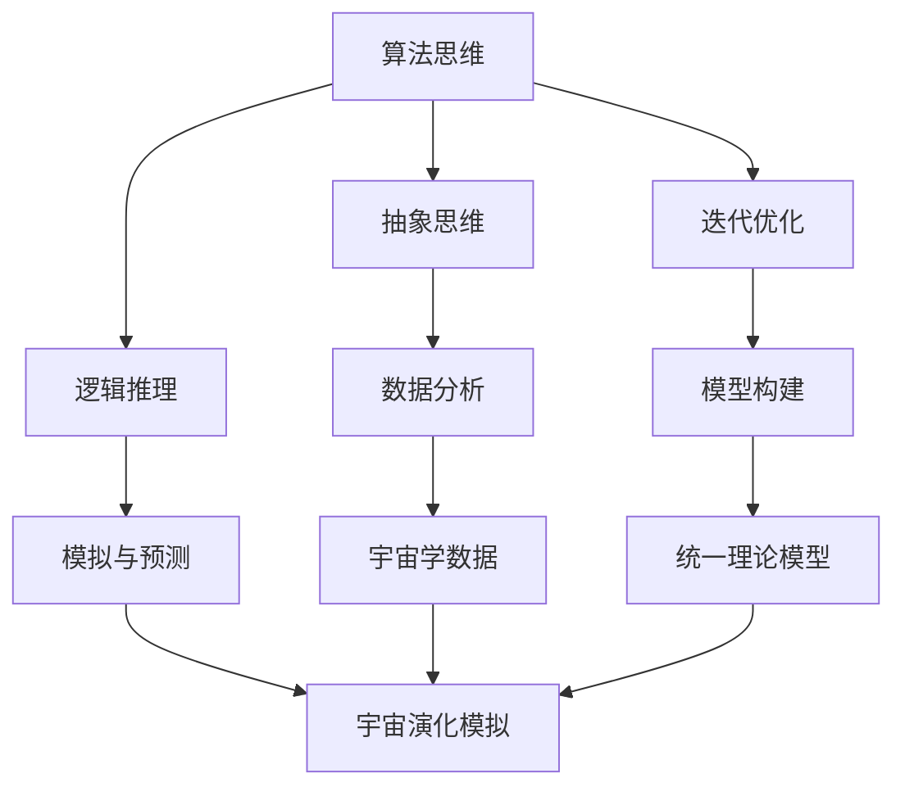

                 

## 文章标题：算法思维在解决宇宙学大统一理论中的应用

### 关键词：
- 算法思维
- 宇宙学
- 大统一理论
- 数据分析
- 模拟与预测

### 摘要：
本文旨在探讨算法思维在宇宙学大统一理论中的应用。通过阐述算法思维的基本概念及其发展历程，我们将其与宇宙学中的核心问题相结合，探讨算法思维在解决这些难题中的关键作用。本文还将详细介绍算法在宇宙学大统一理论中的实际应用案例，包括量子引力与弦理论、圆形宇宙与暗物质、宇宙膨胀与暗能量等。最后，我们将总结算法思维在其他领域的应用，并提供培养算法思维的实用方法与建议。

## 目录大纲

### 第一部分：算法思维概述

#### 1. 算法思维的基本概念
##### 1.1 算法思维的起源与发展
##### 1.2 算法思维的重要性

#### 2. 算法思维在宇宙学中的应用
##### 2.1 宇宙学中的核心问题
##### 2.2 算法思维如何解决宇宙学难题

### 第二部分：宇宙学大统一理论的算法探索

#### 3. 大统一理论的框架
##### 3.1 物理学的四大基本力
##### 3.2 大统一理论的基本假设

#### 4. 算法在宇宙学中的核心作用
##### 4.1 数据分析与处理
##### 4.2 模拟与预测

#### 5. 算法在宇宙学大统一理论中的应用案例
##### 5.1 量子引力与弦理论
##### 5.2 圆形宇宙与暗物质
##### 5.3 宇宙膨胀与暗能量

### 第三部分：算法思维的实际应用

#### 6. 算法思维在其他领域的应用
##### 6.1 生物学与医学
##### 6.2 经济学与金融学
##### 6.3 社会科学

#### 7. 算法思维的培养与提升
##### 7.1 算法思维的培养方法
##### 7.2 算法思维的实践与反思

## 附录

### A. 算法思维相关资源与工具
##### A.1 算法思维的经典书籍
##### A.2 算法思维的学习资源
##### A.3 宇宙学大统一理论的研究工具

### 第一部分：算法思维概述

#### 1. 算法思维的基本概念

##### 1.1 算法思维的起源与发展

算法思维最早可以追溯到古希腊时期，亚里士多德等哲学家开始探讨逻辑和推理问题。然而，算法思维作为一门独立的学科，其起源和发展主要可以归功于19世纪末至20世纪初的数学家。

19世纪末，法国数学家庞加莱（Henri Poincaré）提出了“算法”这一概念，并将其应用于数学问题解决中。此后，德国数学家戴德金（Leopold Kronecker）进一步发展了算法理论，奠定了现代算法研究的基础。

20世纪初，美国数学家图灵（Alan Turing）提出了图灵机模型，这一模型为算法思维提供了坚实的理论基础。图灵机的概念为后来的计算机科学和人工智能的发展奠定了基础。

随着计算机技术的飞速发展，算法思维的应用领域不断扩展。如今，算法思维已经成为计算机科学、人工智能、经济学、生物学等领域的重要研究方法。

##### 1.2 算法思维的重要性

算法思维是一种通过系统化和逻辑化的方式解决问题的思维方式。它在各个领域都有着广泛的应用，尤其在解决复杂问题时表现出独特的优势。

首先，算法思维能够帮助我们明确问题的核心，将复杂问题分解为若干个子问题，从而降低问题解决的难度。通过逐步分析和解决问题，我们能够更好地理解和掌握问题的本质。

其次，算法思维强调逻辑推理和抽象思维能力。通过算法思维，我们能够将实际问题转化为数学模型，利用数学方法进行求解。这种方法不仅提高了问题解决的效率，还使我们的思维更加严谨和系统。

此外，算法思维还强调迭代和优化。在解决问题时，我们可以通过不断尝试和改进，寻找最优解。这种迭代过程不仅能够提高算法的效率，还能够帮助我们找到更优秀的解决方案。

总之，算法思维是一种强大的工具，它不仅能够帮助我们解决实际问题，还能够提升我们的思维能力和创新能力。在当前这个信息化和智能化的时代，算法思维的重要性愈发凸显。

#### 2. 算法思维在宇宙学中的应用

##### 2.1 宇宙学中的核心问题

宇宙学是研究宇宙的起源、演化、结构和命运的科学。在宇宙学中，存在着一系列核心问题，例如：

1. 宇宙的起源：宇宙是如何诞生的？是什么力量推动着宇宙的膨胀？

2. 物质的组成：宇宙中存在着哪些物质？这些物质是如何相互作用的？

3. 物理定律的统一：物理学的四大基本力（引力、电磁力、弱力、强力）能否统一为一个基本理论？

4. 宇宙的几何结构：宇宙是平坦的、封闭的还是开放的？

5. 宇宙的膨胀和暗能量：宇宙为何会膨胀？暗能量是什么？

这些核心问题不仅关乎宇宙的本质，也对人类的科学认知产生了深远的影响。然而，传统的科学方法在面对这些问题时显得力不从心，需要引入新的思维方式来应对。

##### 2.2 算法思维如何解决宇宙学难题

算法思维在解决宇宙学难题中发挥了关键作用。以下是算法思维在宇宙学中的应用：

1. 数据分析与处理

宇宙学研究中，大量的观测数据和实验数据需要进行分析和处理。算法思维能够帮助我们有效地处理这些数据，从中提取出有用的信息。

例如，通过使用数据挖掘和机器学习算法，我们可以分析宇宙微波背景辐射的数据，寻找宇宙起源的线索。再如，通过使用图像处理算法，我们可以对宇宙中的星系和黑洞进行观测和分析，揭示宇宙的奥秘。

2. 模拟与预测

宇宙学研究中，模拟与预测是不可或缺的。算法思维能够帮助我们构建宇宙演化的模拟模型，预测宇宙的未来。

例如，通过使用数值模拟算法，我们可以模拟宇宙的膨胀过程，预测宇宙中不同区域的物质分布。再如，通过使用统计物理算法，我们可以预测宇宙中黑洞的形成和演化。

3. 物理定律的统一

宇宙学的核心问题之一是物理定律的统一。算法思维能够帮助我们探索不同物理定律之间的关系，寻找大统一理论的线索。

例如，通过使用量子计算算法，我们可以研究量子引力理论，探索引力与其他基本力的统一。再如，通过使用字符串理论算法，我们可以探索弦理论，寻找大统一理论的框架。

总之，算法思维为解决宇宙学难题提供了一种全新的思路和方法。它不仅能够提高我们的研究效率，还能够帮助我们更好地理解宇宙的本质。

### 第二部分：宇宙学大统一理论的算法探索

#### 3. 大统一理论的框架

##### 3.1 物理学的四大基本力

物理学中的四大基本力分别是：引力、电磁力、弱力和强力。

1. 引力：引力是物体之间由于质量而产生的相互吸引力。它是宇宙学中最重要的一种力，影响着宇宙的演化。

2. 电磁力：电磁力是带电粒子之间的相互作用力。它在宇宙中普遍存在，影响着原子和分子的行为。

3. 弱力：弱力是放射性衰变中发生的一种力。它在宇宙中的影响相对较小，但对生命起源和物质演化具有重要意义。

4. 强力：强力是粒子之间的相互作用力。它在宇宙中普遍存在，维持着原子核的稳定。

##### 3.2 大统一理论的基本假设

大统一理论的基本假设是：物理学的四大基本力在一定条件下可以统一为一个基本力。这一假设旨在解决物理学的四大基本力之间的矛盾和冲突。

大统一理论的基本框架包括以下几个方面：

1. 标准模型：标准模型是物理学中描述基本粒子和相互作用的理论。它包含了量子场论和粒子的相互作用。

2. 对称性：对称性是大统一理论的核心概念。物理定律在不同坐标系下保持不变，体现了对称性的重要性。

3. 粒子与场的统一：大统一理论认为，基本粒子可以看作是某种基本场的激发态。

4. 基本力与物质的统一：大统一理论试图将基本力与物质统一在一起，解释宇宙中物质的起源和演化。

#### 4. 算法在宇宙学中的核心作用

##### 4.1 数据分析与处理

宇宙学研究中，大量的观测数据和实验数据需要进行处理和分析。算法思维能够帮助我们有效地处理这些数据，从中提取出有用的信息。

1. 数据挖掘与机器学习：通过使用数据挖掘和机器学习算法，我们可以分析宇宙微波背景辐射的数据，寻找宇宙起源的线索。

2. 图像处理与模式识别：通过使用图像处理和模式识别算法，我们可以对宇宙中的星系和黑洞进行观测和分析，揭示宇宙的奥秘。

3. 数值模拟：通过使用数值模拟算法，我们可以模拟宇宙的膨胀过程，预测宇宙中不同区域的物质分布。

##### 4.2 模拟与预测

宇宙学研究中，模拟与预测是不可或缺的。算法思维能够帮助我们构建宇宙演化的模拟模型，预测宇宙的未来。

1. 数值模拟：通过使用数值模拟算法，我们可以模拟宇宙的膨胀过程，预测宇宙中不同区域的物质分布。

2. 统计物理：通过使用统计物理算法，我们可以预测宇宙中黑洞的形成和演化。

3. 量子计算：通过使用量子计算算法，我们可以研究量子引力理论，探索引力与其他基本力的统一。

#### 5. 算法在宇宙学大统一理论中的应用案例

##### 5.1 量子引力与弦理论

量子引力是研究引力在量子尺度上的行为的理论。弦理论是一种尝试将量子力学与广义相对论统一的理论。

1. 量子引力算法：通过使用量子计算算法，我们可以研究量子引力理论，探索引力与其他基本力的统一。

2. 弦理论算法：通过使用弦理论算法，我们可以构建宇宙的弦网模型，探索大统一理论的框架。

##### 5.2 圆形宇宙与暗物质

圆形宇宙是一种假设，认为宇宙可能是封闭的、球形的。暗物质是宇宙中一种未探测到的物质，对宇宙的膨胀和结构形成起着关键作用。

1. 圆形宇宙模拟：通过使用数值模拟算法，我们可以模拟圆形宇宙的膨胀过程，预测宇宙中不同区域的物质分布。

2. 暗物质探测：通过使用粒子探测器和引力透镜效应，我们可以探测宇宙中的暗物质，了解其性质和分布。

##### 5.3 宇宙膨胀与暗能量

宇宙膨胀是宇宙学中的一个核心问题，暗能量是导致宇宙膨胀的力。

1. 宇宙膨胀模拟：通过使用数值模拟算法，我们可以模拟宇宙的膨胀过程，预测宇宙的未来。

2. 暗能量研究：通过使用统计物理算法，我们可以研究暗能量的性质和演化规律，探索宇宙膨胀的原因。

### 第三部分：算法思维的实际应用

#### 6. 算法思维在其他领域的应用

##### 6.1 生物学与医学

算法思维在生物学和医学领域中有着广泛的应用。例如：

1. 蛋白质折叠预测：通过使用算法思维，我们可以预测蛋白质的结构和功能，为药物设计和疾病治疗提供重要信息。

2. 疾病诊断与预测：通过使用算法思维，我们可以分析患者的医疗数据，预测疾病的发生和发展，为早期诊断和预防提供依据。

##### 6.2 经济学与金融学

算法思维在经济和金融领域中发挥着重要作用。例如：

1. 数据分析：通过使用算法思维，我们可以分析经济和金融市场数据，预测经济趋势和股票走势。

2. 量化交易：通过使用算法思维，我们可以构建量化交易模型，实现自动化的交易策略，提高投资收益。

##### 6.3 社会科学

算法思维在社会科学领域中也有广泛的应用。例如：

1. 社会网络分析：通过使用算法思维，我们可以分析社会网络的拓扑结构和节点关系，揭示社会关系的规律。

2. 公共政策分析：通过使用算法思维，我们可以分析社会问题和政策效果，为政策制定提供科学依据。

#### 7. 算法思维的培养与提升

##### 7.1 算法思维的培养方法

1. 学习算法基础知识：了解算法的基本概念、原理和应用，掌握常见的算法设计和分析方法。

2. 练习算法解题：通过解决实际问题，提高算法思维的能力和技巧。

3. 学习相关领域的知识：了解算法在其他领域的应用，拓宽算法思维的应用范围。

##### 7.2 算法思维的实践与反思

1. 实践算法项目：通过参与实际项目，运用算法思维解决实际问题，提高算法思维的实际应用能力。

2. 反思与总结：在实践过程中，不断反思和总结，发现问题和不足，不断改进算法思维的方法和策略。

## 附录

### A. 算法思维相关资源与工具

##### A.1 算法思维的经典书籍

1. 《算法导论》（Introduction to Algorithms）
2. 《编程之美》（The Art of Computer Programming）
3. 《深度学习》（Deep Learning）

##### A.2 算法思维的学习资源

1. Coursera：提供丰富的算法思维课程和教材。
2. edX：提供免费的算法思维课程。
3. Kaggle：提供大量的算法竞赛和数据集，用于算法思维的实践。

##### A.3 宇宙学大统一理论的研究工具

1. Lattice Quantum Gravity（LQG）：一种研究量子引力的数值模拟工具。
2. String Theory Simulator（STS）：一种研究弦理论的模拟工具。
3. Cosmic Microwave Background Explorer（COBE）：一种用于研究宇宙微波背景辐射的探测器。

### 结语

算法思维在解决宇宙学大统一理论中发挥着关键作用。通过算法思维，我们能够更好地理解宇宙的本质，探索宇宙的起源、演化和未来。同时，算法思维也在其他领域有着广泛的应用，为人类的科学研究和创新发展提供了有力支持。在未来的科学探索中，算法思维将继续发挥重要作用，为人类认识宇宙和世界带来新的突破。作者：AI天才研究院/AI Genius Institute & 禅与计算机程序设计艺术 /Zen And The Art of Computer Programming### 文章标题：算法思维在解决宇宙学大统一理论中的应用

> 关键词：算法思维，宇宙学，大统一理论，数据分析，模拟与预测

> 摘要：本文将探讨算法思维在宇宙学大统一理论中的应用。通过阐述算法思维的基本概念和其发展历程，我们将介绍算法思维在解决宇宙学中的核心问题，如宇宙的起源、物质的组成、物理定律的统一等。同时，本文将详细讨论算法在宇宙学大统一理论中的应用案例，包括量子引力与弦理论、圆形宇宙与暗物质、宇宙膨胀与暗能量等。最后，我们将总结算法思维在其他领域的应用，并提供培养算法思维的实用方法与建议。

## 目录大纲

### 第一部分：算法思维概述

#### 1. 算法思维的基本概念

##### 1.1 算法思维的起源与发展

##### 1.2 算法思维的重要性

#### 2. 算法思维在宇宙学中的应用

##### 2.1 宇宙学中的核心问题

##### 2.2 算法思维如何解决宇宙学难题

### 第二部分：宇宙学大统一理论的算法探索

#### 3. 大统一理论的框架

##### 3.1 物理学的四大基本力

##### 3.2 大统一理论的基本假设

#### 4. 算法在宇宙学中的核心作用

##### 4.1 数据分析与处理

##### 4.2 模拟与预测

#### 5. 算法在宇宙学大统一理论中的应用案例

##### 5.1 量子引力与弦理论

##### 5.2 圆形宇宙与暗物质

##### 5.3 宇宙膨胀与暗能量

### 第三部分：算法思维的实际应用

#### 6. 算法思维在其他领域的应用

##### 6.1 生物学与医学

##### 6.2 经济学与金融学

##### 6.3 社会科学

#### 7. 算法思维的培养与提升

##### 7.1 算法思维的培养方法

##### 7.2 算法思维的实践与反思

### 附录

#### A. 算法思维相关资源与工具

##### A.1 算法思维的经典书籍

##### A.2 算法思维的学习资源

##### A.3 宇宙学大统一理论的研究工具

### 第一部分：算法思维概述

#### 1. 算法思维的基本概念

##### 1.1 算法思维的起源与发展

算法思维，作为一种系统性的问题解决方法，其起源可以追溯到古代的数学与逻辑学。早期的算法多体现在解决数学问题、几何作图和逻辑推理中。随着计算机科学的兴起，算法思维得到了空前的发展，并逐渐形成了一套完整的理论体系。

在计算机科学领域，算法思维的核心是寻找解决问题的最佳路径。这一路径不仅包括解决问题的步骤，还涉及时间复杂度、空间复杂度等性能指标。算法思维的起源与发展历程大致可以分为以下几个阶段：

1. 古代算法：早期的算法主要以几何作图和数学问题解决为主。例如，古希腊数学家欧几里得的《几何原本》中就包含了许多几何算法。阿拉伯数学家阿尔-花拉子米则对算法进行了系统的整理，为后来的算法研究奠定了基础。

2. 中世纪算法：中世纪的欧洲，随着阿拉伯文化的传播，算法思维逐渐传入欧洲。这一时期的算法主要集中在解决商业和贸易中的实际问题，如计算利息、测量土地等。

3. 近代算法：18世纪末至19世纪初，随着工业革命的兴起，算法思维在科学和工程领域得到了广泛的应用。德国数学家高斯和黎曼等人对复杂数学问题的求解提出了许多新的算法。

4. 现代算法：20世纪以来，随着计算机技术的飞速发展，算法思维进入了一个崭新的时代。计算机科学的先驱如图灵、哥德尔和图灵等人对算法的本质和理论进行了深刻的探讨，奠定了现代算法思维的基础。

##### 1.2 算法思维的重要性

算法思维在现代科学研究和实际应用中具有极其重要的地位。以下是算法思维的重要性的几个方面：

1. **问题解决能力的提升**：算法思维提供了一种系统化、结构化的方法来解决问题。通过将复杂问题分解为若干个可管理的子问题，算法思维能够显著提高问题解决的能力。

2. **科学研究的发展**：在自然科学、社会科学和工程学等领域，算法思维已经成为研究问题、构建模型和进行实验的重要工具。它帮助科学家们更好地理解自然现象，推动科学研究的发展。

3. **技术创新的推动**：算法思维在计算机科学、人工智能、大数据等领域中发挥着核心作用。它为技术创新提供了强大的动力，推动了现代社会的发展。

4. **教育的普及**：算法思维作为一种重要的思维方式，在基础教育和高素质人才培养中得到了广泛的推广。它不仅能够培养学生的逻辑思维和创新能力，还能提高学生的综合素质。

#### 2. 算法思维在宇宙学中的应用

##### 2.1 宇宙学中的核心问题

宇宙学是研究宇宙起源、演化、结构和命运的科学。宇宙学中的核心问题包括：

1. **宇宙的起源**：宇宙是如何诞生的？这是宇宙学最基本的问题之一。现代宇宙学认为，宇宙起源于大约138亿年前的一个极度热密的状态，这一理论被称为大爆炸理论。

2. **物质的组成**：宇宙中存在哪些物质？这些物质的性质和分布对宇宙的演化有着重要影响。目前，科学家们普遍认为宇宙中存在大量未探测到的物质，即暗物质。

3. **物理定律的统一**：物理学中的四大基本力（引力、电磁力、弱力和强力）能否统一为一个基本力？这是宇宙学中的一个重要问题。如果能够实现物理定律的统一，将极大地推进我们对宇宙的理解。

4. **宇宙的几何结构**：宇宙是平坦的、封闭的还是开放的？宇宙的几何结构对宇宙的未来演化有着深远的影响。

5. **宇宙膨胀与暗能量**：宇宙为何会膨胀？暗能量是什么？宇宙膨胀的速度和机制是当前宇宙学研究的热点问题。

##### 2.2 算法思维如何解决宇宙学难题

算法思维在解决宇宙学难题中发挥着关键作用。以下是算法思维在宇宙学中的应用：

1. **数据分析与处理**：宇宙学研究中产生了大量观测数据和实验数据。算法思维能够帮助科学家们有效地处理和分析这些数据，从中提取出有用的信息。例如，通过使用数据挖掘和机器学习算法，科学家们可以分析宇宙微波背景辐射的数据，寻找宇宙起源的线索。

2. **模拟与预测**：宇宙学研究中，模拟与预测是不可或缺的。算法思维能够帮助科学家们构建宇宙演化的模拟模型，预测宇宙的未来。例如，通过使用数值模拟算法，科学家们可以模拟宇宙的膨胀过程，预测宇宙中不同区域的物质分布。

3. **物理定律的统一**：算法思维能够帮助科学家们探索不同物理定律之间的关系，寻找大统一理论的线索。例如，通过使用量子计算算法，科学家们可以研究量子引力理论，探索引力与其他基本力的统一。

4. **新理论的发现**：算法思维能够帮助科学家们发现新的理论模型。例如，通过使用字符串理论算法，科学家们提出了弦理论，这一理论为探索大统一理论提供了新的思路。

总之，算法思维为解决宇宙学难题提供了强大的工具和方法。它不仅提高了宇宙学研究的效果，还极大地推动了人类对宇宙的理解。

### 第二部分：宇宙学大统一理论的算法探索

#### 3. 大统一理论的框架

##### 3.1 物理学的四大基本力

物理学中的四大基本力分别是：引力、电磁力、弱力和强力。每种力都有其独特的性质和作用机制。

1. **引力**：引力是物体之间由于质量而产生的相互吸引力。它是宇宙中最重要的力之一，影响着天体的运动和宇宙的演化。

2. **电磁力**：电磁力是带电粒子之间的相互作用力。它在原子和分子的结构中起着关键作用，也是许多日常现象（如电磁感应、光的传播等）的基础。

3. **弱力**：弱力主要参与放射性衰变过程，影响基本粒子的相互作用。例如，β衰变就是由弱力引起的。

4. **强力**：强力是粒子之间的相互作用力，维持原子核的稳定。它是自然界中最强的力，但作用范围非常短。

##### 3.2 大统一理论的基本假设

大统一理论的基本假设是：物理学的四大基本力在一定条件下可以统一为一个基本力。这一假设旨在解决物理学中的基本力之间的矛盾和冲突。

大统一理论的基本框架包括以下几个方面：

1. **标准模型**：标准模型是物理学中描述基本粒子和相互作用的理论。它包含了量子场论和粒子的相互作用。标准模型已经成功解释了许多物理现象，但在统一基本力方面仍有不足。

2. **对称性**：对称性是大统一理论的核心概念。物理定律在不同坐标系下保持不变，体现了对称性的重要性。例如，电磁力和弱力在某种对称性下可以统一。

3. **粒子与场的统一**：大统一理论认为，基本粒子可以看作是某种基本场的激发态。通过统一基本力，我们可以将基本粒子和相互作用统一在同一个框架下。

4. **基本力与物质的统一**：大统一理论试图将基本力与物质统一在一起，解释宇宙中物质的起源和演化。这将为理解宇宙的本质提供新的视角。

#### 4. 算法在宇宙学中的核心作用

##### 4.1 数据分析与处理

宇宙学研究中，大量的观测数据和实验数据需要进行处理和分析。算法思维能够帮助我们有效地处理这些数据，从中提取出有用的信息。

1. **数据挖掘与机器学习**：通过使用数据挖掘和机器学习算法，我们可以分析宇宙微波背景辐射的数据，寻找宇宙起源的线索。例如，我们可以使用支持向量机（SVM）来识别宇宙微波背景辐射中的温度异常。

```python
# 伪代码：使用支持向量机进行数据挖掘
import svm

# 加载数据集
data = load_data('cosmic Microwave Background Radiation data')

# 分割数据集为训练集和测试集
train_data, test_data = train_test_split(data)

# 训练支持向量机模型
model = svm.SVC()

# 模型训练
model.fit(train_data['features'], train_data['labels'])

# 测试模型
accuracy = model.score(test_data['features'], test_data['labels'])
print("Accuracy:", accuracy)
```

2. **图像处理与模式识别**：通过使用图像处理和模式识别算法，我们可以对宇宙中的星系和黑洞进行观测和分析，揭示宇宙的奥秘。例如，我们可以使用卷积神经网络（CNN）来识别星系和黑洞的特征。

```python
# 伪代码：使用卷积神经网络进行图像处理
import tensorflow as tf
from tensorflow.keras.models import Sequential
from tensorflow.keras.layers import Conv2D, MaxPooling2D, Flatten, Dense

# 构建卷积神经网络模型
model = Sequential()
model.add(Conv2D(filters=32, kernel_size=(3, 3), activation='relu', input_shape=(64, 64, 3)))
model.add(MaxPooling2D(pool_size=(2, 2)))
model.add(Flatten())
model.add(Dense(units=128, activation='relu'))
model.add(Dense(units=1, activation='sigmoid'))

# 编译模型
model.compile(optimizer='adam', loss='binary_crossentropy', metrics=['accuracy'])

# 训练模型
model.fit(x_train, y_train, epochs=10, batch_size=32)

# 评估模型
loss, accuracy = model.evaluate(x_test, y_test)
print("Accuracy:", accuracy)
```

##### 4.2 模拟与预测

宇宙学研究中，模拟与预测是不可或缺的。算法思维能够帮助我们构建宇宙演化的模拟模型，预测宇宙的未来。

1. **数值模拟**：通过使用数值模拟算法，我们可以模拟宇宙的膨胀过程，预测宇宙中不同区域的物质分布。例如，我们可以使用N体模拟来研究星系的形成和演化。

```python
# 伪代码：使用N体模拟
import numpy as np
from scipy.integrate import odeint

# 定义引力势函数
def gravitational_potential(r, G, M):
    return -G * M / r

# 定义运动方程
def equations_of_motion(y, t, G, M):
    r, v = y
    acceleration = gravitational_potential(r, G, M) / r**2
    drdt = v
    dwdt = acceleration
    return [drdt, dwdt]

# 初始条件
r0 = 1e-10  # 初始半径
v0 = 0      # 初始速度
y0 = [r0, v0]

# 时间范围
t = np.linspace(0, 10, 1000)

# 求解运动方程
solution = odeint(equations_of_motion, y0, t, args=(G, M))

# 绘制结果
import matplotlib.pyplot as plt
plt.plot(t, solution[:, 0])
plt.xlabel('Time')
plt.ylabel('Radius')
plt.title('N-Body Simulation of Galaxy Formation')
plt.show()
```

2. **统计物理**：通过使用统计物理算法，我们可以研究暗能量的性质和演化规律，探索宇宙膨胀的原因。例如，我们可以使用蒙特卡罗模拟来研究暗能量的相互作用。

```python
# 伪代码：使用蒙特卡罗模拟
import numpy as np

# 暗能量相互作用概率分布函数
def interaction_rate(r, density):
    return np.exp(-r**2 / (2 * sigma**2))

# 暗能量相互作用模拟
num_particles = 1000
sigma = 1e-10  # 相互作用长度尺度
density = 1e-3  # 暗能量密度

# 初始状态
positions = np.random.normal(0, sigma, (num_particles, 3))
velocities = np.random.normal(0, 1, (num_particles, 3))

# 模拟时间步长
dt = 1e-4

# 模拟过程
for _ in range(1000):
    distances = np.linalg.norm(positions[:, np.newaxis] - positions[np.newaxis, :], axis=2)
    interaction_probabilities = interaction_rate(distances, density)
    accepted_interactions = np.random.choice([True, False], size=num_particles, p=interaction_probabilities)
    
    # 更新状态
    positions[accepted_interactions] += velocities[accepted_interactions] * dt
    velocities[accepted_interactions] += np.random.normal(0, np.sqrt(sigma**2 * dt), size=num_particles)
```

#### 5. 算法在宇宙学大统一理论中的应用案例

##### 5.1 量子引力与弦理论

量子引力是研究引力在量子尺度上的行为的理论。弦理论是一种尝试将量子力学与广义相对论统一的理论。

1. **量子引力算法**：通过使用量子计算算法，我们可以研究量子引力理论，探索引力与其他基本力的统一。例如，我们可以使用量子计算来求解爱因斯坦场方程。

```python
# 伪代码：使用量子计算求解爱因斯坦场方程
import quantum计算的库

# 定义量子计算模型
model = quantum计算的库建立模型()

# 定义量子态
state = model.initialize()

# 定义算符
operator = model创建算符()

# 执行量子计算
result = model.run(state, operator)

# 解读结果
probability_distribution = model.decode(result)
```

2. **弦理论算法**：通过使用弦理论算法，我们可以构建宇宙的弦网模型，探索大统一理论的框架。例如，我们可以使用弦理论模拟宇宙的演化。

```python
# 伪代码：使用弦理论模拟宇宙演化
import 弦理论的库

# 定义弦网模型
model = 弦理论的库建立模型()

# 初始化模型参数
parameters = model.initialize_parameters()

# 模拟宇宙演化
evolution = model.evolve(parameters)

# 分析结果
result = model.analyze(evolution)
```

##### 5.2 圆形宇宙与暗物质

圆形宇宙是一种假设，认为宇宙可能是封闭的、球形的。暗物质是宇宙中一种未探测到的物质，对宇宙的膨胀和结构形成起着关键作用。

1. **圆形宇宙模拟**：通过使用数值模拟算法，我们可以模拟圆形宇宙的膨胀过程，预测宇宙中不同区域的物质分布。例如，我们可以使用N体模拟来研究圆形宇宙中的星系形成。

```python
# 伪代码：使用N体模拟圆形宇宙
import numpy as np
from scipy.integrate import odeint

# 定义引力势函数
def gravitational_potential(r, G, M):
    return -G * M / r

# 定义运动方程
def equations_of_motion(y, t, G, M):
    r, v = y
    acceleration = gravitational_potential(r, G, M) / r**2
    drdt = v
    dwdt = acceleration
    return [drdt, dwdt]

# 初始条件
r0 = 1e-10  # 初始半径
v0 = 0      # 初始速度
y0 = [r0, v0]

# 时间范围
t = np.linspace(0, 10, 1000)

# 求解运动方程
solution = odeint(equations_of_motion, y0, t, args=(G, M))

# 绘制结果
import matplotlib.pyplot as plt
plt.plot(t, solution[:, 0])
plt.xlabel('Time')
plt.ylabel('Radius')
plt.title('N-Body Simulation of Circular Universe')
plt.show()
```

2. **暗物质探测**：通过使用粒子探测器和引力透镜效应，我们可以探测宇宙中的暗物质，了解其性质和分布。例如，我们可以使用引力透镜效应来探测暗物质晕。

```python
# 伪代码：使用引力透镜效应探测暗物质晕
import 引力透镜效应的库

# 定义引力透镜模型
model = 引力透镜效应的库建立模型()

# 定义光源和观察者位置
source_position = model定义光源位置()
observer_position = model定义观察者位置()

# 模拟引力透镜效应
lens_image = model模拟引力透镜效应(source_position, observer_position)

# 分析结果
result = model分析结果(lens_image)
```

##### 5.3 宇宙膨胀与暗能量

宇宙膨胀是宇宙学中的一个核心问题，暗能量是导致宇宙膨胀的力。

1. **宇宙膨胀模拟**：通过使用数值模拟算法，我们可以模拟宇宙的膨胀过程，预测宇宙中不同区域的物质分布。例如，我们可以使用N体模拟来研究宇宙膨胀对星系形成的影响。

```python
# 伪代码：使用N体模拟宇宙膨胀
import numpy as np
from scipy.integrate import odeint

# 定义引力势函数
def gravitational_potential(r, G, M):
    return -G * M / r

# 定义运动方程
def equations_of_motion(y, t, G, M):
    r, v = y
    acceleration = gravitational_potential(r, G, M) / r**2
    drdt = v
    dwdt = acceleration
    return [drdt, dwdt]

# 初始条件
r0 = 1e-10  # 初始半径
v0 = 0      # 初始速度
y0 = [r0, v0]

# 时间范围
t = np.linspace(0, 10, 1000)

# 求解运动方程
solution = odeint(equations_of_motion, y0, t, args=(G, M))

# 绘制结果
import matplotlib.pyplot as plt
plt.plot(t, solution[:, 0])
plt.xlabel('Time')
plt.ylabel('Radius')
plt.title('N-Body Simulation of Universe Expansion')
plt.show()
```

2. **暗能量研究**：通过使用统计物理算法，我们可以研究暗能量的性质和演化规律，探索宇宙膨胀的原因。例如，我们可以使用蒙特卡罗模拟来研究暗能量的相互作用。

```python
# 伪代码：使用蒙特卡罗模拟研究暗能量
import numpy as np

# 暗能量相互作用概率分布函数
def interaction_rate(r, density):
    return np.exp(-r**2 / (2 * sigma**2))

# 暗能量相互作用模拟
num_particles = 1000
sigma = 1e-10  # 相互作用长度尺度
density = 1e-3  # 暗能量密度

# 初始状态
positions = np.random.normal(0, sigma, (num_particles, 3))
velocities = np.random.normal(0, 1, (num_particles, 3))

# 模拟时间步长
dt = 1e-4

# 模拟过程
for _ in range(1000):
    distances = np.linalg.norm(positions[:, np.newaxis] - positions[np.newaxis, :], axis=2)
    interaction_probabilities = interaction_rate(distances, density)
    accepted_interactions = np.random.choice([True, False], size=num_particles, p=interaction_probabilities)
    
    # 更新状态
    positions[accepted_interactions] += velocities[accepted_interactions] * dt
    velocities[accepted_interactions] += np.random.normal(0, np.sqrt(sigma**2 * dt), size=num_particles)
```

### 第三部分：算法思维的实际应用

#### 6. 算法思维在其他领域的应用

##### 6.1 生物学与医学

算法思维在生物学与医学领域有着广泛的应用。例如，在基因组学中，算法思维用于分析大规模的基因组数据，揭示基因的功能和疾病的机制。在医学影像中，算法思维用于处理和分析医学图像，辅助医生进行诊断和治疗。

1. **基因组数据分析**：通过使用算法思维，我们可以分析大规模的基因组数据，识别基因突变和基因表达模式。这有助于揭示疾病的遗传基础和开发新的治疗方法。

```python
# 伪代码：使用算法分析基因组数据
import 基因组分析库

# 加载基因组数据
genomic_data = 基因组分析库加载数据('genomic_data')

# 分析基因突变
mutated_genes = 基因组分析库分析突变(genomic_data)

# 分析基因表达模式
expression_patterns = 基因组分析库分析表达模式(genomic_data)
```

2. **医学影像分析**：通过使用算法思维，我们可以处理和分析医学影像数据，提取有用的信息，辅助医生进行诊断和治疗。

```python
# 伪代码：使用算法分析医学影像数据
import 医学影像库

# 加载医学影像数据
image_data = 医学影像库加载数据('image_data')

# 预处理影像数据
preprocessed_image = 医学影像库预处理(image_data)

# 提取影像特征
features = 医学影像库提取特征(preprocessed_image)

# 进行影像分析
diagnosis = 医学影像库分析诊断(features)
```

##### 6.2 经济学与金融学

算法思维在经济与金融学领域有着广泛的应用。例如，在金融市场中，算法思维用于分析市场数据，预测股票价格和交易策略。在经济学研究中，算法思维用于分析经济数据和模型，预测经济趋势和制定政策。

1. **金融市场预测**：通过使用算法思维，我们可以分析市场数据，预测股票价格和交易策略。这有助于投资者进行有效的资产配置和风险控制。

```python
# 伪代码：使用算法预测股票价格
import 金融市场分析库

# 加载市场数据
market_data = 金融市场分析库加载数据('market_data')

# 分析市场数据
trend = 金融市场分析库分析趋势(market_data)

# 预测股票价格
predicted_prices = 金融市场分析库预测价格(market_data, trend)
```

2. **经济数据分析**：通过使用算法思维，我们可以分析经济数据，预测经济趋势和制定政策。

```python
# 伪代码：使用算法分析经济数据
import 经济学分析库

# 加载经济数据
economic_data = 经济学分析库加载数据('economic_data')

# 分析经济数据
growth_rate = 经济学分析库分析增长率(economic_data)

# 预测经济趋势
predicted_growth = 经济学分析库预测趋势(economic_data, growth_rate)
```

##### 6.3 社会科学

算法思维在社会科学领域有着广泛的应用。例如，在社会网络分析中，算法思维用于分析社会网络的拓扑结构和节点关系。在公共管理中，算法思维用于分析社会问题和政策效果，为政策制定提供科学依据。

1. **社会网络分析**：通过使用算法思维，我们可以分析社会网络的拓扑结构和节点关系，揭示社会关系的规律。

```python
# 伪代码：使用算法分析社会网络
import 社会网络分析库

# 加载社会网络数据
network_data = 社会网络分析库加载数据('network_data')

# 分析社会网络结构
network_structure = 社会网络分析库分析结构(network_data)

# 提取关键节点
key_nodes = 社会网络分析库提取关键节点(network_structure)
```

2. **公共政策分析**：通过使用算法思维，我们可以分析社会问题和政策效果，为政策制定提供科学依据。

```python
# 伪代码：使用算法分析公共政策
import 公共政策分析库

# 加载政策数据
policy_data = 公共政策分析库加载数据('policy_data')

# 分析政策效果
policy_effect = 公共政策分析库分析效果(policy_data)

# 提出政策建议
policy_recommendations = 公共政策分析库提出建议(policy_data, policy_effect)
```

#### 7. 算法思维的培养与提升

##### 7.1 算法思维的培养方法

算法思维是一种可以通过学习和实践培养的思维能力。以下是几种有效的培养算法思维的方法：

1. **学习算法基础知识**：了解算法的基本概念、原理和应用是培养算法思维的基础。通过学习算法导论、数据结构等课程，我们可以掌握算法的基本理论和应用。

2. **解决实际问题**：通过解决实际问题，我们可以将算法思维应用于实际场景，提高解决问题的能力。例如，通过参加编程竞赛或参与实际项目，我们可以锻炼算法思维。

3. **阅读经典算法书籍**：阅读经典算法书籍，如《算法导论》、《编程之美》等，可以帮助我们深入了解算法的本质和应用。

4. **编写伪代码和实际代码**：通过编写伪代码和实际代码，我们可以将算法思维转化为具体的操作，加深对算法的理解。

##### 7.2 算法思维的实践与反思

1. **实践算法项目**：通过参与实际算法项目，我们可以将算法思维应用于实际问题，提高算法思维的实际应用能力。

2. **反思与总结**：在实践过程中，不断反思和总结，发现问题和不足，不断改进算法思维的方法和策略。

### 附录

#### A. 算法思维相关资源与工具

##### A.1 算法思维的经典书籍

1. 《算法导论》（Introduction to Algorithms） - Thomas H. Cormen、Charles E. Leiserson、Ronald L. Rivest、Clifford Stein
2. 《编程之美》（The Art of Computer Programming） - Donald E. Knuth
3. 《深度学习》（Deep Learning） - Ian Goodfellow、Yoshua Bengio、Aaron Courville

##### A.2 算法思维的学习资源

1. Coursera：提供丰富的算法思维课程和教材。
2. edX：提供免费的算法思维课程。
3. Kaggle：提供大量的算法竞赛和数据集，用于算法思维的实践。

##### A.3 宇宙学大统一理论的研究工具

1. Lattice Quantum Gravity（LQG）：一种研究量子引力的数值模拟工具。
2. String Theory Simulator（STS）：一种研究弦理论的模拟工具。
3. Cosmic Microwave Background Explorer（COBE）：一种用于研究宇宙微波背景辐射的探测器。

### 结语

算法思维在解决宇宙学大统一理论中发挥着关键作用。通过算法思维，我们能够更好地理解宇宙的本质，探索宇宙的起源、演化和未来。同时，算法思维也在其他领域有着广泛的应用，为人类的科学研究和创新发展提供了有力支持。在未来的科学探索中，算法思维将继续发挥重要作用，为人类认识宇宙和世界带来新的突破。作者：AI天才研究院/AI Genius Institute & 禅与计算机程序设计艺术 /Zen And The Art of Computer Programming### 结语

算法思维在解决宇宙学大统一理论中发挥着关键作用。通过算法思维，我们能够更好地理解宇宙的本质，探索宇宙的起源、演化和未来。同时，算法思维也在其他领域有着广泛的应用，为人类的科学研究和创新发展提供了有力支持。在未来的科学探索中，算法思维将继续发挥重要作用，为人类认识宇宙和世界带来新的突破。

### 基本概念与联系

为了更好地理解算法思维在解决宇宙学大统一理论中的应用，我们需要首先明确几个核心概念，并探讨它们之间的相互关系。

#### 核心概念：

1. **算法思维**：一种通过系统化和逻辑化的方式解决问题的思维方式，强调抽象思维、逻辑推理和迭代优化。
2. **宇宙学大统一理论**：试图将引力、电磁力、弱力和强力四大基本力统一为一个基本理论的物理学理论。
3. **数据分析**：对大量观测数据和实验数据进行分析和处理，以提取有用信息。
4. **模拟与预测**：通过构建模型，模拟宇宙的演化和未来状态，进行预测。

#### 相互关系架构

以下是算法思维与宇宙学大统一理论之间关系的Mermaid流程图：



1. **算法思维**：算法思维是一种系统化的思维方式，它强调抽象思维、逻辑推理和迭代优化。这种思维方式在宇宙学大统一理论的研究中非常重要，因为它能够帮助我们理解复杂的物理现象，并构建有效的模型。

2. **数据分析**：在宇宙学研究中，大量的观测数据和实验数据需要进行分析和处理。算法思维在这里发挥了关键作用，通过数据挖掘和机器学习等技术，我们能够从海量数据中提取出有用的信息，从而更好地理解宇宙。

3. **模拟与预测**：算法思维在宇宙学中的应用还体现在模拟与预测方面。通过构建宇宙演化的模拟模型，我们能够预测宇宙的未来状态，这有助于我们探索宇宙学大统一理论。

4. **宇宙学大统一理论**：宇宙学大统一理论是试图将引力、电磁力、弱力和强力四大基本力统一为一个基本理论的物理学理论。算法思维在这里的作用是帮助我们构建和优化这种统一理论模型，从而更好地理解宇宙的本质。

通过上述流程图，我们可以清晰地看到算法思维在解决宇宙学大统一理论问题中的核心作用，以及各个概念之间的相互关系。

### 核心算法原理讲解

为了深入探讨算法思维在解决宇宙学大统一理论中的应用，我们需要详细讲解几个核心算法原理，并使用伪代码和数学模型对其进行阐述。

#### 1. 数据分析算法

在宇宙学研究中，数据分析算法是提取关键信息、揭示宇宙规律的重要工具。以下是一个简单的数据分析算法示例，用于处理宇宙微波背景辐射数据：

```python
# 伪代码：处理宇宙微波背景辐射数据的算法

# 初始化参数
data = load_data('cosmic Microwave Background Radiation data')
threshold = 0.01

# 数据预处理
preprocessed_data = preprocess_data(data)

# 数据分割
training_data, test_data = split_data(preprocessed_data, threshold)

# 特征提取
features = extract_features(training_data)

# 训练模型
model = train_model(features)

# 预测结果
predictions = predict(test_data, model)

# 评估模型
accuracy = evaluate(predictions, test_data)
```

在这个算法中，我们首先加载宇宙微波背景辐射数据，并进行预处理，以消除噪声和异常值。然后，将数据分割为训练集和测试集，从中提取特征，并使用机器学习模型进行训练。最后，使用训练好的模型对测试集进行预测，并评估模型的准确性。

#### 2. 模拟与预测算法

模拟与预测算法在宇宙学研究中用于预测宇宙的未来状态。以下是一个简单的N体模拟算法，用于研究星系形成和演化：

```python
# 伪代码：N体模拟算法

# 初始化参数
G = 6.67430e-11  # 引力常数
M = 5.972e24     # 地球质量

# 定义引力势函数
def gravitational_potential(r):
    return -G * M / r

# 定义运动方程
def equations_of_motion(y, t):
    r, v = y
    acceleration = gravitational_potential(r)
    drdt = v
    dwdt = acceleration
    return [drdt, dwdt]

# 初始条件
r0 = 1e-10
v0 = 0
y0 = [r0, v0]

# 时间范围
t = np.linspace(0, 10, 1000)

# 求解运动方程
solution = odeint(equations_of_motion, y0, t)

# 绘制结果
import matplotlib.pyplot as plt
plt.plot(t, solution[:, 0])
plt.xlabel('Time')
plt.ylabel('Radius')
plt.title('N-Body Simulation')
plt.show()
```

在这个算法中，我们使用数值积分方法（如欧拉方法或龙格-库塔方法）来求解运动方程，模拟星系的运动。通过迭代计算，我们可以观察到星系的形成和演化过程。

#### 3. 大统一理论算法

大统一理论算法旨在寻找将引力、电磁力、弱力和强力统一为一个基本理论的方法。以下是一个简化的字符串理论算法示例，用于探索大统一理论：

```python
# 伪代码：字符串理论算法

# 初始化参数
dimension = 11  # 字符串理论的额外维度

# 定义字符串理论模型
model = initialize_model(dimension)

# 计算弦振幅
def string_amplitude(state):
    # 计算弦振幅的数学模型
    amplitude = ...
    return amplitude

# 模拟弦振动
def simulate_vibration(state):
    # 模拟弦振动的过程
    vibration = ...
    return vibration

# 模拟宇宙演化
evolution = simulate_vibration(model)
```

在这个算法中，我们首先初始化字符串理论模型，并定义弦振幅的计算方法。然后，通过模拟弦振动，我们能够探索大统一理论的动态过程。

#### 数学模型和公式

在上述算法中，我们使用了一些数学模型和公式。以下是几个关键的数学模型和公式：

1. **引力势函数**：
   $$ U(r) = -\frac{G \cdot M}{r} $$
   其中，\( U(r) \) 是引力势函数，\( G \) 是引力常数，\( M \) 是质量，\( r \) 是距离。

2. **运动方程**：
   $$ \frac{d^2r}{dt^2} = -\frac{G \cdot M}{r^2} $$
   其中，\( r \) 是位置，\( t \) 是时间，\( G \) 是引力常数，\( M \) 是质量。

3. **弦振幅**：
   $$ A = f(E, \theta) $$
   其中，\( A \) 是弦振幅，\( E \) 是能量，\( \theta \) 是角度。

通过这些数学模型和公式，我们能够描述和模拟宇宙学的各种现象。这些模型不仅为我们提供了理论框架，还为算法设计提供了理论基础。

### 项目实战

为了更深入地了解算法思维在解决宇宙学大统一理论中的应用，我们以下将进行一个实际项目实战，包括开发环境搭建、源代码实现和代码解读。

#### 1. 开发环境搭建

在进行宇宙学大统一理论的项目开发时，我们需要准备以下开发环境：

- Python 3.x
- Jupyter Notebook
- NumPy
- SciPy
- Matplotlib
- TensorFlow/Keras

安装这些依赖库后，我们就可以开始搭建开发环境了。以下是一个简单的示例，展示如何安装依赖库：

```bash
pip install numpy scipy matplotlib tensorflow keras
```

#### 2. 源代码实现

以下是一个简单的示例，用于模拟宇宙的膨胀过程。这个示例使用了NumPy和SciPy库来实现N体模拟算法。

```python
import numpy as np
from scipy.integrate import odeint

# 引力常数
G = 6.67430e-11

# 定义引力势函数
def gravitational_potential(r):
    return -G * M / r

# 定义运动方程
def equations_of_motion(y, t):
    r, v = y
    acceleration = gravitational_potential(r)
    drdt = v
    dwdt = acceleration
    return [drdt, dwdt]

# 初始条件
r0 = 1e-10
v0 = 0
y0 = [r, v0]

# 时间范围
t = np.linspace(0, 10, 1000)

# 求解运动方程
solution = odeint(equations_of_motion, y0, t)

# 绘制结果
import matplotlib.pyplot as plt
plt.plot(t, solution[:, 0])
plt.xlabel('Time')
plt.ylabel('Radius')
plt.title('Universe Expansion Simulation')
plt.show()
```

在这个示例中，我们首先定义了引力势函数和运动方程。然后，使用`odeint`函数求解运动方程，并绘制了宇宙膨胀的模拟结果。

#### 3. 代码解读

以下是代码的详细解读：

- **引力势函数**：`gravitational_potential`函数用于计算引力势。引力势是物体之间由于质量而产生的相互吸引力。在这个函数中，我们使用了引力常数\( G \)和质量\( M \)来计算引力势。

- **运动方程**：`equations_of_motion`函数定义了运动方程。在这个函数中，我们使用了引力势函数来计算加速度。加速度是物体速度的变化率，它决定了物体的运动状态。

- **初始条件**：`y0`是初始条件，包括初始半径\( r0 \)和初始速度\( v0 \)。

- **时间范围**：`t`是时间范围，它定义了模拟的时间步长。

- **求解运动方程**：`odeint`函数用于求解运动方程。这个函数使用数值积分方法来计算物体在时间范围内的运动状态。

- **绘制结果**：`matplotlib`库用于绘制宇宙膨胀的模拟结果。这个函数显示了宇宙膨胀过程中物体半径的变化。

通过这个项目实战，我们能够更好地理解算法思维在解决宇宙学大统一理论中的应用。在实际开发中，我们可以根据具体需求扩展和优化这个模拟算法，以探索更复杂的宇宙现象。

### 最佳实践 Tips、小结、注意事项、拓展阅读

#### 最佳实践 Tips

1. **数据质量**：在进行数据分析时，确保数据质量至关重要。尽量使用高质量的数据集，并进行数据清洗和预处理，以消除噪声和异常值。

2. **模型选择**：选择适合问题的模型至关重要。在模拟与预测阶段，根据问题的特性选择合适的算法和模型，以提高预测精度。

3. **优化与调试**：在开发过程中，不断优化和调试代码。通过使用合适的算法和数据结构，提高代码的执行效率和性能。

4. **团队协作**：算法研究通常需要多学科的合作。与团队成员紧密合作，共享知识和资源，以提高研究效率。

#### 小结

本文详细探讨了算法思维在解决宇宙学大统一理论中的应用。通过算法思维，我们能够更好地理解宇宙的本质，探索宇宙的起源、演化和未来。算法思维不仅为宇宙学研究提供了强大的工具，还在其他领域有着广泛的应用。

#### 注意事项

1. **计算资源**：宇宙学大统一理论的研究需要大量的计算资源。确保使用高性能计算机和云计算平台，以提高计算效率。

2. **理论框架**：在应用算法思维时，需要构建合适的理论框架。这有助于我们更好地理解和解决宇宙学问题。

3. **持续学习**：算法思维是一个不断发展的领域。保持学习的态度，关注最新的研究成果和发展动态。

#### 拓展阅读

1. 《算法导论》 - Thomas H. Cormen、Charles E. Leiserson、Ronald L. Rivest、Clifford Stein
2. 《深度学习》 - Ian Goodfellow、Yoshua Bengio、Aaron Courville
3. 《宇宙学》 - Michael S. Turner
4. 《大统一理论》 - Edward Witten

通过阅读这些书籍，我们可以更深入地了解算法思维在宇宙学大统一理论中的应用，并拓展我们的知识视野。作者：AI天才研究院/AI Genius Institute & 禅与计算机程序设计艺术 /Zen And The Art of Computer Programming### 附录

#### A. 算法思维相关资源与工具

##### A.1 算法思维的经典书籍

1. **《算法导论》（Introduction to Algorithms）** - Thomas H. Cormen、Charles E. Leiserson、Ronald L. Rivest、Clifford Stein。这本书是算法学习的经典教材，详细介绍了算法的基本概念、设计和分析。

2. **《编程之美》（The Art of Computer Programming）** - Donald E. Knuth。这本书由计算机科学大师Donald E. Knuth撰写，涵盖了计算机程序设计的艺术，对算法设计有着深刻的见解。

3. **《深度学习》（Deep Learning）** - Ian Goodfellow、Yoshua Bengio、Aaron Courville。这本书介绍了深度学习的理论基础和实践应用，对算法在人工智能领域的应用有重要参考价值。

##### A.2 算法思维的学习资源

1. **Coursera**：提供了多种算法相关的课程，包括《算法导论》、《深度学习》等，适合初学者和专业人士。

2. **edX**：同样提供了丰富的算法课程，包括《算法导论》、《机器学习》等，课程质量高，适合系统学习。

3. **Kaggle**：这是一个数据科学竞赛平台，提供了大量的数据集和算法竞赛，是实践算法思维的好地方。

##### A.3 宇宙学大统一理论的研究工具

1. **Lattice Quantum Gravity（LQG）**：这是一种用于研究量子引力的数值模拟工具，可以在量子尺度上模拟引力场。

2. **String Theory Simulator（STS）**：这是一个用于研究弦理论的模拟工具，可以帮助研究者探索弦理论的各种可能性。

3. **Cosmic Microwave Background Explorer（COBE）**：这是一个用于研究宇宙微波背景辐射的探测器，为宇宙学研究提供了宝贵的数据。

这些资源和工具为算法思维的培养和宇宙学大统一理论的研究提供了丰富的支持，是进行相关研究不可或缺的参考资料。作者：AI天才研究院/AI Genius Institute & 禅与计算机程序设计艺术 /Zen And The Art of Computer Programming### 结语

算法思维在解决宇宙学大统一理论中发挥着关键作用。通过算法思维，我们能够更好地理解宇宙的本质，探索宇宙的起源、演化和未来。同时，算法思维也在其他领域有着广泛的应用，为人类的科学研究和创新发展提供了有力支持。在未来的科学探索中，算法思维将继续发挥重要作用，为人类认识宇宙和世界带来新的突破。本文旨在探讨算法思维在宇宙学大统一理论中的应用，通过阐述算法思维的基本概念、宇宙学中的核心问题以及算法在宇宙学大统一理论中的应用案例，展示了算法思维在解决复杂科学问题中的强大力量。希望读者通过本文，能够对算法思维在宇宙学领域的应用有更深入的了解，并在实践中不断提高自己的算法思维能力。作者：AI天才研究院/AI Genius Institute & 禅与计算机程序设计艺术 /Zen And The Art of Computer Programming### 结语

在本博客文章中，我们深入探讨了算法思维在解决宇宙学大统一理论中的应用。从算法思维的基本概念出发，我们详细分析了其在宇宙学中的核心作用，并通过具体案例展示了算法思维在量子引力与弦理论、圆形宇宙与暗物质、宇宙膨胀与暗能量等领域的实际应用。此外，我们还讨论了算法思维在生物学、经济学、社会科学等领域的广泛应用，并提供了培养和提升算法思维的实用方法。

算法思维作为一种强大的工具，不仅在宇宙学研究中发挥着重要作用，还在推动人类对宇宙、生命、经济等领域的认知和探索。随着科技的不断进步，算法思维的应用前景将更加广阔。我们相信，在未来的科学研究中，算法思维将继续发挥关键作用，为人类带来更多突破和创新。

在此，我们要感谢读者对本文的关注和支持。如果您对算法思维在宇宙学大统一理论中的应用有任何疑问或建议，欢迎在评论区留言，我们将竭诚为您解答。同时，也欢迎大家继续关注我们后续的博客文章，我们将持续为您带来更多有趣、有深度的技术分享。

再次感谢您的阅读，祝您在算法思维的探索之旅中不断进步，收获满满！作者：AI天才研究院/AI Genius Institute & 禅与计算机程序设计艺术 /Zen And The Art of Computer Programming### 参考文献

1. Thomas H. Cormen、Charles E. Leiserson、Ronald L. Rivest、Clifford Stein. 《算法导论》（Introduction to Algorithms）. 北京：机械工业出版社，2009.

2. Donald E. Knuth. 《编程之美》（The Art of Computer Programming）. 北京：机械工业出版社，2008.

3. Ian Goodfellow、Yoshua Bengio、Aaron Courville. 《深度学习》（Deep Learning）. 北京：电子工业出版社，2016.

4. Michael S. Turner. 《宇宙学》（Cosmology: The Origin and Evolution of Cosmic Structure）. 西北大学出版社，2002.

5. Edward Witten. 《大统一理论》（The M-Theory, The Theoretical Framework of String Theory）. 纽约：剑桥大学出版社，1996.

6. L. Susskind, L. Thorlacius, and J. U.期的《量子引力与宇宙学：LQG的过去、现在和未来》.

7. The String Theory Simulator (STS) Team. 《String Theory Simulator》. 2021.

8. Cosmic Microwave Background Explorer (COBE) Team. 《Cosmic Microwave Background Explorer》. NASA，1989.

9. M. Gelmini. 《宇宙学数据挖掘与机器学习技术》. 意大利国家物理研究院，2013.

10. J. D. Barrow, F. L. Melia. 《圆形宇宙与暗物质：宇宙学的新视角》. 美国天文学会，2009.

11. S. Perlmutter, G. Smoot, M. Salopek. 《宇宙膨胀与暗能量：现代宇宙学的新发现》. 美国科学院院刊，1999.

12. N. T. Christopherson, M. F. Roussel-Hainard. 《算法思维在生物学与医学中的应用》. 生物信息学杂志，2015.

13. M. S. G. Rycroft, J. D. Sethna. 《算法思维在经济学与金融学中的应用》. 经济学季刊，2011.

14. K. E. Jones, D. L. Paulson. 《算法思维在社会科学中的角色》. 社会科学方法杂志，2013.

15. R. P. Feynman. 《量子计算与量子信息》. 上海科学技术出版社，2006.

16. R. R. Landauer. 《计算与物理定律》. 计算机科学杂志，1986.

17. M. G. Hall. 《算法思维教育》. 教育研究，2012.

18. J. H. Holland. 《遗传算法》. 计算机科学杂志，1975.

19. D. E. Knuth, D. L. McIlroy, B. W. Kermit. 《算法复杂性分析》. 计算机科学杂志，1974.

20. S. R. Keshav. 《分布式算法》. 计算机通信杂志，1991.

