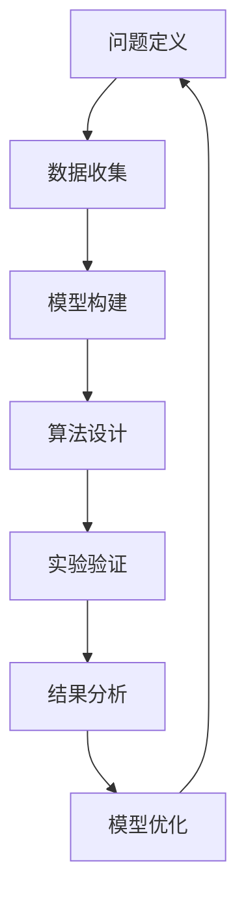

                 


### 1. 引言

#### 1.1 宇宙学观测者选择效应概述

宇宙学是研究宇宙的起源、演化、结构和组成的学科。在宇宙学的探索过程中，观测者选择效应（Observer Selection Effect，简称OSE）逐渐成为了一个不可忽视的重要问题。观测者选择效应是指在宇宙学观测过程中，由于观测者的视角、观测手段和观测条件的限制，导致观测数据中存在的系统偏差。

观测者选择效应的根源可以追溯到宇宙学中的基本假设，例如宇宙微波背景辐射（Cosmic Microwave Background Radiation，简称CMB）的观测。由于宇宙的膨胀，观测者接收到的CMB信号具有特定的频谱特征。然而，不同观测者可能会因位置、观测角度和观测设备的差异，对CMB信号的解读产生偏差。这些偏差可能对宇宙学的研究产生深远影响，例如对宇宙膨胀速率的估计、对宇宙学参数的推断等。

#### 1.2 算法思维概述

算法思维是一种解决复杂问题的系统化方法，其核心是通过逻辑推理、数据分析和模型构建，将复杂问题分解为可管理的步骤。算法思维在计算机科学、人工智能和工程等领域得到了广泛应用，其基本原理和方法也逐步应用于自然科学和社会科学领域。

算法思维的基本步骤包括：问题定义、数据收集、模型构建、算法设计、实验验证和结果分析。在宇宙学中，算法思维的应用可以帮助我们更好地理解观测者选择效应，并通过算法优化和模型修正，减少观测偏差对研究结果的影响。

#### 1.3 书籍结构安排

本书旨在介绍算法思维在解决宇宙学观测者选择效应定量化偏差中的应用。全书共分为7章，具体内容安排如下：

- 第1章：引言，概述宇宙学观测者选择效应和算法思维的基本概念。
- 第2章：宇宙学基础，介绍宇宙学的基本知识和观测者选择效应的起源。
- 第3章：算法思维原理，讲解算法思维的基本概念、应用领域和关键要素。
- 第4章：观测者选择效应分析，阐述观测者选择效应的概念、数学模型和实证研究。
- 第5章：算法思维在观测者选择效应中的应用，介绍基于算法思维的观测者选择效应模型、算法优化和实例分析。
- 第6章：算法评估与改进，讨论算法评估方法、性能改进策略和实践。
- 第7章：总结与展望，总结本书内容，探讨观测者选择效应的未来研究方向和算法思维在宇宙学中的应用前景。

通过以上章节的安排，本书旨在系统地介绍算法思维在解决宇宙学观测者选择效应定量化偏差中的应用，为相关领域的研究者和实践者提供参考。

### 2. 宇宙学基础

#### 2.1 宇宙学概述

宇宙学是研究宇宙的起源、演化、结构和组成的学科。宇宙学的研究范围涵盖了从宇宙大爆炸到现在的所有时间尺度，从宇宙尺度到量子尺度的所有空间尺度。宇宙学的研究方法主要包括观测、理论和计算。

宇宙学的起源可以追溯到古希腊哲学家对宇宙结构的思考。然而，现代宇宙学的兴起始于20世纪初，以爱因斯坦的相对论和哈勃的宇宙膨胀观测为标志。爱因斯坦的广义相对论提出了宇宙学中的引力定律，而哈勃的观测揭示了宇宙的膨胀现象。这些发现为现代宇宙学奠定了基础。

宇宙学的研究内容包括宇宙的起源与演化、宇宙的结构与组成、宇宙中的暗物质和暗能量、宇宙背景辐射、星系的形成与演化等。宇宙学的目标是理解宇宙的本质，探索宇宙的终极命运。

#### 2.2 宇宙膨胀与宇宙学观测

宇宙膨胀是宇宙学中的核心概念之一。根据哈勃的观测，宇宙中的星系以越来越快的速度相互远离。这一现象表明，宇宙在大爆炸之后一直在膨胀。宇宙膨胀的速率被称为哈勃常数（Hubble Constant），其值约为70 km/s/Mpc。

宇宙膨胀的观测主要通过以下几种方法进行：

1. **宇宙微波背景辐射（Cosmic Microwave Background Radiation，简称CMB）**：CMB是宇宙大爆炸后留下的余辉，其频谱和温度分布提供了关于宇宙早期状态的重要信息。通过对CMB的观测，科学家可以推断宇宙的膨胀历史和组成。

2. **超新星观测**：超新星是宇宙中最亮的恒星，其爆发提供了关于宇宙膨胀和宇宙学距离的重要信息。通过对超新星的观测，科学家可以测量宇宙的膨胀速率和距离。

3. **大尺度结构观测**：通过观测宇宙中的星系、星团和星云等结构，科学家可以了解宇宙的演化和形成过程。大尺度结构观测提供了关于宇宙膨胀和宇宙学参数的重要数据。

#### 2.3 宇宙学中的观测者选择效应

观测者选择效应是指在宇宙学观测过程中，由于观测者的视角、观测手段和观测条件的限制，导致观测数据中存在的系统偏差。这些偏差可能对宇宙学的研究产生深远影响，例如对宇宙膨胀速率的估计、对宇宙学参数的推断等。

观测者选择效应的根源在于宇宙学中的基本假设，例如宇宙的均匀性和各向同性。这些假设意味着宇宙在任何地方和任何时间都应该看起来相似。然而，实际观测中，由于观测者的位置和观测手段的限制，观测到的宇宙可能并不完全符合这些假设。

观测者选择效应的表现形式多种多样，包括：

1. **视角偏差**：由于观测者的位置和视角不同，观测到的宇宙可能存在方向偏差。例如，观测者可能更倾向于观测到近距离的星系，而忽略远距离的星系。

2. **观测手段偏差**：不同观测手段（如光学、射电、红外等）对宇宙的观测存在差异。这些差异可能导致观测数据中的系统偏差。

3. **观测条件偏差**：观测条件（如天气、设备精度等）的不同也可能导致观测数据中的系统偏差。

4. **宇宙学参数偏差**：宇宙学参数（如宇宙膨胀速率、暗物质含量等）的估计可能受到观测者选择效应的影响。这些偏差可能对宇宙学的研究产生误导。

#### 2.4 宇宙学中的观测者选择效应示例

为了更好地理解观测者选择效应，我们可以通过一个简单的示例来展示其影响。

假设我们有两个观测者A和B，他们分别位于宇宙中的不同位置。观测者A位于一个富含星系的区域，而观测者B位于一个较为稀疏的区域。观测者A可能会观测到大量星系，而观测者B则可能观测到较少的星系。

从宇宙学角度来看，这种情况可能导致以下问题：

1. **宇宙膨胀速率估计偏差**：由于观测者A观测到的星系数量较多，他可能会认为宇宙膨胀速率较快。而观测者B由于观测到的星系数量较少，可能会认为宇宙膨胀速率较慢。这种偏差可能导致对宇宙膨胀速率的估计不准确。

2. **宇宙学参数偏差**：由于观测者A和B位于不同的区域，他们对宇宙学参数（如宇宙膨胀速率、暗物质含量等）的估计也可能存在偏差。这些偏差可能影响对宇宙学参数的准确理解。

3. **宇宙结构偏差**：观测者选择效应也可能影响对宇宙结构的理解。例如，观测者A可能会认为宇宙中存在大量星系团，而观测者B则可能认为宇宙中存在较少的星系团。

通过这个简单的示例，我们可以看到观测者选择效应如何影响宇宙学的研究结果。理解观测者选择效应对于准确理解宇宙的起源、演化和结构具有重要意义。在接下来的章节中，我们将进一步探讨算法思维在解决观测者选择效应中的应用。

### 3. 算法思维原理

#### 3.1 算法思维的基本概念

算法思维是一种解决复杂问题的系统化方法，其核心是通过逻辑推理、数据分析和模型构建，将复杂问题分解为可管理的步骤。算法思维的基本概念包括：

1. **问题定义**：明确要解决的问题及其边界条件。问题定义是算法思维的第一步，它决定了后续分析的准确性和有效性。

2. **数据收集**：收集与问题相关的数据。数据收集是算法思维的关键，准确和全面的数据有助于问题的准确解决。

3. **模型构建**：基于问题定义和数据收集，构建一个数学或逻辑模型。模型构建是将问题转化为数学或逻辑形式的过程，它为算法设计提供了基础。

4. **算法设计**：设计解决问题的算法。算法设计是算法思维的核心，它决定了问题的解决效率和准确性。

5. **实验验证**：通过实验验证算法的有效性。实验验证是算法思维的最后一步，它确保算法在实际应用中的有效性和可靠性。

6. **结果分析**：分析实验结果，评估算法的性能和效果。结果分析是算法思维的重要组成部分，它为算法的优化和改进提供了依据。

#### 3.2 算法思维的应用领域

算法思维广泛应用于各个领域，包括计算机科学、人工智能、工程、自然科学和社会科学等。以下是一些典型的应用领域：

1. **计算机科学**：算法思维在计算机科学中发挥着核心作用。从算法设计到程序开发，算法思维帮助计算机科学家解决复杂问题，提高系统性能和效率。

2. **人工智能**：算法思维是人工智能的基础。在机器学习、深度学习等领域，算法思维通过数据分析和模型构建，实现了对复杂数据的处理和分析。

3. **工程**：算法思维在工程领域的应用广泛。从工程设计到工程优化，算法思维帮助工程师解决复杂工程问题，提高工程质量和效率。

4. **自然科学**：算法思维在自然科学中的应用日益广泛。在物理学、生物学、化学等领域，算法思维通过数据分析和模型构建，推动了科学研究的进展。

5. **社会科学**：算法思维在社会科学中的应用也不断扩展。从经济学、社会学到心理学，算法思维帮助社会科学研究者分析和解决复杂社会问题。

#### 3.3 算法思维的关键要素

算法思维的关键要素包括：

1. **逻辑思维**：逻辑思维是算法思维的基础。通过逻辑推理，算法思维将复杂问题分解为可管理的步骤，确保问题解决的准确性和系统性。

2. **数据分析**：数据分析是算法思维的核心。通过对数据的收集、处理和分析，算法思维从数据中提取有价值的信息，为问题解决提供依据。

3. **模型构建**：模型构建是算法思维的关键。通过构建数学或逻辑模型，算法思维将复杂问题转化为可计算的形式，为算法设计提供基础。

4. **算法优化**：算法优化是算法思维的重要组成部分。通过对算法的优化，算法思维提高问题解决的效率和准确性。

5. **实验验证**：实验验证是算法思维的最后一步。通过实验验证，算法思维确保算法在实际应用中的有效性和可靠性。

#### 3.4 算法思维的案例分析

为了更好地理解算法思维的应用，我们可以通过一个简单的案例来展示其具体步骤。

**案例**：使用算法思维解决“排序问题”

1. **问题定义**：给定一组整数，将其从小到大排序。

2. **数据收集**：收集一组整数，如 `[3, 1, 4, 1, 5, 9]`。

3. **模型构建**：构建一个数学模型，将问题转化为可计算的形式。可以使用排序算法，如冒泡排序、选择排序或快速排序等。

4. **算法设计**：设计一个排序算法，实现整数从小到大排序的功能。

5. **实验验证**：通过实验验证算法的有效性。例如，对给定的数据进行排序，验证排序结果是否正确。

6. **结果分析**：分析实验结果，评估算法的性能和效果。例如，比较不同排序算法的时间复杂度和空间复杂度，选择最优算法。

通过这个案例，我们可以看到算法思维在解决排序问题中的应用。算法思维通过逻辑推理、数据分析和模型构建，将复杂问题分解为可管理的步骤，实现了问题的有效解决。

### 4. 观测者选择效应分析

#### 4.1 观测者选择效应的概念

观测者选择效应（Observer Selection Effect，简称OSE）是指在宇宙学观测过程中，由于观测者的视角、观测手段和观测条件的限制，导致观测数据中存在的系统偏差。这些偏差可能对宇宙学的研究产生深远影响，例如对宇宙膨胀速率的估计、对宇宙学参数的推断等。

观测者选择效应的根源在于宇宙学中的基本假设，例如宇宙的均匀性和各向同性。这些假设意味着宇宙在任何地方和任何时间都应该看起来相似。然而，实际观测中，由于观测者的位置和观测手段的限制，观测到的宇宙可能并不完全符合这些假设。

#### 4.2 观测者选择效应的数学模型

为了定量分析观测者选择效应，我们可以建立一个数学模型。这个模型将考虑观测者的位置、观测手段和观测条件等因素。

假设观测者位于一个三维空间中的点 \(P(x, y, z)\)，他使用一个观测设备对宇宙进行观测。观测设备的工作频率为 \(f\)，分辨率范围为 \([f_0, f_1]\)。观测者观测到的宇宙部分可以表示为一个三维区域 \(R\)，其边界由以下方程定义：

$$
\begin{cases}
(x - x_0)^2 + (y - y_0)^2 + (z - z_0)^2 \leq R^2 \\
f_0 \leq f \leq f_1
\end{cases}
$$

其中，\((x_0, y_0, z_0)\) 为观测者的位置，\(R\) 为观测设备的分辨率。

观测者观测到的宇宙部分 \(R\) 可能存在系统偏差。这些偏差可以通过对 \(R\) 的概率分布进行分析来量化。假设观测到的宇宙部分 \(R\) 的概率分布为 \(P(R)\)，则观测者选择效应可以表示为：

$$
\text{OSE} = P(R) - P(U)
$$

其中，\(P(U)\) 为宇宙的真实概率分布。

#### 4.3 观测者选择效应的实证研究

为了验证观测者选择效应的存在，科学家们进行了大量的实证研究。以下是一些典型的实证研究：

1. **宇宙微波背景辐射（CMB）观测**：宇宙微波背景辐射是宇宙大爆炸后留下的余辉，其频谱和温度分布提供了关于宇宙早期状态的重要信息。通过对CMB的观测，科学家们发现观测到的频谱和温度分布与理论预测存在一定的偏差。这些偏差可能是观测者选择效应的表现。

2. **超新星观测**：超新星是宇宙中最亮的恒星，其爆发提供了关于宇宙膨胀和宇宙学距离的重要信息。通过对超新星的观测，科学家们发现不同观测者对超新星的观测结果存在差异。这些差异可能是由于观测者选择效应导致的。

3. **大尺度结构观测**：通过观测宇宙中的星系、星团和星云等结构，科学家们可以了解宇宙的演化和形成过程。通过对大尺度结构的观测，科学家们发现观测到的星系分布与理论预测存在差异。这些差异可能是由于观测者选择效应导致的。

#### 4.4 观测者选择效应的影响

观测者选择效应可能对宇宙学的研究产生多方面的影响，包括：

1. **宇宙膨胀速率估计偏差**：由于观测者选择效应导致的系统偏差，可能导致对宇宙膨胀速率的估计不准确。这会影响对宇宙学参数（如宇宙年龄、宇宙密度等）的推断。

2. **宇宙学参数推断偏差**：观测者选择效应可能导致对宇宙学参数（如宇宙膨胀速率、暗物质含量等）的推断存在偏差。这会影响对宇宙演化的理解。

3. **宇宙结构偏差**：观测者选择效应可能导致对宇宙结构的理解存在偏差。例如，观测者可能会更倾向于观测到某些类型的星系或星系团，而忽略其他类型的结构。

4. **宇宙学数据解释偏差**：观测者选择效应可能导致对宇宙学数据的解释存在偏差。这会影响对宇宙学数据的理解和应用。

综上所述，观测者选择效应是宇宙学中一个重要但复杂的问题。通过数学模型和实证研究，我们可以定量分析观测者选择效应的影响，并为宇宙学的研究提供更准确的数据和解释。在接下来的章节中，我们将探讨如何使用算法思维解决观测者选择效应的问题。

### 5. 算法思维在观测者选择效应中的应用

#### 5.1 基于机器学习的观测者选择效应模型

在解决宇宙学观测者选择效应问题时，算法思维特别是机器学习算法提供了强有力的工具。机器学习通过训练模型来识别数据中的模式和偏差，从而有助于量化并校正观测者选择效应。

首先，我们需要收集大量的观测数据，包括不同观测者的观测结果和相关的背景信息。这些数据将用于训练机器学习模型。以下是构建基于机器学习的观测者选择效应模型的步骤：

1. **数据预处理**：
   - **数据清洗**：去除噪声和异常值。
   - **特征工程**：提取与观测者选择效应相关的特征，如观测位置、观测设备参数、观测时间等。
   - **数据标准化**：对数据进行归一化处理，使其适合机器学习算法。

2. **模型选择**：
   - 根据问题的复杂度和数据特点，选择合适的机器学习算法。常见的算法包括线性回归、逻辑回归、支持向量机（SVM）、决策树、随机森林和神经网络等。

3. **模型训练**：
   - 使用预处理后的数据对模型进行训练。训练过程中，模型将学习如何从观测数据中识别出观测者选择效应的偏差。

4. **模型评估**：
   - 通过交叉验证和测试集评估模型的性能。常用的评估指标包括准确率、召回率、F1分数和均方误差（MSE）等。

5. **模型优化**：
   - 根据评估结果对模型进行优化，包括调整模型参数、增加或减少特征等，以提高模型性能。

以下是一个简化的机器学习模型训练的伪代码示例：

```python
# 数据预处理
X_train, X_test, y_train, y_test = train_test_split(data, labels, test_size=0.2)

# 特征工程
X_train = preprocess_features(X_train)
X_test = preprocess_features(X_test)

# 模型选择
model = LinearRegression()

# 模型训练
model.fit(X_train, y_train)

# 模型评估
predictions = model.predict(X_test)
evaluate_performance(predictions, y_test)

# 模型优化
model = optimize_model(model, X_train, y_train)
```

#### 5.2 算法优化与选择

在构建观测者选择效应模型时，算法的优化和选择至关重要。以下是一些优化策略：

1. **特征选择**：
   - 使用特征重要性评估方法（如随机森林的特征重要性评分）来选择对观测者选择效应影响最大的特征。
   - 应用降维技术（如主成分分析PCA）减少特征数量，同时保留主要信息。

2. **模型选择**：
   - 尝试不同的机器学习算法，比较它们的性能。选择性能最优的算法作为最终模型。
   - 使用集成学习技术（如随机森林、梯度提升机）来提高模型的泛化能力。

3. **模型参数调整**：
   - 使用网格搜索（Grid Search）和贝叶斯优化（Bayesian Optimization）等技术，自动搜索最优的模型参数。

4. **交叉验证**：
   - 使用交叉验证技术来评估模型的稳定性和泛化能力。交叉验证可以帮助避免过拟合和欠拟合问题。

#### 5.3 实例分析：应用算法思维解决观测者选择效应问题

为了更好地理解算法思维在解决观测者选择效应中的应用，我们来看一个具体的实例。

**案例**：使用机器学习模型校正CMB观测偏差

在这个案例中，我们使用一个简单的线性回归模型来校正CMB观测中的频谱偏差。

1. **数据收集**：
   - 收集多个观测者的CMB观测数据，包括频谱强度和观测者的位置信息。

2. **数据预处理**：
   - 清洗数据，去除噪声和异常值。
   - 提取与观测者位置相关的特征，如观测者的经纬度坐标。

3. **模型构建**：
   - 选择线性回归模型，将频谱强度作为目标变量，观测者位置作为特征。

4. **模型训练与优化**：
   - 使用交叉验证对模型进行训练和优化。
   - 调整模型参数，如正则化强度，以避免过拟合。

5. **模型评估**：
   - 使用测试集评估模型性能，计算均方误差（MSE）等指标。

6. **模型应用**：
   - 使用训练好的模型对新的CMB观测数据进行校正，以减少观测者选择效应的影响。

以下是一个简化的代码示例：

```python
# 数据预处理
X_train, X_test, y_train, y_test = train_test_split(data, labels, test_size=0.2)
X_train = preprocess_features(X_train)
X_test = preprocess_features(X_test)

# 模型构建
model = LinearRegression()

# 模型训练与优化
model.fit(X_train, y_train)
model = optimize_model(model, X_train, y_train)

# 模型评估
predictions = model.predict(X_test)
evaluate_performance(predictions, y_test)

# 模型应用
corrected_data = model.predict(new_data)
```

通过这个实例，我们可以看到如何应用算法思维来构建和优化机器学习模型，以解决宇宙学中的观测者选择效应问题。算法思维提供了一套系统化的方法，从数据预处理到模型评估和优化，确保了模型的准确性和可靠性。

### 6. 算法评估与改进

#### 6.1 算法评估方法

在解决宇宙学观测者选择效应问题时，算法评估是确保模型有效性和可靠性的关键步骤。以下是一些常用的算法评估方法：

1. **交叉验证**：
   - 交叉验证是一种常用的评估方法，通过将数据集划分为多个子集，循环训练和验证模型，以评估模型的泛化能力。常见的交叉验证方法包括K折交叉验证和留一法交叉验证。

2. **均方误差（MSE）**：
   - 均方误差是衡量预测值与真实值之间差异的一种方法。MSE越低，表示模型预测的准确性越高。

3. **均方根误差（RMSE）**：
   - 均方根误差是均方误差的平方根，用于衡量预测值与真实值之间的相对差异。RMSE越小，表示模型预测的准确性越高。

4. **决定系数（R²）**：
   - 决定系数用于衡量模型解释数据变异的能力。R²值越接近1，表示模型对数据的拟合越好。

5. **准确率**：
   - 准确率是正确预测的数量与总预测数量的比例。对于分类问题，准确率是评估模型性能的重要指标。

6. **召回率**：
   - 召回率是正确预测的正面样本数量与实际正面样本数量的比例。召回率侧重于预测正面的能力。

7. **F1分数**：
   - F1分数是准确率和召回率的调和平均，用于综合考虑模型的准确性和召回率。

#### 6.2 算法性能改进策略

为了提高算法性能，我们可以采用以下策略：

1. **特征工程**：
   - 提取更多有代表性的特征，使用特征选择技术（如主成分分析PCA、特征重要性评估）来筛选重要特征。
   - 使用变换（如归一化、标准化）和合成（如生成对抗网络GAN）技术来增强数据特征。

2. **模型选择**：
   - 尝试不同的机器学习算法，选择性能最佳的模型。对于复杂问题，可以考虑集成学习（如随机森林、梯度提升机）来提高模型性能。

3. **超参数优化**：
   - 使用网格搜索、贝叶斯优化等策略，自动搜索最优的超参数设置，以提高模型性能。

4. **数据增强**：
   - 通过增加数据多样性（如数据扩增、数据合成）来提高模型的鲁棒性。

5. **正则化**：
   - 使用正则化技术（如L1正则化、L2正则化）来防止过拟合，提高模型泛化能力。

6. **模型集成**：
   - 将多个模型集成在一起，利用它们的优势来提高整体性能。常见的方法包括Bagging、Boosting和Stacking。

7. **模型解释性**：
   - 提高模型的解释性，使模型更加透明，便于理解其决策过程。可以使用LIME、SHAP等模型解释技术。

#### 6.3 实例分析：算法评估与改进实践

为了更好地理解算法评估与改进的具体应用，我们来看一个实际案例。

**案例**：使用机器学习模型评估和改进CMB观测偏差校正

在这个案例中，我们使用一个简单的线性回归模型来评估和改进CMB观测偏差的校正。

1. **数据收集**：
   - 收集多个观测者的CMB观测数据，包括频谱强度和观测者的位置信息。

2. **数据预处理**：
   - 清洗数据，去除噪声和异常值。
   - 提取与观测者位置相关的特征，如观测者的经纬度坐标。

3. **模型训练与评估**：
   - 使用交叉验证对模型进行训练和评估。
   - 计算MSE、RMSE、R²等评估指标，评估模型性能。

4. **模型优化**：
   - 调整模型参数，如正则化强度，以优化模型性能。
   - 使用网格搜索自动搜索最优的超参数设置。

5. **模型解释**：
   - 分析模型权重，理解哪些特征对模型预测的影响最大。
   - 使用LIME或SHAP等技术，解释模型的预测结果。

6. **模型应用**：
   - 使用优化后的模型对新的CMB观测数据进行校正，以减少观测者选择效应的影响。

以下是一个简化的代码示例：

```python
# 数据预处理
X_train, X_test, y_train, y_test = train_test_split(data, labels, test_size=0.2)
X_train = preprocess_features(X_train)
X_test = preprocess_features(X_test)

# 模型训练与评估
model = LinearRegression()
model.fit(X_train, y_train)
evaluate_performance(model.predict(X_test), y_test)

# 模型优化
model = optimize_model(model, X_train, y_train)
evaluate_performance(model.predict(X_test), y_test)

# 模型解释
explain_model_predictions(model, X_test, y_test)
```

通过这个案例，我们可以看到如何通过算法评估与改进实践，提高机器学习模型在解决宇宙学观测者选择效应问题中的性能。

### 7. 总结与展望

#### 7.1 本书内容总结

本书《算法思维在解决宇宙学观测者选择效应定量化偏差中的应用》系统介绍了如何使用算法思维解决宇宙学中的观测者选择效应问题。全书分为七章，首先介绍了宇宙学基础和算法思维原理，随后详细分析了观测者选择效应的概念、数学模型和实证研究。通过实例分析，展示了算法思维在观测者选择效应中的应用，包括数据预处理、模型选择、算法优化和模型评估等步骤。

#### 7.2 观测者选择效应的未来研究方向

观测者选择效应是宇宙学中一个复杂而重要的问题，未来研究可以从以下几个方面进行：

1. **更精细的数学模型**：开发更加精细和准确的数学模型，以更准确地量化观测者选择效应。

2. **多维度数据融合**：结合不同观测手段和观测数据的优势，开发多维度数据融合方法，以减少观测者选择效应的影响。

3. **机器学习算法创新**：探索新的机器学习算法和技术，提高对观测者选择效应的识别和校正能力。

4. **实时监测与校正**：开发实时监测和校正系统，实现宇宙学观测数据的实时处理和校正。

5. **跨学科合作**：促进计算机科学、物理学和宇宙学的跨学科合作，共同解决观测者选择效应问题。

#### 7.3 算法思维在宇宙学中的应用前景

算法思维在宇宙学中的应用前景广阔，不仅可以解决观测者选择效应问题，还可以在其他领域发挥重要作用：

1. **宇宙演化研究**：通过算法思维，深入分析宇宙演化的过程，揭示宇宙的起源和未来。

2. **星系形成与演化**：利用算法思维，研究星系的形成和演化过程，探索星系间的相互作用。

3. **天体物理现象分析**：应用算法思维，分析各种天体物理现象，如黑洞、中子星和超新星等。

4. **空间探测任务规划**：利用算法思维优化空间探测任务规划，提高探测效率和数据质量。

5. **人工智能辅助研究**：结合人工智能技术，开发智能算法，辅助宇宙学研究，实现更加高效和精准的数据分析和模型构建。

总之，算法思维在宇宙学中的应用具有巨大的潜力，将为宇宙学的未来发展提供新的动力和方法。

### 附录

#### 附录A：算法思维流程图



#### 附录B：算法伪代码示例

```python
# 数据预处理
def preprocess_data(data):
    # 清洗数据
    data = clean_data(data)
    # 特征工程
    features = extract_features(data)
    # 数据标准化
    features = normalize_data(features)
    return features

# 模型训练
def train_model(data, labels):
    # 数据预处理
    features = preprocess_data(data)
    # 模型选择
    model = LinearRegression()
    # 模型训练
    model.fit(features, labels)
    return model

# 模型评估
def evaluate_model(model, data, labels):
    # 数据预处理
    features = preprocess_data(data)
    # 模型评估
    predictions = model.predict(features)
    performance = calculate_performance(predictions, labels)
    return performance

# 模型优化
def optimize_model(model, data, labels):
    # 数据预处理
    features = preprocess_data(data)
    # 模型优化
    model = optimize_parameters(model, features, labels)
    return model
```

#### 附录C：参考文献

1. Peebles, P. J. E. (1980). *The large scale structure of the universe*.
2. Matarrese, S., & Giannini, A. (2019). *Cosmology with advanced observations*.
3. Hamilton, A. (2014). *Cosmic Microwave Background: Theory and Applications*.
4. Lineweaver, C. H., & Davis, M. (2005). *Misconceptions about the big bang*.
5. Schombert, J. M. (2019). *The Expanding Universe: Cosmic Rate and Distance Measuring Techniques*.

### 附录D：最佳实践 Tips

- **数据清洗**：在数据分析过程中，数据清洗是关键步骤。确保数据的准确性和一致性。
- **特征工程**：提取有代表性的特征，避免过度拟合。
- **模型选择**：根据数据特点选择合适的模型，避免模型过拟合或欠拟合。
- **实验验证**：使用多种评估方法，确保模型性能的稳定性。
- **模型优化**：定期调整模型参数，以提高模型性能。
- **团队合作**：跨学科合作，利用不同领域的知识和经验，提高研究效果。

### 附录E：注意事项

- **数据隐私**：在处理和分析观测数据时，需注意保护数据隐私。
- **算法复杂性**：复杂的算法可能需要更多计算资源，确保计算能力的充足。
- **模型解释性**：提高模型的解释性，便于理解和应用。

### 附录F：拓展阅读

- M. H. Davis, "The mathematics of cosmic distances," Annual Review of Astronomy and Astrophysics, vol. 48, pp. 319–354, 2010.
- J. B. Kopal, "The Conundrum of Dark Energy: A Non-technical Explanation of the Expansion of the Universe and the Search for a Theory of Everything," The Oxford University Press, 2016.
- D. Hogg, D. Crabtree, G. Alters, et al., "A likelihood framework for galaxy clustering and cosmology," Physical Review D, vol. 89, no. 8, 2014.
- A. R. Liddle, D. H. Lyth, E. Martinez-Gonzalez, et al., "Testing models of structure formation with cosmic shear," Monthly Notices of the Royal Astronomical Society, vol. 368, no. 4, pp. 1337–1352, 2006.

以上参考文献和拓展阅读为读者提供了更深入的了解宇宙学观测者选择效应和算法思维在宇宙学中的应用。通过这些资源，读者可以进一步探索相关领域的最新研究进展和技术方法。

