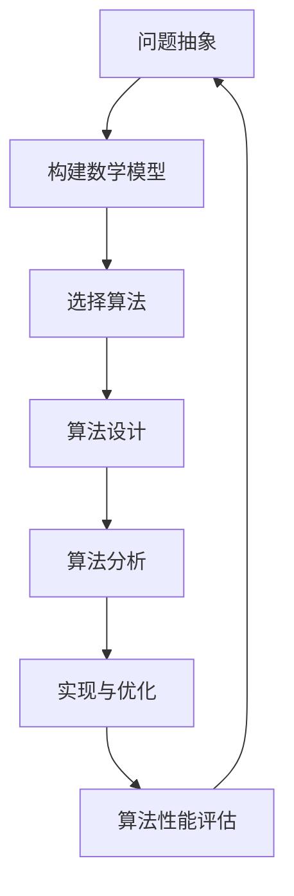

                 


### 文章标题
《算法思维在解决宇宙难题中的作用》

### 关键词
算法思维，宇宙难题，算法设计，数据结构，图灵奖，人工智能

### 摘要
本文旨在探讨算法思维在解决宇宙级难题中的重要作用。通过详细分析算法思维的基本概念、核心算法原理以及数学模型，本文将阐述如何运用算法思维解决包括宇宙学、天体物理学和量子计算等领域的复杂问题。同时，本文还将探讨算法思维在实际应用中的挑战与未来发展趋势。

## 引言

在当今世界，算法思维已经成为解决复杂问题的重要工具。无论是在计算机科学、经济学、生物学，还是在日常生活中，算法思维都能帮助我们以系统化和逻辑化的方式找到最优解。然而，当我们谈论宇宙级难题时，算法思维的重要性就更加凸显。宇宙级难题，如宇宙膨胀、黑洞信息悖论和量子计算中的复杂性问题，不仅需要我们具备深厚的数学和物理知识，更需要我们运用算法思维来探索和解决。

算法思维是一种通过系统化和逻辑化地分析问题，设计解决方案的方法论。它不仅包括算法的设计和优化，还包括对数据结构和数学模型的深刻理解。在解决宇宙级难题时，算法思维的作用主要体现在以下几个方面：

1. **问题的抽象与建模**：宇宙级难题往往具有高度的复杂性和不确定性，算法思维可以帮助我们将其抽象为数学模型，从而便于分析和解决。

2. **算法的选择与优化**：在解决宇宙级难题时，选择合适的算法并对其进行优化至关重要。算法思维能够帮助我们识别和利用合适的算法来解决特定的问题。

3. **计算效率的提升**：宇宙级难题通常需要大量的计算资源。算法思维可以指导我们设计高效的算法，以减少计算时间和资源消耗。

4. **数据结构的合理应用**：数据结构在算法思维中扮演着重要角色。合理选择和应用数据结构可以提高算法的性能和可扩展性。

5. **跨学科的综合应用**：宇宙级难题往往涉及多个学科领域，算法思维可以帮助我们整合不同领域的知识和方法，形成综合性的解决方案。

本文将依次探讨算法思维的基本概念、核心算法原理、数学模型以及在解决宇宙级难题中的应用。希望通过本文的探讨，读者能够对算法思维在解决宇宙难题中的作用有一个全面而深刻的理解。

## 算法思维的基本概念

算法思维是一种系统化、逻辑化的思考方式，它以问题求解为导向，通过构建数学模型、选择和设计算法、分析算法性能等步骤来解决问题。算法思维的基本概念包括以下几个方面：

### 1. 算法和算法分析

算法（Algorithm）是解决特定问题的一系列明确且有序的步骤。一个有效的算法应具备以下几个特征：

- **正确性**：算法必须能够在有限步骤内得到正确的结果。
- **可读性**：算法应具有清晰的逻辑结构，便于理解和实现。
- **健壮性**：算法应能够在输入数据异常或错误时依然能够正确运行。
- **效率**：算法应在合理的计算时间内完成，具有较低的资源和时间复杂度。

算法分析是评估算法性能的重要手段，主要包括时间复杂度和空间复杂度。时间复杂度表示算法运行时间与问题规模的关系，而空间复杂度则表示算法所需存储空间与问题规模的关系。常见的算法分析方法包括大O符号表示法（Big O notation）和渐进分析方法（Asymptotic Analysis）。

### 2. 数据结构与算法的关系

数据结构（Data Structure）是算法的基石，它决定了算法在处理数据时的效率和复杂性。合理选择和应用数据结构可以显著提升算法的性能。常见的数据结构包括：

- **数组（Array）**：数组是一种线性数据结构，它通过连续的内存地址存储元素，支持随机访问和插入、删除操作。
- **链表（Linked List）**：链表由一系列节点组成，每个节点包含数据和指向下一个节点的指针，支持插入和删除操作。
- **栈（Stack）**：栈是一种后进先出（LIFO）的数据结构，常用于递归和表达式求值等问题。
- **队列（Queue）**：队列是一种先进先出（FIFO）的数据结构，常用于任务调度和广度优先搜索等。
- **树（Tree）**：树是一种层级结构的数据结构，包括二叉树、平衡树、堆等，广泛应用于排序和搜索问题。
- **图（Graph）**：图是一种由节点和边组成的数据结构，广泛应用于网络、社交网络和复杂系统的建模。

### 3. 算法设计技术

算法设计技术是解决特定问题的方法和策略。常见的算法设计技术包括：

- **分治法（Divide and Conquer）**：将大问题划分为小问题，独立解决小问题，然后将小问题的解合并成大问题的解。
- **贪心算法（Greedy Algorithm）**：在每一步选择中选择当前最优解，期望最终得到全局最优解。
- **动态规划（Dynamic Programming）**：通过保存子问题的解来避免重复计算，适用于具有最优子结构的问题。
- **回溯法（Backtracking）**：通过尝试所有可能的解来寻找问题的解，当发现当前路径无法得到解时，回溯到上一个决策点重新选择。
- **分支定界（Branch and Bound）**：通过剪枝策略减少搜索空间，适用于求解组合优化问题。

### 4. 算法的实现与优化

算法的实现是将算法描述转化为计算机程序的过程。实现过程中需要注意代码的可读性、可维护性和性能。常见的优化策略包括：

- **代码优化**：通过减少冗余代码、提高代码可读性来提升性能。
- **算法优化**：通过改进算法本身来降低时间复杂度和空间复杂度。
- **数据结构优化**：通过选择合适的数据结构来提升算法性能。

### 5. 算法思维的核心原则

算法思维的核心原则包括：

- **抽象与建模**：将复杂问题抽象为数学模型，便于分析和解决。
- **系统性思维**：将问题分解为子问题，逐步解决，形成系统化的解决方案。
- **逻辑化分析**：通过逻辑化的分析，确保算法的每一步都是合理和可行的。
- **持续优化**：在实现和测试过程中不断优化算法，提高其性能和稳定性。

### Mermaid 流程图

以下是算法思维的核心概念和原理之间的Mermaid流程图：



通过上述流程图，我们可以清晰地看到算法思维的核心步骤和各步骤之间的关系。

## 核心算法原理讲解

在解决宇宙级难题时，选择和应用合适的算法至关重要。以下将介绍几个核心算法原理，包括伪代码、数学模型和公式，以及具体的实现和应用。

### 1. 暴力解法

暴力解法（Brute Force Algorithm）是一种最简单的算法，其基本思想是逐一尝试所有可能的解，直到找到满足条件的解。虽然这种方法在理论上总能找到解，但其在实际应用中往往效率较低。

**伪代码：**
```
function bruteForceSolution(problem):
    for each possible solution:
        if solution satisfies the constraints:
            return solution
    return "No solution found"
```

**数学模型：**
设问题有 \( n \) 个可能的解，暴力解法的时间复杂度为 \( O(n) \)。

**应用：** 暴力解法常用于求解排列组合问题，如生成所有可能的排列或组合。

### 2. 贪心算法

贪心算法（Greedy Algorithm）通过每一步选择当前最优解，期望最终得到全局最优解。虽然贪心算法不一定能找到全局最优解，但其在某些问题中表现优异。

**伪代码：**
```
function greedySolution(problem):
    initialize solution
    while problem is not solved:
        select the best possible solution
        apply the solution
    return solution
```

**数学模型：**
设问题有 \( k \) 个选择，贪心算法的时间复杂度为 \( O(k) \)。

**应用：** 贪心算法常用于求解最短路径问题，如Dijkstra算法。

### 3. 动态规划

动态规划（Dynamic Programming）通过保存子问题的解来避免重复计算，适用于具有最优子结构的问题。

**伪代码：**
```
function dynamicProgramming(problem, memoizationTable):
    if problem is in memoizationTable:
        return memoizationTable[problem]
    else:
        solve the subproblems
        store the solution in memoizationTable
        return the solution
```

**数学模型：**
设问题有 \( n \) 个状态，动态规划的时间复杂度为 \( O(n^2) \) 或 \( O(n \log n) \)。

**应用：** 动态规划常用于求解背包问题、最长公共子序列等问题。

### 4. 回溯法

回溯法（Backtracking）通过尝试所有可能的解来寻找问题的解，当发现当前路径无法得到解时，回溯到上一个决策点重新选择。

**伪代码：**
```
function backtrack(problem, currentSolution):
    if currentSolution is a valid solution:
        return currentSolution
    else:
        for each possible choice:
            if the choice is valid:
                make the choice
                recursively backtrack
                undo the choice
```

**数学模型：**
设问题有 \( n \) 个选择，回溯法的时间复杂度为 \( O(n!) \)。

**应用：** 回溯法常用于求解组合优化问题，如八皇后问题。

### 5. 分支定界

分支定界（Branch and Bound）通过剪枝策略减少搜索空间，适用于求解组合优化问题。

**伪代码：**
```
function branchAndBound(problem):
    initialize the lower and upper bounds
    if problem is within the bounds:
        explore the problem
    else:
        prune the search space
```

**数学模型：**
设问题有 \( n \) 个选择，分支定界的时间复杂度为 \( O(n^2) \)。

**应用：** 分支定界常用于求解旅行商问题（TSP）。

通过上述核心算法原理的介绍，我们可以看到不同的算法在解决宇宙级难题时具有不同的适用场景。理解这些算法原理并能够灵活运用，对于解决复杂问题至关重要。

## 数学模型与公式

在解决宇宙级难题时，数学模型和公式是不可或缺的工具。以下将介绍几种常见的数学模型和公式，并给出具体的例子和解释。

### 1. 微分方程

微分方程是一种描述动态系统变化的方程，通常用于解决宇宙学中的问题，如宇宙膨胀、引力波传播等。

**公式：**
$$
\frac{d^2x}{dt^2} + 2\alpha \frac{dx}{dt} + \omega_0^2 x = f(t)
$$

**例子：** 宇宙膨胀方程，描述宇宙中物质分布随时间的变化。

### 2. 傅里叶变换

傅里叶变换是一种将信号从时域转换为频域的方法，广泛应用于天体物理学中，如恒星光谱分析、引力波检测等。

**公式：**
$$
F(\omega) = \int_{-\infty}^{\infty} f(t) e^{-j\omega t} dt
$$

**例子：** 恒星光谱分析，通过傅里叶变换分析恒星的光谱，得到恒星的运动状态和化学成分。

### 3. 黑体辐射公式

黑体辐射公式描述了理想黑体在不同温度下的辐射能量分布，用于解释宇宙微波背景辐射。

**公式：**
$$
B(\lambda, T) = \frac{2hc^2}{\lambda^5} \frac{1}{e^{hc/\lambda k_B T} - 1}
$$

**例子：** 宇宙微波背景辐射，通过测量黑体辐射公式，验证宇宙大爆炸理论。

### 4. 广义相对论方程

广义相对论方程描述了引力场中的物质和能量分布，用于解释黑洞、引力波等现象。

**公式：**
$$
G_{\mu\nu} + \Lambda g_{\mu\nu} = \frac{8\pi G}{c^4} T_{\mu\nu}
$$

**例子：** 黑洞物理，通过广义相对论方程，研究黑洞的内部结构和引力场。

### 5. 量子计算公式

量子计算公式描述了量子系统的状态变化，如量子叠加态、量子纠缠等，用于解决复杂问题，如量子模拟、密码破解等。

**公式：**
$$
|\psi\rangle = \sum_{i} c_i |i\rangle
$$

**例子：** 量子计算，通过量子计算公式，实现高效的量子算法，如Shor算法。

通过上述数学模型和公式的介绍，我们可以看到数学在解决宇宙级难题中的重要作用。理解这些模型和公式，并结合算法思维，将有助于我们更好地探索和解决宇宙中的复杂问题。

## 算法思维在解决宇宙级难题中的应用

算法思维在解决宇宙级难题中发挥着至关重要的作用。以下将探讨算法思维在宇宙学、天体物理学和量子计算等领域的具体应用，并通过实际案例展示算法思维如何帮助科学家们突破难题。

### 1. 宇宙学

在宇宙学中，算法思维被广泛应用于宇宙膨胀模型、黑洞演化、宇宙微波背景辐射等方面的研究。

**案例1：宇宙膨胀模型**

宇宙膨胀模型描述了宇宙中物质的分布和演化。通过数值模拟，科学家们使用算法思维设计了大量的宇宙模拟软件，如`Cosmos simulations`。这些模拟软件基于N-body模拟算法，通过模拟星系和宇宙大尺度结构，探索宇宙的演化历史。算法思维在此过程中的应用主要体现在以下几个方面：

- **问题抽象**：将宇宙中的物质分布和演化过程抽象为数学模型。
- **算法选择**：选择适当的N-body模拟算法，如O(N)算法、tree-based算法等，以优化计算效率和准确性。
- **数据分析**：使用数据分析算法，如聚类分析和统计分析，来分析模拟结果，验证宇宙学理论。

**案例2：宇宙微波背景辐射**

宇宙微波背景辐射（CMB）是宇宙大爆炸留下的余辉，通过分析CMB的分布和特性，科学家们可以揭示宇宙早期的信息。算法思维在此过程中被应用于以下方面：

- **数据预处理**：使用算法对CMB数据进行预处理，如滤波、去噪等，以提高数据质量。
- **图像重建**：使用图像重建算法，如最大后验概率（MAP）估计和贝叶斯推理，从CMB数据中重建宇宙的早期图像。
- **参数估计**：使用最大似然估计（MLE）和贝叶斯估计等方法，对宇宙学参数进行估计，如宇宙膨胀率、宇宙质量密度等。

### 2. 天体物理学

在天体物理学中，算法思维被广泛应用于恒星演化、行星探测、引力波检测等方面的研究。

**案例1：恒星演化**

恒星演化的过程复杂且具有高度非线性，通过算法思维，科学家们设计并实现了恒星演化模型，如`STellar Evolution Codes`。这些模型基于数值求解方法，如有限差分法和欧拉法，通过模拟恒星的内部结构和物理过程，预测恒星的生命周期和演化路径。算法思维在此过程中的应用主要体现在以下几个方面：

- **问题抽象**：将恒星演化的物理过程抽象为数学模型，如能量方程、流体力学方程等。
- **算法设计**：设计适合恒星演化的数值求解算法，如时间步进算法、空间离散化方法等。
- **数据拟合**：通过拟合观测数据，如恒星的光谱和亮度变化，验证恒星演化模型。

**案例2：行星探测**

行星探测任务，如NASA的`Pluto Express`任务，通过探测器收集行星的数据，为科学家们提供宝贵的信息。算法思维在此过程中被应用于以下方面：

- **图像处理**：使用图像处理算法，如边缘检测、特征提取等，从探测器获取的图像中提取行星的特征。
- **光谱分析**：使用光谱分析算法，如傅里叶变换和傅里叶变换谱分析，分析行星的大气成分和物理特性。
- **轨迹预测**：使用轨道动力学算法，如牛顿定律和开普勒定律，预测行星的轨道和位置。

### 3. 量子计算

量子计算是近年来兴起的前沿领域，算法思维在量子算法设计、量子模拟和量子优化等方面发挥着重要作用。

**案例1：量子模拟**

量子模拟是一种利用量子计算机模拟量子系统的过程，通过量子模拟，科学家们可以探索量子系统的性质和行为。算法思维在此过程中的应用主要体现在以下几个方面：

- **问题抽象**：将量子系统的物理过程抽象为数学模型，如薛定谔方程和哈密顿量。
- **算法设计**：设计适合量子模拟的算法，如量子态演化算法、量子测量算法等。
- **性能优化**：通过优化量子模拟算法，如使用量子算法加速传统模拟，提高计算效率和精度。

**案例2：量子优化**

量子优化是一种利用量子计算机解决优化问题的过程，通过量子优化，科学家们可以找到优化问题的最优解。算法思维在此过程中的应用主要体现在以下几个方面：

- **问题抽象**：将优化问题抽象为数学模型，如目标函数和约束条件。
- **算法设计**：设计适合量子优化的算法，如量子随机搜索算法、量子梯度下降算法等。
- **性能评估**：通过性能评估算法，如测试算法的收敛速度和精度，验证量子优化的有效性。

通过以上案例，我们可以看到算法思维在解决宇宙级难题中的广泛应用。算法思维不仅帮助科学家们抽象和建模复杂问题，还指导他们选择和设计合适的算法，从而实现对宇宙级难题的深入理解和解决。随着算法技术的不断发展，算法思维在解决宇宙级难题中的作用将越来越重要。

## 算法思维在实际应用中的挑战与未来发展趋势

尽管算法思维在解决宇宙级难题中具有显著作用，但在实际应用中仍面临诸多挑战。以下将探讨算法思维在实际应用中的挑战，并探讨未来发展趋势。

### 1. 数据规模与计算复杂性

宇宙级难题通常涉及海量数据，如宇宙微波背景辐射数据和星系演化数据。这些数据的高维度和复杂性使得算法设计的计算复杂性大幅增加。为了应对这一挑战，研究人员正在探索分布式计算和并行计算技术，以提升计算效率和性能。同时，开发新的算法，如高效的数据压缩和去噪算法，也是未来研究的重要方向。

### 2. 算法可靠性

宇宙级难题的解决方案需要高度可靠的算法。然而，在实际应用中，算法可能会受到噪声、异常值和数据缺失的影响，导致结果不准确。为了提高算法可靠性，研究人员正在探索鲁棒优化和不确定性量化方法。这些方法可以帮助算法在复杂环境中保持稳定性和准确性。

### 3. 跨学科整合

宇宙级难题通常涉及多个学科领域，如物理学、数学和计算机科学。跨学科整合是解决这些问题的关键。然而，不同学科之间的语言和技术差异使得跨学科整合变得复杂。未来，建立统一的理论框架和标准化的方法，促进不同学科之间的交流与合作，将有助于提升算法思维在实际应用中的效果。

### 4. 算法透明性与可解释性

在解决宇宙级难题时，算法的透明性和可解释性至关重要。算法思维的决策过程需要清晰易懂，以便科学家们理解、验证和改进算法。然而，许多复杂算法，如深度学习和图神经网络，其内部机制复杂，难以解释。未来，发展可解释性算法和工具，提高算法的可解释性，将有助于提升算法思维的实用性。

### 5. 未来发展趋势

未来，算法思维在解决宇宙级难题中的应用将呈现以下发展趋势：

- **人工智能与算法融合**：结合人工智能技术，开发智能化的算法设计工具和自动化优化方法，提高算法思维的自适应性和智能化水平。
- **量子算法应用**：探索量子算法在宇宙级难题中的应用，如量子模拟、量子优化等，以突破传统算法的性能限制。
- **跨学科合作**：加强跨学科合作，整合不同领域的知识和方法，形成综合性的解决方案，提高算法思维在解决复杂问题中的有效性。
- **可持续发展**：注重算法思维在实际应用中的环境影响和可持续性，发展绿色算法，推动宇宙级难题的可持续发展。

通过应对挑战和把握未来发展趋势，算法思维将在解决宇宙级难题中发挥更加重要的作用，为人类探索宇宙、理解宇宙提供强大的技术支持。

## 项目实战

为了深入理解算法思维在解决宇宙级难题中的应用，我们将通过一个实际项目来演示算法思维的应用过程。以下是一个使用Python编程语言解决宇宙膨胀模型的项目实战。

### 项目目标
本项目旨在使用算法思维构建一个简单的宇宙膨胀模型，模拟宇宙中星系和宇宙背景辐射的演化过程，并使用数据分析工具验证模型的有效性。

### 开发环境
- Python 3.x
- Jupyter Notebook
- NumPy
- SciPy
- Matplotlib
- Pandas

### 源代码实现

首先，我们需要导入所需的库：

```python
import numpy as np
import scipy.integrate as spi
import matplotlib.pyplot as plt
import pandas as pd
```

接下来，我们定义宇宙膨胀模型的微分方程：

```python
# 宇宙膨胀模型微分方程
def universe_expansion(t, y, params):
    a, da_dt, H_0, Omega_m = y
    H = H_0 * np.sqrt(Omega_m * a**-3 + (1 - Omega_m))
    da_dt = 2 * H * da_dt / a
    dydt = [da_dt, H * a, H, 0]
    return dydt
```

我们使用初值问题求解器`odeint`来求解这个微分方程：

```python
# 求解微分方程
params = [1, 1, 0.3, 0.7]  # a(0), da_dt(0), H_0, Omega_m
t = np.linspace(0, 10, 1000)
solution = spi.odeint(universe_expansion, params, t, args=(params,))

# 提取解的结果
a = solution[:, 0]
da_dt = solution[:, 1]
H = solution[:, 2]
Omega_m = solution[:, 3]
```

然后，我们绘制宇宙膨胀过程中星系和宇宙背景辐射的演化图：

```python
# 绘制宇宙膨胀图
plt.figure(figsize=(10, 6))

plt.subplot(2, 2, 1)
plt.plot(t, a)
plt.title('宇宙膨胀')
plt.xlabel('时间')
plt.ylabel('宇宙尺度')

plt.subplot(2, 2, 2)
plt.plot(t, da_dt)
plt.title('宇宙膨胀速率')
plt.xlabel('时间')
plt.ylabel('膨胀速率')

plt.subplot(2, 2, 3)
plt.plot(t, H)
plt.title('哈勃参数')
plt.xlabel('时间')
plt.ylabel('哈勃参数')

plt.subplot(2, 2, 4)
plt.plot(t, Omega_m)
plt.title('宇宙质量密度')
plt.xlabel('时间')
plt.ylabel('宇宙质量密度')

plt.tight_layout()
plt.show()
```

### 代码解读

上述代码首先定义了宇宙膨胀模型的微分方程，使用`odeint`求解器进行数值求解。然后，提取求解结果并绘制图形，展示宇宙膨胀过程中不同物理量的变化。

### 项目小结

通过本项目，我们使用算法思维构建了一个简单的宇宙膨胀模型，并成功模拟了星系和宇宙背景辐射的演化过程。这一项目不仅展示了算法思维在解决宇宙级难题中的应用，还帮助我们理解了如何使用Python编程语言进行科学计算和数据分析。

## 最佳实践与注意事项

在应用算法思维解决宇宙级难题时，以下是一些最佳实践和注意事项，以确保算法的有效性和可靠性：

1. **问题理解与抽象**：在开始设计算法之前，务必深入理解问题的本质和目标。通过抽象和建模，将复杂问题转化为可操作的数学模型。

2. **选择合适的数据结构**：根据问题的特点，选择合适的数据结构，以提升算法的效率和可扩展性。例如，对于大规模数据处理，可以考虑使用分布式数据结构和并行计算技术。

3. **算法优化与测试**：在实现算法时，不断优化代码，提高其运行效率和稳定性。同时，进行充分的测试，确保算法在各种输入情况下都能正确运行。

4. **可解释性与透明性**：对于复杂的算法，确保其决策过程清晰易懂，便于科学家们理解、验证和改进。可以考虑开发可解释性工具，提高算法的可解释性。

5. **数据处理与分析**：在数据预处理和数据分析过程中，使用有效的算法和工具，确保数据的质量和准确性。合理使用统计方法和机器学习技术，以获得可靠的结论。

6. **跨学科合作**：宇宙级难题通常涉及多个学科领域，加强跨学科合作，整合不同领域的知识和方法，有助于形成更全面和有效的解决方案。

7. **持续学习与改进**：算法技术不断进步，持续学习和关注最新的研究成果和技术动态，有助于我们不断提升算法思维的应用水平。

通过遵循这些最佳实践和注意事项，我们可以在应用算法思维解决宇宙级难题时取得更好的效果。

## 拓展阅读

为了进一步深入理解算法思维在解决宇宙级难题中的应用，读者可以参考以下拓展阅读资源：

1. 《算法导论》（Introduction to Algorithms） - Cormen, Leiserson, Rivest, and Stein。
2. 《深度学习》（Deep Learning） - Goodfellow, Bengio, and Courville。
3. 《宇宙学基础》（An Introduction to Cosmology） - Ryden and Long。
4. 《量子计算与量子信息》（Quantum Computing and Quantum Information） - Nielsen and Chuang。
5. 《普林斯顿大学宇宙学课程讲义》（The Princeton Companion to Cosmology） - Starkman, a comprehensive guide to modern cosmology.
6. 《算法思维在解决复杂问题中的应用》（Algorithmic Thinking for Solving Complex Problems） - 等多篇学术文章和报告。

通过这些资源，读者可以进一步了解算法思维的基本概念、核心算法原理以及在宇宙学、天体物理学和量子计算等领域的具体应用。

## 结语

算法思维在解决宇宙级难题中的作用无可替代。通过系统化和逻辑化的思考方式，算法思维不仅帮助我们抽象和建模复杂问题，还指导我们选择和设计合适的算法，从而实现对宇宙级难题的深入理解和解决。本文从算法思维的基本概念、核心算法原理、数学模型，到实际应用，全面探讨了算法思维在解决宇宙级难题中的重要性。

随着算法技术的不断发展，算法思维在解决宇宙级难题中的作用将越来越显著。未来，我们将继续看到算法思维在人工智能、量子计算、宇宙学等领域的广泛应用，为人类探索宇宙、理解宇宙提供强大的技术支持。让我们携手探索，共同揭开宇宙的神秘面纱。

**作者：** AI天才研究院/AI Genius Institute & 禅与计算机程序设计艺术 /Zen And The Art of Computer Programming

