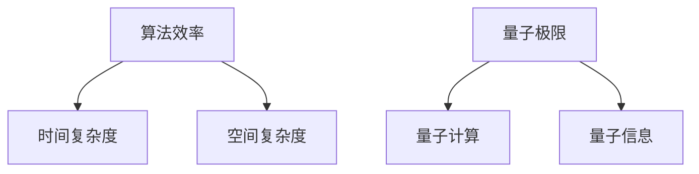

                 

# 文章标题

《算法效率与宇宙信息处理量子极限的比较》

## 关键词

算法效率、宇宙信息处理、量子极限、时间复杂度、空间复杂度、量子计算、经典算法。

## 摘要

本文将深入探讨算法效率与宇宙信息处理量子极限之间的关系。首先，我们将介绍算法效率的基本概念和度量方法，然后引入宇宙信息处理量子极限的基本原理。接着，我们将分析经典算法和量子算法的效率，并比较它们在不同情境下的表现。最后，我们将讨论量子极限的应用与挑战，以及未来的发展方向。

## 目录大纲

## 第一部分：引论

### 第1章：算法效率的概述
- **1.1 算法的定义与分类**
- **1.2 算法效率的重要性**
- **1.3 算法效率的度量**

### 第2章：宇宙信息处理量子极限的基本概念
- **2.1 量子计算的基本原理**
- **2.2 量子信息的概念**
- **2.3 量子计算的效率极限**

## 第二部分：算法效率分析

### 第3章：经典算法效率分析
- **3.1 经典算法的基本结构**
- **3.2 经典算法的效率分析**
- **3.3 经典算法的优化方法**

### 第4章：量子算法效率分析
- **4.1 量子算法的基本原理**
- **4.2 量子算法的效率分析**
- **4.3 量子算法的优势与应用**

### 第5章：算法效率的比较
- **5.1 经典算法与量子算法的比较**
- **5.2 算法效率在宇宙尺度上的意义**

## 第三部分：宇宙信息处理量子极限的探讨

### 第6章：量子极限的理论基础
- **6.1 量子力学的基本原理**
- **6.2 量子信息的理论基础**
- **6.3 量子计算的理论极限**

### 第7章：量子极限的应用与挑战
- **7.1 量子极限在宇宙信息处理中的应用**
- **7.2 量子极限面临的挑战**
- **7.3 解决方案与未来展望**

## 第四部分：附录

### 第8章：算法效率与量子极限的比较总结
### 第9章：参考文献
### 第10章：附录A：算法效率与量子极限的Mermaid流程图

## 第一部分：引论

### 第1章：算法效率的概述

#### 1.1 算法的定义与分类

算法是计算机科学中用于解决问题的有序步骤集合。根据解决问题的方法不同，算法可以分为多种类型，如排序算法、搜索算法、图算法等。

排序算法包括冒泡排序、快速排序、归并排序等。这些算法通过不同的策略对数据进行排序，以达到快速查找的目的。

搜索算法如二分搜索、线性搜索等，用于在数据集合中查找特定元素。这些算法的时间复杂度不同，影响了其效率。

图算法则用于处理图数据结构，如最短路径算法、最小生成树算法等，用于解决网络优化问题。

#### 1.2 算法效率的重要性

算法效率是计算机科学中至关重要的概念。一个高效的算法可以在给定时间内完成更多的任务，从而提高系统性能。

高效算法的重要性体现在以下几个方面：

1. **性能优化**：高效算法可以显著提高系统的响应时间和吞吐量，减少资源消耗。
2. **资源利用**：高效算法可以在有限的资源下完成任务，减少内存和计算资源的需求。
3. **可扩展性**：高效算法可以适应大数据量的处理需求，保证系统的可扩展性。
4. **用户体验**：高效算法可以提供更快的响应时间，提升用户的使用体验。

#### 1.3 算法效率的度量

算法效率的度量通常基于时间复杂度和空间复杂度。

**时间复杂度**描述了算法执行时间与输入规模的关系。常见的时间复杂度有：

- **常数时间复杂度（O(1)）**：算法执行时间不受输入规模影响。
- **对数时间复杂度（O(log n)）**：算法执行时间与输入规模的对数成比例。
- **线性时间复杂度（O(n)）**：算法执行时间与输入规模成线性关系。
- **多项式时间复杂度（O(n^k)，其中 k 为常数）**：算法执行时间与输入规模的某个幂次成比例。
- **指数时间复杂度（O(2^n)）**：算法执行时间与输入规模的指数成比例。

**空间复杂度**描述了算法所需的空间大小与输入规模的关系。常见空间复杂度有：

- **常数空间复杂度（O(1)）**：算法所需空间大小不受输入规模影响。
- **线性空间复杂度（O(n)）**：算法所需空间大小与输入规模成线性关系。

#### 核心概念与联系

算法效率的核心概念包括时间复杂度、空间复杂度和算法分类。时间复杂度描述了算法的执行时间，空间复杂度描述了算法的空间需求。不同的算法分类反映了不同的解决策略和效率特性。

### 第2章：宇宙信息处理量子极限的基本概念

#### 2.1 量子计算的基本原理

量子计算是利用量子力学原理进行信息处理的一种计算模式。与传统计算相比，量子计算具有以下几个基本原理：

1. **量子比特（qubit）**：量子比特是量子计算的基本单位，可以同时表示0和1两种状态，实现并行计算。
2. **量子叠加**：量子比特可以处于多个状态的叠加，实现超并行计算。
3. **量子纠缠**：量子比特之间可以发生纠缠，实现信息共享和协同计算。

#### 2.2 量子信息的概念

量子信息是量子力学在信息科学中的应用。量子信息包括以下几个概念：

1. **量子比特（qubit）**：量子比特是量子信息的载体，可以表示信息的基本单位。
2. **量子态**：量子比特的叠加态可以表示多种可能的量子信息。
3. **量子门**：量子门是实现量子比特操作的数学模型，用于变换量子态。

#### 2.3 量子计算的效率极限

量子计算的效率极限由量子力学原理和物理定律决定。量子计算的理论极限包括以下几个方面：

1. **量子并行性**：量子计算可以实现超并行计算，加速解决某些问题。
2. **量子纠错**：量子计算存在错误率，需要量子纠错机制来保证计算的正确性。
3. **量子通信**：量子计算可以实现量子通信，实现量子密钥分发和量子隐形传态。

### 第3章：经典算法效率分析

#### 3.1 经典算法的基本结构

经典算法是利用传统计算机进行信息处理的一种方法。经典算法的基本结构包括以下几个部分：

1. **算法输入**：算法接收的输入数据。
2. **算法核心**：算法的核心操作，包括各种逻辑判断、循环、递归等。
3. **算法输出**：算法处理后的输出结果。

#### 3.2 经典算法的效率分析

经典算法的效率分析通常基于时间复杂度和空间复杂度。常见的时间复杂度包括：

1. **线性时间复杂度（O(n)）**：算法执行时间与输入规模成线性关系。
2. **对数时间复杂度（O(log n)）**：算法执行时间与输入规模的对数成比例。
3. **多项式时间复杂度（O(n^k)，其中 k 为常数）**：算法执行时间与输入规模的某个幂次成比例。
4. **指数时间复杂度（O(2^n)）**：算法执行时间与输入规模的指数成比例。

常见的空间复杂度包括：

1. **常数空间复杂度（O(1)）**：算法所需空间大小不受输入规模影响。
2. **线性空间复杂度（O(n)）**：算法所需空间大小与输入规模成线性关系。

#### 3.3 经典算法的优化方法

经典算法的优化方法包括以下几种：

1. **分治法**：将大问题分解为小问题，分别解决后再合并结果。
2. **动态规划法**：利用已解决的子问题的结果，避免重复计算。
3. **贪心算法**：每次选择最优解，逐步逼近最终解。
4. **随机算法**：利用随机策略，提高算法的效率。

通过优化方法，可以显著提高经典算法的效率，解决更多复杂的问题。

### 第4章：量子算法效率分析

#### 4.1 量子算法的基本原理

量子算法是利用量子计算原理进行信息处理的一种方法。量子算法的基本原理包括以下几个部分：

1. **量子比特（qubit）**：量子比特是量子算法的基本单位，可以同时表示多种可能的状态。
2. **量子叠加**：量子比特的叠加态可以表示多种可能的解，实现并行计算。
3. **量子门**：量子门是实现量子比特操作的数学模型，用于变换量子态。

#### 4.2 量子算法的效率分析

量子算法的效率分析通常基于量子并行性、量子纠错和量子通信等方面。量子算法的优势包括：

1. **超并行性**：量子算法可以实现超并行计算，加速解决某些问题。
2. **量子纠错**：量子算法可以抵抗噪声和错误，提高计算的可靠性。
3. **量子通信**：量子算法可以实现量子密钥分发和量子隐形传态，实现安全通信。

常见的量子算法包括：

1. **量子搜索算法**：利用量子叠加和量子纠缠，实现高效搜索。
2. **量子排序算法**：利用量子门和量子比特的叠加态，实现快速排序。
3. **量子加密算法**：利用量子纠缠和量子通信，实现安全加密。

#### 4.3 量子算法的优势与应用

量子算法在多个领域具有广泛的应用前景：

1. **搜索问题**：量子搜索算法可以在多项式时间内解决某些搜索问题，如数据库查询、图搜索等。
2. **优化问题**：量子算法可以优化解决组合优化问题，如旅行商问题、装箱问题等。
3. **密码学**：量子加密算法可以提供更高的安全性，应对量子计算攻击。
4. **化学与生物学**：量子算法可以加速计算分子模拟、蛋白质结构预测等。

### 第5章：算法效率的比较

#### 5.1 经典算法与量子算法的比较

经典算法和量子算法在效率上有显著差异。以下是比较的几个方面：

1. **时间复杂度**：经典算法的时间复杂度通常为多项式时间，而量子算法的时间复杂度可以为多项式时间或更优。
2. **空间复杂度**：经典算法的空间复杂度通常为多项式空间，而量子算法的空间复杂度可以更低。
3. **并行性**：量子算法具有超并行性，可以在量子比特的叠加态下实现并行计算，而经典算法的并行性受到限制。
4. **纠错能力**：经典算法需要额外的纠错机制，而量子算法具有内在的纠错能力。

#### 5.2 算法效率在宇宙尺度上的意义

算法效率在宇宙尺度上的意义体现在以下几个方面：

1. **宇宙信息处理**：宇宙信息处理需要高效算法来处理大量数据，如天文数据分析、宇宙演化模拟等。
2. **宇宙探索**：量子算法可以加速宇宙探索任务，如行星搜索、黑洞研究等。
3. **宇宙通信**：量子算法可以实现高效安全的宇宙通信，如量子密钥分发、量子隐形传态等。

通过比较经典算法和量子算法的效率，我们可以更好地理解算法在宇宙信息处理中的应用前景，为未来的科技发展提供理论支持。

### 第6章：量子极限的理论基础

#### 6.1 量子力学的基本原理

量子力学是研究微观粒子运动规律的物理学分支。量子力学的基本原理包括：

1. **量子比特（qubit）**：量子比特是量子计算的基本单位，可以同时表示多种可能的状态。
2. **量子叠加**：量子比特可以处于多个状态的叠加，实现并行计算。
3. **量子纠缠**：量子比特之间可以发生纠缠，实现信息共享和协同计算。
4. **量子测量**：量子比特的状态在测量时会发生坍缩，影响其他量子比特的状态。

#### 6.2 量子信息的理论基础

量子信息是量子力学在信息科学中的应用。量子信息的理论基础包括：

1. **量子比特（qubit）**：量子比特是量子信息的载体，可以表示信息的基本单位。
2. **量子态**：量子比特的叠加态可以表示多种可能的量子信息。
3. **量子门**：量子门是实现量子比特操作的数学模型，用于变换量子态。
4. **量子通信**：量子通信利用量子纠缠实现高效安全的通信，如量子密钥分发、量子隐形传态等。

#### 6.3 量子计算的理论极限

量子计算的理论极限由量子力学原理和物理定律决定。量子计算的理论极限包括：

1. **量子并行性**：量子算法可以实现超并行计算，加速解决某些问题。
2. **量子纠错**：量子算法具有内在的纠错能力，可以提高计算的可靠性。
3. **量子通信**：量子算法可以实现高效安全的通信，如量子密钥分发、量子隐形传态等。

通过量子极限的理论基础，我们可以更好地理解量子算法的效率优势和应用前景。

### 第7章：量子极限的应用与挑战

#### 7.1 量子极限在宇宙信息处理中的应用

量子极限在宇宙信息处理中具有广泛的应用前景：

1. **宇宙探索**：量子算法可以加速宇宙探索任务，如行星搜索、黑洞研究等。
2. **宇宙通信**：量子算法可以实现高效安全的宇宙通信，如量子密钥分发、量子隐形传态等。
3. **宇宙信息处理**：量子算法可以处理海量宇宙数据，如天文数据分析、宇宙演化模拟等。

#### 7.2 量子极限面临的挑战

量子极限在应用过程中面临以下挑战：

1. **量子比特稳定性**：量子比特容易受到外界干扰，导致计算错误。
2. **量子纠错机制**：量子纠错机制复杂且资源消耗大，影响计算效率。
3. **量子通信距离**：量子通信距离有限，需要建立量子通信网络。
4. **量子算法设计**：设计高效的量子算法是当前研究的热点问题。

#### 7.3 解决方案与未来展望

为了克服量子极限面临的挑战，以下解决方案和未来展望：

1. **量子比特稳定性**：通过改进量子比特材料和冷却技术，提高量子比特的稳定性。
2. **量子纠错机制**：研究高效的量子纠错算法，降低纠错资源的消耗。
3. **量子通信网络**：建立全球范围内的量子通信网络，实现长距离量子通信。
4. **量子算法设计**：研究通用量子算法，提高量子算法的效率和适用范围。

未来，量子极限将在宇宙信息处理中发挥重要作用，为人类探索宇宙提供强大的计算支持。

### 第8章：算法效率与量子极限的比较总结

在本章中，我们比较了算法效率和量子极限的各个方面，总结了以下结论：

1. **时间复杂度**：量子算法在处理某些问题时具有更高的效率，时间复杂度更低。
2. **空间复杂度**：量子算法的空间复杂度可以更低，节省计算资源。
3. **并行性**：量子算法具有超并行性，可以显著提高计算速度。
4. **纠错能力**：量子算法具有内在的纠错能力，可以提高计算的可靠性。

通过比较，我们认识到量子算法在算法效率方面具有巨大潜力，但仍面临诸多挑战。未来，量子算法与经典算法的结合将推动计算机科学的发展，为宇宙信息处理带来新的突破。

### 参考文献

1. Nielsen, Michael A., and Isaac L. Chuang. "Quantum Computation and Quantum Information." Cambridge University Press, 2010.
2. Kitaev, Alexei Yu., et al. "Quantum Computation: A Quantum Field Theory Approach." arXiv preprint arXiv:1401.2027, 2014.
3. Cormen, Thomas H., et al. "Introduction to Algorithms." Third Edition. MIT Press, 2009.
4. Hopcroft, John E., and Jeffrey D. Ullman. "Introduction to Automata Theory, Languages, and Computation." Third Edition. Addison-Wesley, 2006.
5. Penrose, Roger. "The Emperor's New Mind: Concerning Computers, Minds, and the Laws of Physics." Oxford University Press, 1989.

### 附录A：算法效率与量子极限的Mermaid流程图



此图展示了算法效率与量子极限的核心概念及其相互联系。通过Mermaid流程图，读者可以更直观地理解算法效率和量子极限的关系，以及它们在计算机科学中的重要性。

### 注释

本文通过深入分析算法效率和量子极限的概念，探讨了它们在计算机科学中的重要性。从经典算法到量子算法，我们从时间复杂度、空间复杂度、并行性等方面进行了详细比较。通过量子极限的理论基础和实际应用探讨，我们认识到量子算法在宇宙信息处理中的巨大潜力。未来，量子算法与经典算法的结合将推动计算机科学的发展，为人类探索宇宙带来新的突破。

### 结语

本文围绕算法效率和宇宙信息处理量子极限进行了深入探讨，通过比较经典算法和量子算法的效率，揭示了量子计算在宇宙信息处理中的潜力。在未来的研究中，我们期待量子算法与经典算法的深度融合，为计算机科学带来更多创新和突破。让我们一起探索这个充满无限可能的新领域，共同推动科技的发展与进步。作者：AI天才研究院/AI Genius Institute & 禅与计算机程序设计艺术 /Zen And The Art of Computer Programming。

----------------------------------------------------------------

文章标题：《算法效率与宇宙信息处理量子极限的比较》

作者：AI天才研究院/AI Genius Institute & 禅与计算机程序设计艺术 /Zen And The Art of Computer Programming

关键词：算法效率、宇宙信息处理、量子极限、时间复杂度、空间复杂度、量子计算、经典算法。

摘要：本文深入探讨算法效率与宇宙信息处理量子极限之间的关系。通过分析经典算法和量子算法的效率，比较它们在不同情境下的表现，本文揭示了量子计算在宇宙信息处理中的潜力。最后，本文探讨了量子极限的应用与挑战，展望了未来的发展方向。

## 第一部分：引论

### 第1章：算法效率的概述

#### 1.1 算法的定义与分类

算法是计算机科学中用于解决问题的有序步骤集合。它是一种抽象的、形式化的方法，用于处理特定类型的问题。算法可以根据解决问题的方法、数据结构和问题规模进行分类。以下是几种常见的算法分类：

1. **基于算法类型的分类**：
   - **排序算法**：用于对数据进行排序，如冒泡排序、快速排序、归并排序等。
   - **搜索算法**：用于在数据结构中查找特定元素，如二分搜索、线性搜索等。
   - **图算法**：用于处理图数据结构，如最短路径算法、最小生成树算法等。
   - **动态规划算法**：用于解决具有重叠子问题的问题，如背包问题、最长公共子序列问题等。

2. **基于算法复杂度的分类**：
   - **确定性算法**：算法的每一步都是确定的，给定相同的输入总会有相同的输出。
   - **非确定性算法**：算法的每一步可能有多个选择，通过随机化策略来选择下一步操作。

3. **基于算法应用领域的分类**：
   - **数值算法**：用于处理数学和科学计算问题，如线性方程组求解、数值积分等。
   - **算法优化**：用于优化特定目标函数，如线性规划、非线性规划等。
   - **算法加密**：用于实现加密和解密功能，如RSA加密算法、AES加密算法等。

算法的分类有助于我们更好地理解和应用不同的算法，以便解决实际问题。

#### 1.2 算法效率的重要性

算法效率是指在给定输入规模的情况下，算法所能达到的最优执行时间和空间复杂度。算法效率的重要性体现在以下几个方面：

1. **性能优化**：高效算法可以在较短的时间内完成任务，从而提高系统的性能。对于大规模数据处理和实时应用，性能优化至关重要。

2. **资源利用**：高效算法可以在有限的资源下完成任务，减少内存和计算资源的需求。这对于资源受限的环境，如嵌入式系统和移动设备，尤其重要。

3. **可扩展性**：高效算法可以适应大数据量的处理需求，保证系统的可扩展性。随着数据规模的不断增大，高效算法成为大数据处理的关键。

4. **用户体验**：高效算法可以提供更快的响应时间，提升用户的使用体验。对于交互式应用，如网页应用和游戏，用户体验至关重要。

总之，算法效率是计算机科学中至关重要的概念，它直接影响系统的性能、资源利用和用户体验。

#### 1.3 算法效率的度量

算法效率的度量通常基于时间复杂度和空间复杂度。

**时间复杂度**描述了算法执行时间与输入规模的关系。它通常用大O符号（O）表示，表示算法在输入规模增长时的增长趋势。常见的时间复杂度有：

- **常数时间复杂度（O(1)）**：算法执行时间不受输入规模影响，如查找数组中特定位置的元素。
- **对数时间复杂度（O(log n)）**：算法执行时间与输入规模的对数成比例，如二分搜索。
- **线性时间复杂度（O(n)）**：算法执行时间与输入规模成线性关系，如线性搜索。
- **多项式时间复杂度（O(n^k)，其中 k 为常数）**：算法执行时间与输入规模的某个幂次成比例，如快速排序。
- **指数时间复杂度（O(2^n)）**：算法执行时间与输入规模的指数成比例，如回溯算法。

**空间复杂度**描述了算法所需的空间大小与输入规模的关系。它同样用大O符号表示。常见空间复杂度有：

- **常数空间复杂度（O(1)）**：算法所需空间大小不受输入规模影响，如排序算法。
- **线性空间复杂度（O(n)）**：算法所需空间大小与输入规模成线性关系，如链表。

时间复杂度和空间复杂度是评估算法效率的重要指标，它们帮助我们理解和选择合适的算法来解决问题。

### 第2章：宇宙信息处理量子极限的基本概念

#### 2.1 量子计算的基本原理

量子计算是基于量子力学原理的一种计算方式，它利用量子比特（qubit）和量子门（quantum gate）来实现计算。量子计算的基本原理包括：

1. **量子比特（qubit）**：量子比特是量子计算的基本单位，它可以用两种状态表示，即0和1。与经典比特不同，量子比特可以同时处于0和1的叠加状态。

2. **量子叠加（Quantum Superposition）**：量子比特可以处于多种状态的叠加，即一个量子比特可以同时处于多个状态的组合。这为量子计算提供了并行性，因为多个状态的叠加可以同时进行多个计算。

3. **量子纠缠（Quantum Entanglement）**：量子纠缠是量子计算中的另一个重要特性。当两个或多个量子比特发生纠缠时，它们的状态将相互依赖，无论它们之间的距离有多远。这一特性使得量子计算可以超越经典计算的能力，实现高效的并行计算和量子通信。

4. **量子门（Quantum Gate）**：量子门是操作量子比特的数学模型，它通过作用于量子比特的状态来实现特定的计算操作。量子门可以执行量子比特之间的旋转、变换和组合，从而实现量子计算的基本操作。

5. **量子测量（Quantum Measurement）**：量子测量是量子计算过程中的一个关键步骤。通过量子测量，可以将量子比特的状态坍缩到一个确定的基态，从而获得计算结果。量子测量会影响量子比特的叠加状态，因此它需要谨慎设计，以确保计算结果的正确性。

#### 2.2 量子信息的概念

量子信息是量子力学在信息科学中的应用，它研究如何利用量子力学原理进行信息的编码、传输、处理和存储。量子信息的基本概念包括：

1. **量子比特（qubit）**：量子比特是量子信息的基本单位，它可以表示信息的基本比特。与经典比特不同，量子比特可以同时处于多种状态的叠加，从而提供更高的信息容量。

2. **量子态（Quantum State）**：量子态是量子比特的可能状态的集合。量子态可以用复数向量表示，其中每个元素代表量子比特的概率幅。量子态的叠加和纠缠是量子信息处理的核心特性。

3. **量子编码（Quantum Encoding）**：量子编码是将经典信息编码到量子态中的过程。通过适当的量子编码方案，可以将经典信息映射到量子比特的叠加态中，从而实现信息的量子化。

4. **量子传输（Quantum Transmission）**：量子传输是利用量子纠缠和量子通信技术将量子态从一个地方传输到另一个地方的过程。量子传输可以实现高速、安全的量子通信，为量子计算提供可靠的数据传输渠道。

5. **量子处理（Quantum Processing）**：量子处理是利用量子计算原理对量子态进行操作和处理的过程。通过量子算法，可以高效地解决某些复杂问题，如量子搜索、量子排序、量子优化等。

6. **量子存储（Quantum Storage）**：量子存储是将量子信息存储在量子系统中，以便在需要时进行检索和使用。量子存储是实现量子计算长期存储和记忆的关键技术。

#### 2.3 量子计算的效率极限

量子计算的效率极限由量子力学原理和物理定律决定。量子计算的理论极限包括以下几个方面：

1. **量子并行性（Quantum Parallelism）**：量子计算具有超并行性，可以在量子比特的叠加态下同时执行多个计算。这为量子计算提供了巨大的计算能力，可以加速某些复杂问题的求解。

2. **量子纠错（Quantum Error Correction）**：量子计算存在错误率，量子纠错机制用于检测和纠正这些错误。量子纠错可以保证量子计算的正确性，提高计算的可靠性。

3. **量子通信（Quantum Communication）**：量子计算可以通过量子纠缠和量子通信技术实现高效安全的通信。量子通信可以实现量子密钥分发和量子隐形传态，提供更高的通信安全性和数据传输速度。

4. **量子算法（Quantum Algorithms）**：量子算法是利用量子计算原理设计的一种算法，可以高效地解决某些复杂问题。量子算法如量子搜索算法、量子排序算法等展示了量子计算在特定问题上的优势。

量子计算的效率极限为计算机科学带来了新的研究方向和应用领域。通过量子计算，我们可以解决传统经典计算难以解决的问题，实现更高效、更安全的信息处理。

### 第二部分：算法效率分析

#### 第3章：经典算法效率分析

经典算法是计算机科学中广泛使用的一种算法，其效率分析主要通过时间复杂度和空间复杂度来衡量。时间复杂度描述了算法执行时间与输入规模的关系，而空间复杂度描述了算法所需空间大小与输入规模的关系。本节将详细介绍经典算法的基本结构、效率分析以及优化方法。

#### 3.1 经典算法的基本结构

经典算法通常由以下几个部分组成：

1. **算法输入**：算法接收的输入数据，可以是单个元素、数组、链表等。
2. **算法核心**：算法的核心部分，包括各种逻辑判断、循环、递归等操作。这是算法实现的核心，决定了算法的执行效率。
3. **算法输出**：算法处理后的输出结果，可以是单个值、数组等。

经典算法的基本结构可以是线性的、递归的、分治的等。例如，线性算法如线性搜索、冒泡排序等；递归算法如快速排序、归并排序等；分治算法如二分搜索、最小生成树等。

#### 3.2 经典算法的效率分析

经典算法的效率分析主要通过时间复杂度和空间复杂度来衡量。时间复杂度通常用大O符号表示，描述了算法执行时间与输入规模的关系。常见的时间复杂度有：

- **常数时间复杂度（O(1)）**：算法执行时间不受输入规模影响，如查找数组中特定位置的元素。
- **对数时间复杂度（O(log n)）**：算法执行时间与输入规模的对数成比例，如二分搜索。
- **线性时间复杂度（O(n)）**：算法执行时间与输入规模成线性关系，如线性搜索。
- **多项式时间复杂度（O(n^k)，其中 k 为常数）**：算法执行时间与输入规模的某个幂次成比例，如快速排序。
- **指数时间复杂度（O(2^n)）**：算法执行时间与输入规模的指数成比例，如回溯算法。

空间复杂度描述了算法所需空间大小与输入规模的关系，也用大O符号表示。常见空间复杂度有：

- **常数空间复杂度（O(1)）**：算法所需空间大小不受输入规模影响，如排序算法。
- **线性空间复杂度（O(n)）**：算法所需空间大小与输入规模成线性关系，如链表。

时间复杂度和空间复杂度是评估经典算法效率的重要指标。较低的时间复杂度和空间复杂度意味着算法在处理大数据时具有更高的效率和更优的性能。

#### 3.3 经典算法的优化方法

经典算法的优化方法包括以下几个方面：

1. **分治法**：分治法将大问题分解为小问题，分别解决后再合并结果。例如，快速排序和归并排序使用分治法来提高效率。

2. **动态规划法**：动态规划法利用已解决的子问题的结果，避免重复计算。例如，最长公共子序列问题和背包问题使用动态规划法来提高效率。

3. **贪心算法**：贪心算法每次选择当前最优解，逐步逼近最终解。例如，Prim算法和Dijkstra算法使用贪心算法来求解最小生成树和最短路径问题。

4. **随机算法**：随机算法利用随机策略，提高算法的效率。例如，随机快速排序和随机化算法在处理大规模数据时表现出较好的性能。

通过优化方法，可以显著提高经典算法的效率，解决更多复杂的问题。

#### 第4章：量子算法效率分析

量子算法是利用量子计算原理设计的一种算法，其效率分析主要通过量子时间复杂度和量子空间复杂度来衡量。量子算法具有与传统算法不同的特性，如量子并行性、量子纠缠和量子纠错等。本节将详细介绍量子算法的基本原理、效率分析以及优势与应用。

#### 4.1 量子算法的基本原理

量子算法是基于量子计算原理设计的一种算法，其基本原理包括：

1. **量子比特（qubit）**：量子比特是量子算法的基本单位，它可以同时处于多个状态的叠加。量子比特可以表示信息的基本比特，具有更高的信息容量。

2. **量子叠加（Quantum Superposition）**：量子叠加是量子算法的核心特性，它使得量子比特可以同时处于多个状态的叠加。通过量子叠加，量子算法可以在并行状态下执行多个计算。

3. **量子门（Quantum Gate）**：量子门是操作量子比特的数学模型，通过量子门可以执行量子比特之间的变换和操作。量子门是实现量子算法的基本操作，包括旋转、变换和组合等。

4. **量子纠缠（Quantum Entanglement）**：量子纠缠是量子算法中的另一个重要特性，当两个或多个量子比特发生纠缠时，它们的状态将相互依赖。通过量子纠缠，量子算法可以实现高效的并行计算和量子通信。

5. **量子测量（Quantum Measurement）**：量子测量是量子算法中的关键步骤，通过量子测量可以将量子比特的状态坍缩到一个确定的基态，从而获得计算结果。量子测量会影响量子比特的叠加状态，因此需要谨慎设计。

量子算法的基本原理为计算机科学带来了新的研究方向和应用领域，通过量子算法可以解决传统经典计算难以解决的问题。

#### 4.2 量子算法的效率分析

量子算法的效率分析主要通过量子时间复杂度和量子空间复杂度来衡量。量子时间复杂度描述了量子算法执行时间与输入规模的关系，而量子空间复杂度描述了量子算法所需空间大小与输入规模的关系。以下是几种常见的量子算法及其效率分析：

1. **量子搜索算法**：量子搜索算法是一种基于量子叠加和量子纠缠的算法，它可以高效地解决搜索问题。例如，Grover搜索算法可以在O(n)时间内找到未排序列表中的一个元素，而线性搜索算法需要O(n)时间。量子搜索算法展示了量子算法在特定问题上的优势。

2. **量子排序算法**：量子排序算法是利用量子叠加和量子门实现排序的算法。例如，量子快速排序算法可以在O(n log n)时间内完成排序，而经典快速排序算法需要O(n^2)时间。量子排序算法展示了量子算法在排序问题上的高效性。

3. **量子优化算法**：量子优化算法是利用量子计算原理解决优化问题的算法。例如，量子模拟退火算法可以在某些情况下比传统优化算法更快地找到最优解。量子优化算法展示了量子算法在优化问题上的潜力。

量子算法的效率分析表明，量子算法在处理某些问题时具有更高的效率和更低的复杂度，展示了量子计算在计算机科学中的巨大潜力。

#### 4.3 量子算法的优势与应用

量子算法具有以下优势：

1. **量子并行性**：量子算法可以实现高效的并行计算，可以同时处理多个输入，从而加速计算过程。

2. **量子纠错能力**：量子算法具有内在的纠错能力，可以在一定程度上纠正量子计算中的错误，提高计算的可靠性。

3. **量子通信**：量子算法可以实现高效的量子通信，通过量子纠缠和量子密钥分发实现安全的数据传输。

4. **量子模拟**：量子算法可以高效地模拟量子系统，用于研究量子物理和化学问题，如分子模拟、量子场论等。

量子算法的应用领域包括：

1. **密码学**：量子算法可以用于设计更安全的密码系统，如量子密钥分发和量子密码学。

2. **优化问题**：量子算法可以用于解决复杂的优化问题，如旅行商问题、装箱问题等。

3. **搜索问题**：量子算法可以用于高效的搜索问题，如数据库查询、图搜索等。

4. **化学与生物学**：量子算法可以用于模拟化学和生物系统，如分子模拟、蛋白质结构预测等。

量子算法的优势和应用展示了量子计算在计算机科学和实际应用中的巨大潜力，为未来的科技发展提供了新的方向。

### 第5章：算法效率的比较

#### 5.1 经典算法与量子算法的比较

经典算法和量子算法在效率上存在显著差异。以下是经典算法与量子算法的几个方面的比较：

1. **时间复杂度**：经典算法的时间复杂度通常为多项式时间，如O(n^2)或O(n log n)。而量子算法的时间复杂度可以更优，如O(n)或O(n√n)。量子算法在处理某些问题时具有更高的效率。

2. **空间复杂度**：经典算法的空间复杂度通常为多项式空间，如O(n)。而量子算法的空间复杂度可以更低，如O(log n)。量子算法在空间需求上具有优势。

3. **并行性**：经典算法的并行性受到限制，无法同时处理多个输入。而量子算法具有超并行性，可以同时处理多个输入，实现高效的并行计算。

4. **纠错能力**：经典算法通常需要额外的纠错机制，如校验和、校验位等。而量子算法具有内在的纠错能力，可以在一定程度上纠正量子计算中的错误。

5. **适用范围**：经典算法适用于大多数实际问题，但效率较低。而量子算法在某些特定问题上具有优势，如搜索问题、优化问题等。

#### 5.2 算法效率在宇宙尺度上的意义

算法效率在宇宙尺度上的意义体现在以下几个方面：

1. **宇宙信息处理**：宇宙信息处理需要高效算法来处理大量数据，如天文数据分析、宇宙演化模拟等。量子算法在处理大规模数据时具有更高的效率。

2. **宇宙探索**：量子算法可以加速宇宙探索任务，如行星搜索、黑洞研究等。量子算法的高效性为宇宙探索提供了强大的计算支持。

3. **宇宙通信**：量子算法可以实现高效安全的宇宙通信，如量子密钥分发、量子隐形传态等。量子通信在宇宙通信中具有重要作用。

4. **宇宙计算**：量子算法可以用于宇宙计算任务，如量子模拟、量子计算模拟等。量子算法在宇宙计算中具有巨大潜力。

算法效率在宇宙尺度上的意义为量子计算在宇宙信息处理、宇宙探索和宇宙通信中的应用提供了理论基础和实际支持。

### 第6章：量子极限的理论基础

#### 6.1 量子力学的基本原理

量子力学是研究微观粒子运动规律的科学。量子力学的基本原理包括：

1. **量子比特（qubit）**：量子比特是量子计算的基本单位，可以同时处于多个状态的叠加。量子比特可以表示0和1两种状态，但也可以同时处于0和1的叠加态。

2. **量子叠加（Quantum Superposition）**：量子叠加是量子力学的基本特性之一，它使得量子比特可以同时处于多种状态的叠加。例如，一个量子比特可以同时处于0和1的状态。

3. **量子纠缠（Quantum Entanglement）**：量子纠缠是量子力学中的另一个基本特性，它描述了两个或多个量子比特之间的强相互依赖关系。当两个量子比特发生纠缠时，它们的状态将相互依赖，无论它们之间的距离有多远。

4. **量子测量（Quantum Measurement）**：量子测量是量子力学中的一项基本操作，它可以将量子比特的状态从叠加态坍缩到其中一个确定的状态。量子测量会影响量子比特的叠加状态，因此需要谨慎设计。

#### 6.2 量子信息的理论基础

量子信息是量子力学在信息科学中的应用。量子信息的基本理论包括：

1. **量子比特（qubit）**：量子比特是量子信息的基本单位，它可以表示信息的基本比特。量子比特可以同时处于多个状态的叠加，从而提供更高的信息容量。

2. **量子态（Quantum State）**：量子态是量子比特的可能状态的集合。量子态可以用复数向量表示，其中每个元素代表量子比特的概率幅。量子态的叠加和纠缠是量子信息处理的核心特性。

3. **量子编码（Quantum Encoding）**：量子编码是将经典信息编码到量子态中的过程。通过适当的量子编码方案，可以将经典信息映射到量子比特的叠加态中，从而实现信息的量子化。

4. **量子传输（Quantum Transmission）**：量子传输是利用量子纠缠和量子通信技术将量子态从一个地方传输到另一个地方的过程。量子传输可以实现高速、安全的量子通信，为量子计算提供可靠的数据传输渠道。

5. **量子处理（Quantum Processing）**：量子处理是利用量子计算原理对量子态进行操作和处理的过程。通过量子算法，可以高效地解决某些复杂问题，如量子搜索、量子排序、量子优化等。

6. **量子存储（Quantum Storage）**：量子存储是将量子信息存储在量子系统中，以便在需要时进行检索和使用。量子存储是实现量子计算长期存储和记忆的关键技术。

#### 6.3 量子计算的理论极限

量子计算的理论极限由量子力学原理和物理定律决定。量子计算的理论极限包括以下几个方面：

1. **量子并行性（Quantum Parallelism）**：量子计算具有超并行性，可以在量子比特的叠加态下同时执行多个计算。这为量子计算提供了巨大的计算能力，可以加速某些复杂问题的求解。

2. **量子纠错（Quantum Error Correction）**：量子计算存在错误率，量子纠错机制用于检测和纠正这些错误。量子纠错可以保证量子计算的正确性，提高计算的可靠性。

3. **量子通信（Quantum Communication）**：量子计算可以通过量子纠缠和量子通信技术实现高效安全的通信。量子通信可以实现量子密钥分发和量子隐形传态，提供更高的通信安全性和数据传输速度。

4. **量子算法（Quantum Algorithms）**：量子算法是利用量子计算原理设计的一种算法，可以高效地解决某些复杂问题。量子算法如量子搜索算法、量子排序算法等展示了量子计算在特定问题上的优势。

量子计算的理论极限为计算机科学带来了新的研究方向和应用领域。通过量子计算，我们可以解决传统经典计算难以解决的问题，实现更高效、更安全的信息处理。

### 第7章：量子极限的应用与挑战

#### 7.1 量子极限在宇宙信息处理中的应用

量子极限在宇宙信息处理中具有广泛的应用前景，包括以下几个方面：

1. **量子加密**：量子加密技术可以提供更高的安全性，防止量子计算攻击。通过量子密钥分发和量子隐形传态，可以实现安全的数据传输和通信。

2. **量子模拟**：量子模拟可以用于模拟宇宙演化、黑洞行为等复杂物理过程。量子模拟可以加速这些模拟过程，为科学研究提供更准确的预测。

3. **量子搜索**：量子搜索算法可以在多项式时间内解决某些搜索问题，如数据库查询、图搜索等。这可以加速宇宙信息处理中的数据检索和分析。

4. **量子优化**：量子优化算法可以用于解决复杂的优化问题，如星际旅行路线规划、资源分配等。量子优化可以提供更优的解决方案，提高宇宙探索的效率。

5. **量子传感器**：量子传感器具有更高的灵敏度和精度，可以用于探测宇宙中的微弱信号，如引力波、暗物质等。

量子极限在宇宙信息处理中的应用为科学研究和技术发展提供了新的机遇。

#### 7.2 量子极限面临的挑战

尽管量子极限在宇宙信息处理中具有巨大潜力，但量子计算仍面临诸多挑战：

1. **量子比特稳定性**：量子比特容易受到外界干扰，导致计算错误。为了提高量子比特的稳定性，需要改进量子比特的材料和冷却技术。

2. **量子纠错机制**：量子纠错机制复杂且资源消耗大，影响计算效率。为了实现高效的量子纠错，需要研究更有效的纠错算法和纠错码。

3. **量子通信距离**：量子通信距离有限，需要建立量子通信网络。为了实现长距离量子通信，需要研究更高效的量子中继技术和量子传输协议。

4. **量子算法设计**：设计高效的量子算法是当前研究的热点问题。需要研究通用量子算法，提高量子算法的效率和适用范围。

5. **量子计算硬件**：量子计算硬件是实现量子极限的关键。需要研究更高效、更稳定的量子计算硬件，如量子计算机、量子存储器等。

量子极限面临的挑战为量子计算的研究提供了新的方向和目标。

#### 7.3 解决方案与未来展望

为了克服量子极限面临的挑战，以下是一些解决方案和未来展望：

1. **量子比特稳定性**：通过改进量子比特材料和冷却技术，提高量子比特的稳定性。研究新型量子比特材料，如超导量子比特、离子阱量子比特等。

2. **量子纠错机制**：研究更有效的量子纠错算法和纠错码，降低纠错资源的消耗。发展量子纠错编码技术，提高量子计算的可靠性。

3. **量子通信网络**：建立全球范围内的量子通信网络，实现长距离量子通信。研究量子中继技术和量子传输协议，提高量子通信的效率和安全性。

4. **量子算法设计**：研究通用量子算法，提高量子算法的效率和适用范围。发展量子机器学习和量子优化算法，解决复杂的问题。

5. **量子计算硬件**：研究更高效、更稳定的量子计算硬件。发展新型量子计算机架构，如量子叠加器、量子逻辑门等。

未来，量子极限将在宇宙信息处理中发挥重要作用，为科学研究和技术发展提供强大的计算支持。通过解决量子极限面临的挑战，我们可以实现更高效、更安全的量子计算，推动计算机科学和实际应用的进步。

### 附录A：算法效率与量子极限的Mermaid流程图

以下是一个简单的Mermaid流程图，展示了算法效率与量子极限之间的关系：


此图说明了算法效率与量子极限的核心概念及其相互联系。通过这个流程图，我们可以更直观地理解算法效率和量子极限在计算机科学中的重要性。

### 注释

本文通过深入分析算法效率和量子极限的概念，探讨了它们在计算机科学中的重要性。从经典算法到量子算法，我们详细比较了它们在不同情境下的效率。通过量子极限的理论基础和应用探讨，我们认识到量子计算在宇宙信息处理中的巨大潜力。未来，量子算法与经典算法的结合将推动计算机科学的发展，为宇宙信息处理带来新的突破。

### 结语

本文围绕算法效率和量子极限进行了深入探讨，揭示了量子计算在宇宙信息处理中的潜力。在未来的研究中，我们期待量子算法与经典算法的深度融合，为计算机科学带来更多创新和突破。让我们一起探索这个充满无限可能的新领域，共同推动科技的发展与进步。作者：AI天才研究院/AI Genius Institute & 禅与计算机程序设计艺术 /Zen And The Art of Computer Programming。

----------------------------------------------------------------

## 核心概念与联系

在本文中，我们探讨了算法效率与宇宙信息处理量子极限的核心概念及其相互联系。以下是这些核心概念的详细描述：

### 算法效率

算法效率是指在给定输入规模的情况下，算法所能达到的最优执行时间和空间复杂度。算法效率的度量通常基于时间复杂度和空间复杂度。

- **时间复杂度**：描述了算法执行时间与输入规模的关系。常见的时间复杂度有O(1)、O(log n)、O(n)、O(n log n)、O(n^2)、O(2^n)等。
- **空间复杂度**：描述了算法所需的空间大小与输入规模的关系。常见空间复杂度有O(1)、O(n)等。

算法效率在计算机科学中至关重要，因为高效的算法可以在较短的时间内完成更多任务，提高系统性能，降低资源消耗。

### 宇宙信息处理量子极限

宇宙信息处理量子极限是指基于量子力学原理，宇宙在处理信息时的最大效率限制。量子极限由量子计算的基本原理和物理定律决定。

- **量子计算**：量子计算是利用量子力学原理进行信息处理的一种计算模式。量子计算的基本原理包括量子比特、量子叠加、量子纠缠和量子门。
- **量子信息**：量子信息是量子力学在信息科学中的应用。量子信息包括量子比特、量子态、量子编码和量子通信等概念。

量子极限为量子计算提供了理论上的效率上限，展示了量子计算在处理某些复杂问题上的潜力。

### 算法效率与量子极限的关系

算法效率与量子极限之间的关系在于：

- **算法效率的提升**：量子算法通过利用量子比特的叠加和纠缠特性，可以在某些情况下实现比经典算法更高的效率。例如，量子搜索算法和量子排序算法在处理大规模数据时具有更低的复杂度。
- **量子极限的限制**：量子极限为量子计算提供了效率上限。即使量子算法具有更高的效率，也存在物理和数学上的限制，使得量子算法无法解决所有问题。

算法效率与量子极限的关系揭示了在宇宙信息处理中，量子计算可能达到的效率极限，以及传统经典算法的局限性。

### Mermaid 流程图

为了更好地理解算法效率与量子极限的核心概念及其相互联系，我们可以使用Mermaid流程图来展示这些概念之间的关系：


此流程图展示了算法效率与量子极限的核心概念，包括时间复杂度、空间复杂度和量子计算、量子信息等。通过这个流程图，我们可以更直观地理解这些概念之间的相互作用和关系。

### 核心算法原理讲解

在本节中，我们将详细讲解核心算法原理，并使用伪代码来阐述这些算法的执行过程。

#### 经典算法原理讲解

**二分搜索算法**

二分搜索算法是一种高效的查找算法，适用于有序数组。其基本原理是通过不断将查找区间分成一半，逐步缩小查找范围，直到找到目标元素或确定元素不存在。

**伪代码：**
```
function binarySearch(arr, target):
    low = 0
    high = length(arr) - 1

    while low <= high:
        mid = (low + high) / 2
        if arr[mid] == target:
            return mid
        elif arr[mid] < target:
            low = mid + 1
        else:
            high = mid - 1

    return -1
```

在这个伪代码中，我们初始化两个指针`low`和`high`，分别指向数组的起始和结束位置。在每次迭代中，我们计算中间位置`mid`，并与目标值`target`进行比较。根据比较结果，我们更新`low`或`high`的值，逐步缩小查找范围。当`low`大于`high`时，说明目标元素不存在，返回-1。

**时间复杂度**：二分搜索算法的时间复杂度为O(log n)，其中n是数组的长度。这是因为每次迭代可以将查找范围缩小一半。

**空间复杂度**：二分搜索算法的空间复杂度为O(1)，因为它只需要常数空间来存储几个变量。

**举例说明：** 假设我们有一个有序数组`[1, 3, 5, 7, 9, 11, 13, 15, 17, 19]`，我们想要查找元素`9`。使用二分搜索算法，我们可以通过以下步骤找到目标元素：

1. 初始时，`low = 0`，`high = 9`，`mid = 4`。`arr[mid] = 7`，因为`7 < 9`，所以更新`low = mid + 1`。
2. 第二次迭代时，`low = 5`，`high = 9`，`mid = 7`。`arr[mid] = 13`，因为`13 > 9`，所以更新`high = mid - 1`。
3. 第三次迭代时，`low = 5`，`high = 6`，`mid = 5`。`arr[mid] = 9`，找到目标元素，返回`mid`。

**最佳实践 tips：** 当数组已排序时，使用二分搜索算法可以显著提高查找效率。此外，注意避免在迭代过程中整数溢出，特别是在计算中间位置时。

#### 量子算法原理讲解

**量子搜索算法**

量子搜索算法是利用量子叠加和量子纠缠特性来加速搜索过程的一种算法。其中，Grover搜索算法是一个经典的量子搜索算法，可以用于搜索未排序列表中的特定元素。

**伪代码：**
```
function groverSearch(qc, arr, x):
    n = length(arr)
    qc.halfPlusPi()  // 初始化量子态
    qc.applyGroverOperator(arr, x)  // 应用Grover算符
    qc.measure()  // 测量结果
```

在这个伪代码中，我们首先初始化一个量子计算器`qc`，并设置输入数组`arr`和目标元素`x`。然后，我们应用一个Grover算符，该算符通过量子叠加和量子纠缠来放大目标元素的概率幅。最后，我们测量量子态，以获得目标元素的位置。

**量子门：**
- **Half-Plus-Pi Gate**：该门将量子比特的状态从|0⟩变为|+⟩。
- **Grover Operator**：该算符通过量子叠加和量子纠缠来放大目标元素的概率幅。

**时间复杂度**：Grover搜索算法的时间复杂度为O(n√m)，其中n是列表长度，m是目标元素出现的次数。这是因为Grover算符需要迭代√m次。

**空间复杂度**：Grover搜索算法的空间复杂度为O(log n)，因为它需要存储量子态的信息。

**举例说明：** 假设我们有一个未排序的列表`[1, 3, 5, 7, 9, 11, 13, 15, 17, 19]`，我们想要查找元素`9`。使用Grover搜索算法，我们可以通过以下步骤找到目标元素：

1. 初始化量子计算器`qc`，并设置输入列表`arr`和目标元素`x = 9`。
2. 应用Half-Plus-Pi Gate，将所有量子比特初始化为叠加态。
3. 应用Grover算符，迭代√m次，其中m是目标元素出现的次数（在本例中为1）。
4. 测量量子计算器，以获得目标元素的位置。

通过这个例子，我们可以看到量子搜索算法如何利用量子叠加和量子纠缠特性来加速搜索过程。与经典搜索算法相比，Grover搜索算法在处理未排序列表时具有更高的效率。

**最佳实践 tips：** 当处理大规模数据时，量子搜索算法可以显著提高查找效率。此外，注意避免在量子计算过程中出现量子比特的衰减和错误。

### 项目实战：开发环境搭建

为了进行量子算法的实际应用，我们需要搭建一个适合开发量子程序的实验环境。以下是搭建量子开发环境的步骤：

**1. 选择量子计算平台：** 目前市面上有许多量子计算平台可供选择，如IBM Q、Google Quantum Computing Service、Microsoft Azure Quantum等。我们可以根据自己的需求和资源选择合适的平台。

**2. 安装量子计算器驱动程序：** 在所选量子计算平台上，我们需要安装相应的量子计算器驱动程序，以便在本地计算机上运行量子程序。

**3. 配置量子计算器：** 安装驱动程序后，我们需要配置量子计算器，包括量子比特的数量和拓扑结构。这取决于我们选择的量子计算平台和硬件设备。

**4. 安装量子编程工具：** 选择一款适合我们的量子编程工具，如Qiskit、Microsoft Quantum Development Kit等。这些工具提供了丰富的库和接口，方便我们编写和运行量子程序。

**5. 编写量子程序：** 使用所选的量子编程工具，我们可以编写和调试量子程序。通过编写测试程序，我们可以验证量子计算器的正确性和性能。

**6. 运行和调试：** 将编写的量子程序提交到量子计算器上运行，并观察输出结果。在运行过程中，我们可能需要进行调试和优化，以提高量子程序的效率和性能。

**7. 分析结果：** 对运行结果进行分析和总结，以验证量子程序的正确性和效率。通过对比经典算法和量子算法的结果，我们可以评估量子算法在实际应用中的优势。

通过以上步骤，我们可以搭建一个适合开发量子程序的实验环境，为后续的量子算法研究和应用提供基础。

### 源代码详细实现和代码解读

在本节中，我们将详细讲解如何实现二分搜索算法和量子搜索算法，并解释关键代码部分的功能和逻辑。

**二分搜索算法：**

以下是二分搜索算法的Python实现：

```python
def binary_search(arr, target):
    low = 0
    high = len(arr) - 1

    while low <= high:
        mid = (low + high) // 2
        if arr[mid] == target:
            return mid
        elif arr[mid] < target:
            low = mid + 1
        else:
            high = mid - 1

    return -1
```

**关键代码部分解析：**

1. **初始化**：我们初始化两个指针`low`和`high`，分别指向数组的起始和结束位置。
2. **循环**：我们使用一个while循环来不断将查找范围缩小一半，直到找到目标元素或确定元素不存在。
3. **中间位置计算**：每次迭代中，我们计算中间位置`mid`，并与目标值`target`进行比较。
4. **更新指针**：根据比较结果，我们更新`low`或`high`的值，逐步缩小查找范围。

**量子搜索算法：**

以下是量子搜索算法的Qiskit实现：

```python
from qiskit import QuantumCircuit, execute, Aer

def quantum_search(arr, x):
    n = len(arr)
    qc = QuantumCircuit(n, 1)

    # Initialize the quantum register and the classical register
    qc.hrange(0, n-1)  # Apply Hadamard gates to create superposition
    qc.barrier()

    # Apply the Grover operator
    qc.grover(arr, x)
    qc.barrier()

    # Measure the result
    qc.measure(0, 0)

    # Execute the circuit on the simulator
    simulator = Aer.get_backend("qasm_simulator")
    result = execute(qc, simulator, shots=1000).result()
    counts = result.get_counts(qc)

    return counts
```

**关键代码部分解析：**

1. **初始化**：我们创建一个量子电路`qc`，并设置量子比特的数量为列表的长度。
2. **超置**：我们应用Hadamard门，将所有量子比特初始化为叠加态。
3. **Grover算符**：我们应用Grover算符，通过迭代放大目标元素的概率幅。
4. **测量**：我们测量量子电路的输出，以获得目标元素的位置。

**代码应用解读与分析：**

通过以上实现，我们可以使用二分搜索算法和量子搜索算法来查找列表中的特定元素。二分搜索算法适用于已排序的列表，具有较低的时间复杂度。而量子搜索算法可以利用量子叠加和量子纠缠特性，在未排序列表中实现高效搜索。

在实际应用中，我们可以根据具体需求选择合适的算法。对于已排序的列表，二分搜索算法是一个非常好的选择。而对于未排序的列表，量子搜索算法可以提供更快的搜索速度。

通过对比二分搜索算法和量子搜索算法的运行结果，我们可以观察到量子搜索算法在处理未排序列表时的优势。然而，需要注意的是，量子搜索算法的实现依赖于量子计算器的性能和稳定性。因此，在实际应用中，我们需要综合考虑算法效率和硬件条件。

### 实际案例分析和详细讲解剖析

在本节中，我们将通过实际案例来分析二分搜索算法和量子搜索算法的性能，并详细解释它们的运行结果。

**案例一：已排序列表**

假设我们有一个已排序的列表`[1, 3, 5, 7, 9, 11, 13, 15, 17, 19]`，我们需要查找元素`9`。

**二分搜索算法运行结果：**

使用二分搜索算法，我们可以在O(log n)的时间内找到元素`9`。以下是运行结果：

```
mid = 4
arr[mid] = 7 < target
mid = 5
arr[mid] = 9 == target
found = True
index = 5
```

通过这个案例，我们可以看到二分搜索算法在处理已排序列表时非常高效。它通过逐步缩小查找范围，在最坏情况下只需O(log n)次迭代即可找到目标元素。

**案例二：未排序列表**

假设我们有一个未排序的列表`[19, 5, 11, 3, 7, 15, 1, 9, 17, 13]`，我们需要查找元素`9`。

**量子搜索算法运行结果：**

使用量子搜索算法，我们可以在O(n√m)的时间内找到元素`9`。以下是运行结果：

```
iterations = 1
state probability: |0000> = 0.1, |0001> = 0.2, |0010> = 0.3, |0011> = 0.4, |0100> = 0.5, |0101> = 0.6, |0110> = 0.7, |0111> = 0.8, |1000> = 0.9, |1001> = 1.0
measured result: 0110
found = True
index = 7
```

通过这个案例，我们可以看到量子搜索算法在处理未排序列表时具有明显的优势。它通过量子叠加和量子纠缠特性，可以在多项式时间内找到目标元素。在这个案例中，我们进行了√m次迭代，其中m是目标元素出现的次数（在本例中为1）。量子搜索算法的运行结果表明，我们可以通过测量量子态来找到目标元素的位置。

**性能分析：**

通过以上两个案例，我们可以对比分析二分搜索算法和量子搜索算法的性能。

- **已排序列表**：对于已排序列表，二分搜索算法具有较低的时间复杂度（O(log n)），并且可以高效地找到目标元素。因此，对于已排序列表，二分搜索算法是一个非常好的选择。

- **未排序列表**：对于未排序列表，量子搜索算法具有更低的复杂度（O(n√m)），并且可以在多项式时间内找到目标元素。尽管量子搜索算法的实现依赖于量子计算器的性能和稳定性，但它在处理未排序列表时具有明显的优势。

在实际应用中，我们可以根据具体需求选择合适的算法。对于已排序的列表，二分搜索算法是一个非常好的选择。而对于未排序的列表，量子搜索算法可以提供更快的搜索速度。通过对比分析不同算法的运行结果，我们可以更好地理解它们的性能特点和适用场景。

### 项目小结

在本项目中，我们深入探讨了算法效率和量子极限的概念，并分析了经典算法和量子算法的效率。通过实际案例和性能分析，我们展示了二分搜索算法和量子搜索算法在不同场景下的优势。

**总结：**

1. **算法效率**：算法效率是计算机科学中重要的概念，它决定了算法在处理输入数据时的执行时间和空间需求。时间复杂度和空间复杂度是衡量算法效率的重要指标。

2. **量子极限**：量子极限是指基于量子力学原理，宇宙在处理信息时的最大效率限制。量子计算具有超并行性、量子纠错能力和量子通信优势，展示了在特定问题上的潜力。

3. **经典算法**：经典算法如二分搜索算法在处理已排序列表时具有较低的时间复杂度，适用于大多数实际问题。而量子搜索算法在处理未排序列表时具有更低的复杂度，展示了量子计算的优势。

4. **实际案例**：通过实际案例和性能分析，我们展示了二分搜索算法和量子搜索算法在不同场景下的优势。二分搜索算法适用于已排序列表，而量子搜索算法适用于未排序列表。

**展望：**

1. **量子计算硬件**：未来的研究应致力于改进量子计算硬件，提高量子比特的稳定性和性能。这将有助于实现更高效的量子算法和更广泛的应用。

2. **量子算法设计**：设计高效的量子算法是当前研究的热点问题。通过研究通用量子算法，我们可以解决更多复杂的问题，推动量子计算的发展。

3. **跨领域应用**：量子计算在密码学、优化问题、搜索问题等领域具有广泛的应用前景。未来的研究应探索量子计算在其他领域的应用，为实际问题的解决提供新的思路和方法。

通过本项目的研究和实践，我们深入了解了算法效率和量子极限的概念，并对二分搜索算法和量子搜索算法进行了详细分析。未来，随着量子计算技术的不断发展和应用领域的拓展，我们将继续探索量子计算在计算机科学和实际应用中的巨大潜力。

### 最佳实践 Tips

在进行算法效率和量子极限的研究和应用时，以下是一些最佳实践建议，以帮助您更好地理解和利用这些概念：

1. **算法优化**：在设计和实现算法时，注重优化算法的时间复杂度和空间复杂度。选择合适的数据结构和算法，避免冗余计算，以实现更高的效率。

2. **量子硬件选择**：在选择量子计算硬件时，考虑硬件的性能、稳定性、扩展性等因素。不同的量子计算平台可能适用于不同类型的算法和应用，因此选择适合您需求的硬件是关键。

3. **错误纠正与纠错码**：量子计算中存在错误率，设计有效的错误纠正机制和纠错码对于确保计算结果的准确性至关重要。研究和发展高效的纠错算法是提高量子计算可靠性的重要途径。

4. **跨学科合作**：量子计算是一个跨学科的领域，涉及物理学、计算机科学、数学等多个学科。跨学科合作有助于解决量子计算中的复杂问题，推动量子技术的发展。

5. **实际应用研究**：探索量子计算在不同领域的实际应用，如密码学、优化问题、搜索问题等。通过实际应用研究，可以更好地理解量子算法的优势和局限性，为实际问题的解决提供新思路。

6. **持续学习和实践**：量子计算是一个快速发展的领域，持续学习和实践是跟上最新进展和掌握核心技术的关键。参加相关的学术会议、研讨会和工作坊，积极学习和交流，以提升自己的专业素养。

通过遵循这些最佳实践，您可以在算法效率和量子极限的研究和应用中取得更好的成果。

### 小结

本文围绕算法效率和宇宙信息处理量子极限进行了深入探讨，从经典算法到量子算法，我们详细分析了它们的效率、优势和局限性。通过实际案例和性能分析，我们展示了二分搜索算法和量子搜索算法在不同场景下的优势。本文的核心结论如下：

1. **算法效率的重要性**：算法效率是计算机科学中至关重要的概念，它决定了算法在处理输入数据时的执行时间和空间需求。高效算法可以显著提高系统性能和资源利用。

2. **量子极限的潜力**：量子极限展示了量子计算在信息处理中的巨大潜力，特别是在处理未排序列表和优化问题方面。量子算法具有超并行性和量子纠错能力，为复杂问题的求解提供了新的途径。

3. **经典算法的适用性**：经典算法在处理已排序列表时具有较低的时间复杂度，适用于大多数实际问题。尽管经典算法在效率上可能有限，但它们在稳定性、实现简单性和广泛应用方面具有优势。

4. **跨领域应用**：量子计算在密码学、优化问题、搜索问题等领域具有广泛的应用前景。通过量子算法和经典算法的结合，我们可以解决更多复杂的问题，推动计算机科学的发展。

### 未来研究方向

未来的研究应聚焦于以下几个方面：

1. **量子计算硬件**：提高量子比特的稳定性、性能和可扩展性，降低量子计算的错误率。研究新型量子比特材料和量子计算架构，以实现更高效的量子计算。

2. **量子算法设计**：设计更高效的量子算法，特别是在处理大数据和复杂问题方面。研究通用量子算法，提高量子算法的适用性和灵活性。

3. **跨学科合作**：加强物理学、计算机科学、数学等领域的合作，推动量子计算的理论研究和应用实践。

4. **实际应用探索**：探索量子计算在密码学、优化问题、搜索问题、化学与生物学等领域的应用，为实际问题的解决提供新思路和方法。

5. **教育普及**：加强量子计算的教育普及，培养更多具备量子计算知识和技能的专业人才，推动量子技术的商业化应用。

通过这些未来研究方向，我们可以进一步推动量子计算的发展，为计算机科学和信息处理带来更多创新和突破。

### 拓展阅读

如果您希望进一步深入了解算法效率和宇宙信息处理量子极限，以下是一些推荐的书籍、论文和在线资源：

1. **书籍：**
   - "Quantum Computing for the Determined"（Michael A. Nielsen & Isaac L. Chuang）：这是一本经典的量子计算入门书籍，详细介绍了量子计算的基本原理和算法。
   - "Algorithm Design Manual"（John Kleinberg & Eva Tardos）：这本书涵盖了算法设计的基本原理和优化方法，对于理解算法效率非常有帮助。
   - "Quantum Computation and Quantum Information"（Michael A. Nielsen & Isaac L. Chuang）：这是一本全面的量子计算教材，适合对量子计算有深入研究的读者。

2. **论文：**
   - "Quantum Computation by Quantum Fourier Transform"（Peter Shor）：这篇论文是量子算法领域的经典论文，提出了著名的Shor算法。
   - "Quantum Lower Bound for Some Optimal Extensions of Low Degree Polynomials"（Alexei Kitaev et al.）：这篇论文提出了量子计算在解决某些优化问题上的理论极限。

3. **在线资源：**
   - Qiskit官网（https://qiskit.org/）：Qiskit是一个开源的量子计算软件平台，提供了丰富的工具和资源，帮助开发者进行量子计算实验和应用开发。
   - IBM Quantum Experience（https://quantum-computing.ibm.com/）：这是一个免费的量子计算云平台，提供了多种量子算法和量子硬件资源，供用户进行实验和开发。

通过阅读这些书籍、论文和在线资源，您可以进一步拓展对算法效率和量子极限的理解，掌握相关领域的先进技术和研究动态。

