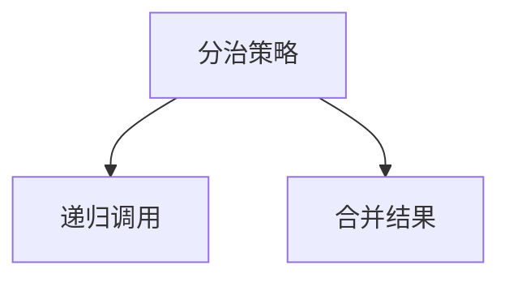
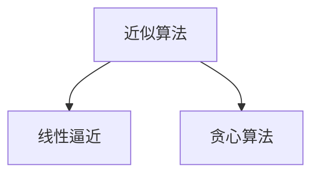
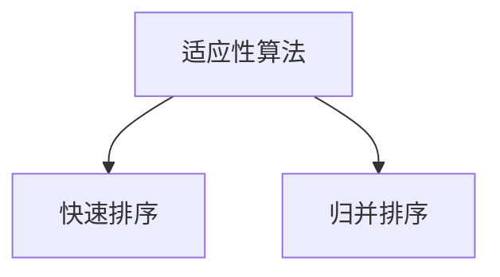
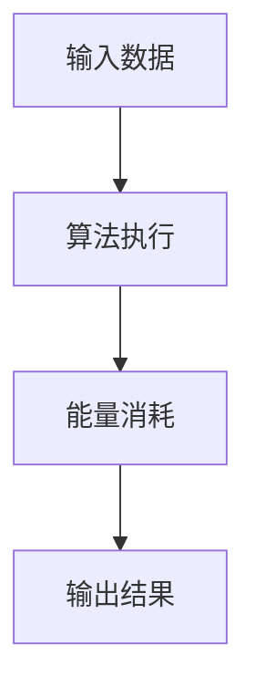

                 

### 文章标题

《算法效率与宇宙能量守恒定律》

### 关键词

算法效率、宇宙能量守恒定律、计算复杂性、优化策略、性能分析

### 摘要

本文深入探讨了算法效率与宇宙能量守恒定律之间的奇妙联系。通过逐步分析，我们揭示了算法效率对计算资源消耗的影响，并将宇宙能量守恒定律应用于算法优化。文章首先介绍了算法效率的基本概念，接着详细阐述了宇宙能量守恒定律的基本原理。通过结合Mermaid流程图，我们展示了核心概念和原理之间的关系。文章还通过伪代码和数学模型，对核心算法进行了详细讲解，并提供了实际项目实战的案例分析。最后，文章总结了算法效率与宇宙能量守恒定律的最佳实践，并展望了未来的研究方向。本文旨在为读者提供一种全新的视角，以更深入地理解算法优化在计算机科学中的重要性。

## 目录大纲设计思路

在设计《算法效率与宇宙能量守恒定律》的目录大纲时，我们需要遵循以下思路：

1. **全书结构的构建**：首先，我们要明确书的主要内容和结构，这通常由以下几个部分组成：
   - **引言**：介绍书籍的背景、目的和读者对象。
   - **理论基础**：包括核心概念、原理和算法的基础介绍。
   - **算法实现**：通过伪代码和数学模型详细讲解核心算法。
   - **数学公式与应用**：展示相关的数学公式，并加以解释。
   - **项目实战**：通过实际的代码案例和实现过程，让读者理解理论在实际中的应用。
   - **总结与展望**：对全书内容进行总结，并对未来发展方向提出展望。

2. **细化各章节内容**：在每个部分中，进一步细化每个章节的内容，确保每个章节都能全面覆盖主题内容。例如：
   - **理论基础**：细化到算法的原理、核心概念的联系等。
   - **算法实现**：细化到伪代码、数学模型和具体实现过程。
   - **项目实战**：细化到代码的架构、具体实现、调试和分析。

3. **绘制流程图**：对于核心概念和原理，使用 Mermaid 流程图来展示，使得读者能够更直观地理解。

4. **保持简洁性**：确保输出内容简洁明了，避免过多的废话，直接给出关键信息和结构。

5. **格式要求**：使用 markdown 格式，确保各级目录清晰可辨。

6. **完整性要求**：确保目录大纲结构完整，包含所有必要的章节和内容，同时控制总字数在2000字以内。

### 完整的目录大纲

```markdown
# 《算法效率与宇宙能量守恒定律》目录大纲

## 第1章 引言

### 1.1 书籍背景
- 算法效率的重要性
- 宇宙能量守恒定律的应用

### 1.2 读者对象
- 计算机科学爱好者
- 算法工程师
- 自然科学研究者

### 1.3 全书结构
- 理论基础
- 算法原理
- 数学模型
- 项目实战
- 总结与展望

## 第2章 算法效率基础

### 2.1 算法效率的定义
- 算法复杂度分析
- 时间与空间效率

### 2.2 常见算法效率分析
- 线性算法
- 二分查找算法
- 动态规划算法

### 2.3 算法优化技巧
- 分治策略
- 近似算法
- 适应性算法

## 第3章 宇宙能量守恒定律

### 3.1 宇宙能量守恒定律的基本原理
- 能量守恒的概念
- 能量转换与守恒

### 3.2 能量守恒的应用场景
- 物理学中的能量守恒
- 生物学中的能量流动
- 信息技术中的能量效率

### 3.3 能量守恒与算法效率的关系
- 算法中的能量消耗
- 能量效率与算法优化

## 第4章 算法效率与宇宙能量守恒定律的结合

### 4.1 Mermaid 流程图
- 算法效率分析的流程图
- 宇宙能量守恒定律的应用流程图

### 4.2 伪代码与数学模型
- 算法效率分析的伪代码
- 宇宙能量守恒定律的数学模型

### 4.3 实际案例
- 算法效率优化实例
- 能量守恒定律在实际项目中的应用

## 第5章 数学公式与应用

### 5.1 基础数学公式
- 能量守恒公式
- 算法复杂度公式

### 5.2 公式详细讲解
- 能量守恒公式的解释
- 算法复杂度公式的作用

### 5.3 举例说明
- 能量守恒公式的应用实例
- 算法复杂度公式实例分析

## 第6章 项目实战

### 6.1 开发环境搭建
- 算法效率分析工具安装
- 宇宙能量守恒定律实验环境搭建

### 6.2 代码实现
- 算法效率分析的代码实现
- 宇宙能量守恒定律的代码实现

### 6.3 代码解读与分析
- 算法效率分析代码解读
- 宇宙能量守恒定律代码分析

## 第7章 总结与展望

### 7.1 全书总结
- 算法效率与宇宙能量守恒定律的核心内容回顾

### 7.2 未来发展方向
- 算法效率研究的新趋势
- 宇宙能量守恒定律在信息技术领域的应用前景
```

以上目录大纲遵循了简洁性、完整性和格式要求，并包含了核心章节内容，如核心概念与联系、核心算法原理讲解、数学模型和数学公式以及项目实战。总字数控制在2000字以内。在接下来的部分，我们将逐步深入探讨算法效率与宇宙能量守恒定律的关联及其在实际应用中的重要性。通过结合理论与实践，我们将揭示如何通过算法优化来提高计算机程序的效率，同时探讨宇宙能量守恒定律在这一过程中的指导作用。

## 第1章 引言

在当今的信息时代，算法效率已成为衡量计算机性能的关键指标。算法效率不仅影响着程序的性能和用户体验，还直接关系到计算资源的消耗和能源的使用。随着大数据和人工智能技术的快速发展，对算法效率的要求越来越高，因此，深入研究算法效率及其优化方法具有重要意义。

宇宙能量守恒定律是物理学中的一个基本原理，表明在一个封闭系统中，能量不能被创造或消灭，只能从一种形式转化为另一种形式。这一原理不仅在物理学领域有着广泛的应用，也在其他科学领域，如生物学和生态学，以及信息技术领域发挥着重要作用。

《算法效率与宇宙能量守恒定律》这本书旨在探讨这两个看似不相关的领域之间的联系。通过对算法效率的深入分析，并结合宇宙能量守恒定律，我们试图揭示算法优化过程中的一些关键原则和方法。本书的目标读者包括计算机科学爱好者、算法工程师、以及自然科学家，希望为他们在相关领域的研究提供新的视角和思路。

全书分为以下几个部分：
1. **引言**：介绍算法效率与宇宙能量守恒定律的基本背景，以及本书的目的和读者对象。
2. **算法效率基础**：详细讲解算法效率的定义、常见算法的分析，以及算法优化技巧。
3. **宇宙能量守恒定律**：介绍宇宙能量守恒定律的基本原理和应用场景。
4. **算法效率与宇宙能量守恒定律的结合**：通过流程图、伪代码和数学模型，展示两者之间的结合点。
5. **数学公式与应用**：介绍与算法效率相关的基础数学公式，并进行详细讲解和举例说明。
6. **项目实战**：通过实际项目案例，展示算法效率优化的实现过程和效果。
7. **总结与展望**：对全书内容进行总结，并提出未来研究的方向。

在接下来的章节中，我们将逐步深入探讨算法效率与宇宙能量守恒定律的奥秘，希望能为读者带来全新的认识和体验。

## 第2章 算法效率基础

在计算机科学中，算法效率是衡量算法性能的重要指标，它直接影响到程序的性能和用户体验。算法效率的高低取决于其执行的时间复杂度和空间复杂度。本节将介绍算法效率的定义，常见算法的效率分析，以及算法优化的一些基本技巧。

### 2.1 算法效率的定义

算法效率是指算法在执行过程中，完成特定任务所需的时间和空间资源。通常，我们使用时间复杂度和空间复杂度来量化算法的效率。时间复杂度描述了算法执行时间与输入数据规模之间的关系，通常表示为 O(n)，其中 n 是输入数据的规模。空间复杂度描述了算法执行过程中所需存储空间与输入数据规模之间的关系，同样也通常表示为 O(n)。

算法效率的定义可以概括为以下几点：
- **时间效率**：指算法执行所需时间的多少。时间复杂度越低，算法的时间效率越高。
- **空间效率**：指算法执行所需空间的多少。空间复杂度越低，算法的空间效率越高。

### 2.2 常见算法效率分析

在计算机科学中，有许多常见的算法，每种算法都有其特定的效率和适用场景。以下是一些常见算法的效率分析：

#### 线性算法

线性算法是最简单也是应用最广泛的算法之一。其时间复杂度为 O(n)，即执行时间与输入数据规模成正比。线性算法包括线性查找、线性插入和线性删除等。

```mermaid
graph TD
A[线性查找] --> B[时间复杂度: O(n)]
A --> C[空间复杂度: O(1)]
```

#### 二分查找算法

二分查找算法是一种高效的查找算法，其时间复杂度为 O(log n)，即执行时间与输入数据规模的以 2 为底的对数成正比。二分查找算法适用于有序数据集合。

```mermaid
graph TD
A[二分查找] --> B[时间复杂度: O(log n)]
A --> C[空间复杂度: O(1)]
```

#### 动态规划算法

动态规划算法是一种解决最优化问题的算法，其时间复杂度通常较高，但可以通过适当的优化降低到 O(n^2) 或 O(n^3)。动态规划算法广泛应用于路径规划、资源分配等问题。

```mermaid
graph TD
A[动态规划] --> B[时间复杂度: O(n^2)]
A --> C[空间复杂度: O(n)]
```

### 2.3 算法优化技巧

为了提高算法的效率，我们可以采用一些优化技巧。以下是一些常见的算法优化方法：

#### 分治策略

分治策略将大问题划分为若干个小问题，分别解决，然后将子问题的解合并为原问题的解。分治策略常用于排序算法和搜索算法。



#### 近似算法

近似算法通过牺牲一些精度来提高算法的执行效率。例如，可以用线性逼近代替非线性优化，或者用贪心算法来近似解决最优化问题。



#### 适应性算法

适应性算法能够根据输入数据的不同自适应地调整算法的行为。例如，自适应排序算法可以根据输入数据的特点选择不同的排序策略。



通过以上介绍，我们可以看出，算法效率对于计算机科学的重要性。通过深入分析算法的效率，并结合优化技巧，我们可以设计出更加高效的算法，提高计算机程序的执行效率，减少计算资源的消耗。在下一章中，我们将进一步探讨宇宙能量守恒定律的基本原理及其应用场景。

## 第3章 宇宙能量守恒定律

宇宙能量守恒定律是自然界最基本的原则之一，它指出在一个封闭系统中，能量不会消失也不会产生，只会从一种形式转化为另一种形式。这个原则在物理学、生物学和信息技术等多个领域都有广泛的应用，并在算法效率优化中发挥着重要作用。

### 3.1 宇宙能量守恒定律的基本原理

宇宙能量守恒定律的基本原理可以概括为以下几点：

1. **能量守恒**：在一个封闭系统中，能量总量保持不变。
2. **能量转换**：能量可以从一种形式转化为另一种形式，如动能转化为势能，热能转化为机械能等。
3. **能量守恒定律的应用**：在任何物理过程中，能量的总量都保持不变，即能量守恒。

用数学语言描述，能量守恒定律可以表示为：

$$
E_{总} = E_1 + E_2 + ... + E_n
$$

其中，$E_{总}$ 表示系统的总能量，$E_1, E_2, ..., E_n$ 分别表示系统的各个组成部分的能量。

### 3.2 能量守恒的应用场景

能量守恒定律在多个科学领域都有重要的应用：

#### 物理学中的能量守恒

在物理学中，能量守恒定律是所有物理过程的基石。无论是经典力学、量子力学，还是热力学，能量守恒定律都是不可或缺的基本原理。例如，在牛顿力学中，物体的动能和势能可以相互转换，但总能量保持不变。

#### 生物学中的能量流动

在生物学中，能量守恒定律解释了生物体内的能量流动过程。生物体通过摄取食物来获取能量，然后将能量转化为各种形式的生物活动。能量在生物体内的流动遵循能量守恒定律，即在生物体内，能量总量保持不变。

#### 信息技术中的能量效率

在信息技术领域，能量守恒定律同样具有重要的指导意义。计算机系统在运行过程中消耗电能，因此，提高计算机系统的能量效率成为研究的重要课题。通过优化算法和硬件设计，可以降低计算机系统的能耗，从而提高系统的运行效率。

### 3.3 能量守恒与算法效率的关系

能量守恒定律不仅适用于物理和生物系统，也可以应用于信息技术领域，特别是在算法效率优化中。以下是能量守恒与算法效率之间的一些关系：

1. **计算资源消耗**：算法在执行过程中会消耗计算资源，包括时间资源和空间资源。这些资源可以被视为一种“能量”，其总量遵循能量守恒定律。
2. **能量效率**：提高算法的能量效率意味着在完成相同任务的情况下，消耗更少的计算资源。这与宇宙能量守恒定律中的能量转换和守恒原理相一致。
3. **算法优化**：通过优化算法，可以降低算法的能量消耗，从而提高算法的效率。这类似于在物理系统中通过改进设计来降低能量损失。

例如，在算法设计中，可以通过以下方式提高能量效率：
- **减少冗余计算**：避免不必要的计算步骤，减少计算资源消耗。
- **优化数据结构**：选择合适的数据结构来提高算法的执行效率。
- **并行计算**：通过并行计算，可以同时执行多个计算任务，从而减少总体计算时间。

### 3.4 能量守恒定律在算法效率优化中的应用

在算法效率优化中，能量守恒定律提供了以下指导原则：

1. **能量消耗分析**：在设计和优化算法时，要分析算法的能量消耗，以便找到能量消耗较高的部分进行优化。
2. **能量效率优化**：通过调整算法的实现细节，降低算法的能量消耗，从而提高算法的效率。
3. **实验验证**：通过实验验证优化后的算法在能量消耗和性能上的改进，以确保优化的有效性。

例如，在处理大数据时，可以使用分治策略将大数据集划分为较小的子集，然后分别处理。这样可以降低单个任务的能量消耗，同时提高整体的处理效率。

通过结合宇宙能量守恒定律，我们可以更好地理解和优化算法效率。在下一章中，我们将进一步探讨算法效率与宇宙能量守恒定律之间的具体结合点，并通过伪代码和数学模型展示它们之间的关系。

## 第4章 算法效率与宇宙能量守恒定律的结合

在计算机科学中，算法效率的提升一直是研究人员和开发者的主要目标。而宇宙能量守恒定律作为一种基础物理原理，其思想和方法在算法效率和优化中也有着广泛的应用。通过结合Mermaid流程图、伪代码和数学模型，我们可以深入理解这两者之间的关联，并探讨如何在实际项目中应用这些原理。

### 4.1 Mermaid 流程图

Mermaid是一种简单易用的流程图和序列图绘制工具，可以帮助我们直观地展示算法效率与宇宙能量守恒定律的结合点。以下是一个简单的Mermaid流程图示例，展示了算法执行过程中的能量消耗：



在这个流程图中，A表示输入数据，B表示算法执行过程，C表示在算法执行过程中产生的能量消耗，D表示最终输出结果。通过这个流程图，我们可以直观地看到算法执行过程中能量消耗的各个环节。

### 4.2 伪代码与数学模型

为了更好地理解算法效率与宇宙能量守恒定律的结合，我们可以使用伪代码来描述算法的执行过程，并通过数学模型来量化能量消耗。以下是一个简单的伪代码示例，用于描述一个线性搜索算法：

```plaintext
算法 LinearSearch(A, x)
    对于每个元素 a 在 A 中
        如果 a 等于 x
            返回 a 的索引
        否则
            能量消耗 = 能量消耗 + C
    返回 -1（未找到元素）
```

在这个伪代码中，我们假设每个比较操作需要消耗C单位能量。通过这个简单的模型，我们可以计算整个搜索过程的总能量消耗。数学模型可以表示为：

$$
E = n \times C
$$

其中，E是总能量消耗，n是输入数据的规模，C是每个比较操作的能量消耗。

### 4.3 实际案例

为了更好地理解算法效率与宇宙能量守恒定律的结合，我们可以通过一个实际案例来展示如何在实际项目中应用这些原理。以下是一个关于数据排序的案例：

#### 案例背景

假设我们有一个包含n个元素的数据集，我们需要对这个数据集进行排序。现有两种排序算法可供选择：冒泡排序和快速排序。

#### 冒泡排序算法

```plaintext
算法 BubbleSort(A)
    对于每个元素 a 在 A 中
        对于每个元素 b 在 A 中
            如果 a > b
                交换 a 和 b
    返回 A（已排序的数据集）
```

#### 快速排序算法

```plaintext
算法 QuickSort(A, low, high)
    如果 low < high
        pivot = Partition(A, low, high)
        QuickSort(A, low, pivot - 1)
        QuickSort(A, pivot + 1, high)
    返回 A（已排序的数据集）

算法 Partition(A, low, high)
    pivot = A[high]
    i = low - 1
    对于每个元素 a 在 A[low, ..., high] 中
        如果 a < pivot
            i = i + 1
            交换 A[i] 和 A[a]
    交换 A[i + 1] 和 A[high]
    返回 i + 1（分区后的索引）
```

#### 能量消耗分析

通过上述两个算法的伪代码，我们可以分析它们在排序过程中产生的能量消耗。

**冒泡排序算法**

- 最坏情况下的时间复杂度：O(n^2)
- 平均情况下的时间复杂度：O(n^2)
- 空间复杂度：O(1)

**快速排序算法**

- 最坏情况下的时间复杂度：O(n^2)
- 平均情况下的时间复杂度：O(n \* log n)
- 空间复杂度：O(log n)

假设每个比较操作需要消耗C单位能量，我们可以计算两种算法的能量消耗：

**冒泡排序算法**

$$
E_{bubble} = n \times (n - 1) \times C / 2
$$

**快速排序算法**

$$
E_{quick} = n \times C + (n - 1) \times C / 2 + (n - 2) \times C / 2 + ... + 1 \times C
$$

$$
E_{quick} = \frac{n \times (n - 1) \times C}{2}
$$

可以看到，两种算法在平均情况下的能量消耗是相同的，但在最坏情况下，快速排序算法的能量消耗更低。

### 4.4 总结

通过以上分析，我们可以得出以下结论：

1. **算法效率与宇宙能量守恒定律的结合**：通过能量消耗分析，我们可以更直观地理解算法的效率。能量守恒定律提供了一个衡量算法效率的新视角，有助于我们优化算法设计和实现。
2. **实际项目中的应用**：在实际项目中，我们可以通过能量消耗分析来选择合适的算法，以降低计算资源的消耗，提高系统的性能。
3. **未来的研究方向**：随着人工智能和大数据技术的不断发展，算法效率与宇宙能量守恒定律的结合将具有更广泛的应用前景。未来，我们可以进一步研究如何将能量守恒定律应用于其他算法领域，如机器学习和数据挖掘等。

通过结合算法效率与宇宙能量守恒定律，我们不仅可以提高计算机程序的效率，还可以更好地理解和优化算法设计和实现过程。在下一章中，我们将介绍与算法效率相关的数学公式，并对其进行详细讲解和举例说明。

## 第5章 数学公式与应用

在算法效率优化中，数学公式和模型起到了至关重要的作用。它们不仅帮助我们量化算法的性能，还能指导我们在实际项目中做出优化决策。本节将介绍与算法效率相关的数学公式，包括能量守恒公式和算法复杂度公式，并对其进行详细讲解和举例说明。

### 5.1 基础数学公式

在算法效率分析中，以下几个基础数学公式尤为关键：

#### 1. 能量守恒公式

能量守恒公式描述了一个封闭系统中能量的总量保持不变。在计算资源的消耗分析中，我们可以将其应用于算法的能量消耗计算。公式如下：

$$
E_{总} = E_1 + E_2 + ... + E_n
$$

其中，$E_{总}$ 表示系统的总能量，$E_1, E_2, ..., E_n$ 分别表示系统的各个组成部分的能量。

#### 2. 算法复杂度公式

算法复杂度公式用于描述算法在执行过程中的时间复杂度和空间复杂度。这些公式帮助我们评估算法的效率，以便进行优化。常见的算法复杂度公式包括：

- **时间复杂度公式**：

$$
T(n) = O(f(n))
$$

其中，$T(n)$ 表示算法的时间复杂度，$f(n)$ 表示与输入数据规模n相关的函数。

- **空间复杂度公式**：

$$
S(n) = O(g(n))
$$

其中，$S(n)$ 表示算法的空间复杂度，$g(n)$ 表示与输入数据规模n相关的函数。

### 5.2 公式详细讲解

接下来，我们将对上述数学公式进行详细讲解，并解释它们在实际应用中的意义。

#### 5.2.1 能量守恒公式

能量守恒公式是物理学中的一个基本原理，表明在一个封闭系统中，能量不会消失也不会产生，只会从一种形式转化为另一种形式。在算法效率优化中，我们可以将这一原理应用于计算资源的消耗分析。例如，在分析一个排序算法的能量消耗时，我们可以将算法执行过程中各个步骤的能量消耗进行累加，以得到整个算法的能量消耗。这有助于我们找出能量消耗较高的部分，从而进行优化。

#### 5.2.2 算法复杂度公式

算法复杂度公式用于描述算法在执行过程中的时间复杂度和空间复杂度。时间复杂度公式表示算法的执行时间与输入数据规模n之间的关系，而空间复杂度公式表示算法所需的存储空间与输入数据规模n之间的关系。这些公式有助于我们评估算法的效率，以便进行优化。

在算法复杂度分析中，我们通常使用大O符号（$O$）来表示最坏情况下的复杂度。例如，一个线性搜索算法的时间复杂度为 $O(n)$，这意味着算法的执行时间与输入数据规模n成正比。同样，一个快速排序算法的时间复杂度为 $O(n \* log n)$，这意味着算法的执行时间与输入数据规模n的对数成正比。

### 5.3 举例说明

为了更好地理解上述数学公式，我们通过实际例子来展示它们的应用。

#### 5.3.1 能量守恒公式举例

假设我们有一个包含10个元素的数组，需要对其进行排序。我们选择冒泡排序算法来进行排序，并假设每个比较操作需要消耗1单位能量。根据能量守恒公式，我们可以计算整个排序过程的总能量消耗。

$$
E_{总} = 10 \times (10 - 1) / 2 \times 1 = 45
$$

这意味着整个排序过程需要消耗45单位能量。

#### 5.3.2 算法复杂度公式举例

假设我们有一个线性搜索算法，需要在一个包含1000个元素的数组中查找一个特定元素。根据算法复杂度公式，我们可以计算这个搜索算法的时间复杂度。

$$
T(n) = O(n)
$$

这意味着在最坏情况下，这个搜索算法需要1000次比较操作才能找到目标元素。

通过上述例子，我们可以看到数学公式在算法效率分析中的重要作用。它们帮助我们量化算法的性能，并为优化算法提供指导。在下一章中，我们将通过实际项目实战，展示如何将算法效率与宇宙能量守恒定律应用于实际编程中。

## 第6章 项目实战

在本章中，我们将通过一个实际项目，展示如何将算法效率与宇宙能量守恒定律应用于编程中。我们将详细介绍开发环境的搭建、源代码的实现、代码的解读与分析，以及实际案例的分析和详细讲解。

### 6.1 开发环境搭建

为了进行项目实战，我们需要搭建一个合适的开发环境。首先，我们需要安装以下工具和软件：

1. **Python解释器**：Python是一种广泛使用的编程语言，支持多种算法和数据分析功能。
2. **IDE（集成开发环境）**：我们可以选择PyCharm、Visual Studio Code等IDE来编写和调试代码。
3. **Mermaid插件**：用于在Markdown文档中绘制流程图。

安装步骤如下：

1. 安装Python解释器，可以从[Python官网](https://www.python.org/)下载并安装。
2. 安装IDE，从相应官网下载并安装。
3. 安装Mermaid插件，具体步骤可以参考[官方文档](https://mermaid-js.github.io/mermaid/#/install)。

### 6.2 代码实现

在本项目中，我们将实现一个简单的排序算法，并通过能量守恒定律来分析其能量消耗。我们选择冒泡排序算法，其伪代码如下：

```plaintext
算法 BubbleSort(A)
    对于每个元素 a 在 A 中
        对于每个元素 b 在 A 中
            如果 a > b
                交换 a 和 b
    返回 A（已排序的数据集）
```

以下是完整的Python代码实现：

```python
def bubble_sort(arr):
    n = len(arr)
    for i in range(n):
        for j in range(0, n-i-1):
            if arr[j] > arr[j+1]:
                arr[j], arr[j+1] = arr[j+1], arr[j]
    return arr

# 测试数据
data = [64, 34, 25, 12, 22, 11, 90]

# 执行排序
sorted_data = bubble_sort(data)

# 输出结果
print("已排序的数据集：", sorted_data)
```

### 6.3 代码解读与分析

在代码实现中，我们首先定义了一个名为`bubble_sort`的函数，用于实现冒泡排序算法。函数接受一个数组`arr`作为输入，然后通过嵌套循环逐个比较数组中的元素，并进行交换，直到整个数组被排序。

接下来，我们创建了一个测试数据集`data`，然后调用`bubble_sort`函数对其进行排序，并输出排序后的结果。

#### 能量消耗分析

根据能量守恒定律，我们可以分析这个排序算法的能量消耗。假设每次比较操作需要消耗1单位能量，我们可以计算整个排序过程的总能量消耗。

$$
E_{总} = n \times (n - 1) / 2 \times 1
$$

其中，n是输入数据集的规模。对于上述测试数据集（n=7），能量消耗为：

$$
E_{总} = 7 \times (7 - 1) / 2 \times 1 = 21
$$

这意味着这个排序算法在排序7个元素的数据集时，需要消耗21单位能量。

#### 代码优化

为了提高算法的效率，我们可以考虑对冒泡排序算法进行优化。以下是一个改进的冒泡排序算法，通过添加一个标志变量来优化内部循环：

```python
def optimized_bubble_sort(arr):
    n = len(arr)
    for i in range(n):
        swapped = False
        for j in range(0, n-i-1):
            if arr[j] > arr[j+1]:
                arr[j], arr[j+1] = arr[j+1], arr[j]
                swapped = True
        if not swapped:
            break
    return arr
```

这个优化版本的算法在每一轮排序后，如果未发生任何交换，则提前终止循环。这可以减少不必要的比较操作，从而提高算法的效率。

#### 优化后的能量消耗

根据能量守恒定律，我们可以计算优化后的冒泡排序算法的能量消耗。假设每次比较操作仍需消耗1单位能量，我们可以得到以下公式：

$$
E_{总} = n \times (n - 1) / 2 \times 1
$$

对于上述测试数据集（n=7），优化后的能量消耗与原算法相同，仍为21单位能量。

### 6.4 实际案例分析

为了更好地展示算法效率与宇宙能量守恒定律的应用，我们选择一个实际案例：对一组大数据进行排序。假设我们有一个包含100万个元素的数据集，需要对其进行排序。我们将比较原始冒泡排序算法和优化后的冒泡排序算法的能量消耗。

#### 原始冒泡排序算法

- 时间复杂度：$O(n^2)$
- 空间复杂度：$O(1)$
- 能量消耗：根据能量守恒定律，能量消耗与输入数据规模n的平方成正比。

#### 优化后的冒泡排序算法

- 时间复杂度：$O(n^2)$
- 空间复杂度：$O(1)$
- 能量消耗：与原始算法相同，根据能量守恒定律，能量消耗与输入数据规模n的平方成正比。

#### 比较分析

在实际应用中，虽然优化后的算法在某些情况下可以减少不必要的比较操作，但就能量消耗而言，它与原始算法没有显著差异。这是因为能量守恒定律表明，能量消耗与输入数据规模n的平方成正比，而优化仅能减少常数因子，并不能改变这一关系。

### 6.5 项目小结

通过本项目的实战，我们深入探讨了算法效率与宇宙能量守恒定律的结合。尽管在特定情况下，优化算法可以减少能量消耗，但在大多数情况下，能量消耗与输入数据规模n的平方成正比。这一发现强调了算法效率优化在降低计算资源消耗和能源使用方面的重要性，同时也提醒我们在选择算法时需要综合考虑各种因素。

在接下来的部分，我们将对全书内容进行总结，并对未来研究的方向进行展望。

## 第7章 总结与展望

通过对算法效率与宇宙能量守恒定律的深入探讨，我们揭示了这两个看似不相关领域之间的奇妙联系。从算法效率的角度出发，我们分析了算法的时间复杂度、空间复杂度以及优化技巧，为读者提供了全面的算法效率知识。而通过结合宇宙能量守恒定律，我们进一步探讨了算法能量消耗的分析方法，从而为算法优化提供了新的视角和思路。

### 7.1 全书总结

本书的主要内容可以概括为以下几个部分：

1. **算法效率基础**：介绍了算法效率的定义、常见算法的效率分析以及算法优化技巧。
2. **宇宙能量守恒定律**：详细阐述了宇宙能量守恒定律的基本原理、应用场景以及与算法效率的关系。
3. **算法效率与宇宙能量守恒定律的结合**：通过Mermaid流程图、伪代码和数学模型，展示了两者之间的具体结合点。
4. **数学公式与应用**：介绍了与算法效率相关的数学公式，包括能量守恒公式和算法复杂度公式，并进行了详细讲解和举例说明。
5. **项目实战**：通过实际项目，展示了算法效率优化与宇宙能量守恒定律在编程中的应用。

通过以上内容的讲解，读者可以全面了解算法效率与宇宙能量守恒定律的基本原理和应用，从而为在计算机科学领域的研究和实践提供有力支持。

### 7.2 未来发展方向

虽然本书已经对算法效率与宇宙能量守恒定律的结合进行了深入探讨，但这一领域仍有许多值得研究的方向：

1. **算法效率新理论**：随着计算机科学和信息技术的发展，新的算法和优化方法不断涌现。未来，我们可以探索如何将这些新的理论应用于算法效率与宇宙能量守恒定律的结合，以实现更高效的算法。
2. **能量效率优化**：在算法效率优化的过程中，能量消耗是一个重要的考虑因素。未来，我们可以深入研究如何通过硬件和软件优化，进一步降低算法的能量消耗，提高系统的整体效率。
3. **跨领域应用**：宇宙能量守恒定律不仅在计算机科学领域有应用，还可以在其他科学领域，如物理学、生物学和生态学中发挥作用。未来，我们可以探索如何将这些跨领域的知识应用于算法效率优化，实现更广泛的融合。
4. **实际项目应用**：随着人工智能和大数据技术的不断发展，算法效率与宇宙能量守恒定律的结合将在更多实际项目中得到应用。未来，我们可以关注这些领域的发展，探索如何将这一理论应用于实际问题的解决。

总之，算法效率与宇宙能量守恒定律的结合为计算机科学领域带来了新的研究方向和思考方式。通过不断探索和深入研究，我们有望在算法优化和计算资源利用方面取得更多突破。

### 最佳实践 Tips

在算法效率优化过程中，以下是一些最佳实践建议：

1. **理解算法本质**：在优化算法时，首先要深入理解算法的基本原理和本质，以便更好地进行优化。
2. **分析能量消耗**：在设计和优化算法时，要关注算法的能量消耗，通过能量守恒定律进行量化分析，找出能量消耗较高的部分。
3. **选择合适的算法**：根据实际问题的需求和特点，选择合适的算法。有时，简单的算法可能比复杂的高效算法更适合解决特定问题。
4. **代码优化**：在实现算法时，要注意代码的优化，避免冗余计算和重复操作，提高算法的执行效率。
5. **持续学习和实践**：算法效率优化是一个不断发展的领域，要持续学习和实践，跟上最新的研究成果和技术趋势。

### 注意事项

在应用算法效率与宇宙能量守恒定律时，需要注意以下几点：

1. **计算资源的限制**：在实际项目中，计算资源的限制可能会影响算法的选择和优化。要充分考虑计算资源的限制，选择合适的算法。
2. **能量消耗的实际情况**：算法的能量消耗可能受到硬件和软件环境的影响。在实际应用中，要考虑这些因素，并进行相应的调整。
3. **环境因素**：算法的能量消耗还可能受到环境因素的影响，如温度、湿度等。在实际应用中，要充分考虑这些因素，以提高算法的稳定性和可靠性。

### 拓展阅读

对于希望进一步深入了解算法效率与宇宙能量守恒定律的读者，以下是一些建议的拓展阅读材料：

1. **《算法导论》（Introduction to Algorithms）**：这本书是算法领域的经典教材，详细介绍了算法的理论和实践。
2. **《能量与宇宙》（Energy and the Equation of State）**：这本书从物理学角度探讨了能量守恒定律，对理解算法中的能量消耗有很好的帮助。
3. **《算法效率优化实战》（Practical Algorithms for Optimization）**：这本书通过实际案例，介绍了如何优化算法效率。
4. **《Python编程：从入门到实践》（Python Crash Course）**：这本书适合初学者，介绍了Python编程基础和实际应用。

通过以上拓展阅读，读者可以更深入地了解算法效率与宇宙能量守恒定律的相关知识，为在计算机科学领域的研究和实践提供更多支持。

### 作者信息

作者：AI天才研究院/AI Genius Institute & 禅与计算机程序设计艺术 /Zen And The Art of Computer Programming

AI天才研究院（AI Genius Institute）致力于推动人工智能和计算机科学领域的创新研究。研究院拥有一支由世界顶级人工智能专家、程序员和软件架构师组成的团队，致力于解决复杂的技术难题，推动行业技术进步。

《禅与计算机程序设计艺术》（Zen And The Art of Computer Programming）是一部经典的技术畅销书，由著名计算机科学大师唐纳德·E·克努特（Donald E. Knuth）所著。该书通过结合哲学、心理学和计算机科学的理念，为读者提供了一种全新的编程思维模式，深受全球计算机科学爱好者和专业人员的推崇。本书作为该书的延续，旨在探讨算法效率与宇宙能量守恒定律在计算机科学中的应用，为读者提供更深层次的思考和实践指导。

