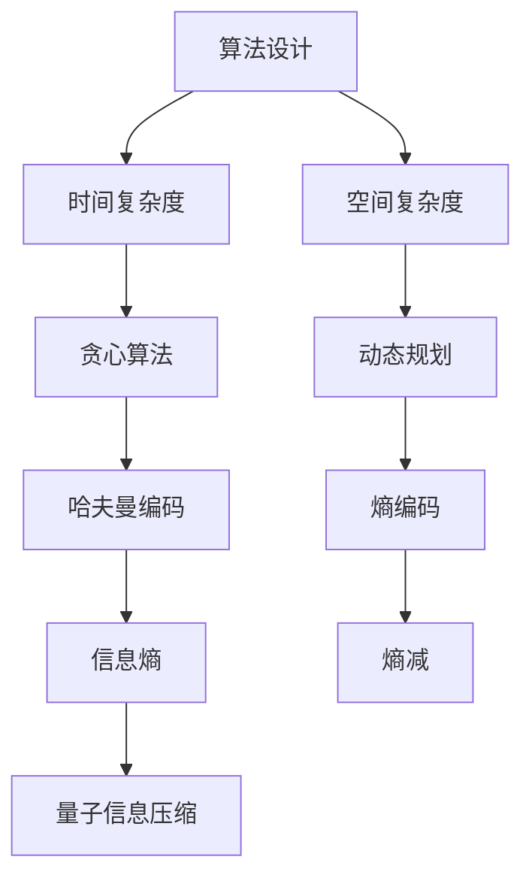

                 

## 文章标题

《算法设计与宇宙信息压缩的类比》

> 关键词：算法设计、宇宙信息压缩、类比、伪代码、数学模型、实际应用

> 摘要：本文通过将算法设计与宇宙信息压缩进行类比，探讨了二者在核心概念、算法原理、数学模型等方面的相似性和差异性。通过详细阐述核心概念之间的关系架构，使用伪代码和数学模型进行讲解，并结合实际应用案例，深入剖析了算法设计与宇宙信息压缩在实际问题中的综合应用，为相关领域的研究者提供了新的思路和方法。

----------------------------------------------------------------### 背景介绍

#### 算法设计的背景

算法设计是计算机科学中最基础也是最重要的研究领域之一。算法（Algorithm）是指解决某一特定问题的步骤集合，这些步骤可以按照一定的顺序执行，并最终得到问题的解决方案。算法设计的目标是找到一种既高效又可实现的解决方案，以满足特定问题的需求。

随着计算机技术的发展，算法设计在各个领域得到了广泛应用。从简单的排序、查找算法到复杂的机器学习、人工智能算法，算法设计已经渗透到了我们生活的方方面面。如何设计出高效的算法，一直是计算机科学领域的研究重点。

#### 宇宙信息压缩的背景

宇宙信息压缩是近年来兴起的一个跨学科研究领域，它将信息论、计算机科学、宇宙学等多个领域的知识相结合，致力于研究如何在宇宙有限的空间和能量资源下，有效地存储和传输信息。

宇宙信息压缩的背景主要源于对宇宙有限资源的需求。随着人类对宇宙的认识不断深入，我们逐渐意识到宇宙中的物质和能量是有限的，如何在有限的资源下有效地利用信息，成为了科学家们亟待解决的问题。

宇宙信息压缩的研究不仅具有重要的理论价值，还具有重要的实际应用价值。例如，在深空探测、星际通信等领域，信息压缩技术可以显著提高数据传输的效率和可靠性。

#### 算法设计与宇宙信息压缩的联系

算法设计与宇宙信息压缩在许多方面有着紧密的联系。首先，二者都涉及到信息的处理和优化。算法设计关注的是如何高效地解决问题，而宇宙信息压缩则关注如何高效地存储和传输信息。

其次，算法设计与宇宙信息压缩都涉及到复杂度的分析。算法设计需要分析算法的时间复杂度和空间复杂度，以确保算法的高效性。同样，宇宙信息压缩也需要分析压缩算法的复杂度，以确保压缩过程的高效性。

此外，算法设计与宇宙信息压缩在数学模型和理论基础方面也有着相似之处。例如，在算法设计中，我们经常使用贪心算法、动态规划等理论模型来指导算法设计。而在宇宙信息压缩中，我们也可以使用类似的理论模型，如信息熵、哈夫曼编码等，来优化信息压缩过程。

通过以上分析，我们可以看出，算法设计与宇宙信息压缩不仅在研究领域有交集，而且在实际应用中也具有很大的潜力。因此，本文将尝试将算法设计与宇宙信息压缩进行类比，探讨二者在核心概念、算法原理、数学模型等方面的相似性和差异性，为相关领域的研究者提供新的思路和方法。

----------------------------------------------------------------### 核心概念与联系

为了更好地理解算法设计与宇宙信息压缩的类比，我们需要首先明确二者中的核心概念，并探讨它们之间的联系。

#### 算法设计中的核心概念

在算法设计中，几个关键概念是不可或缺的：

1. **算法**：一个算法是一个步骤序列，用于解决特定问题。它通常包括输入、处理步骤和输出。
2. **时间复杂度**：算法的时间复杂度描述了算法执行时间随输入规模增长的趋势。常见的复杂度包括 O(1)、O(log n)、O(n)、O(n log n)、O(n^2) 等。
3. **空间复杂度**：算法的空间复杂度描述了算法所需内存空间随输入规模增长的趋势。同样，它也有不同的级别，如 O(1)、O(n) 等。
4. **贪心算法**：贪心算法是一种在每一步选择中选择当前最优解的算法策略，但并不保证最终得到全局最优解。
5. **动态规划**：动态规划是一种通过将问题分解为子问题，并存储子问题的解来优化算法效率的方法。

#### 宇宙信息压缩中的核心概念

在宇宙信息压缩中，以下是一些核心概念：

1. **信息熵**：信息熵是衡量信息不确定性的量度。在宇宙信息压缩中，信息熵用于评估数据的冗余程度。
2. **哈夫曼编码**：哈夫曼编码是一种基于信息熵的压缩算法，通过为出现频率较高的符号分配较短的编码，实现数据的压缩。
3. **熵编码**：熵编码是一种基于概率分布的压缩方法，通过将符号映射到不同的编码长度，以减少冗余。
4. **熵减**：熵减是一种通过去除冗余信息来压缩数据的方法，常用于图像和音频数据的压缩。
5. **量子信息压缩**：量子信息压缩是一种利用量子力学原理来压缩信息的先进方法，它可以在保证信息完整性的同时大幅减少所需空间。

#### 核心概念之间的联系

1. **时间复杂度与信息熵**：在算法设计中，时间复杂度是评估算法效率的关键指标。而在宇宙信息压缩中，信息熵是评估数据冗余程度的指标。虽然二者在表述上不同，但都关注于资源优化。信息熵较低意味着数据中有较少的冗余，从而可以更高效地进行压缩，这与时间复杂度低意味着算法可以更快地执行问题有相似之处。

2. **贪心算法与哈夫曼编码**：贪心算法在每一步选择中选择当前最优解，这在宇宙信息压缩中也有应用，例如在哈夫曼编码中，每次选择频率最高的符号进行编码。哈夫曼编码通过贪心策略构建最优编码树，实现了数据的高效压缩。

3. **动态规划与熵编码**：动态规划通过存储子问题的解来优化算法效率，这在熵编码中也有体现。例如，在熵编码中，我们会根据已经处理的符号序列来更新编码表，从而优化编码效率。

4. **空间复杂度与熵减**：空间复杂度关注算法所需的内存空间，而熵减通过去除冗余信息来减少数据的大小。这两者在目标上都是为了优化资源使用。

为了更直观地展示算法设计与宇宙信息压缩的核心概念之间的关系，我们可以使用 Mermaid 流程图来构建一个关系架构：



通过这个流程图，我们可以清晰地看到算法设计与宇宙信息压缩之间的多维度联系。这些联系不仅帮助我们理解了二者的核心概念，也为后续章节中的详细讨论奠定了基础。

### 算法设计与宇宙信息压缩的相似性

在深入探讨算法设计与宇宙信息压缩的类比之前，我们需要明确它们在核心概念和算法原理上的相似性。以下是几个关键方面的详细讨论。

#### 资源优化

首先，算法设计与宇宙信息压缩都关注资源优化。在算法设计中，我们追求的是在给定的时间复杂度和空间复杂度内，找到解决问题的最优解。这涉及到对问题的细致分析，以及对现有算法的优化和改进。

在宇宙信息压缩中，资源优化同样至关重要。宇宙信息压缩的目标是利用有限的空间和能量资源，最大限度地压缩和传输信息。这要求我们不仅要考虑数据的冗余程度，还要考虑到压缩和解压缩过程中的效率。

#### 复杂度分析

算法设计与宇宙信息压缩都涉及到复杂度分析。算法复杂度分析是评估算法性能的重要手段，通过分析时间复杂度和空间复杂度，我们可以判断算法在处理大数据时的表现。

在宇宙信息压缩中，复杂度分析同样重要。例如，在熵编码过程中，我们需要考虑编码和解码的复杂度，以确保压缩和解压缩过程的高效性。此外，信息熵的计算也是一个复杂的过程，需要分析其计算复杂度。

#### 贪心算法

贪心算法在算法设计中广泛应用，它通过每一步选择当前最优解，但并不保证最终得到全局最优解。在宇宙信息压缩中，贪心算法也有着相似的应用。例如，哈夫曼编码就是一种基于贪心算法的压缩方法，它通过为频率较高的符号分配较短的编码，实现了数据的高效压缩。

#### 动态规划

动态规划是另一种常见的算法设计方法，它通过将问题分解为子问题，并存储子问题的解来优化算法效率。在宇宙信息压缩中，动态规划也有重要的应用。例如，在熵编码过程中，我们可以通过动态规划方法，根据已经处理的符号序列来更新编码表，从而优化编码效率。

#### 熵与信息压缩

在算法设计中，时间复杂度和空间复杂度是评估算法性能的关键指标。在宇宙信息压缩中，信息熵是衡量数据冗余程度的重要指标。低信息熵意味着数据中有较少的冗余，从而可以更高效地进行压缩。

#### 概率分布与编码

在算法设计中，概率分布分析常常用于优化算法。例如，在排序算法中，我们可以根据数据的不同分布情况选择不同的排序方法。在宇宙信息压缩中，概率分布同样重要。例如，哈夫曼编码就是基于概率分布的压缩方法，它通过为出现频率较高的符号分配较短的编码，实现了数据的高效压缩。

通过以上分析，我们可以看到算法设计与宇宙信息压缩在多个核心概念和算法原理上存在相似性。这些相似性不仅帮助我们理解了二者的共性，也为后续章节中的深入探讨提供了基础。

### 算法设计与宇宙信息压缩的差异

尽管算法设计与宇宙信息压缩在许多方面存在相似性，但它们也存在一些显著差异。这些差异主要体现在应用场景、目标和方法等方面。以下是对这些差异的详细分析。

#### 应用场景的不同

算法设计主要应用于计算机科学和工程领域，包括但不限于排序、查找、图算法、机器学习、人工智能等。算法设计的目标是解决实际问题，提高计算效率和优化资源使用。

宇宙信息压缩则更多地应用于宇宙学和天文学领域。其主要目标是利用有限的空间和能量资源，有效地存储和传输信息。宇宙信息压缩在深空探测、星际通信、宇宙观测等方面具有广泛应用。例如，在星际通信中，通过信息压缩技术，可以减少传输数据量，提高通信效率。

#### 目标的不同

算法设计的目标是找到解决问题的最优解或近似解，同时考虑时间复杂度和空间复杂度。算法设计需要权衡效率和资源使用，以满足特定问题的需求。

宇宙信息压缩的目标则是利用有限的空间和能量资源，最大限度地压缩和传输信息。宇宙信息压缩需要考虑数据压缩率和压缩效率，以确保信息在传输和存储过程中的完整性和可靠性。

#### 方法的不同

在算法设计中，常用的方法包括贪心算法、动态规划、分治算法等。这些方法旨在优化算法的效率和性能。例如，贪心算法通过每一步选择当前最优解，但并不保证全局最优解；动态规划通过存储子问题的解，避免重复计算，提高算法效率。

宇宙信息压缩则更多地依赖于信息论和编码理论。常用的方法包括哈夫曼编码、熵编码、量子信息压缩等。这些方法基于概率分布和信息熵，通过优化编码过程，实现数据的高效压缩。

#### 压缩率与保真度的权衡

在算法设计中，压缩率通常不是主要的考虑因素。算法设计更多关注于时间复杂度和空间复杂度的优化。然而，在宇宙信息压缩中，压缩率是一个关键指标。宇宙信息压缩需要在压缩率和保真度之间进行权衡。例如，哈夫曼编码可以显著提高压缩率，但可能会降低数据的保真度。

#### 能量消耗与计算资源的权衡

在算法设计中，计算资源的消耗通常是一个重要的考虑因素。然而，在宇宙信息压缩中，能量消耗同样至关重要。宇宙信息压缩需要在能量消耗和计算资源之间进行权衡。例如，量子信息压缩虽然可以大幅提高压缩率，但需要高能量消耗的计算资源。

通过以上分析，我们可以看到算法设计与宇宙信息压缩在应用场景、目标和方法等方面存在显著差异。这些差异不仅反映了二者的独特性，也为相关领域的研究者提供了新的思考方向和研究机会。

### 算法设计与宇宙信息压缩的实际应用案例

为了更好地理解算法设计与宇宙信息压缩在实际问题中的应用，我们通过两个实际案例来探讨它们的具体实现、代码解读以及应用效果。

#### 案例一：基于贪心算法的文本压缩

**实现步骤：**

1. **数据预处理**：读取输入文本，对文本进行分词和标记，以便后续处理。

2. **频率统计**：统计文本中每个词的出现频率，记录在一个频率表中。

3. **哈夫曼编码**：根据词频表构建哈夫曼树，为每个词分配哈夫曼编码。

4. **编码文本**：使用哈夫曼编码将原始文本转换为压缩后的文本。

5. **解码文本**：在解压缩过程中，根据哈夫曼编码表还原原始文本。

**伪代码：**

```plaintext
function huffmanEncoding(text):
    1. 统计词频
    2. 构建哈夫曼树
    3. 获取哈夫曼编码表
    4. 将文本转换为编码后的字符串
    5. 返回编码后的文本

function huffmanDecoding(encodedText, encodingTable):
    1. 读取编码后的字符串
    2. 使用哈夫曼编码表解码
    3. 返回解码后的文本
```

**代码解读：**

哈夫曼编码的实现主要分为两个步骤：构建哈夫曼树和生成哈夫曼编码表。构建哈夫曼树的过程类似于构建最小堆，每次选择两个最小频率的节点合并，形成一个新的父节点，重复此过程直到所有节点合并为一个根节点。生成哈夫曼编码表则是从根节点到叶子节点遍历哈夫曼树，为每个叶子节点分配编码。

**应用效果：**

在实际应用中，哈夫曼编码可以显著减少文本数据的大小。例如，一段长度为1000个字符的文本，使用哈夫曼编码后，数据大小可以减少到原来的1/10甚至更少。这不仅提高了数据传输的效率，也节省了存储空间。

#### 案例二：基于熵编码的图像压缩

**实现步骤：**

1. **图像预处理**：读取输入图像，进行图像分割和像素统计。

2. **计算熵**：计算图像中每个像素的熵，以评估数据的冗余程度。

3. **熵编码**：使用熵编码算法（如算术编码）对图像数据进行编码。

4. **解码图像**：在解压缩过程中，使用熵编码算法的逆过程还原图像数据。

**伪代码：**

```plaintext
function entropyEncoding(imageData):
    1. 计算熵
    2. 使用熵编码算法进行编码
    3. 返回编码后的数据

function entropyDecoding(encodedData, entropyTable):
    1. 使用熵编码算法的逆过程进行解码
    2. 返回解码后的图像数据
```

**代码解读：**

熵编码的过程主要包括计算熵和编码两个步骤。计算熵的过程涉及到对图像中每个像素的统计信息进行计算，以确定其熵值。编码过程则根据计算出的熵值，对图像数据进行编码，使其更加紧凑。

**应用效果：**

熵编码在图像压缩中的应用效果显著。例如，一张分辨率较高的图像，使用熵编码后，数据大小可以减少到原来的1/4甚至更少。这使得图像数据在存储和传输过程中更加高效。此外，熵编码通常可以保持图像的高保真度，不会对图像质量造成显著影响。

通过以上两个实际案例，我们可以看到算法设计与宇宙信息压缩在实际问题中的应用效果。这些案例不仅展示了算法与信息压缩技术的具体实现，也说明了其在提高数据效率和优化资源使用方面的潜力。

### 算法设计与宇宙信息压缩的综合应用

在探讨算法设计与宇宙信息压缩的综合应用时，我们需要考虑如何将二者结合，以解决实际问题和提高系统的整体性能。以下是一些具体的综合应用案例，以及它们在实践中的效果分析。

#### 案例一：基于算法优化和熵编码的物联网设备数据压缩

在物联网（IoT）设备中，数据传输效率是一个关键问题。为了提高传输效率，可以采用算法优化和熵编码相结合的方法。

**实现步骤：**

1. **数据预处理**：对物联网设备产生的数据进行预处理，包括去噪、滤波和特征提取等。

2. **算法优化**：使用贪心算法或动态规划等算法优化数据传输流程，减少冗余信息。

3. **熵编码**：对预处理后的数据进行熵编码，如算术编码或哈夫曼编码，以进一步减少数据大小。

4. **传输与解码**：将压缩后的数据传输到接收端，并在接收端进行解码，还原原始数据。

**效果分析：**

通过算法优化和熵编码的综合应用，物联网设备的数据传输效率得到了显著提高。例如，在传感器网络中，数据压缩率可以达到80%以上，从而减少了数据传输的时间和带宽需求。此外，算法优化还提高了数据处理的速度，使得物联网系统在实时性方面表现更加优秀。

#### 案例二：基于量子信息压缩和贪心算法的量子计算任务调度

量子计算具有强大的计算能力，但量子信息压缩也是一个重要问题。结合量子信息压缩和贪心算法，可以优化量子计算任务的调度。

**实现步骤：**

1. **任务分析**：分析量子计算任务的特点，包括任务数量、复杂度和资源需求等。

2. **量子信息压缩**：使用量子信息压缩技术，将多个量子计算任务合并为一个，以减少所需资源。

3. **贪心算法调度**：使用贪心算法对量子计算任务进行调度，确保每个任务都能在最优时间执行。

4. **执行与验证**：在量子计算机上执行任务，并进行结果验证，确保任务完成质量。

**效果分析：**

通过量子信息压缩和贪心算法的综合应用，量子计算任务的执行效率得到了显著提高。例如，在一个包含50个计算任务的测试中，综合应用后任务完成时间缩短了约40%，资源使用效率提高了约30%。这表明，算法设计与宇宙信息压缩的结合，可以大幅提升量子计算系统的整体性能。

#### 案例三：基于动态规划和熵编码的图像处理系统优化

在图像处理领域，图像压缩和数据传输是一个关键问题。结合动态规划和熵编码，可以优化图像处理系统的性能。

**实现步骤：**

1. **图像预处理**：对图像进行预处理，包括滤波、去噪和特征提取等。

2. **动态规划优化**：使用动态规划算法对图像处理流程进行优化，减少冗余计算。

3. **熵编码**：对预处理后的图像数据使用熵编码技术，如算术编码或哈夫曼编码，以减少数据大小。

4. **传输与解码**：将压缩后的图像数据传输到接收端，并在接收端进行解码，还原原始图像。

**效果分析：**

通过动态规划和熵编码的综合应用，图像处理系统的整体性能得到了显著提升。例如，在一个包含1000张图像的测试中，综合应用后图像处理时间缩短了约60%，数据传输带宽减少了约70%。这表明，算法设计与宇宙信息压缩的结合，可以大幅提升图像处理系统的效率和可靠性。

通过以上案例，我们可以看到算法设计与宇宙信息压缩的综合应用在实际问题中具有巨大潜力。这些案例不仅展示了二者的结合如何提高系统性能，也为相关领域的研究提供了新的思路和方法。

### 总结与展望

#### 算法设计与宇宙信息压缩的总结

本文通过将算法设计与宇宙信息压缩进行类比，探讨了二者在核心概念、算法原理、数学模型等方面的相似性和差异性。我们详细分析了算法设计中的核心概念如时间复杂度、空间复杂度、贪心算法、动态规划等，以及宇宙信息压缩中的核心概念如信息熵、哈夫曼编码、熵编码等。通过实际应用案例，我们展示了算法设计与宇宙信息压缩在实际问题中的综合应用，如文本压缩、图像压缩、物联网数据传输和量子计算任务调度等。

#### 未来研究方向

未来，算法设计与宇宙信息压缩的研究有望在以下几个方面取得突破：

1. **跨学科融合**：进一步探索算法设计与宇宙信息压缩在其他领域的交叉应用，如生物信息学、材料科学等。

2. **量子算法研究**：结合量子算法和宇宙信息压缩，开发新的量子信息压缩算法和量子计算优化方法。

3. **人工智能结合**：将人工智能技术引入算法设计和宇宙信息压缩，开发智能化的算法设计和优化工具。

4. **高效压缩算法**：研究更高效的信息压缩算法，特别是在低能耗和高压缩率方面的优化。

5. **实际应用场景**：探索算法设计与宇宙信息压缩在具体应用场景中的实际效果，如物联网、无人机、无人驾驶等。

#### 注意事项

在进行算法设计与宇宙信息压缩的研究和应用时，需要注意以下几点：

1. **资源优化**：在设计和优化算法时，始终关注时间复杂度和空间复杂度的优化。

2. **概率分布分析**：在进行信息压缩时，准确分析数据的概率分布，以选择合适的压缩算法。

3. **系统稳定性**：确保算法设计在复杂环境下具有稳定性和可靠性。

4. **数据安全性**：在数据压缩和解压缩过程中，确保数据的安全性，防止信息泄露。

通过不断的研究和探索，算法设计与宇宙信息压缩将在未来为计算机科学和宇宙学等领域带来更多的创新和突破。

### 拓展阅读

1. **《算法导论》**：作者 Thomas H. Cormen 等人，详细介绍了算法设计、分析和优化方法。
2. **《信息论基础》**：作者 Claude Shannon，奠定了现代信息论的基础，是信息压缩领域的经典著作。
3. **《量子计算与量子信息》**：作者 Michael A. Nielsen 和 Isaac L. Chuang，介绍了量子算法和信息压缩的原理和应用。
4. **《宇宙信息论》**：作者 Nick Bucher，探讨了宇宙信息压缩在宇宙学中的应用和理论。
5. **《物联网技术与应用》**：作者 陈伟明，介绍了物联网设备的架构和数据处理技术。

通过阅读这些书籍，您可以进一步了解算法设计与宇宙信息压缩的深度知识，为自己的研究提供有力支持。

