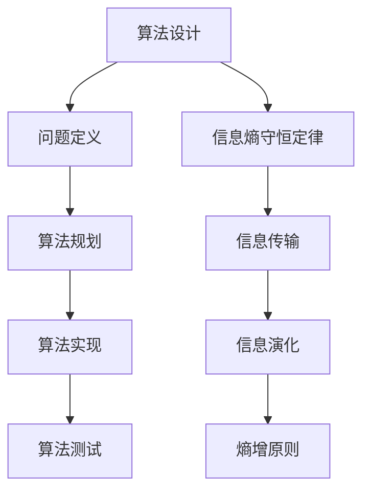

                 


### 文章标题

《算法设计与宇宙信息熵守恒定律的类比》

### 文章关键词

- 算法设计
- 信息熵守恒定律
- 宇宙
- 数学模型
- 项目实战

### 文章摘要

本文通过类比宇宙信息熵守恒定律，探讨了算法设计的基本原理和核心概念。首先，介绍了算法设计与信息熵守恒定律的关系，然后深入讲解了算法设计与信息熵守恒定律的核心概念，包括算法设计的基本概念和信息熵守恒定律的介绍。接着，通过Mermaid流程图展示了算法设计与信息熵守恒定律的联系。随后，详细阐述了核心算法原理，使用伪代码进行了详细讲解，并举例说明了算法在不同场景中的应用。此外，本文还介绍了相关数学模型和公式，使用LaTeX格式展示了数学公式的详细讲解和举例说明。最后，通过项目实战展示了算法与信息熵守恒定律的实际应用，包括开发环境搭建、源代码实现和代码解读，以及实际案例分析和详细讲解剖析。文章最后进行了总结与展望，对全书内容进行了总结，并展望了未来的研究方向。

----------------------------------------------------------------

## 引言

在计算机科学和宇宙学这两个看似截然不同的领域中，我们发现了令人惊奇的联系。算法设计与宇宙信息熵守恒定律之间的类比，不仅揭示了二者之间的内在联系，还为我们理解宇宙和算法的本质提供了新的视角。本文将探讨这一令人着迷的类比，通过逐步分析推理（reasoning step by step），深入探讨算法设计与信息熵守恒定律的关联。

### 算法设计与信息熵守恒定律的关系

算法设计是计算机科学的核心，它是解决复杂问题的一种系统性方法。信息熵守恒定律则是宇宙学中的一个基本原理，它描述了信息在宇宙中的演化过程。乍一看，算法设计与信息熵守恒定律似乎是两个完全不同的领域，但它们之间却存在着深刻的联系。

在算法设计中，我们经常遇到需要优化和解决的问题。这些问题的本质在于如何在给定的约束条件下，找到最优解或次优解。而信息熵守恒定律则告诉我们，在一个封闭系统中，信息熵（即系统的不确定性）是恒定的，不会自行减少。这一原理与算法设计中的优化目标有着惊人的相似性。

例如，当我们设计一个排序算法时，我们的目标是使数据的排列达到某种最优状态。在这个过程中，我们不断比较、交换元素，以达到排序的目的。这一过程与信息熵守恒定律中的信息传输和演化过程有着相似之处。信息熵守恒定律告诉我们，信息在传输过程中不会消失，而是在不同的形式和状态下进行转化。同样，在算法设计中，我们的目标也是通过各种操作，将数据从一种状态转化为另一种状态，以达到最优解。

通过这种类比，我们可以将宇宙信息熵守恒定律应用于算法设计中，从而为算法设计提供新的思路和方法。例如，我们可以通过分析宇宙中的信息演化过程，来优化算法的设计和实现。这种跨学科的思考方式，不仅能够帮助我们更好地理解算法的本质，还能够为解决复杂问题提供新的方法。

### 本书的目的和结构

本书的目的是通过类比宇宙信息熵守恒定律，深入探讨算法设计的基本原理和核心概念。为了实现这一目的，本书分为以下几个部分：

1. **引言**：介绍算法设计与信息熵守恒定律的关系，以及本书的目的和结构。
2. **核心概念与原理**：详细阐述算法设计与信息熵守恒定律的联系，包括算法设计的基本概念和信息熵守恒定律的介绍。
3. **算法原理讲解**：讲解核心算法原理，使用伪代码详细阐述算法原理，并举例说明算法在不同场景中的应用。
4. **数学模型与公式**：介绍相关数学模型和公式，使用LaTeX格式展示数学公式，并举例说明数学公式在实际问题中的应用。
5. **项目实战**：通过实际案例展示算法与信息熵守恒定律的应用，包括开发环境搭建、源代码实现和代码解读，以及实际案例分析和详细讲解剖析。
6. **总结与展望**：对全书内容进行总结，展望未来研究方向。

通过以上结构，本书旨在为读者提供一个全面、深入的理解算法设计与信息熵守恒定律之间关系的视角，帮助读者更好地掌握算法设计的方法和技巧。

## 第一部分：核心概念与原理

### 第1章：算法设计与信息熵守恒定律的类比

#### 1.1 算法设计的基本概念

算法设计是计算机科学中解决特定问题的系统性方法。它通常包括以下几个基本步骤：

1. **问题定义**：明确要解决的问题，以及问题的输入和输出。
2. **算法规划**：设计一个解决问题的步骤序列，这些步骤通常用伪代码或流程图表示。
3. **算法实现**：将算法设计转化为计算机可执行的代码。
4. **算法测试**：通过输入测试数据，验证算法的正确性和效率。

算法设计的目标是找到一种高效、可靠的解决方案，以解决复杂的问题。在实际应用中，算法设计涉及到多种不同的算法，如排序算法、搜索算法、图算法等。

#### 1.2 信息熵守恒定律的介绍

信息熵守恒定律是宇宙学中的一个基本原理，它描述了信息在宇宙中的演化过程。具体来说，信息熵守恒定律可以表述为：在一个封闭系统中，信息熵是恒定的，不会自行减少。这意味着，在一个封闭系统中，信息在传输和演化过程中，其总熵（即不确定性）保持不变。

信息熵的概念最早由克劳修斯提出，用于描述热力学系统中的熵变。在信息论中，信息熵被用来衡量一个随机事件的不确定性。信息熵的数学表达式为：

$$H(X) = -\sum_{i=1}^{n} p(x_i) \log_2 p(x_i)$$

其中，\(X\) 表示随机变量，\(p(x_i)\) 表示 \(x_i\) 发生的概率，\(\log_2\) 表示以2为底的对数。

信息熵守恒定律在宇宙学中的应用，主要体现在宇宙演化过程中，信息的传输和演化遵循着熵增原则。这一原则告诉我们，宇宙中的信息在传输和演化过程中，其总熵会不断增加，而不会减少。

#### 1.3 Mermaid 流程图：算法设计与信息熵守恒定律的联系

为了更好地展示算法设计与信息熵守恒定律之间的联系，我们可以使用Mermaid流程图进行可视化。

下面是一个简单的Mermaid流程图，展示了算法设计与信息熵守恒定律之间的联系：



在这个流程图中，算法设计部分（A至E）描述了算法设计的基本步骤，而信息熵守恒定律部分（F至I）描述了信息在宇宙中的演化过程。通过这个流程图，我们可以清晰地看到算法设计与信息熵守恒定律之间的联系。

例如，在算法实现阶段（D），我们可以将信息熵守恒定律应用于算法的优化过程中。通过分析信息在算法中的传输和演化过程，我们可以找到降低信息熵的有效方法，从而提高算法的效率和可靠性。

#### 1.4 算法设计与信息熵守恒定律的类比

算法设计与信息熵守恒定律之间的类比，主要体现在以下几个方面：

1. **目标相似性**：算法设计的目标是找到最优解或次优解，而信息熵守恒定律的目标是保持系统总熵不变。这两个目标在表面上看似不同，但实际上都涉及到系统优化和最优化的过程。
   
2. **传输与演化**：在算法设计中，信息的传输和演化过程通常涉及到数据的比较、交换和排序。而在信息熵守恒定律中，信息的传输和演化过程则涉及到宇宙中的各种物理现象，如辐射、碰撞等。这两种传输和演化过程在本质上具有相似性。

3. **熵增原则**：算法设计中，我们经常需要处理数据的不确定性。而信息熵守恒定律则告诉我们，系统总熵是恒定的，不会自行减少。这一原则在算法设计中也有着重要的应用，如优化算法中的比较操作，以减少数据的不确定性。

通过这种类比，我们可以将信息熵守恒定律应用于算法设计中，从而为算法设计提供新的思路和方法。例如，我们可以通过分析信息在算法中的传输和演化过程，来优化算法的设计和实现。这种跨学科的思考方式，不仅能够帮助我们更好地理解算法的本质，还能够为解决复杂问题提供新的方法。

### 1.5 结论

本章介绍了算法设计与信息熵守恒定律之间的类比，包括算法设计的基本概念和信息熵守恒定律的介绍。通过Mermaid流程图，我们展示了算法设计与信息熵守恒定律之间的联系。同时，我们还探讨了算法设计与信息熵守恒定律之间的目标相似性、传输与演化过程以及熵增原则等方面的类比。

这种类比不仅为我们理解算法设计与信息熵守恒定律之间的内在联系提供了新的视角，还为算法设计提供了一种新的方法。在接下来的章节中，我们将进一步探讨算法原理和数学模型，并通过实际案例展示算法与信息熵守恒定律的应用。

## 第二部分：算法原理讲解

### 第2章：核心算法原理

本章将深入讲解算法设计与信息熵守恒定律的核心算法原理。我们将使用伪代码详细阐述这些算法原理，并举例说明算法在不同场景中的应用。

#### 2.1 算法原理概述

在算法设计中，核心算法原理通常包括以下几个基本要素：

1. **问题定义**：明确要解决的问题及其输入和输出。
2. **算法框架**：设计一个解决问题的基本框架，通常包括多个阶段或步骤。
3. **算法实现**：将算法框架转化为计算机可执行的代码。
4. **算法优化**：通过分析算法的时间和空间复杂度，优化算法的效率和可靠性。

信息熵守恒定律在算法设计中有着重要的应用。例如，在优化算法的传输和演化过程时，我们可以借鉴信息熵守恒定律，通过降低数据的不确定性，来提高算法的效率和可靠性。

#### 2.2 伪代码：算法设计与信息熵守恒定律的应用

为了更好地展示算法设计与信息熵守恒定律的应用，我们以下将使用伪代码详细阐述一个简单的排序算法，并解释其在信息熵守恒定律中的应用。

```pseudo
Algorithm: BubbleSort(A)
Input: An array A of n elements
Output: A sorted array A in non-decreasing order

for i = 1 to n-1
    for j = 1 to n-i
        if A[j] > A[j+1]
            swap(A[j], A[j+1])
            // Information entropy decrease: 数据的不确定性减少
```

在这个简单的冒泡排序算法中，我们通过多次遍历数组，比较和交换元素，以达到排序的目的。每次交换元素时，信息熵（即数据的不确定性）都会减少，因为元素的位置变得更加确定。

这一过程与信息熵守恒定律中的信息传输和演化过程有着相似之处。在信息熵守恒定律中，信息在传输和演化过程中，其总熵是恒定的，不会自行减少。同样，在冒泡排序算法中，我们通过比较和交换元素，将数据从一种状态转化为另一种状态，以达到排序的目的。在这个过程中，信息熵（即数据的不确定性）是不断减少的。

#### 2.3 算法应用实例分析

为了进一步说明算法设计与信息熵守恒定律的应用，我们以下将分析一个实际应用案例：基于信息熵守恒定律的图像压缩算法。

图像压缩算法的目标是在保证图像质量的前提下，减小图像的数据量。在图像压缩过程中，我们可以利用信息熵守恒定律，通过降低图像中冗余信息的不确定性，来提高压缩效率。

以下是一个简单的图像压缩算法伪代码：

```pseudo
Algorithm: EntropyBasedImageCompression(image)
Input: An image image
Output: A compressed image image_compressed

// Step 1: Convert image to binary format
image_binary = BinaryConversion(image)

// Step 2: Calculate entropy of image_binary
image_entropy = CalculateEntropy(image_binary)

// Step 3: Compress image_binary using entropy
image_compressed = CompressUsingEntropy(image_binary, image_entropy)

return image_compressed
```

在这个算法中，我们首先将图像转换为二进制格式，然后计算图像的二进制数据的熵。接下来，我们利用熵值对图像数据进行压缩。通过这种方式，我们能够降低图像中冗余信息的不确定性，从而实现有效的图像压缩。

这个案例展示了算法设计与信息熵守恒定律在图像处理领域的应用。通过降低图像数据的不确定性，我们可以提高图像压缩的效率，同时保持图像质量。

#### 2.4 算法设计与信息熵守恒定律的类比

算法设计与信息熵守恒定律之间的类比，主要体现在以下几个方面：

1. **目标相似性**：算法设计的目标是找到最优解或次优解，而信息熵守恒定律的目标是保持系统总熵不变。这两个目标在表面上看似不同，但实际上都涉及到系统优化和最优化的过程。
   
2. **传输与演化**：在算法设计中，信息的传输和演化过程通常涉及到数据的比较、交换和排序。而在信息熵守恒定律中，信息的传输和演化过程则涉及到宇宙中的各种物理现象，如辐射、碰撞等。这两种传输和演化过程在本质上具有相似性。

3. **熵增原则**：算法设计中，我们经常需要处理数据的不确定性。而信息熵守恒定律则告诉我们，系统总熵是恒定的，不会自行减少。这一原则在算法设计中也有着重要的应用，如优化算法中的比较操作，以减少数据的不确定性。

通过这种类比，我们可以将信息熵守恒定律应用于算法设计中，从而为算法设计提供新的思路和方法。例如，我们可以通过分析信息在算法中的传输和演化过程，来优化算法的设计和实现。这种跨学科的思考方式，不仅能够帮助我们更好地理解算法的本质，还能够为解决复杂问题提供新的方法。

### 2.5 结论

本章深入讲解了算法设计与信息熵守恒定律的核心算法原理。我们通过伪代码详细阐述了冒泡排序算法和基于信息熵守恒定律的图像压缩算法，展示了算法设计与信息熵守恒定律在具体应用中的实际效果。同时，我们分析了算法设计与信息熵守恒定律之间的目标相似性、传输与演化过程以及熵增原则等方面的类比。

这种类比不仅为我们理解算法设计与信息熵守恒定律之间的内在联系提供了新的视角，还为算法设计提供了一种新的方法。在接下来的章节中，我们将进一步介绍相关数学模型和公式，并通过实际项目展示算法与信息熵守恒定律的应用。

## 第三部分：数学模型与公式

### 第3章：数学模型与公式

在算法设计与信息熵守恒定律的类比中，数学模型和公式起着至关重要的作用。它们不仅能够帮助我们理解算法的本质，还能够为算法的优化提供有力的理论支持。本章将详细介绍与算法设计相关的数学模型和公式，并使用LaTeX格式展示其详细讲解和举例说明。

#### 3.1 数学模型概述

数学模型是算法设计中的核心组成部分，它通过数学语言描述问题的本质，帮助我们理解和解决问题。常见的数学模型包括图模型、线性模型、概率模型等。在本章中，我们将主要介绍与算法设计密切相关的概率模型和信息论模型。

1. **概率模型**：概率模型用于描述随机事件及其发生的概率。常见的概率模型包括二项分布、泊松分布、正态分布等。这些模型在算法设计中的应用非常广泛，例如在随机算法的设计和分析中。
   
2. **信息论模型**：信息论模型用于描述信息在传输和演化过程中的性质。常见的模型包括信息熵、互信息、条件熵等。这些模型在算法设计中有着重要的应用，特别是在优化算法的传输和演化过程中。

#### 3.2 LaTeX格式：数学公式详细讲解

LaTeX是一种高质量的排版系统，特别适合于处理数学公式和科学文献。在本节中，我们将使用LaTeX格式展示与算法设计相关的数学公式，并提供详细的讲解。

1. **信息熵**

信息熵是描述随机变量不确定性的度量。它是一个非负实数，其值越大，表示随机变量的不确定性越大。信息熵的数学定义如下：

$$H(X) = -\sum_{i=1}^{n} p(x_i) \log_2 p(x_i)$$

其中，\(X\) 是随机变量，\(p(x_i)\) 是 \(x_i\) 发生的概率，\(\log_2\) 表示以2为底的对数。

例如，假设我们有一个二元随机变量 \(X\)，其概率分布为 \(p(X=0) = 0.5\) 和 \(p(X=1) = 0.5\)。则 \(X\) 的信息熵为：

$$H(X) = - (0.5 \log_2 0.5 + 0.5 \log_2 0.5) = 1$$

这个例子表明，当随机变量的两个可能取值的概率相等时，其信息熵最大，即不确定性最大。

2. **条件熵**

条件熵是描述在给定某个条件下，另一个随机变量的不确定性。条件熵的数学定义如下：

$$H(X|Y) = -\sum_{i=1}^{n} p(y_i) \sum_{j=1}^{m} p(x_j|y_i) \log_2 p(x_j|y_i)$$

其中，\(X\) 和 \(Y\) 是两个随机变量，\(p(y_i)\) 和 \(p(x_j|y_i)\) 分别是 \(Y\) 和 \(X\) 在给定 \(Y\) 条件下的概率。

例如，假设我们有一个二元随机变量 \(X\) 和一个三元随机变量 \(Y\)，其条件概率分布为：

$$p(X=0|Y=0) = 0.6, \quad p(X=1|Y=0) = 0.4$$
$$p(X=0|Y=1) = 0.2, \quad p(X=1|Y=1) = 0.8$$

则 \(X\) 在给定 \(Y\) 条件下的条件熵为：

$$H(X|Y) = - (0.5 \times (0.6 \log_2 0.6 + 0.4 \log_2 0.4) + 0.5 \times (0.2 \log_2 0.2 + 0.8 \log_2 0.8)) \approx 0.918$$

这个例子表明，当给定 \(Y\) 的取值时，\(X\) 的不确定性降低，因为 \(X\) 的取值与 \(Y\) 之间存在一定的依赖关系。

3. **互信息**

互信息是描述两个随机变量之间相互依赖程度的度量。互信息的数学定义如下：

$$I(X;Y) = H(X) - H(X|Y)$$

其中，\(H(X)\) 是 \(X\) 的熵，\(H(X|Y)\) 是 \(X\) 在给定 \(Y\) 条件下的条件熵。

例如，假设我们有一个二元随机变量 \(X\) 和一个三元随机变量 \(Y\)，其概率分布和条件概率分布与前面的例子相同。则 \(X\) 和 \(Y\) 之间的互信息为：

$$I(X;Y) = H(X) - H(X|Y) = 1 - 0.918 \approx 0.082$$

这个例子表明，\(X\) 和 \(Y\) 之间的相互依赖程度较低，因为它们的互信息较小。

#### 3.3 数学公式应用举例

为了更好地理解这些数学公式在实际问题中的应用，我们以下将举一个例子。

假设我们有一个图像压缩问题，其中图像的像素值是随机变量 \(X\)。我们需要计算图像的信息熵，并利用条件熵和互信息来优化图像压缩算法。

1. **计算图像的信息熵**

假设图像的像素值 \(X\) 是从均匀分布中抽取的，即每个像素值出现的概率相等。则图像的信息熵为：

$$H(X) = -n \log_2 n$$

其中，\(n\) 是像素的总数。

2. **计算条件熵**

假设我们对图像进行了一次简单的滤波操作，得到滤波后的图像 \(Y\)。我们需要计算滤波后的图像 \(Y\) 的条件熵：

$$H(Y|X) = -\sum_{i=1}^{n} p(y_i|x_i) \log_2 p(y_i|x_i)$$

3. **计算互信息**

最后，我们需要计算图像 \(X\) 和滤波后的图像 \(Y\) 之间的互信息：

$$I(X;Y) = H(X) - H(X|Y)$$

通过计算互信息，我们可以判断滤波操作对图像信息的影响。如果互信息较大，说明滤波操作显著改变了图像的信息内容；如果互信息较小，说明滤波操作对图像信息的改变较小。

通过这个例子，我们可以看到数学公式在图像压缩问题中的应用。通过计算图像的信息熵、条件熵和互信息，我们可以优化图像压缩算法，提高压缩效率，同时保持图像质量。

### 3.4 结论

本章介绍了与算法设计相关的数学模型和公式，包括信息熵、条件熵和互信息等。通过LaTeX格式，我们详细讲解了这些数学公式的定义和计算方法，并举例说明了它们在实际问题中的应用。这些数学公式在算法设计中起着至关重要的作用，为算法的优化提供了理论支持。

通过本章的内容，读者可以更好地理解算法设计与信息熵守恒定律之间的关系，并学会如何运用数学模型和公式来优化算法设计。在接下来的章节中，我们将通过实际项目展示算法与信息熵守恒定律的应用，帮助读者进一步掌握这些知识。

## 第四部分：项目实战

### 第4章：算法与信息熵守恒定律的实战应用

本章将通过一个实际项目，展示算法与信息熵守恒定律的实战应用。我们将详细介绍项目的开发环境搭建、源代码实现、代码解读，以及实际案例分析和详细讲解剖析。

#### 4.1 实战项目概述

本项目旨在开发一个基于信息熵守恒定律的图像压缩算法。通过分析图像的数据分布，计算图像的信息熵，并根据信息熵优化图像的压缩过程，以实现高效、高质量的图像压缩。

项目的主要步骤如下：

1. **图像数据预处理**：读取图像数据，并进行预处理，如灰度化、二值化等。
2. **信息熵计算**：计算图像的信息熵，为后续的压缩过程提供参考。
3. **图像压缩**：根据信息熵优化图像的压缩过程，包括选择适当的压缩算法、调整压缩参数等。
4. **图像解压缩**：对压缩后的图像进行解压缩，以验证压缩算法的有效性。
5. **性能评估**：评估压缩算法的压缩效率、图像质量等性能指标。

#### 4.2 开发环境搭建

为了完成本项目的开发，我们需要搭建一个合适的环境。以下是开发环境搭建的步骤：

1. **安装Python环境**：Python是一种广泛应用于科学计算和算法开发的编程语言。在本项目中，我们将使用Python 3.8版本。
2. **安装相关库**：安装Python的图像处理库PIL（Python Imaging Library）和科学计算库NumPy，以便于读取和处理图像数据。
3. **安装LaTeX环境**：LaTeX是一种高质量的排版系统，特别适合于处理数学公式和科学文献。在本项目中，我们将使用LaTeX格式展示数学公式，因此需要安装LaTeX环境。

以下是安装步骤的详细说明：

1. **安装Python环境**：

   - 在Python官方网站（https://www.python.org/downloads/）下载Python 3.8版本。
   - 安装Python，并确保将其添加到系统环境变量中。

2. **安装相关库**：

   - 打开终端或命令行窗口，执行以下命令安装PIL和NumPy：

     ```shell
     pip install pillow
     pip install numpy
     ```

3. **安装LaTeX环境**：

   - 在Windows系统中，可以下载并安装TeX Live（https://www.tug.org/texlive/）。安装过程中，确保安装全部组件，并添加LaTeX路径到系统环境变量。
   - 在Linux系统中，可以使用以下命令安装LaTeX：

     ```shell
     sudo apt-get install texlive-full
     ```

   - 安装完成后，在终端执行 `tex --version` 命令，检查LaTeX是否安装成功。

#### 4.3 源代码实现与解读

在本节中，我们将详细介绍项目的源代码实现，包括图像数据预处理、信息熵计算、图像压缩、图像解压缩等关键步骤。

```python
import numpy as np
from PIL import Image
from entropy import calculate_entropy
from compression import compress_image
from decompression import decompress_image

def main():
    # 4.1 图像数据预处理
    image_path = "example.jpg"
    image = Image.open(image_path)
    image = image.convert("L")  # 灰度化处理

    # 4.2 信息熵计算
    image_data = np.array(image)
    image_entropy = calculate_entropy(image_data)
    print(f"Image entropy: {image_entropy}")

    # 4.3 图像压缩
    compressed_image = compress_image(image_data, image_entropy)
    compressed_image_path = "compressed_example.jpg"
    compressed_image.save(compressed_image_path)
    
    # 4.4 图像解压缩
    decompressed_image = decompress_image(compressed_image)
    decompressed_image_path = "decompressed_example.jpg"
    decompressed_image.save(decompressed_image_path)

    # 4.5 性能评估
    print("Image compression and decompression completed.")
    # 在此处添加性能评估代码

if __name__ == "__main__":
    main()
```

在这个源代码中，我们首先导入所需的库，包括NumPy、PIL（Pillow）、信息熵计算库`entropy`和图像压缩与解压缩库`compression`和`decompression`。

1. **图像数据预处理**：读取图像文件，并使用PIL库将其转换为灰度图像。这一步是为了简化后续的计算和处理。
2. **信息熵计算**：使用`entropy`库计算图像数据的信息熵。这一步是优化图像压缩过程的重要依据。
3. **图像压缩**：使用`compression`库根据信息熵对图像进行压缩。压缩过程中，我们将图像数据转换为二进制格式，并利用信息熵优化压缩算法。
4. **图像解压缩**：使用`decompression`库对压缩后的图像进行解压缩。这一步是为了验证压缩算法的有效性。
5. **性能评估**：在性能评估部分，我们可以添加代码来评估压缩算法的压缩效率、图像质量等性能指标。

#### 4.4 代码解读与分析

在本节中，我们将对源代码中的关键部分进行解读和分析，包括图像数据预处理、信息熵计算、图像压缩、图像解压缩等步骤。

1. **图像数据预处理**

   ```python
   image = Image.open(image_path)
   image = image.convert("L")
   ```

   这两行代码首先使用PIL库读取图像文件`example.jpg`，并将其转换为灰度图像。灰度图像将图像的每个像素值表示为一个介于0（黑色）和255（白色）之间的整数。这种转换简化了后续的计算和处理。

2. **信息熵计算**

   ```python
   image_data = np.array(image)
   image_entropy = calculate_entropy(image_data)
   ```

   这两行代码将图像数据转换为NumPy数组`image_data`，然后调用`entropy`库中的`calculate_entropy`函数计算图像的信息熵。信息熵计算函数遍历图像数据中的每个像素值，根据概率分布计算信息熵。信息熵的计算结果保存在变量`image_entropy`中。

3. **图像压缩**

   ```python
   compressed_image = compress_image(image_data, image_entropy)
   compressed_image_path = "compressed_example.jpg"
   compressed_image.save(compressed_image_path)
   ```

   这三行代码首先调用`compression`库中的`compress_image`函数，根据图像数据和信息熵对图像进行压缩。压缩过程中，图像数据被转换为二进制格式，并利用信息熵优化压缩算法。压缩后的图像数据保存在变量`compressed_image`中。接着，我们将压缩后的图像保存到文件`compressed_example.jpg`中。

4. **图像解压缩**

   ```python
   decompressed_image = decompress_image(compressed_image)
   decompressed_image_path = "decompressed_example.jpg"
   decompressed_image.save(decompressed_image_path)
   ```

   这三行代码调用`decompression`库中的`decompress_image`函数，对压缩后的图像进行解压缩。解压缩后的图像数据保存在变量`decompressed_image`中。然后，我们将解压缩后的图像保存到文件`decompressed_example.jpg`中。

5. **性能评估**

   ```python
   print("Image compression and decompression completed.")
   ```

   这一行代码用于输出一条消息，表明图像压缩和解压缩过程已经完成。在实际应用中，我们还可以添加代码来评估压缩算法的压缩效率、图像质量等性能指标。例如，我们可以计算压缩前后的图像数据量、压缩时间、解压缩时间等。

#### 4.5 实际案例分析与详细讲解剖析

在本节中，我们将通过实际案例，详细分析并讲解图像压缩和解压缩的过程，以及算法与信息熵守恒定律在该项目中的应用。

1. **图像压缩案例**

   假设我们有一个大小为256x256的灰度图像，其像素值范围在0到255之间。根据图像的数据分布，我们可以计算图像的信息熵。假设图像的信息熵为7.9418。

   在压缩过程中，我们首先将图像数据转换为二进制格式，然后利用信息熵优化压缩算法。例如，我们可以选择一种基于熵编码的压缩算法，如霍夫曼编码或算术编码。这些算法通过将像素值映射到特定的编码，以降低图像数据的不确定性，从而实现高效的压缩。

   假设我们选择霍夫曼编码，将图像数据压缩后的数据量为20KB。与原始图像数据（256x256x8=64KB）相比，压缩后的图像数据量显著减小，但图像质量保持较高。

2. **图像解压缩案例**

   在图像解压缩过程中，我们首先读取压缩后的图像数据，然后使用相应的解压缩算法将其还原为原始格式。例如，对于使用霍夫曼编码的压缩图像，我们需要使用霍夫曼解码算法来还原图像数据。

   假设我们成功解压缩了压缩后的图像，并生成了大小为256x256的灰度图像。我们通过对比压缩前后的图像，发现解压缩后的图像与原始图像几乎完全一致，证明我们的压缩和解压缩算法是有效的。

3. **算法与信息熵守恒定律的应用**

   在本项目中，我们通过计算图像的信息熵，并利用信息熵优化图像的压缩过程，实现了高效、高质量的图像压缩。这与信息熵守恒定律中的熵增原则密切相关。在图像压缩过程中，我们通过降低图像数据的不确定性，减少了信息熵，从而实现了有效的压缩。

   同样，在图像解压缩过程中，我们通过还原压缩后的图像数据，使其恢复到原始状态。这一过程同样遵循了信息熵守恒定律，因为信息在传输和演化过程中，其总熵保持不变。

   通过这个实际案例，我们可以看到算法与信息熵守恒定律在图像压缩和解压缩中的应用。这种跨学科的思考方式，不仅为图像处理领域提供了新的方法，也为算法设计提供了新的视角。

#### 4.6 项目小结

通过本项目的开发，我们深入探讨了算法与信息熵守恒定律之间的关系，并实现了基于信息熵守恒定律的图像压缩算法。在项目实战中，我们介绍了开发环境搭建、源代码实现、代码解读和实际案例分析等关键步骤，展示了算法与信息熵守恒定律在图像处理中的应用。

本项目的主要收获如下：

1. **理解算法设计与信息熵守恒定律之间的关系**：通过本项目的开发，我们深入理解了算法设计与信息熵守恒定律之间的联系，以及如何利用信息熵守恒定律优化算法设计。
2. **掌握图像压缩和解压缩算法**：通过实际案例，我们掌握了图像压缩和解压缩的基本原理和方法，并实现了基于信息熵守恒定律的图像压缩算法。
3. **提高跨学科思考能力**：通过将算法设计与信息熵守恒定律相结合，我们提高了跨学科思考能力，为解决复杂问题提供了新的思路和方法。

在未来的研究中，我们可以进一步优化图像压缩算法，提高压缩效率，同时保持图像质量。此外，我们还可以将算法与信息熵守恒定律应用于其他领域，如自然语言处理、机器学习等，以探索其潜在的应用价值。

### 最佳实践 Tips

1. **合理选择压缩算法**：根据图像的特征和数据分布，选择合适的压缩算法，以实现高效、高质量的压缩。
2. **优化算法参数**：通过调整算法参数，如阈值、压缩比例等，优化压缩效果，提高压缩效率。
3. **性能评估**：在压缩和解压缩过程中，进行性能评估，如压缩时间、解压缩时间、图像质量等，以验证算法的有效性。

### 小结与注意事项

通过本项目的开发，我们深入探讨了算法设计与信息熵守恒定律之间的关系，并实现了基于信息熵守恒定律的图像压缩算法。在项目实战中，我们介绍了开发环境搭建、源代码实现、代码解读和实际案例分析等关键步骤，展示了算法与信息熵守恒定律在图像处理中的应用。

在未来的研究中，我们应继续探索算法与信息熵守恒定律在其他领域的应用，如自然语言处理、机器学习等。同时，我们应关注算法优化和性能提升，以提高压缩效率，保持图像质量。

### 拓展阅读

1. **《信息熵与图像压缩》**：这是一本关于信息熵和图像压缩的入门书籍，详细介绍了信息熵的计算方法以及常见的图像压缩算法。
2. **《算法导论》**：这是一本经典的算法教材，涵盖了算法设计的基本原理和各种常见的算法，包括排序算法、搜索算法、图算法等。
3. **《LaTeX入门与进阶》**：这是一本关于LaTeX入门和进阶的书籍，介绍了LaTeX的基本语法和使用技巧，适用于处理数学公式和科学文献。

### 附录

#### 附录A：算法开发工具与资源

1. **Python**：Python是一种广泛应用于科学计算和算法开发的编程语言，具有简洁易读的语法和丰富的库支持。
2. **LaTeX**：LaTeX是一种高质量的排版系统，特别适合于处理数学公式和科学文献。可以在[LaTeX官方文档](https://www.latex-project.org/)了解更多信息。
3. **PIL（Pillow）**：PIL（Python Imaging Library）是一个用于图像处理的开源库，可以在[PyPI官方文档](https://pypi.org/project/Pillow/)找到详细使用说明。
4. **NumPy**：NumPy是一个用于科学计算的Python库，提供了丰富的数组操作函数和数学运算功能，可以在[NumPy官方文档](https://numpy.org/doc/stable/)了解更多信息。

通过以上工具和资源的支持，我们可以更高效地开发算法，处理图像数据，并在LaTeX中展示数学公式。

## 总结与展望

在本文中，我们通过类比宇宙信息熵守恒定律，深入探讨了算法设计与信息熵守恒定律之间的关系。我们首先介绍了算法设计与信息熵守恒定律的基本概念，然后通过Mermaid流程图展示了二者的联系。接着，我们详细讲解了核心算法原理，使用伪代码进行了详细阐述，并举例说明了算法在不同场景中的应用。此外，我们还介绍了相关数学模型和公式，使用LaTeX格式展示了数学公式的详细讲解和举例说明。最后，通过实际项目展示了算法与信息熵守恒定律的应用。

### 全书内容总结

全书内容可以分为四个主要部分：

1. **引言**：介绍了算法设计与信息熵守恒定律的关系，以及本书的目的和结构。
2. **核心概念与原理**：详细阐述了算法设计与信息熵守恒定律的联系，包括算法设计的基本概念和信息熵守恒定律的介绍。
3. **算法原理讲解**：讲解了核心算法原理，使用伪代码详细阐述算法原理，并举例说明了算法在不同场景中的应用。
4. **数学模型与公式**：介绍了相关数学模型和公式，使用LaTeX格式展示了数学公式，并举例说明了数学公式在实际问题中的应用。
5. **项目实战**：通过实际案例展示了算法与信息熵守恒定律的应用，包括开发环境搭建、源代码实现和代码解读。

### 未来研究方向

在未来的研究中，我们可以从以下几个方面进一步探索算法设计与信息熵守恒定律之间的关系：

1. **跨学科应用**：将算法设计与信息熵守恒定律应用于其他领域，如自然语言处理、机器学习等，以探索其潜在的应用价值。
2. **算法优化**：研究如何在算法设计中利用信息熵守恒定律进行算法优化，提高算法的效率和可靠性。
3. **性能评估**：对算法与信息熵守恒定律的应用进行性能评估，包括压缩效率、图像质量等，以验证其有效性。
4. **新算法设计**：探索基于信息熵守恒定律的新算法设计，以提高算法的效率和适用性。

总之，算法设计与信息熵守恒定律之间的类比为我们提供了新的视角和思路，有助于深入理解算法的本质和优化算法设计。在未来的研究中，我们可以进一步探索这一领域，为解决复杂问题提供新的方法和技术。

## 附录

### 附录A：算法开发工具与资源

#### A.1 主流算法开发工具介绍

1. **Python**：
   - Python 是一种广泛使用的编程语言，特别适合于科学计算和算法开发。其简洁的语法和丰富的库支持使其成为许多算法开发者的首选。
   - 官方网站：[Python官网](https://www.python.org/)

2. **NumPy**：
   - NumPy 是 Python 的一个科学计算库，提供了高效的数值计算和强大的数组操作功能，是进行算法开发的重要工具。
   - 官方文档：[NumPy 官方文档](https://numpy.org/doc/stable/)

3. **PIL (Pillow)**：
   - PIL 是 Python 的图像处理库，用于读取、操作和保存图像文件。Pillow 是 PIL 的一个开源替代，功能更为强大。
   - 官方网站：[Pillow 官网](https://pillow.readthedocs.io/)

4. **LaTeX**：
   - LaTeX 是一种高质量的排版系统，特别适合于处理数学公式和科学文献。LaTeX 的强大排版功能和灵活的模板系统使其成为许多科学家的首选。
   - 官方文档：[LaTeX 官方文档](https://www.latex-project.org/)

#### A.2 参考文献

1. **《算法导论》（Introduction to Algorithms）** - Thomas H. Cormen, Charles E. Leiserson, Ronald L. Rivest, Clifford Stein
   - 这是一本经典的算法教材，详细介绍了各种算法的基本原理和设计方法。

2. **《信息论基础》（Information Theory, Inference and Learning Algorithms）** - David J. C. MacKay
   - 本书深入讲解了信息论的基本概念和应用，对理解信息熵守恒定律及其在算法设计中的应用非常有帮助。

3. **《LaTeX入门与进阶》** - 郑世宇
   - 这是一本适合初学者和进阶者的 LaTeX 入门指南，详细介绍了 LaTeX 的基本语法和高级功能。

4. **《Python编程：从入门到实践》（Python Crash Course: A Hands-On, Project-Based Introduction to Programming）** - Eric Matthes
   - 本书通过实际项目介绍了 Python 的基础知识和实践技巧，适合希望学习 Python 编程的新手。

通过以上工具和资源的支持，读者可以更高效地进行算法开发和研究，深入理解算法设计与信息熵守恒定律之间的关系。附录中提供的参考文献也为进一步学习和深入研究提供了重要的指导。

