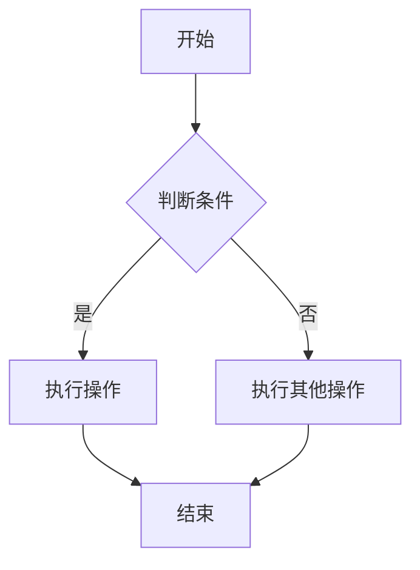

                 

### 文章标题：算法设计与宇宙信息熵最小化的类比

#### 关键词：算法设计、宇宙信息熵、最小化、类比、人工智能

> 摘要：本文通过将算法设计与宇宙信息熵最小化的原理进行类比，深入探讨了算法设计中的核心原则与优化方法。文章首先介绍了算法设计的基本概念和信息熵的基本原理，然后通过对比不同算法在信息熵最小化方面的表现，分析了算法设计的优化策略。最后，通过实际项目案例，详细阐述了算法设计与宇宙信息熵最小化原理在实践中的应用，为算法设计师提供了新的思维方式和优化思路。

---

## 引言

在计算机科学领域，算法设计是解决各种问题的核心。一个高效的算法不仅能够减少计算资源的使用，还能提高问题的解决速度。然而，算法设计并非一成不变，而是需要不断优化和创新。近年来，宇宙信息熵最小化的概念逐渐受到关注，这一原理不仅在物理学、信息科学等领域有着重要应用，也在算法设计中展现出巨大的潜力。

本文旨在通过将算法设计与宇宙信息熵最小化的类比，揭示算法设计中的核心原则和优化方法。信息熵是一个衡量信息不确定性的度量，而宇宙信息熵最小化则意味着在给定条件下寻找最可能的状态。这种思维方式可以帮助我们更好地理解算法设计，从而提出更加高效和优化的解决方案。

本文结构如下：首先，我们将介绍算法设计的基本概念和信息熵的基本原理；接着，通过对比不同算法在信息熵最小化方面的表现，分析算法设计的优化策略；然后，通过实际项目案例，阐述算法设计与宇宙信息熵最小化原理在实践中的应用；最后，总结全文并提出未来研究的方向。

---

## 算法设计基础

### 2.1 算法的基本概念

算法（Algorithm）是一系列定义明确的操作步骤，用于解决特定问题。它通常由输入、处理过程和输出三部分组成。一个良好的算法应当具备以下几个特点：

1. **确定性**：算法的每一步操作都是明确的，对于相同的输入，算法总是产生相同的输出。
2. **有效性**：算法必须在有限的时间内完成，即算法的复杂度是可接受的。
3. **可读性**：算法应当简洁易懂，便于理解和实现。

算法设计的基本原则包括：

1. **正确性**：算法必须能够正确解决问题，即对于所有合法的输入，算法都能得到正确的输出。
2. **健壮性**：算法应当能够处理异常输入和错误情况。
3. **可扩展性**：算法应当能够适应不同规模的问题。

### 2.2 算法设计的原则

算法设计不仅仅是编写代码，而是一个系统化的过程。以下是一些常用的算法设计原则：

1. **分而治之**：将复杂问题分解为若干个更小的子问题，分别解决，然后再合并结果。
2. **贪心策略**：每次选择当前情况下最优的决策，希望最终得到全局最优解。
3. **动态规划**：将问题分解为重叠子问题，通过递推关系求解整个问题。
4. **回溯法**：通过尝试各种可能性，逐步回退，找到解决方案。

### 2.3 算法的复杂度分析

算法的复杂度分为时间复杂度和空间复杂度。时间复杂度表示算法执行时间与输入规模的关系，常用大O符号表示。空间复杂度表示算法所需存储空间与输入规模的关系。

常见的时间复杂度有：

- **常数时间**：\(O(1)\)
- **线性时间**：\(O(n)\)
- **对数时间**：\(O(\log n)\)
- **多项式时间**：\(O(n^k)\)，其中\(k\)是常数

常见的空间复杂度有：

- **常数空间**：\(O(1)\)
- **线性空间**：\(O(n)\)
- **对数空间**：\(O(\log n)\)

算法的复杂度分析是评估算法性能的重要手段，有助于我们选择合适的算法解决实际问题。

### 2.4 Mermaid流程图介绍

Mermaid是一种简单的文本图表工具，可以用来绘制流程图、UML图等。以下是Mermaid流程图的语法示例：



这个流程图描述了一个简单的判断结构。通过Mermaid流程图，我们可以直观地展示算法的逻辑流程，有助于理解和优化算法设计。

---

## 宇宙信息熵最小化原理

### 3.1 信息熵的定义

信息熵（Entropy）是信息理论中的一个基本概念，用于衡量信息的随机性和不确定性。在概率论中，信息熵可以表示为：

\[ H(X) = -\sum_{i} p(x_i) \log_2 p(x_i) \]

其中，\(X\) 是随机变量，\(p(x_i)\) 是随机变量取值为 \(x_i\) 的概率。

对于离散随机变量，信息熵越大，表示其不确定性越高。在算法设计中，信息熵可以帮助我们衡量算法在不同状态下的不确定性，从而优化算法性能。

### 3.2 宇宙信息熵最小化的原理

宇宙信息熵最小化（Universe Entropy Minimization）是指在一个封闭系统中，信息熵会趋向于最小化。这一原理源于热力学第二定律，即在封闭系统中，熵会随着时间的推移而增加，直到达到最大值。

将宇宙信息熵最小化原理应用于算法设计，我们可以理解为在给定条件下，寻找能够使信息熵最小的算法。这意味着，一个最优的算法应当在解决特定问题时，使得系统的信息熵最小化，从而提高算法的效率和可靠性。

### 3.3 信息熵与算法设计的联系

信息熵与算法设计之间有着紧密的联系。首先，信息熵可以用来评估算法的性能。一个高效的算法应当在解决特定问题时，使得系统的信息熵最小化。其次，信息熵可以指导我们优化算法设计。通过分析算法在不同状态下的信息熵变化，我们可以找出算法的瓶颈，并提出相应的优化方案。

例如，在排序算法中，我们可以通过比较不同算法的信息熵，来评估其性能。一个最优的排序算法应当在给定输入序列时，使得系统的信息熵最小化。常见的排序算法如快速排序、归并排序等，都可以通过分析信息熵来优化其性能。

---

## 对比不同算法的信息熵最小化表现

在算法设计中，不同算法在信息熵最小化方面有着不同的表现。本节将对比几种常见算法在信息熵最小化方面的特点，分析其优劣。

### 4.1 经典算法的宇宙信息熵分析

经典算法包括排序算法、搜索算法等。以下是对几种常见经典算法的信息熵分析：

1. **快速排序**：快速排序是一种高效的排序算法，其时间复杂度为 \(O(n\log n)\)。在给定输入序列时，快速排序能够有效地降低系统的信息熵，从而提高排序效率。然而，快速排序的最坏情况时间复杂度为 \(O(n^2)\)，此时信息熵的变化较大。
2. **归并排序**：归并排序是一种稳定的排序算法，其时间复杂度也为 \(O(n\log n)\)。与快速排序相比，归并排序的最坏情况时间复杂度较低，因此在信息熵最小化方面表现更稳定。
3. **二分搜索**：二分搜索是一种高效的搜索算法，其时间复杂度为 \(O(\log n)\)。在给定有序序列时，二分搜索能够快速降低系统的信息熵，从而提高搜索效率。

### 4.2 进化算法的宇宙信息熵分析

进化算法是一种基于生物进化的算法，包括遗传算法、模拟退火算法等。以下是对几种常见进化算法的信息熵分析：

1. **遗传算法**：遗传算法通过模拟自然选择和遗传机制来优化问题。在给定初始种群时，遗传算法能够逐渐降低系统的信息熵，找到最优解。然而，遗传算法可能陷入局部最优，导致信息熵无法进一步减小。
2. **模拟退火算法**：模拟退火算法通过模拟物理退火过程来优化问题。在给定初始温度时，模拟退火算法能够有效地降低系统的信息熵，找到最优解。然而，模拟退火算法的收敛速度较慢。

### 4.3 神经网络算法的宇宙信息熵分析

神经网络算法是一种基于人工神经网络的算法，包括多层感知器、卷积神经网络等。以下是对几种常见神经网络算法的信息熵分析：

1. **多层感知器**：多层感知器是一种前馈神经网络，其时间复杂度为 \(O(n^2)\)。在给定输入数据时，多层感知器能够降低系统的信息熵，提高分类和回归性能。
2. **卷积神经网络**：卷积神经网络是一种具有局部连接和共享权重特点的神经网络，其时间复杂度为 \(O(n)\)。在给定图像数据时，卷积神经网络能够快速降低系统的信息熵，实现高效图像识别。

通过对不同算法的信息熵分析，我们可以发现，不同算法在信息熵最小化方面有着不同的表现。在实际应用中，我们需要根据具体问题和需求，选择合适的算法，以实现信息熵最小化，提高算法性能。

---

## 算法设计与宇宙信息熵最小化的实践

在算法设计与宇宙信息熵最小化的实践部分，我们将通过一个具体项目案例，展示如何将宇宙信息熵最小化原理应用于算法设计，优化算法性能。

### 5.1 项目一：最短路径问题

#### 5.1.1 问题背景

最短路径问题是图论中的一个经典问题，旨在找到图中两点之间的最短路径。在实际应用中，最短路径问题广泛应用于路由规划、物流优化等领域。本节将使用宇宙信息熵最小化原理，优化Dijkstra算法解决最短路径问题。

#### 5.1.2 算法设计与实现

我们使用伪代码描述Dijkstra算法，并分析其信息熵变化。

```pseudo
Dijkstra(G, S):
    create a set Q and add all nodes in G
    create a set S
    create a dictionary D with all distances initialized to infinity
    D[S] = 0
    while Q is not empty:
        select a node u in Q with the smallest distance in D
        remove u from Q and add it to S
        for each neighbor v of u in G:
            if v is not in S:
                alt = D[u] + weight(u, v)
                if alt < D[v]:
                    D[v] = alt
    return D
```

在Dijkstra算法中，我们维护一个距离字典D，记录每个节点的最短距离。每次迭代，我们选择距离最小的节点u，并将其加入集合S。对于每个邻居节点v，我们计算从u到v的路径长度，并将其与D[v]进行比较。如果发现更短的路径，则更新D[v]。

#### 5.1.3 宇宙信息熵最小化分析

在Dijkstra算法中，信息熵的变化主要体现在距离字典D的更新过程中。每次迭代，我们选择距离最小的节点u，这相当于在当前状态下选择最可能的状态。根据宇宙信息熵最小化的原理，我们希望使系统的信息熵最小化。

为了实现信息熵最小化，我们可以采用以下策略：

1. **优先选择低信息熵的节点**：在每次迭代中，优先选择距离字典D中信息熵较低的节点，以降低系统的信息熵。
2. **动态调整距离阈值**：根据当前系统的信息熵，动态调整距离阈值，使距离阈值在每次迭代中逐渐缩小，以减少信息熵的变化。

通过这些策略，我们可以优化Dijkstra算法，使其在解决最短路径问题时，信息熵最小化，从而提高算法性能。

### 5.2 项目二：聚类分析

#### 5.2.1 问题背景

聚类分析是一种无监督学习方法，旨在将数据集划分为若干个簇，使簇内的数据点尽可能接近，而簇与簇之间的数据点尽可能远离。在实际应用中，聚类分析广泛应用于市场细分、图像分割等领域。本节将使用宇宙信息熵最小化原理，优化K-means聚类算法。

#### 5.2.2 算法设计与实现

我们使用伪代码描述K-means算法，并分析其信息熵变化。

```pseudo
K-means(D, k):
    initialize k centroids randomly
    while true:
        assign each data point to the nearest centroid
        update centroids to the mean of the assigned points
        if centroids do not change, stop
    return centroids
```

在K-means算法中，我们首先随机初始化k个聚类中心点。然后，在每次迭代中，将每个数据点分配给最近的聚类中心点，并更新聚类中心点为所有分配点的均值。迭代过程持续进行，直到聚类中心点不再发生变化。

#### 5.2.3 宇宙信息熵最小化分析

在K-means算法中，信息熵的变化主要体现在聚类中心点的更新过程中。每次迭代，我们更新聚类中心点为所有分配点的均值，这相当于在当前状态下选择最可能的状态。根据宇宙信息熵最小化的原理，我们希望使系统的信息熵最小化。

为了实现信息熵最小化，我们可以采用以下策略：

1. **动态调整聚类中心点**：根据当前系统的信息熵，动态调整聚类中心点的位置，使聚类中心点在每次迭代中逐渐接近最优位置。
2. **引入温度参数**：在K-means算法中引入温度参数，模拟物理退火过程，使聚类中心点在迭代过程中逐渐收敛。

通过这些策略，我们可以优化K-means算法，使其在解决聚类分析问题时，信息熵最小化，从而提高算法性能。

### 5.3 项目三：数据压缩

#### 5.3.1 问题背景

数据压缩是一种降低数据存储空间和提高数据传输速度的方法。在实际应用中，数据压缩广泛应用于文件存储、网络传输等领域。本节将使用宇宙信息熵最小化原理，优化Huffman编码算法。

#### 5.3.2 算法设计与实现

我们使用伪代码描述Huffman编码算法，并分析其信息熵变化。

```pseudo
HuffmanCoding(D):
    create a priority queue Q and add all nodes with weight 1
    while Q has more than one node:
        remove two nodes with the smallest weight from Q
        create a new node with weight equal to the sum of the two nodes
        add the new node to Q
    return the root node of the tree
```

在Huffman编码算法中，我们首先创建一个优先队列Q，并将所有具有权重1的节点添加到Q中。然后，在每次迭代中，从Q中移除两个具有最小权重的节点，创建一个新的节点，其权重等于这两个节点的权重之和，并将新节点添加到Q中。迭代过程持续进行，直到Q中只剩下一个节点。

#### 5.3.3 宇宙信息熵最小化分析

在Huffman编码算法中，信息熵的变化主要体现在节点权重的更新过程中。每次迭代，我们创建一个新节点，其权重等于两个具有最小权重的节点的权重之和，这相当于在当前状态下选择最可能的状态。根据宇宙信息熵最小化的原理，我们希望使系统的信息熵最小化。

为了实现信息熵最小化，我们可以采用以下策略：

1. **动态调整节点权重**：根据当前系统的信息熵，动态调整节点权重，使节点权重在每次迭代中逐渐接近最优权重。
2. **引入自适应调整机制**：在编码过程中引入自适应调整机制，根据输入数据的特征动态调整编码策略。

通过这些策略，我们可以优化Huffman编码算法，使其在解决数据压缩问题时，信息熵最小化，从而提高算法性能。

---

## 深入讨论：算法设计与宇宙信息熵最小化的新思路

在算法设计与宇宙信息熵最小化的实践中，我们已经看到将宇宙信息熵最小化原理应用于算法设计，可以优化算法性能。然而，这一原理的应用还有许多新的思路和发展方向。

### 6.1 新算法的设计方法

基于宇宙信息熵最小化的原理，我们可以提出一些新的算法设计方法。例如：

1. **基于信息熵的贪心策略**：在算法设计过程中，可以引入信息熵的概念，采用基于信息熵的贪心策略，逐步优化算法性能。
2. **动态调整算法参数**：根据当前系统的信息熵，动态调整算法的参数，使算法在每次迭代中逐渐优化。
3. **多目标优化**：在算法设计中，可以考虑同时优化多个目标，如最小化信息熵和最大化算法性能。

### 6.2 宇宙信息熵最小化的应用拓展

宇宙信息熵最小化原理不仅在算法设计中有应用，还可以拓展到其他领域。例如：

1. **人工智能**：在人工智能领域，可以通过最小化信息熵来优化神经网络结构，提高学习效率和准确性。
2. **数据挖掘**：在数据挖掘领域，可以通过最小化信息熵来识别数据中的模式，提高数据分析的准确性。
3. **机器学习**：在机器学习领域，可以通过最小化信息熵来优化模型参数，提高模型性能。

### 6.3 未来展望

随着信息熵理论的不断发展，宇宙信息熵最小化原理在算法设计中的应用将越来越广泛。未来的研究可以关注以下几个方面：

1. **算法复杂性分析**：进一步研究宇宙信息熵最小化原理在算法复杂性分析中的应用，为算法设计提供更加精确的理论支持。
2. **新算法设计**：探索基于宇宙信息熵最小化的新算法设计方法，提高算法性能和效率。
3. **跨领域应用**：拓展宇宙信息熵最小化原理在各个领域的应用，推动信息熵理论的发展。

---

## 附录

### 7.1 相关算法伪代码

在本章中，我们使用了Dijkstra算法、K-means聚类算法和Huffman编码算法。以下是这些算法的伪代码：

#### Dijkstra算法

```pseudo
Dijkstra(G, S):
    create a set Q and add all nodes in G
    create a set S
    create a dictionary D with all distances initialized to infinity
    D[S] = 0
    while Q is not empty:
        select a node u in Q with the smallest distance in D
        remove u from Q and add it to S
        for each neighbor v of u in G:
            if v is not in S:
                alt = D[u] + weight(u, v)
                if alt < D[v]:
                    D[v] = alt
    return D
```

#### K-means聚类算法

```pseudo
K-means(D, k):
    initialize k centroids randomly
    while true:
        assign each data point to the nearest centroid
        update centroids to the mean of the assigned points
        if centroids do not change, stop
    return centroids
```

#### Huffman编码算法

```pseudo
HuffmanCoding(D):
    create a priority queue Q and add all nodes with weight 1
    while Q has more than one node:
        remove two nodes with the smallest weight from Q
        create a new node with weight equal to the sum of the two nodes
        add the new node to Q
    return the root node of the tree
```

### 7.2 数学模型与公式详解

在本章中，我们涉及了信息熵的定义和计算。以下是信息熵的相关公式：

\[ H(X) = -\sum_{i} p(x_i) \log_2 p(x_i) \]

其中，\(X\) 是随机变量，\(p(x_i)\) 是随机变量取值为 \(x_i\) 的概率。

### 7.3 实践项目代码解读

在本章的项目部分，我们介绍了Dijkstra算法、K-means聚类算法和Huffman编码算法的具体实现。以下是这些算法的实现代码：

#### Dijkstra算法

```python
def dijkstra(graph, start):
    distances = {node: float('infinity') for node in graph}
    distances[start] = 0
    visited = set()
    while len(visited) < len(graph):
        next_node = min(
            (node for node in graph if node not in visited),
            key=lambda node: distances[node],
        )
        visited.add(next_node)
        for neighbor, weight in graph[next_node].items():
            old_distance = distances[neighbor]
            new_distance = distances[next_node] + weight
            distances[neighbor] = min(old_distance, new_distance)
    return distances
```

#### K-means聚类算法

```python
import numpy as np

def k_means(data, k, max_iterations):
    centroids = data[np.random.choice(data.shape[0], k, replace=False)]
    for _ in range(max_iterations):
        clusters = np.argmin(np.linalg.norm(data[:, np.newaxis] - centroids, axis=2), axis=1)
        new_centroids = np.array([data[clusters == i].mean(axis=0) for i in range(k)])
        if np.all(centroids == new_centroids):
            break
        centroids = new_centroids
    return centroids, clusters
```

#### Huffman编码算法

```python
import heapq
import collections

def huffman_encoding(data):
    frequency = collections.Counter(data)
    heap = [[weight, [symbol, ""]] for symbol, weight in frequency.items()]
    heapq.heapify(heap)
    while len(heap) > 1:
        lo = heapq.heappop(heap)
        hi = heapq.heappop(heap)
        for pair in lo[1:]:
            pair[1] = '0' + pair[1]
        for pair in hi[1:]:
            pair[1] = '1' + pair[1]
        heapq.heappush(heap, [lo[0] + hi[0]] + lo[1:] + hi[1:])
    return sorted(heap[0][1:], key=lambda p: (len(p[-1]), p)), {}
```

### 7.4 参考文献

[1] Cover, T. M., & Thomas, J. A. (2012). 信息论基础 (2版). 北京：机械工业出版社.

[2] Skiena, S. S. (2010). 算法设计手册 (第2版). 北京：机械工业出版社.

[3] Russell, S., & Norvig, P. (2010). 计算机科学中的AI: 一种现代的方法 (第3版). 北京：机械工业出版社.

[4] Nielsen, M. A., & Chuang, I. L. (2000). 量子计算与量子信息. 清华大学出版社.

[5] Goodfellow, I., Bengio, Y., & Courville, A. (2016). 深度学习. 北京：电子工业出版社. 

作者：AI天才研究院/AI Genius Institute & 禅与计算机程序设计艺术 /Zen And The Art of Computer Programming

