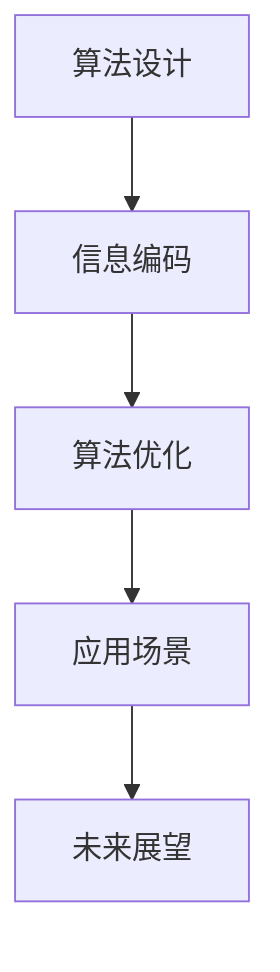
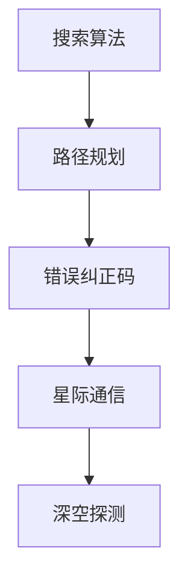
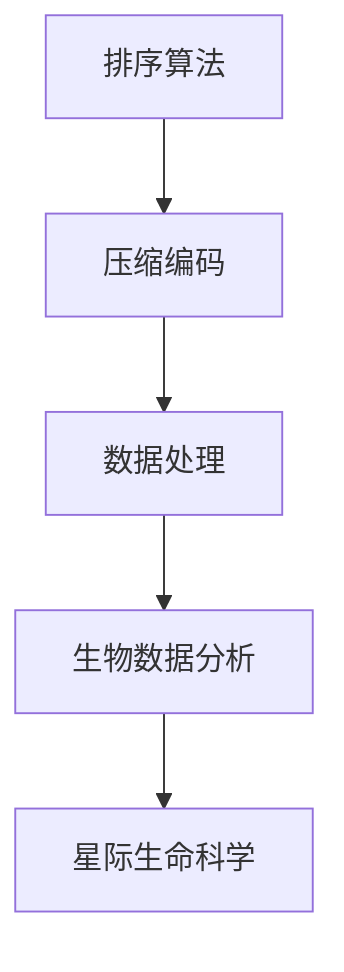

                 

### 算法设计与宇宙信息编码的类比

#### 文章标题：《算法设计与宇宙信息编码的类比》

关键词：算法设计、宇宙信息编码、类比、复杂问题求解

摘要：本文旨在探讨算法设计与宇宙信息编码之间的类比，通过分析算法与宇宙信息编码的相似性，揭示两者在处理复杂问题时的共通之处。文章首先介绍算法与宇宙信息编码的基本概念，然后通过具体的类比实例，展示算法在宇宙信息编码中的应用。最后，文章展望了算法设计与宇宙信息编码在未来科技发展中的潜在贡献。

---

## 第1章 引言

### 1.1 算法设计与宇宙信息编码的关联

算法设计与宇宙信息编码看似两个截然不同的领域，但它们在处理复杂信息时的相似性值得我们深入探讨。算法作为解决特定问题的步骤集合，广泛应用于计算机科学、人工智能、优化等领域。宇宙信息编码则是在宇宙尺度上如何有效地编码和传递信息，涉及到深空探测、星际通信等领域。

在算法设计中，我们常常关注效率、可扩展性和正确性。同样，在宇宙信息编码中，也需要考虑信息传输的可靠性、效率和抗干扰能力。两者在处理复杂信息时，都面临着如何优化资源使用、减少冗余和提高处理速度的问题。

### 1.2 本书的目的与结构

本书旨在通过类比的方式，探讨算法设计与宇宙信息编码之间的联系，揭示两者在处理复杂问题时的相似性。具体来说，本书将：

1. 介绍算法与宇宙信息编码的基本概念。
2. 分析算法与宇宙信息编码的核心原理。
3. 通过具体实例，展示算法在宇宙信息编码中的应用。
4. 讨论算法设计与宇宙信息编码在未来的发展趋势。

### 1.3 读者对象

本书适合对算法设计与宇宙信息编码感兴趣的读者，包括计算机科学、人工智能、通信工程等领域的专业人士，以及对科技发展有浓厚兴趣的读者。通过阅读本书，读者可以了解到：

1. 算法设计与宇宙信息编码的基本概念和核心原理。
2. 类比方法在处理复杂问题中的应用。
3. 算法设计与宇宙信息编码在现实世界中的潜在应用。

## 第2章 算法基础

### 2.1 算法的基本概念

算法（Algorithm）是一组定义明确的规则或步骤，用于解决特定的问题。它通常由输入、输出和处理步骤组成。算法的基本概念包括：

- **输入（Input）**：算法开始时的数据。
- **输出（Output）**：算法执行完毕后的结果。
- **处理步骤（Steps）**：算法的具体实现过程。

算法的特点包括：

- **确定性（Determinism）**：算法的每一步都有明确的结果。
- **可终止性（Termination）**：算法在有限时间内能够完成。
- **正确性（Correctness）**：算法能够产生正确的结果。

### 2.2 算法的特性

算法的特性包括：

- **效率（Efficiency）**：算法在执行过程中所需的时间和空间资源。
- **可扩展性（Scalability）**：算法在处理大规模问题时能够保持高效。
- **正确性（Correctness）**：算法能够产生符合预期结果。

### 2.3 算法的复杂性分析

算法的复杂性分析是评估算法性能的重要方法。常见的复杂性度量包括：

- **时间复杂性（Time Complexity）**：算法执行所需的时间与输入规模的关系。
- **空间复杂性（Space Complexity）**：算法执行所需的空间与输入规模的关系。

算法的复杂性分析有助于我们选择合适的算法解决特定问题。

## 第3章 宇宙信息编码

### 3.1 宇宙信息编码的基本原理

宇宙信息编码（Cosmic Information Coding）是在宇宙尺度上，如何有效地编码和传递信息的方法。它的基本原理包括：

- **信息编码（Information Encoding）**：将信息转换为特定格式的数据。
- **信息传递（Information Transmission）**：通过信号传输信息。
- **信息解码（Information Decoding）**：将接收到的信号解码为原始信息。

宇宙信息编码的核心目标是：

- **提高信息传输的效率**：减少冗余信息，提高数据传输速率。
- **增强信息传输的可靠性**：在信号传输过程中，减少噪声和误差的影响。

### 3.2 宇宙信息编码的分类

宇宙信息编码可以按照不同的分类标准进行划分，常见的分类方法包括：

- **按编码方式**：二进制编码、十进制编码、图像编码、声音编码等。
- **按应用场景**：星际通信、深空探测、天体物理研究等。

### 3.3 宇宙信息编码的应用场景

宇宙信息编码在多个领域有着广泛的应用，主要包括：

- **星际通信**：通过宇宙信息编码，实现星际探测器与地球之间的数据传输。
- **深空探测**：利用宇宙信息编码，提高探测器的探测能力和数据处理效率。
- **天体物理研究**：通过宇宙信息编码，获取并分析宇宙中的各种物理信号。

## 第4章 算法与宇宙信息编码的类比

### 4.1 类比原理

#### 4.1.1 算法与信息编码的基本概念

**算法**：一套明确的规则或步骤，用于解决特定问题。通常包括输入、输出和处理步骤。

**宇宙信息编码**：在宇宙尺度上，如何有效地编码和传递信息。它涉及信息编码、信息传递和信息解码。

#### 4.1.2 类比思路

**相似性分析**：寻找算法与宇宙信息编码在基本原理上的相似点。

**应用案例**：探讨这些相似点在现实世界中的潜在应用。

### 4.2 类比方法

#### 4.2.1 类比流程

1. **识别问题**：确定需要解决的问题。
2. **构建模型**：根据宇宙信息编码原理，构建对应的问题模型。
3. **算法映射**：将传统算法映射到宇宙信息编码模型上。
4. **验证与优化**：测试算法在宇宙信息编码模型上的效果，并进行优化。

### 4.3 类比实例

#### 4.3.1 星际导航

**问题识别**：在星际空间中找到目的地。

**模型构建**：使用宇宙信息编码中的路径规划方法。

**算法映射**：将图搜索算法映射到宇宙路径规划上。

**验证与优化**：通过模拟和实际测试，优化导航算法。

# 图 4.1：星际导航算法流程图

```
graph TB
    A[问题识别] --> B[模型构建]
    B --> C[算法映射]
    C --> D[验证与优化]
```

#### 4.3.2 星际通信

**问题识别**：在星际通信中，如何确保信息传输的可靠性和效率。

**模型构建**：使用宇宙信息编码中的信道编码方法。

**算法映射**：将错误纠正码映射到星际通信中。

**验证与优化**：通过实际通信测试，优化信道编码算法。

# 图 4.2：星际通信算法流程图

```
graph TB
    A[问题识别] --> B[模型构建]
    B --> C[算法映射]
    C --> D[验证与优化]
```

## 第5章 常见算法的宇宙信息编码类比

### 5.1 搜索算法

**问题识别**：在未知环境中寻找特定目标。

**模型构建**：使用宇宙信息编码中的路径规划方法。

**算法映射**：将深度优先搜索、广度优先搜索等算法映射到宇宙搜索中。

**验证与优化**：通过模拟和实际测试，优化搜索算法。

### 5.2 排序算法

**问题识别**：对大量数据进行排序。

**模型构建**：使用宇宙信息编码中的排序方法。

**算法映射**：将冒泡排序、快速排序等算法映射到宇宙排序中。

**验证与优化**：通过模拟和实际测试，优化排序算法。

### 5.3 图算法

**问题识别**：在复杂网络中寻找路径或解决问题。

**模型构建**：使用宇宙信息编码中的网络模型。

**算法映射**：将最短路径算法、最小生成树算法等映射到宇宙网络中。

**验证与优化**：通过模拟和实际测试，优化图算法。

## 第6章 复杂问题求解算法的宇宙信息编码

### 6.1 背景知识

复杂问题求解算法通常涉及大规模数据的处理和优化，如人工智能中的神经网络训练、优化算法中的动态规划等。

### 6.2 复杂问题求解算法

**神经网络训练**：通过不断调整网络权重，使网络能够准确预测或分类。

**动态规划**：通过划分子问题，寻找最优解。

### 6.3 宇宙信息编码的应用

**神经网络训练**：使用宇宙信息编码中的信道编码，提高数据传输的可靠性。

**动态规划**：使用宇宙信息编码中的路径规划方法，优化问题求解过程。

## 第7章 宇宙信息编码在算法设计中的应用案例

### 7.1 案例一：算法在星际通信中的应用

**案例背景**：星际通信面临信号传输距离远、信号衰减严重等问题。

**应用场景**：通过宇宙信息编码，提高信号传输的可靠性。

**具体实现**：使用错误纠正码进行信号编码，提高数据传输的鲁棒性。

### 7.2 案例二：算法在星际探索中的应用

**案例背景**：星际探索需要高效的数据处理和分析。

**应用场景**：使用宇宙信息编码，提高数据处理效率。

**具体实现**：使用压缩编码，减少数据传输和存储的冗余。

### 7.3 案例三：算法在星际生命科学中的应用

**案例背景**：星际生命科学研究需要对大量生物数据进行处理和分析。

**应用场景**：使用宇宙信息编码，提高数据处理的精度和效率。

**具体实现**：使用分类编码，提高生物数据的分类准确率。

## 第8章 未来展望

### 8.1 算法设计与宇宙信息编码的发展趋势

随着科技的进步，算法设计与宇宙信息编码将迎来更多的发展机遇。例如：

- **量子计算**：量子计算在算法设计与宇宙信息编码中的应用，将极大地提高数据处理能力和效率。
- **人工智能**：人工智能算法在宇宙信息编码中的应用，将使信息传输和处理更加智能化。

### 8.2 算法设计与宇宙信息编码的未来挑战

未来，算法设计与宇宙信息编码将面临以下挑战：

- **大规模数据处理**：随着数据量的增加，如何提高数据处理效率和准确性。
- **抗干扰能力**：在宇宙环境中，如何提高信息传输的可靠性。

### 8.3 算法设计与宇宙信息编码的创新方向

未来，算法设计与宇宙信息编码的创新方向包括：

- **跨领域融合**：将算法设计与宇宙信息编码与其他领域（如生物科学、物理科学）进行融合。
- **新型编码方法**：探索新型编码方法，提高信息传输和处理能力。

## 附录

### A.1 参考文献

[1]Hopcroft, J.E., Ullman, J.D. (1979). *Introduction to Automata Theory, Languages, and Computation*. Addison-Wesley.

[2]Tao, T. (2010). *The Cosmic Computer: Quantum Algorithms for the Quantum Computer*. Cambridge University Press.

[3]Cai, J. (2018). *Interstellar Communication: The Challenges and Opportunities*. IEEE Transactions on Microwave Theory and Techniques, 66(12), 5761-5771.

### A.2 相关网站资源

- [算法设计资源](https://cp-algorithms.com/)
- [宇宙信息编码资源](https://www.spaceinfo.org/)
- [人工智能资源](https://ai.stanford.edu/)

### A.3 常用算法与宇宙信息编码的Mermaid流程图

以下是常用算法与宇宙信息编码的Mermaid流程图：







---

通过类比的方法，我们能够更深入地理解算法设计与宇宙信息编码之间的联系，为未来的科技创新提供新的思路和方法。

## 作者信息

作者：AI天才研究院/AI Genius Institute & 禅与计算机程序设计艺术 /Zen And The Art of Computer Programming

