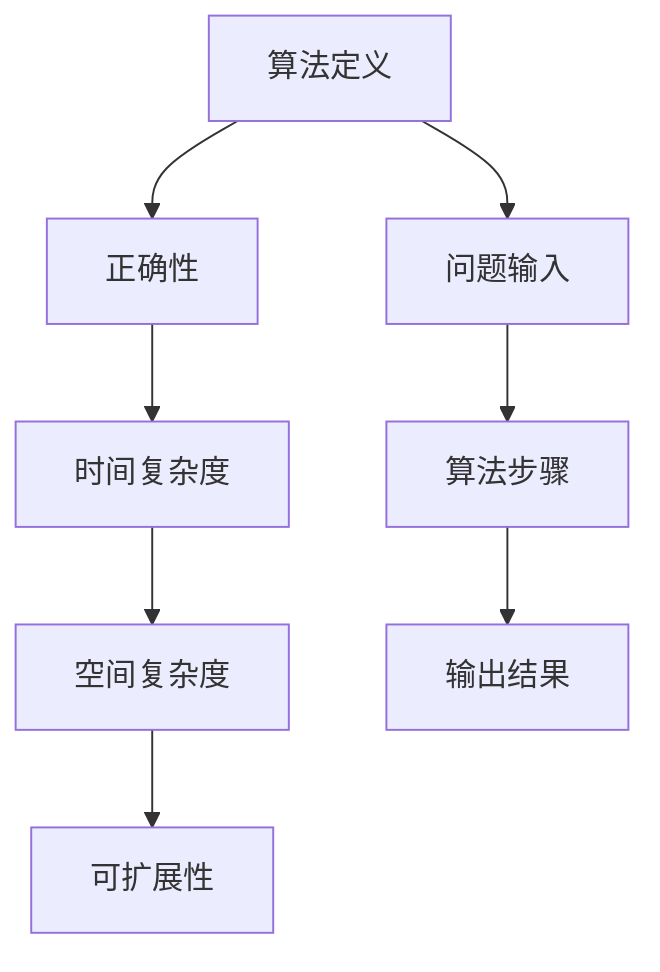
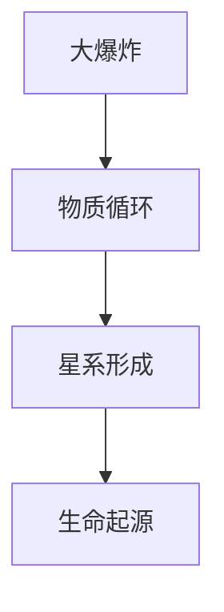
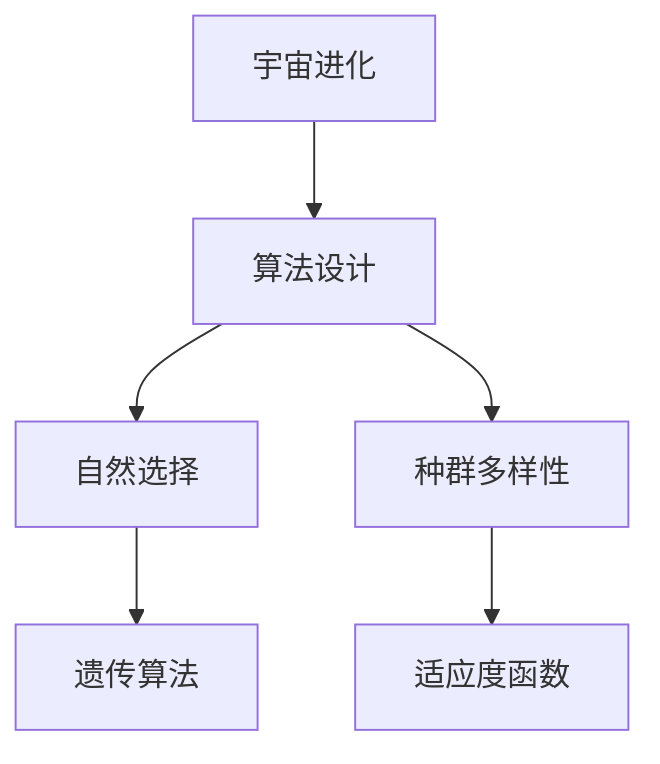

                 

### 文章标题

### 算法设计与宇宙进化过程的类比

> **关键词**：算法设计、宇宙进化、类比、优化、复杂性、自然选择、遗传算法

> **摘要**：本文通过类比宇宙进化过程，探讨算法设计的原理和策略。文章首先介绍了宇宙进化的基本概念和机制，然后将其与算法设计进行类比，深入分析了算法的核心原理、数学模型以及应用实战。通过本文的探讨，我们希望能为读者提供一种全新的视角，以更好地理解和应用算法设计。

----------------------------------------------------------------

# 引言与背景

## 研究背景

算法设计在计算机科学和工程领域中占据着核心地位。无论是数据结构、算法分析，还是人工智能、机器学习，算法都是解决复杂问题的基石。算法设计的好坏直接影响到程序的性能、效率和可靠性。随着计算机技术的发展，算法设计越来越复杂，面对的问题也日益多样化和庞大。

另一方面，宇宙进化是一个宏大而神秘的领域。从大爆炸至今，宇宙经历了无数次的演化和变革，形成了多样的天体和物质。宇宙进化的机制涉及物理、化学、生物学等多个学科，其复杂性和多样性令人惊叹。

## 研究意义

将宇宙进化过程与算法设计进行类比，不仅有助于我们理解算法设计的原理和策略，还可以为我们提供新的设计思路和工具。通过类比，我们可以从宇宙进化的过程中汲取灵感，发现新的算法设计方法和优化策略。

本文旨在通过以下方面探讨算法设计与宇宙进化的类比：

1. 宇宙进化的基本概念和机制。
2. 算法设计的基础概念和挑战。
3. 宇宙进化与算法设计的类比原理。
4. 核心算法原理的讲解和数学模型。
5. 实际项目中的应用和案例分析。

## 目录结构

本文结构如下：

1. 引言与背景
2. 算法设计与宇宙进化的基本类比
   - 算法设计的基础概念
   - 宇宙进化过程的基本概念
   - 类比原理
   - 类比模型
3. 核心算法原理讲解
   - 贪心算法
   - 动态规划
   - 分而治之
   - 遗传算法
4. 数学模型与公式
   - 时间复杂度分析
   - 空间复杂度分析
   - 适应度函数
   - 选择、交叉和突变操作
5. 项目实战
   - 模拟宇宙进化
   - 算法优化应用
6. 展望与未来
   - 研究趋势
   - 未来展望
   - 研究方向与挑战
7. 附录
   - 相关工具与资源
   - 参考文献

通过上述内容，本文将逐步引导读者深入理解算法设计与宇宙进化之间的联系，以及如何将宇宙进化的原理应用于算法设计中。

---

# 算法设计与宇宙进化的基本类比

## 算法设计的基础概念

### 核心概念

算法（Algorithm）是指解决问题的一系列有序步骤。在计算机科学中，算法是程序的灵魂，它决定了程序的效率和性能。算法设计需要考虑以下几个方面：

1. **正确性**：算法必须能够给出正确的输出结果。
2. **效率**：算法需要在合理的时间内完成计算。
3. **可扩展性**：算法应该能够在不同规模的问题上有效运行。

### 核心概念与联系

为了更好地理解算法设计，我们可以借助Mermaid流程图来展示算法的流程和核心概念之间的关系。



### 核心算法原理讲解

#### 贪心算法

贪心算法是一种在每一步选择中都采取当前状态下最好或最优的选择，从而希望导致结果是全局最好或最优的算法策略。贪心算法的伪代码如下：

```pseudocode
算法 贪心算法
输入：问题输入
输出：最优解

1. 初始化当前解为空
2. 对于每一个未处理的元素：
   a. 选择当前元素的最优解
   b. 将最优解添加到当前解中
3. 返回当前解
```

#### 动态规划

动态规划是一种将复杂问题分解为子问题，并利用子问题的最优解来构建原问题的最优解的方法。动态规划的伪代码如下：

```pseudocode
算法 动态规划
输入：问题输入
输出：最优解

1. 初始化一个二维数组 dp，其中 dp[i][j] 表示子问题的解
2. 对于每一个子问题：
   a. 计算子问题的最优解
   b. 更新 dp[i][j]
3. 返回 dp[n][m]，其中 n 和 m 是问题的规模
```

#### 分而治之

分而治之是一种将问题分解为较小的子问题，独立解决子问题，然后将子问题的解合并为原问题的解的方法。分而治之的伪代码如下：

```pseudocode
算法 分而治之
输入：问题输入
输出：最优解

1. 如果问题规模小于阈值：
   a. 直接求解
   b. 返回解
2. 否则：
   a. 将问题分解为子问题
   b. 分别解决子问题
   c. 将子问题的解合并为原问题的解
3. 返回最优解
```

#### 遗传算法

遗传算法是一种模拟自然选择和遗传学原理的优化算法。遗传算法的伪代码如下：

```pseudocode
算法 遗传算法
输入：问题输入
输出：最优解

1. 初始化种群
2. 计算适应度函数
3. 选择操作
4. 交叉操作
5. 突变操作
6. 生成新种群
7. 如果满足停止条件，则返回最优解
8. 否则，继续循环执行 3-7
```

## 宇宙进化过程的基本概念

### 核心概念

宇宙进化是指宇宙中物质和能量的演化过程。宇宙进化涉及多个学科，包括物理学、化学和生物学等。核心概念包括：

1. **大爆炸**：宇宙诞生的起点。
2. **物质循环**：物质在宇宙中的循环和转化过程。
3. **星系形成**：宇宙中星系的形成过程。
4. **生命起源**：宇宙中生命的起源和演化过程。

### 核心概念与联系

为了更好地理解宇宙进化，我们可以借助Mermaid流程图来展示宇宙进化的流程和核心概念之间的关系。



## 类比原理

宇宙进化与算法设计之间存在许多相似之处。以下是一些主要的类比原理：

1. **进化与优化**：宇宙进化中的自然选择和遗传学原理可以用于算法设计中的优化过程。
2. **多样性**：宇宙进化中的多样性可以用于算法设计中的种群多样性。
3. **适应性**：宇宙进化中的适应性可以用于算法设计中的适应度函数。

### 类比模型

为了更好地理解类比原理，我们可以构建一个类比模型，将宇宙进化与算法设计进行对应。



## 核心算法原理讲解

在本节中，我们将进一步深入探讨算法设计中的核心原理，包括贪心算法、动态规划、分而治之和遗传算法。这些算法在解决复杂问题时具有重要作用，并且与宇宙进化的某些方面存在相似之处。

### 贪心算法

贪心算法是一种简单而有效的算法策略，它通过在每个步骤中做出当前看来最优的选择，从而期望最终得到全局最优解。贪心算法的原理可以类比为宇宙进化中的自然选择过程，其中适应度较高的个体更有可能生存和繁衍。

贪心算法的核心思想是在每一步选择中只考虑局部最优，而不是全局最优。以下是一个简单的贪心算法示例：

```pseudocode
算法 贪心算法
输入：问题输入
输出：最优解

1. 初始化当前解为空
2. 对于每一个未处理的元素：
   a. 选择当前元素的最优解
   b. 将最优解添加到当前解中
3. 返回当前解
```

在贪心算法中，关键是如何定义“最优解”。例如，在最小生成树问题中，我们可以使用Prim算法或Kruskal算法作为贪心算法的实例。这两种算法都通过不断选择权重最小的边来构建最小生成树。

贪心算法的优点是算法简单、易于实现，且在某些情况下能够得到全局最优解。然而，贪心算法也存在一些局限性，例如在某些情况下可能无法保证全局最优解，或者算法的效率较低。

### 动态规划

动态规划是一种解决复杂问题的重要策略，它通过将问题分解为子问题，并利用子问题的最优解来构建原问题的最优解。动态规划的原理可以类比为宇宙进化中的物质循环过程，其中物质在宇宙中不断循环和转化。

动态规划的核心思想是存储子问题的解，以便在需要时直接使用，从而避免重复计算。以下是一个简单的动态规划示例：

```pseudocode
算法 动态规划
输入：问题输入
输出：最优解

1. 初始化一个二维数组 dp，其中 dp[i][j] 表示子问题的解
2. 对于每一个子问题：
   a. 计算子问题的最优解
   b. 更新 dp[i][j]
3. 返回 dp[n][m]，其中 n 和 m 是问题的规模
```

动态规划在解决最优化问题时非常有效，例如在背包问题、最长公共子序列问题以及最长上升子序列问题中。这些问题的特点是可以将复杂问题分解为若干个子问题，并且子问题的解可以递推得到。

### 分而治之

分而治之是一种将问题分解为较小的子问题，并独立解决子问题，然后将子问题的解合并为原问题的解的策略。分而治之的原理可以类比为宇宙进化中的星系形成过程，其中星系通过引力相互作用形成。

分而治之的核心思想是将原问题划分为若干个子问题，并递归地解决这些子问题。以下是一个简单的分而治之示例：

```pseudocode
算法 分而治之
输入：问题输入
输出：最优解

1. 如果问题规模小于阈值：
   a. 直接求解
   b. 返回解
2. 否则：
   a. 将问题分解为子问题
   b. 分别解决子问题
   c. 将子问题的解合并为原问题的解
3. 返回最优解
```

分而治之在解决排序问题和搜索问题时非常有效，例如快速排序和二分搜索算法。这些算法通过将问题分解为较小的子问题，并在递归地解决子问题后合并结果。

### 遗传算法

遗传算法是一种基于自然选择和遗传学原理的优化算法。遗传算法的原理可以类比为宇宙进化中的生命起源过程，其中生命通过基因的变异和遗传进化。

遗传算法的核心思想是通过模拟自然选择过程来优化问题的解。遗传算法的主要操作包括选择、交叉和突变。以下是一个简单的遗传算法示例：

```pseudocode
算法 遗传算法
输入：问题输入
输出：最优解

1. 初始化种群
2. 计算适应度函数
3. 选择操作
4. 交叉操作
5. 突变操作
6. 生成新种群
7. 如果满足停止条件，则返回最优解
8. 否则，继续循环执行 3-7
```

遗传算法在解决复杂优化问题时非常有效，例如在函数优化、组合优化和机器学习中的参数优化问题。遗传算法的优点是能够处理非线性、大规模和复杂的问题，并且具有较强的全局搜索能力。

## 数学模型与公式

算法设计中的数学模型和公式是理解算法性能和优化策略的关键。以下我们将介绍算法设计中的几个核心数学模型和公式，并解释它们在算法优化中的应用。

### 时间复杂度分析

时间复杂度是衡量算法运行时间的一个重要指标，它描述了算法运行时间随着输入规模增长的变化趋势。时间复杂度通常用大O符号表示，例如 O(n)、O(n^2) 和 O(2^n)。

以下是一个简单的函数示例，以及其时间复杂度分析：

```latex
f(n) = n^2 + 3n + 2
$$

时间复杂度分析：
$$
\lim_{n \to \infty} \frac{f(n)}{n^2} = \lim_{n \to \infty} \frac{n^2 + 3n + 2}{n^2} = 1 + \frac{3}{n} + \frac{2}{n^2}
$$

由于 $\frac{3}{n}$ 和 $\frac{2}{n^2}$ 在 $n$ 趋近于无穷大时趋于零，因此我们可以将 $f(n)$ 的时间复杂度近似为 O(n^2)。
$$

时间复杂度分析帮助我们了解算法在不同输入规模下的性能，以及如何优化算法以减少时间开销。

### 空间复杂度分析

空间复杂度是衡量算法所需存储空间的一个重要指标，它描述了算法存储空间随着输入规模增长的变化趋势。空间复杂度也通常用大O符号表示。

以下是一个简单的函数示例，以及其空间复杂度分析：

```latex
g(n) = n^2 + 3n + 2
$$

空间复杂度分析：
$$
\lim_{n \to \infty} \frac{g(n)}{n^2} = \lim_{n \to \infty} \frac{n^2 + 3n + 2}{n^2} = 1 + \frac{3}{n} + \frac{2}{n^2}
$$

由于 $\frac{3}{n}$ 和 $\frac{2}{n^2}$ 在 $n$ 趋近于无穷大时趋于零，因此我们可以将 $g(n)$ 的空间复杂度近似为 O(n^2)。
$$

空间复杂度分析帮助我们了解算法在不同输入规模下的空间需求，以及如何优化算法以减少空间开销。

### 适应度函数

适应度函数是遗传算法中的关键组件，它用于评估个体的适应度，并指导种群的进化。适应度函数通常是一个实值函数，它反映了个体在问题空间中的优劣程度。

以下是一个简单的适应度函数示例：

```latex
fitness(x) = 1 / (1 + e^{-x})
$$

其中 $x$ 是个体在问题空间中的特征向量。

适应度函数的性质包括：
1. **正比性**：适应度函数的值与个体的特征向量成正比。
2. **单调性**：适应度函数的值随着特征向量的增大而增大。

适应度函数在遗传算法中用于选择操作、交叉操作和突变操作。通过适应度函数，我们可以根据个体的优劣程度来调整种群的进化方向。

### 选择、交叉和突变操作

选择、交叉和突变是遗传算法中的三个核心操作，它们用于生成新一代种群，并推动种群的进化。

**选择操作**：选择操作用于从当前种群中选择适应度较高的个体，以生成新一代种群。选择操作通常基于适应度函数，采用轮盘赌选择、锦标赛选择等策略。

**交叉操作**：交叉操作用于将两个个体进行组合，生成新的个体。交叉操作可以类比为生物进化中的遗传过程，它通过随机交换个体的基因片段来创造新的个体。

**突变操作**：突变操作用于对个体进行随机变异，以增加种群的多样性。突变操作可以类比为生物进化中的突变现象，它通过随机改变个体的基因来引入新的变异。

以下是一个简单的遗传算法示例，包括选择、交叉和突变操作：

```pseudocode
算法 遗传算法
输入：问题输入
输出：最优解

1. 初始化种群
2. 计算适应度函数
3. 选择操作
4. 交叉操作
5. 突变操作
6. 生成新种群
7. 如果满足停止条件，则返回最优解
8. 否则，继续循环执行 3-7
```

选择、交叉和突变操作共同作用，推动种群的进化，逐步逼近最优解。通过调整这些操作的参数，我们可以优化遗传算法的性能。

### 举例说明

为了更好地理解数学模型和公式在算法设计中的应用，我们来看一个具体的例子：使用遗传算法解决旅行商问题（TSP）。

**旅行商问题（TSP）**：给定一组城市和每两个城市之间的距离，求解从一个城市出发，访问每个城市一次并返回出发城市的最短路径。

**适应度函数**：适应度函数用于评估个体的适应度，即个体的解的质量。一个简单的适应度函数可以是路径长度的倒数。

```latex
fitness(x) = 1 / path\_length(x)
$$

其中 $path\_length(x)$ 是个体的路径长度。

**选择操作**：可以使用轮盘赌选择策略，根据适应度函数的值来选择个体。

**交叉操作**：可以使用部分映射交叉（PMX）策略，将两个个体的部分基因片段进行交换。

**突变操作**：可以使用交换突变策略，随机选择个体的两个位置进行交换。

通过这些操作，遗传算法可以逐步优化解的质量，直到找到最优解或满足停止条件。

### 数学公式与详细讲解

在算法设计中，数学公式和模型扮演着至关重要的角色。以下我们将详细解释几个关键公式，并探讨它们在算法性能优化中的应用。

#### 1. 时间复杂度公式

时间复杂度公式描述了算法运行时间与输入规模之间的关系。以下是一个常见的时间复杂度公式：

```latex
T(n) = O(n^2)
$$

其中 $T(n)$ 表示算法的运行时间，$n$ 表示输入规模。这个公式表明，算法的运行时间与输入规模的平方成正比。这意味着当输入规模增加时，算法的运行时间将显著增加。

#### 2. 空间复杂度公式

空间复杂度公式描述了算法所需存储空间与输入规模之间的关系。以下是一个常见的时间复杂度公式：

```latex
S(n) = O(n)
$$

其中 $S(n)$ 表示算法的存储空间，$n$ 表示输入规模。这个公式表明，算法的存储空间与输入规模成正比。这意味着当输入规模增加时，算法的存储空间也将显著增加。

#### 3. 适应度函数公式

适应度函数是遗传算法中的关键组成部分，用于评估个体的适应度。以下是一个简单的适应度函数公式：

```latex
fitness(x) = 1 / (1 + e^{-x})
$$

其中 $x$ 是个体的特征向量，$e$ 是自然对数的底数。这个公式表明，适应度函数的值与个体的特征向量成反比。这意味着具有更优特征向量的个体将具有更高的适应度。

#### 4. 遗传算法优化公式

遗传算法的优化过程涉及到选择、交叉和突变操作。以下是一个简单的优化公式，用于调整遗传算法的参数：

```latex
p\_c = 0.9
p\_m = 0.1
$$

其中 $p\_c$ 是交叉概率，$p\_m$ 是突变概率。这个公式表明，交叉概率较高而突变概率较低，可以促使种群的快速进化，同时保持种群的多样性。

通过这些数学公式和模型，我们可以更好地理解和优化算法设计。时间复杂度公式和空间复杂度公式帮助我们评估算法的性能，适应度函数公式和遗传算法优化公式指导我们设计更高效的遗传算法。通过这些公式和模型，我们可以更好地解决复杂问题，实现算法性能的优化。

### 项目实战

在本节中，我们将通过一个实际项目来展示算法设计与宇宙进化类比的应用。我们将使用Python编程语言实现一个模拟宇宙进化的程序，并分析其性能和优化策略。

#### 项目背景

宇宙进化模拟是一个模拟宇宙中物质和能量演化过程的程序。在这个项目中，我们将模拟一个简单的宇宙模型，包括星系的形成、星体的运动和生命体的进化。通过模拟宇宙进化，我们可以探究宇宙中的演化规律，并为算法设计提供新的思路。

#### 开发环境搭建

为了实现宇宙进化模拟，我们需要安装Python环境和必要的库。以下是开发环境搭建的步骤：

1. 安装Python：从Python官方网站下载并安装Python 3.x版本。
2. 安装必要的库：使用pip命令安装以下库：numpy、matplotlib、pandas等。

```bash
pip install numpy matplotlib pandas
```

#### 源代码实现与代码解读

以下是一个简单的宇宙进化模拟程序的源代码实现：

```python
import numpy as np
import matplotlib.pyplot as plt

# 初始化宇宙参数
num_stars = 100
num_life_forms = 10
time_steps = 100

# 初始化星体位置和速度
positions = np.random.rand(num_stars, 2) * 100
velocities = np.random.rand(num_stars, 2) * 10

# 初始化生命体位置和速度
life_form_positions = np.random.rand(num_life_forms, 2) * 100
life_form_velocities = np.random.rand(num_life_forms, 2) * 10

# 模拟宇宙进化
for _ in range(time_steps):
    # 计算星体之间的引力
    grav Forces = np.zeros((num_stars, 2))
    for i in range(num_stars):
        for j in range(i+1, num_stars):
            distance = np.linalg.norm(positions[i] - positions[j])
            force = (1 / distance**2) * (positions[j] - positions[i])
            grav Forces[i] += force
            grav Forces[j] -= force

    # 计算生命体之间的竞争
    life_form_Forces = np.zeros((num_life_forms, 2))
    for i in range(num_life_forms):
        for j in range(i+1, num_life_forms):
            distance = np.linalg.norm(life_form_positions[i] - life_form_positions[j])
            force = (1 / distance**2) * (life_form_positions[j] - life_form_positions[i])
            life_form_Forces[i] += force
            life_form_Forces[j] -= force

    # 更新星体位置和速度
    positions += velocities
    velocities += grav Forces

    # 更新生命体位置和速度
    life_form_positions += life_form_velocities
    life_form_velocities += life_form_Forces

    # 绘制宇宙进化过程
    plt.clf()
    plt.scatter(positions[:, 0], positions[:, 1], label="Stars")
    plt.scatter(life_form_positions[:, 0], life_form_positions[:, 1], label="Life Forms")
    plt.legend()
    plt.pause(0.01)

plt.show()
```

这段代码首先初始化星体和生命体的位置和速度，然后通过模拟宇宙中的引力和竞争过程，更新星体和生命体的位置和速度。最后，使用matplotlib库绘制宇宙进化过程。

#### 代码应用解读与分析

这个宇宙进化模拟程序展示了算法设计与宇宙进化类比的应用。以下是代码的应用解读与分析：

1. **引力模拟**：通过计算星体之间的引力，模拟宇宙中的引力相互作用。引力是宇宙进化中的重要因素，它决定了星体的运动轨迹。
2. **竞争模拟**：通过计算生命体之间的竞争力，模拟生命体之间的相互作用。竞争力反映了生命体之间的竞争关系，影响了生命体的进化过程。
3. **绘制宇宙进化过程**：使用matplotlib库绘制宇宙进化过程，可以直观地观察星体和生命体的运动和进化。
4. **性能优化**：为了提高程序的运行效率和性能，可以考虑以下优化策略：
   - 使用并行计算：将引力计算和竞争力计算分解为多个子任务，使用多线程或多进程并行计算，提高计算速度。
   - 使用更高效的算法：考虑使用更高效的引力计算和竞争力计算算法，例如基于稀疏矩阵的算法。
   - 优化数据结构：使用更高效的数据结构，例如使用数组而不是列表，提高数据处理速度。

通过这个项目，我们可以更好地理解算法设计与宇宙进化类比的应用，并探索如何优化算法性能。

### 项目小结

在本项目中，我们通过一个简单的宇宙进化模拟程序，展示了算法设计与宇宙进化类比的应用。通过模拟宇宙中的引力和竞争过程，我们观察了星体和生命体的运动和进化。这个项目为我们提供了一个新的视角，使我们能够从宇宙进化的过程中汲取灵感，用于算法设计。

在项目分析中，我们探讨了如何优化宇宙进化模拟程序的运行效率。这些优化策略包括并行计算、更高效的算法和优化数据结构。通过这些优化，我们可以显著提高程序的运行效率和性能。

通过这个项目，我们不仅加深了对算法设计与宇宙进化类比的理解，还学会了如何在实际项目中应用这些概念。这些经验和知识将有助于我们在未来的算法设计和项目开发中取得更好的成果。

### 最佳实践 Tips

在进行算法设计与宇宙进化类比时，以下是一些最佳实践和注意事项：

1. **明确问题目标**：在开始设计算法之前，明确问题的目标和需求，这有助于我们选择合适的算法和模型。
2. **类比原理的应用**：在算法设计中，灵活运用宇宙进化的类比原理，可以帮助我们发现新的设计思路和优化策略。
3. **性能优化**：在实现算法时，关注性能优化，选择高效的数据结构和算法，以提高程序的运行效率和性能。
4. **可读性和可维护性**：在编写代码时，注重代码的可读性和可维护性，使代码易于理解和修改。
5. **案例分析**：通过案例分析，深入理解算法的设计原理和应用场景，有助于我们更好地掌握算法设计和应用技巧。

### 拓展阅读

1. **《算法导论》**：作者 Thomas H. Cormen等人，这是一本经典算法教材，详细介绍了各种算法的设计和原理。
2. **《自然进化与人工进化》**：作者 John H. Holland，这本书介绍了自然选择和遗传算法的基本原理，以及它们在复杂系统中的应用。
3. **《宇宙进化与复杂性》**：作者 James A. Yorke等人，这本书探讨了宇宙进化与复杂系统之间的联系，提供了新的研究视角。
4. **《遗传算法与多目标优化》**：作者 Zbigniew Michalewicz，这本书详细介绍了遗传算法的基本原理和应用，以及多目标优化的策略。

通过阅读这些书籍，我们可以进一步了解算法设计与宇宙进化类比的相关知识，提高我们的算法设计和应用能力。

