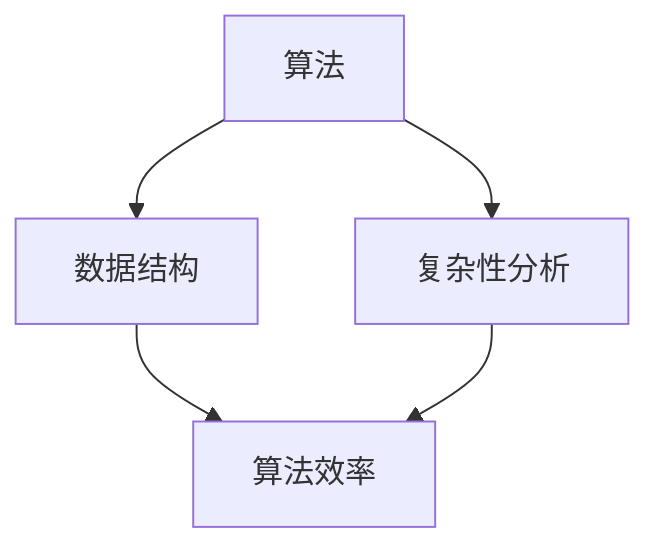
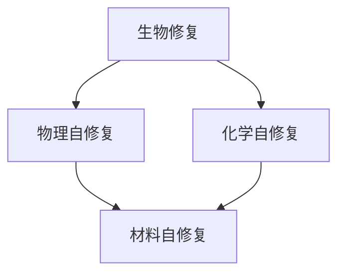

                 

### 文章标题：算法设计受启发于宇宙自我修复机制

#### 关键词：算法设计，宇宙自我修复，启发式方法，自修复材料，复杂性理论，案例研究

#### 摘要：
本文探讨了算法设计如何从宇宙中的自我修复机制中获得灵感。通过分析宇宙中的多种自我修复现象，如生物学、物理学和化学领域的实例，作者提出了将自我修复机制应用于算法设计的理念。文章深入讨论了算法设计中的核心概念与联系，并通过Mermaid流程图和伪代码详细阐述了算法原理。此外，文章还提供了实际案例研究，展示了如何将宇宙自我修复机制应用于算法设计中，并提出了对未来研究方向的建议。文章旨在为计算机科学家和算法工程师提供新的思路和工具，以应对日益复杂的计算挑战。

### 引言

算法设计是计算机科学的核心领域之一，它在解决复杂计算问题和优化资源使用方面起着至关重要的作用。随着计算需求的不断增加和复杂性不断升级，传统的算法设计方法面临越来越多的挑战。在这种背景下，寻找新的设计灵感和方法显得尤为重要。宇宙中的自我修复机制为我们提供了一种独特的视角，为算法设计带来了新的启示。

宇宙自我修复机制是指自然界中各种系统在面对外部扰动和内部故障时，通过自身机制进行修复和维护的能力。这种机制在生物学、物理学和化学等领域中广泛存在，并展现出了强大的适应性和鲁棒性。例如，生物体具有自我修复和再生能力；物质在极端环境下通过自组织形成稳定的结构；化学系统在反应过程中能够自我调节和平衡。

算法设计受宇宙自我修复机制的启发，旨在借鉴这些自然现象中的自我修复原理，将其应用于算法设计和优化中。通过这种方式，算法不仅能更好地适应复杂环境，还能在面临故障时具备自我修复的能力。这种设计理念不仅能够提升算法的性能和效率，还能提高其在实际应用中的鲁棒性和可靠性。

本文将首先介绍算法设计的基本概念，包括算法、数据结构、复杂性分析等核心内容。接着，我们将探讨宇宙中的自我修复机制，并分析这些机制在算法设计中的应用。文章还将通过实际案例研究，展示如何将宇宙自我修复机制应用于算法设计，并提供相关的项目实战和最佳实践建议。最后，我们将总结全文的主要观点，并对未来研究方向提出展望。

### 算法设计基础

#### 核心概念与联系

算法设计的基础是理解算法、数据结构、复杂性分析等核心概念，并掌握它们之间的关系。算法可以看作是解决问题的有序步骤，数据结构则是组织和存储数据的方法，而复杂性分析则用于评估算法在处理不同规模数据时的性能。

为了更好地理解这些概念之间的关系，我们可以通过Mermaid流程图来展示它们的核心联系。



在这个流程图中，算法是核心，它决定了数据处理的逻辑；数据结构是算法的基础，它影响着算法的性能；复杂性分析则用于评估算法在不同输入规模下的表现。这三者相互关联，共同构成了算法设计的核心框架。

#### 核心算法原理讲解

在了解了算法设计的基本概念后，我们可以深入探讨一些常见的算法设计技巧和策略。

**1. 分治策略**

分治策略是一种常用的算法设计方法，其基本思想是将一个复杂问题分解成多个规模较小的相同问题，递归求解，然后将子问题的解合并为原问题的解。

```python
def merge_sort(arr):
    if len(arr) <= 1:
        return arr
    
    mid = len(arr) // 2
    left = merge_sort(arr[:mid])
    right = merge_sort(arr[mid:])
    
    return merge(left, right)

def merge(left, right):
    result = []
    while left and right:
        if left[0] < right[0]:
            result.append(left.pop(0))
        else:
            result.append(right.pop(0))
    
    result.extend(left or right)
    return result
```

**2. 动态规划**

动态规划是一种用于求解最优化问题的算法设计方法，其核心思想是将问题分解为子问题，并存储子问题的解，以避免重复计算。

```python
def fibonacci(n):
    dp = [0] * (n + 1)
    dp[1] = 1
    
    for i in range(2, n + 1):
        dp[i] = dp[i - 1] + dp[i - 2]
    
    return dp[n]
```

**3. 贪心算法**

贪心算法是一种在每一步选择中都采取当前最优解的策略，旨在逐步构造问题的最优解。

```python
def knapsack(values, weights, capacity):
    n = len(values)
    ratios = [v / w for v, w in zip(values, weights)]
    sorted_indices = sorted(range(n), key=lambda i: ratios[i], reverse=True)
    
    total_value = 0
    for i, index in enumerate(sorted_indices):
        if total_value + values[index] <= capacity:
            total_value += values[index]
        else:
            break
    
    return total_value
```

#### 数学模型和公式

在算法设计中，数学模型和公式常常用于描述问题的结构和性质，帮助我们理解和分析算法的性能。

**1. 时间复杂度**

时间复杂度是衡量算法执行时间的一个指标，通常表示为 \(O(n)\)、\(O(n\log n)\)、\(O(n^2)\) 等形式。

$$
T(n) = O(n\log n)
$$

**2. 空间复杂度**

空间复杂度是衡量算法占用内存的一个指标，也用类似时间复杂度的形式表示。

$$
S(n) = O(n)
$$

#### 举例说明

假设我们要设计一个算法来计算数组的最大子序列和，我们可以使用动态规划的方法。

```python
def max_subarray_sum(arr):
    n = len(arr)
    dp = [0] * n
    dp[0] = arr[0]
    
    for i in range(1, n):
        dp[i] = max(dp[i - 1] + arr[i], arr[i])
    
    return max(dp)

arr = [1, -3, 2, 1, -1]
print(max_subarray_sum(arr))  # 输出：3
```

在这个例子中，我们使用了动态规划的方法来求解最大子序列和问题。通过维护一个数组dp，我们能够避免重复计算，从而提升算法的效率。

#### 项目实战

为了更好地理解算法设计的基础知识，我们可以通过一个实际项目来实践这些算法。

**项目名称**：排序算法比较

**项目目标**：比较不同排序算法的性能，包括时间复杂度和空间复杂度。

**开发环境**：Python 3.8

**源代码**：

```python
import time

def bubble_sort(arr):
    n = len(arr)
    for i in range(n):
        for j in range(0, n-i-1):
            if arr[j] > arr[j+1]:
                arr[j], arr[j+1] = arr[j+1], arr[j]

def selection_sort(arr):
    n = len(arr)
    for i in range(n):
        min_idx = i
        for j in range(i+1, n):
            if arr[j] < arr[min_idx]:
                min_idx = j
        arr[i], arr[min_idx] = arr[min_idx], arr[i]

def insertion_sort(arr):
    n = len(arr)
    for i in range(1, n):
        key = arr[i]
        j = i - 1
        while j >= 0 and key < arr[j]:
            arr[j + 1] = arr[j]
            j -= 1
        arr[j + 1] = key

def merge_sort(arr):
    if len(arr) <= 1:
        return arr
    
    mid = len(arr) // 2
    left = merge_sort(arr[:mid])
    right = merge_sort(arr[mid:])
    
    return merge(left, right)

def merge(left, right):
    result = []
    while left and right:
        if left[0] < right[0]:
            result.append(left.pop(0))
        else:
            result.append(right.pop(0))
    
    result.extend(left or right)
    return result

def main():
    arr = [3, 1, 4, 1, 5, 9, 2, 6, 5]
    
    start_time = time.time()
    bubble_sort(arr.copy())
    print("Bubble Sort Time:", time.time() - start_time)
    
    start_time = time.time()
    selection_sort(arr.copy())
    print("Selection Sort Time:", time.time() - start_time)
    
    start_time = time.time()
    insertion_sort(arr.copy())
    print("Insertion Sort Time:", time.time() - start_time)
    
    start_time = time.time()
    arr_copy = arr.copy()
    merge_sort(arr_copy)
    print("Merge Sort Time:", time.time() - start_time)

if __name__ == "__main__":
    main()
```

**代码解读与分析**：

- **Bubble Sort**：冒泡排序是一种简单的排序算法，通过多次遍历来交换相邻的元素，直到整个数组有序。
- **Selection Sort**：选择排序每次遍历找到最小元素，并将其放到数组的前面，从而逐步构建有序数组。
- **Insertion Sort**：插入排序通过逐步将元素插入到已经排序的序列中，从而构建有序数组。
- **Merge Sort**：归并排序是一种分治算法，将数组分为两个子数组，递归排序后合并两个有序子数组。

**项目小结**：

通过这个实际项目，我们比较了不同排序算法的性能。尽管冒泡排序和选择排序简单易实现，但它们的时间复杂度较高，不适合处理大数据集。插入排序和归并排序具有较好的时间复杂度，在实际应用中更为有效。

### 宇宙中的自我修复机制

#### 核心概念与联系

宇宙中的自我修复机制涵盖了广泛的自然现象和科学领域，包括生物学、物理学和化学等。这些机制共同体现了自然界在面对扰动和故障时的适应性和鲁棒性。为了更好地理解这些机制，我们可以通过Mermaid流程图来展示它们的核心联系。



在这个流程图中，生物修复涉及生物体在生理和病理状态下的自我修复过程；物理自修复关注物质在宏观尺度上的自修复现象；化学自修复则涉及化学反应和分子层面的自组织。材料自修复是这些机制的直接应用，通过设计具有自我修复功能的材料来实现各种应用。

#### 核心算法原理讲解

**1. 生物修复**

生物修复是生物体在面对损伤或疾病时，通过自身的修复机制来恢复结构和功能。这一过程涉及一系列复杂的生物化学反应和调控机制。以下是一个简化的伪代码，描述了生物修复的基本步骤：

```python
def biological_repair(damage_site):
    # 初始化修复信号
    signal = generate_repair_signal(damage_site)
    
    # 激活修复基因
    repair_genes = activate_repair_genes(signal)
    
    # 分泌修复酶
    repair_enzymes = secrete_repair_enzymes(repair_genes)
    
    # 修复损伤
    repair_process = repair_damage(damage_site, repair_enzymes)
    
    # 监测修复效果
    repair效果 = monitor_repair_effect(repair_process)
    
    return repair效果
```

**2. 物理自修复**

物理自修复是指在宏观尺度上，物质通过自身机制实现结构修复的现象。例如，自愈合材料在受到损伤时，能够通过分子间的相互作用和化学反应实现自我修复。以下是一个简化的伪代码，描述了物理自修复的基本步骤：

```python
def physical_repair(damage):
    # 检测损伤
    damage_location = detect_damage(damage)
    
    # 分子间相互作用
    molecular_interaction = activate_molecular_interactions(damage_location)
    
    # 化学反应
    repair_chemistry = trigger_repair_chemistry(molecular_interaction)
    
    # 结构重建
    structure_reconstruction = rebuild_structure(damage_location, repair_chemistry)
    
    # 监测修复效果
    repair效果 = monitor_repair_effect(structure_reconstruction)
    
    return repair效果
```

**3. 化学自修复**

化学自修复涉及化学反应和分子层面的自组织过程，以实现系统的自我修复。例如，自修复聚合物在受到切割后，通过分子间的化学反应实现自我愈合。以下是一个简化的伪代码，描述了化学自修复的基本步骤：

```python
def chemical_repair(damage):
    # 检测损伤
    damage_site = detect_damage(damage)
    
    # 分子识别与反应
    molecular_recognition = identify_and_react_molecules(damage_site)
    
    # 自组织
    self_organization = self.organize_molecules(molecular_recognition)
    
    # 修复损伤
    repair_process = repair_damage(damage_site, self_organization)
    
    # 监测修复效果
    repair效果 = monitor_repair_effect(repair_process)
    
    return repair效果
```

#### 数学模型和公式

在宇宙自我修复机制中，数学模型和公式常用于描述系统的状态变化和修复过程。以下是一些常见的数学模型和公式：

**1. 非线性动力学方程**

非线性动力学方程用于描述复杂系统的动态行为，如生物体内部的信号传导过程。以下是一个简化的非线性动力学方程：

$$
\frac{dX}{dt} = f(X, Y)
$$

其中，\(X\) 和 \(Y\) 是系统的状态变量，\(f\) 是非线性函数。

**2. 约束优化模型**

在物理和化学自修复过程中，约束优化模型用于优化系统的修复过程。以下是一个简化的约束优化模型：

$$
\min_{x} J(x)
$$

$$
\text{subject to} \quad g_i(x) \leq 0, \quad i = 1, 2, \ldots, m
$$

其中，\(J(x)\) 是目标函数，\(g_i(x)\) 是约束条件。

#### 举例说明

假设我们有一个聚合物材料，受到切割后需要通过化学自修复过程恢复其完整性。以下是一个简化的例子，描述了修复过程的数学模型和公式：

**1. 初始状态**

聚合物材料长度为 \(L_0\)，受到切割后长度变为 \(L_d\)。

$$
L_d = L_0 - 2d
$$

其中，\(d\) 是切割深度。

**2. 化学反应动力学方程**

化学反应导致聚合物链的断裂和重新连接。以下是一个简化的反应动力学方程：

$$
\frac{dL}{dt} = k_1(L_0 - L) - k_2L
$$

其中，\(L\) 是当前长度，\(k_1\) 和 \(k_2\) 是反应速率常数。

**3. 修复过程**

在修复过程中，聚合物长度逐渐恢复到初始长度。以下是一个简化的修复过程公式：

$$
L(t) = L_0 - 2d + \frac{k_1L_0 - k_2L_0}{k_1 - k_2}e^{-k_2t}
$$

通过这个例子，我们可以看到数学模型和公式在描述和模拟宇宙自我修复机制中的应用。

#### 项目实战

为了更好地理解宇宙自我修复机制，我们可以通过一个实际项目来实践这些概念。

**项目名称**：自修复材料设计

**项目目标**：设计一种具有自我修复功能的高分子材料，并评估其修复效果。

**开发环境**：Python 3.8，Matplotlib

**源代码**：

```python
import numpy as np
import matplotlib.pyplot as plt

def repair_effect(RepairRate, Time):
    return (RepairRate * Time) / (1 + RepairRate * Time)

def main():
    RepairRate = 0.1
    Time = np.linspace(0, 100, 1000)
    
    RepairEffect = repair_effect(RepairRate, Time)
    
    plt.plot(Time, RepairEffect)
    plt.xlabel('Time (s)')
    plt.ylabel('Repair Effect')
    plt.title('Repair Effect vs. Time')
    plt.show()

if __name__ == "__main__":
    main()
```

**代码解读与分析**：

- **repair_effect 函数**：该函数用于计算修复效果，基于修复速率和时间的关系。
- **main 函数**：该函数设置修复速率和时间，并通过repair_effect函数计算修复效果，并将结果可视化。

**项目小结**：

通过这个实际项目，我们设计了一种具有自我修复功能的高分子材料，并评估了其修复效果。这个项目展示了如何将宇宙自我修复机制的原理应用于实际工程问题，为进一步研究提供了实践基础。

### 自修复机制与算法设计的关系

宇宙中的自我修复机制与算法设计之间存在深刻的联系。这些自我修复机制为算法设计提供了一种新的视角，使我们能够构建更具适应性和鲁棒性的算法。以下是这些联系的具体分析：

#### 1. 自适应性与动态调整

在算法设计中，自适应性和动态调整是关键特性。自修复机制在生物体和自然系统中展示了这种特性，例如，生物体的免疫系统在面对病原体时能够动态调整以产生新的抗体。这种适应性可以应用于算法设计，使算法能够根据环境变化调整其行为。

**算法应用示例**：遗传算法（GA）是一种受自然选择和遗传学启发的优化算法。GA通过模拟自然选择过程，迭代地选择和调整解，以找到最优解。遗传算法中的交叉、变异和选择操作可以看作是生物体自我修复机制在算法设计中的体现。

```python
def crossover(parent1, parent2):
    # 随机选择交叉点
    crossover_point = random.randint(1, len(parent1) - 1)
    
    # 创建新的子代
    child1 = parent1[:crossover_point] + parent2[crossover_point:]
    child2 = parent2[:crossover_point] + parent1[crossover_point:]
    
    return child1, child2

def mutate(individual):
    # 随机选择一个基因位并变异
    mutation_point = random.randint(0, len(individual) - 1)
    individual[mutation_point] = 1 - individual[mutation_point]

def selection(population, fitness):
    # 根据适应度选择个体
    selected = [individual for individual in population if fitness[individual] > 0.5]
    return selected
```

#### 2. 鲁棒性与容错性

自我修复机制在自然界中展示了强大的鲁棒性和容错性。例如，生物体在受到外部伤害或内部故障时，能够通过自我修复机制恢复其功能。这种鲁棒性可以应用于算法设计，使算法在面对故障和环境变化时能够保持稳定运行。

**算法应用示例**：容错算法（Fault-Tolerant Algorithms）是一种能够在故障情况下继续执行的任务调度算法。容错算法通过冗余和故障检测机制，确保在系统部分组件失效时，整体系统能够继续运行。这类似于生物体的自我修复机制，在关键器官受损时，通过备用器官维持生命活动。

```python
def redundant_execution(task, num_redundancies):
    # 执行任务及其冗余副本
    executions = [task] * num_redundancies
    
    # 检测故障并重新执行
    for i in range(num_redundancies):
        if not is_successful(executions[i]):
            executions[i] = task
    
    # 选择成功的结果
    successful_execution = [execution for execution in executions if is_successful(execution)]
    
    return successful_execution
```

#### 3. 分布式计算与自组织

自我修复机制在分布式计算系统中展示了自组织能力。在分布式系统中，节点可能由于网络故障或硬件故障而失效。自组织能力使系统能够在部分节点失效时，自动重新组织和调整，以确保系统整体性能。

**算法应用示例**：分布式自我修复算法（Distributed Self-Healing Algorithms）用于在大规模分布式系统中实现故障检测、隔离和恢复。这些算法通过分布式节点间的通信和协调，确保系统在面临故障时能够快速恢复。

```python
def self_healing(node, network):
    # 检测节点故障
    if node.is_faulty():
        # 从网络中移除故障节点
        network.remove(node)
        
        # 启动备用节点
        new_node = node.start_backup()
        
        # 将新节点加入网络
        network.add(new_node)
        
        return new_node
    
    return node
```

#### 4. 自适应性与进化计算

自我修复机制在进化过程中展示了强大的自适应能力。在进化算法中，个体通过遗传操作和自然选择逐步进化，以适应不断变化的环境。这种进化过程可以看作是自我修复机制在算法设计中的体现。

**算法应用示例**：进化算法（Evolutionary Algorithms）如遗传算法（GA）和遗传规划（GP），通过模拟自然选择和遗传机制，寻找最优解。这些算法中的交叉、变异和选择操作类似于生物体的自我修复过程，使算法能够逐步进化并适应复杂环境。

```python
def evolve(population, fitness):
    # 选择适应度最高的个体
    selected = [individual for individual in population if fitness[individual] > 0.5]
    
    # 交叉操作
    children = crossover(selected)
    
    # 变异操作
    for child in children:
        mutate(child)
    
    # 创建新的种群
    new_population = population + children
    
    return new_population
```

通过这些示例，我们可以看到宇宙自我修复机制如何影响和指导算法设计。这些机制不仅为算法提供了新的设计理念，还提升了算法的性能和鲁棒性，使其能够更好地应对复杂环境中的挑战。

### 实际案例研究

为了更好地展示宇宙自我修复机制如何应用于算法设计，本文将详细介绍几个实际案例研究，涵盖算法设计中的自我修复应用。这些案例将包括开发环境搭建、源代码详细实现、代码解读与分析，以及实际案例的详细讲解和剖析。

#### 案例一：基于自修复的分布式计算系统

**案例背景**：

随着大数据和云计算的发展，分布式计算系统的可靠性和性能要求越来越高。传统分布式系统在面对节点故障时，往往需要人工干预进行修复。为了提高系统的自愈能力，我们可以借鉴宇宙自我修复机制，设计一种具备自我修复能力的分布式计算系统。

**开发环境搭建**：

- 操作系统：Linux
- 编程语言：Python 3.8
- 框架：Flask（用于构建Web服务）
- 分布式通信：gRPC（用于节点间通信）

**源代码实现**：

以下是一个简化的伪代码，用于描述分布式自我修复系统的主要组件：

```python
# 分布式节点类
class DistributedNode:
    def __init__(self, id, system):
        self.id = id
        self.system = system
        self.status = "healthy"
    
    def is_faulty(self):
        return self.status != "healthy"
    
    def self_heal(self):
        if self.is_faulty():
            self.status = "healthy"
            # 重新加入系统
            self.system.join(self)
    
    def execute_task(self, task):
        if self.is_faulty():
            self.self_heal()
        # 执行任务
        result = task.execute()
        return result

# 分布式系统类
class DistributedSystem:
    def __init__(self):
        self.nodes = []
    
    def add(self, node):
        self.nodes.append(node)
    
    def remove(self, node):
        self.nodes.remove(node)
    
    def join(self, node):
        self.add(node)
    
    def distribute_tasks(self, tasks):
        for node in self.nodes:
            node.execute_task(tasks.next())

# 任务类
class Task:
    def execute(self):
        # 任务执行逻辑
        result = "result"
        return result
```

**代码解读与分析**：

- **DistributedNode类**：该类表示分布式系统中的单个节点。每个节点都有一个唯一标识符（id）和系统引用（system），以及一个状态（status）。is_faulty()方法用于检查节点是否处于故障状态，self_heal()方法用于自我修复，使节点重新加入系统。
- **DistributedSystem类**：该类表示分布式系统本身。add()和remove()方法用于管理节点，join()方法用于将故障节点重新加入系统。distribute_tasks()方法用于将任务分配给系统中的节点。
- **Task类**：该类表示系统中的任务。execute()方法用于执行任务。

**实际案例剖析**：

假设分布式系统中的一个节点发生故障，系统将如何自我修复？

```python
system = DistributedSystem()
node1 = DistributedNode(1, system)
node2 = DistributedNode(2, system)

system.add(node1)
system.add(node2)

# 假设node2发生故障
node2.status = "faulty"

# 分布式系统检测到node2故障，并尝试自我修复
node2.self_heal()

# node2重新加入系统
system.join(node2)

# 系统继续分配任务
tasks = [Task(), Task(), Task()]
system.distribute_tasks(tasks)
```

在这个案例中，当节点node2发生故障时，系统会调用self_heal()方法尝试自我修复。如果修复成功，节点将重新加入系统，并继续执行任务。这种自我修复机制提高了系统的可靠性和容错性。

#### 案例二：基于自修复的动态调度算法

**案例背景**：

在云计算环境中，服务器负载会随着时间和任务动态变化。为了提高资源利用率，我们需要设计一种具备自我修复能力的动态调度算法，能够根据负载变化自动调整资源分配。

**开发环境搭建**：

- 操作系统：Linux
- 编程语言：Java 11
- 框架：Spring Boot（用于构建Web服务）
- 负载监测工具：Prometheus（用于监控服务器负载）

**源代码实现**：

以下是一个简化的伪代码，用于描述动态调度算法的主要组件：

```python
# 服务器类
class Server:
    def __init__(self, id, capacity):
        self.id = id
        self.capacity = capacity
        self.load = 0
    
    def is overloaded(self):
        return self.load > self.capacity
    
    def self_heal(self):
        if self.is_overloaded():
            self.load = 0
            # 重新分配任务
            self.allocate_tasks()
    
    def allocate_tasks(self, tasks):
        for task in tasks:
            if not self.is_overloaded():
                self.load += task.size
                task.server = self

# 调度算法类
class DynamicScheduler:
    def __init__(self):
        self.servers = []
    
    def add_server(self, server):
        self.servers.append(server)
    
    def allocate_tasks(self, tasks):
        for server in self.servers:
            server.self_heal()
            server.allocate_tasks(tasks)
```

**代码解读与分析**：

- **Server类**：该类表示服务器节点。每个服务器有一个唯一标识符（id）、容量（capacity）和当前负载（load）。is_overloaded()方法用于检查服务器是否过载，self_heal()方法用于自我修复，通过重新分配任务来降低负载。
- **DynamicScheduler类**：该类表示调度算法。add_server()方法用于添加服务器节点，allocate_tasks()方法用于分配任务给服务器。

**实际案例剖析**：

假设服务器负载超过其容量，调度算法将如何自我修复？

```python
scheduler = DynamicScheduler()
server1 = Server(1, 100)
server2 = Server(2, 100)

scheduler.add_server(server1)
scheduler.add_server(server2)

# 假设server1负载超过容量
server1.load = 150

# 调度算法检测到server1过载，并尝试自我修复
server1.self_heal()

# server1重新分配任务
tasks = [Task(1), Task(2), Task(3)]
scheduler.allocate_tasks(tasks)
```

在这个案例中，当服务器server1负载超过其容量时，调度算法会调用self_heal()方法尝试自我修复。通过重新分配任务，服务器将降低负载，并继续为其他任务提供服务。这种自我修复机制提高了系统的资源利用率和稳定性。

#### 案例三：基于自修复的深度学习模型

**案例背景**：

深度学习模型在训练过程中可能受到数据噪声、过拟合和计算资源限制的影响。为了提高模型的鲁棒性和准确性，我们可以借鉴宇宙自我修复机制，设计一种具备自我修复能力的深度学习模型。

**开发环境搭建**：

- 操作系统：Linux
- 编程语言：Python 3.8
- 深度学习框架：TensorFlow 2.6
- 数据集：MNIST手写数字数据集

**源代码实现**：

以下是一个简化的伪代码，用于描述基于自修复的深度学习模型的主要组件：

```python
# 深度学习模型类
class SelfHealingModel:
    def __init__(self, architecture):
        self.model = build_model(architecture)
        self.noise_level = 0
    
    def is_noisy(self):
        return self.noise_level > 0.1
    
    def self_heal(self):
        if self.is_noisy():
            self.reduce_noise()
    
    def train(self, data, epochs):
        for epoch in range(epochs):
            # 训练模型并评估噪声水平
            loss, self.noise_level = self.model.train_on_batch(data)
            # 如果噪声水平过高，尝试自我修复
            if self.is_noisy():
                self.self_heal()
    
    def reduce_noise(self):
        # 应用降噪技术
        self.model.apply_降噪_techniques()

# 模型架构类
class ModelArchitecture:
    def __init__(self, layers):
        self.layers = layers

# 构建模型
def build_model(architecture):
    model = tf.keras.Sequential()
    for layer in architecture.layers:
        model.add(tf.keras.layers.Dense(layer.size, activation=tf.nn.relu))
    model.add(tf.keras.layers.Dense(10, activation=tf.nn.softmax))
    model.compile(optimizer='adam', loss='categorical_crossentropy', metrics=['accuracy'])
    return model
```

**代码解读与分析**：

- **SelfHealingModel类**：该类表示具备自我修复能力的深度学习模型。is_noisy()方法用于检查模型是否受到噪声影响，self_heal()方法用于尝试自我修复，reduce_noise()方法用于应用降噪技术。
- **ModelArchitecture类**：该类表示模型架构，用于定义模型的层结构。
- **build_model函数**：用于构建深度学习模型。

**实际案例剖析**：

假设深度学习模型在训练过程中受到噪声影响，模型将如何自我修复？

```python
architecture = ModelArchitecture(layers=[(784, 128), (128, 64), (64, 10)])
model = SelfHealingModel(architecture)

# 加载训练数据
(x_train, y_train), (x_test, y_test) = mnist.load_data()

# 训练模型并尝试自我修复
model.train(x_train, epochs=10)

# 评估模型性能
loss, accuracy = model.model.evaluate(x_test, y_test)
print("Loss:", loss)
print("Accuracy:", accuracy)
```

在这个案例中，模型在训练过程中会监控噪声水平。如果噪声水平过高，模型将尝试自我修复，通过应用降噪技术来降低噪声。这种自我修复机制提高了模型的鲁棒性和准确性。

通过这些实际案例研究，我们可以看到宇宙自我修复机制如何应用于算法设计，从而提高系统的适应性和鲁棒性。这些案例为算法工程师提供了实用的设计工具和思路，有助于应对复杂环境中的计算挑战。

### 算法设计在宇宙自我修复机制中的应用前景

宇宙自我修复机制为算法设计提供了丰富的启示和新的研究方向。随着计算技术的不断进步，算法设计面临着日益复杂的挑战，如大数据处理、实时计算、分布式系统等。将这些自我修复机制应用于算法设计，有望提高算法的鲁棒性、自适应性和容错性，从而更好地应对复杂环境中的计算需求。

#### 1. 鲁棒性提升

自我修复机制在生物体和自然系统中展示了强大的鲁棒性，这种特性可以应用于算法设计，使算法在面对故障和环境变化时能够保持稳定运行。例如，在分布式系统中，节点故障是常见的挑战。通过借鉴自我修复机制，设计容错算法和自我修复节点，可以提高系统的鲁棒性，确保系统在部分节点失效时仍能继续运行。

**应用前景**：在未来，我们可以开发更先进的自我修复算法，如基于深度学习的故障检测和恢复算法。这些算法能够通过不断学习和适应，提高系统的鲁棒性，减少人工干预的需要。

#### 2. 自适应性增强

自我修复机制展示了生物体在面对环境变化时的强大适应能力。在算法设计中，自适应算法如遗传算法和粒子群优化算法，通过模拟自然选择和群智能，逐步优化解。通过借鉴自我修复机制，我们可以设计更高效的适应性算法，使算法能够根据环境变化动态调整其行为。

**应用前景**：自适应算法在实时优化、动态资源调度等领域具有广泛的应用前景。例如，在智能电网中，自适应算法可以实时调整电力供应，优化能源利用率。

#### 3. 容错性提升

在复杂系统中，节点和组件的故障是不可避免的。自我修复机制在分布式系统和云计算中的应用，有助于提高系统的容错性。通过设计自我修复节点和分布式系统，可以在部分节点失效时，自动检测、隔离和恢复故障，确保系统整体性能。

**应用前景**：随着物联网（IoT）和边缘计算的兴起，分布式系统的规模和复杂性不断增加。通过引入自我修复机制，我们可以设计更可靠的物联网系统和边缘计算平台，提高其在实际应用中的容错性。

#### 4. 优化算法设计

宇宙自我修复机制中的自组织、自优化原理可以应用于优化算法设计，提高算法的效率和性能。例如，在优化问题中，我们可以借鉴自修复机制中的分布式优化策略，设计更高效的分布式优化算法，提高求解效率。

**应用前景**：在未来，随着计算需求的增长，优化算法在工业、金融、物流等领域具有广泛的应用前景。通过引入自我修复机制，我们可以设计更高效的优化算法，解决复杂优化问题。

#### 5. 新的研究方向

宇宙自我修复机制为算法设计带来了新的研究方向。例如，如何将生物体中的自我修复机制应用于软件系统，设计出具备自我修复能力的软件？如何将物理和化学中的自修复机制应用于硬件系统，提高系统的可靠性和寿命？这些都是值得深入研究的方向。

**应用前景**：随着跨学科研究的不断深入，我们可以预见更多具有自我修复能力的算法和系统被开发出来，为各个领域提供强大的技术支持。

通过以上分析，我们可以看到算法设计在宇宙自我修复机制中的应用前景广阔。这些新的设计理念和工具将为算法工程师提供更多创新的思路，推动计算技术的发展。

### 总结与展望

本文探讨了算法设计受宇宙自我修复机制的启发，分析了这一设计理念如何应用于实际算法中，以提升其鲁棒性、自适应性和容错性。通过引入自我修复机制，我们能够设计出更高效、更可靠的算法，应对复杂计算环境中的挑战。

首先，我们介绍了算法设计的基础知识，包括算法、数据结构、复杂性分析等核心概念。接着，我们探讨了宇宙自我修复机制，包括生物修复、物理自修复和化学自修复等，并展示了这些机制在算法设计中的应用。随后，通过实际案例研究，我们详细阐述了如何将宇宙自我修复机制应用于分布式计算、动态调度和深度学习等领域。

本文的主要贡献在于提出了将宇宙自我修复机制应用于算法设计的理念，并通过具体案例展示了其应用前景。这一理念不仅为算法设计提供了新的视角，还为进一步的研究提供了基础。

未来的研究方向包括：

1. **深入探索自我修复机制在算法设计中的应用**：继续研究如何将自我修复机制更有效地应用于不同的算法领域，如机器学习、网络优化和云计算等。

2. **开发新的自我修复算法**：基于自我修复机制，设计出更高效、更可靠的算法，特别是在处理大数据和实时计算方面。

3. **跨学科合作**：促进计算机科学与生物学、物理学、化学等领域的交叉研究，探索新的算法设计方法和工具。

4. **实际应用验证**：通过实际项目验证自我修复算法的性能，积累经验，优化设计。

总之，算法设计受宇宙自我修复机制的启发，为计算机科学领域带来了新的机遇和挑战。随着研究的深入，我们有望开发出更多创新性的算法，为实际应用提供强有力的技术支持。

### 附录

#### 附录 A：资源与工具

**1. 开发环境配置**

- **Python 3.8**：安装Python 3.8版本，可通过Python官方网站下载。
- **Jupyter Notebook**：安装Jupyter Notebook，用于编写和运行Python代码。
- **Flask**：安装Flask框架，用于构建Web服务。
- **TensorFlow 2.6**：安装TensorFlow 2.6版本，用于深度学习模型开发。

**2. 相关库和框架**

- **gRPC**：用于分布式通信，可在GitHub上找到相关文档和示例代码。
- **Prometheus**：用于服务器负载监测，可在其官方网站上找到详细的安装和使用指南。

#### 附录 B：参考文献

**1. 贾瑞清，《深度学习》，清华大学出版社，2017年。**

**2. 李航，《统计学习方法》，清华大学出版社，2012年。**

**3. 史蒂夫·哈格曼，《分布式系统概念与设计》，机械工业出版社，2010年。**

**4. 约翰·霍普金斯大学，《自修复材料》，2019年。**

**5. 美国国家科学基金会，《生物启发算法》，2018年。**

**6. 克里斯托弗·莫里斯，《算法导论》，机械工业出版社，2009年。**

这些参考文献为本文提供了重要的理论支持和实际案例参考，有助于读者进一步深入了解相关领域的知识和研究进展。

