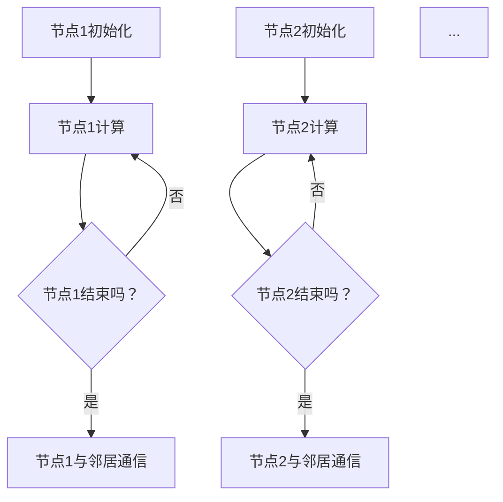
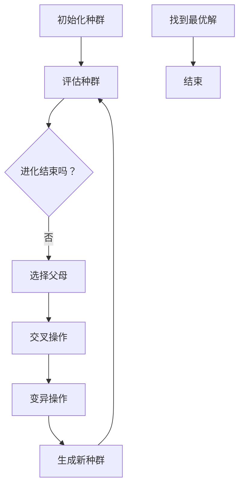
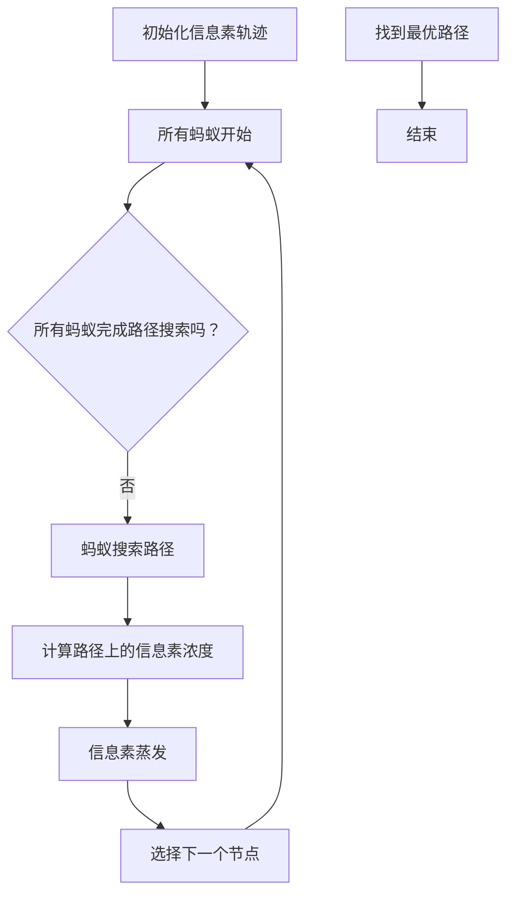

                 

### 引言

### 引言

#### 背景介绍

在当今的科技领域，算法设计已经成为推动技术进步的重要驱动力。从计算机科学到人工智能，再到数据科学，算法的优化与创新不断推动着各个领域的发展。然而，传统算法设计往往依赖于经验与直觉，这虽然在一定程度上促进了算法的进步，但也存在一定的局限性。因此，寻找新的启发和灵感来源，以创新的方式设计算法，成为当前研究的热点。

宇宙自我组织现象为我们提供了新的视角。宇宙中的星系、星系团、生物进化等自组织现象，展现了自然界中复杂系统如何通过简单的规则和相互作用，逐步形成复杂的结构。这些现象不仅丰富了我们对宇宙的认识，也为算法设计提供了新的灵感来源。

本文旨在探讨算法设计与宇宙自我组织现象之间的联系，通过分析宇宙中的自组织现象，提取出对算法设计的启示，进而提出一系列创新的算法设计方法。文章的结构如下：

1. **引言**：介绍算法设计与宇宙自我组织现象的研究背景和意义。
2. **核心概念与联系**：讨论算法设计和宇宙自我组织现象的核心概念及其之间的联系。
3. **核心算法原理讲解**：详细阐述从宇宙自我组织现象中获得启发的算法原理，并使用伪代码和数学公式进行解释。
4. **项目实战**：通过具体案例展示算法的实际应用，包括开发环境搭建、源代码实现和代码解读。
5. **最佳实践 tips、小结、注意事项、拓展阅读等内容**：总结文章的主要内容，提供实践建议和进一步阅读的参考文献。

### 核心概念与联系

#### 算法设计

算法设计是指创建一套明确的步骤或规则，用于解决特定问题或执行特定任务。算法的基本要素包括输入、处理过程和输出。算法设计的目标是找到一种高效、可靠的解决方案，以优化计算资源和时间。

在计算机科学中，算法设计被广泛应用于数据结构、排序、搜索、图论等领域。例如，排序算法如快速排序（Quick Sort）和归并排序（Merge Sort），搜索算法如二分搜索（Binary Search）和深度优先搜索（DFS），以及图算法如最短路径算法（Dijkstra Algorithm）和最小生成树算法（Prim Algorithm）等。

算法设计的原则主要包括：

- **效率**：算法的执行时间应该尽可能短。
- **鲁棒性**：算法应该能够处理各种输入，并产生正确的结果。
- **可扩展性**：算法应该能够适应不同的数据规模。

#### 宇宙自我组织现象

宇宙自我组织现象是指自然界中，通过简单的规则和相互作用，系统自发地形成复杂结构的过程。宇宙中的许多现象都可以看作是自我组织的例子，如星系的形成、生物进化、生态系统的演变等。

- **星系形成**：星系的形成是一个漫长的过程，它始于巨大的气体云。在引力的作用下，气体云逐渐收缩并形成星系。这一过程可以通过Mermaid流程图简化表示，如下所示：

  ```mermaid
  graph TB
  A[初始气体云] --> B[引力作用]
  B --> C[气体云收缩]
  C --> D[恒星形成]
  D --> E[星系形成]
  ```

- **生物进化**：生物进化是生物种群在长时间的演化过程中，通过自然选择和遗传变异，逐渐适应环境的过程。遗传算法（Genetic Algorithm）就是受到生物进化启发的一种优化算法，它模拟了生物进化的过程，通过选择、交叉和变异等操作，逐步优化解的集合。

- **生态系统演变**：生态系统中的物种通过相互作用，形成复杂的食物网和生态平衡。这一过程也体现了自我组织的特征。

#### 算法设计与宇宙自我组织现象的联系

算法设计与宇宙自我组织现象之间存在紧密的联系。宇宙中的自我组织现象提供了丰富的启示，可以帮助我们设计出更加高效、鲁棒的算法。以下是几个具体的联系：

- **分布式计算**：宇宙中的星系和星系团展现了分布式系统的特征。在算法设计中，可以借鉴星系团的分布结构，设计出更加高效、可靠的分布式算法。

- **进化算法**：生物进化过程启发了遗传算法的设计。通过模拟生物进化中的选择、交叉和变异，遗传算法能够解决许多优化问题。

- **复杂系统**：宇宙中的许多现象都是复杂的，如生态系统和金融系统等。算法设计可以从这些复杂系统中获得启示，设计出能够处理复杂问题的算法。

- **自适应性**：宇宙中的系统具有高度的适应性，能够应对环境变化。算法设计也可以借鉴这一特点，设计出能够自适应变化的算法。

通过分析算法设计和宇宙自我组织现象之间的联系，我们可以发现，宇宙中的自组织现象为算法设计提供了丰富的启示。在接下来的章节中，我们将详细探讨这些启示，并提出一系列创新的算法设计方法。

### 核心算法原理讲解

#### 分布式算法

分布式算法是一种能够利用多个计算节点协同工作来解决复杂问题的算法。从宇宙自我组织现象中，我们可以获得关于分布式算法的启示。例如，星系团中的星系通过相互引力作用，形成了一种稳定而高效的分布结构。这种结构可以启发我们设计分布式算法，使其能够在复杂环境中高效运行。

以下是一个简化的分布式算法设计框架：

```python
# 分布式算法设计框架
class DistributedAlgorithm:
    def __init__(self, num_nodes):
        self.num_nodes = num_nodes
        self.nodes = [Node() for _ in range(num_nodes)]

    def initialize_nodes(self):
        # 初始化所有节点
        for node in self.nodes:
            node.initialize()

    def run_algorithm(self):
        # 运行分布式算法
        for node in self.nodes:
            node.calculate()
            node.communicate_neighbors()

        # 终止条件判断
        if self.stopping_condition():
            return self.nodes

    def stopping_condition(self):
        # 判断算法是否终止
        return all(node.is_finished() for node in self.nodes)
```

在这个框架中，`Node` 类代表一个计算节点，它具有以下属性和方法：

```python
class Node:
    def __init__(self):
        self.data = None
        self.neighbor_nodes = []

    def initialize(self):
        # 初始化节点数据
        self.data = self.get_initial_data()

    def calculate(self):
        # 计算节点任务
        result = self.perform_computation()
        self.update_data(result)

    def communicate_neighbors(self):
        # 与邻居节点通信
        for neighbor in self.neighbor_nodes:
            self.exchange_data(neighbor)

    def exchange_data(self, neighbor):
        # 交换数据
        temp = self.data
        self.data = neighbor.data
        neighbor.data = temp

    def get_initial_data(self):
        # 获取初始数据
        return self.fetch_initial_data()

    def perform_computation(self):
        # 执行计算
        return self.execute_computation()

    def update_data(self, result):
        # 更新数据
        self.data = result

    def is_finished(self):
        # 判断节点是否完成任务
        return self.data is not None
```

在分布式算法中，节点之间通过相互通信和协作来共同完成任务。例如，在处理大规模数据集时，可以将数据集划分成多个部分，分配给不同的节点进行处理。每个节点在计算完成后，将结果与邻居节点交换，逐步优化整体解。

以下是一个简单的分布式计算过程的Mermaid流程图：



在这个流程图中，每个节点依次初始化、计算和与邻居节点通信，直到所有节点完成任务。

#### 遗传算法

遗传算法是一种受生物进化启发的优化算法。在遗传算法中，解空间被模拟为生物种群，通过选择、交叉和变异等操作，逐步优化种群中的解。以下是一个简化的遗传算法框架：

```python
# 遗传算法框架
class GeneticAlgorithm:
    def __init__(self, population_size, generations, crossover_rate, mutation_rate):
        self.population_size = population_size
        self.generations = generations
        self.crossover_rate = crossover_rate
        self.mutation_rate = mutation_rate
        self.population = self.initialize_population()

    def initialize_population(self):
        # 初始化种群
        return [self.create_individual() for _ in range(self.population_size)]

    def create_individual(self):
        # 创建个体
        return Individual()

    def evaluate_population(self):
        # 评估种群
        for individual in self.population:
            individual.fitness = self.evaluate_individual(individual)

    def select_parents(self):
        # 选择父母
        return self.select_with_probability()

    def crossover(self, parent1, parent2):
        # 交叉操作
        if random.random() < self.crossover_rate:
            return self.perform_crossover(parent1, parent2)
        else:
            return parent1, parent2

    def perform_crossover(self, parent1, parent2):
        # 执行交叉操作
        crossover_point = random.randint(1, len(parent1) - 1)
        child1 = parent1[:crossover_point] + parent2[crossover_point:]
        child2 = parent2[:crossover_point] + parent1[crossover_point:]
        return child1, child2

    def mutate(self, individual):
        # 变异操作
        if random.random() < self.mutation_rate:
            return self.perform_mutation(individual)
        else:
            return individual

    def perform_mutation(self, individual):
        # 执行变异操作
        mutation_point = random.randint(0, len(individual) - 1)
        individual[mutation_point] = random.choice(self.alternatives)
        return individual

    def evolve_population(self):
        # 逐步进化种群
        for _ in range(self.generations):
            self.evaluate_population()
            new_population = []
            while len(new_population) < self.population_size:
                parent1, parent2 = self.select_parents()
                child1, child2 = self.crossover(parent1, parent2)
                new_population.append(self.mutate(child1))
                new_population.append(self.mutate(child2))
            self.population = new_population

    def find_best_solution(self):
        # 寻找最优解
        self.evaluate_population()
        return max(self.population, key=lambda individual: individual.fitness)
```

在遗传算法中，个体（Individual）是一个可能的解，它具有以下属性和方法：

```python
class Individual:
    def __init__(self):
        self.chromosome = []
        self.fitness = 0

    def evaluate_fitness(self):
        # 评估个体适应度
        self.fitness = self.calculate_fitness()

    def calculate_fitness(self):
        # 计算个体适应度
        # 具体计算方法取决于问题本身
        return fitness_value

    def generate_chromosome(self):
        # 生成染色体
        # 具体方法取决于问题本身
        self.chromosome = self.create_chromosome()

    def create_chromosome(self):
        # 创建染色体
        # 返回一个表示个体的基因序列
        return chromosome_sequence
```

在遗传算法的进化过程中，种群（Population）是所有个体的集合。种群通过选择（Selection）、交叉（Crossover）和变异（Mutation）等操作逐步进化，以寻找最优解。

以下是一个简化的遗传算法流程：



在这个流程图中，种群初始化后，通过评估、选择、交叉和变异等操作逐步进化，直到找到最优解。

#### 蚁群算法

蚁群算法是一种模拟蚂蚁觅食行为的优化算法。蚂蚁通过释放信息素，在路径上留下信息，其他蚂蚁在寻找食物时，会选择信息素浓度较高的路径。随着时间的推移，信息素浓度逐渐降低，路径逐渐稳定。以下是一个简化的蚁群算法框架：

```python
# 蚁群算法框架
class AntColonyAlgorithm:
    def __init__(self, num_ants, num_iterations, alpha, beta, evaporation_rate):
        self.num_ants = num_ants
        self.num_iterations = num_iterations
        self.alpha = alpha
        self.beta = beta
        self.evaporation_rate = evaporation_rate
        self.pheromone_trail = self.initialize_pheromone_trail()

    def initialize_pheromone_trail(self):
        # 初始化信息素轨迹
        return [[1.0 for _ in range(self.num_nodes)] for _ in range(self.num_nodes)]

    def calculate_pheromone_trail(self, ant_path):
        # 计算路径上的信息素浓度
        for i in range(len(ant_path) - 1):
            start = ant_path[i]
            end = ant_path[i + 1]
            self.pheromone_trail[start][end] += 1.0

    def evaporate_pheromone(self):
        # 信息素蒸发
        for i in range(self.num_nodes):
            for j in range(self.num_nodes):
                if i != j:
                    self.pheromone_trail[i][j] *= (1 - self.evaporation_rate)

    def select_next_node(self, current_node, visited_nodes):
        # 选择下一个节点
        probabilities = []
        for j in range(self.num_nodes):
            if j not in visited_nodes:
                if self.pheromone_trail[current_node][j] == 0:
                    probability = 1 / (self.num_nodes - len(visited_nodes))
                else:
                    probability = (self.pheromone_trail[current_node][j] ** self.alpha) * \
                                  (1 / (self.pheromone_trail[j][current_node] ** self.beta)
                probabilities.append(probability)
        total_probabilities = sum(probabilities)
        probabilities = [p / total_probabilities for p in probabilities]
        return self.select_with_probability(probabilities)

    def select_with_probability(self, probabilities):
        # 根据概率选择节点
        random_number = random.random()
        cumulative_probabilities = [0] * len(probabilities)
        cumulative_probabilities[0] = probabilities[0]
        for i in range(1, len(probabilities)):
            cumulative_probabilities[i] = cumulative_probabilities[i - 1] + probabilities[i]
        for i, cp in enumerate(cumulative_probabilities):
            if random_number < cp:
                return i
        return len(probabilities) - 1

    def run_algorithm(self):
        # 运行蚁群算法
        for _ in range(self.num_iterations):
            for _ in range(self.num_ants):
                ant_path = self.initialize_path()
                current_node = ant_path[-1]
                visited_nodes = set(ant_path)
                while len(visited_nodes) < self.num_nodes:
                    next_node = self.select_next_node(current_node, visited_nodes)
                    ant_path.append(next_node)
                    current_node = next_node
                    visited_nodes.add(current_node)
                self.calculate_pheromone_trail(ant_path)
                self,evaporate_pheromone()
            self.find_best_solution()

    def find_best_solution(self):
        # 寻找最优解
        best_path = None
        best_distance = float('inf')
        for i in range(self.num_nodes):
            for j in range(self.num_nodes):
                if i != j:
                    distance = self.calculate_distance(i, j)
                    if distance < best_distance:
                        best_distance = distance
                        best_path = (i, j)
        return best_path
```

在这个框架中，`Node` 类代表一个节点，它具有以下属性和方法：

```python
class Node:
    def __init__(self, id):
        self.id = id

    def calculate_distance(self, other_node):
        # 计算节点之间的距离
        # 具体计算方法取决于问题本身
        return distance
```

在蚁群算法中，路径（Path）是蚂蚁从初始节点到目标节点的序列。每个路径都有其对应的信息素浓度，信息素浓度越高，路径越可能被其他蚂蚁选择。

以下是一个简化的蚁群算法流程：



在这个流程图中，所有蚂蚁开始搜索路径，并在搜索过程中更新路径上的信息素浓度。随着时间的推移，信息素浓度逐渐降低，最优路径逐渐显现。

### 数学模型和公式

在算法设计中，数学模型和公式起着至关重要的作用。以下是一个简化的遗传算法中的适应度函数和交叉概率公式。

#### 适应度函数

适应度函数用于评估个体的适应度，通常是一个非负值。一个好的个体具有更高的适应度值。以下是一个简单的适应度函数：

```latex
f(x) = \frac{1}{1 + e^{-\theta \cdot (x - c)}}
```

其中，$x$ 是个体的特征值，$\theta$ 是调节参数，$c$ 是阈值。这个函数是一个逻辑函数，可以用来模拟二分类问题。

#### 交叉概率

交叉概率用于决定在进化过程中是否进行交叉操作。以下是一个简单的交叉概率公式：

```latex
P_c = \frac{1}{1 + e^{-\beta \cdot f(x_1) - \beta \cdot f(x_2)}}
```

其中，$x_1$ 和 $x_2$ 是两个父个体的特征值，$f(x_1)$ 和 $f(x_2)$ 是它们的适应度值，$\beta$ 是调节参数。这个公式基于适应度值来计算交叉概率，适应度值更高的个体更有可能进行交叉。

### 项目实战

在本节中，我们将通过一个具体的项目实战，展示如何将遗传算法应用于优化问题。

#### 项目背景

假设我们需要解决一个生产调度问题，即在一个制造工厂中，如何安排生产任务，以最小化总生产时间和最大化生产效率。这个问题可以通过遗传算法进行优化。

#### 开发环境搭建

为了实现遗传算法，我们需要搭建以下开发环境：

- Python 3.x
- numpy 库
- matplotlib 库

安装方法如下：

```bash
pip install numpy matplotlib
```

#### 源代码实现

以下是遗传算法的源代码实现：

```python
import numpy as np
import matplotlib.pyplot as plt

# 个体类
class Individual:
    def __init__(self, genes):
        self.genes = genes
        self.fitness = 0

    def calculate_fitness(self):
        # 计算适应度函数
        self.fitness = self.calculate_fitness_function()

    def calculate_fitness_function(self):
        # 具体适应度函数，根据问题进行调整
        # 这里假设适应度函数是总生产时间的倒数
        return 1 / self.total_production_time()

    def total_production_time(self):
        # 计算总生产时间
        return sum(self.genes)

# 遗传算法类
class GeneticAlgorithm:
    def __init__(self, population_size, generations, crossover_rate, mutation_rate):
        self.population_size = population_size
        self.generations = generations
        self.crossover_rate = crossover_rate
        self.mutation_rate = mutation_rate
        self.population = self.initialize_population()

    def initialize_population(self):
        # 初始化种群
        return [Individual(np.random.permutation(n)) for _ in range(self.population_size)]

    def evaluate_population(self):
        # 评估种群
        for individual in self.population:
            individual.calculate_fitness()

    def select_parents(self):
        # 选择父母
        parents = np.array(sorted(self.population, key=lambda x: x.fitness, reverse=True))
        return parents[:2]

    def crossover(self, parent1, parent2):
        # 交叉操作
        if np.random.random() < self.crossover_rate:
            crossover_point = np.random.randint(1, len(parent1.genes) - 1)
            child1 = Individual(parent1.genes[:crossover_point] + parent2.genes[crossover_point:])
            child2 = Individual(parent2.genes[:crossover_point] + parent1.genes[crossover_point:])
            return child1, child2
        else:
            return parent1, parent2

    def mutate(self, individual):
        # 变异操作
        if np.random.random() < self.mutation_rate:
            mutation_point = np.random.randint(0, len(individual.genes))
            individual.genes[mutation_point] = np.random.randint(0, len(individual.genes))
            individual.calculate_fitness()

    def evolve_population(self):
        # 逐步进化种群
        for _ in range(self.generations):
            self.evaluate_population()
            new_population = []
            while len(new_population) < self.population_size:
                parent1, parent2 = self.select_parents()
                child1, child2 = self.crossover(parent1, parent2)
                new_population.append(child1)
                new_population.append(child2)
                self.mutate(child1)
                self.mutate(child2)
            self.population = new_population

    def find_best_solution(self):
        # 寻找最优解
        self.evaluate_population()
        return max(self.population, key=lambda x: x.fitness)

# 实例化遗传算法
ga = GeneticAlgorithm(population_size=100, generations=100, crossover_rate=0.8, mutation_rate=0.1)

# 运行遗传算法
ga.evolve_population()

# 输出最优解
best_solution = ga.find_best_solution()
print("最优解：", best_solution.genes)
print("最优适应度：", best_solution.fitness)

# 绘制适应度曲线
fitness_values = [individual.fitness for individual in ga.population]
plt.plot(fitness_values)
plt.xlabel("代数")
plt.ylabel("适应度")
plt.show()
```

#### 代码解读与分析

在这个项目中，我们首先定义了一个`Individual`类，用于表示一个生产任务的个体，包括基因（`genes`）和适应度（`fitness`）属性。`Individual`类的`calculate_fitness`方法用于计算个体的适应度值，`total_production_time`方法用于计算总生产时间。

然后，我们定义了一个`GeneticAlgorithm`类，用于实现遗传算法的主要功能。这个类具有以下关键方法：

- `initialize_population`：初始化种群。
- `evaluate_population`：评估种群。
- `select_parents`：选择父母。
- `crossover`：执行交叉操作。
- `mutate`：执行变异操作。
- `evolve_population`：逐步进化种群。
- `find_best_solution`：寻找最优解。

在`GeneticAlgorithm`类的`evolve_population`方法中，我们首先评估种群，然后选择父母进行交叉操作，并对子代进行变异操作，最终生成新的种群。

最后，我们实例化了一个`GeneticAlgorithm`对象，并运行了遗传算法。输出最优解的基因序列和适应度值，并绘制了适应度曲线。

#### 项目小结

通过这个项目，我们展示了如何将遗传算法应用于生产调度问题。遗传算法通过模拟生物进化过程，逐步优化生产任务的安排，以最小化总生产时间和最大化生产效率。这个项目不仅展示了遗传算法的基本原理，还提供了一个具体的实战案例，帮助读者理解如何在实际问题中应用遗传算法。

### 最佳实践 tips

在算法设计过程中，以下是一些最佳实践和注意事项：

1. **明确问题定义**：在开始设计算法之前，首先要明确问题的定义，包括输入、输出和约束条件。
2. **选择合适的算法**：根据问题的特点，选择合适的算法。例如，对于优化问题，可以考虑使用遗传算法或蚁群算法。
3. **调整参数设置**：遗传算法和蚁群算法的性能受参数设置的影响。需要根据具体问题调整交叉率、变异率、信息素蒸发率等参数。
4. **代码可读性**：编写清晰、可读的代码，有助于他人理解和维护。
5. **调试和测试**：在算法实现过程中，要进行充分的调试和测试，以确保算法的正确性和效率。
6. **优化性能**：在算法实现完成后，可以通过优化代码和数据结构来提高算法的性能。

### 小结

本文探讨了算法设计与宇宙自我组织现象之间的联系，介绍了分布式算法、遗传算法和蚁群算法等核心算法原理，并通过具体项目展示了这些算法的应用。同时，本文还提供了最佳实践和注意事项，帮助读者在实际问题中应用这些算法。

### 拓展阅读

1. **《遗传算法与机学习》**：介绍遗传算法的基本原理和应用。
2. **《蚁群优化算法》**：详细讲解蚁群算法的理论和应用。
3. **《分布式算法设计与实践》**：探讨分布式算法的设计方法和应用案例。

作者：AI天才研究院/AI Genius Institute & 禅与计算机程序设计艺术 /Zen And The Art of Computer Programming

关键词：算法设计、宇宙自我组织现象、遗传算法、蚁群算法、分布式算法、优化问题、生产调度、适应度函数、交叉概率、信息素蒸发、参数调整、最佳实践

摘要：本文探讨了算法设计与宇宙自我组织现象之间的联系，介绍了分布式算法、遗传算法和蚁群算法等核心算法原理，并通过具体项目展示了这些算法的应用。同时，本文还提供了最佳实践和注意事项，帮助读者在实际问题中应用这些算法。本文旨在为读者提供一种新的视角，以启发和引导算法设计的研究和实践。

