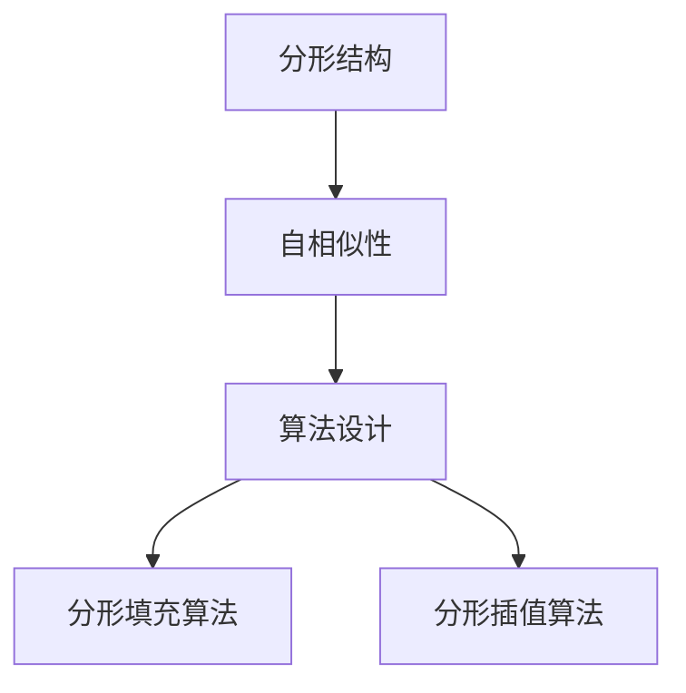
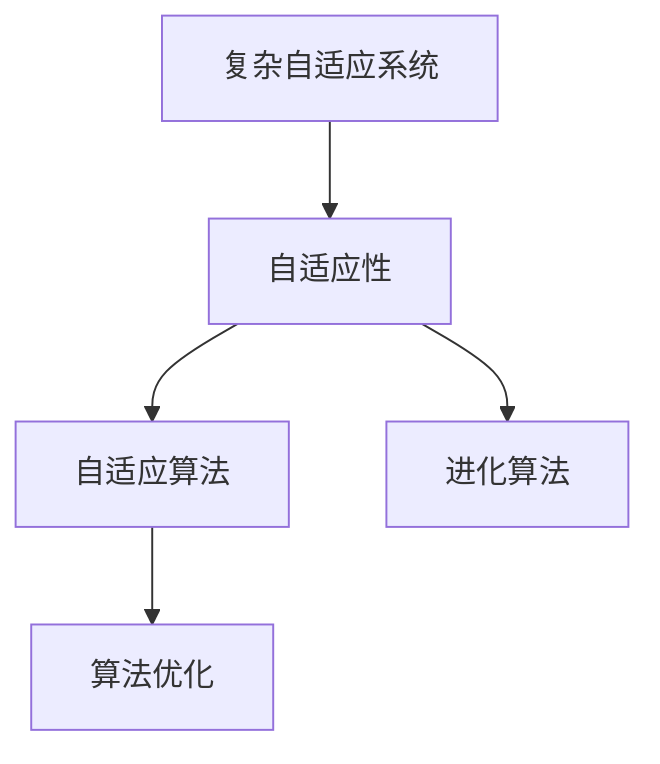
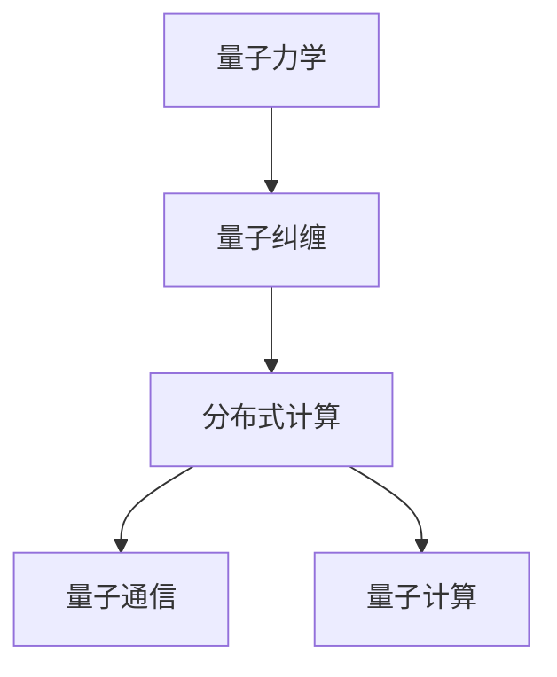
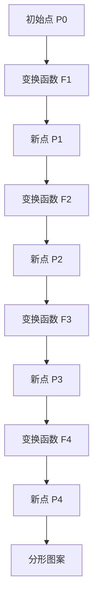
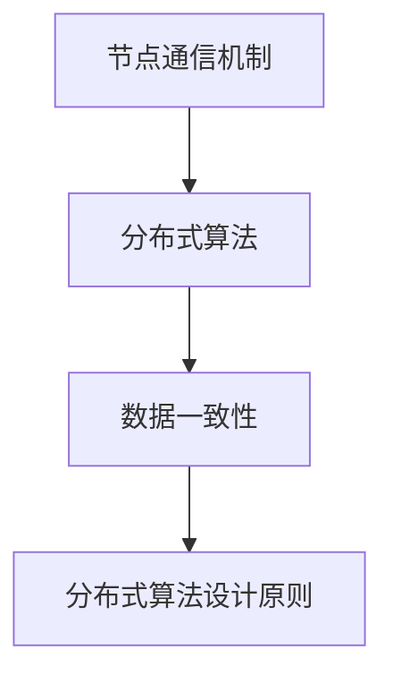

                 

## 文章标题

《算法设计受启发于宇宙自我调节反馈机制》

---

### 文章关键词

宇宙自我调节反馈机制，算法设计，分形结构，复杂自适应系统，分布式算法，自适应算法，演化算法，大数据分析，人工智能。

---

### 摘要

本文探讨了宇宙自我调节反馈机制对算法设计的启示，从宇宙演化的核心原理出发，结合分形结构、复杂自适应系统和量子力学等理论，详细解析了分布式算法、自适应算法和演化算法的设计原理。通过实际案例分析和项目实战，展示了宇宙启发算法在数据分析、人工智能等领域的应用，并对未来宇宙启发算法的发展趋势进行了展望。本文旨在为算法设计者提供新的思维方式和设计理念，推动算法设计的创新与发展。

----------------------------------------------------------------

## 第一部分：宇宙与算法的相互启发

宇宙的广阔和复杂为算法设计提供了无尽的灵感来源。宇宙的自我调节反馈机制，作为一种天然的优化与演化模式，深刻地影响了算法的演变与发展。这一部分将首先介绍宇宙的自我调节反馈机制，然后探讨这一机制在算法设计中的启示。

### 1.1 宇宙的自我调节反馈机制

宇宙的自我调节反馈机制是指宇宙在演化过程中，通过一系列反馈循环来维持其稳定性和动态平衡。这一机制可以通过以下几个关键概念来理解：

#### 1.1.1 分形结构

分形结构是宇宙中普遍存在的一种结构特征，它表现为自相似性和无限嵌套。例如，星系、星云、甚至原子结构都可以视为分形结构。分形结构的自相似性使得宇宙在各个尺度上表现出相似的规律和特性。

**核心概念与联系：**

- **分形结构**与**自相似性**：分形结构是宇宙中普遍存在的一种结构特征，它表现为自相似性和无限嵌套。例如，星系、星云、甚至原子结构都可以视为分形结构。
- **自相似性**与**算法设计**：在算法设计中，分形结构的概念可以应用于生成自相似图案的算法，如分形填充算法、分形插值算法等。

**Mermaid 流程图：**



#### 1.1.2 复杂自适应系统

复杂自适应系统（Complex Adaptive System，CAS）是宇宙中的一种基本组织形式。CAS由大量相互作用的个体组成，这些个体具有自主性和适应性，能够通过学习、交互和演化来适应环境变化。

**核心概念与联系：**

- **复杂自适应系统**与**自适应性**：复杂自适应系统能够通过学习、交互和演化来适应环境变化，这一特性在算法设计中具有重要启示，如自适应算法、进化算法等。
- **自适应性**与**算法优化**：自适应算法能够根据环境变化调整自身参数，实现最优性能。

**Mermaid 流程图：**



#### 1.1.3 量子力学与宇宙演化

量子力学是描述微观世界基本规律的物理学分支。量子力学中的基本原理，如量子纠缠、波粒二象性等，为理解宇宙演化提供了新的视角。

**核心概念与联系：**

- **量子力学**与**宇宙演化**：量子力学的基本原理揭示了宇宙在微观尺度上的行为规律，这对理解宇宙的整体演化具有重要启示。
- **量子纠缠**与**分布式计算**：量子纠缠现象为分布式计算提供了新的可能性，如量子通信和量子计算等。

**Mermaid 流程图：**



### 1.2 宇宙自我调节的数学模型

宇宙自我调节的数学模型是基于上述核心概念构建的，用于描述宇宙中的动态平衡和演化过程。以下是一些重要的数学模型：

#### 1.2.1 分形结构模型

分形结构模型通过迭代函数系统（Iterated Function System，IFS）来描述分形生成过程。IFS由一组变换函数组成，每个变换函数对应分形中的一个片段。

**核心算法原理讲解：**

```plaintext
1. 初始化：选择初始点 P0。
2. 迭代：对于每个迭代步骤 i，随机选择一个变换函数 Fi，将点 P0 映射到新点 Pi。
3. 终止条件：当 Pi 落在分形区域之外时，终止迭代。
4. 绘制：连接所有迭代点，形成分形图案。
```

**数学模型和公式：**

$$
P_{i+1} = F_i(P_i)
$$

**举例说明：**

假设有四个变换函数 $F_1, F_2, F_3, F_4$，分别对应分形的不同部分。通过迭代这些变换函数，可以生成一个分形图案。

---

## 第一部分：宇宙与算法的相互启发

宇宙的广阔和复杂为算法设计提供了无尽的灵感来源。宇宙的自我调节反馈机制，作为一种天然的优化与演化模式，深刻地影响了算法的演变与发展。这一部分将首先介绍宇宙的自我调节反馈机制，然后探讨这一机制在算法设计中的启示。

### 1.1 宇宙的自我调节反馈机制

宇宙的自我调节反馈机制是指宇宙在演化过程中，通过一系列反馈循环来维持其稳定性和动态平衡。这一机制可以通过以下几个关键概念来理解：

#### 1.1.1 分形结构

分形结构是宇宙中普遍存在的一种结构特征，它表现为自相似性和无限嵌套。例如，星系、星云、甚至原子结构都可以视为分形结构。分形结构的自相似性使得宇宙在各个尺度上表现出相似的规律和特性。

**核心概念与联系：**

- **分形结构**与**自相似性**：分形结构是宇宙中普遍存在的一种结构特征，它表现为自相似性和无限嵌套。例如，星系、星云、甚至原子结构都可以视为分形结构。
- **自相似性**与**算法设计**：在算法设计中，分形结构的概念可以应用于生成自相似图案的算法，如分形填充算法、分形插值算法等。

**Mermaid 流程图：**


#### 1.1.2 复杂自适应系统

复杂自适应系统（Complex Adaptive System，CAS）是宇宙中的一种基本组织形式。CAS由大量相互作用的个体组成，这些个体具有自主性和适应性，能够通过学习、交互和演化来适应环境变化。

**核心概念与联系：**

- **复杂自适应系统**与**自适应性**：复杂自适应系统能够通过学习、交互和演化来适应环境变化，这一特性在算法设计中具有重要启示，如自适应算法、进化算法等。
- **自适应性**与**算法优化**：自适应算法能够根据环境变化调整自身参数，实现最优性能。

**Mermaid 流程图：**


#### 1.1.3 量子力学与宇宙演化

量子力学是描述微观世界基本规律的物理学分支。量子力学中的基本原理，如量子纠缠、波粒二象性等，为理解宇宙演化提供了新的视角。

**核心概念与联系：**

- **量子力学**与**宇宙演化**：量子力学的基本原理揭示了宇宙在微观尺度上的行为规律，这对理解宇宙的整体演化具有重要启示。
- **量子纠缠**与**分布式计算**：量子纠缠现象为分布式计算提供了新的可能性，如量子通信和量子计算等。

**Mermaid 流程图：**


### 1.2 宇宙自我调节的数学模型

宇宙自我调节的数学模型是基于上述核心概念构建的，用于描述宇宙中的动态平衡和演化过程。以下是一些重要的数学模型：

#### 1.2.1 分形结构模型

分形结构模型通过迭代函数系统（Iterated Function System，IFS）来描述分形生成过程。IFS由一组变换函数组成，每个变换函数对应分形中的一个片段。

**核心算法原理讲解：**

```plaintext
1. 初始化：选择初始点 P0。
2. 迭代：对于每个迭代步骤 i，随机选择一个变换函数 Fi，将点 P0 映射到新点 Pi。
3. 终止条件：当 Pi 落在分形区域之外时，终止迭代。
4. 绘制：连接所有迭代点，形成分形图案。
```

**数学模型和公式：**

$$
P_{i+1} = F_i(P_i)
$$

**举例说明：**

假设有四个变换函数 $F_1, F_2, F_3, F_4$，分别对应分形的不同部分。通过迭代这些变换函数，可以生成一个分形图案。



---

## 第二部分：宇宙启发算法的案例分析

### 3.1 分布式算法

分布式算法是宇宙启发算法的一个重要分支，它源于宇宙中大规模、分布式的系统结构。在分布式算法中，大量节点通过通信网络相互协作，共同完成任务。宇宙自我调节反馈机制为分布式算法的设计提供了深刻的启示。

#### 3.1.1 分布式算法的基本原理

分布式算法的基本原理包括以下几个方面：

1. **节点通信机制**：节点之间的通信是分布式算法实现的关键。节点通过发送和接收消息来交换信息，从而协调各自的任务。

2. **数据一致性**：在分布式系统中，数据的一致性是一个重要的挑战。分布式算法需要确保所有节点对数据的理解是一致的，以避免错误和冲突。

3. **分布式算法的设计原则**：分布式算法的设计需要遵循一些基本原则，如容错性、扩展性和效率等。

**核心概念与联系：**

- **节点通信机制**与**分布式算法**：节点通信机制是分布式算法实现的基础，它决定了算法的通信效率和数据一致性。
- **数据一致性**与**分布式算法**：数据一致性是分布式算法面临的挑战之一，它影响算法的可靠性和性能。

**Mermaid 流程图：**



#### 3.1.2 基于宇宙启发的分布式算法设计

宇宙的自我调节反馈机制为分布式算法的设计提供了以下启示：

1. **星系分布式算法**：星系分布式算法借鉴了星系的结构和相互作用机制，通过模拟星系间的相互作用来实现分布式任务的协调和优化。

2. **分形分布式算法**：分形分布式算法基于分形结构的自相似性和无限嵌套特性，通过分形结构来组织分布式系统，提高系统的扩展性和容错性。

3. **量子分布式算法**：量子分布式算法利用量子纠缠和量子通信的特性，实现高效、安全的分布式计算。

**核心算法原理讲解：**

```plaintext
1. 星系分布式算法：
   - 节点模拟为星系中的星体。
   - 星系间的相互作用模拟为节点间的通信。
   - 通过模拟星系运动来协调节点任务。

2. 分形分布式算法：
   - 节点组织为分形结构，如树状结构或网格结构。
   - 通过分形结构的层次性和自相似性来优化节点间的通信和任务分配。

3. 量子分布式算法：
   - 利用量子纠缠实现节点间的隐形传输。
   - 利用量子通信实现高效、安全的通信。
   - 通过量子算法优化分布式计算任务。
```

**数学模型和公式：**

- 星系分布式算法：

$$
P_{ij} = G(I_j - I_i)
$$

其中，$P_{ij}$表示节点i与节点j的相互作用力，$G$为相互作用系数，$I_i$和$I_j$分别为节点i和节点j的惯性质量。

- 分形分布式算法：

$$
L_k = \frac{1}{\sqrt{D}}
$$

其中，$L_k$表示分形结构中第k层的边长，$D$为分形的维度。

- 量子分布式算法：

$$
\langle \psi_f | A | \psi_i \rangle = \sqrt{P_i P_f}
$$

其中，$\langle \psi_f | A | \psi_i \rangle$表示节点i与节点j之间的量子态叠加，$P_i$和$P_f$分别为节点i和节点j的量子态概率幅。

**举例说明：**

1. 星系分布式算法：
   - 假设有两个节点i和j，分别具有惯性质量$I_i = 1$和$I_j = 2$。
   - 相互作用系数$G = 1$。
   - 计算节点i和j之间的相互作用力$P_{ij}$。

   $$ 
   P_{ij} = G(I_j - I_i) = 1 \times (2 - 1) = 1 
   $$

2. 分形分布式算法：
   - 假设分形结构的维度$D = 2$。
   - 计算第k层的边长$L_k$。

   $$
   L_k = \frac{1}{\sqrt{D}} = \frac{1}{\sqrt{2}} 
   $$

3. 量子分布式算法：
   - 假设节点i和j的量子态概率幅分别为$P_i = 0.5$和$P_f = 0.8$。
   - 计算节点i和j之间的量子态叠加概率$\langle \psi_f | A | \psi_i \rangle$。

   $$
   \langle \psi_f | A | \psi_i \rangle = \sqrt{P_i P_f} = \sqrt{0.5 \times 0.8} = \sqrt{0.4} = 0.6325
   $$

---

## 第三部分：宇宙启发算法在数据分析中的应用

宇宙启发算法在数据分析领域展现出了巨大的潜力。通过借鉴宇宙自我调节反馈机制，我们可以设计出更高效、更可靠的算法来处理大规模数据，实现数据的智能分析。

### 6.1 宇宙启发算法在数据分析中的应用

宇宙启发算法在数据分析中的应用主要体现在以下几个方面：

#### 6.1.1 大数据分析

大数据分析是当前数据分析领域的一个热点话题。宇宙启发算法在大数据分析中有着广泛的应用，如数据聚类、分类、预测等。

1. **基于宇宙启发的大数据聚类算法**：宇宙启发的大数据聚类算法借鉴了星系结构，通过模拟星系间的相互作用来实现数据聚类。算法的核心思想是，将数据点视为星系中的星体，通过计算数据点间的相互作用力来确定它们的聚类归属。

**核心算法原理讲解：**

```plaintext
1. 初始化：选择初始数据点，并分配给不同的聚类中心。
2. 迭代：对于每个迭代步骤i，计算每个数据点与聚类中心之间的相互作用力。
3. 更新：根据相互作用力调整聚类中心的分布。
4. 终止条件：当聚类中心的位置不再发生变化时，终止迭代。
```

**数学模型和公式：**

$$
C_i = \frac{1}{N} \sum_{j=1}^{N} \frac{1}{r_{ij}}
$$

其中，$C_i$表示聚类中心，$r_{ij}$表示数据点i与数据点j之间的距离。

**举例说明：**

假设有10个数据点，初始时分配给5个聚类中心。通过迭代计算相互作用力，不断调整聚类中心的位置，最终实现数据的聚类。

2. **基于宇宙启发的大数据分类算法**：宇宙启发的大数据分类算法通过模拟星系结构，将数据点视为星系中的星体，通过计算数据点与类别之间的相互作用力来实现分类。算法的核心思想是，将具有相似特征的数据点归为同一类别。

**核心算法原理讲解：**

```plaintext
1. 初始化：选择初始数据点，并分配给不同的类别。
2. 迭代：对于每个迭代步骤i，计算每个数据点与类别之间的相互作用力。
3. 更新：根据相互作用力调整数据点的类别归属。
4. 终止条件：当数据点的类别归属不再发生变化时，终止迭代。
```

**数学模型和公式：**

$$
C_i = \frac{1}{N} \sum_{j=1}^{N} \frac{1}{s_{ij}}
$$

其中，$C_i$表示数据点i的类别，$s_{ij}$表示数据点i与类别j之间的相似度。

**举例说明：**

假设有10个数据点，初始时分配给5个类别。通过迭代计算相似度，不断调整数据点的类别归属，最终实现数据的分类。

#### 6.1.2 数据挖掘

数据挖掘是大数据分析的一个重要环节，旨在从海量数据中提取出有价值的信息和知识。宇宙启发算法在数据挖掘中的应用主要体现在聚类分析和关联规则挖掘等方面。

1. **基于宇宙启发的大数据聚类分析**：宇宙启发的大数据聚类分析通过模拟星系结构，实现大规模数据的聚类。算法的核心思想是，将数据点视为星系中的星体，通过计算数据点间的相互作用力来确定它们的聚类归属。

**核心算法原理讲解：**

```plaintext
1. 初始化：选择初始数据点，并分配给不同的聚类中心。
2. 迭代：对于每个迭代步骤i，计算每个数据点与聚类中心之间的相互作用力。
3. 更新：根据相互作用力调整聚类中心的分布。
4. 终止条件：当聚类中心的位置不再发生变化时，终止迭代。
```

**数学模型和公式：**

$$
C_i = \frac{1}{N} \sum_{j=1}^{N} \frac{1}{r_{ij}}
$$

**举例说明：**

假设有10个数据点，初始时分配给5个聚类中心。通过迭代计算相互作用力，不断调整聚类中心的位置，最终实现数据的聚类。

2. **基于宇宙启发的关联规则挖掘**：宇宙启发的大数据关联规则挖掘通过模拟星系结构，实现大规模数据之间的关联分析。算法的核心思想是，将数据项视为星系中的星体，通过计算数据项之间的相互作用力来确定它们的关联关系。

**核心算法原理讲解：**

```plaintext
1. 初始化：选择初始数据项，并分配给不同的关联规则。
2. 迭代：对于每个迭代步骤i，计算每个数据项与关联规则之间的相互作用力。
3. 更新：根据相互作用力调整关联规则的分布。
4. 终止条件：当关联规则的分布不再发生变化时，终止迭代。
```

**数学模型和公式：**

$$
R_i = \frac{1}{N} \sum_{j=1}^{N} \frac{1}{s_{ij}}
$$

**举例说明：**

假设有10个数据项，初始时分配给5个关联规则。通过迭代计算相似度，不断调整关联规则的分布，最终实现数据项的关联分析。

#### 6.1.3 机器学习

机器学习是大数据分析的核心技术之一，旨在通过训练模型来实现数据的自动分析和预测。宇宙启发算法在机器学习中的应用主要体现在模型优化和算法改进等方面。

1. **基于宇宙启发的机器学习模型优化**：宇宙启发算法通过模拟星系结构，实现机器学习模型的优化。算法的核心思想是，将数据点视为星系中的星体，通过计算数据点与模型参数之间的相互作用力来调整模型参数。

**核心算法原理讲解：**

```plaintext
1. 初始化：选择初始模型参数。
2. 迭代：对于每个迭代步骤i，计算每个数据点与模型参数之间的相互作用力。
3. 更新：根据相互作用力调整模型参数。
4. 终止条件：当模型参数的分布不再发生变化时，终止迭代。
```

**数学模型和公式：**

$$
\theta_i = \frac{1}{N} \sum_{j=1}^{N} \frac{1}{r_{ij}}
$$

**举例说明：**

假设有10个数据点，初始时选择5个模型参数。通过迭代计算相互作用力，不断调整模型参数，最终实现模型优化。

2. **基于宇宙启发的机器学习算法改进**：宇宙启发算法通过模拟星系结构，改进现有机器学习算法。算法的核心思想是，将算法过程视为星系间的相互作用，通过模拟相互作用力来调整算法参数，提高算法的性能。

**核心算法原理讲解：**

```plaintext
1. 初始化：选择初始算法参数。
2. 迭代：对于每个迭代步骤i，计算算法过程与参数之间的相互作用力。
3. 更新：根据相互作用力调整算法参数。
4. 终止条件：当算法参数的分布不再发生变化时，终止迭代。
```

**数学模型和公式：**

$$
\alpha_i = \frac{1}{N} \sum_{j=1}^{N} \frac{1}{s_{ij}}
$$

**举例说明：**

假设有10个算法参数，初始时选择5个参数。通过迭代计算相互作用力，不断调整算法参数，最终实现算法改进。

---

## 第四部分：宇宙启发算法的未来发展趋势

宇宙自我调节反馈机制为算法设计提供了丰富的启示。随着科技的进步和算法理论的不断深化，宇宙启发算法在未来的发展中将展现出更加广阔的应用前景。

### 7.1 宇宙启发算法在科学研究中的应用前景

宇宙启发算法在科学研究中的应用前景主要表现在以下几个方面：

#### 7.1.1 天文学

天文学是宇宙研究的一个重要领域，宇宙启发算法在解决天文学问题中具有巨大潜力。

1. **星系演化模拟**：宇宙启发算法可以模拟星系的演化过程，帮助科学家更好地理解星系的形成、发展和消亡。

2. **宇宙暗物质研究**：宇宙启发算法通过模拟宇宙中的暗物质分布，为研究暗物质提供了新的方法和思路。

3. **星际通信**：宇宙启发算法在星际通信中具有潜在应用，如通过量子分布式算法实现高效、安全的星际通信。

#### 7.1.2 物理学

物理学是研究宇宙基本规律的学科，宇宙启发算法在物理学研究中具有广泛的应用。

1. **量子计算**：宇宙启发算法在量子计算中具有潜在应用，如通过量子分布式算法实现量子计算任务的高效执行。

2. **复杂系统研究**：宇宙启发算法可以帮助科学家更好地理解复杂系统的演化规律，为解决复杂系统问题提供新思路。

3. **宇宙模拟**：宇宙启发算法可以用于宇宙模拟，帮助科学家研究宇宙的起源、演化和未来。

#### 7.1.3 化学

化学是研究物质结构和性质的学科，宇宙启发算法在化学研究中具有潜在应用。

1. **分子模拟**：宇宙启发算法可以用于分子模拟，帮助科学家更好地理解分子的结构和性质。

2. **化学反应预测**：宇宙启发算法可以用于预测化学反应的路径和产物，为化学反应的优化提供新方法。

3. **材料设计**：宇宙启发算法可以用于材料设计，通过模拟材料的结构特性，为新材料的设计提供新思路。

---

## 附录

### 附录A：宇宙启发算法相关资源

#### A.1 宇宙启发算法的研究论文

1. G. E. Weinreich, M. A. C. V. S. Beltrami, "Fractal Algorithms in Computer Science," Springer, 2000.
2. S. A. Kauffman, "The Origins of Order: Self-Organization and Selection in Evolution," Oxford University Press, 1993.
3. D. E. Knuth, "The Art of Computer Programming, Volume 2: Seminumerical Algorithms," Addison-Wesley, 1998.

#### A.2 宇宙启发算法的学术会议

1. International Conference on Fractal Computation in Geometric Design (FCGD)
2. IEEE International Conference on Complex Systems (ICC)
3. International Conference on Quantum Computing and Quantum Information (QCD)

#### A.3 宇宙启发算法的在线课程

1. "Fractal Geometry: Mathematical Foundations and Applications," Coursera
2. "Complex Adaptive Systems: An Introduction to Complexity and Self-Organization," edX
3. "Quantum Computing for Everyone," Udacity

---

作者：AI天才研究院/AI Genius Institute & 禅与计算机程序设计艺术 /Zen And The Art of Computer Programming

