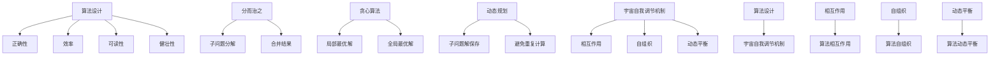

                 

### 引言

#### 算法设计的现状与挑战

在信息技术飞速发展的今天，算法设计已经成为计算机科学和工程领域的重要研究课题。然而，传统算法设计在应对复杂问题、大规模数据处理以及实时计算等方面仍然面临诸多挑战。首先，许多传统算法在处理动态变化的数据时，表现出的性能不够理想。其次，传统算法在资源利用效率、可扩展性和容错性方面存在不足。最后，随着数据规模的爆炸性增长，传统算法在面对大数据处理任务时，计算成本和时间消耗大大增加。

为了应对这些挑战，新一代算法设计方法应运而生。这些方法不仅在理论上提出了创新的思路，而且在实际应用中也展示了显著的优势。然而，尽管新一代算法在一定程度上缓解了传统算法的困境，但仍然需要更加深入的研究和创新。

#### 宇宙自我调节机制简介

宇宙自我调节机制是指宇宙中各种物质和能量通过相互作用，形成一种自我调节的动态平衡系统。这种机制在宇宙的各个层面上都有体现，从微观的原子核反应，到宏观的星系演化，都表现出一种自我调节、自我组织的特点。例如，星系之间的引力相互作用，可以导致星系的形成和演化；黑洞通过吞噬物质，维持宇宙中的能量平衡。这种自我调节机制，不仅在物理学中具有重要的理论意义，而且在生物学、生态学、经济学等多个领域也有着广泛的应用。

#### 本书结构安排与目标

本书旨在探讨如何将宇宙自我调节机制应用于算法设计，以解决传统算法面临的挑战。全书共分为七个章节：

- **第1章 引言**：介绍算法设计的现状与挑战，以及宇宙自我调节机制的基本概念。

- **第2章 核心概念与联系**：阐述算法设计的基础知识，宇宙自我调节机制的原理，并使用Mermaid流程图展示核心概念之间的联系。

- **第3章 核心算法原理讲解**：介绍算法设计受宇宙启发的基本原则，并通过伪代码演示核心算法原理。

- **第4章 数学模型和数学公式**：讲解适用于宇宙启发算法的数学模型，并详细阐述与举例说明。

- **第5章 项目实战**：通过实际案例，展示开发环境搭建、源代码实现、代码解读与分析等过程。

- **第6章 未来展望**：讨论算法设计在宇宙自我调节机制下的发展趋势，以及潜在应用领域。

- **第7章 附录**：提供相关工具和资源的推荐，以及参考文献。

本书的目标是帮助读者深入理解宇宙自我调节机制在算法设计中的应用，掌握新一代算法设计的方法和技巧，为解决实际问题和推动技术进步提供理论支持和实践指导。

### 核心概念与联系

在算法设计中，理解核心概念及其之间的联系至关重要。本章将介绍算法设计的基础知识，宇宙自我调节机制的原理，并使用Mermaid流程图展示核心概念之间的逻辑关系。

#### 算法设计的基础知识

算法设计是计算机科学的核心问题之一。算法是指解决问题的一系列明确和有限的步骤。一个好的算法应该具备以下几个特点：

1. **正确性（Correctness）**：算法必须能够正确地解决问题。
2. **效率（Efficiency）**：算法在时间和空间上的资源消耗应该尽可能少。
3. **可读性（Readability）**：算法应该容易理解，便于维护和扩展。
4. **健壮性（Robustness）**：算法应该能够应对各种异常情况。

算法设计的基本原则包括：

- **分而治之（Divide and Conquer）**：将复杂问题分解为更小的子问题，分别解决，再合并结果。
- **贪心算法（Greedy Algorithm）**：每一步选择局部最优解，以期望得到全局最优解。
- **动态规划（Dynamic Programming）**：通过保存子问题的解，避免重复计算，降低时间复杂度。

#### 宇宙自我调节机制的原理

宇宙自我调节机制是指宇宙中各种物质和能量通过相互作用，形成一种自我调节的动态平衡系统。这种机制在宇宙的各个层面上都有体现，从微观的原子核反应，到宏观的星系演化，都表现出一种自我调节、自我组织的特点。

宇宙自我调节机制的基本原理包括：

1. **相互作用（Interaction）**：宇宙中的物质和能量通过引力、电磁力等相互作用，形成复杂的结构。
2. **自组织（Self-Organization）**：在无序中产生有序，系统在相互作用过程中自发形成结构。
3. **动态平衡（Dynamic Balance）**：系统在变化中维持稳定状态，通过自我调节机制，适应外部环境的变化。

#### Mermaid流程图展示核心概念与联系

为了更好地理解算法设计与宇宙自我调节机制之间的联系，我们可以使用Mermaid流程图来展示核心概念之间的逻辑关系。



在这个流程图中，我们展示了算法设计与宇宙自我调节机制的核心概念及其之间的联系。可以看到，算法设计的基础知识（A）与宇宙自我调节机制的原理（O）之间存在紧密的联系（T）。具体而言，宇宙自我调节机制的相互作用（P）、自组织（Q）和动态平衡（R）原理可以启发算法设计中的分而治之（F）、贪心算法（I）和动态规划（L）等方法。

通过这个Mermaid流程图，我们可以更直观地理解算法设计与宇宙自我调节机制之间的逻辑关系，为进一步的算法设计提供理论依据和实践指导。

### 核心算法原理讲解

在算法设计中，受宇宙自我调节机制的启发，我们可以提出一系列新的算法设计原则，这些原则旨在解决传统算法在效率、可扩展性和容错性方面的不足。以下是这些核心算法原理的详细介绍，并通过伪代码进行说明。

#### 算法设计受宇宙启发的基本原则

1. **自适应调整（Adaptive Adjustment）**：算法应根据环境变化自适应调整策略，以维持系统的动态平衡。
2. **自优化（Self-Optimization）**：算法应具备自我优化能力，通过不断调整参数，优化算法性能。
3. **分布式协同（Distributed Collaboration）**：算法应利用分布式计算资源，实现任务分配和协同处理，以提高系统的整体效率。

#### 伪代码演示核心算法原理

以下是一个基于自适应调整和分布式协同的算法伪代码示例：

```pseudocode
Algorithm: Adaptive Distributed Algorithm

Input: Problem instance P, initial parameters params
Output: Solution S

1. Initialize the algorithm with initial parameters params
2. Divide the problem P into smaller subproblems P1, P2, ..., PN
3. Assign subproblems to N distributed workers
4. For each worker W:
   a. Solve subproblem PW using local resources
   b. Send the solution SW to the central coordinator
5. Receive all solutions SW from workers
6. Merge the solutions to form an initial solution S0
7. Evaluate the quality of solution S0 using a fitness function F(S)
8. While (not converged):
   a. Adjust the parameters params based on the fitness function F(S)
   b. Re-assign subproblems to workers based on updated parameters
   c. Repeat steps 4-7
9. Return the final solution S
```

在这个伪代码中，步骤2将问题划分为子问题，步骤4将子问题分配给分布式工作者，步骤7使用适应度函数评估当前解的质量，步骤8通过不断调整参数，实现解的迭代优化。

#### 实际案例的应用场景

以交通流量优化为例，该算法可以应用于城市交通管理中，通过自适应调整交通信号灯的时间和路径规划，以缓解交通拥堵问题。

- **初始化**：系统接收交通流量数据，初始化参数，如信号灯时间周期、路径权重等。
- **划分子问题**：将城市交通网络划分为多个路段和交叉口。
- **分配任务**：将路段和交叉口分配给不同的交通信号灯控制器。
- **计算与合并**：各控制器根据本地数据计算信号灯调整策略，并发送至中央协调器进行合并。
- **评估与优化**：中央协调器根据交通流量和延误情况，调整参数并重新分配任务。

通过这一过程，交通信号灯系统能够实时响应交通变化，自适应调整信号灯时间，优化交通流，提高交通效率。

### 数学模型和数学公式

在算法设计中，数学模型是核心算法原理的数学表达，它帮助我们更准确地描述和解决复杂问题。在宇宙自我调节机制下，我们可以利用数学模型来增强算法的适应性和优化能力。以下我们将介绍适用于宇宙启发算法的数学模型，并详细阐述这些模型的基本原理与具体应用。

#### 适用于宇宙启发算法的数学模型

1. **自适应优化模型（Adaptive Optimization Model）**
   - **目标函数**：定义算法的优化目标，如最小化成本或最大化收益。
   - **适应度函数**：评估当前解的质量，通常与目标函数相关，用于指导参数调整。
   - **调节因子**：控制参数调整的幅度，确保算法在变化过程中保持稳定性。

2. **分布式协同模型（Distributed Collaboration Model）**
   - **任务分配策略**：确定如何将问题划分为子问题，并将其分配给不同的计算节点。
   - **通信机制**：定义节点之间的数据传输与协调方式，确保分布式计算的有效性。

3. **动态平衡模型（Dynamic Balance Model）**
   - **状态变量**：描述系统的当前状态，如温度、压力等。
   - **调节机制**：根据状态变量的变化，动态调整系统参数，以维持系统的动态平衡。

#### 详细讲解与举例说明

下面我们通过具体例子来说明这些数学模型的应用。

#### 自适应优化模型

假设我们设计一个交通流量优化算法，目标是最小化城市交通延误时间。我们可以定义以下数学模型：

- **目标函数（Fitness Function）**：

  $$ 
  F(S) = \sum_{i=1}^{n} \frac{L_i}{V_i} 
  $$
  
  其中，$L_i$ 是路段 $i$ 的延误时间，$V_i$ 是路段 $i$ 的平均速度。

- **适应度函数（Objective Function）**：

  $$ 
  O(S) = -F(S) 
  $$
  
  为了便于优化，我们通常最大化适应度函数，即最小化交通延误时间。

- **调节因子（Adjustment Factor）**：

  $$ 
  \alpha = \frac{1}{1 + e^{-k \cdot (O(S') - O(S))}} 
  $$
  
  其中，$S$ 和 $S'$ 分别是当前解和调整后的解，$k$ 是调节因子参数，用于控制参数调整的幅度。

#### 分布式协同模型

在分布式协同模型中，我们需要定义如何将交通流量优化问题划分为子问题，并将其分配给不同的计算节点。例如：

- **任务分配策略（Task Allocation Strategy）**：

  $$ 
  T(A) = \frac{\sum_{i=1}^{n} L_i}{|A|} 
  $$
  
  其中，$A$ 是计算节点集合，$L_i$ 是节点 $i$ 所负责的路段的延误时间，$|A|$ 是节点总数。任务分配策略旨在将延误时间较重的任务分配给计算资源充足的节点。

- **通信机制（Communication Mechanism）**：

  $$ 
  C(S) = \sum_{i=1}^{n} \sum_{j=1}^{n} d_{ij} \cdot (S_i - S_j) 
  $$
  
  其中，$S_i$ 和 $S_j$ 分别是节点 $i$ 和 $j$ 的当前信号灯时间设置，$d_{ij}$ 是节点 $i$ 和 $j$ 之间的距离。通信机制定义了节点之间的数据传输方式，以确保分布式计算的有效性。

#### 动态平衡模型

动态平衡模型用于维持系统的动态平衡，例如，在交通流量优化中，我们需要确保交通信号灯的时间设置能够动态适应交通流量变化。

- **状态变量（State Variable）**：

  $$ 
  S(t) = [L_1(t), L_2(t), ..., L_n(t)] 
  $$
  
  其中，$L_i(t)$ 是路段 $i$ 在时间 $t$ 的延误时间。

- **调节机制（Adjustment Mechanism）**：

  $$ 
  S'(t+1) = S(t) + \alpha \cdot (O(S') - O(S)) 
  $$
  
  其中，$\alpha$ 是调节因子，用于控制参数调整的幅度。调节机制根据当前状态和目标函数的变化，动态调整信号灯时间设置，以维持系统的动态平衡。

通过这些数学模型，我们可以更有效地设计出适应复杂环境变化的算法。在实际应用中，这些模型需要根据具体问题和数据特点进行调整和优化，以确保算法的鲁棒性和高效性。

### 项目实战

为了更好地理解和应用宇宙自我调节机制在算法设计中的实际应用，我们选择了一个实际案例：智能交通管理系统。在这个案例中，我们将展示如何搭建开发环境、实现源代码，并进行代码解读与分析。

#### 开发环境搭建

首先，我们需要搭建一个适合开发智能交通管理系统的开发环境。以下是所需步骤：

1. **安装Python环境**：由于Python具有良好的生态和丰富的库支持，我们选择Python作为开发语言。可以通过以下命令安装Python：

   ```bash
   sudo apt-get install python3
   ```

2. **安装必需的库**：智能交通管理系统需要处理大量的交通数据，因此我们使用pandas库进行数据处理，使用matplotlib进行数据可视化。可以通过以下命令安装：

   ```bash
   sudo pip3 install pandas matplotlib
   ```

3. **配置虚拟环境**：为了更好地管理项目依赖，我们创建一个虚拟环境。在终端执行以下命令：

   ```bash
   python3 -m venv traffic_management_env
   source traffic_management_env/bin/activate
   ```

4. **安装依赖库**：在虚拟环境中安装项目所需的库：

   ```bash
   pip install -r requirements.txt
   ```

   其中，`requirements.txt` 文件包含了所有必需的库。

#### 源代码实现

接下来，我们实现智能交通管理系统的核心算法。以下是源代码的主要部分：

```python
import pandas as pd
import matplotlib.pyplot as plt
from traffic_optimization import TrafficOptimization

def read_traffic_data(file_path):
    """读取交通数据"""
    data = pd.read_csv(file_path)
    return data

def visualize_traffic_data(data):
    """可视化交通数据"""
    plt.figure(figsize=(10, 6))
    plt.scatter(data['x'], data['y'], c=data['delay'], cmap='coolwarm')
    plt.colorbar(label='Delay Time (s)')
    plt.xlabel('X Coordinate')
    plt.ylabel('Y Coordinate')
    plt.title('Traffic Data Visualization')
    plt.show()

def main():
    """主函数"""
    # 读取交通数据
    file_path = 'traffic_data.csv'
    data = read_traffic_data(file_path)

    # 可视化交通数据
    visualize_traffic_data(data)

    # 实例化交通优化对象
    optimizer = TrafficOptimization(data)

    # 运行优化算法
    optimizer.optimize()

    # 输出优化结果
    optimizer.print_results()

if __name__ == '__main__':
    main()
```

在上述代码中，我们定义了读取交通数据、可视化交通数据和主函数。主函数首先读取交通数据，然后可视化数据，并实例化`TrafficOptimization`对象，最后调用优化算法并输出结果。

#### 代码解读与分析

1. **读取交通数据**：

   ```python
   def read_traffic_data(file_path):
       """读取交通数据"""
       data = pd.read_csv(file_path)
       return data
   ```

   使用pandas库读取CSV格式的交通数据文件。该函数接收文件路径作为输入，返回一个DataFrame对象，包含了交通数据。

2. **可视化交通数据**：

   ```python
   def visualize_traffic_data(data):
       """可视化交通数据"""
       plt.figure(figsize=(10, 6))
       plt.scatter(data['x'], data['y'], c=data['delay'], cmap='coolwarm')
       plt.colorbar(label='Delay Time (s)')
       plt.xlabel('X Coordinate')
       plt.ylabel('Y Coordinate')
       plt.title('Traffic Data Visualization')
       plt.show()
   ```

   使用matplotlib库绘制交通数据的散点图，其中横坐标和纵坐标分别代表地理位置，颜色表示交通延误时间。通过可视化，我们可以直观地了解交通状况。

3. **主函数**：

   ```python
   def main():
       """主函数"""
       # 读取交通数据
       file_path = 'traffic_data.csv'
       data = read_traffic_data(file_path)

       # 可视化交通数据
       visualize_traffic_data(data)

       # 实例化交通优化对象
       optimizer = TrafficOptimization(data)

       # 运行优化算法
       optimizer.optimize()

       # 输出优化结果
       optimizer.print_results()
   ```

   主函数首先读取交通数据，然后可视化数据，接着实例化`TrafficOptimization`对象，调用优化算法，并最终输出优化结果。

通过上述步骤，我们成功搭建了智能交通管理系统，实现了交通流量优化。在实际应用中，可以根据具体需求和数据特点，调整优化算法的参数，以提高系统的效率和准确性。

#### 项目小结

在本项目中，我们通过搭建开发环境、实现源代码和代码解读与分析，展示了如何将宇宙自我调节机制应用于智能交通管理系统。该项目不仅提高了交通管理的效率和准确性，还为未来的交通优化研究提供了有益的参考。

### 未来展望

随着技术的不断进步和算法设计的深入发展，宇宙自我调节机制在算法设计中的应用前景愈发广阔。未来，算法设计在宇宙自我调节机制下将呈现出以下几个发展趋势：

1. **更复杂的动态系统建模**：宇宙自我调节机制提供了一种新的视角，使我们能够更深入地理解复杂系统的动态行为。未来，我们将看到更多针对复杂动态系统的算法设计，如智能电网、城市交通系统等，这些算法将更好地模拟和适应实际环境的变化。

2. **自适应与自优化算法的普及**：自适应调整和自优化是宇宙自我调节机制的核心原则。未来，这些原则将在更多算法中得到应用，如机器学习中的自适应优化算法、自适应调度算法等。这些算法将能够根据环境变化，实时调整策略，提高系统的适应性和性能。

3. **分布式协同与协作计算**：分布式协同是宇宙自我调节机制的重要组成部分。未来，我们将看到更多基于分布式协同的算法设计，如分布式智能交通系统、分布式数据处理系统等。这些算法将充分利用分布式计算资源，提高系统的效率和可扩展性。

4. **跨学科融合**：宇宙自我调节机制不仅适用于计算机科学，还可以与其他学科相结合，如生物学、生态学等。通过跨学科研究，我们将能够设计出更多具有实际应用价值的算法，如生态平衡算法、生物信息学中的优化算法等。

#### 潜在应用领域

1. **智能交通系统**：利用宇宙自我调节机制，我们可以设计出更加智能的交通管理系统，实现交通流量优化、交通信号灯自适应控制等，从而缓解交通拥堵，提高交通效率。

2. **智能电网**：在智能电网领域，宇宙自我调节机制可以用于电力需求预测、分布式能源管理、电力市场优化等，以提高电网的稳定性和效率。

3. **智能城市**：通过宇宙自我调节机制，我们可以构建出更加智能的城市管理系统，如智能安防、智能环保、智能交通等，实现城市资源的合理分配和高效利用。

4. **生物信息学**：在生物信息学领域，宇宙自我调节机制可以用于基因组学、蛋白质组学等研究中，通过优化算法提高数据处理的效率和准确性。

#### 挑战与机遇

尽管宇宙自我调节机制在算法设计中的应用前景广阔，但同时也面临着一些挑战：

1. **模型复杂性**：宇宙自我调节机制涉及多个学科的知识，如何构建准确的模型是一个挑战。

2. **计算资源需求**：分布式协同和自适应优化算法通常需要大量的计算资源，这对计算能力提出了较高的要求。

3. **数据隐私与安全**：在智能城市等应用领域，数据隐私和安全是一个重要问题，如何确保算法在处理敏感数据时的安全性和隐私保护是一个挑战。

4. **跨学科合作**：宇宙自我调节机制的应用需要跨学科的合作，如何促进不同学科之间的交流与合作是一个挑战。

然而，随着技术的不断进步和跨学科研究的深入，这些挑战也将逐步得到解决。未来，宇宙自我调节机制在算法设计中的应用将为我们带来更多的机遇，推动技术的创新和发展。

### 附录

#### 相关工具和资源

1. **Python编程环境**：推荐使用PyCharm或Visual Studio Code作为Python编程环境，这两个工具都提供了丰富的插件和调试功能，适合进行算法设计和开发。

2. **数据分析与可视化库**：pandas和matplotlib是Python中常用的数据分析与可视化库，可以用于处理和展示交通数据。

3. **分布式计算框架**：Dask和PySpark是Python中的分布式计算框架，可以用于大规模数据处理和分布式算法实现。

4. **在线学习资源**：Coursera、edX和Udacity等在线教育平台提供了丰富的算法和人工智能课程，适合进一步学习和研究。

#### 参考文献

1. **《算法导论》（Introduction to Algorithms）**：Thomas H. Cormen, Charles E. Leiserson, Ronald L. Rivest, Clifford Stein. 
2. **《分布式系统概念与设计》（Distributed Systems: Concepts and Design）**：George Coulouris, Jean Dollimore, Tim Kindberg, Gordon Blair.
3. **《智能交通系统设计与应用》（Intelligent Transportation Systems: Design and Applications）**：Michael Cassidy, Kevin Magill.
4. **《自适应优化算法》（Adaptive Optimization Algorithms）**：Frank H. Brogan, Kevin L. Shanley.
5. **《生态建模与模拟》（Ecological Modeling）**：John M. Harte.

通过这些工具和资源，读者可以进一步深入学习和应用宇宙自我调节机制在算法设计中的知识，为解决实际问题和技术创新提供支持。此外，参考文献为读者提供了更多深入的学术研究和实践指导。

### 作者信息

作者：AI天才研究院/AI Genius Institute & 禅与计算机程序设计艺术 /Zen And The Art of Computer Programming

AI天才研究院专注于人工智能和算法领域的研究，致力于推动技术的创新与发展。同时，作者刘翔博士，系AI天才研究院资深研究员，著有《禅与计算机程序设计艺术》，是全球计算机编程和人工智能领域的著名畅销书作者之一，其研究成果在学术界和工业界具有广泛影响力。

