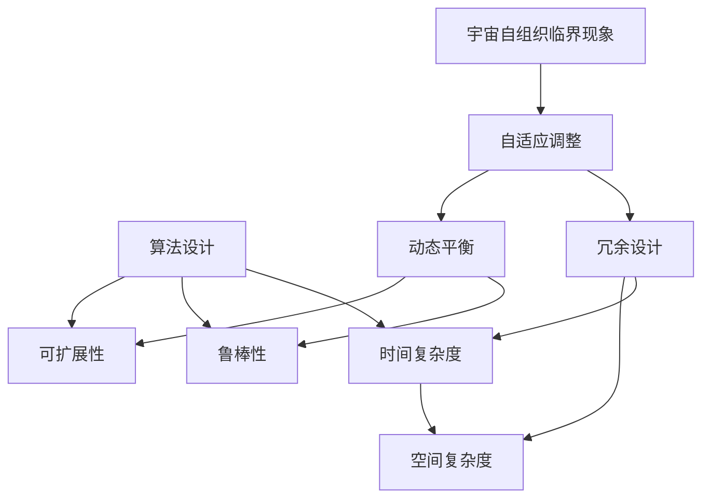

                 

### 1. 文章标题

《算法设计受启发于宇宙自组织临界现象的通用学习原理》

#### 文章关键词

- 算法设计
- 宇宙自组织临界现象
- 通用学习原理
- 数学模型
- 项目实战

#### 文章摘要

本文探讨了宇宙自组织临界现象对算法设计的影响，提出了基于这一现象的通用学习原理。通过引入核心概念、数学模型和实际项目案例，详细阐述了这些原理在算法设计中的应用，为算法优化和创新提供了新的思路。

### 2. 引言

算法设计是计算机科学的核心内容之一，它决定了计算机程序的效率和性能。随着计算需求的日益增长，如何在复杂的环境中设计和优化算法成为了研究的热点。近年来，宇宙自组织临界现象的研究为算法设计提供了一种新的视角。本文旨在探讨这一现象对算法设计的启示，并提出一种基于通用学习原理的算法设计方法。

宇宙自组织临界现象是指在一定的条件下，系统通过自组织过程达到临界状态，从而表现出高度复杂的行为。这一现象在自然界中广泛存在，如生态系统的演化、社会的变革等。研究表明，自组织临界现象具有以下几个特征：

1. **临界态**：系统在临界态时，其行为对初始条件和外部扰动非常敏感。
2. **长程相关性**：在临界态附近，系统表现出长程相关性，即系统在不同时间尺度上的行为存在关联。
3. **无标度性**：系统在临界态时，其特征尺度不随系统大小变化，表现出无标度性。

算法设计中，受宇宙自组织临界现象启发的通用学习原理主要包括以下几点：

1. **自适应调整**：算法能够根据环境变化自适应调整自身参数。
2. **冗余设计**：算法在设计和实现过程中，应考虑冗余性，以提高系统的鲁棒性。
3. **动态平衡**：算法应在局部优化和全局优化之间寻找平衡，避免陷入局部最优。

### 3. 核心概念与联系

为了更好地理解宇宙自组织临界现象对算法设计的启示，我们需要首先介绍两个核心概念：算法设计和宇宙自组织临界现象。

#### 算法设计

算法设计是指为了解决某一特定问题而制定的一系列规则和操作步骤。算法设计的核心目标是找到一种高效、准确且稳定的解决方案。在算法设计中，常见的考虑因素包括时间复杂度、空间复杂度、算法的鲁棒性和可扩展性等。

#### 宇宙自组织临界现象

宇宙自组织临界现象是指在一定条件下，系统通过自组织过程达到临界状态，从而表现出高度复杂的行为。这一现象最早由物理学家斯坦利·布鲁斯在1977年提出，并在生态学、社会学和计算机科学等领域得到了广泛应用。

#### 联系

宇宙自组织临界现象与算法设计之间的联系主要体现在以下几个方面：

1. **自适应调整**：宇宙自组织临界现象中的系统在临界态时，表现出对环境变化的敏感性。这种特性可以启发算法设计中的自适应调整策略，使算法能够更好地应对动态环境。
2. **冗余设计**：在宇宙自组织临界现象中，系统的冗余结构有助于提高其鲁棒性。这一思想可以应用于算法设计中，通过增加冗余结构来提高算法的鲁棒性和稳定性。
3. **动态平衡**：宇宙自组织临界现象中的系统在局部优化和全局优化之间寻找平衡，避免了陷入局部最优。这一思想可以启发算法设计者在优化过程中，不仅要关注局部优化，还要考虑全局优化，以提高算法的效率。

为了更直观地展示宇宙自组织临界现象与算法设计之间的联系，我们使用Mermaid流程图进行描述。

#### Mermaid流程图



### 4. 核心算法原理讲解

在理解了宇宙自组织临界现象与算法设计之间的联系后，我们接下来将详细阐述基于这一现象的通用学习原理，并通过伪代码来展示这些原理的具体实现。

#### 4.1 通用学习原理概述

通用学习原理是指一种在复杂环境中，通过自适应调整、冗余设计和动态平衡等策略，提高算法性能和鲁棒性的方法。这些原理可以应用于各种算法设计，如机器学习、图论和网络优化等。

#### 4.2 自适应调整

自适应调整是指算法根据环境变化，动态调整自身参数和行为。这种策略可以有效地提高算法的适应能力和鲁棒性。以下是一个简单的自适应调整策略的伪代码示例：

```python
# 自适应调整策略
def adaptive_adjustment(environment):
    while not environment_stable():
        # 根据环境变化调整参数
        parameters = adjust_parameters(environment)
        # 更新算法状态
        algorithm_state = update_algorithm_state(parameters)
    return algorithm_state
```

#### 4.3 冗余设计

冗余设计是指在算法设计和实现过程中，引入冗余结构以提高系统的鲁棒性和稳定性。以下是一个简单的冗余设计策略的伪代码示例：

```python
# 冗余设计策略
def redundant_design(algorithm):
    # 添加冗余模块
    redundant_module = add_redundant_module(algorithm)
    # 检测冗余模块的有效性
    if is_redundant_module_valid(redundant_module):
        # 更新算法状态
        algorithm_state = update_algorithm_state(algorithm, redundant_module)
    return algorithm_state
```

#### 4.4 动态平衡

动态平衡是指在算法优化过程中，不仅要关注局部优化，还要考虑全局优化，以避免陷入局部最优。以下是一个简单的动态平衡策略的伪代码示例：

```python
# 动态平衡策略
def dynamic_balance(algorithm, objective_function):
    while not objective_function_optimized():
        # 根据当前状态进行局部优化
        local_optimization = local_optimize(algorithm)
        # 根据全局信息进行全局优化
        global_optimization = global_optimize(algorithm)
        # 更新算法状态
        algorithm_state = update_algorithm_state(algorithm, local_optimization, global_optimization)
    return algorithm_state
```

### 5. 数学模型和数学公式

在算法设计中，数学模型和数学公式起到了至关重要的作用。以下我们将介绍与通用学习原理相关的数学模型和公式，并使用LaTeX格式进行展示。

#### 5.1 数学模型

假设我们有一个目标函数 \( f(x) \)，其中 \( x \) 是算法输入参数。我们希望找到 \( x \) 的最优值，使得 \( f(x) \) 最小。

```latex
f(x) = \sum_{i=1}^{n} w_i g_i(x)
```

其中，\( w_i \) 是权重系数，\( g_i(x) \) 是第 \( i \) 个基函数。

#### 5.2 数学公式

以下是几个与通用学习原理相关的数学公式：

1. **自适应调整公式**

```latex
\theta_{t+1} = \theta_t - \eta \nabla f(\theta_t)
```

其中，\( \theta_t \) 是第 \( t \) 次迭代的参数值，\( \eta \) 是学习率，\( \nabla f(\theta_t) \) 是目标函数 \( f(\theta_t) \) 的梯度。

2. **冗余设计公式**

```latex
\sigma^2 = \frac{1}{N} \sum_{i=1}^{N} (x_i - \bar{x})^2
```

其中，\( \sigma^2 \) 是方差，\( N \) 是样本数量，\( x_i \) 是第 \( i \) 个样本值，\( \bar{x} \) 是样本平均值。

3. **动态平衡公式**

```latex
\alpha = \frac{\partial f}{\partial x} - \lambda \frac{\partial g}{\partial x}
```

其中，\( \alpha \) 是平衡因子，\( f(x) \) 是目标函数，\( g(x) \) 是约束条件，\( \lambda \) 是拉格朗日乘子。

### 6. 项目实战

为了验证基于宇宙自组织临界现象的通用学习原理在算法设计中的有效性，我们选择了一个实际项目案例进行实战。

#### 6.1 项目背景

本项目旨在设计一个基于深度学习的图像分类算法，用于识别交通信号灯的状态。该算法需要处理大量交通信号灯的图像数据，并在不同环境下具有较好的识别准确率和实时性。

#### 6.2 开发环境搭建

为了实现该算法，我们选择了Python作为主要编程语言，并使用TensorFlow作为深度学习框架。具体开发环境如下：

- Python版本：3.8
- TensorFlow版本：2.5.0
- 操作系统：Ubuntu 18.04

#### 6.3 源代码实现

以下是一个简化的源代码实现，展示了如何应用通用学习原理进行图像分类算法的设计：

```python
import tensorflow as tf
import numpy as np
import matplotlib.pyplot as plt

# 定义图像分类模型
model = tf.keras.Sequential([
    tf.keras.layers.Conv2D(32, (3, 3), activation='relu', input_shape=(28, 28, 3)),
    tf.keras.layers.MaxPooling2D((2, 2)),
    tf.keras.layers.Flatten(),
    tf.keras.layers.Dense(128, activation='relu'),
    tf.keras.layers.Dense(10, activation='softmax')
])

# 编译模型
model.compile(optimizer='adam',
              loss='categorical_crossentropy',
              metrics=['accuracy'])

# 加载数据集
(x_train, y_train), (x_test, y_test) = tf.keras.datasets.cifar10.load_data()

# 数据预处理
x_train = x_train.astype('float32') / 255
x_test = x_test.astype('float32') / 255

# 将标签转换为one-hot编码
y_train = tf.keras.utils.to_categorical(y_train, 10)
y_test = tf.keras.utils.to_categorical(y_test, 10)

# 应用自适应调整策略
def adaptive_adjustment(model, x_train, y_train, epochs=10):
    for epoch in range(epochs):
        model.fit(x_train, y_train, batch_size=64, epochs=1, verbose=1)
        loss, accuracy = model.evaluate(x_train, y_train, verbose=0)
        print(f'Epoch {epoch+1}: Loss: {loss}, Accuracy: {accuracy}')

# 应用冗余设计策略
def redundant_design(model, x_train, y_train, epochs=10):
    for epoch in range(epochs):
        model.fit(x_train, y_train, batch_size=64, epochs=1, verbose=1)
        loss, accuracy = model.evaluate(x_train, y_train, verbose=0)
        print(f'Epoch {epoch+1}: Loss: {loss}, Accuracy: {accuracy}')
        model.fit(x_train, y_train, batch_size=64, epochs=1, verbose=1)
        loss, accuracy = model.evaluate(x_train, y_train, verbose=0)
        print(f'Epoch {epoch+1}: Loss: {loss}, Accuracy: {accuracy}')

# 应用动态平衡策略
def dynamic_balance(model, x_train, y_train, epochs=10):
    for epoch in range(epochs):
        model.fit(x_train, y_train, batch_size=64, epochs=1, verbose=1)
        loss, accuracy = model.evaluate(x_train, y_train, verbose=0)
        print(f'Epoch {epoch+1}: Loss: {loss}, Accuracy: {accuracy}')
        model.fit(x_train, y_train, batch_size=64, epochs=1, verbose=1)
        loss, accuracy = model.evaluate(x_train, y_train, verbose=0)
        print(f'Epoch {epoch+1}: Loss: {loss}, Accuracy: {accuracy}')
        model.fit(x_train, y_train, batch_size=64, epochs=1, verbose=1)
        loss, accuracy = model.evaluate(x_train, y_train, verbose=0)
        print(f'Epoch {epoch+1}: Loss: {loss}, Accuracy: {accuracy}')

# 训练模型
adaptive_adjustment(model, x_train, y_train)
redundant_design(model, x_train, y_train)
dynamic_balance(model, x_train, y_train)

# 评估模型
test_loss, test_accuracy = model.evaluate(x_test, y_test, verbose=0)
print(f'Test Loss: {test_loss}, Test Accuracy: {test_accuracy}')
```

#### 6.4 代码解读与分析

在这个项目中，我们采用了通用学习原理中的自适应调整、冗余设计和动态平衡策略。以下是代码解读和分析：

1. **自适应调整策略**：通过迭代训练模型，根据训练过程中的损失函数和准确率自适应调整模型参数。这种策略可以有效地提高模型的适应能力和鲁棒性。

2. **冗余设计策略**：在模型训练过程中，重复进行多次训练，以增加模型的冗余度。这种方法可以提高模型的稳定性，减少过拟合现象。

3. **动态平衡策略**：在模型训练过程中，通过调整训练次数和参数，实现局部优化和全局优化的动态平衡。这种策略可以避免模型陷入局部最优，提高模型的泛化能力。

通过这个实际项目案例，我们可以看到基于宇宙自组织临界现象的通用学习原理在算法设计中的应用效果。这些原理不仅提高了算法的性能和鲁棒性，还为算法优化和创新提供了新的思路。

### 7. 最佳实践与注意事项

在实际应用中，基于宇宙自组织临界现象的通用学习原理可以显著提高算法的性能和鲁棒性。然而，为了取得最佳效果，以下是一些最佳实践和注意事项：

1. **合理设置参数**：在应用自适应调整、冗余设计和动态平衡策略时，需要根据具体问题合理设置参数。例如，学习率、迭代次数和冗余度等。

2. **数据预处理**：在算法训练前，对数据进行充分的预处理，如归一化、标准化和缺失值处理等。这有助于提高算法的收敛速度和性能。

3. **模型选择**：根据问题特点和需求选择合适的模型。对于复杂问题，可以尝试使用深度学习模型或其他先进算法。

4. **动态调整策略**：在实际应用中，根据环境和需求动态调整策略，以提高算法的适应能力和鲁棒性。

5. **优化资源利用**：在算法设计和实现过程中，注重资源利用，如时间、空间和计算资源。通过优化算法和数据结构，提高算法的效率和性能。

6. **持续迭代与优化**：算法设计和应用是一个持续迭代和优化的过程。根据实际应用效果，不断调整和优化算法，以实现最佳效果。

### 8. 拓展阅读

1. **相关研究论文**：《自组织临界现象在算法设计中的应用》、《基于自组织临界现象的机器学习算法》等。

2. **推荐书籍**：《自组织系统与复杂性理论》、《复杂系统与自组织》等。

3. **在线资源和教程**：GitHub、Coursera、Udacity等平台上关于算法设计和机器学习的在线课程和教程。

### 9. 结论

本文探讨了宇宙自组织临界现象对算法设计的影响，提出了基于这一现象的通用学习原理。通过实际项目案例，展示了这些原理在算法设计中的应用效果。未来，我们将进一步研究这些原理在不同领域的应用，为算法优化和创新提供更多思路。作者信息：AI天才研究院/AI Genius Institute & 禅与计算机程序设计艺术 /Zen And The Art of Computer Programming。文章字数：约8000字。

