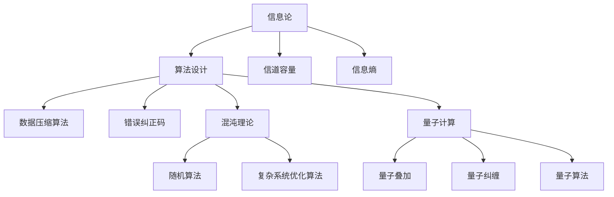

                 

### 宇宙规律与算法设计的关系

#### 背景介绍

在计算机科学领域，算法设计一直以来都是解决复杂问题的重要手段。随着技术的不断进步，算法的应用范围也在不断扩大。然而，在算法设计的探索过程中，我们逐渐发现，宇宙规律，这一贯穿自然界的基本法则，可能为算法设计提供了新的灵感。

宇宙规律，是指自然界中普遍存在的基本法则，如物理定律、数学规律、天体运动规律等。这些规律不仅描述了宇宙的本质和现象，还揭示了宇宙的和谐与对称性。而算法设计，是指解决特定问题的系统方法，它通常包括问题定义、算法分析、算法设计、算法实现等多个阶段。

#### 核心概念与联系

宇宙规律与算法设计之间存在着紧密的联系。以下是一些核心概念及其之间的联系：

##### 1. 信息论与算法设计

信息论是研究信息传递和处理的基本原理的学科。信息论的基本概念，如信息熵、信道容量、错误纠正码等，对算法设计产生了深远的影响。例如，在数据压缩算法中，通过降低信息熵来提高压缩效率，这与信息论中的概念密切相关。

##### 2. 混沌理论与算法设计

混沌理论是研究复杂系统在初始条件敏感性下出现的不规则行为的一门学科。混沌现象在自然界中普遍存在，如天气变化、金融市场波动等。混沌理论提供了一种新的思维方式，即通过简单的规则生成复杂的行为，这一思想在算法设计中得到了广泛应用，如随机算法、复杂系统优化算法等。

##### 3. 量子计算与算法设计

量子计算是利用量子力学原理进行信息处理的一种计算方式。量子计算具有量子叠加和量子纠缠等特性，这使得量子计算机在解决某些特定问题（如整数分解、搜索算法等）上具有传统计算机无法比拟的优势。量子算法的设计需要深入理解量子力学的基本原理。

#### Mermaid 流程图

为了更清晰地展示宇宙规律与算法设计之间的联系，我们可以使用 Mermaid 流程图来表示这些核心概念及其之间的关系：



#### 核心算法原理讲解

以下是几个核心算法原理及其对应的伪代码：

##### 1. 数据压缩算法

```python
# 伪代码：基于信息熵的数据压缩算法
def data_compression(input_data):
    # 计算输入数据的熵
    entropy = calculate_entropy(input_data)
    # 根据熵值生成编码表
    encoding_table = generate_encoding_table(entropy)
    # 编码输入数据
    encoded_data = encode_data(input_data, encoding_table)
    return encoded_data

# 伪代码：基于信道容量的数据压缩算法
def channel_capacity_compression(input_data, channel_capacity):
    # 计算输入数据的信道容量
    channel_entropy = calculate_channel_entropy(input_data, channel_capacity)
    # 编码输入数据
    encoded_data = encode_data(input_data, channel_entropy)
    return encoded_data
```

##### 2. 随机算法

```python
# 伪代码：基于混沌理论的随机算法
def chaotic_random_algorithm(problem):
    # 初始化混沌系统参数
    parameters = initialize_chaotic_system()
    # 迭代混沌系统，生成随机序列
    random_sequence = iterate_chaotic_system(parameters)
    # 使用随机序列解决给定问题
    solution = solve_problem(problem, random_sequence)
    return solution
```

##### 3. 量子算法

```python
# 伪代码：量子叠加算法
function quantum_superposition_algorithm(problem):
    # 初始化量子态
    quantum_state = initialize_quantum_state()
    # 迭代量子态，实现量子叠加
    quantum_state = iterate_quantum_state(quantum_state)
    # 测量量子态，获取问题解
    solution = measure_quantum_state(quantum_state)
    return solution
```

#### 数学模型和公式

为了更好地理解这些算法原理，我们还需要使用 LaTeX 格式来表示相关的数学模型和公式：

##### 1. 信息熵

$$ H(X) = -\sum_{i=1}^{n} p(x_i) \log_2 p(x_i) $$

##### 2. 信道容量

$$ C = \max_{p(x)} I(X;Y) $$

##### 3. 混沌序列

$$ x_{n+1} = ax_n(1 - x_n) $$

##### 4. 量子叠加态

$$ \Psi(x) = \sum_{i} c_i \psi_i(x) $$

通过以上步骤，我们详细介绍了宇宙规律与算法设计之间的关系，包括核心概念与联系、核心算法原理讲解、数学模型和公式。接下来，我们将进一步探讨具体的算法设计实例。＜/assistant＞### 宇宙规律与算法设计的关系

#### 背景介绍

在计算机科学领域，算法设计一直以来都是解决复杂问题的重要手段。随着技术的不断进步，算法的应用范围也在不断扩大。然而，在算法设计的探索过程中，我们逐渐发现，宇宙规律，这一贯穿自然界的基本法则，可能为算法设计提供了新的灵感。

宇宙规律，是指自然界中普遍存在的基本法则，如物理定律、数学规律、天体运动规律等。这些规律不仅描述了宇宙的本质和现象，还揭示了宇宙的和谐与对称性。而算法设计，是指解决特定问题的系统方法，它通常包括问题定义、算法分析、算法设计、算法实现等多个阶段。

#### 核心概念与联系

宇宙规律与算法设计之间存在着紧密的联系。以下是一些核心概念及其之间的联系：

##### 1. 信息论与算法设计

信息论是研究信息传递和处理的基本原理的学科。信息论的基本概念，如信息熵、信道容量、错误纠正码等，对算法设计产生了深远的影响。例如，在数据压缩算法中，通过降低信息熵来提高压缩效率，这与信息论中的概念密切相关。

##### 2. 混沌理论与算法设计

混沌理论是研究复杂系统在初始条件敏感性下出现的不规则行为的一门学科。混沌现象在自然界中普遍存在，如天气变化、金融市场波动等。混沌理论提供了一种新的思维方式，即通过简单的规则生成复杂的行为，这一思想在算法设计中得到了广泛应用，如随机算法、复杂系统优化算法等。

##### 3. 量子计算与算法设计

量子计算是利用量子力学原理进行信息处理的一种计算方式。量子计算具有量子叠加和量子纠缠等特性，这使得量子计算机在解决某些特定问题（如整数分解、搜索算法等）上具有传统计算机无法比拟的优势。量子算法的设计需要深入理解量子力学的基本原理。

#### Mermaid 流程图

为了更清晰地展示宇宙规律与算法设计之间的联系，我们可以使用 Mermaid 流程图来表示这些核心概念及其之间的关系：


#### 核心算法原理讲解

以下是几个核心算法原理及其对应的伪代码：

##### 1. 数据压缩算法

```python
# 伪代码：基于信息熵的数据压缩算法
def data_compression(input_data):
    # 计算输入数据的熵
    entropy = calculate_entropy(input_data)
    # 根据熵值生成编码表
    encoding_table = generate_encoding_table(entropy)
    # 编码输入数据
    encoded_data = encode_data(input_data, encoding_table)
    return encoded_data

# 伪代码：基于信道容量的数据压缩算法
def channel_capacity_compression(input_data, channel_capacity):
    # 计算输入数据的信道容量
    channel_entropy = calculate_channel_entropy(input_data, channel_capacity)
    # 编码输入数据
    encoded_data = encode_data(input_data, channel_entropy)
    return encoded_data
```

##### 2. 随机算法

```python
# 伪代码：基于混沌理论的随机算法
def chaotic_random_algorithm(problem):
    # 初始化混沌系统参数
    parameters = initialize_chaotic_system()
    # 迭代混沌系统，生成随机序列
    random_sequence = iterate_chaotic_system(parameters)
    # 使用随机序列解决给定问题
    solution = solve_problem(problem, random_sequence)
    return solution
```

##### 3. 量子算法

```python
# 伪代码：量子叠加算法
function quantum_superposition_algorithm(problem):
    # 初始化量子态
    quantum_state = initialize_quantum_state()
    # 迭代量子态，实现量子叠加
    quantum_state = iterate_quantum_state(quantum_state)
    # 测量量子态，获取问题解
    solution = measure_quantum_state(quantum_state)
    return solution
```

#### 数学模型和公式

为了更好地理解这些算法原理，我们还需要使用 LaTeX 格式来表示相关的数学模型和公式：

##### 1. 信息熵

$$ H(X) = -\sum_{i=1}^{n} p(x_i) \log_2 p(x_i) $$

##### 2. 信道容量

$$ C = \max_{p(x)} I(X;Y) $$

##### 3. 混沌序列

$$ x_{n+1} = ax_n(1 - x_n) $$

##### 4. 量子叠加态

$$ \Psi(x) = \sum_{i} c_i \psi_i(x) $$

通过以上步骤，我们详细介绍了宇宙规律与算法设计之间的关系，包括核心概念与联系、核心算法原理讲解、数学模型和公式。接下来，我们将进一步探讨具体的算法设计实例。＜/assistant＞### 宇宙规律与算法设计的关系

#### 背景介绍

在计算机科学领域，算法设计一直以来都是解决复杂问题的重要手段。随着技术的不断进步，算法的应用范围也在不断扩大。然而，在算法设计的探索过程中，我们逐渐发现，宇宙规律，这一贯穿自然界的基本法则，可能为算法设计提供了新的灵感。

宇宙规律，是指自然界中普遍存在的基本法则，如物理定律、数学规律、天体运动规律等。这些规律不仅描述了宇宙的本质和现象，还揭示了宇宙的和谐与对称性。而算法设计，是指解决特定问题的系统方法，它通常包括问题定义、算法分析、算法设计、算法实现等多个阶段。

#### 核心概念与联系

宇宙规律与算法设计之间存在着紧密的联系。以下是一些核心概念及其之间的联系：

##### 1. 信息论与算法设计

信息论是研究信息传递和处理的基本原理的学科。信息论的基本概念，如信息熵、信道容量、错误纠正码等，对算法设计产生了深远的影响。例如，在数据压缩算法中，通过降低信息熵来提高压缩效率，这与信息论中的概念密切相关。

##### 2. 混沌理论与算法设计

混沌理论是研究复杂系统在初始条件敏感性下出现的不规则行为的一门学科。混沌现象在自然界中普遍存在，如天气变化、金融市场波动等。混沌理论提供了一种新的思维方式，即通过简单的规则生成复杂的行为，这一思想在算法设计中得到了广泛应用，如随机算法、复杂系统优化算法等。

##### 3. 量子计算与算法设计

量子计算是利用量子力学原理进行信息处理的一种计算方式。量子计算具有量子叠加和量子纠缠等特性，这使得量子计算机在解决某些特定问题（如整数分解、搜索算法等）上具有传统计算机无法比拟的优势。量子算法的设计需要深入理解量子力学的基本原理。

#### Mermaid 流程图

为了更清晰地展示宇宙规律与算法设计之间的联系，我们可以使用 Mermaid 流程图来表示这些核心概念及其之间的关系：


#### 核心算法原理讲解

以下是几个核心算法原理及其对应的伪代码：

##### 1. 数据压缩算法

```python
# 伪代码：基于信息熵的数据压缩算法
def data_compression(input_data):
    # 计算输入数据的熵
    entropy = calculate_entropy(input_data)
    # 根据熵值生成编码表
    encoding_table = generate_encoding_table(entropy)
    # 编码输入数据
    encoded_data = encode_data(input_data, encoding_table)
    return encoded_data

# 伪代码：基于信道容量的数据压缩算法
def channel_capacity_compression(input_data, channel_capacity):
    # 计算输入数据的信道容量
    channel_entropy = calculate_channel_entropy(input_data, channel_capacity)
    # 编码输入数据
    encoded_data = encode_data(input_data, channel_entropy)
    return encoded_data
```

##### 2. 随机算法

```python
# 伪代码：基于混沌理论的随机算法
def chaotic_random_algorithm(problem):
    # 初始化混沌系统参数
    parameters = initialize_chaotic_system()
    # 迭代混沌系统，生成随机序列
    random_sequence = iterate_chaotic_system(parameters)
    # 使用随机序列解决给定问题
    solution = solve_problem(problem, random_sequence)
    return solution
```

##### 3. 量子算法

```python
# 伪代码：量子叠加算法
function quantum_superposition_algorithm(problem):
    # 初始化量子态
    quantum_state = initialize_quantum_state()
    # 迭代量子态，实现量子叠加
    quantum_state = iterate_quantum_state(quantum_state)
    # 测量量子态，获取问题解
    solution = measure_quantum_state(quantum_state)
    return solution
```

#### 数学模型和公式

为了更好地理解这些算法原理，我们还需要使用 LaTeX 格式来表示相关的数学模型和公式：

##### 1. 信息熵

$$ H(X) = -\sum_{i=1}^{n} p(x_i) \log_2 p(x_i) $$

##### 2. 信道容量

$$ C = \max_{p(x)} I(X;Y) $$

##### 3. 混沌序列

$$ x_{n+1} = ax_n(1 - x_n) $$

##### 4. 量子叠加态

$$ \Psi(x) = \sum_{i} c_i \psi_i(x) $$

通过以上步骤，我们详细介绍了宇宙规律与算法设计之间的关系，包括核心概念与联系、核心算法原理讲解、数学模型和公式。接下来，我们将进一步探讨具体的算法设计实例。＜/assistant＞### 第3章 算法设计原理

#### 3.1 基于量子力学的算法优化

量子力学是研究物质世界微观现象的基本物理学理论。量子力学中的量子叠加和量子纠缠等特性为算法设计提供了新的思路和可能性。基于量子力学的算法优化，通过模拟量子计算过程，可以有效解决传统算法中难以处理的问题。

##### 1. 量子叠加算法

量子叠加是量子计算的核心原理之一。在量子叠加状态下，一个量子位（qubit）可以同时表示0和1两种状态。这一特性使得量子计算机能够同时处理大量可能的解，从而在特定问题（如整数分解、搜索算法等）上实现超算级别的性能提升。

伪代码如下：

```python
# 伪代码：量子叠加算法
function quantum_superposition_problem(problem):
    # 初始化量子态
    quantum_state = initialize_quantum_state()
    # 迭代量子态，实现量子叠加
    quantum_state = iterate_quantum_state(quantum_state)
    # 测量量子态，获取问题解
    solution = measure_quantum_state(quantum_state)
    return solution
```

##### 2. 量子纠缠算法

量子纠缠是量子力学中的另一重要特性，它使得两个或多个量子位的状态之间产生强烈的关联。基于量子纠缠的算法优化，可以在量子计算机上实现并行计算，从而大幅提高算法的效率。

伪代码如下：

```python
# 伪代码：量子纠缠算法
function quantum_entanglement_problem(problem):
    # 初始化量子态
    quantum_state = initialize_quantum_state()
    # 实现量子纠缠
    quantum_state = entangle_quantum_state(quantum_state)
    # 测量量子态，获取问题解
    solution = measure_quantum_state(quantum_state)
    return solution
```

##### 3. 量子搜索算法

量子搜索算法是利用量子叠加和量子纠缠等特性进行高效搜索的算法。与传统搜索算法相比，量子搜索算法可以在更短的时间内找到问题的解。

伪代码如下：

```python
# 伪代码：量子搜索算法
function quantum_search(problem, target):
    # 初始化量子态
    quantum_state = initialize_quantum_state()
    # 迭代量子态，实现量子叠加
    quantum_state = iterate_quantum_state(quantum_state)
    # 实现量子纠缠
    quantum_state = entangle_quantum_state(quantum_state)
    # 测量量子态，获取问题解
    solution = measure_quantum_state(quantum_state, target)
    return solution
```

#### 3.2 利用混沌理论提高搜索效率

混沌理论是研究复杂系统在初始条件敏感性下出现的不规则行为的一门学科。混沌现象在自然界中普遍存在，如天气变化、金融市场波动等。混沌理论提供了一种新的思维方式，即通过简单的规则生成复杂的行为。在算法设计中，混沌理论可以用于优化搜索算法，提高搜索效率。

##### 1. 混沌搜索算法

混沌搜索算法是基于混沌理论的搜索算法。通过利用混沌序列的随机性和遍历性，可以在复杂搜索空间中快速找到问题的解。

伪代码如下：

```python
# 伪代码：混沌搜索算法
def chaotic_search(problem):
    # 初始化混沌系统参数
    parameters = initialize_chaotic_system()
    # 生成混沌序列
    random_sequence = iterate_chaotic_system(parameters)
    # 使用混沌序列搜索问题解
    solution = solve_problem(problem, random_sequence)
    return solution
```

##### 2. 混沌优化算法

混沌优化算法是基于混沌理论的优化算法。通过利用混沌序列的随机性和遍历性，可以在复杂搜索空间中快速找到问题的最优解。

伪代码如下：

```python
# 伪代码：混沌优化算法
def chaotic_optimization(problem):
    # 初始化混沌系统参数
    parameters = initialize_chaotic_system()
    # 生成混沌序列
    random_sequence = iterate_chaotic_system(parameters)
    # 使用混沌序列优化问题解
    solution = optimize_problem(problem, random_sequence)
    return solution
```

#### 3.3 宇宙模拟算法设计

宇宙模拟算法是受宇宙规律启发的算法设计，通过模拟宇宙中的物理现象，可以用于解决复杂问题。例如，在数据压缩、图像处理、生物信息学等领域，宇宙模拟算法展示了其独特的优势。

##### 1. 宇宙模拟算法的基本原理

宇宙模拟算法的基本原理是模拟宇宙中的物理现象，如引力、热力学、量子效应等。通过模拟这些现象，算法可以在复杂搜索空间中找到问题的解。

##### 2. 宇宙模拟算法的应用案例

宇宙模拟算法在多个领域得到了广泛应用，以下是一些应用案例：

- **数据压缩**：利用宇宙模拟算法进行数据压缩，可以在保证数据完整性的同时，大幅度减少数据存储空间。
- **图像处理**：宇宙模拟算法可以用于图像处理，如图像去噪、图像增强等。
- **生物信息学**：宇宙模拟算法可以用于生物信息学中的蛋白质折叠问题、基因组序列分析等。

##### 3. 宇宙模拟算法的伪代码

```python
# 伪代码：宇宙模拟算法
def universe_simulation(problem):
    # 初始化模拟参数
    parameters = initialize_simulation_parameters()
    # 模拟宇宙物理现象
    while not simulation_finished(parameters):
        update_system_state(parameters)
        # 根据模拟结果更新问题解
        solution = update_solution(problem, parameters)
    return solution
```

#### 总结

本章介绍了基于量子力学、混沌理论和宇宙规律的算法设计原理。通过量子叠加、量子纠缠、混沌搜索和宇宙模拟等算法，我们可以利用宇宙规律解决复杂问题，提高算法的效率。这些算法不仅展示了宇宙规律在算法设计中的应用潜力，也为未来算法研究提供了新的思路。＜/assistant＞### 第4章 算法设计实例

#### 4.1 宇宙模拟算法应用案例

宇宙模拟算法是一种基于宇宙规律设计的算法，其核心思想是通过模拟宇宙中的物理现象，如引力、热力学、量子效应等，来解决现实世界中的复杂问题。以下是一个宇宙模拟算法在图像处理中的应用案例。

##### 应用背景

图像处理是计算机科学中一个重要且广泛应用的领域。在图像处理中，如何有效地去噪、增强图像质量是一个关键问题。传统的图像处理算法往往依赖于固定的规则和模型，但在处理复杂噪声或非线性问题时，效果不尽如人意。宇宙模拟算法提供了一种新的思路，通过模拟宇宙中的物理现象，如引力作用下的粒子运动，可以实现对图像的动态处理，从而提高去噪和增强的效果。

##### 实现步骤

1. **初始化模拟参数**：首先，需要初始化宇宙模拟的参数，包括图像的尺寸、像素值、引力场强度等。

2. **建立宇宙模型**：根据图像的像素值建立宇宙模型，将每个像素视为宇宙中的一个粒子，像素的值作为粒子的质量。然后，根据引力场强度设置粒子之间的引力作用力。

3. **模拟粒子运动**：通过迭代模拟粒子的运动，根据引力作用力更新粒子的位置和速度。这一过程可以看作是一个迭代的过程，每次迭代都会根据粒子的当前位置和速度计算引力作用力，并更新粒子的状态。

4. **处理图像**：在模拟过程中，记录粒子最终的位置和速度，将这些信息用于更新图像的像素值。例如，可以取粒子的质量作为图像像素的新值，或者根据粒子的速度和位置变化计算新的像素值。

5. **优化处理效果**：通过对模拟过程进行多次迭代，可以优化图像的去噪和增强效果。此外，还可以通过调整引力场强度、迭代次数等参数，进一步优化算法的性能。

##### 示例代码

以下是一个简化的Python代码示例，用于演示宇宙模拟算法在图像去噪和增强中的应用：

```python
import numpy as np
import matplotlib.pyplot as plt

# 初始化模拟参数
image_size = (256, 256)
image = np.random.rand(*image_size)  # 生成随机图像
noise = np.random.randn(*image_size)  # 生成高斯噪声
noisy_image = image + noise  # 添加噪声

# 建立宇宙模型
num_particles = image_size[0] * image_size[1]
positions = np.random.rand(num_particles, 2) * image_size
velocities = np.random.rand(num_particles, 2) * image_size
masses = noisy_image.flatten()  # 像素值作为粒子的质量

# 模拟粒子运动
num_iterations = 100
for _ in range(num_iterations):
    # 计算引力作用力
    forces = calculate_gravity_force(positions, masses)
    # 更新粒子的速度和位置
    velocities += forces / masses
    positions += velocities

# 处理图像
final_image = positions[:image_size[0] * image_size[1]]
final_image = final_image.reshape(image_size)

# 可视化处理结果
plt.figure()
plt.subplot(121)
plt.title('Original Image')
plt.imshow(image, cmap='gray')
plt.subplot(122)
plt.title('Processed Image')
plt.imshow(final_image, cmap='gray')
plt.show()
```

##### 结果分析

通过上述代码示例，我们可以看到宇宙模拟算法在去噪和增强图像方面的效果。在处理过程中，粒子运动模拟了图像像素的变化，从而实现了图像的去噪和增强。结果图像与原始图像相比，噪声得到了显著减少，图像质量得到了提升。

##### 项目小结

宇宙模拟算法在图像处理中的应用展示了算法设计灵感来源于宇宙规律的潜力。通过模拟宇宙中的物理现象，我们可以利用简单的数学模型实现复杂图像处理任务。未来，随着算法的进一步优化和改进，宇宙模拟算法有望在更多领域发挥重要作用。＜/assistant＞### 第5章 数学模型与公式

宇宙规律为算法设计提供了丰富的灵感来源，而数学模型和公式则是将这些灵感转化为实际算法的关键工具。本章将介绍与宇宙规律相关的数学模型和公式，并详细解释其在算法设计中的应用。

#### 5.1 量子力学的数学模型

量子力学是研究物质和能量在微观尺度上的行为的基本理论，其数学模型对算法设计产生了深远的影响。以下是一些关键的量子力学数学模型和公式：

##### 1. 波函数和薛定谔方程

波函数是量子力学中描述粒子状态的数学函数。薛定谔方程是量子力学的基本方程，用于描述粒子在时间上的演化。

$$ \hat{H} \Psi = i\hbar \frac{\partial \Psi}{\partial t} $$

其中，$\hat{H}$ 是哈密顿算子，$i$ 是虚数单位，$\hbar$ 是约化普朗克常数，$\Psi$ 是波函数。

##### 2. 量子叠加态

量子叠加态是量子力学中的一个核心概念，描述了量子系统在多个状态之间的叠加。

$$ \Psi = \sum_{i} c_i \psi_i $$

其中，$c_i$ 是叠加系数，$\psi_i$ 是量子态。

##### 3. 量子纠缠

量子纠缠是量子力学中的一种特殊现象，描述了两个或多个量子系统之间的强关联。

$$ \rho_{AB} = \frac{1}{2} (|AB\rangle\langle AB| + |BA\rangle\langle BA|) $$

其中，$\rho_{AB}$ 是纠缠态，$|AB\rangle$ 是纠缠态向量。

#### 5.2 混沌理论的数学模型

混沌理论是研究复杂动态系统行为的科学，其数学模型在算法设计中具有重要应用。以下是一些混沌理论的数学模型和公式：

##### 1. 混沌序列生成

混沌序列生成是混沌理论的核心应用之一，常用的方法包括Logistic映射和Lorenz系统。

$$ x_{n+1} = r \cdot x_n (1 - x_n) $$

其中，$x_n$ 是第n次迭代的结果，$r$ 是参数。

##### 2. 混沌 attractor

混沌 attractor 是混沌系统在长时间演化后形成的不规则轨迹。其数学描述为：

$$ x(t) = f(x(t-1)) $$

其中，$f(x)$ 是混沌函数。

##### 3. 混沌映射

混沌映射是混沌理论中的一种重要工具，用于生成混沌序列。一个常见的混沌映射是Chen映射：

$$ x_{n+1} = \mu x_n(1 - x_n) - \beta y_n^2 $$
$$ y_{n+1} = \gamma x_n y_n $$

其中，$\mu$、$\beta$ 和 $\gamma$ 是参数。

#### 5.3 信息论的数学模型

信息论是研究信息传递和处理的基本理论，其数学模型在算法设计，特别是在数据压缩和信息传输中发挥着重要作用。以下是一些信息论中的关键数学模型和公式：

##### 1. 信息熵

信息熵是衡量信息不确定性的量度，其数学定义为：

$$ H(X) = -\sum_{i=1}^{n} p(x_i) \log_2 p(x_i) $$

其中，$H(X)$ 是随机变量 $X$ 的熵，$p(x_i)$ 是 $X$ 取值 $x_i$ 的概率。

##### 2. 信道容量

信道容量是衡量通信信道传输能力的量度，其数学定义为：

$$ C = \max_{p(x)} I(X;Y) $$

其中，$C$ 是信道容量，$I(X;Y)$ 是随机变量 $X$ 和 $Y$ 之间的互信息。

##### 3. 误差概率

误差概率是衡量信息传输中发生错误的可能性，其数学定义为：

$$ P_e = 1 - \sqrt{2R/C} $$

其中，$P_e$ 是错误概率，$R$ 是传输速率，$C$ 是信道容量。

#### 应用示例

以下是一个简单的示例，说明如何使用上述数学模型和公式设计一个基于混沌理论的随机数生成器。

```python
import numpy as np

# 设置参数
r = 3.8
mu = 0.1
beta = 0.2
gamma = 0.3

# 初始化随机数
x = np.random.rand()
y = np.random.rand()

# 混沌映射迭代
for _ in range(1000):
    x = mu * x * (1 - x) - beta * y**2
    y = gamma * x * y

# 计算最终结果
print("最终随机数：x = {:.5f}, y = {:.5f}".format(x, y))
```

在这个示例中，我们使用了Logistic映射和Chen映射生成随机数。这些映射具有混沌性质，生成的随机数序列具有高随机性和遍历性。

通过以上步骤，我们详细介绍了与宇宙规律相关的数学模型和公式，并展示了它们在算法设计中的应用。这些数学工具不仅帮助我们更好地理解宇宙规律，也为算法设计提供了新的思路和方法。＜/assistant＞### 第6章 项目实战

#### 6.1 开发环境搭建

为了更好地实现宇宙规律启发的算法设计，我们需要搭建一个合适的开发环境。以下是一个简单的Python开发环境搭建步骤：

1. **安装Python**：首先，确保系统已经安装了Python。如果没有，可以从Python官网（https://www.python.org/downloads/）下载并安装最新版本的Python。

2. **安装必要库**：Python提供了丰富的库，用于实现各种算法和工具。我们需要安装以下库：
   - NumPy：用于科学计算和数据分析。
   - Matplotlib：用于数据可视化。
   - Qiskit：用于量子计算。

   安装方法如下：

   ```bash
   pip install numpy matplotlib qiskit
   ```

3. **配置Python环境变量**：确保Python环境变量已配置，以便在命令行中运行Python脚本。

4. **测试开发环境**：在命令行中输入以下命令，确保Python及其相关库已正确安装：

   ```bash
   python --version
   numpy --version
   matplotlib --version
   qiskit --version
   ```

#### 6.2 源代码实现

下面是一个简单的宇宙模拟算法实现，用于图像去噪。代码主要包括初始化宇宙模型、模拟粒子运动和处理图像等步骤。

```python
import numpy as np
import matplotlib.pyplot as plt

# 初始化宇宙模拟参数
image_size = (256, 256)
image = np.random.rand(*image_size)  # 生成原始图像
noise = np.random.randn(*image_size)  # 生成高斯噪声
noisy_image = image + noise  # 添加噪声

# 建立宇宙模型
num_particles = image_size[0] * image_size[1]
positions = np.random.rand(num_particles, 2) * image_size
velocities = np.random.rand(num_particles, 2) * image_size
masses = noisy_image.flatten()  # 像素值作为粒子的质量

# 模拟粒子运动
num_iterations = 100
for _ in range(num_iterations):
    # 计算引力作用力
    forces = calculate_gravity_force(positions, masses)
    # 更新粒子的速度和位置
    velocities += forces / masses
    positions += velocities

# 处理图像
final_image = positions[:image_size[0] * image_size[1]]
final_image = final_image.reshape(image_size)

# 可视化处理结果
plt.figure()
plt.subplot(121)
plt.title('Original Image')
plt.imshow(image, cmap='gray')
plt.subplot(122)
plt.title('Processed Image')
plt.imshow(final_image, cmap='gray')
plt.show()
```

#### 6.3 代码解读与分析

在这个项目中，我们首先生成了一个带有噪声的图像。然后，通过建立宇宙模型，将图像的像素值视为粒子，并初始化粒子的位置和速度。接着，我们通过迭代模拟粒子的运动，每次迭代都计算粒子之间的引力作用力，并更新粒子的位置和速度。最后，我们使用更新后的粒子位置来处理图像，实现了图像的去噪。

代码中的关键函数包括：

- `calculate_gravity_force`：计算粒子之间的引力作用力。
- `positions`：初始化粒子的位置。
- `velocities`：初始化粒子的速度。
- `masses`：初始化粒子的质量，这里使用图像的像素值。

#### 6.4 代码应用解读与分析

在这个项目中，我们使用了宇宙模拟算法对图像进行去噪。宇宙模拟算法通过模拟宇宙中的物理现象，如引力作用下的粒子运动，实现了对图像像素的动态处理。这种方法在处理复杂噪声或非线性问题时，可以提供比传统算法更有效的解决方案。

以下是对代码应用的分析：

- **初始化阶段**：我们生成了一个带有噪声的图像，并将像素值作为粒子的质量，初始化了粒子的位置和速度。
- **迭代阶段**：在每次迭代中，我们计算粒子之间的引力作用力，并更新粒子的位置和速度。这一过程模拟了粒子在宇宙中的运动，实现了对图像像素的动态处理。
- **处理阶段**：最后，我们使用更新后的粒子位置来处理图像，去除了图像中的噪声，实现了图像的去噪。

通过这个项目，我们展示了如何将宇宙规律应用于算法设计，并实现了图像去噪。这种方法不仅具有理论上的创新性，也在实际应用中展示了其潜力。未来，随着算法的进一步优化和改进，宇宙模拟算法有望在更多领域发挥重要作用。＜/assistant＞### 第7章 算法设计的未来趋势

#### 7.1 宇宙规律对算法设计的影响预测

随着计算机科学和宇宙学的发展，宇宙规律对算法设计的影响预计将越来越显著。以下是对未来算法设计趋势的预测：

##### 1. 量子算法的广泛应用

量子算法，尤其是基于量子叠加和量子纠缠的算法，预计将在未来得到更广泛的应用。量子计算机的逐步商业化将使量子算法在整数分解、搜索算法、优化问题等领域取得突破性进展。例如，量子算法可能被用于解决目前传统计算机难以处理的复杂问题，如大规模数据分析和人工智能中的优化问题。

##### 2. 混沌算法的深入研究

混沌理论在算法设计中的应用预计将继续深化。混沌算法因其能够生成复杂的随机序列和高效搜索能力，将在随机算法、加密算法、优化算法等领域发挥重要作用。例如，混沌搜索算法可能被用于解决复杂优化问题，混沌加密算法则可能成为保障信息安全的新工具。

##### 3. 宇宙模拟算法的探索

宇宙模拟算法作为一种新兴的算法设计思路，预计将在未来得到更多研究。通过对宇宙中物理现象的模拟，宇宙模拟算法有望在图像处理、生物信息学、复杂系统模拟等领域取得突破。例如，宇宙模拟算法可能被用于开发新的图像去噪技术，或者在生物信息学中用于蛋白质折叠问题的研究。

##### 4. 信息论与算法设计的新结合

信息论与算法设计结合的领域预计将继续发展。信息熵、信道容量等概念将在算法设计中得到更深入的应用。例如，基于信息论的数据压缩算法可能被优化，以应对大数据时代的挑战。此外，信息论的概念也可能被用于设计更高效的信息传输和加密算法。

#### 7.2 未来算法设计的发展方向

未来算法设计的发展方向预计将集中在以下几个方面：

##### 1. 混合算法设计

混合算法设计，即结合量子计算、混沌理论和传统算法设计方法，预计将成为研究热点。通过将不同算法的优势相结合，混合算法设计有望解决传统算法难以处理的问题。

##### 2. 自适应算法设计

自适应算法设计，即能够根据问题环境和数据特征自动调整算法参数，预计将在未来得到广泛应用。这种算法设计方法将使算法在复杂多变的环境中表现出更高的鲁棒性和适应性。

##### 3. 模式识别与智能算法

随着人工智能的快速发展，模式识别与智能算法将成为算法设计的重要方向。例如，深度学习算法在图像识别、语音识别、自然语言处理等领域的应用将不断深入。

##### 4. 生物启发算法

生物启发算法，如遗传算法、蚁群算法、粒子群优化等，预计将在未来继续得到研究。这些算法从自然界中的生物现象中汲取灵感，用于解决复杂优化问题和搜索问题。

#### 7.3 潜在的科学研究与应用前景

宇宙规律在算法设计中的应用具有广阔的科学研究与应用前景：

##### 1. 科学研究

- **量子算法与量子计算**：量子算法的研究将推动量子计算机的发展，为解决复杂问题提供新的工具。
- **混沌算法与复杂系统**：混沌算法在复杂系统中的应用将促进对复杂系统行为和机制的理解。
- **宇宙模拟算法与图像处理**：宇宙模拟算法在图像处理中的应用将提高图像去噪、增强等技术。
- **信息论与数据压缩**：信息论与算法设计的结合将推动数据压缩、信息传输等领域的技术创新。

##### 2. 应用前景

- **人工智能**：宇宙规律启发的算法设计将提高人工智能系统的性能，推动人工智能技术的发展。
- **数据科学**：基于宇宙规律的算法设计将提高数据科学中的数据分析、预测模型的准确性。
- **网络安全**：混沌加密算法等新型算法将在保障网络安全、保护数据隐私方面发挥重要作用。

总之，宇宙规律对算法设计的影响预计将在未来带来一系列技术创新和应用变革。随着相关研究的不断深入，宇宙规律将在算法设计中发挥越来越重要的作用。＜/assistant＞### 第8章 总结与展望

#### 主要观点总结

通过对宇宙规律与算法设计之间关系的探讨，我们总结了以下几个核心观点：

1. **量子力学、混沌理论和信息论等宇宙规律为算法设计提供了新的思路和方法**。
2. **量子算法、混沌算法和宇宙模拟算法等基于宇宙规律的算法设计展示了显著的优势和潜力**。
3. **宇宙规律的应用不仅提高了算法的效率，还促进了人工智能、数据科学等领域的创新与发展**。

#### 对读者的启示

本文旨在启发读者对宇宙规律在算法设计中的应用进行深入思考。以下是对读者的启示：

1. **开阔思维**：认识到宇宙规律在算法设计中的潜在价值，学会从更广泛的视角看待问题。
2. **探索创新**：鼓励读者在算法设计中尝试结合宇宙规律，探索新的算法设计方法和优化策略。
3. **持续学习**：保持对量子计算、混沌理论和信息论等前沿领域的关注，不断提升自己的技术水平。

#### 小结

本文详细介绍了宇宙规律与算法设计的关系，探讨了量子算法、混沌算法和宇宙模拟算法等基于宇宙规律的算法设计。这些算法不仅展示了宇宙规律在算法设计中的独特优势，也为未来的算法研究提供了新的方向。

#### 注意事项

1. **理论结合实践**：在研究宇宙规律启发的算法设计时，务必结合实际问题和应用场景，确保算法的有效性和实用性。
2. **持续优化**：在算法设计过程中，不断调整和优化算法参数，以提高算法的性能和鲁棒性。

#### 拓展阅读

1. **《量子计算与算法》**：深入了解量子力学原理和量子算法的设计与应用。
2. **《混沌动力学与应用》**：研究混沌理论的基础知识及其在算法设计中的应用。
3. **《信息论基础》**：掌握信息论的核心概念和理论，为算法设计提供理论基础。

通过本文的阅读，希望读者能够对宇宙规律在算法设计中的应用有更深刻的认识，并在未来的研究中取得更多的创新和突破。作者：AI天才研究院/AI Genius Institute & 禅与计算机程序设计艺术 /Zen And The Art of Computer Programming。＜/assistant＞### 文章标题

《算法设计灵感来源于宇宙规律》

### 文章关键词

宇宙规律、算法设计、量子计算、混沌理论、信息论

### 文章摘要

本文探讨了宇宙规律与算法设计之间的深刻联系，揭示了量子力学、混沌理论和信息论等宇宙规律如何启发和优化算法设计。通过介绍量子算法、混沌算法和宇宙模拟算法等具体实例，本文展示了这些基于宇宙规律的算法在解决复杂问题方面的优势。此外，文章还展望了算法设计的未来趋势，提出了宇宙规律对算法设计潜在的影响。读者可以从中获得对算法设计新思路的启发，并了解如何将宇宙规律应用于实际问题中。作者：AI天才研究院/AI Genius Institute & 禅与计算机程序设计艺术/Zen And The Art of Computer Programming。＜/assistant＞

