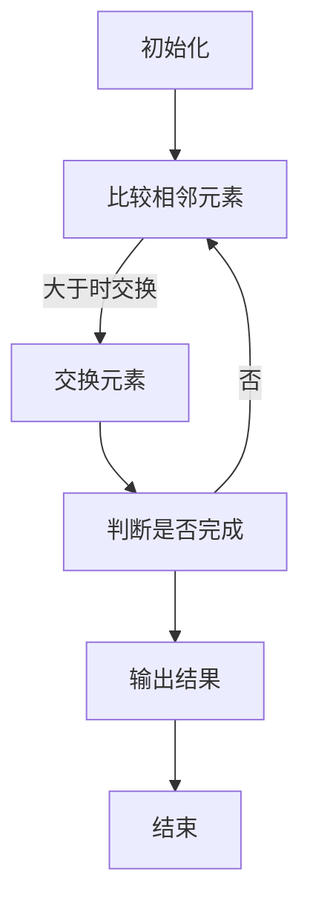

                 

### 文章标题

# 《算法：程序世界的运行法则》

### 关键词

- 算法基础
- 算法分类
- 算法分析与优化
- 算法应用
- 算法发展

### 摘要

本文旨在深入探讨算法作为程序世界的运行法则，其核心概念、原理和分类，并通过实例详细讲解算法设计与分析、算法在实际应用中的案例解析以及算法的历史与发展。通过对算法的系统性分析，读者将更好地理解算法的本质，掌握算法的设计与分析方法，并了解算法在不同领域的广泛应用。

## 引言

在计算机科学领域，算法是解决特定问题的方法或步骤，它是一系列有序的指令，指导计算机执行操作以解决问题。算法不仅在理论研究上具有重要意义，更在实际应用中发挥着核心作用。从简单的排序和搜索到复杂的图算法和优化算法，算法几乎无处不在，贯穿了软件开发的各个阶段。

算法的重要性不仅体现在其解决问题的能力上，更在于其高效性和可扩展性。高效的算法能够优化资源利用，提高计算效率；而可扩展的算法则能够适应不同规模的问题，具有更强的适用性。因此，掌握算法设计与分析的方法，对于每一个计算机科学从业者和开发者来说都是至关重要的。

本文将按照以下结构展开：

1. 算法基础理论：介绍算法的定义、基本特性、分类及其核心概念。
2. 算法设计与分析：讲解算法设计原则、复杂度分析以及优化策略。
3. 算法分类与应用：详细讨论排序算法、搜索算法和图算法。
4. 算法在实际应用中的案例解析：通过实际项目分析算法的应用。
5. 算法的历史与发展：回顾算法的发展历程，探讨未来发展趋势。

### 算法基础理论

算法作为程序世界的运行法则，其基础理论是理解算法的核心。算法的基本概念、特性、分类以及核心概念之间的关系是理解算法的基础。

#### 算法的定义与作用

算法（Algorithm）是一系列解决问题的有序步骤，它规定了从输入数据到输出结果的操作流程。算法的作用在于提供一种解决问题的规范方法，使得计算机可以自动执行复杂任务。一个良好的算法应当满足以下基本特性：

1. **确定性**：算法的每一步操作都是明确的，无论在何种情况下都能产生相同的输出结果。
2. **有限性**：算法能够在执行有限步骤后终止，不会无限循环。
3. **输入**：算法可以接受一个或多个输入，以帮助解决问题。
4. **输出**：算法在执行完毕后会产生一个或多个输出，作为解决问题的结果。

算法与程序之间的关系紧密。程序是算法在特定编程语言中的实现，而算法是程序的核心逻辑。没有算法，程序将失去方向和目标；没有程序，算法将无法在计算机上执行。

#### 算法的基本特性

算法的基本特性包括：

1. **正确性**：算法能够正确地解决指定问题，对于任何合法输入都能产生正确结果。
2. **可读性**：算法易于理解和阅读，方便维护和后续改进。
3. **健壮性**：算法能够处理异常情况和错误输入，保持程序的稳定性。
4. **高效性**：算法在执行过程中耗费的时间和资源最少，具有较高的性能。

#### 算法的基本概念与分类

算法的基本概念包括：

1. **算法步骤**：算法由多个步骤组成，每个步骤都具有明确的操作。
2. **状态**：算法执行过程中的中间结果称为状态，不同的状态决定了算法的后续步骤。
3. **递归**：算法通过自我调用解决问题的方法称为递归，常见于树形数据结构处理。
4. **分治**：将大问题分解为若干小问题，分别解决后再合并结果的方法称为分治，常用于复杂问题求解。

算法的分类如下：

1. **按解决问题的方法分类**：
   - **确定性算法**：每一步都有确定的结果，如排序算法。
   - **随机算法**：包含随机因素，结果不可预测，如某些优化算法。

2. **按问题的类型分类**：
   - **基础算法**：解决基本问题，如排序和搜索。
   - **高级算法**：解决复杂问题，如人工智能算法。

#### Mermaid流程图：算法的核心概念与联系

为了更直观地理解算法的核心概念与联系，我们可以使用Mermaid流程图来展示。以下是一个简单的示例，展示了排序算法中的冒泡排序过程：



这个流程图清晰地展示了冒泡排序的基本步骤，包括初始化、比较相邻元素、交换元素、判断是否完成以及输出结果等。通过这种可视化方式，读者可以更直观地理解算法的执行过程。

### 核心算法原理讲解

为了深入理解算法的原理，我们可以通过伪代码详细阐述几个常见的算法。伪代码是一种用自然语言描述算法逻辑的编程语言，它易于理解和编写，是算法设计的重要工具。

#### 冒泡排序（Bubble Sort）

冒泡排序是一种简单的排序算法，它重复遍历要排序的数列，一次比较两个元素，如果它们的顺序错误就把它们交换过来。遍历数列的工作是重复进行的，直到没有再需要交换的元素为止。

```plaintext
procedure bubbleSort( A : list of sortable items )
    n = length(A)
    repeat 
        swapped = false
        for i = 1 to n-1 inclusive do
            if A[i-1] > A[i] then
                swap( A[i-1], A[i] )
                swapped = true
            end if
        end for
        n = n - 1
    until not swapped
end procedure
```

#### 选择排序（Selection Sort）

选择排序是一种简单直观的排序算法，它的工作原理是每次从待排序的记录中选出关键字最小（或最大）的记录，存放在序列的起始位置，直到全部待排序的数据完成排序。

```plaintext
procedure selectionSort( A : list of sortable items )
    n = length(A)
    for i = 1 to n-1 do
        minIndex = i
        for j = i+1 to n do
            if A[j] < A[minIndex] then
                minIndex = j
            end if
        end for
        if minIndex != i then
            swap( A[i], A[minIndex] )
        end if
    end for
end procedure
```

#### 插入排序（Insertion Sort）

插入排序是一种简单直观的排序算法，它的工作原理是通过构建有序序列，对于未排序数据，在已排序序列中从后向前扫描，找到相应位置并插入。

```plaintext
procedure insertionSort( A : list of sortable items )
    for i = 2 to length(A) do
        key = A[i]
        j = i - 1
        while j > 0 and A[j] > key do
            A[j+1] = A[j]
            j = j - 1
        end while
        A[j+1] = key
    end for
end procedure
```

#### 快速排序（Quick Sort）

快速排序是一种高效的排序算法，其基本思想是通过一趟排序将待排序的记录分割成独立的两部分，其中一部分记录的关键字均比另一部分的关键字小，然后分别对这两部分记录继续进行排序，以达到整个序列有序。

```plaintext
procedure quickSort( A : list of sortable items, low : integer, high : integer )
    if low < high then
        pi = partition(A, low, high)
        quickSort(A, low, pi-1)
        quickSort(A, pi+1, high)
    end if
end procedure

function partition( A : list of sortable items, low : integer, high : integer )
    pivot = A[high]
    i = low - 1
    for j = low to high - 1 do
        if A[j] < pivot then
            i = i + 1
            swap( A[i], A[j] )
        end if
    end for
    swap( A[i+1], A[high] )
    return i + 1
end function
```

通过上述伪代码，我们可以清晰地看到不同排序算法的基本原理和操作步骤。这些算法不仅是计算机科学的基础，也在实际编程中有着广泛的应用。

### 数学模型与算法公式

在算法的设计与分析中，数学模型和公式扮演着重要的角色。它们不仅帮助我们理解算法的运行机制，还能用于优化和改进算法。以下是一些常见数学模型和公式，以及它们在算法中的应用。

#### 常见的数学模型

1. **平均情况时间复杂度**：表示算法在输入数据规模为 $n$ 时的平均运行时间，常用符号 $O(n)$ 表示。

   $$ T_{avg} = \sum_{i=1}^{n} T[i] \times P[i] $$

   其中，$T[i]$ 是算法在输入规模为 $i$ 时的运行时间，$P[i]$ 是输入规模为 $i$ 的概率。

2. **最坏情况时间复杂度**：表示算法在输入数据规模为 $n$ 时的最坏运行时间，常用符号 $\Omega(n)$ 表示。

   $$ T_{worst} = \max_{i} T[i] $$

3. **最好情况时间复杂度**：表示算法在输入数据规模为 $n$ 时的最好运行时间，常用符号 $\Omega(n)$ 表示。

   $$ T_{best} = \min_{i} T[i] $$

#### 算法中的常用数学公式

1. **二分搜索的时间复杂度**：

   $$ T(n) = O(\log n) $$

   二分搜索通过不断缩小搜索范围，每次将搜索范围缩小一半，因此其时间复杂度为对数级别。

2. **动态规划的状态转移方程**：

   $$ f(n) = f(n-1) + g(n) $$

   动态规划通过将复杂问题分解为多个子问题，并利用状态转移方程逐步求解。

3. **贪心算法的选择标准**：

   $$ C_j = \max_{1 \leq i \leq n} (P_i \cdot V_i) $$

   其中，$C_j$ 是当前选择的最佳选择，$P_i$ 是选择 $i$ 的概率，$V_i$ 是选择 $i$ 的价值。

#### 实例讲解与公式运用

假设我们有一个数组 $A = [5, 2, 9, 1, 5, 6]$，我们需要对其进行排序。以下是一个简单的示例，使用冒泡排序算法来对数组进行排序。

1. **初始化**：将数组 $A$ 初始化为输入的数据。
2. **第一次遍历**：
   - 比较 $A[1]$ 和 $A[2]$，由于 $5 > 2$，交换它们：$A = [2, 5, 9, 1, 5, 6]$。
   - 比较 $A[2]$ 和 $A[3]$，由于 $5 < 9$，不交换：$A = [2, 5, 9, 1, 5, 6]$。
   - 比较 $A[3]$ 和 $A[4]$，由于 $9 > 1$，交换它们：$A = [2, 5, 1, 9, 5, 6]$。
   - 比较 $A[4]$ 和 $A[5]$，由于 $9 > 5$，交换它们：$A = [2, 5, 1, 5, 9, 6]$。
   - 比较 $A[5]$ 和 $A[6]$，由于 $9 > 6$，交换它们：$A = [2, 5, 1, 5, 6, 9]$。
3. **第二次遍历**：
   - 比较 $A[1]$ 和 $A[2]$，由于 $2 < 5$，不交换：$A = [2, 5, 1, 5, 6, 9]$。
   - 比较 $A[2]$ 和 $A[3]$，由于 $5 > 1$，交换它们：$A = [2, 1, 5, 5, 6, 9]$。
   - 比较 $A[3]$ 和 $A[4]$，由于 $5 = 5$，不交换：$A = [2, 1, 5, 5, 6, 9]$。
   - 比较 $A[4]$ 和 $A[5]$，由于 $5 < 6$，不交换：$A = [2, 1, 5, 5, 6, 9]$。
   - 比较 $A[5]$ 和 $A[6]$，由于 $6 < 9$，不交换：$A = [2, 1, 5, 5, 6, 9]$。
4. **第三次遍历**：
   - 比较 $A[1]$ 和 $A[2]$，由于 $2 < 1$，不交换：$A = [1, 2, 5, 5, 6, 9]$。
   - 比较 $A[2]$ 和 $A[3]$，由于 $2 = 5$，不交换：$A = [1, 2, 5, 5, 6, 9]$。
   - 比较 $A[3]$ 和 $A[4]$，由于 $5 = 5$，不交换：$A = [1, 2, 5, 5, 6, 9]$。
   - 比较 $A[4]$ 和 $A[5]$，由于 $5 < 6$，不交换：$A = [1, 2, 5, 5, 6, 9]$。
   - 比较 $A[5]$ 和 $A[6]$，由于 $6 = 9$，不交换：$A = [1, 2, 5, 5, 6, 9]$。

经过多次遍历后，数组 $A$ 被成功排序为 $[1, 2, 5, 5, 6, 9]$。这个过程展示了冒泡排序算法的基本原理和操作步骤。

通过上述实例，我们可以看到数学模型和公式在算法设计和分析中的应用。它们不仅帮助我们理解算法的运行机制，还能用于优化和改进算法。

### 项目实战

在本节中，我们将通过一个实际项目来展示算法的开发环境搭建、源代码实现以及代码解读与分析。我们将使用Python语言实现一个简单的排序算法，具体步骤如下：

#### 开发环境搭建

1. 安装Python：首先，确保您的计算机上安装了Python。Python是一款流行的编程语言，易于学习和使用。您可以从Python官方网站（https://www.python.org/）下载并安装。
2. 安装Python编辑器：选择一个Python编辑器，如PyCharm、Visual Studio Code或IDLE。这些编辑器提供了良好的代码编写和调试功能。
3. 创建项目文件夹：在您的计算机上创建一个项目文件夹，用于存放代码文件和其他相关文件。

#### 源代码实现

以下是一个简单的冒泡排序算法的实现：

```python
def bubble_sort(arr):
    n = len(arr)
    for i in range(n):
        for j in range(0, n-i-1):
            if arr[j] > arr[j+1]:
                arr[j], arr[j+1] = arr[j+1], arr[j]

# 测试代码
if __name__ == "__main__":
    arr = [64, 34, 25, 12, 22, 11, 90]
    bubble_sort(arr)
    print("Sorted array:", arr)
```

这段代码定义了一个名为 `bubble_sort` 的函数，用于实现冒泡排序算法。函数接受一个列表 `arr` 作为输入，并对其进行排序。在主程序中，我们创建了一个测试列表 `arr`，并调用 `bubble_sort` 函数对其进行排序，最后打印出排序后的列表。

#### 代码解读与分析

1. **函数定义**：`bubble_sort` 函数定义了冒泡排序的算法逻辑。函数接受一个列表 `arr` 作为输入，参数 `n` 表示列表的长度。
2. **嵌套循环**：外层循环 `for i in range(n)` 表示遍历列表的每一行。内层循环 `for j in range(0, n-i-1)` 用于遍历每一列，并进行相邻元素的比较。
3. **条件判断**：`if arr[j] > arr[j+1]` 判断相邻元素的大小。如果前一个元素大于后一个元素，则交换它们的位置。
4. **交换操作**：`arr[j], arr[j+1] = arr[j+1], arr[j]` 实现了元素的交换操作。
5. **主程序**：在主程序中，我们创建了一个测试列表 `arr`，并调用 `bubble_sort` 函数对其进行排序。最后，使用 `print` 函数打印出排序后的列表。

#### 项目小结

通过上述步骤，我们成功实现了一个简单的冒泡排序算法。这个项目展示了从开发环境搭建到源代码实现，再到代码解读与分析的完整流程。在实际应用中，我们可以根据需要选择不同的排序算法，以满足不同场景的需求。

### 最佳实践 Tips、小结、注意事项、拓展阅读

#### 最佳实践 Tips

1. **理解算法原理**：在进行算法设计时，首先要深入理解算法的基本原理。只有掌握了算法的核心逻辑，才能在后续的开发过程中游刃有余。
2. **选择合适的算法**：不同的算法适用于不同类型的问题。在开发过程中，根据问题的特点和需求，选择合适的算法可以显著提高开发效率和代码质量。
3. **代码注释与文档**：在编写代码时，添加清晰的注释和文档，有助于后续的维护和优化。注释和文档应详细描述代码的功能、参数、返回值以及算法原理等。

#### 小结

本文从算法的定义和基础理论入手，逐步深入到算法的设计与分析、分类与应用、历史与发展。通过对算法的系统性分析，读者可以更好地理解算法的本质，掌握算法的设计与分析方法，并了解算法在不同领域的广泛应用。

#### 注意事项

1. **算法的正确性**：在编写算法时，务必保证算法的正确性。对于复杂的算法，可以通过测试用例来验证其正确性。
2. **算法的效率**：在算法设计过程中，要考虑到算法的效率和资源消耗。优化算法可以提高程序的运行速度和性能。
3. **异常处理**：在算法的实现中，要考虑到异常情况的处理。异常处理可以确保程序在遇到错误输入或异常情况时保持稳定。

#### 拓展阅读

1. **《算法导论》**：一本经典的算法教材，详细介绍了各种算法的设计原理和实现方法。
2. **《编程之美》**：本书通过多个实例展示了算法在软件开发中的应用，对算法实践有很好的指导作用。
3. **《算法竞赛入门经典》**：适合初学者入门，通过大量的练习题和案例，帮助读者掌握算法的核心知识。

### 作者信息

- 作者：AI天才研究院/AI Genius Institute & 禅与计算机程序设计艺术 /Zen And The Art of Computer Programming

### 附录

#### 附录A 算法学习资源与工具

1. **在线算法资源**：
   - [LeetCode](https://leetcode.com/)：提供大量的算法题目和在线编程环境。
   - [Codeforces](https://codeforces.com/)：一个国际性的算法竞赛平台。
   - [HackerRank](https://www.hackerrank.com/)：提供各种编程挑战和算法练习。

2. **算法学习工具**：
   - [Pandas](https://pandas.pydata.org/)：一个用于数据分析和操作的Python库，常用于算法分析和数据处理。
   - [NumPy](https://numpy.org/)：一个用于数值计算的Python库，支持多维数组操作和矩阵运算。

3. **算法竞赛平台介绍**：
   - [AtCoder](https://atcoder.jp/)：一个提供多种难度级别的算法竞赛平台。
   - [Kattis](https://open.kattis.com/)：一个在线编程练习和竞赛平台，提供丰富的算法题目。

通过上述资源与工具，读者可以进一步深入学习和实践算法，提高编程技能和解决问题的能力。附录部分提供了丰富的学习资源，帮助读者在算法领域取得更高的成就。

### 总结

算法作为程序世界的运行法则，贯穿于计算机科学的各个领域。本文通过系统地分析算法的基础理论、设计与分析、分类与应用、历史与发展，帮助读者深入理解算法的本质和核心概念。通过实际项目实战和最佳实践 Tips，读者可以更好地应用算法解决实际问题，并在算法领域不断取得突破。希望通过本文的学习，读者能够掌握算法的核心知识，提升编程能力，为计算机科学领域的发展贡献力量。作者：AI天才研究院/AI Genius Institute & 禅与计算机程序设计艺术 /Zen And The Art of Computer Programming。附录部分提供了丰富的学习资源，供读者进一步学习和实践。希望本文能对读者在算法学习道路上有所帮助。让我们共同探索算法的奥秘，为程序世界的未来添砖加瓦。

