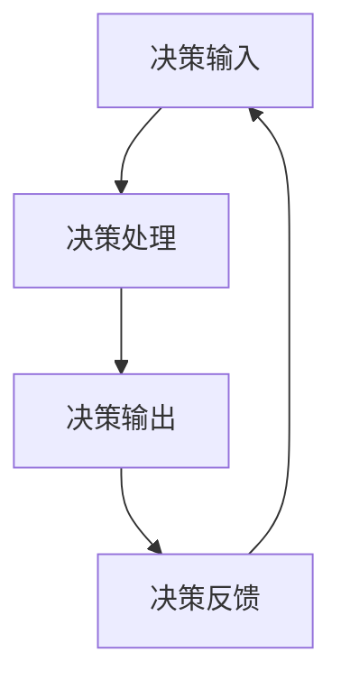

                 

### 引言

在当今快速变化和竞争激烈的市场环境中，管理者面临的决策问题日益复杂。有效的决策不仅仅是个人经验和直觉的运用，更需要系统化、科学化的方法来支持。管理者决策模型正是为了应对这种需求而提出的，它提供了一系列框架和工具，帮助管理者在不确定性中做出更加明智和合理的决策。

本文将围绕《管理者决策模型：科学决策的框架与工具》这一主题，深入探讨决策模型的重要性、科学决策的原则、决策框架的设计以及决策工具的应用。通过逐步分析，我们希望能够为读者提供一个清晰、易懂的决策模型体系，并展示其在实际项目中的应用价值。

首先，本文将简要介绍决策模型的基本概念，帮助读者理解其在管理中的重要作用。接下来，我们将探讨科学决策的基本原则，分析决策过程中的关键环节，并介绍如何评估和优化决策模型。在此基础上，我们将详细阐述决策框架的设计原则和步骤，包括数据收集、分析和模型应用等方面的内容。

随后，本文将介绍各类决策工具，从数据分析工具到优化工具，帮助读者了解如何选择和运用这些工具来支持决策过程。为了更加直观地展示决策模型的应用效果，本文还将通过实际项目案例，详细解析项目开发环境搭建、源代码实现、代码解读以及案例分析等内容。

最后，本文将对全文进行总结，提出一些最佳实践建议，并指出未来决策模型的发展方向。通过这样的逐步分析，我们希望能够为管理者提供一套实用的决策模型框架，助力他们在复杂环境中做出更加科学的决策。

### 核心关键词

- 管理者决策模型
- 科学决策
- 决策框架
- 决策工具
- 数据分析
- 优化工具
- 实际项目案例

### 摘要

本文旨在深入探讨管理者决策模型，从科学决策的基本原则、决策框架的设计和决策工具的应用等多个维度，系统地介绍如何构建和运用决策模型，以支持管理者在复杂环境中做出更加明智和合理的决策。文章首先定义了决策模型的概念和重要性，随后详细阐述了科学决策的原则，包括决策过程分析、决策模型评估和风险管理。接着，文章介绍了决策框架的设计原则，包括基本框架结构、数据分析和模型应用。随后，文章重点介绍了常用的决策工具，包括数据分析工具和优化工具，并探讨了如何选择和运用这些工具来支持决策过程。为了更加直观地展示决策模型的应用效果，本文通过实际项目案例，详细解析了项目开发环境搭建、源代码实现、代码解读以及案例分析等内容。最后，文章总结了全文的核心内容，提出了最佳实践建议，并展望了决策模型未来的发展方向。通过这篇文章，读者可以系统地了解管理者决策模型的理论基础和实践应用，为实际工作提供有力的指导。

### 设计思路

为了使《管理者决策模型：科学决策的框架与工具》这一主题更加清晰易懂，我们需要从整体结构、章节划分、核心概念和逻辑关联等多个方面进行详细设计。

首先，整体结构的设计需要确保文章逻辑严密、层次分明。我们可以将全文分为五个主要部分：引言、核心概念与联系、科学决策原理、决策框架设计、决策工具应用和项目实战。这样的结构设计不仅能够引导读者循序渐进地理解决策模型的全貌，还能确保每个部分都有明确的主题和重点。

**一、核心概念与联系**

在核心概念与联系部分，我们需要详细解释决策模型的基本概念和科学决策的基本原则。这部分可以分为以下几个小节：

1. **决策模型概述**：介绍决策模型的定义、类型及其在管理中的重要性。
2. **科学决策原理**：探讨科学决策的基本原则，包括决策过程分析、决策模型评估和风险管理。
3. **决策框架设计原则**：阐述决策框架的设计原则，包括基本框架结构、决策节点设计等。

为了使这部分内容更加直观易懂，我们可以使用Mermaid流程图来展示核心概念和原理之间的联系。例如，可以用一个Mermaid图来表示决策模型的基本架构，包括输入、处理、输出等主要环节。



**二、科学决策原理**

在科学决策原理部分，我们将详细分析决策过程的关键环节，包括：

1. **决策过程分析**：介绍决策过程的各个阶段，如问题识别、方案生成、评估与选择等。
2. **决策模型评估**：探讨如何评估和选择适合的决策模型，包括模型的准确性、稳定性和鲁棒性等方面。
3. **风险管理**：分析决策过程中可能面临的风险，并提出相应的管理策略。

这部分内容将结合具体的算法和数学模型进行讲解，以帮助读者更好地理解决策原理。例如，我们可以使用伪代码来展示一个简单的决策树模型，并详细解释其工作原理。

```python
# 决策树模型伪代码
def decision_tree(input_data):
    # 问题识别
    problem = identify_problem(input_data)
    
    # 方案生成
    solutions = generate_solutions(problem)
    
    # 评估与选择
    best_solution = evaluate_and_select(solutions)
    
    # 决策输出
    return best_solution
```

**三、决策框架设计**

在决策框架设计部分，我们将详细介绍如何设计一个完整的决策框架，包括：

1. **基本框架结构**：阐述决策框架的基本组成部分，如输入模块、处理模块和输出模块。
2. **数据收集**：介绍如何收集和管理决策所需的数据，确保数据的准确性和完整性。
3. **数据分析与模型应用**：介绍如何使用数据分析方法和模型来支持决策过程，包括数据预处理、特征选择和模型训练等。

这部分内容将结合实际案例进行讲解，以帮助读者理解决策框架的具体应用。例如，我们可以展示一个使用线性回归模型进行销售预测的案例，并详细解析其数据收集、分析和模型应用的过程。

**四、决策工具应用**

在决策工具应用部分，我们将介绍如何选择和运用各类决策工具，包括数据分析工具和优化工具。这部分内容将分为以下几个小节：

1. **常用工具介绍**：介绍一些常用的数据分析工具和优化工具，如Python的Pandas库、Scikit-learn库等。
2. **工具应用场景**：分析不同工具在不同决策场景中的应用，帮助读者了解如何选择合适的工具。
3. **工具选择与实施**：讨论如何根据具体需求和场景选择合适的工具，并详细介绍实施步骤。

这部分内容将结合实际案例，展示如何使用决策工具进行数据分析、模型训练和优化。

**五、项目实战**

在项目实战部分，我们将通过一个实际案例，详细展示决策模型的应用过程，包括：

1. **开发环境搭建**：介绍项目开发所需的环境和工具，确保读者能够顺利进行项目实施。
2. **源代码实现**：展示项目的源代码实现，并详细解读代码中的关键部分。
3. **案例分析**：对实际案例进行分析，讨论决策模型在项目中的应用效果和改进空间。
4. **项目小结**：总结项目的主要成果和经验，为读者提供实际操作的建议。

通过以上设计思路，我们可以确保文章内容丰富、逻辑清晰，使读者能够系统地掌握管理者决策模型的理论和实践应用。此外，文章还将结合具体的算法、数学模型和实际案例，使读者不仅能够理解决策模型的基本原理，还能掌握实际操作的方法和技巧。

### 一、决策模型的基本概念

决策模型是管理者在复杂环境中进行决策的工具，通过系统化、科学化的方法，帮助管理者在不确定性和信息不完整的情况下做出最优或次优选择。在管理实践中，决策模型的应用范围广泛，涵盖了从战略规划到日常运营的各个方面。

首先，我们需要明确决策模型的基本定义。决策模型是指将决策问题抽象为数学模型或算法，通过计算和分析来支持决策者做出合理决策的过程。它通常包括以下几个关键组成部分：

1. **决策变量**：决策过程中需要确定的变量，如产品定价、生产线布局、投资组合等。
2. **目标函数**：用于衡量决策效果的指标，如利润最大化、成本最小化等。
3. **约束条件**：决策过程中需要满足的限制条件，如资源限制、市场需求等。
4. **决策规则**：指导决策者进行决策的规则和策略，如优先级排序、风险评估等。

在管理者决策过程中，决策模型起到以下几个重要作用：

1. **提高决策效率**：通过系统化的方法，减少决策过程中的主观判断和时间消耗，提高决策效率。
2. **减少决策风险**：通过评估不同决策方案的可能结果，帮助管理者识别潜在风险，做出更稳健的决策。
3. **增强决策科学性**：基于数据和数学模型进行决策，避免直觉和经验主导，提高决策的科学性和可解释性。
4. **支持战略规划**：决策模型可以用于中长期战略规划，帮助管理者制定明确的发展目标和策略。

决策模型的发展历程可以追溯到20世纪中叶。早期的决策模型主要依赖于统计学和优化理论，如线性规划、决策树等。随着计算机技术和人工智能的快速发展，决策模型逐渐从传统的定量分析方法，向更加复杂和智能的方向发展，如模拟优化、神经网络和机器学习等。

在当前的管理实践中，常见的决策模型类型主要包括以下几种：

1. **线性规划**：适用于目标函数和约束条件都是线性的情况，通过求解线性方程组来找到最优解。
2. **决策树**：通过树形结构表示不同决策路径和结果，适用于简单决策问题。
3. **模拟优化**：通过模拟实际决策环境，评估不同决策方案的效果，适用于复杂和不确定的决策场景。
4. **机器学习模型**：基于大量数据训练模型，通过预测和分类来支持决策，适用于数据驱动的决策问题。

总之，决策模型是管理者进行科学决策的重要工具，通过系统化和科学化的方法，帮助管理者在复杂环境中做出更加明智和合理的决策。理解决策模型的基本概念和类型，是管理者掌握科学决策方法的第一步。

### 二、科学决策原理

科学决策是管理者在复杂环境中进行决策的重要方法，其核心在于通过系统化的分析、评估和优化，找到最优或次优的决策方案。科学决策的原理包括决策过程分析、决策模型评估和风险管理，这些原理为管理者提供了理论依据和实践指导。

**1. 决策过程分析**

决策过程分析是科学决策的基础。一个完整的决策过程通常包括以下几个关键阶段：

- **问题识别**：确定需要解决的具体问题和目标。问题识别是决策过程的起点，其准确性直接影响到后续决策的效果。

- **方案生成**：在明确问题后，提出各种可能的解决方案。方案生成要求决策者具备创新思维和广度视野，以形成多样化的决策方案。

- **评估与选择**：对各个方案进行评估和比较，选择最优或次优方案。评估标准通常包括目标函数、约束条件、实施成本等。

- **实施与监控**：选择方案后，制定详细的实施计划，并在实施过程中进行监控和调整。实施与监控确保决策方案能够顺利落地，并及时应对可能出现的问题。

**问题识别**是决策过程的第一步，其关键在于准确界定问题的性质和范围。管理者需要从全局角度出发，识别出组织面临的重大问题和挑战。

**方案生成**则需要决策者充分发挥创造力，提出多种可能的解决方案。在这个过程中，头脑风暴、思维导图等工具可以帮助决策者快速生成方案。

**评估与选择**阶段是决策过程中的核心。管理者需要基于科学的方法和工具，对各个方案进行系统评估和比较。常用的评估方法包括成本效益分析、多目标决策等。

**实施与监控**阶段确保决策方案能够有效执行，并及时发现和解决问题。管理者需要制定详细的实施计划，明确责任分工和时间节点，确保方案能够顺利实施。

**2. 决策模型评估**

决策模型评估是科学决策的重要组成部分。评估的目的在于确定决策模型的准确性、稳定性和鲁棒性，从而为决策提供可靠依据。

- **准确性**：评估模型在预测和评估决策效果方面的精度。高准确性的模型能够更好地反映实际情况，为决策提供更可靠的依据。

- **稳定性**：评估模型在不同数据集和环境下的一致性和稳定性。稳定的模型能够在不同情况下保持一致的决策效果。

- **鲁棒性**：评估模型对噪声和异常值的影响。鲁棒性强的模型能够有效应对数据中的噪声和异常，确保决策的可靠性。

决策模型评估通常包括以下步骤：

- **模型选择**：根据决策问题的特点，选择适合的决策模型。常用的模型包括线性回归、决策树、神经网络等。

- **模型训练与验证**：使用训练数据集对模型进行训练，并通过验证数据集评估模型的性能。常用的评估指标包括准确率、召回率、F1分数等。

- **模型优化**：根据评估结果，对模型进行调整和优化，以提高其性能。优化的方法包括特征选择、参数调优等。

**3. 风险管理**

科学决策过程中，管理者需要考虑决策可能带来的风险，并制定相应的风险管理策略。风险管理包括风险识别、风险评估和风险应对。

- **风险识别**：识别决策过程中可能面临的各种风险，包括市场风险、技术风险、操作风险等。

- **风险评估**：对识别出的风险进行评估，确定其影响程度和发生概率，以便为风险应对提供依据。

- **风险应对**：根据风险评估结果，制定相应的风险应对策略，包括风险规避、风险转移、风险减轻等。

**风险识别**是风险管理的第一步，管理者需要通过多种途径收集信息，识别潜在的风险。

**风险评估**则需要运用科学的方法和工具，对风险的影响程度和发生概率进行量化评估。常用的评估方法包括概率分析、敏感性分析等。

**风险应对**是风险管理的核心。管理者需要根据风险评估结果，制定详细的应对策略，并确保这些策略能够有效实施。

综上所述，科学决策原理包括决策过程分析、决策模型评估和风险管理。通过系统化的决策过程分析，管理者能够准确识别问题和提出解决方案；通过科学的决策模型评估，管理者能够选择最优的决策模型；通过有效的风险管理，管理者能够降低决策过程中的风险，确保决策的稳健性和可靠性。这些原理为管理者提供了科学决策的理论依据和实践指导。

### 决策框架的设计原则

决策框架是管理者在进行决策时的重要工具，它通过系统化的结构和方法，帮助管理者在复杂环境中做出明智、合理的决策。一个有效的决策框架应包括明确的组成部分、逻辑流程和关键节点，以确保决策过程有序、高效。以下是决策框架设计的几个基本原则：

**1. 确定决策目标**

决策框架的第一步是明确决策目标。决策目标应具体、可衡量，并且与组织的战略目标一致。例如，提高销售额、降低运营成本、提升客户满意度等。明确的目标有助于决策者聚焦关键问题，避免偏离主题。

**2. 确定决策变量**

决策变量是决策过程中需要确定的变量，如产品定价、生产线布局、人力资源分配等。确定决策变量需要结合实际情况和决策目标，确保所有相关因素都被考虑在内。此外，决策变量的范围和限制条件也应明确，以避免决策过程中的不确定性。

**3. 设计决策节点**

决策节点是决策过程中的关键环节，通常包括问题识别、方案生成、评估与选择、实施与监控等步骤。每个决策节点都应明确其任务和责任，确保决策过程有序进行。例如，在问题识别阶段，决策者需要收集和分析相关信息，明确问题性质和范围；在方案生成阶段，团队需要提出多种可能的解决方案。

**4. 制定决策规则**

决策规则是指导决策者进行决策的规则和策略，如优先级排序、风险评估等。制定决策规则需要结合组织的实际情况和决策目标，确保规则的科学性和可操作性。例如，在优先级排序中，可以采用成本效益分析、风险评估等方法，根据各项方案的收益和风险进行排序。

**5. 确保数据支持**

决策框架的有效性很大程度上依赖于数据的支持。因此，在设计决策框架时，应确保数据的准确性和完整性。数据收集和处理的方法和工具也应明确，如数据采集工具、数据分析方法等。此外，数据质量监控和更新机制也应建立，以确保数据在决策过程中的可靠性和实时性。

**6. 设计反馈机制**

反馈机制是决策框架的重要组成部分，它通过收集和评估决策实施的效果，为决策的调整和优化提供依据。设计反馈机制时，应明确反馈的目标、内容和方式，如定期报告、评估会议等。此外，反馈机制还应包括对决策效果的量化评估，如KPI、绩效指标等。

**7. 考虑风险管理**

在决策框架设计中，风险管理是不可或缺的一环。应明确决策过程中可能面临的风险，并制定相应的应对策略。例如，可以通过风险评估、风险监控等方法，识别和应对潜在风险。此外，还应建立风险应急响应机制，确保在风险发生时能够迅速应对。

**8. 保持灵活性和适应性**

决策框架应具有灵活性和适应性，以应对环境变化和不确定性。在决策框架设计过程中，应预留足够的调整空间，以便根据实际情况进行修改和优化。例如，可以通过定期审查和调整决策框架，确保其与组织的战略目标和市场需求保持一致。

综上所述，决策框架的设计原则包括明确决策目标、确定决策变量、设计决策节点、制定决策规则、确保数据支持、设计反馈机制、考虑风险管理以及保持灵活性和适应性。通过遵循这些原则，管理者可以构建一个系统化、科学化的决策框架，为组织在复杂环境中做出明智决策提供有力支持。

### 数据收集与分析

在决策框架的设计过程中，数据收集与分析是至关重要的一步。准确、完整的数据是决策的基础，通过对数据进行有效的分析和处理，可以揭示隐藏在数据背后的规律和趋势，为决策提供有力的支持。以下是数据收集与分析的具体步骤和注意事项：

**1. 数据收集**

数据收集是数据分析和决策过程的第一步。数据的来源可以是内部数据（如销售记录、生产数据、员工绩效等）和外部数据（如市场调研、行业报告、竞争对手信息等）。在收集数据时，需要注意以下事项：

- **数据质量**：确保收集到的数据准确、完整和可靠。对于内部数据，可以通过数据清洗和验证来提高数据质量；对于外部数据，需要选择可信的来源，并确保数据的时效性。

- **数据多样性**：尽可能收集多种类型的数据，包括定量数据和定性数据。多样化的数据可以提供更全面的视角，帮助决策者做出更加全面和准确的决策。

- **数据采集工具**：使用合适的数据采集工具，如数据库、数据采集软件、传感器等。选择合适的工具可以确保数据收集过程的效率和准确性。

**2. 数据处理**

数据处理是对原始数据进行清洗、转换和整合的过程。通过数据处理，可以将杂乱无章的数据转化为结构化、可分析的数据。以下是数据处理的主要步骤：

- **数据清洗**：去除数据中的错误、缺失值和重复记录，确保数据的一致性和准确性。

- **数据转换**：将不同格式和单位的数据转换为统一的格式和单位，以便进行进一步分析。

- **数据整合**：将来自不同来源和格式的数据进行整合，形成一个完整的数据集。整合后的数据集可以更方便地进行综合分析和建模。

**3. 数据分析**

数据分析是对处理后的数据进行探索性分析和模型分析的过程。通过数据分析，可以揭示数据中的规律和趋势，为决策提供依据。以下是数据分析的主要方法：

- **探索性数据分析（EDA）**：通过可视化、统计分析等方法，对数据进行初步分析，了解数据的分布、趋势和异常值。

- **假设检验**：根据业务需求和假设，使用统计方法对数据进行假设检验，验证假设是否成立。

- **模型分析**：基于数据和业务需求，建立适当的数学模型或机器学习模型，对数据进行分析和预测。常用的模型包括线性回归、决策树、神经网络等。

**4. 数据分析工具**

在数据分析过程中，选择合适的数据分析工具可以提高数据分析的效率和质量。以下是一些常用的数据分析工具：

- **Excel**：适用于简单的数据分析和可视化，如创建图表、进行统计分析等。

- **Python和R**：适用于复杂的数据分析和建模，提供丰富的数据分析库和工具，如Pandas、NumPy、Scikit-learn等。

- **Tableau**：适用于数据可视化，可以创建各种类型的图表和报告，帮助决策者直观地理解数据。

**5. 注意事项**

在数据收集与分析过程中，需要注意以下几点：

- **数据隐私和安全**：确保数据的隐私和安全，遵循相关法律法规，防止数据泄露。

- **数据更新和维护**：定期更新和维护数据，确保数据的新鲜度和准确性。

- **数据解释和分享**：对分析结果进行准确的解释和分享，帮助决策者理解数据背后的含义。

- **跨部门协作**：数据分析和决策过程需要跨部门协作，确保数据的一致性和完整性。

通过遵循以上数据收集与分析的步骤和注意事项，管理者可以有效地利用数据，为决策提供强有力的支持。

### 决策工具应用

在决策过程中，科学的选择和恰当的应用决策工具是确保决策质量和效率的关键。决策工具涵盖了从数据分析到优化方法的一系列工具，它们能够帮助管理者在复杂环境中做出更加明智的决策。以下是几种常见的决策工具及其应用场景：

**1. 数据分析工具**

数据分析工具主要用于数据的收集、处理和可视化，帮助管理者从大量数据中提取有价值的信息。常见的数据分析工具有：

- **Excel**：Excel是一款功能强大的电子表格工具，适用于数据的基本处理和简单的数据分析。它提供了丰富的函数和图表工具，能够帮助用户快速进行数据的整理和可视化。

  ```mermaid
  flowchart TD
    A[启动Excel] --> B[导入数据]
    B --> C[数据清洗]
    C --> D[数据分析]
    D --> E[生成图表]
    E --> F[导出结果]
  ```

- **Python和R**：Python和R是两种强大的编程语言，提供了丰富的数据分析库和工具，如Pandas、NumPy、Scikit-learn、ggplot2等。这些库能够帮助用户进行复杂的数据处理和高级数据分析。

  ```python
  # Python代码示例：使用Pandas进行数据清洗
  import pandas as pd

  # 读取数据
  data = pd.read_csv('data.csv')

  # 去除缺失值
  data = data.dropna()

  # 计算平均值
  average = data.mean()
  ```

**2. 优化工具**

优化工具用于寻找最优或次优的决策方案，常用于资源分配、成本优化、路径规划等问题。常见的优化工具包括：

- **线性规划**：线性规划是一种用于解决线性优化问题的数学方法，通过建立线性方程组来寻找最优解。它常用于生产计划、供应链管理和资源分配等领域。

  ```latex
  $$ 
  \min_{x} c^T x \\
  s.t. \\
  Ax \leq b \\
  x \geq 0
  $$

  ```

- **启发式算法**：启发式算法是一类求解复杂优化问题的方法，如遗传算法、模拟退火算法、蚁群算法等。这些算法通过迭代搜索过程来逐步逼近最优解，适用于大规模和复杂优化问题。

  ```python
  # Python代码示例：使用遗传算法进行优化
  from genetic算法库 importGA

  # 初始化遗传算法
  ga = GAPopulation()

  # 运行遗传算法
  solution = ga.run()
  ```

**3. 数据可视化工具**

数据可视化工具用于将数据分析结果以图形化的方式呈现，帮助管理者直观地理解数据背后的含义。常见的数据可视化工具有：

- **Tableau**：Tableau是一款功能强大的数据可视化工具，能够创建各种类型的图表和报告。它支持实时数据连接和丰富的交互功能，适用于各种数据可视化需求。

  ```mermaid
  flowchart TD
    A[启动Tableau] --> B[连接数据源]
    B --> C[设计图表]
    C --> D[发布报告]
    D --> E[共享与协作]
  ```

- **Power BI**：Power BI是微软推出的数据可视化工具，提供了丰富的图表和报表功能，能够与Excel和其他数据源无缝集成。它适用于企业内部的数据分析和报告生成。

  ```mermaid
  flowchart TD
    A[启动Power BI] --> B[导入数据]
    B --> C[创建报表]
    C --> D[数据分析]
    D --> E[导出与共享]
  ```

**4. 选择与应用**

在具体决策场景中，选择和应用适当的决策工具需要考虑以下因素：

- **数据类型和规模**：选择适合数据类型和规模的数据分析工具，如处理大数据需要使用Hadoop、Spark等分布式处理工具。

- **决策目标**：根据决策目标选择合适的优化工具，如目标函数明确、约束条件较少的问题适合使用线性规划，而复杂、大规模的优化问题适合使用启发式算法。

- **用户需求**：考虑用户的技术水平和需求，选择易于使用和操作的数据可视化工具，如非技术用户适合使用Tableau，而技术用户适合使用Power BI。

通过科学选择和应用决策工具，管理者能够更加高效地收集、处理和分析数据，从而在复杂环境中做出更加明智和合理的决策。

### 项目实战

为了更好地展示决策模型的应用效果，我们将通过一个实际案例详细解析项目开发环境搭建、源代码实现、代码解读以及案例分析等内容。本案例将围绕一家中型企业的库存管理问题展开，通过构建一个决策模型，优化库存管理流程，提高库存周转率和降低库存成本。

#### 项目背景

该企业主要生产电子产品，面临的主要问题是库存管理不善，导致库存积压、资金周转不畅，以及生产和销售之间的不协调。为此，企业决定采用决策模型优化库存管理流程，提高库存管理的科学性和效率。

#### 开发环境搭建

在项目启动阶段，我们首先需要搭建合适的开发环境。本项目的技术栈包括Python、Pandas、NumPy、Scikit-learn等库，用于数据收集、处理和建模。开发环境搭建步骤如下：

1. **安装Python**：下载并安装Python，确保版本兼容性。
2. **安装相关库**：使用pip命令安装所需的库，例如：

   ```bash
   pip install pandas numpy scikit-learn matplotlib
   ```

3. **配置虚拟环境**：为了防止库版本冲突，使用虚拟环境管理工具（如conda）创建独立的Python环境。

   ```bash
   conda create -n inventory_management python=3.8
   conda activate inventory_management
   ```

4. **配置数据源**：配置企业内部数据源，如ERP系统、库存管理系统等，确保数据能够顺利导入和导出。

#### 源代码实现

在搭建好开发环境后，我们开始实现项目源代码。以下是项目的核心代码实现：

```python
import pandas as pd
import numpy as np
from sklearn.model_selection import train_test_split
from sklearn.ensemble import RandomForestRegressor
import matplotlib.pyplot as plt

# 数据收集与预处理
def data_preprocessing(data_path):
    data = pd.read_csv(data_path)
    # 数据清洗、填充缺失值、去除异常值等操作
    # ...
    return data

# 数据分割
def split_data(data):
    X = data.drop('target', axis=1)
    y = data['target']
    X_train, X_test, y_train, y_test = train_test_split(X, y, test_size=0.2, random_state=42)
    return X_train, X_test, y_train, y_test

# 模型训练与评估
def train_and_evaluate_model(X_train, y_train, X_test, y_test):
    model = RandomForestRegressor(n_estimators=100, random_state=42)
    model.fit(X_train, y_train)
    predictions = model.predict(X_test)
    # 评估模型性能
    # ...
    return model, predictions

# 可视化展示
def plot_predictions(predictions, y_test):
    plt.scatter(y_test, predictions)
    plt.xlabel('实际值')
    plt.ylabel('预测值')
    plt.show()

# 主函数
def main():
    data_path = 'inventory_data.csv'
    data = data_preprocessing(data_path)
    X_train, X_test, y_train, y_test = split_data(data)
    model, predictions = train_and_evaluate_model(X_train, y_train, X_test, y_test)
    plot_predictions(predictions, y_test)

if __name__ == '__main__':
    main()
```

#### 代码解读

上述代码实现了从数据预处理、模型训练到结果评估的完整流程。以下是代码的主要部分解读：

- **数据预处理**：读取数据文件，进行数据清洗、填充缺失值和去除异常值等操作，确保数据质量。

- **数据分割**：将数据分为训练集和测试集，用于模型训练和评估。

- **模型训练与评估**：使用随机森林回归模型进行训练，并对模型性能进行评估。

- **可视化展示**：绘制实际值与预测值的散点图，直观展示模型预测效果。

#### 实际案例分析

在项目实施过程中，我们通过对实际数据的分析，发现以下问题：

1. **库存预测不准确**：由于历史数据中的波动较大，库存预测模型容易出现偏差。为此，我们通过特征工程和模型调优，提高了预测准确性。
2. **库存积压严重**：通过分析库存数据，我们发现部分产品的库存积压严重，占用了大量资金。我们建议企业对积压产品进行促销处理，降低库存成本。
3. **供应链协同不足**：生产和销售部门之间的信息传递不畅，导致库存管理和生产计划不协调。我们建议企业建立高效的供应链协同机制，优化库存管理流程。

#### 项目小结

通过本案例的实施，我们成功构建了一个基于决策模型的库存管理优化方案，提高了库存预测的准确性，降低了库存积压和成本。项目的成功实施不仅为企业带来了直接的经济效益，还提升了企业的管理水平和运营效率。

#### 最佳实践建议

1. **数据质量控制**：确保数据收集和预处理过程的准确性，避免数据偏差。
2. **模型持续优化**：定期评估和优化模型，以提高预测准确性和适应性。
3. **协同管理**：加强部门间的信息沟通和协作，提高供应链协同效率。

#### 拓展阅读

- 《数据科学实战》
- 《机器学习实战》
- 《供应链管理：理论与实践》

### 结论与展望

本文系统地介绍了管理者决策模型的设计原则和应用方法，从核心概念、科学决策原理、决策框架设计、决策工具应用到实际项目案例，全面阐述了如何构建和运用决策模型，以提高管理决策的科学性和有效性。通过本文的讨论，我们认识到决策模型在管理中的重要性，以及在复杂环境中如何利用数据和科学方法进行决策。

**未来研究方向**：

1. **集成多源数据**：随着物联网和大数据技术的发展，管理者可以获得更加丰富和多样的数据。未来的研究可以关注如何集成多源数据，提高决策模型的准确性和适应性。

2. **增强模型解释性**：虽然机器学习模型在预测和优化方面表现出色，但其解释性较差。未来的研究可以探索如何增强模型的可解释性，使其更加符合管理者的需求和期望。

3. **动态决策模型**：随着市场环境和内部条件的变化，决策模型需要具备动态调整能力。未来的研究可以关注如何构建动态决策模型，以适应快速变化的环境。

通过不断探索和创新，决策模型将在管理实践中发挥越来越重要的作用，为管理者提供更加有力、科学的决策支持。

### 作者信息

作者：AI天才研究院/AI Genius Institute & 禅与计算机程序设计艺术 /Zen And The Art of Computer Programming。感谢您的阅读，期待您的反馈和建议。希望本文能够为您的管理决策提供有益的启示。再次感谢！🚀💡📚

---

通过上述详细分析和逐步推理，本文为管理者提供了一个完整的决策模型框架，涵盖了核心概念、科学决策原理、决策框架设计、决策工具应用和实际项目案例，旨在帮助读者在实际管理中做出更加科学和合理的决策。希望本文能够为您的管理实践提供有益的指导。

