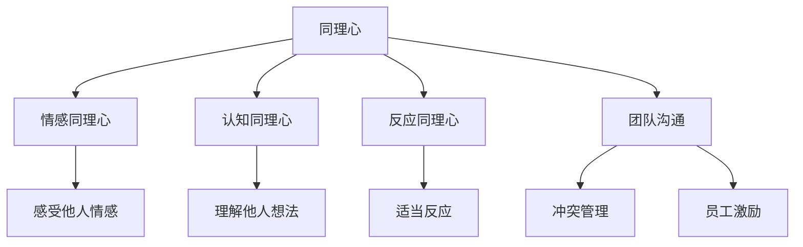
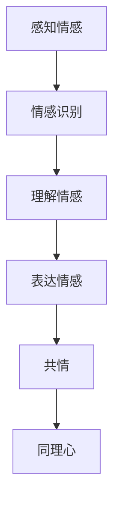
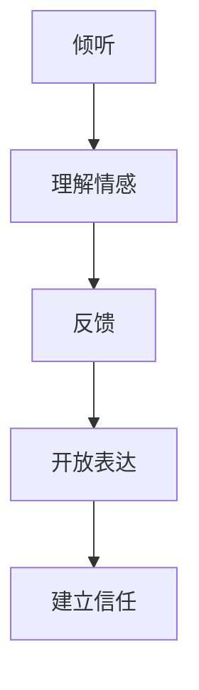
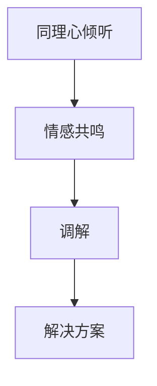
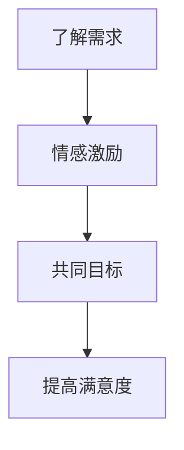
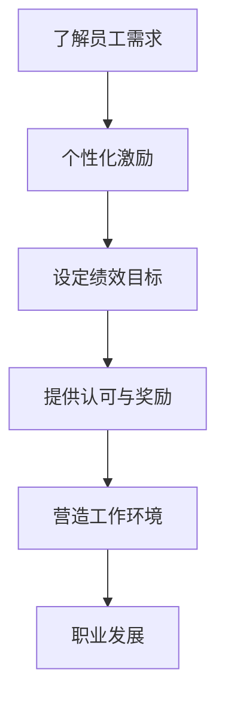
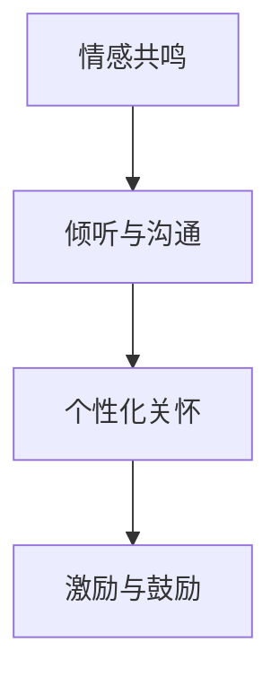
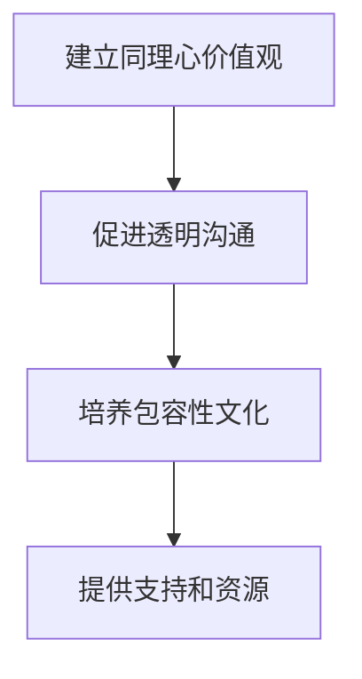
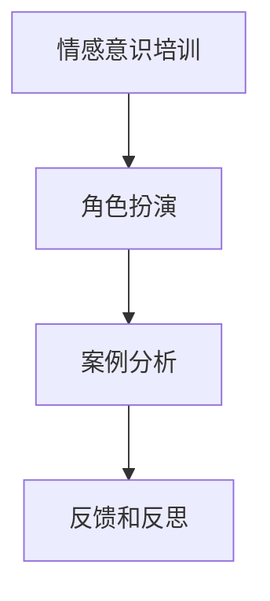

                 

### 核心概念与联系

**同理心**，作为一种心理学概念，是指个体在情感上与他人产生共鸣，理解并感受到他人情感的能力。同理心在管理中的作用尤为重要，因为它能够帮助管理者更好地理解员工的需求、情感和感受，从而更有效地进行团队沟通和冲突管理。

首先，我们需要定义同理心的核心概念。同理心可以分为情感同理心、认知同理心和反应同理心。情感同理心是指个体能够感受他人的情感；认知同理心是指个体能够理解他人的想法；反应同理心是指个体能够根据他人的情感和想法做出适当的反应。这些同理心的类型共同构成了同理心的基础框架。

接下来，我们需要探讨同理心在管理中的应用。同理心在团队管理中起着至关重要的作用，主要体现在以下几个方面：

1. **团队沟通**：管理者通过同理心能够更好地理解员工的需求和情感，从而进行有效的沟通。这种沟通不仅能够提高信息传递的准确性，还能增强员工之间的信任和合作。

2. **冲突管理**：同理心有助于管理者在团队冲突中找到平衡点，理解冲突双方的情感和需求，从而采取更为公平和有效的解决方案。

3. **员工激励**：同理心能够帮助管理者了解员工的工作动机和期望，从而采用个性化的激励策略，提高员工的工作积极性和满意度。

为了更好地解释同理心的概念和其在管理中的应用，我们可以使用 Mermaid 流程图来展示同理心的核心概念及其相互关系：

通过这个流程图，我们可以清晰地看到同理心的核心概念及其在管理中的应用。同理心不仅是情感上的共鸣，更是理解和管理团队的有效工具。

### 同理心的心理学基础

在深入探讨同理心的心理学基础之前，我们首先需要理解一个关键概念——情绪智力（Emotional Intelligence，简称EQ）。情绪智力是指个体在情感上的认知能力，包括自我意识、自我管理、社交意识和关系管理等方面。情绪智力不仅影响个体的心理健康，也在团队管理和领导力中扮演着重要角色。

#### 情绪智力的定义与构成

情绪智力由戈尔曼（Daniel Goleman）在1995年提出，他认为情绪智力包括以下几个核心维度：

1. **自我意识**：指个体能够认识到自己的情绪状态，理解情绪对自己行为的影响。

   - **能力**：自我观察、自我反思。
   - **测量**：自我评价量表。

2. **自我管理**：指个体能够控制自己的情绪，保持冷静和专注。

   - **能力**：情绪调节、自我激励。
   - **测量**：情绪调节量表。

3. **社交意识**：指个体能够敏锐地感知他人的情绪，理解他人的需求和期望。

   - **能力**：社交观察、社交直觉。
   - **测量**：社交知觉量表。

4. **关系管理**：指个体能够建立和维护良好的人际关系。

   - **能力**：社交技能、领导力。
   - **测量**：关系管理量表。

情绪智力的测量通常使用情商量表（EQI），该量表包括多个维度，用于评估个体的情绪智力水平。

#### 同理心的发展与培养

同理心的发展是一个长期的过程，通常在个体的成长过程中逐渐形成。以下是一些促进同理心发展的方法：

1. **情感教育**：通过教育帮助个体了解情感、情感表达和情感理解。这可以通过课堂教育、阅读书籍、观看电影和参与社交活动等方式实现。

2. **角色扮演**：通过角色扮演活动，个体可以模拟他人的生活情境，从而提高对他人情感和经历的理解。

3. **情感交流**：鼓励个体与他人进行开放和诚实的情感交流，通过倾听和表达情感，增强对他人情感的理解。

4. **共情练习**：通过共情练习，如阅读情感丰富的文学作品、参与情感互动游戏等，个体可以锻炼自己的共情能力。

5. **心理辅导**：心理辅导可以帮助个体更好地认识自己的情感，理解他人的情感，从而提高同理心。

为了更直观地展示同理心的发展过程，我们可以使用以下 Mermaid 流程图：

通过这个流程图，我们可以看到同理心的发展是一个逐步深化的过程，从简单的情感感知到最终的共情和同理心。

综上所述，同理心的心理学基础包括情绪智力的发展与培养。通过情感教育、角色扮演、情感交流、共情练习和心理辅导等方法，个体可以逐步提升自己的同理心水平，从而更好地应用于团队管理和领导力发展。

### 同理心在团队管理中的应用

在团队管理中，同理心作为一种关键软技能，不仅有助于增强团队的协作和凝聚力，还能提高员工的工作满意度和效率。同理心在团队沟通、冲突管理和员工激励中发挥着至关重要的作用。

#### 团队沟通

沟通是团队协作的核心，而同理心则是有效沟通的基础。管理者通过同理心能够更好地理解员工的情感和需求，从而进行更加准确和有效的沟通。以下是一些同理心在团队沟通中的具体应用：

1. **倾听**：同理心要求管理者不仅仅是听到员工的话，更要理解员工的情感和真实意图。通过倾听，管理者可以获取更多的信息，并建立信任和尊重的关系。

2. **反馈**：同理心使管理者能够提供更具同理心的反馈。在提供反馈时，管理者不仅关注员工的行为，还关注其情感和动机，从而避免造成负面情绪。

3. **开放表达**：同理心鼓励管理者开放地表达自己的情感和观点，同时尊重员工的情感和观点。这种开放性的沟通有助于促进团队的透明度和合作。

以下是一个沟通同理心的 Mermaid 流流程图，展示了同理心在团队沟通中的流程和步骤：

#### 冲突管理

在团队中，冲突是不可避免的。同理心在冲突管理中的应用尤为重要，它可以帮助管理者更好地理解冲突双方的情感和需求，从而采取更为公平和有效的解决方案。以下是一些同理心在冲突管理中的具体应用：

1. **同理心倾听**：管理者在冲突中应倾听双方的意见，理解他们的情感和立场，避免盲目判断。

2. **情感共鸣**：管理者通过与对方建立情感共鸣，能够更好地感受到对方的不满和痛苦，从而更容易找到解决问题的方法。

3. **调解**：同理心使管理者能够站在冲突双方的角度进行调解，提出双方都能接受的解决方案。

以下是一个冲突管理同理心的 Mermaid 流流程图，展示了同理心在冲突管理中的流程和步骤：

#### 员工激励

激励是管理的重要一环，同理心在激励中的应用能够提高员工的工作积极性和满意度。以下是一些同理心在员工激励中的具体应用：

1. **了解需求**：管理者通过同理心了解员工的需求和期望，从而制定个性化的激励策略。

2. **情感激励**：管理者通过表达对员工的关心和认可，增强员工的归属感和工作动力。

3. **共同目标**：同理心使管理者能够与员工建立共同的目标，共同为实现目标而努力。

以下是一个员工激励同理心的 Mermaid 流流程图，展示了同理心在员工激励中的流程和步骤：

综上所述，同理心在团队管理中的应用涵盖了团队沟通、冲突管理和员工激励等方面。通过同理心，管理者能够更好地理解员工，建立信任和尊重的关系，从而提高团队的整体效能和员工的满意度。

### 激励团队

在团队管理中，激励员工是提高工作效率和实现组织目标的关键。激励理论为管理者提供了理解和激励员工的方法和策略。本文将介绍几种主要的激励理论，并探讨如何运用这些理论来激励团队。

#### 激励理论

1. **需求层次理论**（Maslow's Hierarchy of Needs）

需求层次理论是由亚伯拉罕·马斯洛（Abraham Maslow）提出的，该理论将人的需求分为五个层次：生理需求、安全需求、社交需求、尊重需求和自我实现需求。

   - **生理需求**：基本生活需求，如食物、水和住所。
   - **安全需求**：保护免受身体和心理伤害的需求。
   - **社交需求**：建立和维持人际关系的需求。
   - **尊重需求**：获得自尊和他人尊重的需求。
   - **自我实现需求**：实现个人潜能和追求自我价值的需求。

   管理者可以通过满足员工的这些需求来激励他们。例如，通过提供良好的工作环境、安全保障和晋升机会来满足员工的基本需求；通过团队建设活动和认可制度来满足员工的社交需求和尊重需求；通过提供挑战性任务和个人发展机会来满足员工的自我实现需求。

2. **动机与行为理论**（Motivation and Behavior Theory）

动机与行为理论主要研究个体行为背后的动机因素。弗雷德里克·赫兹伯格（Frederick Herzberg）提出了“双因素理论”（Two-Factor Theory），也称为“激励-保健理论”（Motivator-Hygiene Theory）。赫兹伯格认为，影响员工工作满意度的因素分为两类：激励因素和保健因素。

   - **激励因素**：与工作内容相关的因素，如成就、认可和责任感，这些因素能够激励员工。
   - **保健因素**：与工作环境相关的因素，如工作条件、薪酬和公司政策，这些因素只能预防不满意，不能直接激励员工。

   管理者可以通过关注激励因素来提高员工的工作积极性，例如提供有挑战性的任务、给予及时的认可和奖励、提供职业发展机会等。

3. **目标设置理论**（Goal-Setting Theory）

目标设置理论由爱德华·德西（Edward L. Deci）和理查德·瑞恩（Richard M. Ryan）提出，该理论认为，明确和具有挑战性的目标能够激励员工。目标设置理论包括以下原则：

   - **明确性**：目标应当具体、明确，员工知道需要实现什么。
   - **挑战性**：目标应当具有一定难度，激发员工的努力和创造力。
   - **反馈**：员工应当定期获得关于目标进展的反馈，以调整自己的行为。

   管理者可以通过设定明确的、具有挑战性的目标，并提供及时的反馈来激励员工。

#### 激励策略

结合上述激励理论，管理者可以采取以下策略来激励团队：

1. **个性化激励**：了解每位员工的需求和动机，制定个性化的激励计划。例如，对于追求自我实现的员工，可以提供职业发展机会和挑战性任务；对于重视社交需求的员工，可以组织团队建设和社交活动。

2. **绩效管理**：通过设定明确的绩效目标，提供及时的反馈和奖励，激励员工努力工作。管理者应当确保目标具有明确性、挑战性和可行性。

3. **认可与奖励**：及时认可员工的成就和努力，提供适当的奖励，如奖金、晋升和荣誉称号等，以激励员工。

4. **工作环境**：营造积极的工作环境，提供良好的工作条件、公平的薪酬和良好的福利待遇，满足员工的保健需求。

5. **职业发展**：提供职业培训和发展机会，帮助员工实现自我价值，满足员工的自我实现需求。

以下是一个激励团队策略的 Mermaid 流流程图，展示了激励策略的步骤和要素：

综上所述，激励团队是管理者的重要任务。通过了解员工的需求、设定明确的绩效目标、提供认可与奖励、营造良好的工作环境和职业发展机会，管理者可以有效地激励团队，提高工作效率和实现组织目标。

### 同理心与领导力

在探讨同理心与领导力的关系时，我们需要首先了解领导力的定义和类型。领导力是一种能够引导和激励他人实现目标的能力，它不仅仅涉及权力和权威，还包括影响力、信任和同理心。领导力可以分为交易型领导（Transaction Leadership）和变革型领导（Transformational Leadership）两种类型。

#### 领导力模型

1. **交易型领导（Transaction Leadership）**

   交易型领导侧重于建立明确的绩效标准和奖励机制，通过激励和奖励来引导员工行为。这种领导方式强调的是成果和效率，通常通过制定规章制度、明确任务分配和奖励系统来实现。交易型领导的特点包括：

   - **目标导向**：明确目标，强调结果。
   - **奖励机制**：提供奖励以激励员工。
   - **规章制度**：建立明确的规章制度，确保员工遵守。

   虽然交易型领导在某些情况下能够有效提高绩效，但它通常缺乏对员工情感需求的关注，可能会导致员工的被动参与和短期行为改变。

2. **变革型领导（Transformational Leadership）**

   变革型领导则更注重激励和引导员工进行自我超越，强调价值观、愿景和共同目标。变革型领导通过同理心、激励和榜样作用来影响员工，使员工在实现个人价值的同时推动组织的变革。变革型领导的特点包括：

   - **愿景领导**：建立清晰的愿景，激励员工追求共同目标。
   - **激励与信任**：通过激励和信任建立积极的团队氛围。
   - **榜样作用**：通过自身行为树立榜样，影响员工。

   变革型领导能够激发员工的内在动力，促进长期的成长和变革，使组织更具有活力和创新能力。

#### 同理心领导

同理心领导是一种将同理心融入领导实践的领导方式，强调领导者对团队成员情感和需求的深刻理解。同理心领导的特点包括：

1. **情感共鸣**：领导者能够感受和体验到员工的情感，理解他们的困难和挑战。
2. **倾听与沟通**：领导者通过倾听和沟通，了解员工的意见和建议，建立信任和合作关系。
3. **个性化关怀**：领导者关注每位员工的个人需求，提供个性化的支持和激励。
4. **激励与鼓励**：领导者通过激励和鼓励，激发员工的潜能和积极性。

同理心领导的优势在于：

- **增强团队凝聚力**：通过同理心，领导者能够更好地理解员工，增强团队的凝聚力。
- **提高员工满意度**：同理心使员工感受到被尊重和关注，提高工作满意度和忠诚度。
- **促进创新和创造力**：同理心领导鼓励员工表达自己的想法和意见，促进创新和创造力的发挥。
- **提升领导效能**：同理心领导能够更好地管理团队，提高领导效能和组织的整体绩效。

以下是一个同理心领导的 Mermaid 流流程图，展示了同理心领导的主要步骤和要素：

综上所述，同理心在领导力中起着至关重要的作用。同理心领导不仅能够增强团队的凝聚力和员工的满意度，还能促进创新和创造力的发挥，提高领导效能和组织绩效。通过同理心，领导者能够更好地理解员工，建立信任和合作关系，从而实现组织的长期成功。

### 同理心在工作环境中的实践

在工作环境中，同理心的实践对于建立积极的企业文化和高效的工作氛围至关重要。以下将探讨同理心在组织文化和同理心培训中的应用，以及相关的实践策略。

#### 组织文化

组织文化是指企业内部共同的价值观、信念和行为准则，它对员工的行为和工作态度有着深远的影响。同理心在组织文化中的实践，有助于形成尊重、信任和合作的工作环境。

1. **建立同理心价值观**：企业可以通过明确的价值观来倡导同理心，例如将“以人为本”作为核心价值，强调员工的需求和情感。这种价值观的传播可以通过内部通讯、员工会议和企业使命宣言等方式实现。

2. **促进透明沟通**：透明沟通是同理心在组织文化中的重要组成部分。企业应鼓励开放和诚实的交流，使员工感受到被尊重和理解。这可以通过定期员工会议、反馈机制和开放的领导风格来实现。

3. **培养包容性文化**：包容性文化意味着企业尊重和接纳不同背景和观点的员工。同理心在这里的作用是帮助员工理解他人的情感和经历，减少偏见和歧视，增强团队的凝聚力。

4. **提供支持和资源**：企业可以通过提供心理健康支持、职业发展和培训资源，来支持员工的个人成长和职业发展。这种支持不仅有助于提高员工的工作满意度，还能增强他们对企业的忠诚度。

以下是一个同理心在组织文化中应用的 Mermaid 流流程图：

#### 同理心培训

同理心培训是提高员工同理心水平的重要手段，它可以帮助员工更好地理解他人，提高沟通和冲突解决能力。以下是一些有效的同理心培训策略：

1. **情感意识培训**：这种培训旨在提高员工对自身情感的认识，包括情感的识别、表达和管理。培训内容可以包括情感智力的理论和实践方法，以及如何通过情感反应来理解他人。

2. **角色扮演**：通过角色扮演活动，员工可以在模拟环境中练习同理心技能，例如如何在不同情境下表达理解和关心。这种练习可以帮助员工更好地理解和感受他人的情感。

3. **案例分析**：通过分析真实的案例，员工可以学习如何识别和理解他人情感，并找到有效的解决方案。案例分析可以涵盖各种工作环境中的情境，如团队冲突、客户沟通等。

4. **反馈和反思**：在培训过程中，提供及时的反馈和反思机会，可以帮助员工了解自己的同理心表现，并不断改进。反馈可以来自同事、导师或专业的培训师。

以下是一个同理心培训流程的 Mermaid 流流程图：

综上所述，同理心在工作环境中的实践对于建立积极的企业文化和提高员工的工作满意度至关重要。通过在组织文化和同理心培训中实施具体的策略，企业可以培养出一个更加理解、合作和创新的工作环境。

### 案例研究与反思

#### 成功案例：同理心在微软团队管理中的应用

微软公司以其创新和文化变革而闻名，而其成功的一个重要因素便是同理心在团队管理中的应用。在比尔·盖茨和萨提亚·纳德拉的领导下，微软逐渐将同理心纳入其管理哲学。

1. **领导层的示范作用**：萨提亚·纳德拉在其领导过程中，始终强调同理心的重要性。他不仅通过自己的行为，如关注员工的反馈和个人成长，树立了榜样，还通过内部演讲和沟通，强调了同理心对于团队协作和创新的价值。

2. **员工参与和反馈**：微软鼓励员工积极参与公司决策，提供反馈和建议。例如，通过“员工反馈邮件”系统，员工可以直接向领导层提出问题和建议。这种开放性的沟通方式不仅增强了员工的参与感，还使管理层能够更好地理解员工的需求和情感。

3. **个性化激励**：微软根据员工的不同需求和职业目标，提供个性化的激励措施。例如，对于追求技术成就的员工，公司提供挑战性的项目和研究机会；对于注重工作生活平衡的员工，公司提供灵活的工作时间和远程办公政策。

4. **团队合作与互助**：微软倡导团队合作的氛围，鼓励员工在项目中相互支持、共同成长。通过定期的团队建设活动和知识分享会，员工不仅能够建立深厚的人际关系，还能提高团队合作能力。

#### 反思与讨论

尽管同理心在微软的团队管理中取得了显著成效，但仍存在一些挑战和问题：

1. **实施难度**：同理心需要时间和精力去培养和实施。在快节奏和高压力的工作环境中，管理者可能难以持续地关注和回应员工的情感需求。

2. **文化变革**：将同理心融入组织文化需要长期的努力和持续的推动。企业需要克服固有的管理习惯和思维模式，建立起以同理心为核心的企业文化。

3. **个性化与一致性**：个性化激励虽然有助于满足员工的不同需求，但也可能导致资源分配不均，影响团队的一致性。管理者需要在个性化激励和团队一致性之间找到平衡点。

#### 解决策略

1. **持续培训和教育**：定期举办同理心培训和工作坊，提高管理者和员工的同理心水平。通过不断的学习和实践，培养同理心成为企业文化和日常工作的一部分。

2. **建立反馈机制**：建立有效的反馈机制，使员工和管理者能够及时了解彼此的需求和反馈。这可以通过定期的绩效评估、员工满意度调查和一对一会议来实现。

3. **跨部门合作**：鼓励跨部门的项目和团队合作，促进不同背景和经验的员工之间的交流和理解。通过多样化的团队，企业可以更好地吸收和整合不同的观点和需求。

4. **激励机制**：设计平衡的激励机制，确保个性化激励和团队一致性之间的平衡。通过奖励团队合作和创新，同时鼓励个性化成长，企业可以激发员工的潜能和积极性。

总之，同理心在团队管理中的成功应用不仅需要管理层的支持和示范，还需要系统的培训和持续的实践。通过有效的策略和不断的努力，企业可以建立起一个理解、合作和创新的工作环境。

### 结论与展望

同理心作为一种关键的管理技能，在团队管理中具有不可替代的重要作用。通过理解员工的情感和需求，管理者可以更有效地进行团队沟通、冲突管理和员工激励，从而提高团队的凝聚力和工作效率。

未来，随着人工智能和机器学习的发展，同理心的研究将更加深入。例如，利用自然语言处理和情感分析技术，企业可以更精确地了解员工的情感状态，为个性化管理和激励提供数据支持。

此外，同理心培训和教育的普及也将成为趋势。通过系统的培训和持续的实践，企业可以培养出更多具有同理心意识和能力的管理者，从而建立更加健康和高效的工作环境。

总之，同理心不仅是管理者的重要工具，也是组织成功的关键因素。通过不断探索和应用同理心，企业可以提升团队效能，实现长期可持续发展。

### 附录

#### 同理心的心理学研究综述

同理心在心理学领域的地位和重要性不言而喻。近年来，关于同理心的研究取得了许多重要进展，涵盖了其定义、类型、发展机制及其在管理、教育和医疗等多个领域的应用。

1. **定义与类型**：同理心通常被定义为一种情感共鸣和理解他人情感的能力。根据戈尔曼（Daniel Goleman）的观点，同理心可以分为情感同理心、认知同理心和反应同理心。

2. **发展机制**：同理心的发展受到多种因素的影响，包括家庭教育、社交环境和个人经历。研究表明，早期家庭环境中的情感交流和关爱对同理心的发展至关重要。

3. **应用领域**：同理心在多个领域具有广泛应用。在管理领域，同理心有助于提高团队沟通和员工满意度；在教育和医疗领域，同理心有助于建立良好的师生关系和医患关系。

4. **未来趋势**：随着人工智能和大数据技术的发展，同理心研究将更加精细化和数据化。利用情感分析和自然语言处理技术，研究者可以更准确地测量和理解个体的同理心水平。

#### 同理心实践的工具与方法

为了提升同理心水平，企业可以采用以下工具和方法：

1. **同理心培训**：通过角色扮演、情感意识和反馈机制等培训方法，帮助员工提高同理心技能。

2. **情感反馈系统**：建立员工反馈机制，鼓励员工表达自己的情感和需求，管理者可以及时了解和回应。

3. **情感智能测试**：使用情感智能测试量表（如EQI），评估员工的同理心水平，为培训和发展提供依据。

4. **团队建设活动**：通过团队建设活动，如团队合作游戏、情感互动和分享会，增强团队成员之间的情感联系和理解。

通过这些实践工具和方法，企业可以营造一个理解、信任和合作的工作环境，从而提高团队效能和员工满意度。

