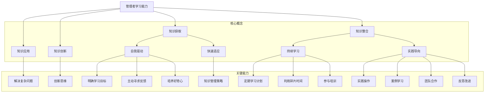

                 

### 文章标题

在当今快速发展的信息技术时代，管理者的学习能力成为决定企业成败的关键因素。为了保持知识的持续更新和竞争力的提升，管理者需要不断学习、适应和变革。本文将以《管理者学习能力：保持知识更新的持续发展》为题，探讨管理者学习能力的核心概念、重要性及其具体提高方法，旨在帮助读者深入了解并提升自己的学习能力，以实现个人与组织的共同成长。

### 关键词

- 管理者学习能力
- 知识更新
- 持续学习
- 自我驱动
- 学习策略

### 摘要

本文从管理者学习能力的定义、核心原则、具体方法、案例分析以及持续发展的策略等方面，系统地阐述了管理者如何保持知识更新，提高学习能力。文章通过逻辑清晰、结构紧凑的论述，结合实际案例，为管理者提供了实用的学习策略和成长路径，旨在为企业和个人的可持续发展提供理论支持和实践指导。

## 引言

### 背景介绍

在信息爆炸和技术飞速发展的时代，知识的更新速度越来越快，传统的学习模式已经难以满足管理者的需求。现代企业面临着前所未有的挑战，管理者不仅需要具备丰富的管理知识和经验，还需要具备快速学习和适应新知识的能力。正如彼得·德鲁克所说：“知识是今天企业最关键的资源，而知识工作者是企业最宝贵的资产。”管理者作为企业的核心领导，其学习能力直接影响到企业的发展方向和竞争优势。因此，提升管理者的学习能力，已成为企业可持续发展的重要战略。

### 核心概念与联系

管理者的学习能力是指他们在面对新知识、新技术和新环境时，能够迅速适应和掌握的能力。学习能力包括知识获取、知识整合、知识应用和知识创新等多个方面。知识更新是指管理者不断获取新的知识和技能，以应对快速变化的市场环境和技术发展。知识更新与学习能力紧密相关，学习能力强的管理者能够更有效地进行知识更新，从而保持自身的竞争力。

### 目的和重要性

本文旨在探讨管理者如何通过提高学习能力来实现知识更新，进而推动个人和企业的持续发展。文章将首先介绍管理者学习能力的核心概念和原则，然后探讨提高学习能力的具体方法，并通过案例分析来验证这些方法的有效性。最后，文章将提出一些策略和建议，帮助管理者在知识更新的道路上走得更远。通过本文的探讨，希望能够为管理者提供一些实用的学习工具和策略，帮助他们在快速变化的环境中保持竞争优势。

## 第一部分：管理者学习能力的核心概念与原则

### 第1章：管理者学习能力的定义与重要性

#### 1.1 学习能力的概念

学习能力是指个体在获取、理解、应用和创新知识的过程中所表现出的能力。管理者作为企业的核心领导，其学习能力尤为重要。具体而言，管理者的学习能力包括以下几个方面的内容：

1. **知识获取能力**：管理者需要能够快速获取与业务相关的最新知识和技术，包括阅读书籍、研究报告、行业动态等。
   
2. **知识整合能力**：管理者需要将获取的知识进行整合，形成系统化的知识体系，以便在实际工作中应用。

3. **知识应用能力**：管理者需要能够将所学知识应用到实际问题中，解决管理中的复杂问题。

4. **知识创新能力**：管理者需要具备创新思维，能够将新知识融入到企业的战略和创新中，推动企业的发展。

#### 1.2 管理者学习能力的特征

管理者学习能力的特征主要包括以下几个方面：

1. **自我驱动**：管理者需要具备强烈的自我驱动能力，主动寻找学习机会，不断充实自己的知识和技能。

2. **快速适应**：管理者需要能够迅速适应新的环境和变化，对新知识和技术有较强的接受和适应能力。

3. **持续学习**：管理者需要将学习作为一种生活方式，不断追求知识的更新和技能的提升。

4. **实践导向**：管理者需要将学习与实践相结合，通过实践来验证和应用所学知识。

#### 1.3 管理者学习能力的价值

管理者学习能力的价值体现在以下几个方面：

1. **提升个人竞争力**：通过不断学习和提升能力，管理者可以增强自己的竞争力，获得更多的职业发展机会。

2. **推动企业发展**：管理者的学习能力直接影响到企业的发展方向和决策质量，提升学习能力有助于企业保持竞争力和创新能力。

3. **培养团队文化**：管理者通过自身的示范作用，可以激发团队的学习热情，形成良好的学习氛围。

4. **应对不确定性**：在快速变化的市场环境中，管理者需要具备较强的适应能力和创新精神，以应对不确定性。

#### 1.4 学习能力与知识更新

学习能力与知识更新密切相关。随着技术的不断进步和市场环境的快速变化，管理者需要不断更新自己的知识体系。学习能力强的管理者能够更快地适应新环境，掌握新知识，从而在竞争中保持优势。

- **知识获取**：通过不断学习，管理者可以获取新的知识和技能，如新兴技术的应用、管理理念的创新等。
  
- **知识整合**：管理者需要将所学知识进行整合，形成系统化的知识体系，以便在实际工作中应用。

- **知识应用**：管理者需要将所学知识应用到实际问题中，解决管理中的复杂问题，如市场策略的调整、组织架构的优化等。

- **知识创新**：管理者需要具备创新思维，能够将新知识融入到企业的战略和创新中，推动企业的发展。

总之，管理者学习能力是保持知识更新的关键，是实现个人和 企业可持续发展的重要保障。在接下来的章节中，我们将进一步探讨管理者学习能力的核心原则和具体方法，帮助读者深入了解并提升自己的学习能力。

### 第2章：管理者学习能力的核心原则

#### 2.1 自我驱动的学习态度

自我驱动的学习态度是管理者学习能力提升的重要基础。自我驱动意味着管理者具有强烈的内在动机和主动性，不依赖于外部压力和激励，而是通过自我激励和自我约束来推动学习。具体原则如下：

1. **明确学习目标**：管理者需要设定清晰的学习目标，这有助于保持学习的方向性和持续性。目标可以分为短期和长期，如学习一项新技术、提升某个管理技能等。

2. **主动寻求反馈**：管理者应主动向同事、下属或专家寻求反馈，通过外部评价来检验自己的学习效果，不断调整和改进学习策略。

3. **培养好奇心**：保持好奇心是激发学习兴趣和动力的重要途径。管理者应保持对新技术、新理念和新方法的敏感性，不断探索未知领域。

4. **自律学习**：自我驱动的学习需要管理者具备高度的自律性，即使在无外部监督的情况下，也能保持持续学习的状态。

#### 2.2 知识管理的策略

知识管理是提升管理者学习能力的重要手段。知识管理不仅包括知识的获取和整合，还包括知识的存储、共享和利用。以下是几个关键策略：

1. **建立个人知识库**：管理者应建立个人知识库，将所学知识进行系统化整理和存储。知识库可以是电子文档、笔记或专业的知识管理软件。

2. **定期回顾和更新**：管理者应定期回顾和更新自己的知识库，确保知识的时效性和准确性。通过定期复习，可以加深对知识的理解和记忆。

3. **知识共享**：管理者应积极参与知识共享活动，如团队会议、知识分享会等。通过分享知识，不仅可以巩固自己的学习成果，还能从他人的经验中获取新的见解。

4. **构建学习网络**：管理者应积极构建学习网络，与同行、专家和学者建立联系。通过交流和合作，可以拓宽知识视野，获取更多的学习资源和机会。

#### 2.3 持续学习的习惯

持续学习是管理者保持竞争力的重要保障。以下是一些培养持续学习习惯的方法：

1. **定期学习计划**：管理者应制定定期学习计划，确保在繁忙的工作中也能抽出时间进行学习。例如，每天安排一段时间进行专业阅读或在线课程。

2. **利用碎片时间**：利用碎片时间进行学习，如通勤途中、等待会议的时间等。可以通过阅读电子书、听专业课程或观看相关视频来充实自己。

3. **参与培训和学习活动**：积极参加各类培训和学习活动，如工作坊、研讨会、在线课程等。这些活动不仅可以提供新的知识和技能，还能扩展人脉和视野。

4. **反思和总结**：在学习过程中，管理者应不断反思和总结，从实践中吸取经验教训，改进学习方法。

#### 2.4 学习与实践相结合

理论学习和实践操作是相辅相成的。以下是一些结合学习与实践的方法：

1. **实践操作**：管理者应通过实际操作来验证和应用所学知识。例如，尝试实施新的管理工具或方法，观察其效果并进行反馈调整。

2. **案例学习**：通过分析经典案例和实际案例，管理者可以了解不同管理情境下的解决方案，从而提升自己的实践能力。

3. **团队合作**：在团队合作中，管理者可以与团队成员共同探讨和解决问题，通过实践来提升自己的管理能力。

4. **反思和改进**：管理者应定期反思自己的实践过程，识别不足之处并进行改进。通过不断实践和反思，可以不断提高自己的管理水平和能力。

总之，自我驱动的学习态度、有效的知识管理策略、持续学习的习惯以及学习与实践相结合是提升管理者学习能力的关键原则。通过遵循这些原则，管理者可以不断提升自己的知识储备和技能水平，为个人和企业的持续发展奠定坚实的基础。

### 第3章：核心概念与联系

#### 3.1 管理者学习能力的Mermaid流程图

为了更直观地展示管理者学习能力中的核心概念及其相互关系，我们可以使用Mermaid流程图来描述。以下是管理者学习能力Mermaid流程图的示例：



这个Mermaid流程图展示了管理者学习能力中的核心概念和关键能力，以及它们之间的相互关系。通过这个流程图，管理者可以更清晰地了解自身学习能力的构成要素，从而有针对性地提升自己的学习能力。

#### 3.2 核心概念与联系详解

1. **知识获取**：知识获取是管理者学习能力的起点，它包括从各种渠道获取新的知识和信息，如阅读书籍、研究报告、在线课程、参加研讨会等。知识获取不仅是获取信息，更是筛选和鉴别信息的能力。

2. **知识整合**：知识整合是将获取的知识进行系统化、结构化的过程。管理者需要将分散的知识点整合成一个整体，形成系统化的知识体系，以便在实际工作中应用。

3. **知识应用**：知识应用是将整合后的知识应用到实际问题的解决过程中。这需要管理者具备将理论知识转化为实践操作的能力，能够根据实际情况灵活运用所学知识。

4. **知识创新**：知识创新是管理者在知识应用的基础上，通过创新思维和方法，将新的知识和技术融入到企业的战略和创新中，推动企业的发展。

5. **自我驱动**：自我驱动是指管理者具有强烈的内在动机和主动性，能够自我激励并保持持续学习的状态。自我驱动是提升学习能力的关键，它决定了管理者能否主动适应变化、持续学习和成长。

6. **快速适应**：快速适应是指管理者在面对新知识、新技术和新环境时，能够迅速调整自己，快速适应并有效应对。快速适应能力是管理者应对不确定性、保持竞争力的关键。

7. **持续学习**：持续学习是指管理者将学习作为一种生活方式，不断追求知识的更新和技能的提升。持续学习不仅是个人成长的需要，更是企业发展的动力。

8. **实践导向**：实践导向是指管理者将学习与实践相结合，通过实践来验证和应用所学知识。实践导向能够帮助管理者更好地理解和掌握知识，提升解决问题的能力。

通过这个Mermaid流程图和核心概念的详细解释，管理者可以更清晰地理解自身学习能力的构成要素，以及各个要素之间的相互关系。管理者可以根据自身的实际情况，有针对性地提升各个方面的能力，从而全面提升自己的学习能力。

### 第4章：提高管理者学习能力的具体方法

#### 4.1 选择合适的书籍和资料

选择合适的书籍和资料是管理者提高学习能力的重要步骤。以下是一些策略和技巧：

1. **确定学习目标**：首先，管理者需要明确自己的学习目标，例如提升某一管理技能、了解新兴技术或掌握特定领域的知识。

2. **评估书籍质量**：在选择书籍时，可以通过以下方法评估书籍的质量：
   - 查看书评和读者评论，了解书籍的实际效果。
   - 查看书籍的出版时间和更新情况，确保书籍内容不过时。
   - 查看书籍的目录和摘要，判断书籍是否系统、全面。

3. **多样化阅读**：管理者应保持阅读的多样性，包括经典著作、新兴技术书籍、行业报告等。多样化的阅读有助于拓宽知识视野，提升综合能力。

4. **选择适合自己的书籍**：不同的管理者有不同的学习偏好和风格，有的喜欢系统化学习，有的喜欢通过案例学习。选择适合自己的书籍可以提高学习效果。

5. **利用图书馆和在线资源**：利用图书馆和在线资源可以节省购书成本，同时也能获取更多类型的书籍。例如，亚马逊Kindle电子书、谷歌学术等都是丰富的学习资源。

#### 4.2 制定学习计划和目标

制定有效的学习计划和目标是提高管理者学习能力的关键。以下是一些建议：

1. **设定明确的学习目标**：目标应具体、可行，例如在三个月内掌握某项新技术或技能。

2. **分解学习任务**：将大的学习目标分解为小的学习任务，例如每天阅读一章书籍或完成一个小项目。

3. **制定时间表**：制定一个详细的时间表，确保每天或每周都有固定的学习时间。例如，每天晚上7点到9点为学习时间。

4. **设定检查点**：在学习和实践过程中设定检查点，例如每周或每月进行一次自我评估，检查学习进度和效果。

5. **灵活调整计划**：学习过程中可能会遇到各种挑战和变化，管理者应保持灵活性，及时调整学习计划。

6. **寻求反馈**：定期向同事、下属或导师寻求反馈，了解自己的学习效果，并根据反馈进行调整。

#### 4.3 主动寻找学习资源

管理者应主动寻找各种学习资源，以扩展知识视野和提升学习能力。以下是一些建议：

1. **参加培训课程**：参加专业的培训课程，如管理课程、领导力培训、新兴技术课程等。这些课程通常由行业专家和学者主讲，可以快速提升知识水平。

2. **加入专业组织**：加入专业组织和行业协会，参与会议、研讨会和交流活动。这些平台可以提供丰富的学习资源和行业动态。

3. **利用在线平台**：利用在线学习平台，如Coursera、edX、Udemy等，学习各种课程和专题。这些平台提供了丰富的在线课程和资源，可以灵活安排学习时间。

4. **订阅专业期刊和杂志**：订阅相关领域的专业期刊和杂志，如《哈佛商业评论》、《经济学人》等，以获取最新的行业动态和研究成果。

5. **参加讲座和公开课**：参加各类讲座和公开课，如TED演讲、行业峰会等。这些活动不仅可以学习新知识，还能拓展人脉和视野。

6. **建立学习小组**：与同事或同行建立学习小组，共同学习和讨论。通过交流和讨论，可以加深对知识的理解和应用。

#### 4.4 学习与工作的平衡

管理者需要在繁忙的工作中保持学习与工作的平衡。以下是一些建议：

1. **合理安排时间**：制定详细的工作和学习计划，确保有足够的时间进行学习。例如，利用通勤时间阅读书籍或听专业课程。

2. **利用碎片时间**：利用碎片时间进行学习，如等待会议的时间、午休时间等。可以通过阅读电子书、听有声书或观看在线视频来充实自己。

3. **设定优先级**：将学习任务与工作优先级进行排序，确保学习任务不会影响正常工作。例如，将紧急且重要的工作任务放在学习任务之前。

4. **寻求支持**：向领导和同事寻求支持，确保学习任务不会对日常工作造成过多干扰。例如，请求调整工作时间或提供学习资源。

5. **保持积极心态**：保持积极的心态，认识到学习是提升自我和工作质量的重要途径。通过自我激励和积极态度，可以更好地平衡学习和工作。

通过以上方法，管理者可以在繁忙的工作中保持学习与工作的平衡，不断提升自己的知识水平和能力。

### 第5章：深度学习的应用

#### 5.1 深度学习的基本原理

深度学习是人工智能领域的一个重要分支，它通过模拟人脑的神经网络结构，对大量数据进行自动学习和特征提取，从而实现智能识别和决策。以下是深度学习的基本原理：

1. **神经网络结构**：深度学习模型通常由多个层次（层）组成，包括输入层、隐藏层和输出层。每层由多个神经元（节点）组成，神经元之间通过权重进行连接。

2. **前向传播和反向传播**：在前向传播过程中，数据从输入层经过多个隐藏层，最终到达输出层，形成输出结果。反向传播过程中，根据输出结果与实际结果的差异，调整每个神经元的权重，使模型能够不断优化。

3. **激活函数**：激活函数用于引入非线性因素，使神经网络能够拟合复杂的数据分布。常见的激活函数包括Sigmoid、ReLU等。

4. **损失函数**：损失函数用于衡量模型预测结果与实际结果之间的差异。常见的损失函数包括均方误差（MSE）、交叉熵等。

5. **优化算法**：优化算法用于调整神经网络的权重，以最小化损失函数。常见的优化算法包括梯度下降、Adam等。

#### 5.2 深度学习在企业管理中的应用

深度学习不仅在计算机视觉、自然语言处理等领域取得了显著成果，也在企业管理中得到了广泛应用。以下是一些具体应用场景：

1. **需求预测**：通过深度学习模型，企业可以预测未来的需求趋势，为库存管理、生产计划和供应链优化提供支持。

2. **客户行为分析**：深度学习可以帮助企业分析客户的购买行为和偏好，从而进行精准营销和个性化推荐。

3. **风险控制**：深度学习模型可以用于信用评分、欺诈检测等风险控制领域，提高决策的准确性和效率。

4. **人力资源**：通过深度学习，企业可以进行人才招聘、培训和评估，优化人力资源管理。

5. **供应链优化**：深度学习可以帮助企业优化供应链管理，提高物流效率和降低成本。

#### 5.3 深度学习算法的伪代码讲解

以下是一个简单的深度学习算法的伪代码，用于实现一个多层感知器（MLP）模型：

```plaintext
初始化参数：
- 权重矩阵 W1（输入层到隐藏层）
- 权重矩阵 W2（隐藏层到输出层）
- 学习率 alpha
- 隐藏层激活函数 f()
- 输出层激活函数 g()

输入：输入数据 X
输出：预测结果 Y'

前向传播：
for each sample in X:
    hidden_layer_input = X * W1
    hidden_layer_output = f(hidden_layer_input)
    output_layer_input = hidden_layer_output * W2
    Y' = g(output_layer_input)

计算损失：
loss =损失函数(Y', Y)

反向传播：
dW2 = hidden_layer_output * (Y' - Y) * g'(output_layer_input)
dW1 = X * (dW2 * W2.T * f'(hidden_layer_input))

更新权重：
W1 = W1 - alpha * dW1
W2 = W2 - alpha * dW2

返回：更新后的模型参数（W1, W2）
```

#### 5.4 数学模型和公式

在深度学习中，数学模型和公式起着至关重要的作用。以下是一些关键公式：

1. **激活函数公式**：
   - Sigmoid: \( f(x) = \frac{1}{1 + e^{-x}} \)
   - ReLU: \( f(x) = \max(0, x) \)

2. **损失函数公式**：
   - 均方误差（MSE）: \( MSE = \frac{1}{m} \sum_{i=1}^{m} (y_i - \hat{y}_i)^2 \)
   - 交叉熵（Cross-Entropy）: \( H(y, \hat{y}) = -\sum_{i=1}^{m} y_i \log(\hat{y}_i) \)

3. **优化算法公式**：
   - 梯度下降：\( \theta = \theta - \alpha \cdot \nabla_\theta J(\theta) \)
   - Adam: \( m_t = \beta_1 m_{t-1} + (1 - \beta_1) [g_t] \)
   \( v_t = \beta_2 v_{t-1} + (1 - \beta_2) [g_t]^2 \)
   \( \theta_t = \theta_t - \alpha_t \frac{m_t}{\sqrt{v_t} + \epsilon} \)

#### 5.5 详细讲解和举例说明

以下是一个简单的例子，用于说明如何使用深度学习模型进行分类任务：

假设我们有一个包含100个样本的数据集，每个样本有5个特征，目标标签是二分类（0或1）。我们希望训练一个深度学习模型来预测样本的标签。

1. **数据预处理**：
   - 对数据进行标准化处理，使其具有相同的量纲。
   - 划分数据集为训练集和测试集。

2. **构建模型**：
   - 输入层：5个神经元，对应5个特征。
   - 隐藏层：10个神经元，使用ReLU激活函数。
   - 输出层：2个神经元，对应两个类别，使用Sigmoid激活函数。

3. **训练模型**：
   - 使用随机梯度下降优化算法，学习率为0.01。
   - 训练过程中，使用交叉熵作为损失函数。
   - 设置训练轮数（epochs）为100轮。

4. **评估模型**：
   - 使用测试集评估模型的准确性、精确率、召回率等指标。

以下是训练过程中的伪代码：

```plaintext
for epoch in 1 to 100:
    for sample in training_samples:
        forward_pass()
        calculate_loss()
        backward_pass()
        update_weights()

evaluate_model(test_samples)
```

通过这个简单的例子，我们可以看到如何使用深度学习模型进行数据分类任务。在实际应用中，模型的构建和训练过程会更加复杂，但基本原理和步骤是一致的。

#### 5.6 深度学习算法的总结

深度学习算法在企业管理中的应用越来越广泛，通过模拟人脑神经网络，它可以对大量数据进行自动学习和特征提取，从而实现智能识别和决策。以下是深度学习算法的总结：

- **基本原理**：神经网络结构、前向传播和反向传播、激活函数、损失函数和优化算法。
- **应用场景**：需求预测、客户行为分析、风险控制、人力资源和供应链优化。
- **伪代码讲解**：多层感知器（MLP）模型的前向传播和反向传播过程。
- **数学模型和公式**：激活函数、损失函数和优化算法的关键公式。
- **详细讲解和举例**：使用深度学习模型进行分类任务的详细步骤和代码示例。

通过以上内容，管理者可以更好地理解深度学习算法的基本原理和应用，从而在企业管理中发挥其潜力。

### 第6章：技术创新的学习方法

#### 6.1 科技前沿动态的追踪

在信息技术飞速发展的时代，追踪科技前沿动态对于管理者来说至关重要。这不仅有助于企业保持竞争力，还能为企业的创新提供方向。以下是一些追踪科技前沿动态的方法：

1. **订阅专业期刊和博客**：通过订阅专业期刊和博客，如《自然》、《科学》、《哈佛商业评论》等，可以及时获取最新的研究成果和行业动态。

2. **参加行业会议和研讨会**：参加行业会议和研讨会是了解最新科技动态的重要途径。通过这些活动，可以与行业专家和学者交流，获取第一手信息。

3. **关注科技媒体报道**：科技媒体报道通常能够提供对最新科技事件的全面解读和分析。关注如《麻省理工科技评论》、《纽约时报》等媒体的科技报道，可以帮助管理者了解科技前沿。

4. **加入专业社交媒体**：在LinkedIn、Twitter等社交媒体平台上关注科技领域的专家、公司和研究机构，通过这些平台可以获取最新的科技资讯和讨论。

5. **定期更新知识库**：管理者应定期更新自己的知识库，将获取的新知识和信息进行系统化整理和存储。这有助于持续跟踪科技前沿动态，并为企业的创新提供支持。

#### 6.2 创新思维的培养

创新思维是管理者在应对复杂问题和推动企业发展的过程中必不可少的能力。以下是一些培养创新思维的方法：

1. **跨领域学习**：通过跨领域学习，管理者可以借鉴其他行业或学科的创新思维和方法，从而拓宽视野，激发创新灵感。

2. **进行头脑风暴**：头脑风暴是一种有效的创新思维方法。通过集体讨论，可以激发团队成员的创意，并从中筛选出有价值的创新点。

3. **尝试多样化方法**：管理者应尝试多样化的创新方法，如设计思维、用户故事地图等。这些方法可以帮助管理者从不同的角度思考问题，发现新的解决方案。

4. **鼓励试错**：创新过程中难免会遇到失败。管理者应鼓励团队成员敢于尝试，从失败中吸取经验教训，不断改进和创新。

5. **建立创新文化**：在组织内部建立创新文化，鼓励员工提出新想法和改进建议。通过营造一个开放、包容和创新的工作环境，可以激发员工的创新潜力。

#### 6.3 技术创新的学习路径

管理者在追求技术创新的过程中，需要遵循一定的学习路径，以确保学习的系统性和有效性。以下是一个基本的创新学习路径：

1. **基础知识储备**：首先，管理者需要掌握相关领域的基础知识，如计算机科学、数据科学、人工智能等。这是进行技术创新的基础。

2. **前沿动态了解**：通过订阅专业期刊、参加行业会议、关注媒体报道等途径，了解最新的科技前沿动态。

3. **实践应用**：将学到的知识应用到实际工作中，例如在项目中尝试使用新技术或方法，通过实践来验证和改进所学知识。

4. **跨领域学习**：通过跨领域学习，借鉴其他行业或学科的创新思维和方法，丰富自己的知识体系。

5. **创新思维培养**：通过头脑风暴、多样化方法和鼓励试错等方式，培养自己的创新思维。

6. **持续学习和反思**：创新是一个持续的过程，管理者需要不断学习新知识，反思和总结创新过程中的经验和教训，不断优化和创新。

通过以上步骤，管理者可以逐步构建起自己的技术创新能力，为企业的持续发展提供动力。

### 第7章：案例分析

#### 7.1 案例一：XX公司如何保持知识更新

XX公司是一家在信息技术领域领先的公司，其成功的一个重要因素就是持续的知识更新。以下是如何保持知识更新的详细过程：

1. **设立学习委员会**：公司设立了专门的学习委员会，负责组织内部的学习和知识共享活动。该委员会定期组织内部培训和研讨会，邀请行业专家和学者进行分享。

2. **鼓励员工自主学习**：公司鼓励员工利用业余时间进行自主学习，并提供一定的学习经费支持。员工可以参加各种在线课程、专业培训，并报销相关费用。

3. **构建知识库**：公司建立了内部知识库，将员工的培训资料、项目文档和研究成果进行系统化整理和存储。员工可以随时访问这些资源，进行学习和参考。

4. **定期评估**：公司定期对员工的学习效果进行评估，通过考试、项目展示等方式检验员工的实际能力。评估结果与员工的职业发展挂钩，激励员工持续学习。

5. **外部合作与交流**：公司积极与外部科研机构和大学合作，共同开展科研项目，共享科研成果。同时，公司也鼓励员工参加行业会议、研讨会等活动，与同行进行交流。

#### 7.2 案例二：XX管理者如何提升学习能力

XX公司的李经理是一位在管理领域经验丰富的管理者，为了进一步提升自己的学习能力，他采取了以下措施：

1. **设定学习目标**：李经理制定了详细的学习计划，明确了自己的学习目标，如掌握新兴的领导力理论、学习项目管理工具等。

2. **时间管理**：李经理通过时间管理工具，合理安排每天的学习时间，确保在繁忙的工作中也能抽出时间进行学习。

3. **利用碎片时间**：李经理利用通勤和午休时间进行学习，如阅读专业书籍、听有声书等。

4. **参与培训**：李经理积极参加公司组织的内部培训，并利用业余时间参加外部培训课程，不断充实自己的知识和技能。

5. **知识共享**：李经理积极参与公司的知识共享活动，通过分享自己的经验和学习成果，与团队成员共同进步。

#### 7.3 案例分析与启示

通过以上两个案例，我们可以看到知识更新和学习能力提升对于企业和个人发展的重要性。以下是一些案例分析与启示：

1. **组织层面的措施**：企业应建立完善的学习机制，通过设立学习委员会、鼓励员工自主学习、构建知识库等措施，促进知识更新和共享。

2. **个人层面的行动**：管理者应制定明确的学习目标，通过时间管理和利用碎片时间等策略，不断提升自己的学习能力。

3. **持续学习和反思**：无论是企业还是个人，持续学习和反思都是保持竞争力的关键。企业应鼓励员工不断学习新知识，个人也应通过反思和总结，不断提升自己的能力。

4. **外部合作与交流**：通过外部合作与交流，企业可以获取最新的行业动态和技术成果，个人也可以通过与同行的交流，拓宽视野，激发创新思维。

总之，知识更新和学习能力提升是企业和个人发展的重要保障。通过案例分析和启示，管理者可以更好地理解和应用这些原则，为企业的持续发展和个人的职业成长奠定坚实的基础。

### 第8章：知识更新的持续发展策略

#### 8.1 知识更新的周期性规划

为了确保知识更新的系统性和有效性，管理者需要制定周期性的知识更新规划。以下是一个详细的周期性规划步骤：

1. **年度学习计划**：每年初，管理者应制定一个年度学习计划，明确全年学习的目标、内容和方法。学习计划应涵盖多个领域，如技术、管理、领导力等。

2. **季度学习评估**：每季度末，管理者应对学习计划进行评估，检查学习进度和效果。通过评估，管理者可以及时发现学习中的问题，调整学习策略。

3. **月度学习总结**：每月底，管理者应进行学习总结，记录学习成果和经验教训。这有助于管理者了解自己的学习效果，持续改进学习方法。

4. **持续反馈机制**：管理者应建立持续的反馈机制，通过与同事、下属和导师的交流，获取反馈意见。这些反馈有助于管理者调整学习计划，提升学习效果。

5. **更新知识库**：定期更新内部知识库，将新学到的知识和经验整理成文档，存储在知识库中。这不仅可以方便员工查阅，还能促进知识的积累和共享。

#### 8.2 知识更新的评估与反馈

知识更新的评估与反馈是确保知识更新效果的重要环节。以下是一些具体的评估和反馈方法：

1. **学习成果评估**：通过考试、项目展示、案例分析和实际应用等多种方式，评估员工的学习成果。这些评估方法可以全面、客观地反映员工的知识掌握程度。

2. **员工反馈**：定期收集员工的反馈意见，了解他们在学习过程中遇到的问题和困难。通过反馈，管理者可以及时调整教学策略，提高学习效果。

3. **导师评估**：邀请资深导师对员工的学习进行评估，提供专业的指导和建议。导师的评估可以帮助员工更好地理解知识，提升学习能力。

4. **内部研讨会**：定期组织内部研讨会，让员工分享学习心得和经验。通过研讨会，员工可以相互学习，共同进步。

5. **外部评估**：邀请外部专家进行评估，获取专业意见和建议。外部评估有助于管理者从更客观的角度审视内部知识更新的效果。

#### 8.3 知识更新的实践与改进

知识更新的实践与改进是确保知识更新持续有效的重要步骤。以下是一些具体的实践和改进方法：

1. **项目驱动**：通过实际项目，将新学到的知识和技能应用到工作中。项目驱动不仅可以帮助员工巩固知识，还能提升实际操作能力。

2. **案例学习**：分析成功和失败的案例，从中学习经验教训。案例学习可以帮助员工了解不同情境下的解决方案，提升解决问题的能力。

3. **实践培训**：组织实践培训，让员工在实际操作中学习和提高。实践培训可以模拟真实的工作场景，提高员工的实践能力。

4. **反思与总结**：在实践过程中，员工应不断反思和总结，识别不足之处并进行改进。反思和总结有助于员工不断进步，提升知识更新效果。

5. **持续改进**：根据评估和反馈结果，持续改进知识更新策略和教学方法。持续改进可以确保知识更新过程的科学性和有效性。

通过以上周期性规划、评估与反馈以及实践与改进，管理者可以确保知识更新的持续发展，从而为企业的长期发展提供有力支持。

### 第9章：职业发展的策略

#### 9.1 职业发展的路径规划

在快速变化的市场环境中，管理者需要明确自己的职业发展路径，以确保在职业生涯中不断进步。以下是一些关键步骤和策略：

1. **自我评估**：首先，管理者应进行自我评估，了解自己的兴趣、优势和职业目标。这有助于确定适合自己的职业发展方向。

2. **设定目标**：根据自我评估的结果，设定明确的职业目标。这些目标应具体、可行，如晋升为高级经理、成为行业专家等。

3. **制定计划**：制定详细的职业发展计划，包括短期和长期目标。计划应涵盖所需的技能、知识和经验，以及实现这些目标的具体步骤。

4. **持续学习**：通过不断学习和提升能力，管理者可以为自己的职业发展奠定坚实的基础。这包括参加培训课程、阅读专业书籍、参加行业会议等。

5. **寻求指导**：找到一位职业导师或导师团队，向他们请教职业发展的问题。导师的经验和指导可以帮助管理者少走弯路，更快地实现职业目标。

#### 9.2 职业发展的能力提升

提升职业能力是管理者实现职业发展的关键。以下是一些具体的能力提升策略：

1. **沟通能力**：良好的沟通能力是管理者必备的能力。通过提高沟通能力，管理者可以更有效地传达信息、协调团队和解决冲突。

2. **领导力**：领导力是管理者的重要素质。通过学习领导力理论、参加领导力培训和实践，管理者可以提升自己的领导能力，更好地带领团队实现目标。

3. **项目管理能力**：项目管理能力是管理者在职业生涯中经常需要用到的能力。通过学习项目管理工具和方法，管理者可以更高效地规划和执行项目。

4. **决策能力**：决策能力是管理者在面临复杂问题和不确定性时的重要能力。通过学习决策理论和实践，管理者可以提升自己的决策能力，做出更加明智的决策。

5. **创新思维**：创新思维是管理者在推动企业发展和应对市场变化时的重要能力。通过培养创新思维，管理者可以不断提出新的想法和解决方案，推动企业的持续发展。

#### 9.3 职业发展的机会识别与把握

在职业发展过程中，管理者需要善于识别和把握各种机会。以下是一些识别和把握职业发展机会的策略：

1. **市场动态**：了解行业和市场动态，关注新兴趋势和技术变革。这有助于管理者把握行业发展的方向，提前准备并抓住机会。

2. **人际网络**：建立广泛的人际网络，与行业内的专家、同行和潜在合作伙伴保持联系。这些人际关系可以为管理者提供职业发展的信息和机会。

3. **积极参与**：积极参与公司的各种活动和项目，展示自己的能力和潜力。通过积极参与，管理者可以增加被上级和同事看到的机会。

4. **主动沟通**：主动与上级和同事沟通，了解他们的意见和建议。通过沟通，管理者可以了解公司的需求和期望，从而更好地把握职业发展机会。

5. **持续反馈**：定期向领导和同事反馈自己的职业发展计划和进展，寻求他们的意见和建议。这有助于管理者及时调整自己的职业发展策略，更好地实现目标。

通过以上策略，管理者可以明确自己的职业发展路径，提升职业能力，并善于识别和把握职业发展机会，从而在职业生涯中取得更大的成功。

### 第10章：持续发展的建议

#### 10.1 个人成长计划

为了实现个人和企业的持续发展，制定一个明确的个人成长计划至关重要。以下是一些建议，帮助管理者制定并实施个人成长计划：

1. **设定具体目标**：明确个人成长的目标，包括短期和长期目标。这些目标应具体、可衡量，如提升某项技能、完成某个项目等。

2. **制定详细计划**：为实现目标，制定详细的行动计划，包括所需的学习内容、时间安排、资源准备等。这有助于管理者有计划地推进个人成长。

3. **定期评估进度**：定期评估个人成长计划的执行进度，对照目标进行检查。这可以帮助管理者及时发现并解决问题，调整计划。

4. **持续学习和反思**：将学习作为日常生活的一部分，不断反思和总结学习成果和经验教训。通过持续学习和反思，管理者可以不断提升自己的能力和水平。

5. **寻求反馈**：定期向同事、下属或导师寻求反馈，了解自己的成长效果和改进方向。通过外部反馈，管理者可以更全面地了解自己，持续优化个人成长计划。

#### 10.2 团队学习与知识共享

团队学习和知识共享是促进组织持续发展的重要手段。以下是一些建议，帮助管理者推动团队学习和知识共享：

1. **建立学习小组**：组建学习小组，定期组织内部培训和学习活动。通过小组学习，团队成员可以相互交流、分享经验和知识，共同提升。

2. **建立知识库**：建立一个内部知识库，将团队的学习资料、项目文档和最佳实践进行系统化整理和存储。这有助于团队成员随时查阅和学习。

3. **鼓励知识分享**：营造一个开放、包容的氛围，鼓励团队成员分享知识和经验。可以通过内部会议、分享会、博客等形式，让团队成员展示自己的学习成果。

4. **奖励激励机制**：建立知识分享奖励机制，对积极分享知识和经验的团队成员进行奖励，激励更多成员参与到知识共享中来。

5. **跨部门合作**：促进跨部门合作，通过项目合作、研讨会等形式，让不同部门的团队成员相互交流和学习，拓宽视野。

#### 10.3 组织学习与知识管理

组织学习与知识管理是推动企业持续发展的关键。以下是一些建议，帮助管理者建立有效的组织学习与知识管理体系：

1. **制定学习战略**：明确企业的学习目标和战略，将其纳入企业的长期发展规划。这有助于确保组织学习的方向和资源投入。

2. **建立学习机制**：建立完善的学习机制，包括学习计划、评估和反馈等环节。这有助于规范组织学习过程，提高学习效果。

3. **知识共享平台**：建立知识共享平台，如内部论坛、社交媒体等，让员工可以方便地分享和获取知识。这有助于促进知识的流动和积累。

4. **知识管理培训**：定期开展知识管理培训，提升员工的知识管理意识和能力。这有助于培养员工的知识管理习惯，提高组织的知识管理水平。

5. **持续改进**：通过持续的评估和反馈，不断改进组织学习与知识管理策略。这有助于确保组织学习与知识管理体系的适应性和有效性。

通过以上建议，管理者可以制定并实施个人成长计划，推动团队学习和知识共享，建立有效的组织学习与知识管理体系，从而实现个人和企业的持续发展。

## 结语

在快速变化的信息时代，管理者的学习能力成为决定企业成败的关键因素。本文通过详细探讨管理者学习能力的核心概念、原则、具体方法以及持续发展的策略，旨在为管理者提供实用的指导和建议。提升学习能力不仅有助于个人职业发展，还能推动企业的创新和持续发展。管理者应将学习作为一种生活方式，不断更新知识和技能，以应对快速变化的市场环境和技术挑战。通过自我驱动、知识管理、持续学习和实践导向，管理者可以不断提升自己的能力，为个人和企业的成功奠定坚实的基础。希望本文能为读者提供有益的启示和帮助。

