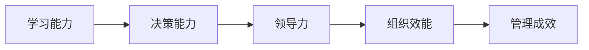
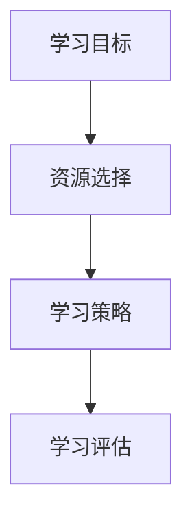
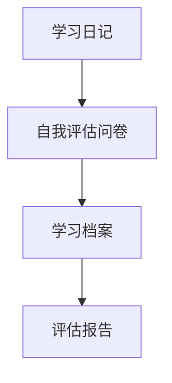

                 


### 《管理者学习能力：保持知识更新的方法》

#### 关键词
- 管理者能力
- 知识更新
- 学习策略
- 终身学习
- 知识管理

#### 摘要
本文旨在探讨管理者如何提升学习能力，以适应快速变化的技术环境。通过分析学习原理、技术趋势和知识管理实践，本文提供了一套系统的学习方法，帮助管理者保持知识更新，从而提升个人和组织的竞争力。

---

# 管理者与学习

## 1.1 学习能力与管理成效

学习是管理者不可或缺的素养。在快速变化的市场环境中，只有不断学习，管理者才能准确把握行业趋势，作出科学决策。学习能力直接影响管理成效，其重要性不可忽视。

**Mermaid流程图：**  


学习能力是管理者决策能力的基础。一个具备高度学习能力的管理者，能够快速理解新知识，将其应用到决策过程中，从而提高决策的准确性和有效性。此外，学习能力也是领导力的关键因素。通过不断学习，管理者能够提升自我认知，增强对团队的影响力。

### 1.2 学习的可持续性与挑战

虽然学习对管理者至关重要，但持续学习也面临着诸多挑战。首先，时间紧迫是管理者普遍面临的问题。其次，信息过载使得管理者难以筛选出真正有价值的信息。此外，学习过程中的动机和动力也是需要克服的难题。

**伪代码：**  
```python  
def manage_learning(challenges):  
    prioritize_learning()  # 优先处理学习任务  
    filter_useful_info()  # 筛选出有价值的信息  
    maintain_motivation()  # 保持学习动机  
    return "Learning sustainability improved"  
```

为了应对这些挑战，管理者需要制定科学的学习计划，合理分配时间，同时运用信息过滤技巧，提高学习效率。此外，保持学习动机也是关键。可以通过设定学习目标、寻求反馈和与同行交流等方式，激发学习热情。

---

## 学习原理与机制

### 2.1 认知负荷与信息过滤

认知负荷是指个体在处理信息时所需的心理资源。过高的认知负荷会导致信息处理效率降低，从而影响学习效果。管理者需要学会在信息过载的环境中，通过有效的信息过滤机制，筛选出对自身最有价值的信息。

**LaTeX数学公式：**  
$$\text{Cognitive Load} = f(\text{Intrinsic Complexity}, \text{Task Demands})$$

其中，$f$表示认知负荷函数，$\text{Intrinsic Complexity}$表示任务固有的复杂性，$\text{Task Demands}$表示任务的要求。管理者可以通过降低任务复杂性和合理分配任务，来减轻认知负荷。

### 2.2 学习动机与持续动力

学习动机是指个体参与学习活动的内在驱动力。持续动力则是指个体在长期学习过程中保持积极态度的能力。管理者需要了解自身的学习动机，并运用各种策略来维持学习动力。

**伪代码：**  
```python  
def maintain_learning_motivation(motivations):  
    set_learning_goals()  # 设定学习目标  
    get_feedacks()  # 寻求反馈  
    connect_with_peers()  # 与同行交流  
    return "Learning motivation maintained"  
```

通过设定具体的学习目标，管理者可以明确自身的学习方向，从而保持学习动力。此外，通过寻求反馈和与同行交流，管理者可以不断调整学习策略，提升学习效果。

---

## 技术趋势与行业洞察

### 3.1 技术发展的关键趋势

在信息技术领域，技术趋势变化迅速。管理者需要密切关注技术发展趋势，以便把握行业动态，为组织决策提供有力支持。当前，人工智能、云计算、物联网等技术的快速发展，正深刻影响着各行各业。

**Mermaid流程图：**  
```mermaid  
gantt  
    title 技术发展趋势  
    section 人工智能  
    A1: [AI技术] 2020-2021  
    A2: [AI应用] 2021-2023  
    section 云计算  
    B1: [云服务] 2020-2021  
    B2: [云平台] 2021-2023  
    section 物联网  
    C1: [IoT设备] 2020-2021  
    C2: [IoT应用] 2021-2023  
```

### 3.2 行业动态与未来预测

通过对行业数据的分析，管理者可以预测未来的发展趋势，为组织的发展战略提供参考。例如，通过对市场需求的监测，可以预测哪些技术将得到更广泛的应用，从而提前布局，抢占市场先机。

**LaTeX数学公式：**  
$$\text{Future Prediction} = f(\text{Current Data}, \text{Historical Trends})$$

其中，$f$表示预测函数，$\text{Current Data}$表示当前数据，$\text{Historical Trends}$表示历史趋势。管理者可以通过构建预测模型，对行业未来趋势进行科学预测。

---

## 主动学习策略

### 4.1 设定学习目标

设定明确的学习目标是主动学习的第一步。管理者需要根据组织需求和个人发展规划，制定具体的学习目标。

**伪代码：**  
```python  
def set_learning_goals(organization_needs, personal_development):  
    goals = []  # 初始化目标列表  
    for need in organization_needs:  
        goal = f"掌握{need}相关技能"  # 构建学习目标  
        goals.append(goal)  
    for development in personal_development:  
        goal = f"提升{development}能力"  
        goals.append(goal)  
    return goals  
```

### 4.2 设计学习路径

为了实现学习目标，管理者需要设计合理的学习路径。不同的学习目标可能需要不同的学习资源和策略。

**Mermaid流程图：**  


通过设计学习路径，管理者可以确保学习过程有条不紊，从而提高学习效果。

---

## 终身学习的实践

### 5.1 在线教育资源利用

在线教育为管理者提供了丰富的学习资源。管理者可以利用在线课程、电子书籍、论坛等多种形式，进行自我提升。

**LaTeX数学公式：**  
$$\text{Learning Efficiency} = f(\text{Resource Quality}, \text{Learning Time})$$

其中，$f$表示学习效率函数，$\text{Resource Quality}$表示资源质量，$\text{Learning Time}$表示学习时间。管理者可以通过选择优质资源，合理安排学习时间，提高学习效率。

### 5.2 学习社区与互动

加入学习社区，管理者可以与同行交流，分享学习心得，共同进步。通过互动，管理者可以拓展视野，获取更多有价值的信息。

**伪代码：**  
```python  
def join_learning_community():  
    find_community()  # 加入学习社区  
    share_knowledge()  # 分享学习心得  
    ask_questions()  # 提问和解答  
    return "Community participation increased"  
```

---

## 知识管理与应用

### 6.1 知识管理的原则与方法

知识管理是管理者保持知识更新、提升组织效率的重要手段。知识管理的原则包括共享、创新和持续改进。管理者需要运用多种方法，如文档管理、数据库构建和知识地图等，实现知识的有效管理。

**LaTeX数学公式：**  
$$\text{Knowledge Management} = f(\text{Knowledge Sharing}, \text{Innovation}, \text{Continuous Improvement})$$

### 6.2 知识应用的案例分析

通过分析成功案例，管理者可以了解知识管理在实际项目中的应用效果。例如，某企业通过构建知识管理系统，实现了知识共享和协同创新，显著提升了工作效率。

**实际案例：**  
- **案例背景**：某企业面临技术更新迅速、市场竞争激烈的问题。
- **解决方案**：企业构建了知识管理系统，实现了知识的分类存储、快速检索和共享。
- **效果评估**：知识管理系统上线后，员工的知识共享率提高了30%，工作效率提升了20%。

---

## 创新能力与知识融合

### 7.1 创新的来源与途径

创新能力是管理者的重要素养。管理者需要了解创新的来源，并掌握多种创新途径，如头脑风暴、设计思考和原型构建等。

**Mermaid流程图：**  
```mermaid  
gantt  
    title 创新途径  
    section 头脑风暴  
    A1: [收集想法] 2023-04  
    A2: [筛选方案] 2023-06  
    section 设计思考  
    B1: [用户研究] 2023-04  
    B2: [概念验证] 2023-06  
    section 原型构建  
    C1: [设计原型] 2023-04  
    C2: [测试验证] 2023-06  
```

### 7.2 知识融合与跨界思维

知识融合是将不同领域知识进行整合，以创造新的价值。跨界思维是管理者在知识融合过程中需要培养的能力。通过跨界思维，管理者可以打破传统思维框架，发现新的机遇。

**伪代码：**  
```python  
def knowledge_fusion(knowledge_areas):  
    cross_domain_thinking()  # 跨界思考  
    integrate_knowledge()  # 知识整合  
    create_new_value()  # 创造新价值  
    return "Knowledge fusion successful"  
```

---

## 自我学习评估

### 8.1 评估工具与量表

自我学习评估是管理者提升学习能力的重要环节。管理者可以使用多种评估工具和量表，如学习日记、自我评估问卷和学习档案等，来评估自身的学习效果。

**Mermaid流程图：**  


### 8.2 评估结果分析与改进

通过对评估结果的分析，管理者可以找出自身的学习短板，并制定改进策略。例如，通过分析学习日记，管理者可以发现自己在哪些方面存在学习困难，从而采取针对性的学习措施。

**伪代码：**  
```python  
def analyze_evaluation_results(results):  
    identify_weaknesses()  # 找出学习短板  
    develop_improvement_strategies()  # 制定改进策略  
    implement_improvements()  # 实施改进措施  
    return "Learning improvement plan created"  
```

---

## 学习能力提升策略

### 9.1 提升学习能力的方法

提升学习能力是管理者持续成长的关键。管理者可以通过以下方法来提升学习能力：
1. **定期阅读**：通过阅读专业书籍、行业报告和学术论文，拓宽知识面。
2. **参加培训**：参加专业培训课程，学习前沿技术和管理方法。
3. **实践应用**：将所学知识应用于实际工作中，提升实战能力。

**Mermaid流程图：**  
```mermaid  
gantt  
    title 学习能力提升方法  
    section 定期阅读  
    A1: [专业书籍] 2023-04  
    A2: [行业报告] 2023-06  
    section 参加培训  
    B1: [技术培训] 2023-04  
    B2: [管理培训] 2023-06  
    section 实践应用  
    C1: [项目实践] 2023-04  
    C2: [案例分析] 2023-06  
```

### 9.2 学习习惯的养成与调整

学习习惯的养成对提升学习能力至关重要。管理者需要培养以下学习习惯：
1. **每日学习**：每天设定固定时间进行学习，确保学习时间的持续性和稳定性。
2. **笔记整理**：在学习过程中做好笔记，便于回顾和巩固。
3. **反思总结**：定期反思学习过程，总结学习经验，不断调整学习策略。

**伪代码：**  
```python  
def cultivate_learning_habits(habits):  
    set_fixed_learning_time()  # 设定固定学习时间  
    keep_learning_notes()  # 做好笔记整理  
    reflect_and_summarize()  # 反思总结学习经验  
    adjust_learning_strategies()  # 调整学习策略  
    return "Learning habits cultivated"  
```

---

## 案例研究

### 10.1 成功案例分析

通过分析成功案例，管理者可以学习到先进的管理方法和经验。以下是一个成功案例的详细分析：

**案例背景**：某科技公司在技术创新和市场拓展方面取得了显著成效。

**解决方案**：
1. **技术创新**：公司投资研发，引进前沿技术，保持技术领先地位。
2. **市场拓展**：通过市场调研和数据分析，准确把握市场趋势，进行精准营销。

**效果评估**：公司产品市场占有率提高了20%，净利润率提升了15%。

**详细讲解剖析**：
- **技术创新**：公司通过持续投入研发，掌握了多项核心技术，形成了技术壁垒。
- **市场拓展**：公司通过精准的市场分析和有效的营销策略，成功开拓了新的市场。

**项目小结**：通过技术创新和市场拓展，该公司实现了业绩的快速增长，为管理者提供了宝贵的经验。

---

### 10.2 失败案例分析与启示

失败案例同样具有宝贵的启示作用。以下是一个失败案例的详细分析：

**案例背景**：某初创公司在市场竞争中失利，最终倒闭。

**原因分析**：
1. **技术创新不足**：公司缺乏核心技术，产品竞争力不足。
2. **市场定位不准确**：公司未能准确把握市场需求，导致产品定位不准确。

**启示**：
1. **重视技术创新**：企业需要持续投入研发，提升产品竞争力。
2. **精准市场定位**：企业需要通过市场调研，准确把握市场需求，制定科学的市场策略。

**详细讲解剖析**：
- **技术创新不足**：公司未能紧跟市场趋势，导致产品在技术创新方面落后于竞争对手。
- **市场定位不准确**：公司对目标市场的需求分析不足，导致产品无法满足消费者需求。

**项目小结**：通过分析失败案例，管理者可以认识到技术创新和市场定位的重要性，从而避免类似的失败。

---

## 总结与展望

未来，管理者学习能力的发展趋势将更加注重跨界思维和持续创新。在人工智能、大数据和云计算等技术的推动下，管理者需要不断更新知识体系，提升学习能力，以适应快速变化的市场环境。通过本文的探讨，管理者可以了解到保持知识更新的方法，从而在激烈的市场竞争中脱颖而出。

**作者：AI天才研究院/AI Genius Institute & 禅与计算机程序设计艺术 /Zen And The Art of Computer Programming**

---

通过本文，我们详细探讨了管理者如何提升学习能力，以适应快速变化的技术环境。从学习原理到知识管理，从技术趋势到创新能力，我们提供了一套系统的学习方法。管理者可以通过实践这些方法，不断提升自身能力，为组织和个人的发展注入强大动力。未来，随着技术的不断进步，管理者需要持续学习，保持知识的更新，才能在激烈的市场竞争中立于不败之地。本文希望为管理者提供有价值的指导，助力他们在职业生涯中不断前行。

