                 

### 第1章：人性化管理的概念与起源

#### 背景介绍

人性化管理的理念源自于对人的尊重和关怀，其核心在于以人为中心的管理方式。随着社会的发展，传统管理模式逐渐暴露出其缺陷，人们开始寻求更加人性化的管理方式。人性化管理的提出，标志着管理理念的重大变革，从“管事”转向“管人”，更加注重人的情感需求、心理状态以及个人成长。

人性化管理的起源可以追溯到20世纪初期的行为科学运动。行为科学试图通过研究人的行为和心理，来提高组织的效率。此后，管理学界对人性化管理进行了深入的研究和探讨，形成了一系列的理论和方法。当前，人性化管理已成为现代企业管理的重要组成部分，被广泛应用于各个领域。

#### 核心概念与联系

人性化管理的核心概念包括：以人为本、关注员工需求、激励机制、沟通与信任等。这些概念之间存在着紧密的联系，共同构成了人性化管理的理论基础。

- **以人为本**：强调管理者应将员工视为组织最重要的资源，关注员工的成长和发展，尊重员工的个性和需求。
- **关注员工需求**：包括物质需求和情感需求，管理者需通过满足这些需求来激发员工的积极性和创造力。
- **激励机制**：通过设定合理的激励措施，激发员工的工作热情和创造力，从而提高组织的绩效。
- **沟通与信任**：建立良好的沟通渠道，增强管理者与员工之间的信任，有助于形成和谐的工作氛围。

以下是人性化管理核心概念的 Mermaid 流程图：

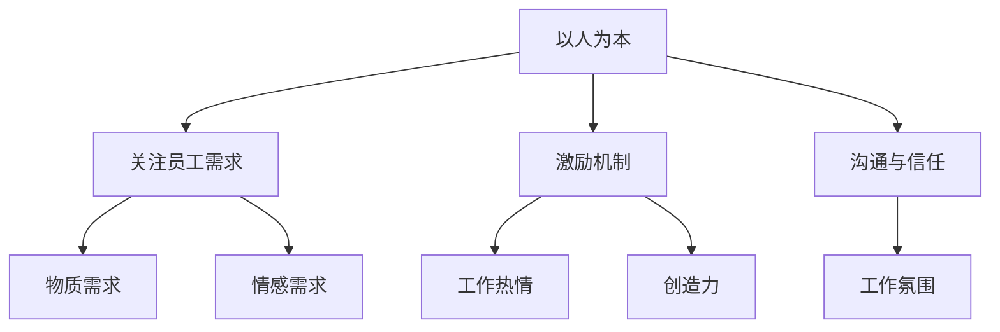

#### 核心算法原理讲解

人性化管理的核心算法原理可以理解为一种“需求-激励-反馈”机制。具体来说，管理者需要识别员工的需求，通过设定合理的激励机制来满足这些需求，然后通过持续的沟通和反馈来调整和优化管理策略。

以下是人化化管理核心算法原理的伪代码：

```python
# 人性化管理核心算法原理
def humane_management(employee需求的集合):
    # 识别员工需求
    需求 = identify_employee_demand(employee需求的集合)
    
    # 设定激励机制
    incentive_plan = set_incentive_plan(需求)
    
    # 激发员工工作热情和创造力
    motivate_employee(incentive_plan)
    
    # 持续沟通和反馈
    communicate_and_feed_back()

    # 调整和优化管理策略
    optimize_management_strategy()
```

#### 数学模型和公式

人性化管理的数学模型可以看作是一个基于满意度、绩效和忠诚度的平衡系统。以下是一个简化的数学模型：

$$
S = f(P, L)
$$

其中，$S$ 表示员工满意度，$P$ 表示绩效，$L$ 表示忠诚度。这个模型表明，员工的满意度是由绩效和忠诚度共同决定的。

为了更具体地分析人性化管理的效果，我们可以引入以下参数：

- $S_0$：基础满意度
- $P_0$：基础绩效
- $L_0$：基础忠诚度
- $\alpha$：绩效对满意度的贡献率
- $\beta$：忠诚度对满意度的贡献率

则满意度 $S$ 可以表示为：

$$
S = S_0 + \alpha \cdot (P - P_0) + \beta \cdot (L - L_0)
$$

这个公式表明，员工的满意度取决于基础满意度、绩效提升和忠诚度提升。

#### 举例说明

假设一个员工在基础满意度 $S_0$ 为 70 分，基础绩效 $P_0$ 为 80 分，基础忠诚度 $L_0$ 为 60 分。如果绩效提升到 90 分，忠诚度提升到 70 分，则员工的满意度计算如下：

$$
S = 70 + 0.5 \cdot (90 - 80) + 0.3 \cdot (70 - 60) = 77
$$

这意味着，通过提升绩效和忠诚度，员工的满意度可以提高 7 分，从而增强其对组织的认同感和工作积极性。

#### 项目实战

在项目实战中，我们可以通过以下步骤来实施人性化管理：

1. **员工需求调研**：通过问卷调查、访谈等方式，了解员工的需求和期望。
2. **绩效评估体系构建**：根据员工的工作表现和贡献，设定合理的绩效评估标准。
3. **激励机制设计**：结合员工的需求和绩效评估结果，设计具有激励作用的薪酬和福利制度。
4. **沟通与反馈**：定期与员工进行沟通，了解他们的工作情况和需求，及时给予反馈和指导。
5. **组织文化建设**：营造积极向上的组织氛围，增强员工的归属感和认同感。

以下是一个简单的项目实战流程图：

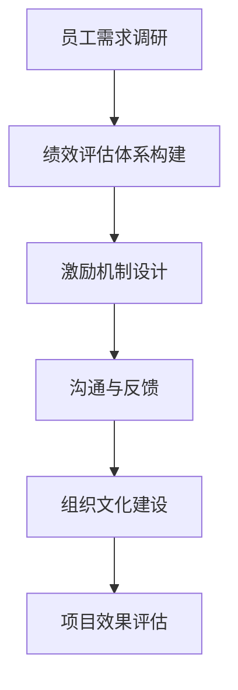

#### 最佳实践 tips、小结、注意事项、拓展阅读

- **最佳实践 tips**：在实施人性化管理时，管理者应注重细节，关注员工的情感需求，及时解决员工的问题和困惑。
- **小结**：人性化管理是一种以人为中心的管理理念，通过满足员工的需求、激发员工的积极性和创造力，实现组织的长期发展。
- **注意事项**：在实施人性化管理时，管理者需避免过度依赖制度和管理手段，应更加注重人文关怀和个性化管理。
- **拓展阅读**：对于有兴趣深入了解人性化管理的读者，可以阅读《人人都是产品经理》、《管理者的实践指南》等书籍。

作者：AI天才研究院/AI Genius Institute & 禅与计算机程序设计艺术 /Zen And The Art of Computer Programming

----------------------------------------------------------------

## 第2章：人性化管理的核心原则

人性化管理的核心原则是确保管理活动能够充分尊重员工的个性、需求和权利，从而提升员工的工作满意度和组织绩效。本章将详细探讨人性化管理的四大核心原则：尊重个体差异、激励与信任、平等与公正以及沟通与合作。通过这些原则，管理者可以创建一个积极、和谐的工作环境，激发员工的潜能，实现个人与组织的共同发展。

### 2.1 尊重个体差异

在人性化管理中，尊重个体差异是一项基本的原则。每个员工都有自己独特的个性、能力和需求，管理者应当尊重这些差异，并根据个体特点进行管理。

#### 核心概念与联系

- **个体差异**：包括个性、能力、需求等方面的差异。
- **尊重**：在管理过程中，对员工的个性、能力和需求给予重视和认可。
- **差异化管理**：根据员工的特点和需求，制定个性化的管理策略。

以下是人性化管理中尊重个体差异的 Mermaid 流程图：

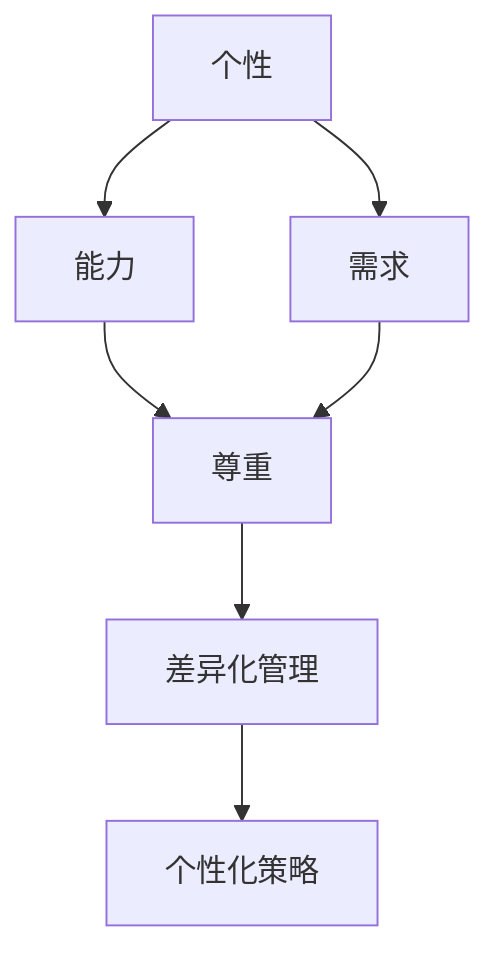

#### 核心算法原理讲解

尊重个体差异的核心算法原理可以理解为一种“适配-优化”机制。具体来说，管理者需要通过以下步骤来尊重个体差异：

1. **数据收集**：收集员工的个性、能力和需求数据。
2. **数据分析**：分析员工的个体差异，识别关键因素。
3. **策略制定**：根据分析结果，制定个性化的管理策略。
4. **执行与调整**：实施个性化策略，并根据反馈进行调整。

以下是一个简化的伪代码：

```python
# 尊重个体差异的核心算法原理
def respect_individual_difference(员工数据集合):
    # 数据收集
    员工特征 = collect_employee_characteristics(员工数据集合)
    
    # 数据分析
    关键因素 = analyze_employee_characteristics(员工特征)
    
    # 策略制定
    策略 = create_individualized_management_strategy(关键因素)
    
    # 执行与调整
    execute_and_adjust_strategy(策略)
```

#### 数学模型和公式

为了量化尊重个体差异的管理效果，我们可以引入以下数学模型：

$$
D = f(I, M)
$$

其中，$D$ 表示差异度，$I$ 表示个体差异，$M$ 表示管理匹配度。这个模型表明，管理匹配度是影响差异度的重要因素。

为了具体分析管理匹配度，我们可以引入以下参数：

- $D_0$：基础差异度
- $M_0$：基础匹配度
- $\alpha$：匹配度对差异度的影响系数

则差异度 $D$ 可以表示为：

$$
D = D_0 + \alpha \cdot (M - M_0)
$$

这个公式表明，通过提高管理匹配度，可以降低员工的差异度，从而提高员工的工作满意度和组织绩效。

#### 举例说明

假设一个团队的基础差异度为 50 分，基础匹配度为 60 分。如果管理者的匹配度提高到了 80 分，则差异度计算如下：

$$
D = 50 + 0.3 \cdot (80 - 60) = 56
$$

这意味着，通过提高管理匹配度，差异度降低了 4 分，从而提升了团队的工作满意度和绩效。

#### 项目实战

在项目实战中，尊重个体差异可以通过以下步骤实现：

1. **员工调研**：通过问卷调查、访谈等方式，了解员工的个性、能力和需求。
2. **数据整理**：对收集到的数据进行整理和分析，识别关键因素。
3. **个性化管理**：根据分析结果，为每位员工制定个性化的管理策略。
4. **反馈与调整**：定期收集员工反馈，对个性化管理策略进行调整。

以下是一个简单的项目实战流程图：

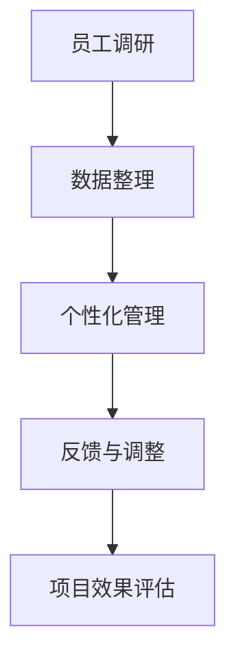

#### 最佳实践 tips、小结、注意事项、拓展阅读

- **最佳实践 tips**：在尊重个体差异时，管理者应避免偏见，确保每位员工都能得到公正的待遇。
- **小结**：尊重个体差异是人性化管理的核心原则之一，通过个性化管理策略，可以提升员工的工作满意度和组织绩效。
- **注意事项**：在个性化管理时，管理者应确保策略的可行性，避免过度个性化导致资源浪费。
- **拓展阅读**：对于有兴趣深入了解个性化管理的读者，可以阅读《个性化管理：让每个员工都发挥最大潜能》等书籍。

### 2.2 激励与信任

激励与信任是人性化管理的另一项核心原则，通过合理的激励和建立信任，可以激发员工的工作热情和创造力，从而提高组织绩效。

#### 核心概念与联系

- **激励**：通过物质和非物质手段，激发员工的积极性和创造力。
- **信任**：管理者对员工能力和诚信的信任，有助于建立良好的工作关系。

以下是人性化管理中激励与信任的 Mermaid 流程图：

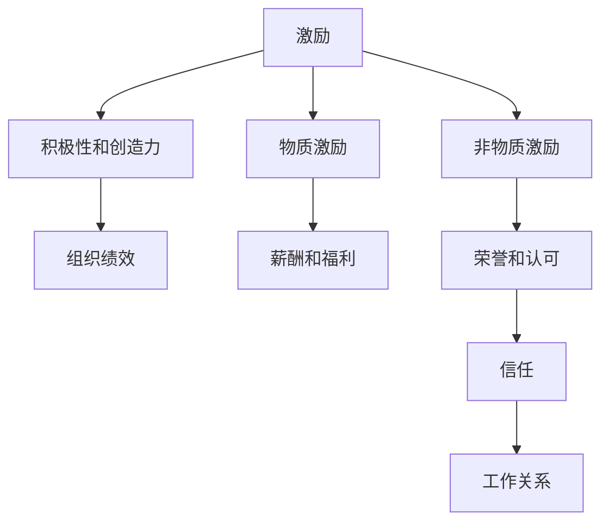

#### 核心算法原理讲解

激励与信任的核心算法原理可以看作是一种“需求-满足-反馈”机制。具体来说，管理者需要通过以下步骤来实施激励与信任：

1. **需求识别**：了解员工的需求和期望。
2. **激励措施设计**：根据需求设计合理的激励措施。
3. **实施激励**：将激励措施落实到实际工作中。
4. **反馈与调整**：根据员工反馈，调整和优化激励措施。

以下是一个简化的伪代码：

```python
# 激励与信任的核心算法原理
def motivation_and_trust(employee需求集合):
    # 需求识别
    需求 = identify_employee_needs(employee需求集合)
    
    # 激励措施设计
    incentive_plan = design_incentive_measures(需求)
    
    # 实施激励
    implement_incentive(incentive_plan)
    
    # 反馈与调整
    feedback_and_adjustment()
```

#### 数学模型和公式

激励与信任的数学模型可以看作是一个基于满意度、绩效和忠诚度的平衡系统。以下是一个简化的数学模型：

$$
S = f(M, L)
$$

其中，$S$ 表示员工满意度，$M$ 表示激励机制的有效性，$L$ 表示信任度。这个模型表明，员工的满意度是由激励机制的有效性和信任度共同决定的。

为了更具体地分析激励与信任的效果，我们可以引入以下参数：

- $S_0$：基础满意度
- $M_0$：基础激励效果
- $L_0$：基础信任度
- $\alpha$：激励效果对满意度的贡献率
- $\beta$：信任度对满意度的贡献率

则满意度 $S$ 可以表示为：

$$
S = S_0 + \alpha \cdot (M - M_0) + \beta \cdot (L - L_0)
$$

这个公式表明，通过提高激励效果和信任度，可以提升员工的满意度，从而增强其对组织的认同感和工作积极性。

#### 举例说明

假设一个员工在基础满意度 $S_0$ 为 70 分，基础激励效果 $M_0$ 为 60 分，基础信任度 $L_0$ 为 50 分。如果激励效果提升到 80 分，信任度提升到 70 分，则员工的满意度计算如下：

$$
S = 70 + 0.4 \cdot (80 - 60) + 0.3 \cdot (70 - 50) = 77
$$

这意味着，通过提升激励效果和信任度，员工的满意度提高了 7 分，从而增强了其对组织的认同感和工作积极性。

#### 项目实战

在项目实战中，激励与信任可以通过以下步骤实现：

1. **员工需求调研**：通过问卷调查、访谈等方式，了解员工的需求和期望。
2. **激励机制设计**：根据员工的需求和组织的战略目标，设计合理的激励机制。
3. **实施激励**：将激励机制落实到实际工作中，确保激励措施的公平性和透明度。
4. **信任建设**：通过开放沟通、授权和信任机制，建立管理者与员工之间的信任关系。
5. **反馈与调整**：定期收集员工反馈，对激励机制和信任建设进行调整。

以下是一个简单的项目实战流程图：

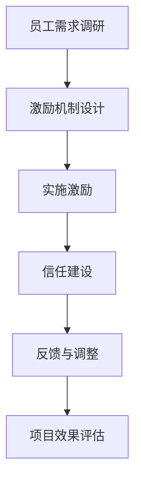

#### 最佳实践 tips、小结、注意事项、拓展阅读

- **最佳实践 tips**：在实施激励与信任时，管理者应关注员工的个性化需求，确保激励措施与员工的期望相匹配。
- **小结**：激励与信任是人性化管理的核心原则之一，通过合理的激励和建立信任，可以提升员工的工作满意度和组织绩效。
- **注意事项**：在实施激励时，管理者应避免过度依赖物质激励，应注重非物质激励的作用。
- **拓展阅读**：对于有兴趣深入了解激励与信任的读者，可以阅读《激励心理学》、《信任的法则》等书籍。

### 2.3 平等与公正

平等与公正是人性化管理的另一项核心原则，它要求在管理过程中确保每位员工都享有平等的机会和待遇，避免歧视和不公平现象的发生。

#### 核心概念与联系

- **平等**：在管理过程中，确保每位员工都享有同等的机会和权利。
- **公正**：在管理决策和执行过程中，坚持公平、透明的原则。

以下是人性化管理中平等与公正的 Mermaid 流程图：

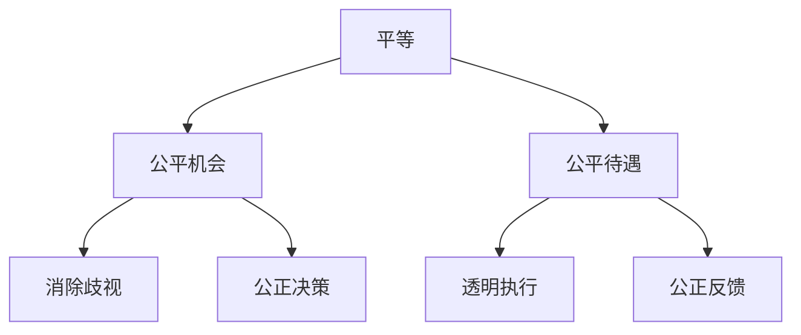

#### 核心算法原理讲解

平等与公正的核心算法原理可以看作是一种“公平-监督”机制。具体来说，管理者需要通过以下步骤来确保平等与公正：

1. **制定公平规则**：建立一套公平的制度和规则，确保每位员工都享有同等的机会和权利。
2. **监督与反馈**：设立监督机制，确保制度得到有效执行，及时发现和纠正不公平现象。
3. **反馈与调整**：根据反馈，对制度和规则进行调整和优化。

以下是一个简化的伪代码：

```python
# 平等与公正的核心算法原理
def equality_and_justice(fair_rules):
    # 制定公平规则
    create_fair_rules()

    # 监督与反馈
    supervise_and_feedback()

    # 反馈与调整
    adjust_rules_based_on_feedback()
```

#### 数学模型和公式

平等与公正的数学模型可以看作是一个基于公平度、满意度和绩效的平衡系统。以下是一个简化的数学模型：

$$
E = f(F, S, P)
$$

其中，$E$ 表示公平度，$F$ 表示公平规则的有效性，$S$ 表示满意度，$P$ 表示绩效。这个模型表明，公平度是影响满意度、绩效的重要因素。

为了更具体地分析公平度的影响，我们可以引入以下参数：

- $E_0$：基础公平度
- $F_0$：基础规则有效性
- $S_0$：基础满意度
- $P_0$：基础绩效
- $\alpha$：规则有效性对公平度的贡献率
- $\beta$：满意度对公平度的贡献率
- $\gamma$：绩效对公平度的贡献率

则公平度 $E$ 可以表示为：

$$
E = E_0 + \alpha \cdot (F - F_0) + \beta \cdot (S - S_0) + \gamma \cdot (P - P_0)
$$

这个公式表明，通过提高规则有效性、满意度和绩效，可以提升公平度，从而增强员工的工作满意度和组织绩效。

#### 举例说明

假设一个组织的公平度基础值为 60 分，公平规则有效性基础值为 70 分，员工满意度基础值为 80 分，绩效基础值为 90 分。如果公平规则有效性提升到 90 分，员工满意度提升到 90 分，绩效提升到 95 分，则公平度计算如下：

$$
E = 60 + 0.3 \cdot (90 - 70) + 0.2 \cdot (90 - 80) + 0.1 \cdot (95 - 90) = 72
$$

这意味着，通过提高规则有效性、满意度和绩效，公平度提升了 12 分，从而增强了员工的工作满意度和组织绩效。

#### 项目实战

在项目实战中，平等与公正是可以通过以下步骤实现的：

1. **制度制定**：制定公平的制度和规则，确保每位员工都享有同等的机会和权利。
2. **监督机制**：设立监督机制，定期检查制度执行情况，确保制度得到有效执行。
3. **反馈与调整**：根据员工的反馈，对制度和规则进行调整和优化。
4. **公平培训**：定期开展公平培训，提高管理者和员工的公平意识和能力。

以下是一个简单的项目实战流程图：

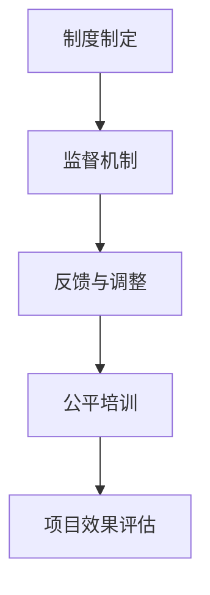

#### 最佳实践 tips、小结、注意事项、拓展阅读

- **最佳实践 tips**：在确保平等与公正时，管理者应关注细节，避免因个人偏见而影响决策和执行。
- **小结**：平等与公正是人性化管理的核心原则之一，通过确保每位员工都享有平等的机会和待遇，可以提升员工的工作满意度和组织绩效。
- **注意事项**：在实施平等与公正时，管理者应避免制度过于僵化，应确保制度的灵活性和适应性。
- **拓展阅读**：对于有兴趣深入了解平等与公正的读者，可以阅读《公平管理》、《制度与人》等书籍。

### 2.4 沟通与合作

沟通与合作是人性化管理的核心原则之一，良好的沟通和合作能够促进员工之间的理解与信任，提高团队的工作效率和凝聚力。

#### 核心概念与联系

- **沟通**：管理者与员工之间、员工与员工之间的信息交流与传递。
- **合作**：员工之间共同完成任务，实现组织目标。

以下是人性化管理中沟通与合作的 Mermaid 流程图：

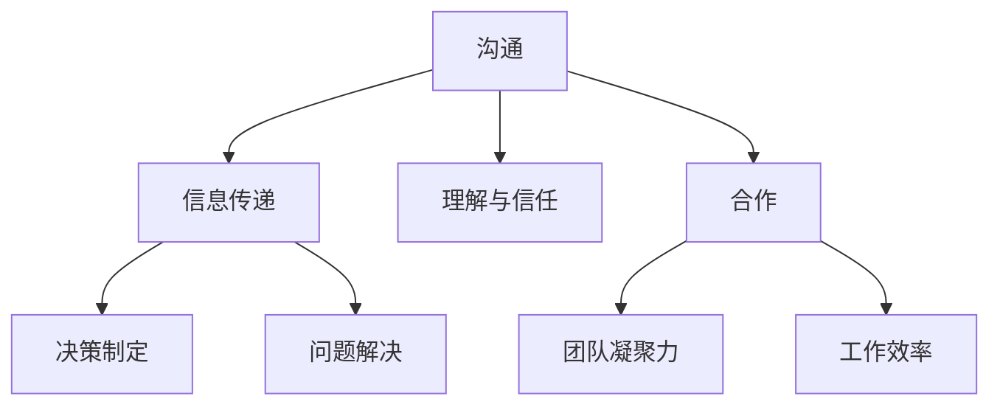

#### 核心算法原理讲解

沟通与合作的核心算法原理可以看作是一种“信息-互动-反馈”机制。具体来说，管理者需要通过以下步骤来促进沟通与合作：

1. **建立沟通渠道**：设立多种沟通渠道，确保信息能够及时、准确地传递。
2. **促进互动**：鼓励员工之间的互动，形成良好的沟通氛围。
3. **反馈与调整**：根据反馈，调整沟通和合作策略，优化管理流程。

以下是一个简化的伪代码：

```python
# 沟通与合作的核心算法原理
def communication_and_cooperation(沟通渠道，员工互动):
    # 建立沟通渠道
    establish_communication_channels()

    # 促进互动
    promote_employee_interaction()

    # 反馈与调整
    feedback_and_adjustment()
```

#### 数学模型和公式

沟通与合作的效果可以通过以下数学模型进行量化：

$$
C = f(I, T, P)
$$

其中，$C$ 表示沟通与合作效果，$I$ 表示信息传递的准确性，$T$ 表示团队互动的积极性，$P$ 表示工作效率。这个模型表明，沟通与合作效果是由信息传递的准确性、团队互动的积极性和工作效率共同决定的。

为了更具体地分析沟通与合作的效果，我们可以引入以下参数：

- $C_0$：基础沟通效果
- $I_0$：基础信息传递准确性
- $T_0$：基础团队互动积极性
- $P_0$：基础工作效率
- $\alpha$：信息传递准确性对沟通效果的影响系数
- $\beta$：团队互动积极性对沟通效果的影响系数
- $\gamma$：工作效率对沟通效果的影响系数

则沟通效果 $C$ 可以表示为：

$$
C = C_0 + \alpha \cdot (I - I_0) + \beta \cdot (T - T_0) + \gamma \cdot (P - P_0)
$$

这个公式表明，通过提高信息传递准确性、团队互动积极性和工作效率，可以提升沟通与合作效果。

#### 举例说明

假设一个团队的基础沟通效果 $C_0$ 为 60 分，基础信息传递准确性 $I_0$ 为 70 分，基础团队互动积极性 $T_0$ 为 80 分，基础工作效率 $P_0$ 为 90 分。如果信息传递准确性提升到 85 分，团队互动积极性提升到 90 分，工作效率提升到 95 分，则沟通效果计算如下：

$$
C = 60 + 0.2 \cdot (85 - 70) + 0.3 \cdot (90 - 80) + 0.4 \cdot (95 - 90) = 72
$$

这意味着，通过提升信息传递准确性、团队互动积极性和工作效率，沟通效果提升了 12 分，从而增强了团队的工作效率和凝聚力。

#### 项目实战

在项目实战中，沟通与合作可以通过以下步骤实现：

1. **沟通渠道建设**：建立多种沟通渠道，如定期会议、在线交流平台等，确保信息能够及时、准确地传递。
2. **互动激励**：鼓励员工之间的互动，通过团队建设活动、知识分享会等形式，提高团队互动积极性。
3. **反馈与调整**：定期收集员工反馈，对沟通和合作策略进行调整和优化，提高工作效率。
4. **绩效评估**：将沟通与合作效果纳入绩效评估体系，激励员工积极参与沟通与合作。

以下是一个简单的项目实战流程图：

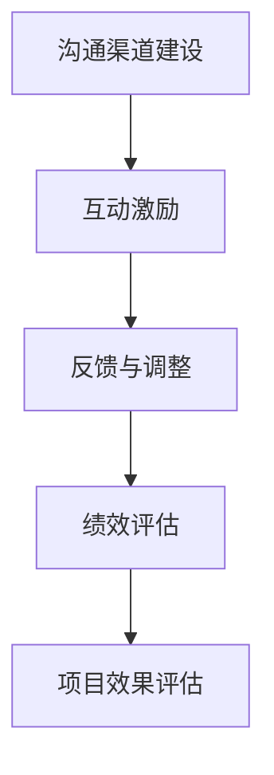

#### 最佳实践 tips、小结、注意事项、拓展阅读

- **最佳实践 tips**：在沟通与合作中，管理者应注重细节，确保信息的准确传递，避免误解和冲突。
- **小结**：沟通与合作是人性化管理的核心原则之一，通过有效的沟通和合作，可以提高团队的工作效率和凝聚力。
- **注意事项**：在沟通与合作中，管理者应避免信息过载，确保沟通内容简洁明了，避免冗长的会议和邮件。
- **拓展阅读**：对于有兴趣深入了解沟通与合作的读者，可以阅读《有效沟通》、《团队协作的艺术》等书籍。

作者：AI天才研究院/AI Genius Institute & 禅与计算机程序设计艺术 /Zen And The Art of Computer Programming

----------------------------------------------------------------

## 第3章：管理者如何理解员工

管理者理解员工是人性化管理的核心之一，只有真正了解员工的需求、动机和心理，才能实施有效的管理策略。本章将探讨管理者如何通过分析员工心理需求、设计激励策略以及提升沟通技巧来理解员工，从而建立良好的管理关系。

### 3.1 员工心理需求分析

员工的心理需求是人性化管理的基石。管理者需要了解员工在不同阶段的心理需求，以便制定相应的管理策略。以下是几个关键阶段的员工心理需求分析：

#### 背景介绍

员工的心理需求随着工作年限、职位晋升和职业发展而变化。不同阶段的员工可能关注的问题和需求不同，管理者需要具备洞察力，及时识别和满足员工的心理需求。

#### 核心概念与联系

- **心理需求**：员工在不同阶段关注的心理需求，如安全感、自我实现、成就感和归属感。
- **需求层次**：马斯洛的需求层次理论，分为生理需求、安全需求、社交需求、尊重需求和自我实现需求。
- **阶段分析**：根据员工的工作年限和职位，分析其在不同阶段的需求变化。

以下是员工心理需求层次的 Mermaid 流程图：

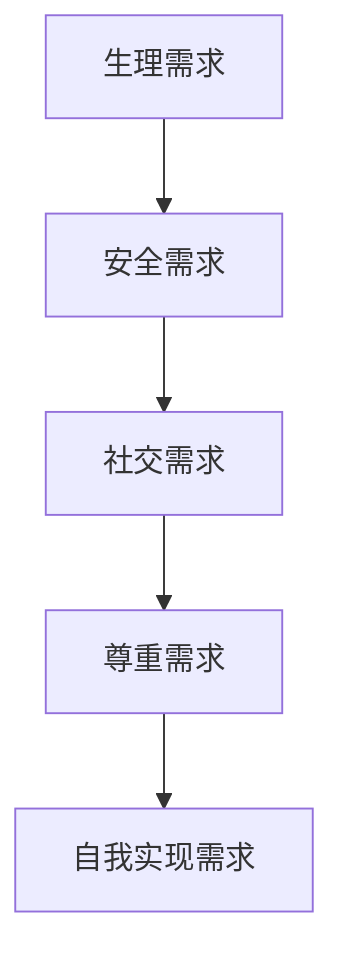

#### 核心算法原理讲解

员工心理需求分析的核心算法原理可以看作是一种“需求识别-匹配-满足”机制。具体来说，管理者需要通过以下步骤来分析员工心理需求：

1. **需求识别**：通过问卷调查、访谈等方式，了解员工在不同阶段的心理需求。
2. **需求匹配**：根据员工的需求，制定相应的管理策略。
3. **需求满足**：实施管理策略，满足员工的心理需求。

以下是一个简化的伪代码：

```python
# 员工心理需求分析的核心算法原理
def analyze_employee_mental_needs(员工数据集合):
    # 需求识别
    需求 = identify_employee_needs(员工数据集合)
    
    # 需求匹配
    matching_strategy = match_needs_to_strategy(需求)
    
    # 需求满足
    implement_matching_strategy(matching_strategy)
```

#### 数学模型和公式

为了量化员工心理需求分析的效果，我们可以引入以下数学模型：

$$
M = f(N, S)
$$

其中，$M$ 表示管理匹配度，$N$ 表示员工需求，$S$ 表示管理策略。这个模型表明，管理匹配度是影响员工满意度和绩效的重要因素。

为了更具体地分析管理匹配度，我们可以引入以下参数：

- $M_0$：基础管理匹配度
- $N_0$：基础员工需求
- $S_0$：基础管理策略
- $\alpha$：需求匹配度对管理匹配度的影响系数
- $\beta$：管理策略对管理匹配度的影响系数

则管理匹配度 $M$ 可以表示为：

$$
M = M_0 + \alpha \cdot (N - N_0) + \beta \cdot (S - S_0)
$$

这个公式表明，通过提高需求匹配度和管理策略的有效性，可以提升管理匹配度，从而增强员工的工作满意度和绩效。

#### 举例说明

假设一个员工在基础管理匹配度 $M_0$ 为 60 分，基础员工需求 $N_0$ 为 70 分，基础管理策略 $S_0$ 为 80 分。如果管理策略提升到了 90 分，员工需求提升到了 85 分，则管理匹配度计算如下：

$$
M = 60 + 0.3 \cdot (90 - 80) + 0.2 \cdot (85 - 70) = 67
$$

这意味着，通过提升管理策略和员工需求，管理匹配度提高了 7 分，从而提升了员工的工作满意度和绩效。

#### 项目实战

在项目实战中，员工心理需求分析可以通过以下步骤实现：

1. **需求调研**：通过问卷调查、访谈等方式，了解员工在不同阶段的心理需求。
2. **需求分类**：根据员工需求，进行分类和分析，识别关键需求。
3. **策略制定**：根据需求分类，制定相应的管理策略。
4. **实施与反馈**：实施管理策略，并收集员工反馈，对策略进行调整。

以下是一个简单的项目实战流程图：

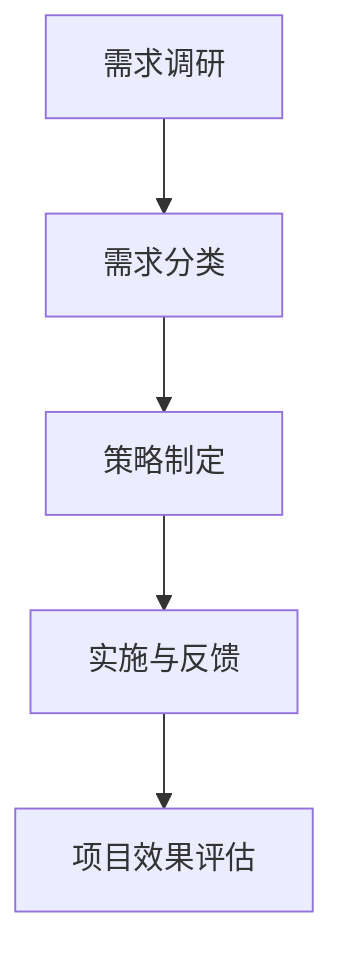

#### 最佳实践 tips、小结、注意事项、拓展阅读

- **最佳实践 tips**：在分析员工心理需求时，管理者应注重细节，避免片面化，确保调研结果的准确性和全面性。
- **小结**：员工心理需求分析是人性化管理的核心，通过识别和满足员工的需求，可以提升员工的工作满意度和绩效。
- **注意事项**：在分析员工心理需求时，管理者应避免将个人偏见带入分析过程，确保调研的客观性和公正性。
- **拓展阅读**：对于有兴趣深入了解员工心理需求的读者，可以阅读《员工心理需求与工作绩效》等书籍。

### 3.2 员工激励策略

激励是管理者理解员工的重要手段，通过合理的激励策略，可以激发员工的工作热情和创造力，提高组织的绩效。以下是几种常见的员工激励策略：

#### 背景介绍

激励策略的选择应根据员工的需求和组织的目标进行定制。传统的激励方式主要包括物质激励和非物质激励，而现代激励策略更加注重个性化激励和长期激励。

#### 核心概念与联系

- **物质激励**：包括薪酬、奖金、福利等。
- **非物质激励**：包括认可、荣誉、培训等。
- **个性化激励**：根据员工的特点和需求，制定个性化的激励措施。
- **长期激励**：通过股权激励、职业发展机会等，激发员工的长期忠诚度。

以下是员工激励策略的 Mermaid 流程图：

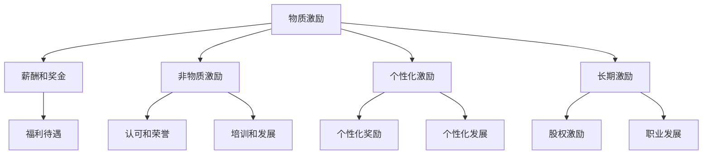

#### 核心算法原理讲解

员工激励策略的核心算法原理可以看作是一种“需求-激励-反馈”机制。具体来说，管理者需要通过以下步骤来实施员工激励：

1. **需求识别**：了解员工的需求和期望。
2. **激励设计**：根据员工的需求，设计合理的激励措施。
3. **激励实施**：将激励措施落实到实际工作中。
4. **反馈与调整**：根据员工反馈，调整和优化激励措施。

以下是一个简化的伪代码：

```python
# 员工激励策略的核心算法原理
def employee_incentive_strategy(employee需求集合):
    # 需求识别
    需求 = identify_employee_needs(employee需求集合)
    
    # 激励设计
    incentive_plan = design_incentive_measures(需求)
    
    # 激励实施
    implement_incentive(incentive_plan)
    
    # 反馈与调整
    feedback_and_adjustment()
```

#### 数学模型和公式

为了量化员工激励策略的效果，我们可以引入以下数学模型：

$$
E = f(I, M)
$$

其中，$E$ 表示员工满意度，$I$ 表示激励措施的有效性，$M$ 表示激励机制的管理匹配度。这个模型表明，员工满意度是由激励措施的有效性和管理匹配度共同决定的。

为了更具体地分析激励策略的效果，我们可以引入以下参数：

- $E_0$：基础员工满意度
- $I_0$：基础激励措施有效性
- $M_0$：基础管理匹配度
- $\alpha$：激励措施有效性对员工满意度的贡献率
- $\beta$：管理匹配度对员工满意度的贡献率

则员工满意度 $E$ 可以表示为：

$$
E = E_0 + \alpha \cdot (I - I_0) + \beta \cdot (M - M_0)
$$

这个公式表明，通过提高激励措施的有效性和管理匹配度，可以提升员工满意度，从而增强其对组织的认同感和工作积极性。

#### 举例说明

假设一个员工在基础员工满意度 $E_0$ 为 70 分，基础激励措施有效性 $I_0$ 为 60 分，基础管理匹配度 $M_0$ 为 50 分。如果激励措施有效性提升到 80 分，管理匹配度提升到 70 分，则员工满意度计算如下：

$$
E = 70 + 0.4 \cdot (80 - 60) + 0.3 \cdot (70 - 50) = 77
$$

这意味着，通过提升激励措施有效性和管理匹配度，员工满意度提高了 7 分，从而增强了其对组织的认同感和工作积极性。

#### 项目实战

在项目实战中，员工激励策略可以通过以下步骤实现：

1. **需求调研**：通过问卷调查、访谈等方式，了解员工的需求和期望。
2. **激励设计**：根据员工的需求，设计合理的激励措施。
3. **激励实施**：将激励措施落实到实际工作中，确保激励措施的公平性和透明度。
4. **反馈与调整**：定期收集员工反馈，对激励措施进行调整和优化。

以下是一个简单的项目实战流程图：

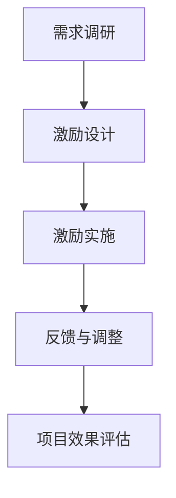

#### 最佳实践 tips、小结、注意事项、拓展阅读

- **最佳实践 tips**：在制定员工激励策略时，管理者应关注员工的个性化需求，确保激励措施与员工的期望相匹配。
- **小结**：员工激励策略是管理者理解员工的重要手段，通过合理的激励措施，可以激发员工的工作热情和创造力，提升组织的绩效。
- **注意事项**：在实施员工激励策略时，管理者应确保激励措施的公平性和透明度，避免引起员工的不满和误解。
- **拓展阅读**：对于有兴趣深入了解员工激励策略的读者，可以阅读《激励心理学》、《员工激励与绩效管理》等书籍。

### 3.3 管理者与员工的沟通技巧

沟通是管理者与员工之间建立信任和合作的基础。有效的沟通技巧可以帮助管理者更好地理解员工，解决冲突，提高工作效率。以下是几种关键的管理者与员工的沟通技巧：

#### 背景介绍

沟通技巧对于管理者来说至关重要。良好的沟通能够提高员工的满意度、工作积极性和团队凝聚力。管理者需要掌握倾听、反馈、表达和解决问题的技巧，以建立有效的沟通渠道。

#### 核心概念与联系

- **倾听**：认真聆听员工的想法和意见，理解员工的需求和感受。
- **反馈**：及时给予员工反馈，帮助员工认识到自己的优点和改进的方向。
- **表达**：清晰、准确地表达自己的想法和意见，确保信息的传递无误。
- **解决问题**：面对问题和冲突时，能够积极寻找解决方案，促进问题的解决。

以下是管理者与员工沟通技巧的 Mermaid 流程图：

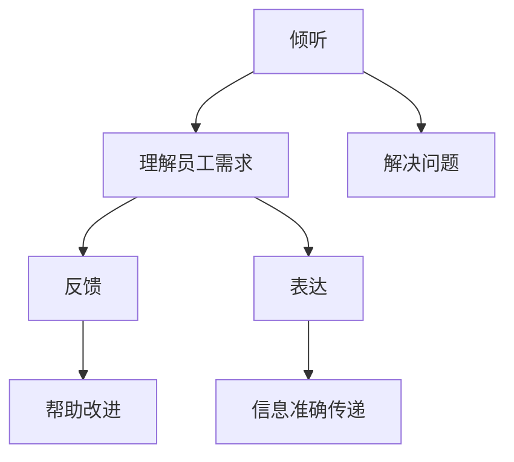

#### 核心算法原理讲解

管理者与员工沟通技巧的核心算法原理可以看作是一种“信息-理解-反馈”机制。具体来说，管理者需要通过以下步骤来提升沟通技巧：

1. **信息收集**：通过倾听和表达，收集员工的信息和反馈。
2. **信息理解**：通过分析和归纳，理解员工的需求和问题。
3. **信息反馈**：通过及时的反馈，帮助员工改进和提高。

以下是一个简化的伪代码：

```python
# 管理者与员工沟通技巧的核心算法原理
def communication_skills(employee信息，管理者反馈):
    # 信息收集
    收集信息 = collect_employee_information()

    # 信息理解
    理解需求 = understand_employee_needs(收集信息)

    # 信息反馈
    给予反馈 = provide_feedback(理解需求)
```

#### 数学模型和公式

为了量化管理者与员工沟通技巧的效果，我们可以引入以下数学模型：

$$
C = f(L, P, R)
$$

其中，$C$ 表示沟通效果，$L$ 表示倾听和理解能力，$P$ 表示表达和反馈能力，$R$ 表示解决问题的能力。这个模型表明，沟通效果是由倾听、表达、反馈和解决问题的能力共同决定的。

为了更具体地分析沟通效果，我们可以引入以下参数：

- $C_0$：基础沟通效果
- $L_0$：基础倾听和理解能力
- $P_0$：基础表达和反馈能力
- $R_0$：基础解决问题的能力
- $\alpha$：倾听和理解能力对沟通效果的影响系数
- $\beta$：表达和反馈能力对沟通效果的影响系数
- $\gamma$：解决问题的能力对沟通效果的影响系数

则沟通效果 $C$ 可以表示为：

$$
C = C_0 + \alpha \cdot (L - L_0) + \beta \cdot (P - P_0) + \gamma \cdot (R - R_0)
$$

这个公式表明，通过提高倾听、表达、反馈和解决问题的能力，可以提升沟通效果，从而增强员工的工作满意度和团队凝聚力。

#### 举例说明

假设一个管理者的基础沟通效果 $C_0$ 为 60 分，基础倾听和理解能力 $L_0$ 为 70 分，基础表达和反馈能力 $P_0$ 为 80 分，基础解决问题的能力 $R_0$ 为 90 分。如果倾听和理解能力提升到了 85 分，表达和反馈能力提升到了 90 分，解决问题的能力提升到了 95 分，则沟通效果计算如下：

$$
C = 60 + 0.2 \cdot (85 - 70) + 0.3 \cdot (90 - 80) + 0.4 \cdot (95 - 90) = 71
$$

这意味着，通过提升倾听、表达、反馈和解决问题的能力，沟通效果提升了 11 分，从而增强了员工的工作满意度和团队凝聚力。

#### 项目实战

在项目实战中，管理者与员工的沟通技巧可以通过以下步骤实现：

1. **倾听与表达**：通过定期会议、一对一沟通等形式，提高倾听和理解能力，确保信息准确传递。
2. **反馈与改进**：及时给予员工反馈，帮助员工认识到自己的优点和改进的方向。
3. **问题解决**：面对问题和冲突时，积极寻找解决方案，促进问题的解决。
4. **培训与学习**：定期开展沟通技巧培训，提高管理者的沟通能力和解决问题的能力。

以下是一个简单的项目实战流程图：

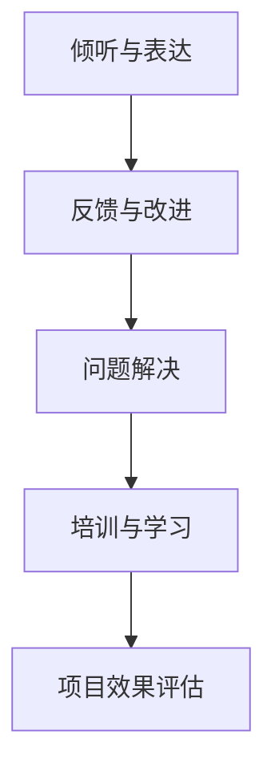

#### 最佳实践 tips、小结、注意事项、拓展阅读

- **最佳实践 tips**：在沟通时，管理者应注重倾听，避免打断员工的发言，确保员工感受到被尊重。
- **小结**：管理者与员工的沟通技巧是人性化管理的重要组成部分，通过有效的沟通，可以提升员工的工作满意度和团队凝聚力。
- **注意事项**：在沟通时，管理者应避免使用专业术语和过于复杂的语言，确保信息的传递清晰易懂。
- **拓展阅读**：对于有兴趣深入了解沟通技巧的读者，可以阅读《沟通的艺术》、《管理者沟通技巧》等书籍。

作者：AI天才研究院/AI Genius Institute & 禅与计算机程序设计艺术 /Zen And The Art of Computer Programming

----------------------------------------------------------------

## 第4章：人性化管理的团队建设

人性化管理的团队建设是提升组织绩效和员工满意度的关键环节。通过团队成员的角色定位、协作与冲突解决以及团队文化的培养，管理者可以打造一个高效、和谐的团队，从而实现组织的战略目标。

### 4.1 团队成员的角色定位

团队成员的角色定位是团队建设的基础。明确每个成员的角色和职责，有助于提升团队的工作效率和协作能力。以下是团队成员角色定位的关键要素：

#### 背景介绍

在团队中，每个成员都承担着不同的角色和职责。明确角色定位有助于团队成员充分发挥各自的特长，形成协同效应，实现团队目标。

#### 核心概念与联系

- **角色定位**：明确每个成员在团队中的角色和职责。
- **职责分配**：根据成员的专长和团队需求，合理分配职责。
- **角色调整**：根据团队目标和任务变化，适时调整成员的角色定位。

以下是团队成员角色定位的 Mermaid 流程图：

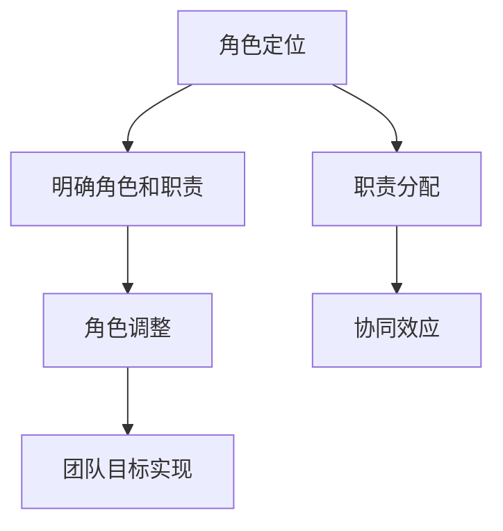

#### 核心算法原理讲解

团队成员角色定位的核心算法原理可以看作是一种“职责-协同-目标”机制。具体来说，管理者需要通过以下步骤来实现角色定位：

1. **职责识别**：根据团队目标和任务，识别每个成员的职责。
2. **角色分配**：根据成员的专长和团队需求，将职责分配给相应的角色。
3. **角色调整**：根据团队目标和任务变化，适时调整成员的角色定位。

以下是一个简化的伪代码：

```python
# 团队成员角色定位的核心算法原理
def team_member_role_placement(team_goal, member_skills):
    # 职责识别
    responsibilities = identify_responsibilities(team_goal)

    # 角色分配
    role_assignment = assign_roles_to_members(responsibilities, member_skills)

    # 角色调整
    adjust_roles_if_needed()
```

#### 数学模型和公式

为了量化团队成员角色定位的效果，我们可以引入以下数学模型：

$$
R = f(G, S)
$$

其中，$R$ 表示角色定位效果，$G$ 表示团队目标，$S$ 表示成员技能。这个模型表明，角色定位效果是团队目标和成员技能共同决定的。

为了更具体地分析角色定位效果，我们可以引入以下参数：

- $R_0$：基础角色定位效果
- $G_0$：基础团队目标
- $S_0$：基础成员技能
- $\alpha$：团队目标对角色定位效果的影响系数
- $\beta$：成员技能对角色定位效果的影响系数

则角色定位效果 $R$ 可以表示为：

$$
R = R_0 + \alpha \cdot (G - G_0) + \beta \cdot (S - S_0)
$$

这个公式表明，通过提高团队目标和成员技能，可以提升角色定位效果，从而增强团队的工作效率和协作能力。

#### 举例说明

假设一个团队的基础角色定位效果 $R_0$ 为 60 分，基础团队目标 $G_0$ 为 70 分，基础成员技能 $S_0$ 为 80 分。如果团队目标提升到了 90 分，成员技能提升到了 90 分，则角色定位效果计算如下：

$$
R = 60 + 0.2 \cdot (90 - 70) + 0.3 \cdot (90 - 80) = 67
$$

这意味着，通过提升团队目标和成员技能，角色定位效果提高了 7 分，从而增强了团队的工作效率和协作能力。

#### 项目实战

在项目实战中，团队成员角色定位可以通过以下步骤实现：

1. **团队目标设定**：明确团队的目标和任务，为角色定位提供依据。
2. **成员技能评估**：评估每个成员的技能和专长，为角色分配提供参考。
3. **角色分配**：根据团队目标和成员技能，将职责分配给相应的角色。
4. **角色调整**：定期检查角色定位效果，根据团队目标和任务变化，适时调整成员的角色定位。

以下是一个简单的项目实战流程图：

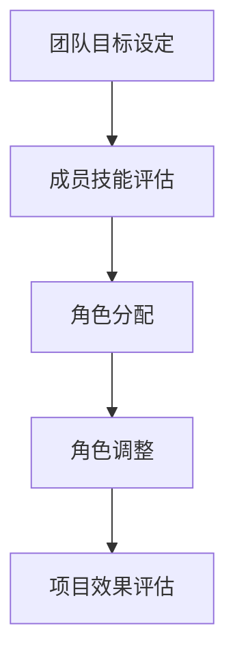

#### 最佳实践 tips、小结、注意事项、拓展阅读

- **最佳实践 tips**：在角色定位过程中，管理者应注重团队成员的反馈和沟通，确保角色分配合理，避免因角色重叠或缺失导致工作效率下降。
- **小结**：团队成员的角色定位是团队建设的重要环节，通过明确角色和职责，可以提高团队的工作效率和协作能力。
- **注意事项**：在角色定位时，管理者应避免过于僵化，应允许团队成员在一定范围内调整和发挥自己的潜力。
- **拓展阅读**：对于有兴趣深入了解团队成员角色定位的读者，可以阅读《团队角色定位与协作》、《团队管理实战》等书籍。

### 4.2 团队协作与冲突解决

团队协作与冲突解决是人性化管理的核心要素。高效的团队协作可以提升团队的工作效率和绩效，而有效的冲突解决可以维护团队的和谐稳定。以下是团队协作与冲突解决的关键要点：

#### 背景介绍

在团队工作中，协作与冲突是不可避免的。有效的团队协作可以充分发挥团队成员的优势，提高团队的整体绩效。而冲突解决则有助于缓解团队内部紧张情绪，维护团队和谐。

#### 核心概念与联系

- **团队协作**：团队成员共同完成任务的合力过程。
- **冲突解决**：处理团队内部矛盾和分歧的方法。
- **协作机制**：建立有效的沟通、协作和反馈机制，促进团队成员之间的协作。
- **冲突类型**：了解冲突的来源和类型，有助于制定针对性的解决策略。

以下是团队协作与冲突解决的 Mermaid 流程图：

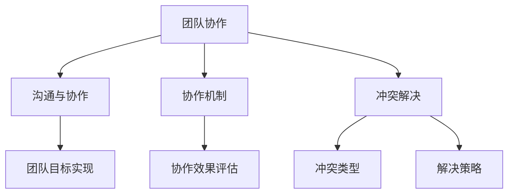

#### 核心算法原理讲解

团队协作与冲突解决的核心算法原理可以看作是一种“协作-冲突-反馈”机制。具体来说，管理者需要通过以下步骤来促进团队协作与冲突解决：

1. **建立协作机制**：制定沟通和协作的规则和流程，确保团队成员能够有效沟通和协作。
2. **识别冲突**：通过观察和沟通，识别团队内部潜在的冲突。
3. **解决冲突**：根据冲突的类型和原因，采取针对性的解决策略。
4. **反馈与改进**：收集团队成员的反馈，对协作机制和冲突解决策略进行调整和优化。

以下是一个简化的伪代码：

```python
# 团队协作与冲突解决的核心算法原理
def team_collaboration_and_conflict_resolution(collaboration_mechanism, conflict_detection, resolution_strategy):
    # 建立协作机制
    establish_collaboration_mechanism()

    # 识别冲突
    detect_conflicts()

    # 解决冲突
    apply_resolution_strategy()

    # 反馈与改进
    gather_feedback_and_improve()
```

#### 数学模型和公式

为了量化团队协作与冲突解决的效果，我们可以引入以下数学模型：

$$
C = f(CM, CD, RS)
$$

其中，$C$ 表示团队协作效果，$CM$ 表示协作机制的有效性，$CD$ 表示冲突检测的有效性，$RS$ 表示冲突解决策略的有效性。这个模型表明，团队协作效果是协作机制、冲突检测和冲突解决策略共同决定的。

为了更具体地分析协作与冲突解决效果，我们可以引入以下参数：

- $C_0$：基础协作效果
- $CM_0$：基础协作机制有效性
- $CD_0$：基础冲突检测有效性
- $RS_0$：基础冲突解决策略有效性
- $\alpha$：协作机制有效性对协作效果的影响系数
- $\beta$：冲突检测有效性对协作效果的影响系数
- $\gamma$：冲突解决策略有效性对协作效果的影响系数

则协作效果 $C$ 可以表示为：

$$
C = C_0 + \alpha \cdot (CM - CM_0) + \beta \cdot (CD - CD_0) + \gamma \cdot (RS - RS_0)
$$

这个公式表明，通过提高协作机制、冲突检测和冲突解决策略的有效性，可以提升团队协作效果，从而增强团队的工作效率和凝聚力。

#### 举例说明

假设一个团队的基础协作效果 $C_0$ 为 60 分，基础协作机制有效性 $CM_0$ 为 70 分，基础冲突检测有效性 $CD_0$ 为 80 分，基础冲突解决策略有效性 $RS_0$ 为 90 分。如果协作机制有效性提升到了 90 分，冲突检测有效性提升到了 85 分，冲突解决策略有效性提升到了 95 分，则协作效果计算如下：

$$
C = 60 + 0.3 \cdot (90 - 70) + 0.2 \cdot (85 - 80) + 0.1 \cdot (95 - 90) = 68
$$

这意味着，通过提升协作机制、冲突检测和冲突解决策略的有效性，协作效果提高了 8 分，从而增强了团队的工作效率和凝聚力。

#### 项目实战

在项目实战中，团队协作与冲突解决可以通过以下步骤实现：

1. **建立协作机制**：制定沟通和协作的规则和流程，确保团队成员能够有效沟通和协作。
2. **识别冲突**：通过观察和沟通，识别团队内部潜在的冲突。
3. **解决冲突**：根据冲突的类型和原因，采取针对性的解决策略。
4. **反馈与改进**：收集团队成员的反馈，对协作机制和冲突解决策略进行调整和优化。

以下是一个简单的项目实战流程图：

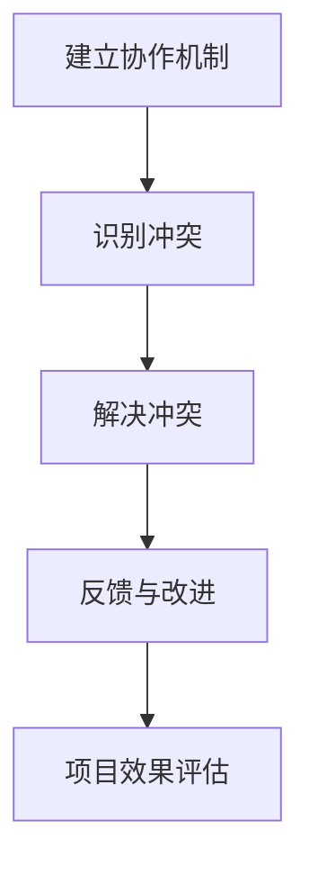

#### 最佳实践 tips、小结、注意事项、拓展阅读

- **最佳实践 tips**：在团队协作与冲突解决过程中，管理者应注重沟通和反馈，确保团队成员能够充分表达自己的观点，避免信息不对称和误解。
- **小结**：团队协作与冲突解决是人性化管理的核心要素，通过建立有效的协作机制和解决冲突策略，可以提高团队的工作效率和凝聚力。
- **注意事项**：在解决冲突时，管理者应避免采取高压政策，应采取温和、理性的方式，促进团队成员的理解和合作。
- **拓展阅读**：对于有兴趣深入了解团队协作与冲突解决的读者，可以阅读《团队协作与沟通技巧》、《团队冲突管理》等书籍。

### 4.3 团队文化的培养

团队文化是团队建设中不可或缺的一部分，它反映了团队的核心价值观、行为规范和工作氛围。一个健康的团队文化可以增强团队成员的归属感和认同感，提高团队的整体绩效。以下是团队文化培养的关键要素：

#### 背景介绍

团队文化是一个团队的精神内核，它决定了团队成员的行为和团队的发展方向。培养积极的团队文化有助于提升团队凝聚力，激发员工的创造力和创新精神。

#### 核心概念与联系

- **团队文化**：团队共同遵循的价值观、信念和行为规范。
- **文化氛围**：团队内部的工作氛围，包括信任、尊重、合作和创新等。
- **文化传承**：通过培训和传承，将团队文化传递给新成员，确保团队文化的持续发展。

以下是团队文化培养的 Mermaid 流程图：

```mermaid
graph TD
    A[团队文化] --> B[价值观]
    A --> C[行为规范]
    A --> D[文化氛围]
    B --> E[信任]
    B --> F[尊重]
    B --> G[合作]
    B --> H[创新]
    D --> I[归属感]
    D --> J[认同感]
```

#### 核心算法原理讲解

团队文化培养的核心算法原理可以看作是一种“文化传承-氛围营造-行为引导”机制。具体来说，管理者需要通过以下步骤来培养团队文化：

1. **文化传承**：通过培训和传承，将团队文化传递给新成员。
2. **氛围营造**：营造积极向上的文化氛围，增强团队成员的归属感和认同感。
3. **行为引导**：通过激励和惩罚等手段，引导团队成员遵循团队文化。

以下是一个简化的伪代码：

```python
# 团队文化培养的核心算法原理
def cultivate_team_culture(culture_transmission, atmosphere_molding, behavior_guidance):
    # 文化传承
    transmit_culture()

    # 氛围营造
    create_atmosphere()

    # 行为引导
    guide_behavior()
```

#### 数学模型和公式

为了量化团队文化培养的效果，我们可以引入以下数学模型：

$$
C = f(T, A, B)
$$

其中，$C$ 表示团队文化水平，$T$ 表示文化传承的有效性，$A$ 表示氛围营造的有效性，$B$ 表示行为引导的有效性。这个模型表明，团队文化水平是文化传承、氛围营造和行为引导共同决定的。

为了更具体地分析团队文化培养效果，我们可以引入以下参数：

- $C_0$：基础团队文化水平
- $T_0$：基础文化传承有效性
- $A_0$：基础氛围营造有效性
- $B_0$：基础行为引导有效性
- $\alpha$：文化传承有效性对团队文化水平的影响系数
- $\beta$：氛围营造有效性对团队文化水平的影响系数
- $\gamma$：行为引导有效性对团队文化水平的影响系数

则团队文化水平 $C$ 可以表示为：

$$
C = C_0 + \alpha \cdot (T - T_0) + \beta \cdot (A - A_0) + \gamma \cdot (B - B_0)
$$

这个公式表明，通过提高文化传承、氛围营造和行为引导的有效性，可以提升团队文化水平，从而增强团队的凝聚力和整体绩效。

#### 举例说明

假设一个团队的基础团队文化水平 $C_0$ 为 60 分，基础文化传承有效性 $T_0$ 为 70 分，基础氛围营造有效性 $A_0$ 为 80 分，基础行为引导有效性 $B_0$ 为 90 分。如果文化传承有效性提升到了 90 分，氛围营造有效性提升到了 85 分，行为引导有效性提升到了 95 分，则团队文化水平计算如下：

$$
C = 60 + 0.2 \cdot (90 - 70) + 0.3 \cdot (85 - 80) + 0.4 \cdot (95 - 90) = 68
$$

这意味着，通过提升文化传承、氛围营造和行为引导的有效性，团队文化水平提高了 8 分，从而增强了团队的凝聚力和整体绩效。

#### 项目实战

在项目实战中，团队文化培养可以通过以下步骤实现：

1. **文化传承**：通过内部培训、团队活动等方式，将团队文化传递给新成员。
2. **氛围营造**：通过激励措施、团队建设活动等方式，营造积极向上的文化氛围。
3. **行为引导**：通过奖励和惩罚等手段，引导团队成员遵循团队文化。

以下是一个简单的项目实战流程图：

```mermaid
graph TD
    A[文化传承] --> B[氛围营造]
    B --> C[行为引导]
    C --> D[项目效果评估]
```

#### 最佳实践 tips、小结、注意事项、拓展阅读

- **最佳实践 tips**：在培养团队文化时，管理者应注重员工的参与和反馈，确保团队文化能够真正反映团队成员的价值观和期望。
- **小结**：团队文化的培养是团队建设的重要环节，通过传承、营造和引导，可以增强团队的凝聚力和整体绩效。
- **注意事项**：在培养团队文化时，管理者应避免一味追求形式，应确保文化能够真正融入到团队日常工作和行为中。
- **拓展阅读**：对于有兴趣深入了解团队文化培养的读者，可以阅读《团队文化建设与实践》、《团队文化影响力》等书籍。

作者：AI天才研究院/AI Genius Institute & 禅与计算机程序设计艺术 /Zen And The Art of Computer Programming

----------------------------------------------------------------

## 第5章：人性化管理的绩效管理

人性化管理的绩效管理旨在通过科学的评估体系和激励措施，激发员工的工作热情和创造力，从而提高组织的整体绩效。本章将探讨如何构建人性化管理的绩效评估体系，实施有效的绩效反馈与改进，以及设计合理的绩效激励机制。

### 5.1 绩效评估体系的构建

绩效评估体系是人性化管理的核心组成部分，它为员工的绩效提供了客观、公正的衡量标准。构建一个有效的绩效评估体系需要考虑以下几个方面：

#### 背景介绍

绩效评估体系是管理者对员工工作表现进行评估和反馈的重要工具。一个科学的绩效评估体系不仅能帮助管理者了解员工的工作状况，还能为员工的职业发展和晋升提供依据。

#### 核心概念与联系

- **绩效评估**：对员工工作绩效进行评估和反馈。
- **评估标准**：明确的绩效指标和评估标准。
- **评估方法**：常用的评估方法包括自我评估、上级评估、360度评估等。
- **评估周期**：定期进行绩效评估，确保评估结果的准确性和及时性。

以下是绩效评估体系的 Mermaid 流程图：

```mermaid
graph TD
    A[绩效评估] --> B[评估标准]
    A --> C[评估方法]
    A --> D[评估周期]
    B --> E[绩效指标]
    B --> F[评估标准细则]
    C --> G[自我评估]
    C --> H[上级评估]
    C --> I[360度评估]
```

#### 核心算法原理讲解

绩效评估体系的核心算法原理可以看作是一种“指标-评估-反馈”机制。具体来说，管理者需要通过以下步骤来构建绩效评估体系：

1. **指标设定**：根据组织目标和岗位要求，设定明确的绩效指标。
2. **标准制定**：制定详细的评估标准和细则，确保评估的公正性和客观性。
3. **评估实施**：采用合适的评估方法，进行绩效评估。
4. **反馈与改进**：根据评估结果，给予员工反馈，并制定改进计划。

以下是一个简化的伪代码：

```python
# 绩效评估体系的核心算法原理
def performance_evaluation_system(target_goals, job_requirements):
    # 指标设定
    performance_indicators = set_performance_indicators(target_goals, job_requirements)
    
    # 标准制定
    evaluation_standards = create_evaluation_standards(performance_indicators)
    
    # 评估实施
    perform_evaluation()

    # 反馈与改进
    provide_feedback_and_improve()
```

#### 数学模型和公式

为了量化绩效评估体系的效果，我们可以引入以下数学模型：

$$
P = f(I, S, E)
$$

其中，$P$ 表示绩效评估效果，$I$ 表示绩效指标的科学性，$S$ 表示评估标准的公正性，$E$ 表示评估周期的合理性。这个模型表明，绩效评估效果是绩效指标、评估标准和评估周期共同决定的。

为了更具体地分析绩效评估体系的效果，我们可以引入以下参数：

- $P_0$：基础绩效评估效果
- $I_0$：基础绩效指标科学性
- $S_0$：基础评估标准公正性
- $E_0$：基础评估周期合理性
- $\alpha$：绩效指标科学性对绩效评估效果的影响系数
- $\beta$：评估标准公正性对绩效评估效果的影响系数
- $\gamma$：评估周期合理性对绩效评估效果的影响系数

则绩效评估效果 $P$ 可以表示为：

$$
P = P_0 + \alpha \cdot (I - I_0) + \beta \cdot (S - S_0) + \gamma \cdot (E - E_0)
$$

这个公式表明，通过提高绩效指标的科学性、评估标准的公正性和评估周期的合理性，可以提升绩效评估效果，从而增强员工的工作积极性和组织绩效。

#### 举例说明

假设一个组织的绩效评估效果 $P_0$ 为 60 分，基础绩效指标科学性 $I_0$ 为 70 分，基础评估标准公正性 $S_0$ 为 80 分，基础评估周期合理性 $E_0$ 为 90 分。如果绩效指标科学性提升到了 85 分，评估标准公正性提升到了 90 分，评估周期合理性提升到了 95 分，则绩效评估效果计算如下：

$$
P = 60 + 0.2 \cdot (85 - 70) + 0.3 \cdot (90 - 80) + 0.4 \cdot (95 - 90) = 69
$$

这意味着，通过提升绩效指标的科学性、评估标准的公正性和评估周期的合理性，绩效评估效果提高了 9 分，从而增强了员工的工作积极性和组织绩效。

#### 项目实战

在项目实战中，绩效评估体系的构建可以通过以下步骤实现：

1. **目标设定**：明确组织的战略目标和各部门的具体目标。
2. **指标设定**：根据目标，设定具体的绩效指标，确保指标的科学性和可操作性。
3. **标准制定**：制定详细的评估标准和细则，确保评估的公正性和客观性。
4. **评估实施**：采用合适的评估方法，定期进行绩效评估。
5. **反馈与改进**：根据评估结果，给予员工反馈，并制定改进计划。

以下是一个简单的项目实战流程图：

```mermaid
graph TD
    A[目标设定] --> B[指标设定]
    B --> C[标准制定]
    C --> D[评估实施]
    D --> E[反馈与改进]
    E --> F[项目效果评估]
```

#### 最佳实践 tips、小结、注意事项、拓展阅读

- **最佳实践 tips**：在构建绩效评估体系时，管理者应关注员工的反馈和意见，确保绩效指标和评估标准的科学性和可操作性。
- **小结**：绩效评估体系是人性化管理的重要组成部分，通过科学的评估方法和合理的评估周期，可以提高员工的工作积极性和组织绩效。
- **注意事项**：在实施绩效评估时，管理者应避免单一指标和单一评估方法，应综合考虑多种因素，确保评估结果的全面性和准确性。
- **拓展阅读**：对于有兴趣深入了解绩效评估体系的读者，可以阅读《绩效管理实务》、《绩效评估与反馈》等书籍。

### 5.2 绩效反馈与改进

绩效反馈与改进是绩效管理的重要环节，通过及时、准确的反馈，可以帮助员工了解自己的工作表现，识别需要改进的方面，从而提高工作效率和绩效。以下是绩效反馈与改进的关键要点：

#### 背景介绍

绩效反馈与改进旨在帮助员工认识到自己的优点和不足，通过持续的改进，实现个人和组织的共同发展。有效的反馈机制可以激发员工的工作热情和创造力，提高组织的整体绩效。

#### 核心概念与联系

- **绩效反馈**：对员工工作绩效进行评价和反馈。
- **改进计划**：根据绩效反馈，制定改进计划和目标。
- **持续改进**：通过持续的努力和改进，不断提升工作绩效。
- **反馈渠道**：建立多种反馈渠道，确保员工能够及时、准确地获得反馈。

以下是绩效反馈与改进的 Mermaid 流程图：

```mermaid
graph TD
    A[绩效反馈] --> B[评估结果]
    A --> C[改进计划]
    B --> D[持续改进]
    B --> E[反馈渠道]
    C --> F[目标设定]
    C --> G[行动计划]
```

#### 核心算法原理讲解

绩效反馈与改进的核心算法原理可以看作是一种“反馈-目标-行动”机制。具体来说，管理者需要通过以下步骤来实施绩效反馈与改进：

1. **反馈收集**：通过定期评估，收集员工的绩效数据。
2. **结果分析**：对绩效数据进行详细分析，识别员工的优点和不足。
3. **反馈沟通**：与员工进行沟通，反馈评估结果，讨论改进计划。
4. **目标设定**：根据反馈和评估结果，设定改进目标和行动计划。
5. **持续跟踪**：对改进计划的执行情况进行持续跟踪，确保目标的实现。

以下是一个简化的伪代码：

```python
# 绩效反馈与改进的核心算法原理
def performance_feedback_and_improvement(feedback_collection, result_analysis, feedback_communication, goal_setting, action_tracking):
    # 反馈收集
    collect_feedback()

    # 结果分析
    analyze_results()

    # 反馈沟通
    communicate_feedback()

    # 目标设定
    set_goals()

    # 持续跟踪
    track_action_progress()
```

#### 数学模型和公式

为了量化绩效反馈与改进的效果，我们可以引入以下数学模型：

$$
I = f(F, A, P)
$$

其中，$I$ 表示改进效果，$F$ 表示反馈的及时性和准确性，$A$ 表示改进计划的实施情况，$P$ 表示绩效目标的达成度。这个模型表明，改进效果是反馈、改进计划和绩效目标共同决定的。

为了更具体地分析改进效果，我们可以引入以下参数：

- $I_0$：基础改进效果
- $F_0$：基础反馈及时性和准确性
- $A_0$：基础改进计划实施情况
- $P_0$：基础绩效目标达成度
- $\alpha$：反馈及时性和准确性对改进效果的影响系数
- $\beta$：改进计划实施情况对改进效果的影响系数
- $\gamma$：绩效目标达成度对改进效果的影响系数

则改进效果 $I$ 可以表示为：

$$
I = I_0 + \alpha \cdot (F - F_0) + \beta \cdot (A - A_0) + \gamma \cdot (P - P_0)
$$

这个公式表明，通过提高反馈的及时性和准确性、改进计划的实施情况和绩效目标的达成度，可以提升改进效果，从而增强员工的工作积极性和组织绩效。

#### 举例说明

假设一个员工的改进效果 $I_0$ 为 60 分，基础反馈及时性和准确性 $F_0$ 为 70 分，基础改进计划实施情况 $A_0$ 为 80 分，基础绩效目标达成度 $P_0$ 为 90 分。如果反馈及时性和准确性提升到了 85 分，改进计划实施情况提升到了 90 分，绩效目标达成度提升到了 95 分，则改进效果计算如下：

$$
I = 60 + 0.2 \cdot (85 - 70) + 0.3 \cdot (90 - 80) + 0.4 \cdot (95 - 90) = 68
$$

这意味着，通过提高反馈的及时性和准确性、改进计划的实施情况和绩效目标的达成度，改进效果提高了 8 分，从而增强了员工的工作积极性和组织绩效。

#### 项目实战

在项目实战中，绩效反馈与改进可以通过以下步骤实现：

1. **绩效评估**：定期进行绩效评估，收集员工的绩效数据。
2. **反馈沟通**：与员工进行沟通，反馈评估结果，讨论改进计划。
3. **目标设定**：根据反馈和评估结果，设定改进目标和行动计划。
4. **持续跟踪**：对改进计划的执行情况进行持续跟踪，确保目标的实现。
5. **效果评估**：定期评估改进效果，对改进计划进行调整和优化。

以下是一个简单的项目实战流程图：

```mermaid
graph TD
    A[绩效评估] --> B[反馈沟通]
    B --> C[目标设定]
    C --> D[持续跟踪]
    D --> E[效果评估]
```

#### 最佳实践 tips、小结、注意事项、拓展阅读

- **最佳实践 tips**：在绩效反馈与改进过程中，管理者应关注员工的情感需求，确保反馈和改进计划具有针对性和可操作性。
- **小结**：绩效反馈与改进是人性化管理的重要组成部分，通过及时的反馈和持续的改进，可以提高员工的工作积极性和组织绩效。
- **注意事项**：在实施绩效反馈与改进时，管理者应避免单一指标和单一评估方法，应综合考虑多种因素，确保评估结果的全面性和准确性。
- **拓展阅读**：对于有兴趣深入了解绩效反馈与改进的读者，可以阅读《绩效反馈与改进技巧》、《员工绩效改进策略》等书籍。

### 5.3 绩效激励机制

绩效激励机制是人性化管理的重要手段，通过合理的激励机制，可以激发员工的工作热情和创造力，提高组织的整体绩效。以下是几种常见的绩效激励机制：

#### 背景介绍

绩效激励机制旨在通过奖励和认可，激发员工的工作积极性和创造力。有效的激励机制不仅能提高员工的工作满意度，还能增强员工的忠诚度和归属感。

#### 核心概念与联系

- **物质激励**：包括薪酬、奖金、福利等。
- **非物质激励**：包括认可、荣誉、培训等。
- **个性化激励**：根据员工的特点和需求，制定个性化的激励措施。
- **长期激励**：通过股权激励、职业发展机会等，激发员工的长期忠诚度。

以下是绩效激励机制的 Mermaid 流程图：

```mermaid
graph TD
    A[物质激励] --> B[薪酬和奖金]
    B --> C[福利待遇]
    A --> D[非物质激励]
    D --> E[认可和荣誉]
    D --> F[培训和发展]
    A --> G[个性化激励]
    G --> H[个性化奖励]
    G --> I[个性化发展]
    A --> J[长期激励]
    J --> K[股权激励]
    J --> L[职业发展]
```

#### 核心算法原理讲解

绩效激励机制的核心算法原理可以看作是一种“需求-激励-反馈”机制。具体来说，管理者需要通过以下步骤来实施绩效激励机制：

1. **需求识别**：了解员工的需求和期望。
2. **激励设计**：根据员工的需求，设计合理的激励措施。
3. **激励实施**：将激励措施落实到实际工作中。
4. **反馈与调整**：根据员工反馈，调整和优化激励措施。

以下是一个简化的伪代码：

```python
# 绩效激励机制的核心算法原理
def performance_incentive_strategy(employee需求集合):
    # 需求识别
    需求 = identify_employee_needs(employee需求集合)
    
    # 激励设计
    incentive_plan = design_incentive_measures(需求)
    
    # 激励实施
    implement_incentive(incentive_plan)
    
    # 反馈与调整
    feedback_and_adjustment()
```

#### 数学模型和公式

为了量化绩效激励机制的效果，我们可以引入以下数学模型：

$$
E = f(I, M)
$$

其中，$E$ 表示员工满意度，$I$ 表示激励措施的有效性，$M$ 表示激励机制的管理匹配度。这个模型表明，员工满意度是由激励措施的有效性和管理匹配度共同决定的。

为了更具体地分析激励措施的效果，我们可以引入以下参数：

- $E_0$：基础员工满意度
- $I_0$：基础激励措施有效性
- $M_0$：基础管理匹配度
- $\alpha$：激励措施有效性对员工满意度的贡献率
- $\beta$：管理匹配度对员工满意度的贡献率

则员工满意度 $E$ 可以表示为：

$$
E = E_0 + \alpha \cdot (I - I_0) + \beta \cdot (M - M_0)
$$

这个公式表明，通过提高激励措施的有效性和管理匹配度，可以提升员工满意度，从而增强其对组织的认同感和工作积极性。

#### 举例说明

假设一个员工在基础员工满意度 $E_0$ 为 70 分，基础激励措施有效性 $I_0$ 为 60 分，基础管理匹配度 $M_0$ 为 50 分。如果激励措施有效性提升到了 80 分，管理匹配度提升到了 70 分，则员工满意度计算如下：

$$
E = 70 + 0.4 \cdot (80 - 60) + 0.3 \cdot (70 - 50) = 77
$$

这意味着，通过提升激励措施有效性和管理匹配度，员工满意度提高了 7 分，从而增强了其对组织的认同感和工作积极性。

#### 项目实战

在项目实战中，绩效激励机制可以通过以下步骤实现：

1. **需求调研**：通过问卷调查、访谈等方式，了解员工的需求和期望。
2. **激励设计**：根据员工的需求和组织的目标，设计合理的激励措施。
3. **激励实施**：将激励措施落实到实际工作中，确保激励措施的公平性和透明度。
4. **反馈与调整**：定期收集员工反馈，对激励措施进行调整和优化。

以下是一个简单的项目实战流程图：

```mermaid
graph TD
    A[需求调研] --> B[激励设计]
    B --> C[激励实施]
    C --> D[反馈与调整]
    D --> E[项目效果评估]
```

#### 最佳实践 tips、小结、注意事项、拓展阅读

- **最佳实践 tips**：在制定绩效激励机制时，管理者应关注员工的个性化需求，确保激励措施与员工的期望相匹配。
- **小结**：绩效激励机制是人性化管理的重要组成部分，通过合理的激励措施，可以激发员工的工作热情和创造力，提高组织的整体绩效。
- **注意事项**：在实施绩效激励机制时，管理者应确保激励措施的公平性和透明度，避免引起员工的不满和误解。
- **拓展阅读**：对于有兴趣深入了解绩效激励机制

