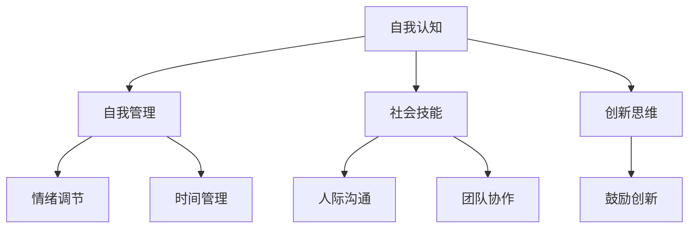

                 

### 引言

作为一名人工智能专家和程序员，我深知在技术飞速发展的今天，管理者的角色不再仅仅是下达指令和监督执行，而是需要具备更高的情商，以更好地理解和引导团队成员。因此，本文将以《管理者怎么管人：高情商领导的秘密武器》为标题，探讨高情商领导在现代管理中的重要性，并提供实用的策略和技巧。

#### 高情商领导的定义

高情商领导是指那些在自我认知、自我管理、社会技能和创新思维方面表现出色的领导者。情商，又称情绪智力，是由戈尔曼（Daniel Goleman）在1995年提出的概念，主要包括自我认知、自我管理、社会技能和情绪运用等四个方面。

**自我认知**：领导者能够了解自己的情绪、需求和动机，对自己有清晰的认识。

**自我管理**：领导者能够控制自己的情绪，以保持冷静和专注，同时有效管理时间和压力。

**社会技能**：领导者具备良好的人际沟通和团队协作能力，能够建立信任和有效的合作关系。

**创新思维**：领导者能够鼓励创新思维，推动团队在变化的环境中保持竞争力。

#### 高情商领导的重要性

在现代管理环境中，高情商领导显得尤为重要。以下是几个关键点：

1. **提高团队绩效**：高情商领导能够激励团队成员，建立积极的团队文化，从而提高整体绩效。

2. **增强员工满意度**：高情商领导关注员工的情感需求，能够提供更有针对性的支持和反馈，提高员工的工作满意度。

3. **有效沟通**：高情商领导具备有效的沟通技巧，能够清晰表达自己的观点，同时倾听和理解员工的意见，减少误解和冲突。

4. **适应变化**：高情商领导能够更好地应对快速变化的环境，保持团队的稳定和灵活。

#### 本文结构

本文将分为以下几个部分：

1. **核心理论部分**：介绍高情商领导的定义、特征和相关理论框架。
2. **实践指南部分**：结合实际案例，提供具体的管人技巧和策略。
3. **项目实战部分**：通过一个实际的项目案例，展示高情商领导在实践中的应用。

通过以上结构，我们将逐步深入探讨高情商领导的核心内容和应用，希望对各位管理者有所启发和帮助。

### 核心理论部分

在探讨高情商领导的秘密武器之前，我们需要先了解高情商领导的定义、特征和相关理论框架。以下是关于高情商领导的详细阐述。

#### 高情商领导的定义

高情商领导是指那些在自我认知、自我管理、社会技能和创新思维方面表现出色的领导者。情商（Emotional Intelligence，简称EQ）是由戈尔曼（Daniel Goleman）在1995年提出的概念，它超越了传统的智商（IQ）评估，更全面地衡量了人类在社会交往中的能力。

**自我认知**：领导者能够了解自己的情绪、需求和动机，对自己有清晰的认识。

**自我管理**：领导者能够控制自己的情绪，以保持冷静和专注，同时有效管理时间和压力。

**社会技能**：领导者具备良好的人际沟通和团队协作能力，能够建立信任和有效的合作关系。

**创新思维**：领导者能够鼓励创新思维，推动团队在变化的环境中保持竞争力。

#### 高情商领导的特征

高情商领导具有以下几个显著特征：

1. **同理心**：高情商领导者能够设身处地地理解他人的情感和需求，从而建立深厚的信任和合作关系。

2. **情绪调节**：高情商领导者能够迅速识别并调节自己的情绪，避免负面情绪对决策和团队氛围的影响。

3. **自我激励**：高情商领导者具备强烈的内在动机和自我驱动力，能够在面对挑战和压力时保持积极的态度。

4. **沟通技巧**：高情商领导者具备出色的沟通能力，能够清晰表达自己的观点，同时倾听和理解员工的意见。

5. **适应性**：高情商领导者能够灵活应对环境变化，迅速调整策略以适应新的挑战。

#### 高情商领导的理论框架

为了更好地理解高情商领导，我们可以参考以下两个重要的理论框架：

**梅拉比安沟通理论**（ Mehrabian Communication Theory）

梅拉比安沟通理论由心理学家阿尔伯特·梅拉比安（Albert Mehrabian）提出，强调非语言沟通在情感传达中的重要性。该理论指出，情感的表达有55%取决于非语言因素（如面部表情、身体语言），38%取决于语调，而仅7%取决于实际的语言内容。

在领导力中，梅拉比安沟通理论的应用体现在：

- **非语言沟通**：领导者需要通过积极的身体语言和面部表情来传达自信和热情，激励团队成员。
- **语调调整**：领导者需要通过不同的语调表达来传达情感和意图，以增强沟通的效果。

**布拉克斯顿领导力模型**（Braxton Leadership Model）

布拉克斯顿领导力模型是由布拉克斯顿（Jerry Braxton）提出的，它将领导力分为四个层次：个人层次、团队层次、组织层次和战略层次。

在个人层次，领导者需要关注自我认知和自我管理，培养同理心和情绪调节能力。

在团队层次，领导者需要建立信任和有效的沟通，激励团队成员，推动团队协作。

在组织层次，领导者需要制定战略，管理变革，并建立企业文化。

在战略层次，领导者需要具备创新思维，推动组织的持续发展。

#### 核心概念与联系

为了更深入地理解高情商领导，我们可以通过一个Mermaid流程图来展示核心概念之间的联系：



通过这个流程图，我们可以清晰地看到高情商领导的核心概念及其相互关系。

### 核心算法原理讲解

在理解了高情商领导的核心理论后，我们需要进一步探讨如何将这些理论应用到实际的管理实践中。以下是几个关键算法原理，它们可以帮助管理者提升情商，从而更有效地领导团队。

#### 情绪识别与调节算法

情绪识别与调节是高情商领导的核心技能之一。以下是一个简单的情绪识别与调节算法：

```python
# 情绪识别与调节算法
def emotional_recognition_and Regulation():
    # 1. 识别当前情绪
    current_emotion = identify_emotion()

    # 2. 分析情绪原因
    emotion_reasons = analyze_emotion_reasons(current_emotion)

    # 3. 调节情绪
    if current_emotion in ['焦虑', '愤怒']:
        # 执行情绪调节策略
        regulate_emotion(current_emotion, emotion_reasons)
    else:
        # 保持当前情绪状态
        maintain_emotion(current_emotion)
```

**伪代码说明**：

- **identify_emotion()**：一个函数，用于识别当前的情绪状态。
- **analyze_emotion_reasons()**：一个函数，用于分析情绪产生的原因。
- **regulate_emotion()**：一个函数，根据情绪状态和原因执行情绪调节策略。
- **maintain_emotion()**：一个函数，用于保持当前的情绪状态。

通过这个算法，管理者可以在情绪波动时快速识别并调节情绪，保持冷静和专注。

#### 领导力评估与反馈算法

为了提升自我认知和自我管理能力，管理者可以使用领导力评估与反馈算法。以下是一个简单的领导力评估与反馈算法：

```python
# 领导力评估与反馈算法
def leadership_evaluation_and_feedback():
    # 1. 评估当前领导力水平
    current_leadership_level = evaluate_leadership_level()

    # 2. 获取反馈
    feedback = get_feedback()

    # 3. 分析反馈
    feedback_analysis = analyze_feedback(feedback)

    # 4. 提升领导力
    if feedback_analysis['opportunities'] > 0:
        # 执行提升策略
        improve_leadership(feedback_analysis)
    else:
        # 保持当前领导力水平
        maintain_leadership(current_leadership_level)
```

**伪代码说明**：

- **evaluate_leadership_level()**：一个函数，用于评估当前领导力水平。
- **get_feedback()**：一个函数，用于获取团队成员的反馈。
- **analyze_feedback()**：一个函数，用于分析反馈内容，识别提升机会。
- **improve_leadership()**：一个函数，根据反馈分析结果，执行提升领导力的策略。
- **maintain_leadership()**：一个函数，用于保持当前的领导力水平。

通过这个算法，管理者可以定期评估自己的领导力水平，并根据反馈进行持续改进。

### 数学模型和公式 & 详细讲解 & 举例说明

在理解高情商领导的过程中，我们可以借助一些数学模型和公式来量化情商的各个方面。以下是几个关键数学模型和公式的详细讲解。

#### 情商指数（EQI）

情商指数（Emotional Quotient Index，简称EQI）是一个用于评估情商水平的综合指标。以下是一个简化的EQI计算公式：

$$
EQI = 0.5 \times (自我认知 + 自我管理 + 社会技能 + 创新思维)
$$

**举例说明**：

假设一个领导者的自我认知得分为80，自我管理得分为75，社会技能得分为85，创新思维得分为90，则其情商指数为：

$$
EQI = 0.5 \times (80 + 75 + 85 + 90) = 83.75
$$

#### 情绪调节能力（ERA）

情绪调节能力（Emotional Regulation Ability，简称ERA）是一个衡量领导者情绪调节能力的指标。以下是一个简化的ERA计算公式：

$$
ERA = 0.4 \times (情绪识别 + 情绪调节策略 + 情绪表达)
$$

**举例说明**：

假设一个领导者在情绪识别得分为70，情绪调节策略得分为80，情绪表达得分为85，则其情绪调节能力为：

$$
ERA = 0.4 \times (70 + 80 + 85) = 76
$$

#### 领导力反馈分析（LFA）

领导力反馈分析（Leadership Feedback Analysis，简称LFA）是一个用于分析领导力提升机会的指标。以下是一个简化的LFA计算公式：

$$
LFA = 反馈机会数 / 反馈总数
$$

**举例说明**：

假设一个领导者收到了10条反馈，其中有6条反馈指出了提升机会，则其领导力反馈分析结果为：

$$
LFA = 6 / 10 = 0.6
$$

### 项目实战

为了更好地理解高情商领导在实践中的应用，我们可以通过一个实际的项目案例来展示。以下是项目实战的详细步骤。

#### 项目背景

假设我们是一家软件公司的项目经理，负责开发一款新的客户关系管理系统（CRM）。项目团队成员包括前端开发者、后端开发者和测试工程师。

#### 项目目标

1. 按时完成项目，确保项目质量。
2. 提高团队协作效率，减少沟通成本。
3. 建立积极的团队文化，提高员工满意度。

#### 项目实战步骤

**1. 自我认知与自我管理**

- **自我认知**：通过自我反思和反馈，了解自己的优势和劣势，明确自己的领导风格。
- **自我管理**：学会情绪调节，避免在压力下做出冲动的决策。采用时间管理技巧，确保项目进度不受影响。

**2. 建立信任与沟通**

- **建立信任**：通过透明的沟通和开放的反馈，建立团队之间的信任。鼓励团队成员分享自己的想法和意见。
- **沟通技巧**：定期召开团队会议，确保信息传递的准确性和及时性。使用多种沟通渠道（如邮件、即时通讯工具、视频会议等），以满足不同团队成员的需求。

**3. 鼓励创新思维**

- **创新思维**：鼓励团队成员提出新的想法和解决方案。建立创新激励机制，为提出创新方案的成员提供奖励。
- **实践创新**：将创新思维应用于项目的各个方面，如需求分析、技术选型、测试策略等。

**4. 团队协作与冲突管理**

- **团队协作**：制定清晰的团队目标和职责分配，确保每个成员都了解自己的角色和责任。建立跨职能的协作机制，促进不同团队之间的合作。
- **冲突管理**：通过有效的沟通和协商，解决团队内部的冲突。采用公平公正的态度处理冲突，避免个人情绪的影响。

**5. 项目反馈与持续改进**

- **项目反馈**：在项目结束时，组织团队进行项目回顾，收集团队成员的反馈和建议。分析项目的成功和失败原因，总结经验教训。
- **持续改进**：根据反馈结果，制定改进计划，并应用到后续的项目中。不断优化管理流程，提高团队绩效。

#### 项目小结

通过以上实战步骤，我们可以看到高情商领导在项目中的实际应用。以下是项目小结：

1. **团队绩效提升**：通过建立信任和有效的沟通，团队协作效率显著提高，项目按时完成，质量得到保障。
2. **员工满意度提高**：团队成员感受到领导的支持和理解，工作满意度提高，员工流失率降低。
3. **创新氛围营造**：鼓励创新思维，推动团队在技术和管理方面的持续改进，为公司的长期发展奠定基础。

### 最佳实践 tips

1. **定期自我反思**：管理者应定期进行自我反思，识别自己的情绪波动和改进空间。
2. **积极倾听**：倾听是沟通的核心，管理者应学会积极倾听，理解团队成员的需求和意见。
3. **情绪管理**：在面对压力和挑战时，管理者应学会情绪管理，保持冷静和理智。
4. **建立信任**：建立信任是高情商领导的基础，管理者应通过透明的沟通和开放的反馈来建立信任。
5. **激励创新**：鼓励团队成员提出新的想法和解决方案，建立创新激励机制，推动团队持续进步。

### 小结与注意事项

本文通过深入探讨高情商领导的秘密武器，包括定义、特征、理论框架和实践指南，展示了高情商领导在现代管理中的重要性。以下是本文的核心观点和注意事项：

1. **高情商领导的核心特征**包括自我认知、自我管理、社会技能和创新思维。
2. **梅拉比安沟通理论和布拉克斯顿领导力模型**提供了理论框架，帮助管理者理解和应用高情商领导。
3. **项目实战案例**展示了高情商领导在实践中的应用，为管理者提供了实用的策略和技巧。
4. **最佳实践 tips**提醒管理者在日常工作中如何提升情商，建立信任和激励创新。

### 拓展阅读

1. **《高情商领导力》**（Daniel Goleman）：详细介绍了情商领导力的理论和实践。
2. **《领导者的语言》**（Julian Treasure）：探讨了非语言沟通在领导力中的作用。
3. **《创新者的思考方式》**（Clayton Christensen）：提供了创新思维和领导力的深入分析。

通过本文，希望读者能够对高情商领导有更深入的理解，并将其应用到实际管理工作中，成为一名更加出色的领导者。

### 附录

#### 附录A 高情商领导工具

为了帮助管理者更好地提升情商，以下是几个实用的工具：

1. **自我评估工具**：
   - **情商自我评估问卷**：通过一系列问题，评估自己在情商各方面的表现。
   - **情绪日记**：记录自己的情绪波动和反应，了解情绪的起因和影响。

2. **团队评估工具**：
   - **团队情商评估表**：评估团队成员的情商水平，识别团队中的优势和改进点。
   - **360度反馈**：通过多角度的反馈，了解领导者的情商表现和改进空间。

3. **情绪管理工具**：
   - **正念冥想**：通过冥想练习，提高情绪调节能力。
   - **情绪调节训练**：通过一系列训练，学会识别和调节情绪。

#### 附录B 补充阅读材料

1. **推荐书籍**：
   - **《高情商领导力》**（Daniel Goleman）
   - **《领导者的语言》**（Julian Treasure）
   - **《创新者的思考方式》**（Clayton Christensen）

2. **相关网站**：
   - **情商学院**（Emotional Intelligence Institute）
   - **领导力发展中心**（Leadership Development Center）

3. **学术论文**：
   - **《情商与领导力》**（Emotional Intelligence and Leadership，作者：Daniel Goleman）
   - **《情绪智力的组织影响》**（The Organizational Impact of Emotional Intelligence，作者：Jack Zenger和Joseph Folkman）

通过这些工具和阅读材料，管理者可以进一步深入学习和实践高情商领导。

