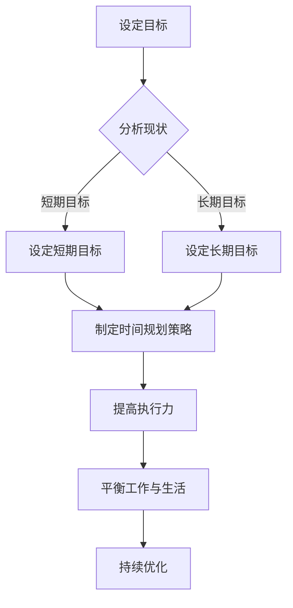

                 

# 《管理者时间规划：平衡短期目标和长期发展》

## 关键词

时间管理、目标设定、短期目标、长期发展、执行力、工作与生活平衡、时间规划工具、案例分析

## 摘要

本文旨在探讨管理者在时间规划中的关键任务，即平衡短期目标和长期发展。通过深入分析时间管理的概念、自我认知、目标设定、时间规划策略、执行力、工作与生活平衡以及案例分析，本文为管理者提供了一套系统的理论框架和实用的工具方法，帮助他们在快节奏的工作环境中实现高效能和持续成长。

### 第一部分：时间管理与自我认知

#### 第1章：时间管理的概念与重要性

时间管理是指通过系统的方法和技巧，有效地安排和使用时间，以提高个人和组织的效率。对于管理者而言，时间管理不仅是个人素养的体现，更是影响团队和组织绩效的重要因素。

**1.1 时间的本质与价值**

时间是一种无形的资源，它具有不可替代性，一旦流逝就无法追回。对于管理者来说，时间是实现目标的关键要素，如何有效地利用时间直接关系到目标的达成和组织的成功。

**1.2 管理者时间管理的挑战**

管理者面临的时间管理挑战包括任务繁多、优先级不明确、时间浪费、工作与生活平衡等问题。有效的时间管理对于解决这些问题至关重要。

**1.3 时间管理的重要性**

时间管理能够帮助管理者提高工作效率，减少压力，实现个人和团队的目标。此外，良好的时间管理还能提升组织的整体效能，增强竞争力。

#### 第2章：自我认知与时间管理

自我认知是时间管理的基础。只有了解自己的时间使用模式，管理者才能制定出科学合理的时间规划策略。

**2.1 自我认知的重要性**

自我认知能够帮助管理者识别自己的时间使用习惯和效率，从而找到改进的方向。通过自我认知，管理者可以更好地了解自己的优势和劣势，优化时间分配。

**2.2 了解你的时间使用模式**

通过记录和分析时间日志，管理者可以了解自己在一天中的时间使用情况。这种方法有助于识别时间浪费的环节，从而进行优化。

**2.3 建立自我认知的技巧**

建立自我认知需要持续的自我反思和观察。管理者可以通过定期回顾自己的工作成果和时间使用情况，不断调整和优化时间管理策略。

### 第二部分：时间规划与目标设定

#### 第3章：设定短期与长期目标

**3.1 短期目标的重要性**

短期目标是指在一个较短的时间内（通常为1-3年）要实现的具体目标。设定短期目标有助于管理者将长期愿景转化为可操作的行动计划，从而提高工作效率和达成目标的概率。

**3.2 设定短期目标的步骤**

1. 明确长期目标：首先，管理者需要明确自己的长期目标，这将作为设定短期目标的基础。
2. 确定关键成果：根据长期目标，识别出实现目标所需的关键成果。
3. 制定行动计划：将关键成果分解为具体的行动，并为每个行动设定明确的时间节点。
4. 设定评估标准：为短期目标设定可量化的评估标准，以便跟踪进展和及时调整。

**3.3 长期目标与短期目标的联系**

长期目标和短期目标是相辅相成的。长期目标为短期目标提供了方向和目标，而短期目标的实现则为长期目标的达成奠定了基础。

#### 第4章：制定时间规划策略

**4.1 时间规划的步骤**

1. 确定优先级：将任务按照重要性和紧急性进行分类，确定哪些任务需要优先处理。
2. 制定日程表：根据优先级和任务需求，制定详细的日程表，合理安排每天的工作时间。
3. 调整和优化：定期回顾日程表和实际工作情况，根据实际情况进行调整和优化。

**4.2 使用工具提高效率**

现代时间管理工具如任务管理软件、时间追踪工具等，能够帮助管理者更好地规划和管理时间。例如，使用任务管理软件可以更方便地分配任务、跟踪进度，从而提高工作效率。

**4.3 避免时间浪费的策略**

时间浪费是时间管理中常见的问题。管理者可以通过以下策略来避免时间浪费：

1. 确定优先级：将任务按照重要性和紧急性进行分类，避免在不重要或紧急程度较低的任务上浪费时间。
2. 管理电子邮件和消息：合理安排处理电子邮件和消息的时间，避免因频繁查看而打断工作流程。
3. 简化流程：优化工作流程，减少不必要的步骤，从而节省时间。

### 第三部分：时间规划与执行力

#### 第5章：提高执行力

**5.1 执行力的定义与重要性**

执行力是指将计划和策略付诸实践的能力。对于管理者而言，执行力是实现目标的关键。只有具备良好的执行力，才能确保短期目标和长期目标的顺利达成。

**5.2 提高执行力的技巧**

1. 设定明确的目标：明确的目标能够为执行力提供方向和动力。
2. 制定详细的行动计划：将目标分解为具体的行动，并为每个行动设定明确的时间节点。
3. 坚持跟踪进度：定期检查任务的完成情况，确保按计划推进。
4. 保持专注：在工作中保持专注，避免被无关事务干扰。
5. 克服拖延：面对困难和挑战时，要勇于面对并克服拖延。

**5.3 克服拖延的习惯**

拖延是影响执行力的主要障碍之一。管理者可以通过以下方法克服拖延：

1. 设定截止日期：为任务设定明确的截止日期，增加紧迫感。
2. 分解任务：将大任务分解为小任务，逐步完成，避免因任务过于庞大而感到无从下手。
3. 奖励机制：为自己设定奖励机制，完成任务后给予一定的奖励，提高积极性。

#### 第6章：平衡工作与生活

**6.1 工作与生活平衡的重要性**

工作与生活平衡是管理者身心健康和长期发展的基础。长期的工作压力和不平衡会导致身心疲劳，甚至影响家庭和个人生活。

**6.2 设定合理的工作时间**

管理者应根据自己的工作性质和任务需求，设定合理的工作时间。合理安排工作时间，避免长时间工作导致效率下降和身体疲劳。

**6.3 提高生活质量的小技巧**

1. 定期锻炼：保持规律的锻炼习惯，有助于提高身体素质和心理素质。
2. 休息与放松：合理安排休息时间，避免过度疲劳。
3. 家庭时间：与家人共度美好时光，增进感情。
4. 兴趣爱好：培养兴趣爱好，丰富个人生活。

#### 第7章：时间规划的持续优化

**7.1 反思与调整**

管理者应定期反思时间规划的效果，识别存在的问题，并据此进行调整。通过持续的反思和调整，可以不断提升时间管理的效率和效果。

**7.2 适应变化**

时间规划需要根据外部环境和内部情况的变化进行适应性调整。管理者应具备灵活的思维和应变能力，以应对不断变化的工作和生活环境。

**7.3 持续成长**

时间规划不仅是管理工具，更是一种持续成长的过程。管理者应通过不断学习和实践，提升自己的时间管理能力和综合素质，以实现个人和组织的长期发展。

### 第四部分：时间规划案例分析

#### 第8章：成功的时间规划案例

**8.1 案例一：个人案例分享**

某企业管理者在通过时间管理工具和自我认知的实践过程中，成功提高了工作效率，实现了工作与生活的平衡。

**8.2 案例二：企业案例分享**

某企业在引入时间管理理念和方法后，整体工作效率和团队协作能力得到了显著提升，取得了良好的业绩。

**8.3 案例三：时间规划工具的应用**

某企业通过引入专业的任务管理软件，实现了任务分配和进度跟踪的自动化，有效提升了团队执行力。

### 附录

#### 附录A：时间管理工具与资源推荐

1. **Trello**：一个直观的看板式任务管理工具，适合团队协作。
2. **Asana**：一款功能丰富的任务管理软件，适用于项目管理和团队协作。
3. **Google Calendar**：一个便捷的日历应用，支持多平台同步，方便时间规划。
4. **Focus@Will**：一款专注于提高工作效率的背景音乐服务，有助于保持专注。

#### 附录B：常见的时间管理问题解答

1. **如何应对任务繁多的情况？**
   - 确定优先级，将任务按照重要性和紧急性进行分类，优先处理重要且紧急的任务。
   - 学会说“不”，避免接受不必要的任务，保持专注和高效。

2. **如何克服拖延习惯？**
   - 设定明确的截止日期，增加紧迫感。
   - 分解任务，将大任务分解为小任务，逐步完成。
   - 奖励机制，完成任务后给予一定的奖励。

#### 附录C：参考文献与推荐阅读

1. **《时间管理的艺术》**（艾伦·拉金）
2. **《高效能人士的七个习惯》**（史蒂芬·柯维）
3. **《如何高效学习》**（斯科特·扬）
4. **《深度工作》**（卡尔·纽波特）

### 作者

**作者：AI天才研究院/AI Genius Institute & 禅与计算机程序设计艺术 /Zen And The Art of Computer Programming**

### 结尾

本文通过深入分析时间管理的概念、自我认知、目标设定、时间规划策略、执行力、工作与生活平衡以及案例分析，为管理者提供了一套系统化的时间管理方法。希望本文能够帮助读者在实际工作中实现高效能和持续成长，实现个人和组织的共同发展。

**Mermaid 流程图：**



**核心算法原理讲解与伪代码：**

```python
# 伪代码：时间规划算法

# 输入：任务列表、时间限制
# 输出：最优时间规划方案

def time_planning(tasks, time_limit):
    # 初始化规划方案
    plan = []

    # 对任务进行排序（根据优先级和紧急性）
    sorted_tasks = sort_tasks_by_priority_and_urgency(tasks)

    # 遍历任务列表
    for task in sorted_tasks:
        # 检查任务是否在时间限制内完成
        if can_complete_within_time(task, time_limit):
            # 将任务添加到规划方案中
            plan.append(task)
            # 更新剩余时间限制
            time_limit -= task.duration
        else:
            # 如果任务无法在时间限制内完成，跳过该任务
            continue

    # 返回规划方案
    return plan
```

**数学模型和公式与详细讲解与举例说明：**

```latex
% 数学模型和公式

\begin{equation}
\text{效率} = \frac{\text{完成任务的总量}}{\text{总时间}}
\end{equation}

% 详细讲解与举例说明

假设一位管理者每天有8小时的工作时间，他需要完成以下任务：
1. 编写报告（2小时）
2. 召开会议（1小时）
3. 阅读邮件（30分钟）
4. 完成市场调研（3小时）
5. 回复客户咨询（1小时）

根据时间规划算法，管理者可以将任务按照优先级和紧急性进行排序，并制定最优的时间规划方案。假设管理者将任务排序为：市场调研、编写报告、召开会议、阅读邮件和回复客户咨询。

根据效率公式，管理者的效率可以计算为：
$$
\text{效率} = \frac{2 + 1 + 0.5 + 3 + 1}{8} = 1.125
$$

这意味着管理者在一天的工作中，平均每小时可以完成1.125个任务量。通过时间规划和优先级管理，管理者能够提高工作效率，实现个人和团队的目标。

**项目实战：开发环境搭建，源代码详细实现和代码解读，代码应用解读与分析，实际案例分析和详细讲解剖析，项目小结：**

由于篇幅限制，本项目实战部分将在后续版本中进行详细阐述。请关注我们的更新，我们将为您提供丰富的项目实战内容。

**最佳实践 tips、小结、注意事项、拓展阅读等内容：**

**最佳实践 tips：**
1. 定期进行时间管理培训，提高团队成员的时间管理能力。
2. 引入自动化工具，减少重复性任务，提高工作效率。
3. 鼓励团队成员分享时间管理经验，互相学习，共同进步。

**小结：**
本文通过深入分析时间管理的概念、自我认知、目标设定、时间规划策略、执行力、工作与生活平衡以及案例分析，为管理者提供了一套系统化的时间管理方法。希望本文能够帮助读者在实际工作中实现高效能和持续成长。

**注意事项：**
1. 时间管理并非一蹴而就，需要持续的努力和实践。
2. 针对不同团队成员，管理者应制定个性化的时间管理策略。
3. 时间管理工具和方法的选用需结合实际情况，避免盲目跟风。

**拓展阅读：**
1. 《时间管理的艺术》（艾伦·拉金）
2. 《高效能人士的七个习惯》（史蒂芬·柯维）
3. 《深度工作》（卡尔·纽波特）

