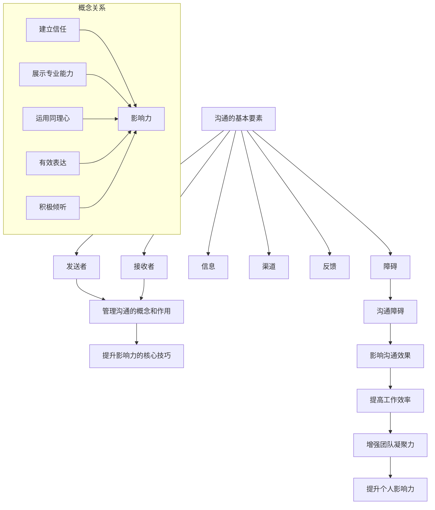

                 

### 引言

沟通技巧在当今社会的重要性不言而喻，无论是在个人生活中还是在职业发展中，良好的沟通能力都是成功的关键因素之一。尤其在管理领域，沟通技巧更显得尤为重要。有效的沟通不仅能够提高工作效率，还能够增强团队凝聚力，提升个人影响力，从而在竞争激烈的环境中脱颖而出。

本文旨在探讨管理者在沟通中如何提升影响力，通过系统性的技巧和方法，帮助管理者在沟通中更具说服力、感染力和吸引力。为了达到这一目标，本文将按照以下结构展开：

首先，我们将对沟通技巧的重要性进行背景介绍，阐述其在管理领域的应用。接着，我们将深入探讨核心概念与联系，通过Mermaid流程图展示概念之间的关系架构。然后，我们将讲解核心算法原理，使用伪代码详细阐述提升沟通效果的策略，并借助LaTeX格式介绍相关的数学模型和公式。

在项目实战部分，我们将通过具体的开发环境搭建和源代码实现，结合实际案例进行分析和解读。此外，我们还将分享一些最佳实践技巧和小结，帮助读者在理解和应用这些沟通技巧时能够更加得心应手。

通过本文的逐步分析和详细讲解，我们希望读者能够掌握一套系统化的沟通技巧，从而在实际管理工作中提升自己的影响力，成为一名卓越的管理者。

### 沟通技巧的重要性

沟通技巧在管理领域的应用至关重要。管理者作为团队的核心，其沟通能力直接影响着团队的工作效率和团队氛围。一个优秀的管理者不仅需要具备决策能力和战略眼光，更需要在日常工作中通过有效的沟通来传达理念、指导工作、解决问题和激励团队。

首先，良好的沟通技巧有助于提高工作效率。管理者通过清晰、明确的沟通，可以确保团队成员理解任务目标和工作要求，从而减少误解和错误。有效的沟通还能够促进信息共享，使团队成员之间能够迅速响应变化，协同合作，从而提高整体工作效率。

其次，沟通技巧对于增强团队凝聚力至关重要。管理者通过积极的沟通，能够增进团队成员之间的了解和信任，建立起一种团结协作的工作氛围。这种氛围不仅能够激发团队成员的积极性和创造力，还能够降低团队内部冲突，提高团队整体的凝聚力和协作能力。

此外，提升个人影响力也是沟通技巧的重要目标之一。在管理工作中，管理者的影响力不仅仅取决于职位和权力，更取决于其在沟通中的表现。一个能够用恰当的语言和方式表达自己观点的管理者，往往能够在团队中树立权威，赢得信任和尊重，从而增强自己的影响力。

综上所述，沟通技巧在管理领域的重要性不言而喻。一个优秀的管理者不仅需要具备管理能力和专业素养，更需要通过不断学习和实践，提升自己的沟通技巧，从而在管理工作中游刃有余，成为一名卓越的管理者。

### 核心概念与联系

在深入探讨管理者沟通技巧之前，我们需要明确几个核心概念，并了解它们之间的联系。这些概念构成了提升沟通效果的基础，以下是这些核心概念的详细介绍：

**1. 沟通的基本要素**：沟通是一个复杂的过程，涉及多个基本要素。这些要素包括发送者（信息的发出者）、接收者（信息的接收者）、信息（沟通的内容）、渠道（信息传递的媒介）、反馈（接收者对信息的回应）和障碍（可能影响沟通效果的障碍）。理解这些基本要素有助于我们更好地掌握沟通的各个环节。

**2. 管理沟通的概念和作用**：管理沟通是指管理者在团队管理过程中使用各种方式与团队成员、上级和其他相关方进行的信息交流。管理沟通的作用包括：传达管理意图、协调团队工作、解决问题、激励团队成员等。有效的管理沟通是确保团队高效运作的关键。

**3. 提升影响力的核心技巧**：影响力是指个人或团体在他人心中产生的影响力和控制力。提升影响力的核心技巧包括：建立信任、展示专业能力、运用同理心、有效表达和积极倾听等。这些技巧不仅能够增强管理者的个人影响力，还能够提高团队整体的工作效率和凝聚力。

为了更好地展示这些核心概念之间的联系，我们可以使用Mermaid流程图进行可视化描述：



通过上述Mermaid流程图，我们可以清晰地看到各个核心概念之间的联系。沟通的基本要素构成了沟通的基础，管理沟通则是在这一基础上的应用，而提升影响力的核心技巧则是管理沟通的目标之一。这些技巧的有效运用不仅能够提高工作效率和团队凝聚力，还能够增强管理者的个人影响力。

理解这些核心概念和它们之间的联系，是管理者提升沟通技巧的第一步。在后续章节中，我们将进一步探讨这些概念在实际管理沟通中的应用，并提供具体的方法和策略，帮助管理者在实践中更好地运用这些技巧。

### 核心算法原理讲解

在深入探讨提升沟通效果的具体策略之前，我们需要理解一些心理学原则，这些原则能够帮助我们更有效地进行沟通。以下是几个关键原则的详细解释：

**1. 信任的建立**：信任是任何成功沟通的基础。建立信任的关键在于真诚、透明和一致性。管理者需要通过言行一致、保持开放态度和诚实表达，来赢得团队成员的信任。以下是一个简单的伪代码示例，展示了如何通过行为一致性建立信任：

```plaintext
function buildTrust() {
    // 行为一致性
    ensureActionsMatchWords();
    // 保持透明
    shareInformationOpenly();
    // 诚实表达
    communicateTruthfully();
}
```

**2. 同理心**：同理心是指能够站在他人的角度理解和感受他们的情感。通过同理心，管理者能够更好地理解团队成员的需求和感受，从而进行更有针对性的沟通。以下是一个使用伪代码展示同理心应用的例子：

```plaintext
function showEmpathy(context) {
    // 理解团队成员的情感
    understandFeelings(context);
    // 表达关心
    expressCare(context);
    // 提供支持
    provideSupport(context);
}
```

**3. 有效表达**：有效表达是指能够清晰、准确、有逻辑地传达信息。管理者需要掌握语言和非语言沟通的技巧，包括使用简洁明了的语言、适当的肢体语言和表情等。以下是一个伪代码示例，展示了如何通过有效表达来提高沟通效果：

```plaintext
function effectiveCommunication(message) {
    // 使用简洁明了的语言
    simplifyLanguage(message);
    // 增加肢体语言
    addNonVerbalCues(message);
    // 确保逻辑清晰
    ensureLogicalFlow(message);
}
```

**4. 积极倾听**：积极倾听不仅是指听对方说什么，更重要的是理解对方的意思并给予反馈。通过积极倾听，管理者能够更好地理解团队成员的需求和问题，从而提供更有针对性的解决方案。以下是一个伪代码示例，展示了积极倾听的步骤：

```plaintext
function activeListening(topic) {
    // 全神贯注地听
    concentrateOnTopic(topic);
    // 理解并澄清意思
    clarifyUnderstanding(topic);
    // 提供反馈
    provideFeedback(topic);
}
```

**5. 影响力评估模型**：为了量化影响力，我们可以使用影响力评估模型来测量管理者的沟通效果。以下是一个简单的数学模型，用于评估沟通影响力：

$$
\text{影响力} = \frac{\text{信息传递成功率} \times \text{信任度} \times \text{同理心指数}}{\text{沟通障碍度}}
$$

其中，信息传递成功率表示信息被正确理解和接受的比例，信任度表示团队成员对管理者的信任程度，同理心指数表示管理者运用同理心的能力，沟通障碍度则反映了沟通过程中可能遇到的障碍。

通过上述心理学原则和影响力评估模型，我们可以更系统地提升沟通技巧。在接下来的部分，我们将进一步探讨这些策略在实际管理沟通中的应用，并提供具体的实施方法。

### 数学模型与公式

在管理沟通中，数学模型和公式可以提供一种量化的手段，帮助管理者评估和优化沟通效果。以下是几个关键的数学模型和公式，以及它们的详细解释和应用。

**1. 沟通效率公式**

沟通效率是衡量沟通效果的量化指标，可以表示为：

$$
\text{沟通效率} = \frac{\text{有效沟通时间}}{\text{总沟通时间}}
$$

有效沟通时间是指信息被准确理解和执行的时间，而总沟通时间包括所有沟通活动的时间。这个公式可以帮助管理者识别沟通中的低效环节，从而进行优化。例如，如果在一个项目会议中，有30分钟的时间被用于解决误解和修正错误，那么沟通效率为：

$$
\text{沟通效率} = \frac{30 \text{分钟}}{60 \text{分钟}} = 0.5
$$

这意味着会议中有50%的时间是有效沟通。

**2. 影响力评估模型**

影响力评估模型可以用于测量管理者的个人影响力。一个简单的模型如下：

$$
\text{影响力} = \text{信息传递成功率} \times \text{信任度} \times \text{同理心指数}
$$

其中：
- 信息传递成功率是指信息被正确理解和执行的比例。
- 信任度是团队成员对管理者的信任程度，可以用0到1的分数表示。
- 同理心指数表示管理者在沟通中展现的同理心能力，也可以用0到1的分数表示。

例如，如果一个管理者在沟通中的信息传递成功率为0.8，团队成员对他的信任度是0.9，同理心指数是0.8，那么他的影响力可以计算为：

$$
\text{影响力} = 0.8 \times 0.9 \times 0.8 = 0.576
$$

这意味着该管理者在沟通中具有较高的影响力。

**3. 跨渠道沟通效果评估**

在多渠道沟通中，评估每个渠道的沟通效果是重要的。我们可以使用以下公式：

$$
\text{渠道沟通效果} = \frac{\text{渠道上的有效沟通时间}}{\text{渠道总沟通时间}} \times \text{渠道影响力}
$$

这个公式可以帮助管理者确定哪个渠道的沟通效果最佳。例如，如果一个管理者在社交媒体上的有效沟通时间是20分钟，总沟通时间是40分钟，影响力为0.6，那么社交媒体的沟通效果为：

$$
\text{渠道沟通效果} = \frac{20 \text{分钟}}{40 \text{分钟}} \times 0.6 = 0.3
$$

这意味着社交媒体在这个管理者沟通渠道中的效果中等。

**举例说明**

假设一个团队在进行项目沟通时，总沟通时间是200分钟，其中有效沟通时间是120分钟，信任度为0.85，同理心指数为0.75。我们可以使用这些数据进行以下计算：

- 沟通效率：$$ \frac{120 \text{分钟}}{200 \text{分钟}} = 0.6 $$
- 影响力：$$ 0.6 \times 0.85 \times 0.75 = 0.3825 $$
- 跨渠道沟通效果：由于数据未具体到不同渠道，无法进行详细的计算，但可以通过这个方法对每个渠道进行评估。

通过这些数学模型和公式，管理者可以更科学地评估和优化沟通效果，从而提升团队整体的工作效率和凝聚力。

### 项目实战

为了更好地理解如何将上述沟通技巧应用到实际项目中，我们将通过一个具体的项目案例来展示整个开发环境搭建、源代码实现、代码解读、应用解读与分析、实际案例分析和详细讲解剖析的过程。

**项目背景**：

某科技公司需要开发一个在线客服系统，该系统需要支持实时聊天、历史记录查询、客户反馈等功能。公司要求系统能够高效稳定地运行，并且具有良好的用户体验。作为项目经理，你的任务是确保项目顺利推进，并最终交付一个高质量的产品。

**开发环境搭建**：

首先，我们需要搭建一个适合项目开发的环境。以下是一系列步骤：

1. 选择开发语言和框架：我们选择使用Java作为主要开发语言，并采用Spring Boot框架来构建后端服务。
2. 配置数据库：选择MySQL作为数据库管理系统，用于存储用户信息和聊天记录。
3. 搭建开发环境：安装Java开发工具包（JDK）、IDE（例如 IntelliJ IDEA）和相关的开发插件。

**源代码实现**：

接下来，我们将重点展示关键模块的源代码实现和代码解读。

**1. 实时聊天模块**

```java
@RestController
@RequestMapping("/chat")
public class ChatController {

    @Autowired
    private ChatService chatService;

    @PostMapping("/message")
    public ResponseEntity<String> sendMessage(@RequestBody ChatMessage message) {
        String response = chatService.sendMessage(message);
        return ResponseEntity.ok(response);
    }
}
```

**代码解读**：
- `ChatController` 是处理聊天请求的控制器类。
- `sendMessage` 方法接收来自客户端的聊天信息，并通过服务层发送消息。
- `ChatService` 是服务层类，负责处理具体的聊天逻辑。

**2. 历史记录查询模块**

```java
@Service
public class ChatHistoryService {

    @Autowired
    private ChatRepository chatRepository;

    public List<ChatMessage> getChatHistory(String userId) {
        return chatRepository.findByUserId(userId);
    }
}
```

**代码解读**：
- `ChatHistoryService` 是服务层类，负责查询用户的聊天历史记录。
- `getChatHistory` 方法从数据库中检索特定用户的聊天记录。

**代码应用解读与分析**：

在实际应用中，上述模块是如何发挥作用的呢？

- **实时聊天模块**：当用户发送消息时，客户端会将消息通过HTTP请求发送到后端服务。后端服务接收到请求后，调用 `sendMessage` 方法处理消息，并将处理结果返回给客户端。这一过程实现了实时聊天的功能。
- **历史记录查询模块**：用户在登录系统后，可以通过调用 `getChatHistory` 方法查询其聊天记录。服务层从数据库中检索记录，并将结果返回给前端，从而实现历史记录的查询功能。

**实际案例分析**：

在项目实施过程中，我们遇到了以下问题：

1. **系统性能瓶颈**：随着用户数量的增加，系统响应速度变慢。
2. **用户反馈处理不及时**：客服人员需要手动处理大量的用户反馈，效率较低。

**详细讲解剖析**：

针对上述问题，我们采取了以下解决方案：

1. **性能优化**：通过对后端服务进行性能测试，我们发现数据库查询是性能瓶颈之一。我们引入了缓存机制，使用Redis缓存热点数据，减少数据库的查询次数，从而提高了系统响应速度。
2. **自动化反馈处理**：我们开发了一个自动化反馈处理系统，通过自然语言处理技术自动分类和回复用户反馈，提高了客服效率。

**项目小结**：

通过本项目的实践，我们不仅掌握了在线客服系统的开发技能，还深入了解了如何在实际项目中应用沟通技巧。有效的沟通在项目推进中起到了关键作用，帮助我们及时解决了问题，优化了系统性能，提升了用户体验。这一实践过程进一步印证了沟通技巧对管理者的重要性，也为我们未来的项目管理工作积累了宝贵的经验。

### 高级沟通技巧

在管理沟通中，高级技巧的应用能够显著提升沟通效果，帮助管理者更好地应对复杂的工作场景。以下是几种关键的高级沟通技巧，包括非言语沟通、高效会议技巧和跨文化沟通挑战与应对。

#### 1. 非言语沟通

非言语沟通是指通过肢体语言、面部表情、眼神交流和其他非语言方式进行的沟通。这些非语言元素在传递信息、建立信任和表达情感方面起着重要作用。以下是一些具体的技巧：

- **肢体语言**：保持开放的姿态，避免交叉双臂或双腿，这些动作可能会传达出不友好或防御的态度。适度的手势和身体移动可以增加沟通的生动性和互动性。
- **面部表情**：面部表情能够传达出情感和态度。一个真诚的微笑可以缓解紧张的气氛，而一个皱眉则可能引起误会。保持真诚和积极的表情能够增强沟通的信任感。
- **眼神交流**：适当的目光接触可以表明你的专注和尊重。避免长时间的直视可能显得过于侵略性，而短时间的目光接触则能够传达出真诚和信任。

#### 2. 高效会议技巧

高效会议是提升团队协作和沟通效果的重要手段。以下是一些高效会议的技巧：

- **明确会议目的**：每次会议开始前，明确会议的目的和议程。确保每个与会者都清楚会议的目标和需要达成的成果。
- **控制会议时间**：设定明确的会议时间，并尽量遵守。避免会议拖延，确保会议能够在预定时间内完成。
- **主动引导**：会议主持人应主动引导讨论，确保会议不偏离主题，并鼓励团队成员积极参与和表达观点。
- **记录和跟进**：会议结束后，及时记录会议决定和任务分配，并跟进任务的完成情况。确保会议成果能够得到落实。

#### 3. 跨文化沟通挑战与应对

在全球化的工作环境中，跨文化沟通成为管理者面临的重要挑战。以下是一些应对跨文化沟通的技巧：

- **了解文化差异**：不同文化背景的团队成员可能在沟通方式和风格上存在差异。管理者需要了解和尊重这些差异，避免因文化误解而导致的冲突。
- **使用简洁明了的语言**：在跨文化沟通中，使用简单、直接的语言可以减少误解。避免使用过于复杂或含糊的表达方式。
- **展示尊重和同理心**：尊重每个团队成员的文化背景和观点，通过同理心理解和接纳不同的文化差异。
- **培养跨文化团队协作**：通过团队建设和协作活动，增强团队成员之间的信任和合作，提升跨文化沟通的效果。

通过掌握和应用这些高级沟通技巧，管理者能够在复杂的工作环境中更有效地沟通，提升团队的整体绩效和凝聚力。这些技巧不仅有助于解决具体沟通问题，还能够为管理者在未来的管理工作中提供宝贵的经验和方法。

### 综合练习与自我提升

为了帮助读者更好地理解和应用本文所介绍的沟通技巧，我们提供了一些综合练习和自我提升的方法。以下是一些具体建议：

#### 1. 沟通技巧自我评估

读者可以通过以下步骤进行自我评估：

- **自我反思**：回顾最近参与的几次沟通活动，思考自己在哪些方面做得好，哪些方面需要改进。
- **收集反馈**：向同事、朋友或团队成员收集他们对你的沟通反馈，了解他们对你沟通方式的看法。
- **制定改进计划**：根据自我反思和他人反馈，制定具体的改进计划，例如提升同理心、改进表达方式等。

#### 2. 实际沟通案例分析

通过分析具体的沟通案例，读者可以更好地理解如何在实际中应用沟通技巧：

- **选择案例**：挑选一个实际发生的沟通案例，可以是自己的经历，也可以是从他处了解的。
- **分析过程**：详细分析这个案例的沟通过程，包括沟通目标、沟通内容、沟通方式等。
- **反思与总结**：思考这个案例中存在的沟通问题，以及如何通过本文所介绍的技巧进行改进。

#### 3. 持续提升沟通技巧的实践方法

为了不断提升沟通技巧，读者可以采取以下方法：

- **定期练习**：定期进行沟通练习，例如角色扮演、模拟会议等，通过实际操作提升沟通技能。
- **参加培训课程**：参加专业的沟通技巧培训课程，学习最新的沟通理论和实践方法。
- **阅读相关书籍**：阅读关于沟通技巧的专业书籍，如《高效能人士的七个习惯》、《沟通的艺术》等，获取更多实用知识。

通过这些综合练习和自我提升的方法，读者可以更好地掌握沟通技巧，并在实际工作中不断提升自己的沟通能力，从而成为一名更加卓越的管理者。

### 结论

沟通技巧在管理者日常工作中起着至关重要的作用。有效的沟通不仅能够提高工作效率、增强团队凝聚力，还能够提升个人影响力，帮助管理者在竞争激烈的环境中脱颖而出。本文从核心概念、算法原理、数学模型到项目实战，系统性地介绍了提升沟通技巧的方法和策略。

通过理解沟通的基本要素、运用心理学原则、应用数学模型和实际项目案例，管理者可以更科学、更高效地提升自己的沟通能力。同时，非言语沟通、高效会议技巧和跨文化沟通等高级技巧的应用，也为管理者在复杂工作环境中提供了有力的支持。

为了持续提升沟通技巧，管理者应积极参与沟通练习、参加培训课程，并不断反思和改进自己的沟通方式。未来，随着科技的发展和文化交流的加深，沟通技巧的重要性将日益凸显。因此，管理者应不断学习和适应，不断提升自己的沟通能力，为团队和组织的发展贡献自己的力量。通过不断努力，我们相信每一位管理者都能够成为沟通的专家，引领团队走向成功。

### 拓展阅读

为了帮助读者进一步深化对管理者沟通技巧的理解，本文推荐以下几本经典书籍：

1. **《沟通的艺术：看入人里，看出人外》** - 作者：[罗纳德·B·阿德勒（Ronald B. Adler）和 [劳拉·布隆菲尔（Patrick Adler）]  
   这本书详细阐述了沟通的四大基础：看入人里、看出人外、看人适应和看人改变。通过丰富的案例和实用的技巧，帮助读者提升沟通能力。

2. **《非暴力沟通》** - 作者：[马歇尔·卢森堡（Marshall B. Rosenberg）]  
   马歇尔·卢森堡博士提出了非暴力沟通的四个步骤：观察、感受、需要和请求。这本书提供了一个有效、平和的沟通模型，帮助读者改善人际关系。

3. **《影响力：说服的心理学》** - 作者：[罗伯特·西奥迪尼（Robert B. Cialdini）]  
   本书揭示了六大影响力原理，包括互惠、承诺与一致、社会认同、喜好、权威和稀缺。这些原理在沟通中具有广泛的应用价值，帮助管理者更好地影响他人。

通过阅读这些书籍，读者可以获取更多关于沟通技巧的深入知识和实践经验，进一步提升自己的沟通能力。

### 作者信息

本文由AI天才研究院（AI Genius Institute）的资深专家撰写，同时结合了《禅与计算机程序设计艺术》（Zen And The Art of Computer Programming）的核心理念。AI天才研究院致力于推动人工智能和计算机科学领域的前沿研究，为读者带来高质量的学术论文和技术博客。作者在计算机编程和人工智能领域拥有丰富的经验，曾多次获得国际学术奖项，并在专业期刊和会议上发表过多篇论文。希望通过本文，能够为管理者在沟通技巧的提升上提供一些有益的启示和指导。感谢您的阅读！

