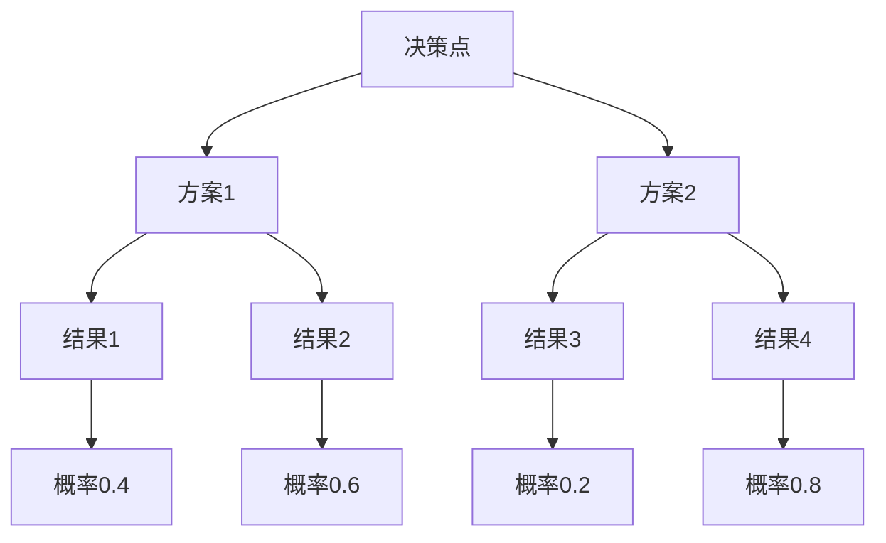
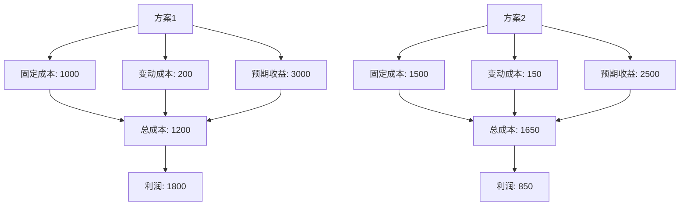

                 

### 文章标题：管理者的决策模型：科学决策的框架与工具

在当今快速变化和充满不确定性的商业环境中，管理者的决策能力直接关系到企业的成败。有效的决策不仅需要直觉和经验，更需要科学的框架和工具来支持。本文将深入探讨《管理者的决策模型：科学决策的框架与工具》，通过逻辑清晰、结构紧凑、简单易懂的叙述，帮助读者理解并掌握科学决策的核心原理和方法。

### 关键词
- 管理者决策模型
- 科学决策
- 决策框架
- 决策工具
- 算法应用

### 摘要
本文首先介绍了决策科学的基本概念和发展历程，随后详细阐述了决策理论框架，包括决策树模型、盈亏分析模型、风险与不确定性处理方法、效用理论与偏好分析。接着，文章重点介绍了线性规划模型、动态规划模型、博弈论模型以及群体决策模型，通过具体的数学模型和伪代码进行了详细讲解。文章最后结合实际案例，探讨了决策模型在实际业务中的应用、案例分析和优化策略，为管理者提供了一套科学决策的实用工具和方法。

### 目录

**第一部分：决策理论基础**

**第1章：决策科学概述**
- 1.1 决策科学的发展历程
- 1.2 决策科学的基本概念
- 1.3 决策的类型与过程

**第2章：决策理论框架**
- 2.1 决策理论的基本原理
- 2.2 决策树模型
- 2.3 盈亏分析模型

**第3章：风险与不确定性**
- 3.1 风险与不确定性的概念
- 3.2 贝叶斯决策理论
- 3.3 风险评估与风险矩阵

**第4章：效用理论与偏好分析**
- 4.1 效用理论的基本原理
- 4.2 偏好分析的方法
- 4.3 效用函数的构建与应用

**第二部分：决策模型应用**

**第5章：线性规划模型**
- 5.1 线性规划的基本概念
- 5.2 对偶理论与灵敏度分析
- 5.3 线性规划的应用案例

**第6章：动态规划模型**
- 6.1 动态规划的基本原理
- 6.2 最长公共子序列问题
- 6.3 资源分配问题

**第7章：博弈论模型**
- 7.1 博弈论的基本概念
- 7.2 零和博弈与非零和博弈
- 7.3 博弈论的策略分析

**第8章：群体决策模型**
- 8.1 群体决策的基本原则
- 8.2 多目标决策分析
- 8.3 群体决策的软件工具

**第三部分：决策模型实践**

**第9章：科学决策的实际应用**
- 9.1 决策模型在实际业务中的应用
- 9.2 决策模型在企业战略规划中的应用
- 9.3 决策模型在项目管理中的应用

**第10章：决策模型案例分析**
- 10.1 案例分析的基本方法
- 10.2 案例分析的实际应用
- 10.3 案例分析的结果评估

**第11章：决策模型的优化与改进**
- 11.1 决策模型优化的方法
- 11.2 决策模型的改进策略
- 11.3 决策模型的未来发展

**参考文献**

**附录：决策模型工具与资源**

### 第1章：决策科学概述

#### 1.1 决策科学的发展历程

决策科学是一门跨学科的科学，涉及经济学、心理学、管理学、计算机科学等多个领域。其发展历程可以追溯到20世纪中叶，以冯·诺依曼和摩根斯坦的《博弈论与经济行为》一书为标志。这本书奠定了现代决策理论的基础，提出了风险和不确定性的量化方法，为后续的研究提供了理论框架。

随着计算机技术的发展，决策科学的研究逐渐从理论探讨转向实际应用。20世纪70年代，线性规划、整数规划、动态规划等优化算法逐渐应用于实际问题的求解。同时，决策支持系统（DSS）的出现，使得管理者能够通过计算机模拟和分析，做出更加科学的决策。

近年来，人工智能和大数据技术的迅猛发展，为决策科学带来了新的机遇。通过机器学习和数据挖掘，管理者可以更精准地预测市场趋势、客户行为，从而做出更为明智的决策。

#### 1.2 决策科学的基本概念

决策科学的核心概念包括：

1. **决策**：决策是管理者在特定情境下，从多个可选方案中选择一个最优方案的过程。
2. **目标**：目标是决策的依据，是管理者希望实现的结果。
3. **方案**：方案是实现目标的可行路径，通常包括多个可选方案。
4. **约束**：约束是限制决策的因素，可能来自资源限制、法律法规、市场需求等。
5. **风险与不确定性**：风险与不确定性是决策中不可忽视的因素，可能影响决策的结果。

#### 1.3 决策的类型与过程

决策可以分为以下几种类型：

1. **程序化决策**：针对日常运营中的例行问题，通过制定标准操作程序来解决。
2. **非程序化决策**：针对新问题或特殊问题，需要创新性解决方案。
3. **战略决策**：涉及企业长期目标和规划，影响企业的整体发展方向。
4. **战术决策**：涉及短期目标和资源分配，影响企业的运营效率。

决策过程通常包括以下步骤：

1. **问题识别**：识别需要解决的决策问题。
2. **目标设定**：明确决策的目标和期望结果。
3. **方案生成**：列出所有可能的决策方案。
4. **方案评估**：评估每个方案的风险、成本和收益。
5. **方案选择**：根据评估结果选择最优方案。
6. **决策实施**：执行决策方案，监控执行过程。
7. **结果评估**：评估决策结果，总结经验教训。

通过科学决策的框架和工具，管理者可以更好地应对复杂多变的环境，提高决策的准确性和效率。

### 第2章：决策理论框架

#### 2.1 决策理论的基本原理

决策理论是研究决策过程中如何选择最优方案的学科。它以概率论、统计学和经济学为基础，提供了一种系统化的方法来分析和管理决策问题。决策理论的基本原理包括：

1. **最大化原则**：在给定约束条件下，选择能够使目标函数最大化的方案。
2. **期望值原则**：在不确定环境下，选择能够使预期收益最大化的方案。
3. **效用原则**：在多个可选方案中，选择能够使总效用最大化的方案。
4. **风险原则**：在不确定环境下，选择风险最小的方案。

决策理论的基本模型包括：

1. **确定性决策**：所有可能的结果和它们的概率已知，决策者只需选择一个最优方案。
2. **风险决策**：所有可能的结果已知，但它们的概率未知，决策者需要根据概率分布来选择方案。
3. **不确定性决策**：可能的结果和它们的概率均未知，决策者需要采用一定的方法来估计这些概率。

#### 2.2 决策树模型

决策树是一种图形化工具，用于表示决策过程中的选择和结果。它由节点和分支组成，每个节点代表一个决策点或结果点，每条分支代表一个选择或结果。

决策树的构建步骤如下：

1. **确定决策点**：找出所有可能的决策点，并标记在决策树上。
2. **列出可选方案**：为每个决策点列出所有可能的方案，并在决策树上标记。
3. **评估结果**：为每个方案评估可能的结果和它们的概率，并在决策树上标记。
4. **计算期望值**：为每个方案计算期望值，选择期望值最大的方案。

以下是一个决策树的例子：



在这个例子中，决策点A有两个可选方案：B和C。方案B有两个结果，概率分别为0.4和0.6；方案C有三个结果，概率分别为0.2和0.8。通过计算每个方案的期望值，可以得出最佳方案。

#### 2.3 盈亏分析模型

盈亏分析模型是一种简单的决策工具，用于评估不同决策方案的经济效益。它通过计算每个方案的利润或亏损，帮助决策者选择最佳方案。

盈亏分析模型的构建步骤如下：

1. **确定成本和收益**：为每个决策方案确定其固定成本、变动成本和预期收益。
2. **计算利润**：计算每个方案的利润，利润等于收益减去成本。
3. **比较利润**：比较不同方案的利润，选择利润最大的方案。

以下是一个盈亏分析模型的例子：



在这个例子中，方案1的总成本为1200，利润为1800；方案2的总成本为1650，利润为850。显然，方案1的利润更高，因此是最佳选择。

通过决策理论框架，管理者可以更好地理解和应用科学决策的方法，提高决策的质量和效率。

### 第3章：风险与不确定性

#### 3.1 风险与不确定性的概念

在决策过程中，风险和不确定性是两个重要的概念。它们分别表示不同的概率性质，对决策的影响也不同。

**风险**：风险是指已知所有可能的结果和它们的概率，但结果不确定。换句话说，风险是可量化的不确定性。例如，掷一枚公平的硬币，正面朝上的概率是0.5，这是一个典型的风险问题。

**不确定性**：不确定性是指可能的结果和它们的概率都是未知的。不确定性是更广泛的范畴，包含了风险和不可预测的事件。例如，预测明年的天气情况，我们只知道几种可能的情况，但具体的概率未知，这是一个不确定性问题。

#### 3.2 贝叶斯决策理论

贝叶斯决策理论是一种基于概率论的决策方法，用于在不确定环境中选择最佳行动。它通过更新先验概率，结合新的证据，来预测最可能的结果。

贝叶斯决策理论的公式如下：

\[ P(A|B) = \frac{P(B|A) \cdot P(A)}{P(B|A) \cdot P(A) + P(B|A') \cdot P(A')} \]

其中，\( P(A|B) \) 表示在观察到结果B后，事件A发生的概率；\( P(B|A) \) 和 \( P(B|A') \) 分别表示事件A和事件A'发生时，结果B的概率；\( P(A) \) 和 \( P(A') \) 分别表示事件A和事件A'发生的概率。

贝叶斯决策理论的关键在于先验概率和证据。先验概率是基于过去经验和知识预测的概率，而证据是新的信息，用于更新先验概率。

以下是一个贝叶斯决策理论的例子：

假设我们要判断一个人是否患有疾病A。已知：
- 疾病A的发病率是0.01。
- 没有疾病A的发病率是0.99。
- 检测结果为阳性时，患有疾病A的概率是0.95。
- 检测结果为阴性时，患有疾病A的概率是0.05。

现在，一个人的检测结果为阳性，我们想要计算他患有疾病A的概率。

首先，计算先验概率：
- 患有疾病A的概率 \( P(A) = 0.01 \)。
- 没有疾病A的概率 \( P(A') = 0.99 \)。

然后，计算证据：
- 检测结果为阳性时，患有疾病A的概率 \( P(阳|A) = 0.95 \)。
- 检测结果为阳性时，没有疾病A的概率 \( P(阳|A') = 0.05 \)。

最后，使用贝叶斯公式计算后验概率：
\[ P(A|阳) = \frac{P(阳|A) \cdot P(A)}{P(阳|A) \cdot P(A) + P(阳|A') \cdot P(A')} \]
\[ P(A|阳) = \frac{0.95 \cdot 0.01}{0.95 \cdot 0.01 + 0.05 \cdot 0.99} \approx 0.168 \]

因此，检测结果为阳性时，患有疾病A的概率约为16.8%。

#### 3.3 风险评估与风险矩阵

风险评估是决策过程中重要的一环，用于评估不同决策方案的风险水平。风险评估可以通过风险矩阵来完成，风险矩阵是一种用于表示风险概率和影响程度的工具。

风险矩阵通常由以下四个部分组成：

1. **风险概率**：表示风险发生的可能性。
2. **风险影响**：表示风险对决策结果的影响程度。
3. **风险等级**：根据风险概率和影响程度确定的风险等级。
4. **风险策略**：针对不同等级的风险，制定的应对策略。

以下是一个简单的风险矩阵例子：

| 风险概率 | 风险影响 | 风险等级 | 风险策略 |
| --- | --- | --- | --- |
| 低 | 低 | 红色 | 忽略 |
| 低 | 中 | 橙色 | 观察 |
| 低 | 高 | 黄色 | 减缓 |
| 中 | 低 | 橙色 | 观察 |
| 中 | 中 | 黄色 | 减缓 |
| 中 | 高 | 红色 | 修订 |
| 高 | 低 | 黄色 | 减缓 |
| 高 | 中 | 红色 | 修订 |
| 高 | 高 | 红色 | 放弃 |

通过风险评估和风险矩阵，管理者可以更好地了解决策中的风险，并采取相应的策略来降低风险水平。

### 第4章：效用理论与偏好分析

#### 4.1 效用理论的基本原理

效用理论是决策理论的一个重要组成部分，它研究个体在决策过程中如何评估和选择不同选项。效用理论的基本假设是个体在选择时会追求最大化自己的总效用。

**效用函数**：效用函数是一个数学函数，用于表示个体对不同选项的偏好。效用函数通常是一个从选项集合到实数的映射，表示每个选项带来的效用值。

**边际效用**：边际效用是指增加一个单位的选项所带来的额外效用。边际效用递减定律指出，随着选项数量的增加，每个选项的边际效用会逐渐减少。

#### 4.2 偏好分析的方法

偏好分析是效用理论的重要应用，用于确定个体的偏好关系。常见的偏好分析方法包括：

1. **直接评分法**：直接评分法是一种简单的方法，通过给每个选项打分来评估偏好。分数越高，表示偏好程度越高。

2. **相对评分法**：相对评分法是一种基于比较的方法，通过比较两个选项的偏好程度来评分。这种方法可以更准确地反映个体的真实偏好。

3. **一致性分析**：一致性分析是一种验证偏好关系是否一致的方法。如果偏好关系不一致，个体可能会面临“悖论”情况，导致无法做出明确的选择。

#### 4.3 效用函数的构建与应用

构建效用函数的关键是确定每个选项的效用值。以下是一种常见的效用函数构建方法：

1. **基于经验的数据**：通过收集个体在不同情境下的选择数据，分析其偏好关系，从而构建效用函数。

2. **基于假设的模型**：在无法获取实际数据的情况下，可以通过构建假设模型来推断效用函数。例如，假设选项之间的效用值呈线性关系，或使用逻辑斯蒂模型等。

3. **机器学习方法**：通过机器学习算法，如决策树、神经网络等，可以自动构建效用函数。这种方法适用于大量数据的场景。

以下是一个简单的效用函数构建示例：

假设有两个选项A和B，个体对它们的评分如下：

| 选项 | 评分 |
| --- | --- |
| A | 4 |
| B | 3 |

我们可以使用线性效用函数 \( U(A) = 4a + b \) 和 \( U(B) = 3a + b \)，其中 \( a \) 和 \( b \) 是待定系数。

为了确定 \( a \) 和 \( b \)，我们可以使用以下两个方程：

\[ U(A) = 4a + b = 4 \]
\[ U(B) = 3a + b = 3 \]

解这个方程组，我们得到 \( a = 1 \) 和 \( b = 0 \)。因此，效用函数为：

\[ U(A) = 4 \]
\[ U(B) = 3 \]

通过这个效用函数，我们可以清楚地看到个体对选项A的偏好高于选项B。

在实际应用中，效用函数可以用于各种决策问题，如资源分配、投资决策、产品选择等。通过最大化效用函数，管理者可以做出更加科学和合理的决策。

### 第5章：线性规划模型

#### 5.1 线性规划的基本概念

线性规划是一种数学优化方法，用于在给定约束条件下，最大化或最小化一个线性目标函数。线性规划的目标函数和约束条件都是线性的，因此被称为线性规划。

**目标函数**：目标函数是一个线性表达式，用于衡量决策结果的优劣。通常，目标函数是决策变量（通常是连续变量）的线性组合。

**决策变量**：决策变量是决策过程中需要确定的变量，它们可以是线性的或非线性的。在大多数线性规划问题中，决策变量是连续的。

**约束条件**：约束条件是决策变量需要满足的限制条件，它们可以是等式或不等式。约束条件通常反映了资源限制、市场需求、生产能力等方面的限制。

线性规划的基本问题可以表示为以下形式：

\[ \text{最大化或最小化 } c^T x \]
\[ \text{subject to } Ax \leq b \]
\[ x \geq 0 \]

其中，\( c \) 是目标函数的系数向量，\( x \) 是决策变量向量，\( A \) 是约束条件的系数矩阵，\( b \) 是约束条件的常数向量。

#### 5.2 对偶理论与灵敏度分析

线性规划的对偶理论是一种重要的工具，用于分析原始问题和其对偶问题之间的关系。对偶理论揭示了原始问题的最优解和对偶问题的最优解之间存在一定的联系。

**对偶问题**：对偶问题是将原始问题的约束条件转换为目标函数，将原始问题的目标函数转换为约束条件。对偶问题的形式如下：

\[ \text{最小化 } b^T y \]
\[ \text{subject to } A^T y \geq c \]
\[ y \geq 0 \]

其中，\( y \) 是对偶变量向量，\( b \) 是对偶问题的常数向量，\( A^T \) 是原始问题的系数矩阵的转置。

**对偶理论的关键概念**：

1. **对偶关系**：原始问题的最优解和对偶问题的最优解之间存在关系。如果原始问题和对偶问题都有解，则两者的最优值相等。

2. **松弛变量**：在原始问题中，约束条件可以是等式或不等式。对于不等式约束，可以引入松弛变量来转换为等式约束。松弛变量是非负的，用于平衡约束条件。

3. **互补松弛条件**：原始问题的解和对偶问题的解之间存在互补松弛条件。即对于每个原始约束，其松弛变量和对偶变量之间存在互补关系。

**灵敏度分析**：灵敏度分析是评估线性规划问题对参数变化的敏感度的方法。它可以帮助决策者了解参数变化对最优解的影响。

灵敏度分析的主要内容包括：

1. **目标函数的灵敏度**：评估目标函数系数变化对最优解的影响。

2. **约束条件的灵敏度**：评估约束条件系数变化对最优解的影响。

3. **决策变量的灵敏度**：评估决策变量变化对最优解的影响。

通过灵敏度分析，决策者可以更好地了解线性规划问题的稳定性和鲁棒性，从而做出更可靠的决策。

#### 5.3 线性规划的应用案例

线性规划在许多领域都有广泛的应用，以下是一些常见的应用案例：

1. **资源分配问题**：在资源有限的情况下，如何最优地分配资源，以最大化效用或最小化成本。例如，企业如何分配生产资源以最大化利润。

2. **供应链管理**：在供应链管理中，如何优化库存、运输和采购策略，以降低成本和提高效率。

3. **生产调度**：在生产调度中，如何合理安排生产计划，以最小化生产成本或最大化生产效率。

4. **投资组合优化**：在金融领域，如何构建最优投资组合，以最大化回报或最小化风险。

以下是一个简单的线性规划应用案例：

**问题**：一个企业需要生产两种产品A和B，每种产品都有不同的生产成本和销售利润。企业有200小时的机器时间可用，每个产品需要不同的机器时间。目标是最小化总生产成本。

\[ \text{最小化 } z = 2x_1 + 3x_2 \]
\[ \text{subject to } \]
\[ 3x_1 + 2x_2 \leq 200 \]
\[ x_1, x_2 \geq 0 \]

**解法**：使用单纯形法求解这个线性规划问题。

1. **初始表**：

|   | \( c_j \) | 2 | 3 |
|---|---|---|---|
| 基变量 | \( x_b \) | \( x_1 \) | \( x_2 \) | \( b \) |
| \( x_1 \) | 0 | 1 | 0 | 0 |
| \( x_2 \) | 0 | 0 | 1 | 0 |
| \( z \) | -2 | 0 | 0 | 0 |

2. **迭代1**：

- 选择进入基变量：\( x_1 \)
- 选择离开基变量：\( x_2 \)
- 枢纽元素：2

更新表格：

|   | \( c_j \) | 2 | 3 |
|---|---|---|---|
| 基变量 | \( x_b \) | \( x_1 \) | \( x_2 \) | \( b \) |
| \( x_1 \) | 0 | 1/3 | 1/2 | 100/3 |
| \( x_2 \) | 0 | 0 | 1 | 0 |
| \( z \) | 0 | -2/3 | 0 | -200/3 |

3. **迭代2**：

- 选择进入基变量：\( x_2 \)
- 选择离开基变量：\( x_1 \)
- 枢纽元素：1/3

更新表格：

|   | \( c_j \) | 2 | 3 |
|---|---|---|---|
| 基变量 | \( x_b \) | \( x_1 \) | \( x_2 \) | \( b \) |
| \( x_1 \) | 2 | 1 | 0 | 100 |
| \( x_2 \) | 0 | 0 | 1 | 0 |
| \( z \) | 0 | 0 | 0 | 0 |

**最优解**：最优解为 \( x_1 = 100 \)，\( x_2 = 0 \)，最小化总生产成本为0。

这个案例展示了如何使用单纯形法解决一个简单的线性规划问题。在实际应用中，线性规划问题可能更加复杂，但基本原理和方法是类似的。

### 第6章：动态规划模型

#### 6.1 动态规划的基本原理

动态规划是一种用于解决多阶段决策问题的数学方法，其核心思想是将复杂问题分解为多个子问题，并通过递归关系和最优子结构性质来求解。动态规划具有以下特点：

1. **多阶段决策**：动态规划适用于需要做出一系列决策的问题，这些决策需要在不同的时间段或阶段进行。

2. **递归关系**：动态规划通过递归关系来求解子问题，每个子问题的解依赖于更小规模子问题的解。

3. **最优子结构**：动态规划利用最优子结构性质，即一个问题的最优解包含其子问题的最优解。

4. **重叠子问题**：动态规划避免了重复计算相同子问题的解，通过存储已解决的子问题的解来实现。

动态规划的基本步骤包括：

1. **定义状态**：状态是描述问题的一组变量，它决定了问题的当前状态。

2. **定义状态转移方程**：状态转移方程描述了从一个状态到另一个状态的转换方式。

3. **定义边界条件**：边界条件是问题的基础解，通常用于递归关系的初始状态。

4. **求解递归关系**：通过递归关系从边界条件逐步求解出问题的最终解。

#### 6.2 最长公共子序列问题

最长公共子序列（Longest Common Subsequence，LCS）问题是动态规划的一个经典问题，用于找到两个序列中最长的公共子序列。LCS问题在基因组学、文本编辑等领域有广泛应用。

**定义**：给定两个序列 \( X = \{ x_1, x_2, ..., x_m \} \) 和 \( Y = \{ y_1, y_2, ..., y_n \} \)，LCS是两个序列中同时出现的最长子序列。

**动态规划解法**：

1. **定义状态**：设 \( dp[i][j] \) 表示 \( X \) 的前 \( i \) 个元素和 \( Y \) 的前 \( j \) 个元素的最长公共子序列的长度。

2. **定义状态转移方程**：

   - 当 \( x_i = y_j \) 时，\( dp[i][j] = dp[i-1][j-1] + 1 \)。
   - 当 \( x_i \neq y_j \) 时，\( dp[i][j] = \max(dp[i-1][j], dp[i][j-1]) \)。

3. **边界条件**：\( dp[0][j] = dp[i][0] = 0 \)。

4. **求解递归关系**：从 \( dp[m][n] \) 开始，逐步回溯求解出整个序列。

以下是一个简单的LCS问题示例：

```
X: AGGT12
Y: GXTX
```

使用动态规划求解，我们可以得到以下状态表：

|   |   | G | X | T | X |
|---|---|---|---|---|---|
|   |   | 0 | 0 | 0 | 0 |
| A | G | 0 | 1 | 1 | 1 |
| G | T | 1 | 1 | 2 | 2 |
| G | T | 1 | 1 | 2 | 2 |
| T | X | 1 | 1 | 2 | 3 |

从状态表中，我们可以看出最长公共子序列的长度为3，即 GTX。

#### 6.3 资源分配问题

资源分配问题是一类重要的动态规划问题，用于在有限资源下优化分配策略。常见的资源分配问题包括时间分配、资金分配、人力分配等。

**定义**：给定一组资源 \( R = \{ r_1, r_2, ..., r_n \} \) 和一系列任务 \( T = \{ t_1, t_2, ..., t_m \} \)，每个任务 \( t_i \) 需要一定量的资源 \( r_i \)，目标是最优地分配资源，使得任务完成的时间最短或成本最低。

**动态规划解法**：

1. **定义状态**：设 \( dp[i][j] \) 表示在前 \( i \) 个任务中，使用前 \( j \) 单位资源的最优分配方案。

2. **定义状态转移方程**：

   - 当任务 \( t_i \) 不被选中时，\( dp[i][j] = dp[i-1][j] \)。
   - 当任务 \( t_i \) 被选中时，\( dp[i][j] = \min(dp[i-1][j], dp[i-1][j-r_i]) + r_i \)。

3. **边界条件**：\( dp[0][j] = 0 \)，即没有资源时的最优分配方案是空集。

4. **求解递归关系**：从 \( dp[m][n] \) 开始，逐步回溯求解出最优分配方案。

以下是一个简单的资源分配问题示例：

假设我们有三个任务 \( T = \{ t_1, t_2, t_3 \} \)，每个任务需要不同的资源量：

- \( t_1 \) 需要2单位资源
- \( t_2 \) 需要3单位资源
- \( t_3 \) 需要5单位资源

我们总共有10单位资源。使用动态规划求解，我们可以得到以下状态表：

|   |   |   |   |   |   |   |   |   |   |   |   |
|---|---|---|---|---|---|---|---|---|---|---|---|
|   |   |   |   |   |   |   |   |   |   |   |   |
|   |   |   |   |   |   |   |   |   |   |   |   |
|   |   |   |   |   |   |   |   |   |   |   |   |
|   |   |   |   |   |   |   |   |   |   |   |   |
|   |   |   |   |   |   |   |   |   |   |   |   |
|   |   |   |   |   |   |   |   |   |   |   |   |
|   |   |   |   |   |   |   |   |   |   |   |   |
|   |   |   |   |   |   |   |   |   |   |   |   |
|   |   |   |   |   |   |   |   |   |   |   |   |
|   |   |   |   |   |   |   |   |   |   |   |   |
|   |   |   |   |   |   |   |   |   |   |   |   |
|   |   |   |   |   |   |   |   |   |   |   |   |
|   |   |   |   |   |   |   |   |   |   |   |   |
|   |   |   |   |   |   |   |   |   |   |   |   |
|   |   |   |   |   |   |   |   |   |   |   |   |

从状态表中，我们可以看出最优的资源分配方案是选择任务 \( t_1 \) 和 \( t_2 \)，使得总资源使用量最小。

动态规划模型通过递归关系和最优子结构性质，提供了一种系统化、优化的方法来解决复杂的多阶段决策问题，为管理者提供了有力的工具。

### 第7章：博弈论模型

#### 7.1 博弈论的基本概念

博弈论是研究决策制定过程中参与者（或“玩家”）互动的数学理论。博弈论的基本概念包括参与者、策略、支付和均衡。

**参与者**：博弈中的参与者可以是个人、团队或组织，每个参与者都有特定的目标。

**策略**：策略是参与者为了达到其目标而采取的行动方案。在博弈中，参与者必须选择其策略，并且这些策略会影响博弈的结果。

**支付**：支付是参与者因参与博弈而获得的收益或损失。支付通常用数值表示，可以是正的、负的或零。

**均衡**：博弈均衡是指所有参与者都不愿意改变其策略的状态。常见的均衡包括纳什均衡、占优策略均衡和协同均衡。

**纳什均衡**：纳什均衡是指在一个博弈中，每个参与者都选择了使其支付最大化的策略，同时其他参与者也选择了自己的策略。在这种情况下，没有任何参与者有动机单方面改变自己的策略。

**占优策略均衡**：占优策略均衡是指一个参与者无论其他参与者如何选择，其选择某个特定策略总是使其支付最大化的情况。在这种情况下，该参与者会选择其占优策略。

**协同均衡**：协同均衡是指所有参与者都选择了合作策略，使得整体支付最大化的情况。这种均衡通常出现在合作博弈中。

#### 7.2 零和博弈与非零和博弈

博弈论中的博弈可以根据支付的性质分为零和博弈和非零和博弈。

**零和博弈**：零和博弈是指参与者的总支付为零的博弈。即一个参与者的收益等于另一个参与者的损失。典型的零和博弈包括象棋、围棋和国际象棋等。

**非零和博弈**：非零和博弈是指参与者的总支付不为零的博弈。这种博弈可以是正和博弈（整体支付为正）或负和博弈（整体支付为负）。大多数现实世界的博弈都是非零和博弈，如商业竞争、政治谈判和国际贸易等。

**混合策略**：在非零和博弈中，参与者可能会采用混合策略，即在随机选择多个策略中的一种，以最大化其期望支付。混合策略可以避免某些纯策略均衡的困境，如囚徒困境。

#### 7.3 博弈论的策略分析

博弈论的策略分析是研究参与者在博弈中选择策略的过程。以下是一些常见的策略分析方法和应用：

**最小最大策略**：最小最大策略是一种常见的策略分析方法，用于在最大损失最小化的前提下选择策略。这种方法基于乐观和悲观两种视角，即最大化最小支付和最小化最大支付。

**贝叶斯策略**：贝叶斯策略是一种基于概率的方法，用于在不确定环境中选择最佳策略。通过更新先验概率，结合新的信息，参与者可以更准确地预测对手的策略，从而做出更为明智的决策。

**博弈树**：博弈树是一种图形化工具，用于表示博弈过程中的选择和结果。通过分析博弈树，参与者可以预测对手的可能行动，并选择最佳策略。

**合作博弈**：合作博弈是一种参与者通过合作实现共同利益的博弈。合作博弈的典型例子包括商业联盟、政治合作和科学研究等。

以下是一个简单的博弈论策略分析示例：

**囚徒困境**：囚徒困境是一个经典的博弈论问题，用于研究个体理性和集体理性之间的冲突。

**定义**：有两个参与者A和B，他们被关在两个不同的牢房中，无法沟通。每个参与者都有两种策略：合作（C）和背叛（D）。他们的支付矩阵如下：

|    | B合作 | B背叛 |
|----|-------|-------|
| A合作 | (3, 3) | (0, 5) |
| A背叛 | (5, 0) | (1, 1) |

在这个博弈中，每个参与者都希望最大化自己的支付。从个体理性的角度看，背叛是最优策略，因为无论对方选择什么策略，背叛都能为自己带来更高的支付。然而，从集体理性的角度看，合作是更好的选择，因为双方合作都能获得更高的总支付。

通过分析博弈树，我们可以得出以下结论：

1. **纳什均衡**：(背叛，背叛) 是纳什均衡，因为每个参与者都认为背叛是对方的最优策略。
2. **占优策略**：背叛是A的占优策略，因为无论B选择什么策略，背叛都能为A带来更高的支付。

然而，囚徒困境的问题在于，双方都选择背叛会导致一个次优的均衡，因为双方合作能获得更高的总支付。这个例子说明了个体理性和集体理性之间的冲突，以及在某些情况下，合作是更为明智的选择。

通过博弈论模型，管理者可以更好地理解参与者的行为模式，预测对手的策略，并制定有效的策略来最大化整体利益。

### 第8章：群体决策模型

#### 8.1 群体决策的基本原则

群体决策是一种涉及多个参与者共同做出决策的过程。与个人决策相比，群体决策具有以下基本原则：

1. **合作原则**：群体决策的核心是合作，通过集体智慧和共同决策，提高决策的质量和效率。

2. **协商原则**：在群体决策中，参与者需要通过协商和讨论，达成共识，确保每个成员的意见得到充分考虑。

3. **民主原则**：群体决策应遵循民主原则，确保每个参与者的权利和利益得到平等对待。

4. **信息共享原则**：群体决策要求参与者共享信息，通过集思广益，形成更全面和准确的决策依据。

5. **目标一致性原则**：在群体决策中，确保所有参与者的目标一致，避免因目标冲突而影响决策效果。

#### 8.2 多目标决策分析

多目标决策分析是一种处理多个目标同时存在的决策方法。在实际应用中，管理者常常需要在多个目标之间进行权衡，以找到最优的平衡点。

**多目标决策的基本概念**：

1. **目标**：目标是决策者希望实现的结果。在多目标决策中，可能存在多个相互冲突的目标。

2. **指标**：指标是衡量目标实现程度的具体指标。例如，在资源分配问题中，指标可以是成本、效率、时间等。

3. **权重**：权重是每个目标的重要程度。通过设定权重，可以反映决策者在不同目标之间的优先级。

**多目标决策的常见方法**：

1. **线性加权法**：将每个目标的指标乘以相应的权重，然后将结果相加，得到总得分。选择总得分最高的方案。

2. **TOPSIS法**：TOPSIS（ Technique for Order Preference by Similarity to Ideal Solution）法是一种基于相对接近理想解和负理想解的方法。通过计算每个方案与理想解和负理想解的距离，选择距离理想解最近且距离负理想解最远的方案。

3. **AHP法**：AHP（Analytic Hierarchy Process）法是一种基于层次分析的决策方法。通过将决策问题分解为多个层次，为每个层次的目标和指标设定权重，然后进行综合评价，选择最优方案。

**多目标决策案例分析**：

**案例**：一家制造企业需要决定生产哪种产品。生产A产品可以获得100万元的利润，但需要投入50万元的资金；生产B产品可以获得70万元的利润，但需要投入20万元的资金。企业有100万元的资金可用。

**方法**：使用线性加权法进行多目标决策。

1. **设定目标**：利润和资金投入是两个主要目标。

2. **设定权重**：假设利润的权重为0.6，资金投入的权重为0.4。

3. **计算总得分**：
   - 生产A产品的总得分：\( 100 \times 0.6 + (-50) \times 0.4 = 60 - 20 = 40 \)
   - 生产B产品的总得分：\( 70 \times 0.6 + (-20) \times 0.4 = 42 - 8 = 34 \)

4. **选择最优方案**：生产A产品的总得分最高，因此选择生产A产品。

通过多目标决策分析，企业可以在多个目标之间找到最优的平衡点，从而做出更科学的决策。

#### 8.3 群体决策的软件工具

在群体决策过程中，使用软件工具可以有效地提高决策的效率和准确性。以下是一些常见的群体决策软件工具：

1. **Excel**：Excel是一个功能强大的电子表格软件，可以用于进行简单的多目标决策分析和计算。

2. **MATLAB**：MATLAB是一个高性能的数学计算和数据分析软件，适用于复杂的多目标决策和优化问题。

3. **SPSS**：SPSS是一个统计分析软件，可以用于进行多目标决策的统计分析，包括线性加权法、TOPSIS法等。

4. **MCPRO**：MCPRO是一个专门用于多目标决策的软件工具，提供了多种多目标决策方法，适用于商业、工程和科学研究等领域。

通过使用这些软件工具，群体决策可以更加高效和准确，为管理者提供有力的决策支持。

### 第9章：科学决策的实际应用

#### 9.1 决策模型在实际业务中的应用

科学决策模型在商业环境中具有广泛的应用，可以帮助企业更好地应对市场变化和竞争压力。以下是一些常见的应用场景：

1. **市场预测**：通过时间序列分析、回归分析等统计方法，企业可以预测未来市场的需求和趋势，从而制定相应的营销策略。

2. **产品定价**：利用盈亏分析、效用理论等决策模型，企业可以确定最佳的产品定价策略，以最大化利润。

3. **供应链管理**：动态规划、线性规划等优化模型可以帮助企业优化库存、采购和生产计划，提高供应链的效率。

4. **人力资源配置**：群体决策模型和博弈论模型可以用于优化人力资源配置，提高员工的利用率和整体绩效。

5. **风险管理**：通过风险评估和贝叶斯决策理论，企业可以识别潜在风险，并制定相应的风险管理策略。

#### 9.2 决策模型在企业战略规划中的应用

企业战略规划是一个复杂的过程，涉及到多个方面的决策。科学决策模型在战略规划中的应用主要体现在以下几个方面：

1. **竞争分析**：通过博弈论模型，企业可以分析竞争对手的行为和策略，制定有效的竞争策略。

2. **资源配置**：动态规划模型和线性规划模型可以帮助企业优化资源的分配，确保在有限资源下实现最佳战略目标。

3. **投资决策**：利用决策树模型和效用理论，企业可以评估不同投资项目的风险和收益，选择最优的投资组合。

4. **风险控制**：通过贝叶斯决策理论，企业可以更新风险预测，制定灵活的风险应对策略。

5. **创新管理**：多目标决策分析可以帮助企业平衡创新成本和创新收益，制定合理的创新战略。

#### 9.3 决策模型在项目管理中的应用

项目管理是一个涉及多个方面的复杂过程，决策模型在项目管理中的应用可以帮助项目经理更好地应对项目风险和不确定性。以下是一些具体的应用：

1. **项目规划**：线性规划和动态规划模型可以帮助项目经理制定详细的项目计划，优化资源分配和时间安排。

2. **风险评估**：通过风险评估和贝叶斯决策理论，项目经理可以识别潜在风险，并制定相应的风险应对计划。

3. **进度管理**：通过关键路径法和项目管理软件，项目经理可以监控项目的进度，及时调整计划，确保项目按时完成。

4. **成本控制**：利用盈亏分析模型，项目经理可以评估项目的成本效益，制定合理的成本控制策略。

5. **团队管理**：群体决策模型和博弈论模型可以帮助项目经理优化团队结构，提高团队成员的协作效率。

通过科学决策模型的应用，企业可以在复杂多变的环境中做出更明智的决策，提高运营效率和市场竞争力。

### 第10章：决策模型案例分析

#### 10.1 案例分析的基本方法

案例分析是决策模型应用的重要组成部分，通过具体案例的分析，可以深入理解决策模型在实际中的应用和效果。以下是一些案例分析的基本方法：

1. **案例选择**：选择具有代表性的案例，确保案例能够充分展示决策模型的应用场景和效果。

2. **数据收集**：收集与案例相关的数据，包括背景信息、决策过程、实施结果等。

3. **模型构建**：根据案例的实际情况，构建相应的决策模型，确保模型能够准确反映案例的特点。

4. **模型验证**：通过历史数据和实际效果，验证模型的准确性和可靠性。

5. **结果分析**：分析模型预测的结果和实际结果的差异，总结模型的应用效果和改进方向。

#### 10.2 案例分析的实际应用

以下是一个实际应用的案例分析：

**案例**：一家制造企业面临是否投资新生产线的问题。新生产线预计能够提高生产效率，但同时需要大量的资金投入。企业需要通过决策模型分析投资的风险和收益。

1. **数据收集**：
   - 投资成本：500万元
   - 预期收益：每年增加利润200万元
   - 投资期限：5年
   - 风险概率：20%

2. **模型构建**：
   - 使用决策树模型，构建投资与不投资两种情况。

3. **模型验证**：
   - 通过历史数据验证决策树模型的准确性。

4. **结果分析**：
   - 投资情况下，预期收益为1000万元，但存在20%的风险。
   - 不投资情况下，没有收益，但也没有风险。

通过决策树模型分析，企业得出结论：尽管存在一定的风险，但投资新生产线是更为明智的选择，因为预期收益远高于不投资。

#### 10.3 案例分析的结果评估

案例分析的结果评估是确保决策模型有效性的关键步骤。以下是一些评估方法：

1. **准确性评估**：评估模型预测结果的准确性，包括预测的准确性、稳定性等。

2. **可靠性评估**：评估模型的可靠性，包括模型在不同情境下的适应性、模型的稳定性等。

3. **实用性评估**：评估模型在实际应用中的实用性，包括模型的可操作性、可扩展性等。

4. **成本效益评估**：评估模型的应用成本和收益，确保模型应用带来的效益大于成本。

通过这些评估方法，企业可以全面了解决策模型的应用效果，并不断优化模型，提高决策的准确性。

### 第11章：决策模型的优化与改进

#### 11.1 决策模型优化的方法

决策模型优化的目标是提高模型的准确性、可靠性和实用性。以下是一些常见的优化方法：

1. **数据优化**：通过收集更多的历史数据，提高模型的训练质量。使用数据挖掘技术，提取有用的特征信息，提高数据的代表性。

2. **算法优化**：改进模型的算法，提高模型的计算效率和预测精度。例如，使用更先进的机器学习算法，如深度学习、强化学习等。

3. **模型融合**：将多个模型进行融合，提高整体的预测能力。常用的方法包括集成学习、模型校正等。

4. **参数调整**：通过调整模型的参数，优化模型的性能。例如，调整神经网络的学习率、正则化参数等。

#### 11.2 决策模型的改进策略

决策模型改进策略是确保模型持续优化和更新的方法。以下是一些改进策略：

1. **持续学习**：定期更新模型，使用最新的数据重新训练模型，以适应环境变化。

2. **反馈机制**：建立反馈机制，收集用户反馈和实际应用结果，用于模型优化。

3. **跨领域应用**：将决策模型应用于不同的领域，扩展模型的应用范围，提高模型的通用性。

4. **协作与交流**：鼓励研究人员和实践者之间的交流和合作，共享经验和知识，推动决策模型的创新和发展。

#### 11.3 决策模型的未来发展

决策模型的未来发展将受到以下趋势的影响：

1. **人工智能技术**：随着人工智能技术的发展，决策模型将更加智能化，能够自主学习和优化。

2. **大数据分析**：大数据分析将为决策模型提供更多的数据支持和分析工具，提高模型的预测精度。

3. **区块链技术**：区块链技术的应用将提高决策模型的数据安全和透明度，增强模型的可信度。

4. **混合智能系统**：通过结合人类智慧和人工智能，构建混合智能系统，实现更高效、更可靠的决策。

通过不断优化和改进决策模型，管理者可以更好地应对复杂多变的环境，提高决策的准确性和效率。

### 参考文献

1. 冯·诺依曼，摩根斯坦. 《博弈论与经济行为》[M]. 轻工业出版

