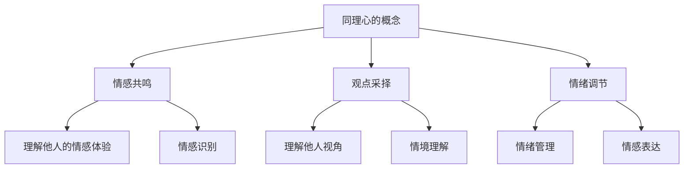

                 


### 文章标题
《管理者的同理心：理解并激励团队的艺术》

### 文章关键词
- 同理心
- 管理者
- 团队激励
- 领导力
- 情感共鸣
- 观点采择
- 情绪调节
- 沟通技巧

### 摘要
本文深入探讨了同理心在管理者角色中的重要性。通过详细阐述同理心的概念、构成要素，以及其在沟通、团队管理和领导力发展中的应用，本文旨在帮助管理者提升同理心能力，从而更有效地理解和激励团队成员。文章结构清晰，包含实践策略、挑战与应对方法，以及实际项目案例分析，旨在为管理者提供全面的理论和实践指导。

## 第一部分：同理心的基础

### 第1章：同理心的概念与重要性

#### 1.1 同理心的定义

同理心（Empathy）是指能够从他人的视角理解并感受其情感的能力。它不仅包括情感共鸣，即体验他人的情感，还涉及观点采择，即理解他人的想法和观点，以及情绪调节，即对他人的情绪反应进行适当的调节。在心理学中，同理心通常被视为一种复杂的认知和社会能力，对人际关系和社会互动具有深远的影响。

#### 1.2 同理心的重要性

同理心对于个人成长、团队建设和领导力具有重要意义。首先，同理心有助于个人情感的成熟和发展，使人更加开放和理解。其次，在团队环境中，同理心能够促进成员之间的信任和合作，从而提高团队的凝聚力和绩效。最后，对于管理者而言，同理心是构建高效领导力的重要基石，能够帮助领导者更好地理解员工的需求和期望，从而进行有效的激励和指导。

### 第2章：同理心的构成要素

#### 2.1 情感共鸣

情感共鸣是指能够感知并体验他人的情感状态。它涉及到情感识别，即能够准确地识别他人的情绪，以及情感体验，即能够在一定程度上模仿和体验他人的情感感受。情感共鸣是同理心的核心组成部分，能够帮助管理者更好地理解和回应团队成员的情感需求。

#### 2.2 观点采择

观点采择是指能够站在他人的角度思考问题，理解他人的观点和感受。这种能力有助于管理者在决策时考虑到不同利益相关者的立场，从而做出更全面和合理的决策。观点采择需要管理者具备良好的倾听能力和认知灵活性。

#### 2.3 情绪调节

情绪调节是指能够适当地管理自己和他人情绪的能力。情绪调节包括情绪管理和情感表达两个方面。情绪管理涉及对自己情绪的调节，以避免负面情绪对工作和人际关系的影响；情感表达则涉及对他人的情绪反应进行适当的表达，以促进沟通和理解。

## 第二部分：同理心的实践与应用

### 第3章：同理心在沟通中的应用

#### 3.1 沟通障碍与同理心

沟通障碍是许多团队中常见的挑战，而同理心能够有效地缓解这些问题。沟通障碍通常源于倾听不足、误解和缺乏同理心。通过提升同理心，管理者可以更好地理解团队成员的表达，减少误解，建立更有效的沟通渠道。

#### 3.2 同理心沟通策略

同理心沟通策略包括有效提问、积极倾听和非语言沟通。有效提问可以帮助管理者更好地了解团队成员的需求和观点；积极倾听则能够增强团队成员的表达信心；非语言沟通，如肢体语言和面部表情，也能在沟通过程中传递同理心。

### 第4章：同理心在团队管理中的运用

#### 4.1 建立同理心型团队文化

建立同理心型团队文化需要管理者营造一个支持、尊重和开放的团队氛围。通过鼓励团队成员分享情感和观点，管理者可以促进团队内的信任和合作，从而提高团队的整体绩效。

#### 4.2 同理心在员工关系中的应用

同理心在员工关系中具有重要作用，尤其是在冲突管理和员工激励方面。通过同理心，管理者可以更好地理解员工的冲突原因，采取有效的冲突解决策略；同时，同理心也能够激发员工的潜能，提高工作满意度和忠诚度。

### 第5章：同理心在领导力发展中的应用

#### 5.1 领导者的同理心角色

领导者的同理心角色包括激励和赋能员工，以及关注员工的发展和成长。通过同理心，领导者可以更好地了解员工的需求和期望，从而提供更有针对性的激励和支持。

#### 5.2 同理心与领导风格

同理心可以影响领导者的领导风格。例如，授权型领导风格强调给予员工自主权和责任，而情境领导则根据员工的不同需求和情境调整领导策略。同理心有助于领导者采用更灵活和适应性强的领导风格。

### 第6章：同理心的培养与提升

#### 6.1 同理心培养方法

同理心的培养可以通过角色扮演、心理训练和反思等方法进行。角色扮演可以帮助管理者体验他人的情感和观点；心理训练可以提高情感识别和调节的能力；反思则有助于管理者总结经验，不断提升同理心水平。

#### 6.2 同理心提升策略

提升同理心策略包括建立反馈机制、持续学习和实践。反馈机制可以帮助管理者了解自己在同理心方面的不足，并进行改进；持续学习可以不断更新知识和技能；实践则是将理论知识应用到实际工作中，不断提高同理心能力。

## 第三部分：同理心的挑战与应对

### 第7章：同理心的局限与边界

#### 7.1 同理心的局限性

同理心并非万能，它也有局限性。例如，情感共鸣可能会带来情感负担，特别是当管理者需要处理大量情感需求时。此外，同理心也可能会受到认知负担的限制，难以同时处理多个复杂的情感和观点。

#### 7.2 同理心的伦理考量

同理心在应用过程中需要考虑到伦理问题，如隐私保护和权力平衡。管理者在表达同理心时，应确保不侵犯员工的隐私权，同时避免出现权力滥用的情况。

### 第8章：同理心实践中的问题与解决

#### 8.1 常见问题解析

同理心实践可能会遇到文化差异和情感疲劳等挑战。管理者应了解不同文化背景下的同理心表达方式，以避免误解；同时，通过适当的休息和调节，可以缓解情感疲劳。

#### 8.2 应对策略

应对同理心实践中的问题需要采取多种策略，如情感调节技巧和平衡工作与生活。情感调节技巧可以帮助管理者更好地管理自己的情绪；平衡工作与生活则是提高工作效率和生活质量的重要保障。

## 附录：同理心实践工具与资源

### 附录 A：同理心实践工具

- **同理心训练工具**：如角色扮演软件、情感识别游戏等。
- **沟通反馈机制**：如定期的团队反馈会议、匿名反馈系统等。

### 附录 B：相关阅读资源

- **推荐书籍**：如《同理心：理解人类情感的艺术》（Empathy：The Power of Outdated）等。
- **在线课程与研讨会**：如Coursera上的《同理心与人际沟通》（Empathy and Interpersonal Communication）等。

### Mermaid 流程图



### 核心算法原理讲解

#### 情感共鸣算法原理（伪代码）

```python
def 情感共鸣(他人的情感体验):
    共鸣的情感体验 = 空列表
    
    对于每个人的情感体验：
        情感词汇和表达方式 = 搜集相关的情感词汇和表达方式
        匹配度 = 分析情感词汇和表达方式与自身的匹配度
        共鸣得分 = 计算匹配度
    
    将得分最高的情感体验添加到共鸣的情感体验列表中
    
    返回共鸣的情感体验列表
```

### 数学模型与公式讲解

#### 同理心评分模型

$$
同理心评分 = \frac{情感共鸣得分 + 观点采择得分 + 情绪调节得分}{3}
$$

### 项目实战

#### 代码实现：同理心沟通反馈系统

```python
# 假设我们已经有一个用户反馈系统，现在要添加同理心评分功能

class UserFeedback:
    def __init__(self, text, sentiment_score):
        self.text = text
        self.sentiment_score = sentiment_score
    
    def calculate_empathy_score(self, empathy_model):
        empathy_score = empathy_model.evaluate(self.text)
        return empathy_score

# 假设 empathy_model 是一个已经训练好的情感分析模型
# evaluate 方法用于计算输入文本的情感得分
```

### 最佳实践 tips、小结、注意事项、拓展阅读等内容

- **最佳实践 tips**：在实际工作中，管理者应注重倾听和情感表达，以提升同理心能力。
- **小结**：同理心是管理者提升领导力和团队绩效的关键因素，通过实践和培养，管理者可以更好地理解和激励团队成员。
- **注意事项**：同理心实践应避免情感负担和伦理考量，确保在尊重隐私和保护权力平衡的基础上进行。
- **拓展阅读**：推荐进一步阅读《同理心：理解人类情感的艺术》等书籍，以及相关在线课程和研讨会，以深化对同理心的理解和应用。

### 作者信息

- **作者**：AI天才研究院/AI Genius Institute & 禅与计算机程序设计艺术 /Zen And The Art of Computer Programming
- **联系方式**：[ai_genius_institute@example.com](mailto:ai_genius_institute@example.com)

### 结束语

本文旨在为管理者提供同理心的理论基础和实践指南，帮助他们在工作中更好地理解和激励团队。通过逐步分析和推理，我们深入探讨了同理心的概念、构成要素、实践策略和挑战，以及实际项目中的应用。希望本文能够为管理者的领导力发展提供有益的启示和实践指导。

