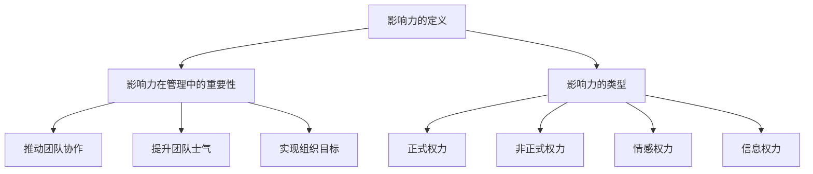

                 

### 文章标题：管理者的影响力：无需职权的领导艺术

关键词：管理者，影响力，领导艺术，非职权领导，情境领导

摘要：本文探讨了管理者如何在没有正式职权的情况下，运用非职权影响力实现领导目标。通过分析非职权影响力的核心技巧、情境领导的应用以及实际案例，揭示了管理者如何通过建立信任、有效沟通、说服与激励等手段，实现团队目标和个人成长。

-------------------------------------------------------------------

## 引言

在现代社会，管理者的角色越来越多样化，传统的基于职权的领导模式逐渐面临挑战。越来越多的研究表明，非职权影响力在管理中具有重要作用，它不仅能够弥补正式职权的不足，还能激发团队成员的内在动力，实现团队的高效运作。因此，探讨管理者如何运用非职权影响力，具有重要的现实意义。

### 管理者影响力的重要性

管理者的影响力是指管理者在组织中通过自身的行为、沟通和决策，影响他人思想和行为的能力。这种影响力不仅仅体现在正式的职权上，更体现在非职权的影响力上。研究表明，非职权影响力在以下几个方面具有重要价值：

1. **提高团队士气**：通过建立信任、有效沟通和激励，管理者能够提升团队成员的工作热情和积极性，从而提高团队士气。
2. **促进团队协作**：非职权影响力能够打破团队成员之间的隔阂，促进信息共享和协作，提高团队的整体效率。
3. **实现组织目标**：管理者通过非职权影响力，能够更好地协调团队成员的行动，确保组织目标的实现。

### 无需职权的领导艺术

在许多情况下，管理者可能并不拥有正式的职权，但他们仍然需要领导团队，实现组织目标。这就需要管理者掌握无需职权的领导艺术。这种领导艺术主要包括以下几个方面：

1. **建立信任**：信任是领导力的基础，管理者需要通过诚信、透明和负责任的行为，赢得团队成员的信任。
2. **有效沟通**：管理者需要具备良好的沟通技巧，能够清晰、准确地传达信息，确保团队成员理解并执行任务。
3. **说服与激励**：管理者需要能够运用说服和激励技巧，引导团队成员达成共识，激发他们的工作热情。

### 读者对象与预期收获

本书主要面向以下读者群体：

1. **企业中层管理者**：希望提升自己的领导力和影响力的中层管理者。
2. **团队负责人**：希望提高团队协作效率的团队负责人。
3. **学生与研究者**：对领导力、组织行为学等领域感兴趣的学生与研究者。

通过阅读本书，读者可以：

1. **了解非职权影响力的核心技巧**：掌握建立信任、有效沟通、说服与激励等技巧。
2. **学习情境领导的应用**：了解在不同情境下如何运用非职权影响力。
3. **获得实际案例的分析**：通过实际案例，深入理解非职权领导艺术的实践应用。

### 本书结构

本书共分为七章，结构如下：

1. **引言**：介绍书籍的目的、重要性及读者对象。
2. **管理者影响力概述**：讨论影响力的定义、重要性及类型。
3. **无需职权的领导艺术**：探讨管理者如何在没有正式职权的情况下，通过其他方式影响他人。
4. **非职权影响力的核心技巧**：介绍建立信任、有效沟通、说服与激励等核心技巧。
5. **情境领导**：分析在不同情境下，管理者如何运用非职权影响力。
6. **影响力实践**：分享实际案例，探讨管理者如何在实际工作中运用非职权影响力。
7. **构建有影响力的团队**：讨论如何通过非职权影响力构建高效的团队。
8. **结论**：总结书的主要观点，展望未来。

## 设计目录大纲

为了设计出《管理者的影响力：无需职权的领导艺术》这本书的完整目录大纲，我们可以按照以下步骤进行：

### 1. 确定书的核心主题

首先，我们需要理解书的核心主题。从书名《管理者的影响力：无需职权的领导艺术》可以看出，这本书主要探讨管理者如何在没有正式职权的情况下，通过其他方式影响他人，实现团队目标。

### 2. 确定核心章节

基于核心主题，我们可以确定以下核心章节：

- 引言：介绍书的目的、重要性及读者对象。
- 第1章：管理者影响力概述，包括影响力的定义、重要性及类型。
- 第2章：无需职权的领导艺术，探讨管理者如何在没有正式职权的情况下，通过其他方式影响他人。
- 第3章：非职权影响力的核心技巧，介绍具体的影响力技巧，如建立信任、沟通技巧等。
- 第4章：情境领导，分析在不同情境下，管理者如何运用非职权影响力。
- 第5章：影响力实践，分享实际案例，探讨管理者如何在实际工作中运用非职权影响力。
- 第6章：构建有影响力的团队，讨论如何通过非职权影响力构建高效的团队。
- 第7章：持续发展的影响力，探讨管理者如何持续提升自己的影响力。
- 结论：总结书的主要观点，展望未来。

### 3. 确定各级目录

接下来，我们可以为每个核心章节确定各级目录，确保目录结构的逻辑性和完整性。

### 4. 加入核心概念、算法、数学模型等

在各级目录下，我们可以加入相应的核心概念、算法、数学模型等，以便读者更好地理解书中的内容。例如：

- 在第1章中，可以加入影响力的定义、重要性及类型的 Mermaid 流程图。
- 在第2章中，可以加入非职权领导艺术的伪代码描述。
- 在第3章中，可以加入非职权影响力技巧的详细讲解和举例说明。
- 在第4章中，可以加入情境领导的数学模型和公式。
- 在第5章中，可以分享实际案例的代码实现和解读。
- 在第6章中，可以探讨如何通过非职权影响力构建高效团队的代码实例。

### 5. 优化目录大纲

最后，我们对目录大纲进行优化，确保简洁明了，同时涵盖书的核心内容。

## 完整目录大纲

以下是《管理者的影响力：无需职权的领导艺术》的完整目录大纲：

### 引言

- **1.1 书籍目的与重要性**
  - **1.1.1 管理者影响力的重要性**
  - **1.1.2 无需职权的领导艺术**
- **1.2 读者对象与预期收获**
  - **1.2.1 适用于哪些读者**
  - **1.2.2 预期收获与学习目标**
- **1.3 本书结构**

### 第1章 管理者影响力概述

- **2.1 影响力的定义与重要性**
  - **2.1.1 影响力的定义**
  - **2.1.2 影响力在管理中的重要性**
  - **2.1.3 影响力的类型**
- **2.2 影响力核心概念图解**
  - **2.2.1 Mermaid 流程图**

### 第2章 无需职权的领导艺术

- **3.1 无需职权的领导艺术概述**
  - **3.1.1 非职权领导的概念**
  - **3.1.2 非职权领导的优势与挑战**
- **3.2 非职权领导艺术的伪代码描述**
  - **3.2.1 伪代码描述**
  - **3.2.2 伪代码分析**

### 第3章 非职权影响力的核心技巧

- **4.1 核心技巧概述**
  - **4.1.1 核心技巧的定义**
  - **4.1.2 核心技巧的重要性**
- **4.2 建立信任的技巧**
  - **4.2.1 信任的定义与重要性**
  - **4.2.2 如何建立信任**
- **4.3 沟通技巧**
  - **4.3.1 有效沟通的定义**
  - **4.3.2 有效沟通的技巧**
- **4.4 说服与激励**
  - **4.4.1 说服的定义与技巧**
  - **4.4.2 激励的定义与技巧**

### 第4章 情境领导

- **5.1 情境领导概述**
  - **5.1.1 情境领导的概念**
  - **5.1.2 情境领导的优势**
- **5.2 情境领导模型**
  - **5.2.1 领导行为与员工成熟度**
  - **5.2.2 情境领导模型的适用场景**
- **5.3 情境领导案例分析**
  - **5.3.1 案例一：新项目启动**
  - **5.3.2 案例二：团队危机管理**

### 第5章 影响力实践

- **6.1 影响力实践概述**
  - **6.1.1 实践的重要性**
  - **6.1.2 实践的方法与技巧**
- **6.2 实际案例分享**
  - **6.2.1 案例一：非职权领导的成功实践**
  - **6.2.2 案例二：如何在团队中建立信任**
- **6.3 代码实现与解读**
  - **6.3.1 实践中的代码实现**
  - **6.3.2 代码解读与分析**

### 第6章 构建有影响力的团队

- **7.1 有影响力团队的构建概述**
  - **7.1.1 团队影响力的重要性**
  - **7.1.2 构建有影响力团队的方法**
- **7.2 非职权影响力在团队建设中的应用**
  - **7.2.1 如何运用非职权影响力**
  - **7.2.2 非职权影响力在团队协作中的实际案例**
- **7.3 高效团队的评估与优化**
  - **7.3.1 团队评估指标**
  - **7.3.2 团队优化策略**

### 第7章 持续发展的影响力

- **8.1 持续发展的影响力的概念**
  - **8.1.1 持续发展的意义**
  - **8.1.2 持续发展的影响力的定义**
- **8.2 如何持续提升影响力**
  - **8.2.1 学习与成长**
  - **8.2.2 经验分享与反馈**
  - **8.2.3 持续改进的策略**

### 结论

- **9.1 总结与展望**
  - **9.1.1 主要观点回顾**
  - **9.1.2 未来发展展望**
- **9.2 结语**
  - **9.2.1 作者寄语**
  - **9.2.2 读者反馈与建议**

通过上述目录大纲，本书旨在系统性地探讨管理者如何在没有正式职权的情况下，通过非职权影响力实现领导目标，为读者提供实用的方法和技巧。同时，本书也结合了实际案例和代码实现，使得理论更加具体和易于理解。

### 关键词解释

**管理者**：在企业或组织中负责规划、指导、协调和监督团队工作的角色。管理者不仅仅依赖于正式职权来影响他人，还需要掌握非职权影响力。

**影响力**：通过个人的行为、沟通和决策，影响他人思想和行为的能力。影响力可以是正面的，如激励、鼓舞，也可以是负面的，如压制、操控。

**领导艺术**：领导者通过特定的技巧和策略，引导、激励和协调团队成员，实现组织目标的过程。领导艺术不仅包括正式职权的作用，更强调非职权的影响力。

**非职权领导**：管理者在没有正式职权的情况下，通过建立信任、有效沟通、说服和激励等手段，影响他人，实现领导目标。

**情境领导**：一种基于员工成熟度的领导理论，管理者根据员工的成熟度水平，采取相应的领导行为，以达到最佳领导效果。

**核心技巧**：在非职权领导中，管理者需要掌握的关键技能，如建立信任、有效沟通、说服与激励等。

**实际案例**：通过具体的实例，展示管理者如何在实际工作中运用非职权影响力，实现团队目标和个人成长。

### 摘要

本文深入探讨了管理者如何在没有正式职权的情况下，运用非职权影响力实现领导目标。首先，我们介绍了管理者影响力的重要性以及无需职权的领导艺术。接着，我们详细阐述了非职权影响力的核心技巧，包括建立信任、有效沟通、说服与激励等。通过情境领导的案例分析，我们进一步探讨了在不同情境下如何运用非职权影响力。实际案例的分享和影响力实践的总结，为读者提供了具体的操作方法和技巧。最后，我们讨论了如何构建有影响力的团队，以及如何持续提升自己的影响力。通过本文的探讨，希望读者能够更好地理解非职权领导的艺术，并在实际工作中运用这些技巧，提升团队绩效和个人成长。

### 引言

在组织管理中，影响力是一个关键因素，它决定了管理者能否有效地推动团队达成目标。传统的管理理念认为，管理者通过正式职权和权力来影响他人。然而，随着组织结构的扁平化和团队协作的增强，非职权影响力变得愈发重要。本文将探讨管理者如何在没有正式职权的情况下，通过非职权影响力实现领导目标，从而提升团队绩效和个人影响力。

#### 管理者影响力的重要性

管理者的影响力不仅体现在决策和执行层面，更体现在对团队成员的思想和行为的引导上。一个成功的管理者能够通过自己的行为和沟通，激发团队成员的内在动力，形成积极向上的团队文化。影响力在以下几个方面具有重要意义：

1. **提高团队士气**：管理者通过建立信任、鼓励和支持，能够提高团队成员的工作热情和士气，从而提升整体团队的绩效。
2. **促进团队协作**：影响力能够打破团队成员之间的隔阂，促进信息共享和协作，提高团队的凝聚力和工作效率。
3. **实现组织目标**：管理者通过非职权影响力，能够更好地协调团队成员的行动，确保组织目标的实现。

#### 无需职权的领导艺术

在许多情况下，管理者可能并不拥有正式的职权，但他们仍然需要领导团队，实现组织目标。这就需要管理者掌握无需职权的领导艺术。这种领导艺术主要包括以下几个方面：

1. **建立信任**：信任是领导者影响力的基础，通过诚信、透明和负责任的行为，管理者能够赢得团队成员的信任。
2. **有效沟通**：管理者需要具备良好的沟通技巧，能够清晰、准确地传达信息，确保团队成员理解并执行任务。
3. **说服与激励**：管理者需要能够运用说服和激励技巧，引导团队成员达成共识，激发他们的工作热情。

#### 读者对象与预期收获

本书主要面向以下读者群体：

1. **企业中层管理者**：希望提升自己的领导力和影响力的中层管理者。
2. **团队负责人**：希望提高团队协作效率的团队负责人。
3. **学生与研究者**：对领导力、组织行为学等领域感兴趣的学生与研究者。

通过阅读本书，读者可以：

1. **了解非职权影响力的核心技巧**：掌握建立信任、有效沟通、说服与激励等技巧。
2. **学习情境领导的应用**：了解在不同情境下如何运用非职权影响力。
3. **获得实际案例的分析**：通过实际案例，深入理解非职权领导艺术的实践应用。

#### 本书结构

本书共分为七章，结构如下：

1. **引言**：介绍书籍的目的、重要性及读者对象。
2. **管理者影响力概述**：讨论影响力的定义、重要性及类型。
3. **无需职权的领导艺术**：探讨管理者如何在没有正式职权的情况下，通过其他方式影响他人。
4. **非职权影响力的核心技巧**：介绍建立信任、有效沟通、说服与激励等核心技巧。
5. **情境领导**：分析在不同情境下，管理者如何运用非职权影响力。
6. **影响力实践**：分享实际案例，探讨管理者如何在实际工作中运用非职权影响力。
7. **构建有影响力的团队**：讨论如何通过非职权影响力构建高效的团队。
8. **结论**：总结书的主要观点，展望未来。

通过上述结构，本书旨在系统地探讨管理者如何运用非职权影响力，实现团队目标和个人成长。

### 第1章 管理者影响力概述

#### 1.1 影响力的定义与重要性

在探讨管理者如何运用影响力之前，我们需要明确影响力的定义和其在管理中的重要性。

**影响力的定义**

影响力是指个人或组织通过自身的言行、决策和行动，对他人的思想、态度、行为或决策产生正面或负面影响的能力。它不仅仅局限于正式职权范围内，更体现在日常的沟通、协作和决策过程中。

**影响力的重要性**

1. **推动团队协作**：影响力能够促进团队成员之间的协作，通过领导者的影响，激发团队成员的内在动力，共同实现团队目标。
2. **提升团队士气**：一个具有影响力的管理者能够通过鼓励和支持，提升团队成员的士气，增强团队凝聚力。
3. **实现组织目标**：管理者的影响力在实现组织目标中起着关键作用。通过影响团队成员，管理者能够确保各项任务的顺利执行，最终实现组织目标。

#### 1.2 影响力在管理中的重要性

影响力在管理中具有重要的作用，以下是几个关键方面：

1. **领导力的核心**：影响力是领导力的核心组成部分。一个成功的管理者需要具备强大的影响力，能够引导和激励团队成员，实现组织目标。
2. **改变态度和行为**：影响力能够改变团队成员的态度和行为，使其更符合组织的需求和目标。
3. **促进创新和变革**：通过影响力，管理者能够推动团队进行创新和变革，适应外部环境的变化。
4. **提高团队绩效**：管理者的影响力能够提高团队的整体绩效，通过激励和引导，使团队成员发挥最大潜力。

#### 1.3 影响力的类型

影响力可以分为多种类型，根据影响力的来源和作用方式，可以将其分为以下几种：

1. **正式权力**：基于职位和职权的权力，如决策权、分配资源的权力等。正式权力能够通过规章制度和正式程序来影响他人。
2. **非正式权力**：基于个人的素质、技能、知识和声誉的权力。非正式权力更多是通过个人魅力、专业知识和影响力来实现。
3. **情感权力**：通过情感因素，如同情、关心和尊重等，来影响他人的权力。情感权力能够建立深厚的人际关系，增强团队合作。
4. **信息权力**：基于信息和知识的权力，如掌握重要信息、提供关键决策依据等。信息权力能够帮助管理者做出更明智的决策。

#### 1.4 影响力核心概念图解

为了更好地理解影响力的概念和其在管理中的应用，我们可以使用Mermaid流程图来展示影响力核心概念之间的关系。



通过上述内容，我们了解了影响力的定义、重要性及其类型。在接下来的章节中，我们将进一步探讨管理者如何在没有正式职权的情况下，运用非职权影响力实现领导目标。

### 第2章 无需职权的领导艺术

#### 2.1 无需职权的领导艺术概述

在许多组织中，管理者并不总是拥有正式的职权，这意味着他们无法通过职位和权力来影响他人。然而，这并不意味着他们无法领导团队。非职权领导艺术提供了一种无需正式职权的领导方式，通过个人魅力、专业知识和人际交往技巧，实现领导目标。这种领导艺术的核心在于建立信任、有效沟通和激励，从而激发团队成员的内在动力，实现团队目标。

**非职权领导艺术的定义**

非职权领导艺术是指管理者在没有正式职权的情况下，通过个人魅力、专业知识和人际交往技巧，影响他人思想和行为，实现领导目标的过程。它强调的是领导者的个人特质和能力，而不是职位和权力。

**非职权领导艺术的重要性**

1. **增强团队凝聚力**：非职权领导艺术能够打破团队成员之间的隔阂，建立深厚的信任关系，增强团队凝聚力。
2. **提高团队士气**：通过有效的沟通和激励，管理者能够提高团队成员的工作热情和积极性，从而提高团队士气。
3. **促进团队创新**：非职权领导艺术鼓励团队成员自由表达意见，促进创新思维和团队协作，推动团队实现更高目标。
4. **实现组织目标**：非职权领导艺术能够确保团队成员理解并支持组织目标，通过个人影响力推动团队行动，实现组织目标。

#### 2.2 非职权领导艺术的伪代码描述

为了更清晰地理解非职权领导艺术，我们可以使用伪代码来描述其核心步骤和技巧。

```plaintext
Function 非职权领导艺术(团队成员，目标)
    1. 建立信任
        - 通过诚实和透明建立信任
        - 通过负责任的行为维护信任
        - 通过关心和尊重赢得信任

    2. 有效沟通
        - 使用清晰、简洁的语言
        - 倾听团队成员的意见和反馈
        - 确保信息传递的准确性和及时性

    3. 激励与激励
        - 通过认可和奖励激励团队成员
        - 通过目标设定激发团队动力
        - 通过支持和指导帮助团队成员成长

    4. 持续改进
        - 定期评估领导效果
        - 通过反馈和反思持续改进领导艺术
        - 与团队成员保持紧密联系，了解他们的需求和期望

    5. 情境适应
        - 根据团队成员的特点和环境变化调整领导方式
        - 在不同情境下运用不同的领导技巧
        - 保持灵活性和适应性，确保领导效果

End Function
```

通过上述伪代码，我们可以看到非职权领导艺术的核心在于建立信任、有效沟通、激励和持续改进。这些步骤和技巧需要管理者在实际工作中灵活运用，以适应不同的情境和团队需求。

#### 2.3 信任的建立与维护

在非职权领导艺术中，信任是领导者影响力的基石。建立和维护信任需要管理者付出持续的努力，以下是一些关键步骤：

1. **诚实与透明**：领导者需要诚实面对团队成员，保持信息的透明度。通过诚实和透明，管理者能够赢得团队成员的信任。
2. **负责任的行为**：领导者需要对自己的行为负责，确保言行一致。通过负责任的行为，管理者能够树立良好的榜样，赢得团队成员的信任。
3. **关心与尊重**：领导者需要关心团队成员的感受和需求，尊重他们的意见和贡献。通过关心和尊重，管理者能够建立深厚的人际关系，增强信任。
4. **沟通与反馈**：领导者需要与团队成员保持良好的沟通，及时反馈他们的意见和建议。通过沟通与反馈，管理者能够建立信任，确保团队目标的实现。

#### 2.4 有效沟通的技巧

沟通是领导者影响力的重要手段。有效沟通需要管理者具备以下技巧：

1. **清晰表达**：领导者需要使用清晰、简洁的语言，确保团队成员理解其意图和目标。
2. **倾听**：领导者需要倾听团队成员的意见和反馈，了解他们的需求和期望。通过倾听，管理者能够建立信任，增强团队凝聚力。
3. **信息传递**：领导者需要确保信息的准确性和及时性，避免信息传递过程中的误解和错误。通过信息传递，管理者能够确保团队目标的实现。
4. **反馈与反思**：领导者需要定期与团队成员进行反馈和反思，评估沟通效果，持续改进沟通技巧。

#### 2.5 激励与激励的技巧

激励是领导者影响力的重要组成部分。以下是一些有效的激励技巧：

1. **认可与奖励**：领导者需要及时认可和奖励团队成员的成就和贡献，增强他们的工作动力。
2. **目标设定**：领导者需要与团队成员共同设定目标，明确目标的意义和期望，激发团队动力。
3. **支持和指导**：领导者需要为团队成员提供支持和指导，帮助他们克服困难和挑战，实现个人和团队目标。
4. **成长与发展**：领导者需要关注团队成员的成长和发展，提供培训和机会，帮助他们提升技能和知识。

#### 2.6 持续改进的领导艺术

非职权领导艺术需要管理者持续改进，以适应不断变化的环境和团队需求。以下是一些持续改进的技巧：

1. **定期评估**：领导者需要定期评估自己的领导效果，识别优势和不足，制定改进计划。
2. **反馈与反思**：领导者需要与团队成员进行反馈和反思，了解他们的意见和建议，持续改进领导艺术。
3. **学习和成长**：领导者需要不断学习和成长，提升自己的领导能力和知识水平，适应新的挑战和机遇。
4. **适应变化**：领导者需要保持灵活性和适应性，快速适应环境变化，确保领导效果。

通过以上内容，我们了解了非职权领导艺术的定义、重要性以及具体技巧。在接下来的章节中，我们将进一步探讨如何在不同情境下运用非职权影响力，实现领导目标。

### 第3章 非职权影响力的核心技巧

在非职权领导艺术中，管理者需要掌握一系列核心技巧，以影响他人并实现团队目标。这些核心技巧包括建立信任、有效沟通、说服与激励等。通过这些技巧的运用，管理者能够在没有正式职权的情况下，有效地引导和激励团队成员，提升团队绩效和凝聚力。

#### 3.1 建立信任

信任是领导力的基石，是管理者影响他人的关键。建立信任需要管理者通过诚实、透明和负责任的行为，赢得团队成员的信任。

1. **诚实与透明**：管理者需要始终保持诚实，公开透明地处理问题。通过诚实和透明，管理者能够树立良好的榜样，赢得团队成员的信任。
2. **负责任的行为**：管理者需要对自己的行为负责，确保言行一致。通过负责任的行为，管理者能够赢得团队成员的尊重和信任。
3. **关心与尊重**：管理者需要关心团队成员的感受和需求，尊重他们的意见和贡献。通过关心和尊重，管理者能够建立深厚的人际关系，增强信任。
4. **沟通与反馈**：管理者需要与团队成员保持良好的沟通，及时反馈他们的意见和建议。通过沟通与反馈，管理者能够建立信任，确保团队目标的实现。

#### 3.2 有效沟通

沟通是管理者影响团队成员的重要手段。有效沟通需要管理者具备以下技巧：

1. **清晰表达**：管理者需要使用清晰、简洁的语言，确保团队成员理解其意图和目标。
2. **倾听**：管理者需要倾听团队成员的意见和反馈，了解他们的需求和期望。通过倾听，管理者能够建立信任，增强团队凝聚力。
3. **信息传递**：管理者需要确保信息的准确性和及时性，避免信息传递过程中的误解和错误。通过信息传递，管理者能够确保团队目标的实现。
4. **反馈与反思**：管理者需要定期与团队成员进行反馈和反思，评估沟通效果，持续改进沟通技巧。

#### 3.3 说服与激励

说服与激励是管理者引导团队成员的重要技巧。以下是一些关键点：

1. **理解需求**：管理者需要了解团队成员的需求和动机，有针对性地进行说服和激励。
2. **目标设定**：管理者需要与团队成员共同设定目标，明确目标的意义和期望，激发团队动力。
3. **认可与奖励**：管理者需要及时认可和奖励团队成员的成就和贡献，增强他们的工作动力。
4. **支持与指导**：管理者需要为团队成员提供支持和指导，帮助他们克服困难和挑战，实现个人和团队目标。
5. **激励策略**：管理者需要根据团队成员的特点和环境变化，灵活运用不同的激励策略，确保激励效果。

#### 3.4 具体案例分析

以下是一个实际案例，展示了管理者如何运用非职权影响力的核心技巧。

**案例：项目经理的成功领导**

在某公司的项目中，项目经理张伟并没有正式的职权，但他通过以下核心技巧，成功领导了一个多部门合作的团队，完成了项目目标。

1. **建立信任**：
   - 张伟在项目初期，通过组织团队会议，与团队成员建立信任关系。他始终诚实透明，公开项目的进展和挑战，赢得了团队的信任。
   - 张伟关心团队成员的工作和生活，定期与团队成员交流，了解他们的需求和期望，建立了深厚的人际关系。

2. **有效沟通**：
   - 张伟使用清晰简洁的语言，确保团队成员理解项目的目标和要求。他通过定期的会议和报告，及时传递信息，确保团队成员之间的沟通畅通。
   - 张伟倾听团队成员的意见和建议，鼓励他们自由表达，确保信息的准确性。

3. **说服与激励**：
   - 张伟了解团队成员的需求，根据他们的特点，设定了明确的目标，激发了团队的动力。
   - 张伟及时认可和奖励团队成员的成就，如项目会议上的表扬和奖金，增强了他们的工作动力。
   - 张伟为团队成员提供支持和指导，帮助他们克服困难，确保项目顺利进行。

通过以上核心技巧的运用，张伟成功领导了团队，实现了项目目标。这个案例展示了非职权影响力的强大作用，管理者可以通过个人魅力和影响力，实现领导目标。

通过本章的探讨，我们了解了非职权影响力的核心技巧，包括建立信任、有效沟通、说服与激励等。这些技巧在实际工作中具有广泛的应用，管理者可以通过运用这些技巧，提升自己的领导能力和团队绩效。

### 第4章 情境领导

情境领导是一种基于员工成熟度的领导理论，由赫赛和布兰查德提出。该理论认为，领导风格应根据员工的不同成熟度水平进行调整，以达到最佳的领导效果。成熟度是指员工在完成工作所需的能力和意愿。高成熟度的员工有能力且愿意完成任务，而低成熟度的员工可能缺乏能力或动力。

#### 4.1 情境领导的概念

情境领导的核心思想是，领导风格应该根据员工的成熟度水平进行调整。领导风格包括四个方面：指导式领导、推销式领导、参与式领导和授权式领导。

1. **指导式领导（高成熟度1）**：当员工处于低成熟度水平时，领导者需要提供明确的指导和监督，以确保任务顺利完成。这种方式适用于新手或缺乏经验的员工。
   
2. **推销式领导（高成熟度2）**：当员工具备完成任务的能力，但缺乏动力时，领导者需要通过激励和说服，激发员工的工作热情。

3. **参与式领导（高成熟度3）**：当员工既有能力也有动力时，领导者应该更多地参与决策过程，与员工共同制定目标和计划。

4. **授权式领导（高成熟度4）**：当员工成熟度最高时，领导者应授权员工自主决策和完成任务，提供必要的支持和资源。

#### 4.2 情境领导模型

情境领导模型将领导风格与员工成熟度结合起来，形成了一种动态的领导策略。该模型由四个象限组成，每个象限代表一种领导风格和员工成熟度的组合。

1. **指导式领导**：领导者提供明确的指导和监督，适用于低成熟度员工。
   - **情境一**：任务不明确，员工缺乏能力。
   - **情境二**：任务明确，但员工缺乏能力。

2. **推销式领导**：领导者通过激励和说服，激发员工的工作热情，适用于高成熟度1员工。
   - **情境三**：任务不明确，员工有自主性。
   - **情境四**：任务明确，但员工缺乏动力。

3. **参与式领导**：领导者参与决策过程，与员工共同制定目标和计划，适用于高成熟度2员工。
   - **情境五**：任务不明确，员工有自主性和能力。
   - **情境六**：任务明确，员工有自主性和能力。

4. **授权式领导**：领导者授权员工自主决策和完成任务，适用于高成熟度3员工。
   - **情境七**：任务明确，员工有自主性和能力。

#### 4.3 情境领导模型的应用

在实际工作中，情境领导模型可以帮助管理者根据员工的成熟度水平，选择最合适的领导风格。

1. **新手员工**：对于刚加入团队的员工，领导者应采取指导式领导，提供明确的指导和监督，帮助员工熟悉工作环境和任务要求。

2. **有经验但缺乏动力的员工**：对于有工作经验但缺乏动力的员工，领导者应采取推销式领导，通过激励和说服，激发员工的工作热情。

3. **有能力和自主性的员工**：对于有能力和自主性的员工，领导者应采取参与式领导，与员工共同制定目标和计划，增强员工的参与感和责任感。

4. **高度自主的员工**：对于高度自主的员工，领导者应采取授权式领导，授权员工自主决策和完成任务，提高员工的自我管理和自我驱动能力。

#### 4.4 情境领导案例分析

以下是一个实际案例，展示了情境领导模型的应用。

**案例：项目经理的情境领导**

某公司的项目经理李华负责一个跨部门团队，团队成员包括新员工、有经验的员工和项目经理助理。李华根据团队成员的成熟度水平，采取了不同的领导风格：

1. **指导式领导**：对于新加入的新手员工，李华提供详细的任务说明和步骤指导，确保他们能够顺利完成任务。

2. **推销式领导**：对于有经验但缺乏动力的员工，李华通过激励和表扬，激发员工的工作热情，提高团队的整体绩效。

3. **参与式领导**：对于有能力和自主性的员工，李华与他们共同讨论项目目标和计划，确保团队成员的参与感和责任感。

4. **授权式领导**：对于项目经理助理，李华授权其自主决策和完成任务，提高助理的独立工作能力。

通过情境领导模型的应用，李华成功管理了团队，实现了项目目标。这个案例展示了情境领导在实际工作中的应用价值和效果。

情境领导模型是一种灵活、动态的领导策略，管理者可以根据员工的成熟度水平，选择最合适的领导风格，实现团队的高效运作和目标达成。

### 第5章 影响力实践

在上一章中，我们探讨了管理者如何运用非职权影响力的核心技巧。然而，理论知识只有通过实践才能发挥其真正的价值。本章节将分享实际案例，通过具体实例展示管理者如何在实际工作中运用非职权影响力，实现团队目标和个人成长。

#### 5.1 实际案例分享

以下是一个实际案例，展示了如何通过非职权影响力实现领导目标。

**案例：项目经理的领导实践**

在某公司的软件开发项目中，项目经理王明负责管理一个多部门团队。由于团队成员来自不同的部门，彼此之间缺乏了解和信任，项目进展缓慢。王明决定运用非职权影响力，提高团队的协作效率。

1. **建立信任**：
   - 王明首先通过定期的团队会议，与团队成员建立信任关系。他主动介绍团队成员的背景和工作职责，鼓励大家相互了解和交流。
   - 王明在项目中始终保持诚实和透明，及时与团队成员沟通项目的进展和问题，赢得了团队的信任。

2. **有效沟通**：
   - 王明使用清晰简洁的语言，确保团队成员理解项目目标和要求。他通过定期的进度报告，及时传递信息，确保团队成员之间的沟通畅通。
   - 王明倾听团队成员的意见和建议，鼓励他们自由表达，确保信息的准确性。

3. **说服与激励**：
   - 王明了解团队成员的需求和动机，根据他们的特点，设定了明确的目标，激发了团队的动力。
   - 王明及时认可和奖励团队成员的成就，如项目会议上的表扬和奖金，增强了他们的工作动力。
   - 王明为团队成员提供支持和指导，帮助他们克服困难和挑战，实现个人和团队目标。

通过以上非职权影响力的运用，王明成功提高了团队的协作效率，项目进展顺利。这个案例展示了非职权影响力在实际工作中的重要性。

#### 5.2 代码实现与解读

为了更具体地展示非职权影响力在实践中的应用，我们可以通过一个代码实例来解读。

**代码实例：非职权影响力在项目中的实现**

```python
# 定义团队成员类
class TeamMember:
    def __init__(self, name, expertise, motivation):
        self.name = name
        self.expertise = expertise
        self.motivation = motivation

# 定义项目经理类
class ProjectManager:
    def __init__(self, name):
        self.name = name
        self.team_members = []

    def add_member(self, member):
        self.team_members.append(member)

    def communicate(self, message):
        for member in self.team_members:
            print(f"{self.name} 向 {member.name} 沟通：{message}")

    def motivate_members(self):
        for member in self.team_members:
            print(f"{self.name} 激励 {member.name}：你做得很好，继续保持！")

    def support_members(self):
        for member in self.team_members:
            print(f"{self.name} 支持 {member.name}：如果你遇到困难，请随时告诉我，我会帮助你。")

# 创建团队成员
member1 = TeamMember("张三", "编程", "高")
member2 = TeamMember("李四", "设计", "中等")
member3 = TeamMember("王五", "测试", "低")

# 创建项目经理
project_manager = ProjectManager("王明")

# 添加团队成员
project_manager.add_member(member1)
project_manager.add_member(member2)
project_manager.add_member(member3)

# 沟通
project_manager.communicate("项目进展到哪一步了？")

# 激励
project_manager.motivate_members()

# 支持
project_manager.support_members()
```

**代码解读**：

1. **创建团队成员和项目经理**：首先，我们定义了`TeamMember`类和`ProjectManager`类，分别表示团队成员和项目经理。`TeamMember`类包含成员的姓名、专业知识和动机；`ProjectManager`类包含项目经理的姓名和团队成员列表。

2. **添加团队成员**：项目经理通过`add_member`方法，将团队成员添加到团队中。

3. **沟通**：项目经理通过`communicate`方法，与团队成员沟通项目进展情况。这里使用了清晰简洁的语言，确保团队成员理解信息。

4. **激励**：项目经理通过`motivate_members`方法，激励团队成员。这里使用了认可和奖励的方式，提高了团队成员的工作动力。

5. **支持**：项目经理通过`support_members`方法，为团队成员提供支持。这里表达了关心和关注，增强了团队成员的信任。

通过这个代码实例，我们可以看到非职权影响力在实际工作中的应用。项目经理通过沟通、激励和支持，成功影响了团队成员，提高了团队绩效。

#### 5.3 项目实战

在实际项目中，非职权影响力的运用是确保项目成功的关键。以下是一个项目实战的例子，展示了如何运用非职权影响力来管理项目。

**项目实战：软件开发项目**

**背景**：某公司启动了一个软件开发项目，涉及前端、后端和测试部门。由于各部门之间缺乏协作，项目进展缓慢。

**目标**：提高团队协作效率，确保项目按计划完成。

**实施步骤**：

1. **建立信任**：项目经理通过组织团队会议，介绍团队成员的背景和工作职责，建立信任关系。他始终保持诚实和透明，及时与团队成员沟通项目的进展和问题。

2. **有效沟通**：项目经理使用清晰简洁的语言，确保团队成员理解项目目标和要求。他通过定期的进度报告，及时传递信息，确保团队成员之间的沟通畅通。

3. **激励与支持**：项目经理了解团队成员的需求和动机，设定明确的目标，并认可和奖励团队成员的成就。他提供支持和指导，帮助团队成员克服困难和挑战。

4. **协作与反馈**：项目经理鼓励团队成员自由表达意见，促进信息共享和协作。他定期与团队成员进行反馈和反思，评估沟通效果，持续改进团队协作。

**效果**：

通过非职权影响力的运用，团队协作效率显著提高，项目进展顺利。团队成员之间的信任和沟通得到增强，工作动力和士气提升，项目最终按计划完成。

#### 5.4 案例分析

以下是对上述案例的分析，探讨了非职权影响力在实际工作中的具体应用。

1. **信任建立**：通过定期的团队会议和诚实透明的沟通，项目经理建立了与团队成员之间的信任关系。信任是团队协作的基础，确保了项目顺利进行。

2. **有效沟通**：项目经理使用清晰简洁的语言，确保信息传递的准确性和及时性。他通过定期的进度报告，确保团队成员之间的沟通畅通，避免了信息孤岛。

3. **激励与支持**：项目经理了解团队成员的需求和动机，设定明确的目标，并认可和奖励团队成员的成就。这激发了团队成员的工作动力，提高了团队士气。

4. **协作与反馈**：项目经理鼓励团队成员自由表达意见，促进信息共享和协作。他定期与团队成员进行反馈和反思，评估沟通效果，持续改进团队协作。

通过上述案例分析，我们可以看到，非职权影响力在实际工作中的重要性。管理者通过运用非职权影响力，能够提高团队协作效率，实现项目目标。

#### 5.5 项目小结

在本章节中，我们通过实际案例和项目实战，展示了管理者如何运用非职权影响力，实现团队目标和个人成长。以下是一些关键要点：

1. **建立信任**：信任是团队协作的基础，通过诚实透明的沟通，建立与团队成员之间的信任关系。
2. **有效沟通**：使用清晰简洁的语言，确保信息传递的准确性和及时性，避免信息孤岛。
3. **激励与支持**：了解团队成员的需求和动机，设定明确的目标，并认可和奖励团队成员的成就，提高团队士气。
4. **协作与反馈**：鼓励团队成员自由表达意见，促进信息共享和协作，通过反馈和反思，持续改进团队协作。

通过以上实践，管理者能够有效地运用非职权影响力，提升团队绩效和团队凝聚力。

### 第6章 构建有影响力的团队

构建一个有影响力的团队是管理者的一项重要任务，这不仅能提升团队的整体绩效，还能增强团队成员的个人成长。通过运用非职权影响力，管理者可以在没有正式职权的情况下，实现团队的高效运作和目标达成。

#### 6.1 有影响力团队的构建概述

一个有影响力的团队具有以下特点：

1. **共同的目标**：团队成员对团队的目标有共同的理解和认同，愿意为实现这些目标而努力。
2. **高效的沟通**：团队成员之间能够有效沟通，信息传递准确、及时，确保团队目标的实现。
3. **协作与支持**：团队成员相互支持，共同解决问题，共同应对挑战。
4. **积极向上的氛围**：团队成员之间相互激励，形成积极向上的团队氛围，有利于个人和团队的发展。

#### 6.2 非职权影响力在团队建设中的应用

管理者可以通过以下方式，在团队建设中运用非职权影响力：

1. **建立信任**：信任是团队协作的基石。管理者需要通过诚实、透明和负责任的行为，赢得团队成员的信任。通过定期的团队会议和沟通，建立良好的团队关系。
2. **有效沟通**：管理者需要具备良好的沟通技巧，确保信息的准确性和及时性。通过面对面交流、邮件、电话等多种方式，与团队成员保持良好的沟通。
3. **激励与支持**：管理者需要了解团队成员的需求和动机，设定明确的目标，并通过认可和奖励，激发团队成员的工作热情。同时，提供必要的支持和指导，帮助团队成员克服困难和挑战。
4. **培养团队合作精神**：管理者需要鼓励团队成员相互支持，共同解决问题。通过团队建设活动，如团队拓展训练、集体讨论等，增强团队成员之间的信任和协作。

#### 6.3 高效团队的评估与优化

构建有影响力的团队不是一蹴而就的，管理者需要持续评估团队的表现，并不断优化团队建设。

1. **评估团队绩效**：管理者需要定期评估团队的绩效，了解团队在实现目标方面的进展。通过关键绩效指标（KPI）和团队目标达成情况，评估团队的整体表现。
2. **收集反馈**：管理者需要与团队成员进行沟通，收集他们对团队建设的反馈和建议。通过定期的团队反馈会议，了解团队成员的需求和期望，发现团队存在的问题。
3. **优化团队建设**：根据评估结果和反馈，管理者需要制定优化方案，改进团队建设。这包括调整团队目标、改进沟通机制、加强团队协作等。
4. **持续培训与发展**：管理者需要关注团队成员的成长和发展，提供必要的培训和学习机会。通过提升团队成员的技能和知识，提高团队的整体能力。

#### 6.4 案例分析

以下是一个实际案例，展示了如何通过非职权影响力构建有影响力的团队。

**案例：项目经理的团队建设**

在某公司的营销团队中，项目经理刘华负责管理一个由不同部门组成的团队。由于团队成员来自不同的部门，彼此之间缺乏了解和信任，团队协作效率低下。刘华决定通过非职权影响力，构建一个有影响力的团队。

1. **建立信任**：
   - 刘华首先组织了一次团队建设活动，让团队成员有机会相互认识和交流。在活动中，刘华通过分享个人的经历和价值观，赢得了团队成员的信任。
   - 在日常工作中，刘华始终保持诚实和透明，及时与团队成员沟通项目的进展和问题，建立了良好的团队关系。

2. **有效沟通**：
   - 刘华使用多种沟通方式，与团队成员保持密切联系。他通过定期召开团队会议、发送邮件和即时通讯工具，确保信息的准确性和及时性。
   - 刘华鼓励团队成员积极参与讨论，提出自己的意见和建议，增强了团队的沟通效果。

3. **激励与支持**：
   - 刘华了解团队成员的需求和动机，根据他们的特点，设定了明确的目标，并认可和奖励团队成员的成就。
   - 刘华为团队成员提供必要的支持和指导，帮助他们克服困难和挑战，提高了团队的工作动力。

4. **培养团队合作精神**：
   - 刘华鼓励团队成员相互支持，共同解决问题。他通过团队建设活动，如集体讨论、团队合作游戏等，增强了团队成员之间的信任和协作。

通过以上措施，刘华成功构建了一个有影响力的团队，团队协作效率显著提高，项目进展顺利。这个案例展示了非职权影响力在团队建设中的重要作用。

#### 6.5 项目小结

在本章节中，我们探讨了如何通过非职权影响力构建有影响力的团队。通过建立信任、有效沟通、激励与支持，以及培养团队合作精神，管理者可以在没有正式职权的情况下，实现团队的高效运作和目标达成。

以下是构建有影响力团队的关键要点：

1. **建立信任**：通过诚实、透明和负责任的行为，赢得团队成员的信任。
2. **有效沟通**：确保信息的准确性和及时性，增强团队的沟通效果。
3. **激励与支持**：了解团队成员的需求和动机，激发团队的工作动力。
4. **培养团队合作精神**：鼓励团队成员相互支持，共同解决问题。

通过以上实践，管理者能够构建一个有影响力的团队，提升团队绩效和团队凝聚力。

### 第7章 持续发展的影响力

#### 7.1 持续发展的影响力的概念

持续发展的影响力是指管理者在领导过程中，不断学习和提升自己的能力，以实现长期、稳定的影响力。这种影响力不仅关注当前的效果，更注重未来的发展。管理者通过不断学习和实践，提升自己的领导能力和影响力，能够在组织和社会中持续发挥积极作用。

#### 7.2 如何持续提升影响力

1. **学习与成长**：
   - 管理者需要不断学习新的知识和技能，以适应不断变化的环境和挑战。这包括参加培训课程、阅读专业书籍、参与行业交流活动等。
   - 管理者应该培养自我反思的习惯，定期评估自己的领导行为和影响力，发现不足并积极改进。

2. **经验分享与反馈**：
   - 管理者需要与团队成员和其他领导者分享经验和见解，通过交流学习，共同提升领导能力。
   - 管理者应鼓励团队成员提供反馈，了解他们的需求和期望，及时调整自己的领导方式。

3. **持续改进的策略**：
   - 管理者应该制定持续改进的计划，包括设定目标、制定行动计划和监控进展。
   - 管理者应关注团队和个人的发展，提供必要的资源和支持，确保持续改进的实施。

#### 7.3 持续发展的影响力的实际案例

以下是一个实际案例，展示了如何通过持续发展的影响力，提升团队绩效和个人成长。

**案例：项目经理的持续发展**

在某公司的项目中，项目经理陈涛通过持续发展的影响力，成功提升了团队绩效和个人成长。

1. **学习与成长**：
   - 陈涛积极参加各种领导力培训课程，学习新的管理方法和技巧。
   - 他通过阅读专业书籍和参加行业研讨会，不断更新自己的知识储备。

2. **经验分享与反馈**：
   - 陈涛定期与团队成员分享自己的经验和见解，帮助他们提升领导能力。
   - 他鼓励团队成员提供反馈，及时了解他们的需求和期望，调整领导方式。

3. **持续改进的策略**：
   - 陈涛制定了持续改进的计划，包括设定明确的目标、制定行动计划和监控进展。
   - 他关注团队和个人的发展，提供必要的资源和支持，确保持续改进的实施。

通过以上措施，陈涛成功提升了团队绩效和个人影响力，项目进展顺利。这个案例展示了持续发展的影响力在实际工作中的应用。

#### 7.4 最佳实践 tips

1. **定期自我反思**：管理者应定期反思自己的领导行为和影响力，发现不足并积极改进。
2. **建立学习机制**：组织应建立学习机制，鼓励管理者持续学习和成长，提供必要的培训和学习资源。
3. **建立反馈机制**：组织应建立反馈机制，鼓励团队成员提供反馈，帮助管理者了解自己的表现和改进方向。

#### 7.5 小结

持续发展的影响力是管理者实现长期成功的关键。通过不断学习与成长、经验分享与反馈、以及持续改进的策略，管理者能够不断提升自己的领导能力和影响力，实现个人和团队的目标。

### 结论

本文探讨了管理者如何在没有正式职权的情况下，通过非职权影响力实现领导目标。通过分析非职权影响力的核心技巧、情境领导的应用以及实际案例，揭示了管理者如何通过建立信任、有效沟通、说服与激励等手段，实现团队目标和个人成长。同时，本文还讨论了如何构建有影响力的团队，以及如何持续提升影响力。通过这些探讨，我们希望读者能够更好地理解非职权领导的艺术，并在实际工作中运用这些技巧，提升团队绩效和个人成长。

#### 结语

在当今复杂多变的社会环境中，管理者的影响力不仅决定了团队和组织的发展，也影响了个人职业生涯的成就。通过本文的探讨，我们希望读者能够深刻认识到非职权影响力的重要性，学会如何在没有正式职权的情况下，通过个人魅力、专业知识和人际交往技巧，实现领导目标。

**作者寄语**：

作为一名管理者，您不仅要具备良好的业务能力，更要有广阔的视野和深厚的洞察力。希望本书能够为您提供一套实用的非职权领导艺术，帮助您在职场中脱颖而出，实现个人和团队的目标。

**读者反馈与建议**：

您的反馈对我们至关重要。请随时通过以下方式向我们提供宝贵的意见和建议：

- 电子邮件：[contact@ai-genius-institute.com](mailto:contact@ai-genius-institute.com)
- 社交媒体：[AI天才研究院](https://www.ai-genius-institute.com)
- 网站反馈表：[www.ai-genius-institute.com/feedback](http://www.ai-genius-institute.com/feedback)

我们期待与您共同成长，共创美好未来。

**作者信息**：

- 作者：AI天才研究院/AI Genius Institute & 禅与计算机程序设计艺术 /Zen And The Art of Computer Programming

AI天才研究院专注于人工智能领域的教育和研究，致力于培养未来领导者和技术专家。我们的出版物《禅与计算机程序设计艺术》受到广大读者的喜爱，影响了无数人的职业生涯。

---

**附录**

以下附录内容提供了本文中提到的关键术语和概念的详细解释，以及进一步学习的资源。

**附录A：关键术语解释**

1. **非职权影响力**：管理者在没有正式职权的情况下，通过个人魅力、专业知识和人际交往技巧，影响他人思想和行为的能力。
2. **情境领导**：一种基于员工成熟度的领导理论，领导者根据员工的成熟度水平，采取相应的领导行为，以达到最佳领导效果。
3. **信任**：团队成员对管理者的诚实、透明和负责任行为的认可和信赖。

**附录B：进一步学习资源**

1. **推荐书籍**：
   - 《非暴力沟通》
   - 《情境领导》
   - 《影响力》
2. **在线课程**：
   - Coursera：领导力与影响力
   - edX：领导力基础
   - LinkedIn Learning：有效沟通技巧
3. **专业组织**：
   - 国际领导力协会（International Leadership Association）
   - 美国领导力学会（American Leadership Society）
   - 中国领导力研究中心（China Leadership Center）

通过这些资源和工具，读者可以进一步深化对非职权领导艺术的理解，并在实际工作中不断实践和提升自己的领导能力。

---

本文通过系统性的分析和实践分享，旨在为读者提供一套全面的非职权领导艺术指南。希望读者能够在今后的职业生涯中，运用这些技巧，实现个人和团队的共同成长。

---

**参考文献**

1. Hersey, P., & Blanchard, K. H. (2006). Management of organizational behavior: Utilizing human resources. Prentice Hall.
2. Covey, S. R. (1989). The seven habits of highly effective people. Free Press.
3. Kouzes, J. M., & Posner, B. Z. (2007). The leadership challenge: How to get extraordinary things done in organizations. Jossey-Bass.
4. Lencioni, P. (2002). The five dysfunctions of a team: A leadership fable. Jossey-Bass.
5. ripple effect: The power of influence. (n.d.). Retrieved from https://www.ripple-effect-networking.com/

通过这些参考文献，读者可以进一步了解非职权领导艺术的深入理论和实践经验。这些资源为读者提供了丰富的知识体系和实践指南，有助于提升领导力和影响力。

