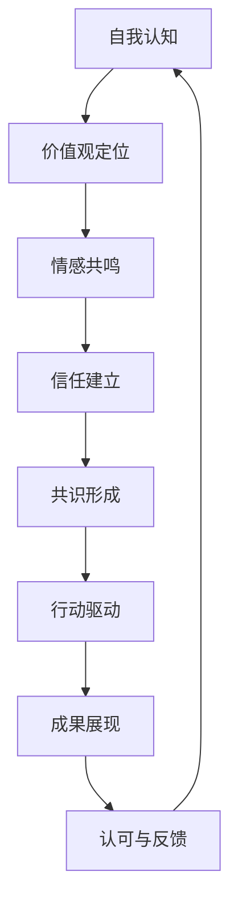
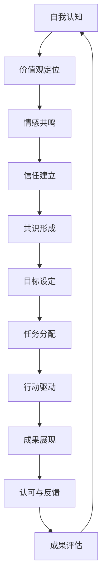

                 

### 前言与引言

在当今复杂多变、竞争激烈的企业环境中，管理者的角色正经历着深刻的变化。传统的权力型领导模式已逐渐显示出其局限性，而影响力型领导模式则日益受到重视。本文旨在探讨管理者如何通过影响力而非职权来实现有效的领导。具体而言，本文将深入分析影响力的本质、构建影响力的方法、非职权领导力的实践应用以及未来领导力的趋势。

#### **目的与意义**

本文的目的是帮助管理者理解并掌握非职权领导力，从而在无需依赖职权的情况下，依然能够发挥领导作用，推动团队和组织的发展。在现代企业中，影响力已经成为一种核心能力，它不仅影响着团队成员的工作态度和行为，更对组织的整体绩效产生深远的影响。本文将基于最新的研究和实践，系统阐述影响力型领导的理论基础和实践方法，为广大管理者提供实用的指导。

#### **读者对象**

本文适用于以下读者群体：

1. **初入职场的年轻管理者**：对于刚刚步入管理岗位的年轻管理者来说，如何在不依赖职权的情况下获得团队信任和支持是一个亟待解决的问题。本文将为这些读者提供实用的策略和方法。

2. **资深管理者**：对于在管理岗位上已有一定经验的管理者，本文将帮助他们进一步深化对非职权领导力的理解，提升自己的领导能力。

3. **人力资源管理者**：本文的内容对于人力资源管理者也具有重要参考价值，他们可以通过本文的学习，帮助组织内的管理者更好地发挥影响力，提升团队绩效。

#### **为何管理者需要掌握影响力而不依赖职权**

在传统的组织结构中，职权是管理者行使领导职责的主要手段。然而，随着时代的发展，这种模式正面临着越来越多的挑战。以下是为何管理者需要掌握影响力而不依赖职权的原因：

1. **变革时代的挑战**：随着全球化和信息技术的发展，企业面临着前所未有的变革压力。在这种环境下，传统的职权型领导往往难以应对快速变化的需求，而影响力型领导则更具有灵活性和适应性。

2. **员工的需求变化**：现代员工越来越重视自我实现和职业发展，他们不再仅仅追求物质激励，更渴望得到认可和尊重。因此，管理者需要通过影响力来激发员工的内在动力，而不是仅仅依靠职权进行管理。

3. **跨职能协作的必要性**：在复杂的组织结构中，跨部门协作已成为提高效率和质量的关键。而跨部门协作往往依赖于影响力，而不是职权。管理者需要跨越职能壁垒，通过影响力来实现跨部门的协调与合作。

4. **领导力的现代化**：现代领导力不仅要求管理者具备战略眼光和决策能力，更要求他们具备人际交往和影响力构建的能力。只有通过影响力，管理者才能在变革中引领团队，实现组织的长期发展。

总之，在当今复杂多变的环境中，管理者需要不断学习和提升自己的影响力，以适应新时代的领导要求。本文将围绕这一主题，深入探讨非职权领导力的本质和实践，为广大管理者提供实用的指导。

### 第一部分：影响力与领导力的基础

在探讨管理者如何通过影响力实现领导之前，我们需要对影响力与领导力的基础概念进行深入理解。这一部分将分为三个章节，首先探讨影响力的本质，其次分析影响力的构成要素，最后通过Mermaid流程图详细展示影响力的构建流程。

#### 第1章：影响力的本质

#### **核心概念与联系**

**影响力（Influence）**与**领导力（Leadership）**虽然经常被混用，但两者之间存在显著的区别。影响力更侧重于个体或集体在他人思想上、情感上或行为上产生的影响，而领导力则更多地指引导和激励他人达成共同目标的过程。

**影响力与领导力的关系**：影响力是领导力的基础，没有影响力，领导力将难以施展。领导力则是影响力的应用，通过有效的领导，管理者可以将自己的影响力转化为团队和组织的目标。

**影响力在组织中的角色**：在组织中，影响力不仅影响个人决策和行为，还影响团队协作和整体绩效。一个具备影响力的管理者能够在团队内部建立共识，推动创新和变革，从而实现组织目标。

**影响力与个人魅力、职权的关系**：个人魅力和职权是影响力的一部分，但并非全部。个人魅力源于个人的特质和魅力，而职权则是由组织赋予的权力。真正的领导者不仅仅依赖个人魅力和职权，更注重通过影响力来赢得他人的信任和支持。

#### **Mermaid流程图：影响力的传播路径与机制**

为了更好地理解影响力的传播路径和机制，我们可以使用Mermaid流程图来展示其构成要素和传播过程。以下是一个简化的流程图：

- **自我认知**：管理者首先需要对自己有清晰的认知，包括自己的价值观、优势、弱点等。
- **价值观定位**：管理者需要明确自己的价值观，并与团队成员的价值观保持一致。
- **情感共鸣**：通过情感共鸣，管理者能够与团队成员建立深厚的情感联系，增强彼此之间的信任。
- **信任建立**：信任是影响力的核心，管理者需要通过一致的行为和透明的沟通来建立信任。
- **共识形成**：在共识形成阶段，管理者需要引导团队共同设定目标，并明确如何达成这些目标。
- **行动驱动**：通过激励和指导，管理者可以驱动团队成员为实现共识的目标而努力。
- **成果展现**：管理者需要通过成果的展现来证明团队的努力和影响力。
- **认可与反馈**：管理者需要及时给予团队成员认可和反馈，以强化他们的行为和信念。

#### **影响力的构成要素**

**信任**：信任是影响力构建的基础。一个没有信任的管理者难以赢得团队的尊重和信任。信任的建立需要透明、一致和诚信的行为。

**价值观一致性**：价值观的一致性能够增强团队成员之间的凝聚力和认同感。当管理者和团队成员拥有相似的价值观时，他们更容易在共同的愿景下合作。

**成果导向**：管理者需要以成果为导向，设定明确的目标，并激励团队成员为实现这些目标而努力。成果的展现不仅能够增强团队的动力，还能进一步巩固管理者的影响力。

#### **Mermaid流程图：影响力的构建流程**

通过上述流程图，我们可以看到影响力的构建是一个动态的过程，涉及多个环节和要素。以下是一个详细版的Mermaid流程图：

- **自我认知**：管理者需要对自己有深刻的了解，明确自己的价值观和目标。
- **价值观定位**：在了解自己的基础上，管理者需要与团队成员的价值观保持一致。
- **情感共鸣**：通过沟通和互动，管理者能够与团队成员建立情感联系。
- **信任建立**：管理者需要通过透明和一致的行为来建立信任。
- **共识形成**：在共识形成阶段，管理者需要引导团队共同设定目标。
- **目标设定**：明确的目标能够指导团队成员的行动方向。
- **任务分配**：管理者需要合理分配任务，确保每个成员都能发挥自己的优势。
- **行动驱动**：通过激励和指导，管理者可以驱动团队成员为实现目标而努力。
- **成果展现**：管理者需要通过成果的展现来证明团队的努力和成就。
- **认可与反馈**：管理者需要及时给予团队成员认可和反馈，以强化他们的行为和信念。
- **成果评估**：对成果进行评估，能够帮助管理者了解团队的表现，为未来的决策提供依据。

通过这一部分的内容，我们为管理者提供了一个基础框架，以理解影响力的本质和构成要素。接下来，我们将进一步探讨如何通过非职权领导力来构建和运用影响力，实现有效的领导。

### 第二部分：非职权领导力实践

在了解了影响力与领导力的基础后，接下来我们将探讨如何在实际管理工作中运用非职权领导力。这一部分将分为四个章节，分别讨论建立信任的领导力、价值观一致的领导力、成果导向的领导力以及非职权领导力的战略运用。

#### 第2章：建立信任的领导力

信任是影响力的基石，一个缺乏信任的管理者难以赢得团队的尊重和支持。因此，建立信任的领导力显得尤为重要。在这一章节中，我们将探讨如何通过开放沟通、尊重与认可以及一致性行为来建立和维护信任。

#### **信任的重要性**

在组织中，信任不仅是团队成员之间协作的基础，也是组织文化的重要组成部分。缺乏信任会导致沟通不畅、合作受阻，最终影响组织绩效。以下是信任在领导力中的重要性：

1. **促进团队协作**：信任能够增强团队成员之间的合作意愿，使团队更高效地完成任务。
2. **提高员工满意度**：信任能够提升员工的满意度和忠诚度，减少员工流失。
3. **激发创新**：在一个信任的环境下，团队成员更愿意分享自己的观点和建议，从而激发创新。
4. **增强决策质量**：信任能够提高团队决策的质量，减少错误和失误。

#### **建立信任的方法**

建立信任的方法包括开放沟通、尊重与认可以及一致性行为。以下将详细探讨这些方法：

##### **开放沟通**

开放沟通是建立信任的关键。管理者需要通过以下方式来促进开放沟通：

1. **透明化信息**：管理者应尽可能公开信息，避免信息不对称。透明的信息分享能够增强团队成员的信任感。
2. **倾听与反馈**：管理者需要倾听团队成员的意见和反馈，给予充分的尊重。有效的倾听和反馈能够增进沟通和理解。
3. **建立反馈机制**：管理者可以建立定期的反馈机制，如团队会议、匿名反馈等，以收集团队成员的意见和建议。

##### **尊重与认可**

尊重与认可是建立信任的重要手段。管理者可以通过以下方式来表达尊重和认可：

1. **尊重多元文化**：在一个多元化的团队中，管理者应尊重团队成员的文化差异，避免偏见和歧视。
2. **认可成就**：管理者应及时认可团队成员的成就，给予表扬和奖励。认可不仅能够增强团队成员的自信，还能提高他们的工作动力。
3. **鼓励表达**：管理者应鼓励团队成员表达自己的观点和感受，营造一个开放和包容的氛围。

##### **一致性行为**

一致性行为是建立信任的基础。管理者应通过以下方式来保持一致性行为：

1. **诚信与透明**：管理者应始终坚持诚信，做到言行一致。诚信的管理者能够赢得团队成员的信任。
2. **处理冲突**：管理者应及时处理团队内部的冲突，避免信任危机。冲突处理的方式和方法应一致，以避免误解和不满。
3. **维护一致性原则**：管理者应制定并维护一致性原则，确保团队成员在行为和决策上的一致性。

#### **信任危机处理**

信任危机是管理者必须面对的挑战。以下是处理信任危机的几个步骤：

1. **识别危机信号**：管理者应密切关注团队动态，识别信任危机的早期信号，如沟通不畅、员工不满等。
2. **及时沟通**：管理者应立即与团队进行沟通，了解问题的根源和影响，采取必要的措施。
3. **建立信任恢复计划**：管理者应制定详细的信任恢复计划，包括透明化的沟通、及时的反馈以及具体的改进措施。
4. **持续监控**：信任危机处理并非一蹴而就，管理者需要持续监控团队的动态，确保信任的恢复和巩固。

#### **案例研究：建立信任的成功实践**

以下是一个关于建立信任的成功实践案例：

**案例描述**：某科技公司的新任项目经理，在接手一个跨部门项目时，面临团队协作困难、信任缺失的问题。为了解决这个问题，项目经理采取了以下措施：

1. **透明化信息**：项目经理在项目启动会上，详细介绍了项目背景、目标和团队成员的角色，确保信息透明。
2. **倾听与反馈**：项目经理定期组织团队会议，听取团队成员的意见和建议，并在会后给予及时的反馈。
3. **认可成就**：项目经理在每次团队会议上，都会表扬团队成员的贡献，并制定奖励机制。
4. **处理冲突**：项目经理在团队出现冲突时，及时进行调解，确保公正和透明。

**关键成功因素**：项目经理的这些措施有效建立了团队的信任，使得项目进展顺利，团队协作效率显著提高。

**案例反思**：该案例表明，建立信任需要一系列的制度和实践。管理者应持续关注团队动态，通过开放沟通、尊重与认可以及一致性行为，来建立和维护信任。

通过这一章节，我们探讨了如何通过建立信任的领导力来构建影响力。在下一章中，我们将进一步探讨如何通过价值观一致性来增强领导力。

#### 第3章：价值观一致的领导力

在管理实践中，价值观一致的领导力是构建高效团队的重要基石。一个团队的成员如果能够在共同的价值观下工作，将极大地提高团队凝聚力和协作效率。在这一章节中，我们将深入探讨价值观的力量、个人价值观与团队价值观的融合，以及实现价值观一致性的具体方法。

#### **价值观的力量**

价值观是个人和团队行为和决策的核心指导原则。在一个组织中，价值观不仅影响着团队成员的日常行为，更对组织文化、团队绩效和员工满意度产生深远影响。以下是价值观在领导力中的重要性：

1. **塑造组织文化**：共同的价值观能够塑造组织文化，为团队成员提供明确的行为规范和价值导向。
2. **提高团队凝聚力**：当团队成员拥有相似的价值观时，他们更愿意为共同的目标而努力，从而增强团队的凝聚力。
3. **促进协作与沟通**：价值观一致性能够减少团队成员之间的误解和冲突，提高沟通效率和协作质量。
4. **提升员工满意度**：共享的价值观能够满足员工的心理需求，提高他们的工作满意度和忠诚度。

#### **个人价值观与团队价值观的融合**

在实现价值观一致性之前，管理者需要首先明确个人价值观与团队价值观的关系。以下是个人价值观与团队价值观融合的关键步骤：

1. **自我反思**：管理者应首先对自己的价值观进行反思，明确自己的核心信念和目标。
2. **了解团队成员的价值观**：管理者需要通过沟通和互动，了解团队成员的价值观，包括他们的信仰、兴趣和职业目标。
3. **共同目标设定**：在明确个人价值观和团队价值观的基础上，管理者应与团队成员共同设定团队目标，确保这些目标与价值观相一致。
4. **价值观教育**：管理者可以通过培训和教育，帮助团队成员理解和接受共同的价值观，培养价值观一致性。

#### **实现价值观一致性的方法**

为了实现价值观一致性，管理者可以采取以下具体方法：

1. **共同目标设定**：管理者应与团队成员共同设定团队目标，确保这些目标与个人价值观和团队价值观相一致。通过共同目标的设定，团队成员能够更好地理解彼此的需求和期望，从而增强协作和团队凝聚力。

2. **价值观教育**：管理者可以通过培训和教育，帮助团队成员理解和接受共同的价值观。价值观教育不仅包括理论知识的传授，还应通过案例研究和互动活动，使团队成员在实际工作中能够践行价值观。

3. **团队文化建设**：管理者应通过一系列措施，如团队活动、表彰制度和文化宣传等，营造一个积极的团队文化，使价值观成为团队的核心。

4. **角色模型**：管理者可以通过自身的榜样作用，展示如何践行共同的价值观。一个正直、诚信、尊重团队成员的管理者能够极大地影响团队成员的行为和态度。

5. **反馈与调整**：管理者应定期收集团队成员的反馈，了解价值观实施的效果，并根据反馈进行调整和改进。

#### **案例研究：价值观一致性的团队建设**

以下是一个关于价值观一致性团队建设的成功实践案例：

**案例描述**：某互联网公司新成立了一个产品开发团队，团队成员来自不同的背景和专业领域。为了确保团队的高效运作，项目经理采取了以下措施：

1. **共同目标设定**：项目经理与团队成员共同讨论并设定了团队的目标，确保这些目标与公司价值观和团队成员的个人价值观相一致。
2. **价值观教育**：项目经理组织了一系列价值观培训，使团队成员了解和接受共同的价值观，包括创新、用户至上和团队合作。
3. **团队文化建设**：项目经理通过组织团队活动，如团队建设训练、团队午餐和团队比赛等，增强了团队成员之间的互动和凝聚力。
4. **反馈与调整**：项目经理定期组织团队会议，收集团队成员的反馈，并根据反馈调整团队目标和价值观的实施。

**关键成功因素**：项目经理的这些措施有效地实现了团队价值观的一致性，使团队在面对挑战时能够协同作战，取得了显著的成绩。

**案例反思**：该案例表明，通过共同目标设定、价值观教育和团队文化建设，管理者可以有效地实现团队价值观的一致性，从而提高团队绩效和员工满意度。

通过这一章节，我们探讨了如何通过价值观一致的领导力来增强团队的凝聚力和协作效率。在下一章中，我们将进一步探讨如何通过成果导向的领导力来推动团队和组织的发展。

#### 第4章：成果导向的领导力

在管理实践中，成果导向的领导力是一种以目标为导向、注重实际成果的管理方法。它强调通过设定明确的目标、合理分配任务以及有效的成果评估，来驱动团队和组织的高效运作。在这一章节中，我们将详细探讨目标设定的原则、目标分解与任务分配的方法、成果评估与反馈机制，以及成果导向与团队激励的关系。

#### **目标设定的原则**

目标设定是成果导向领导力的核心，一个明确、具体、可衡量的目标是驱动团队前进的关键。以下是目标设定的几个原则：

1. **SMART原则**：目标应当具体（Specific）、可衡量（Measurable）、可达成（Achievable）、相关（Relevant）和时限（Time-bound）。例如，“在下一季度实现销售额增长20%”是一个符合SMART原则的目标。

2. **与价值观一致性**：目标应与团队的价值观和组织的战略目标相一致。这样的目标能够确保团队成员在追求成果的同时，不会偏离组织的核心价值。

3. **参与式设定**：目标应由团队成员共同参与设定，这样可以增强团队成员的责任感和参与感。管理者应与团队成员一起讨论和确定目标，确保每个人都清楚自己的职责和期望。

4. **定期调整**：目标应定期审视和调整，以适应不断变化的外部环境和内部条件。这有助于团队保持灵活性，及时应对挑战。

#### **目标分解与任务分配**

设定了明确的目标之后，管理者需要将目标分解为具体的任务，并合理分配给团队成员。以下是目标分解与任务分配的几个关键步骤：

1. **目标分解**：将大目标分解为一系列小任务，每个小任务都有明确的交付物和时间节点。这有助于团队更加聚焦于具体的工作，并能够更好地监控进展。

2. **任务分配**：根据团队成员的能力和特长，将任务合理分配给个人或小组。管理者应确保每个人承担的任务量适中，同时避免任务过度集中或分配不均。

3. **责任明确**：对于每个任务，应明确责任人和责任人需要达成的具体要求。这有助于确保任务能够按时、高质量地完成。

4. **沟通与反馈**：在任务分配后，管理者应与团队成员进行充分的沟通，确保每个人都清楚自己的任务和要求。同时，定期进行反馈和沟通，帮助团队成员解决遇到的困难。

#### **成果评估与反馈机制**

成果评估是成果导向领导力的重要组成部分。通过科学的评估和反馈，管理者可以及时了解团队的工作进展，发现问题，并提出改进措施。以下是成果评估与反馈机制的几个关键步骤：

1. **定量与定性评估**：成果评估应同时采用定量和定性方法。定量评估可以通过数据和分析工具来衡量成果的达成度，定性评估则通过观察和访谈来了解工作质量。

2. **定期评估**：成果评估应定期进行，以确保团队成员能够在规定的时间内完成目标。管理者可以设定月度、季度或年度评估周期。

3. **公开反馈**：评估结果应公开反馈给团队成员，以便他们了解自己的表现和改进方向。管理者应以积极的态度进行反馈，鼓励团队成员持续进步。

4. **改进措施**：根据评估结果，管理者应与团队成员一起制定改进措施，帮助团队克服困难和挑战。

#### **成果导向与团队激励**

成果导向的领导力不仅要求设定明确的目标，还要求通过有效的激励措施来驱动团队成员。以下是成果导向与团队激励的关系：

1. **目标激励**：明确的目标能够激发团队成员的积极性和动力，使他们更加专注于任务。

2. **过程激励**：在任务执行过程中，管理者应通过激励措施，如表扬、奖励等，来认可团队成员的努力和成就。

3. **成就激励**：当团队成员达成目标并获得认可时，他们的成就感和自豪感会增强，进一步激发他们的工作热情。

4. **反馈激励**：及时、有效的反馈能够帮助团队成员了解自己的优势和不足，从而不断改进，提高绩效。

#### **案例研究：以成果为导向的项目管理**

以下是一个以成果为导向的项目管理的成功实践案例：

**案例描述**：某科技公司接到了一个紧急项目，需要在一个月内完成一个新产品的研发和上线。项目经理为了确保项目成功，采取了以下措施：

1. **目标设定**：项目经理与团队共同确定了项目目标，包括产品功能、质量标准和上线时间。

2. **目标分解**：项目经理将项目目标分解为多个子任务，每个子任务都有明确的责任人和交付时间。

3. **任务分配**：项目经理根据团队成员的能力和特长，合理分配了任务，确保每个任务都能按时、高质量地完成。

4. **过程监控**：项目经理定期监控项目进展，通过团队会议和报告，确保项目在正确的轨道上运行。

5. **成果评估**：项目结束后，项目经理组织了成果评估会议，评估了项目的完成情况，总结了经验和教训。

6. **激励措施**：项目经理对表现突出的团队成员给予了表扬和奖励，激发了团队的积极性和动力。

**关键成功因素**：项目经理通过明确的目标设定、合理的任务分配和有效的过程监控，确保了项目按时、高质量地完成。

**案例反思**：该案例表明，以成果为导向的项目管理需要明确的目标、合理的任务分配和有效的成果评估，同时通过激励措施来激发团队成员的积极性。

通过这一章节，我们探讨了如何通过成果导向的领导力来推动团队和组织的发展。在下一章中，我们将进一步探讨如何通过战略运用非职权领导力，实现组织的变革和成长。

### 第5章：非职权领导力的战略运用

在当今快速变化和竞争激烈的环境中，非职权领导力已经成为组织成功的关键因素。通过非职权领导力，管理者可以在没有直接职权的情况下，依然能够有效地影响团队和组织，推动变革和成长。本章将探讨非职权领导力的战略运用，包括领导力战略规划、组织结构影响、跨部门协作与资源整合以及领导力在变革管理中的应用。

#### **领导力战略规划**

领导力战略规划是管理者运用非职权领导力的第一步。一个有效的领导力战略规划能够帮助管理者明确目标、确定路径和资源，从而实现组织的长期发展。以下是领导力战略规划的关键步骤：

1. **明确组织愿景和目标**：管理者需要首先明确组织的愿景和目标，这将为领导力战略规划提供方向。

2. **分析内外部环境**：管理者应分析组织所处的内外部环境，包括市场趋势、竞争对手、技术变革等，以识别机遇和挑战。

3. **确定领导力需求**：根据组织目标和外部环境，管理者应确定所需的领导力类型和技能，如创新思维、团队协作、变革管理等。

4. **制定领导力策略**：基于领导力需求，管理者应制定具体的领导力策略，包括如何建立影响力、激励团队、推动变革等。

5. **资源分配**：管理者需要确保有足够的资源和支持来实现领导力战略规划，包括人力资源、财务资源和技术支持等。

6. **执行与监控**：管理者应执行领导力战略规划，并通过定期的监控和评估，确保战略的有效实施。

#### **组织结构影响**

组织结构对领导力的发挥有着重要影响。非职权领导力需要灵活的组织结构来支持其运作。以下是管理者如何通过组织结构影响来提升领导力的几个方面：

1. **扁平化组织**：扁平化的组织结构能够减少管理层级，增强团队成员之间的沟通和协作。这有助于非职权领导力的发挥，使管理者能够更直接地与团队成员互动。

2. **网络化组织**：网络化的组织结构强调跨部门和跨功能的协作，有助于建立广泛的影响力网络。管理者可以通过这种方式，在组织内部形成强有力的非职权领导力。

3. **团队导向**：团队导向的组织结构强调团队合作和共同目标。管理者可以通过建立跨职能团队，推动团队成员之间的合作，从而提升非职权领导力。

4. **灵活调整**：管理者应根据组织的需要，灵活调整组织结构。例如，在面临重大变革或危机时，可以临时组建专责团队，以快速应对挑战。

#### **跨部门协作与资源整合**

在复杂的企业环境中，跨部门协作和资源整合是提高组织效率和创新能力的关键。非职权领导力在这方面发挥着重要作用。以下是管理者如何通过跨部门协作与资源整合来提升领导力的几个方面：

1. **建立合作文化**：管理者应通过沟通和教育，建立一种合作文化，鼓励团队成员跨部门合作，共同解决问题。

2. **跨部门沟通机制**：管理者可以建立定期的跨部门沟通机制，如跨部门会议、项目协调会等，以增强部门之间的信息共享和协作。

3. **资源整合**：管理者应识别和整合跨部门的资源，包括人力资源、财务资源和信息技术资源，以支持跨部门项目和创新活动。

4. **跨部门团队**：管理者可以组建跨部门的团队，负责特定的项目或任务。这种团队可以更好地协调各部门的资源，提高整体效率。

#### **领导力在变革管理中的应用**

变革管理是组织发展中的一项重要任务。通过有效的非职权领导力，管理者可以在变革过程中发挥关键作用，推动变革的顺利实施。以下是领导力在变革管理中的应用：

1. **变革愿景与传播**：管理者需要明确变革的愿景和目标，并通过有效的沟通和传播，使团队成员理解和支持变革。

2. **建立信任与共识**：在变革过程中，管理者需要建立信任，与团队成员建立共识，减少变革带来的不确定性和恐惧。

3. **激励与支持**：管理者应通过激励和提供支持，帮助团队成员适应变革，克服变革过程中的困难和挑战。

4. **持续监控与反馈**：管理者需要持续监控变革的进展，及时收集团队成员的反馈，并根据反馈进行调整和改进。

#### **案例研究：非职权领导力在组织变革中的实践**

以下是一个关于非职权领导力在组织变革中应用的案例：

**案例描述**：某大型制造企业在面临市场压力和竞争加剧的背景下，决定进行一系列变革，包括产品创新、流程优化和团队重组。作为公司的CEO，张先生采取了以下措施：

1. **明确变革愿景与目标**：张先生明确了变革的愿景和目标，并通过内部会议和邮件，向全体员工传达了变革的重要性。

2. **建立信任与共识**：张先生通过一系列开放的沟通会议，与员工讨论变革的必要性和影响，建立了信任，并达成了共识。

3. **激励与支持**：张先生为员工提供了培训和学习机会，帮助他们适应变革，并提供心理支持和激励。

4. **持续监控与反馈**：张先生定期组织变革进展会议，收集员工的反馈，并根据反馈进行调整和改进。

**关键成功因素**：张先生的非职权领导力在变革过程中发挥了关键作用，使变革得以顺利实施，并取得了显著成效。

**案例反思**：该案例表明，非职权领导力在变革管理中具有重要意义。通过建立信任、激励支持和持续反馈，管理者可以有效地推动变革，实现组织的持续发展。

通过这一章的探讨，我们了解了非职权领导力的战略运用，以及如何在领导力战略规划、组织结构影响、跨部门协作与资源整合以及变革管理中发挥其作用。在下一章中，我们将进一步探讨如何识别和应对影响力的边界与风险控制。

### 第6章：影响力的边界与风险控制

尽管影响力在管理中具有重要意义，但过度的权力和无节制的运用可能会带来一系列负面影响。因此，识别影响力的边界和风险控制成为管理者必须面对的挑战。本章将探讨影响力过度的风险、防范措施以及如何维护合法性与道德边界。

#### **影响力过度的风险**

1. **权力滥用**：当管理者的影响力过大时，他们可能会滥用权力，对团队成员进行不当的指示或干预，甚至可能损害组织的整体利益。

2. **过度依赖**：团队成员可能会过度依赖管理者的影响力，而缺乏自主思考和解决问题的能力，从而影响团队的创新和成长。

3. **沟通障碍**：过大的影响力可能导致信息不对称，团队成员可能会感到压抑，不敢表达真实的想法和意见，从而影响团队的整体沟通质量。

4. **道德风险**：权力过大可能导致道德风险，管理者可能会为了个人利益而做出不道德的决定，损害组织的声誉和利益。

#### **防范措施**

1. **建立合理的权力结构**：管理者应明确自己的权力范围，避免权力过于集中。通过建立合理的权力结构，确保权力的分配和行使能够平衡。

2. **增强团队自主性**：管理者应鼓励团队成员发挥自主性，培养他们的独立思考和解决问题的能力，减少对个人影响力的依赖。

3. **定期评估和反馈**：管理者应定期评估和反馈团队成员的工作表现，通过透明的评估和反馈机制，确保权力运用的合理性和公正性。

4. **道德教育和培训**：管理者应接受道德教育和培训，提高道德意识，明确道德边界，避免在权力运用中做出不道德的决定。

#### **合法性与道德边界**

1. **遵守法律法规**：管理者在运用影响力时，必须遵守相关法律法规，确保自己的行为符合法律要求。

2. **尊重职业道德**：管理者应尊重职业道德，做到公平、公正、透明，避免利用职务之便谋取私利。

3. **诚信原则**：管理者应始终坚持诚信原则，做到言行一致，树立良好的道德榜样。

4. **自我限制**：管理者应自我限制权力，避免滥用职权。通过自我反思和自我约束，确保权力的运用在合理和道德的边界内。

#### **自我限制与自我反思**

1. **自我限制**：管理者应通过制定明确的规章制度，限制自己的权力范围，确保权力在合理和道德的边界内行使。

2. **自我反思**：管理者应定期进行自我反思，审视自己的行为和决策，识别可能存在的权力滥用风险。通过自我反思，管理者可以及时调整自己的行为，避免过度权力带来的负面影响。

3. **建立监督机制**：管理者可以建立内部监督机制，如审计、监察等，确保自己的权力运用受到监督和制约。

4. **透明化管理**：管理者应实行透明化管理，公开自己的决策过程和权力行使，接受团队成员的监督和反馈。

#### **案例研究：权力滥用的防范与纠正**

以下是一个关于权力滥用防范与纠正的案例：

**案例描述**：某公司的部门经理李先生在团队中拥有极高的影响力，但由于权力过大，他开始滥用职权，对团队成员进行不公平的待遇，甚至干预团队内部的事务。这一行为引起了员工的不满和投诉。

**处理措施**：
1. **内部调查**：公司进行了内部调查，确认了李先生的权力滥用行为，并收集了相关证据。

2. **公开通报**：公司公开通报了李先生的权力滥用行为，并在内部进行通报批评，以警示其他员工。

3. **纪律处分**：公司对李先生进行了纪律处分，包括降职和罚款等，以纠正其不当行为。

4. **建立监督机制**：公司建立了新的监督机制，包括定期审计和员工反馈机制，以确保权力不被滥用。

**关键成功因素**：公司通过及时的内部调查和处理，有效地纠正了权力滥用行为，保护了员工的合法权益，同时也加强了组织的纪律和监督机制。

**案例反思**：该案例表明，权力滥用是一个普遍存在的问题，管理者需要通过自我限制、透明化和监督机制来防范和纠正。通过有效的风险控制和道德管理，组织可以确保影响力的正确运用，从而实现长期的发展和稳定。

通过这一章节，我们探讨了影响力的边界与风险控制，以及如何通过自我限制和道德管理来防范权力滥用。在下一章中，我们将探讨影响力的未来趋势和新兴领导力的特质。

### 第7章：影响力的未来趋势

随着全球化和信息技术的快速发展，影响力的定义和应用也在不断演变。未来的影响力将面临新的挑战和机遇，特别是在科技的影响、远程工作的兴起以及新兴领导力的特质等方面。本章将探讨这些未来趋势，为管理者提供应对策略和培养新兴领导力的建议。

#### **科技对影响力的影响**

科技的发展极大地改变了影响力的传播和运用方式。以下是科技对影响力影响的几个方面：

1. **数字化沟通**：社交媒体、即时通讯工具和在线会议平台使得沟通更加便捷，管理者可以更快速地传达信息和指导。但这也可能导致信息过载和沟通效率下降，管理者需要学会筛选和优化沟通渠道。

2. **数据分析**：数据分析工具可以帮助管理者更准确地了解团队成员的需求和反馈，从而提高决策的精准度。然而，数据分析的滥用也可能侵犯隐私，管理者需要平衡数据的使用和保护个人隐私。

3. **人工智能与自动化**：人工智能和自动化技术的应用正在改变传统的管理方式。管理者需要适应新的技术环境，学会与智能系统合作，提升管理效率。同时，管理者也需要确保人工智能的决策过程透明和可解释。

4. **虚拟现实与增强现实**：虚拟现实和增强现实技术为远程管理和虚拟团队提供了新的可能性。管理者可以通过虚拟现实技术模拟真实工作场景，增强团队成员的参与感和归属感。

#### **远程工作与虚拟团队的影响力挑战**

远程工作和虚拟团队的兴起为影响力带来了新的挑战。以下是远程工作与虚拟团队的影响力挑战：

1. **信任和协作**：远程工作和虚拟团队中，团队成员之间的面对面交流和互动减少，信任和协作变得更具挑战性。管理者需要通过开放沟通、定期会议和团队活动来维护信任和促进协作。

2. **工作动力和激励**：远程工作可能导致团队成员的工作动力和激励不足。管理者需要通过设定明确的目标、提供反馈和认可，以及建立有效的激励机制来保持团队成员的积极性和工作动力。

3. **技术依赖**：远程工作和虚拟团队高度依赖技术工具，如视频会议、项目管理软件和协作平台。管理者需要确保技术工具的稳定性和安全性，并培训团队成员正确使用这些工具。

4. **文化融合**：远程工作和虚拟团队可能涉及不同文化背景的成员，管理者需要促进文化融合，尊重多元文化，避免文化冲突。

#### **新兴领导力的特质与发展方向**

未来领导力的特质将随着环境的变化而不断演变。以下是新兴领导力的几个关键特质：

1. **适应性**：未来的领导者需要具备高度的适应性，能够快速适应不断变化的市场和技术环境。

2. **跨文化沟通**：全球化和多元化团队的增加要求领导者具备跨文化沟通能力，能够有效协调和管理不同文化背景的团队成员。

3. **数字素养**：随着技术的普及，领导者需要具备数字素养，能够理解和运用先进的技术工具，以及解决技术带来的问题。

4. **创新能力**：未来的领导者需要具备创新能力，能够推动组织持续创新，应对复杂的市场挑战。

5. **道德领导力**：道德领导力在未来将更加重要，领导者需要树立良好的道德榜样，确保组织的决策和行为符合道德和法律规定。

#### **未来领导者的培养策略**

为了培养适应未来挑战的领导者，组织可以采取以下策略：

1. **持续学习与培训**：组织应为领导者提供持续的学习和培训机会，包括技术培训、领导力培训和跨文化交流等。

2. **实践与反思**：领导者应通过实际工作经历和反思，不断学习和改进自己的领导风格和策略。

3. **多元化团队**：组织应鼓励多元化团队的建设，通过跨文化、跨职能的团队协作，培养领导者的跨文化沟通和协作能力。

4. **领导力发展计划**：组织可以制定领导力发展计划，明确领导者的职业发展路径和目标，提供系统化的培养和支持。

5. **鼓励创新**：组织应鼓励领导者创新，为领导者提供创新项目和资源支持，培养其创新思维和解决问题的能力。

通过这一章的探讨，我们了解了未来影响力的趋势和新兴领导力的特质。在下一章中，我们将总结全文，提供行动指南，帮助管理者提升自己的影响力。

### 结论与行动指南

在本文中，我们深入探讨了管理者如何通过影响力而非职权来实现有效的领导。通过分析影响力的本质、构建影响力的方法、非职权领导力的实践应用以及未来领导力的趋势，我们为管理者提供了一套全面的领导力提升策略。

#### **总结全文要点**

1. **影响力的本质**：影响力是一种在他人思想上、情感上或行为上产生影响的非职权性能力。它依赖于信任、价值观一致性和成果导向等因素。

2. **构建影响力的方法**：管理者需要通过自我认知、价值观定位、情感共鸣、信任建立和成果展现等步骤来构建和运用影响力。

3. **非职权领导力的实践应用**：建立信任、价值观一致性和成果导向的领导力是提升非职权领导力的关键。管理者需要通过开放沟通、尊重与认可、一致性行为、目标设定、任务分配、成果评估和反馈机制来实践这些方法。

4. **影响力的边界与风险控制**：管理者需要识别和防范影响力过度的风险，通过自我限制、道德教育和透明化管理来确保权力的合理运用。

5. **未来领导力的趋势**：未来的领导者需要具备适应性、跨文化沟通能力、数字素养、创新能力和道德领导力。管理者应通过持续学习、实践反思、多元化团队建设以及领导力发展计划来培养这些特质。

#### **行动指南：如何提升自己的影响力**

为了提升自己的影响力，管理者可以采取以下行动指南：

1. **自我反思与定位**：定期进行自我反思，明确自己的价值观和目标。识别自己的优势和弱点，制定个人发展计划。

2. **提升沟通能力**：通过培训和练习，提高自己的沟通技巧，包括书面沟通、口头沟通和跨文化沟通。确保信息的清晰传递和理解。

3. **建立信任**：通过透明、一致和诚信的行为来建立和维护信任。倾听团队成员的意见，及时给予反馈和认可。

4. **价值观一致性**：确保自己的行为与价值观一致，并与团队成员的价值观保持一致。共同设定目标，推动团队协作。

5. **目标设定与评估**：设定明确、具体、可衡量的目标，并定期评估进展。通过反馈和改进，确保目标的实现。

6. **培养创新能力**：鼓励团队成员提出创新想法，并提供资源和支持。通过实践和创新，提升团队和组织的能力。

7. **道德领导力**：树立良好的道德榜样，确保决策和行为的合法性。通过道德教育和培训，提升组织的道德水平。

8. **持续学习与反思**：不断学习和反思，提升自己的知识和技能。通过实践和反馈，不断改进自己的领导风格和方法。

通过这些行动指南，管理者可以不断提升自己的影响力，成为有效的领导者，推动团队和组织的发展。

#### **反思与持续学习**

影响力型领导是一个不断发展和演化的过程。管理者需要不断反思自己的领导行为，识别并解决存在的问题，同时持续学习新的知识和技能。通过自我反思和持续学习，管理者可以不断提升自己的领导能力，适应不断变化的环境和挑战。

总之，影响力型领导是一种强大的领导方式，它不仅能够提升管理者的个人影响力，还能推动团队和组织的发展。通过本文的探讨，我们希望管理者能够深刻理解影响力型领导的核心概念和实践方法，并将其应用于实际工作中。

### 附录：技术博客写作建议

**1. 标题与关键词**

标题是吸引读者点击文章的重要因素，应简洁明了、富有吸引力。关键词应包含文章的核心概念和领域，有助于提高文章在搜索引擎中的排名。

**2. 结构与逻辑**

文章应具备清晰的结构，包括引言、正文和结论。每个段落应有明确的主题句，确保内容连贯、逻辑清晰。

**3. 内容深度与实用性**

文章内容应深入浅出，既有理论阐述，又有实际案例。案例分析应具体、详细，便于读者理解和应用。

**4. 伪代码与公式**

对于技术性较强的内容，可以使用伪代码和公式来阐述核心算法和原理。确保公式使用LaTeX格式，并嵌入文中合适的位置。

**5. 图表与流程图**

使用图表和流程图可以帮助读者更直观地理解复杂的概念和流程。确保图表清晰、简洁，并附有简短的说明。

**6. 最佳实践与总结**

文章末尾应提供最佳实践建议和总结，帮助读者快速掌握关键知识点和实际应用方法。

**7. 引用与参考文献**

确保引用他人的观点和研究成果，并在文末提供参考文献。这有助于增强文章的可信度和学术性。

通过遵循这些写作建议，您可以撰写出高质量、具有影响力的技术博客文章。祝您写作顺利！

---

### 作者信息

**作者：** AI天才研究院/AI Genius Institute & 禅与计算机程序设计艺术 /Zen And The Art of Computer Programming

AI天才研究院致力于推动人工智能和计算机科学领域的研究与应用。研究院汇聚了一批世界顶级的人工智能专家、程序员和软件架构师，他们不仅拥有丰富的技术经验，还在学术和工业界都取得了卓越的成就。研究院的研究成果广泛应用于自动驾驶、自然语言处理、机器学习等领域。

《禅与计算机程序设计艺术》是由AI天才研究院的创始人之一所撰写的畅销书，该书以独特的视角探讨了计算机编程中的哲学和艺术，深受读者喜爱。作者以其深厚的学术背景和丰富的编程经验，为读者揭示了编程背后的智慧和哲学思想。

通过本书，读者不仅能够学习到最新的技术知识和方法，还能体会到编程背后的深邃哲学。这本书对于希望提升编程能力和思维方式的读者来说，无疑是一部宝贵的指南。同时，AI天才研究院也希望通过这本书，激发更多人对计算机科学和人工智能的热爱，共同推动科技的发展。

