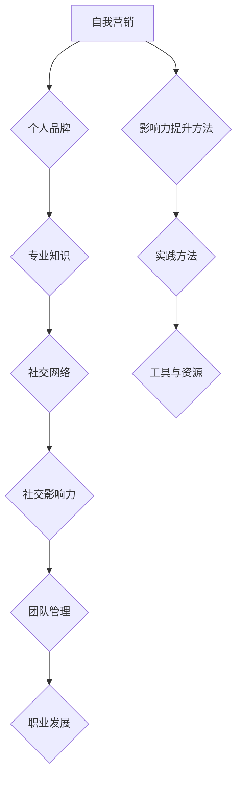

                 

基于您的要求，以下是对《管理者的自我营销：提升个人影响力的方法》的逐章节分析：

## 第1章 引言

### 1.1 管理者的自我营销意义

在第一节中，我们将介绍自我营销对于管理者的重要性。首先，自我营销是管理者个人品牌建设的关键环节。在当今信息爆炸的时代，管理者需要通过自我营销来提升个人知名度，增加个人影响力，进而更好地推动团队和组织的发展。

接下来，我们将探讨个人影响力在管理中的作用。个人影响力不仅可以帮助管理者在团队中获得更多的信任和支持，还可以提高决策的效率，优化团队的合作关系。

最后，我们将概述本书的核心内容和结构，让读者对后续章节有一个整体的了解。

### 1.2 个人影响力的重要性

在这一节中，我们将深入探讨个人影响力的重要性。首先，个人影响力是管理者职业生涯发展的重要资产。一个有影响力的管理者可以更容易地获得职业机会，提升职业地位。

接着，我们将分析个人影响力在团队管理中的作用。一个具有个人影响力的管理者可以更好地推动团队的协作，提高团队的执行力和创新能力。

最后，我们将讨论个人影响力对社会和组织的影响。一个有影响力的管理者可以推动社会进步，提升组织的竞争力。

### 1.3 本书的核心内容和结构

在第一节的最后，我们将对本书的核心内容和结构进行概述。本书将分为以下几个部分：

- **个人影响力的定义与构成**：介绍个人影响力的核心概念和构成要素。
- **自我营销策略**：探讨如何建立个人品牌，增强专业知识，利用社交网络等策略来提升个人影响力。
- **个人影响力营销实践**：通过口碑营销、内容营销、影响者营销等实践方法，详细讲解如何提升个人影响力。
- **个人影响力提升技巧**：介绍演讲、写作、个人形象塑造等技巧，帮助管理者提升个人影响力。
- **个人影响力与团队管理**：探讨个人影响力在团队管理中的应用，以及如何平衡团队影响力与个人影响力。
- **个人影响力与职业发展**：分析个人影响力对职业发展的影响，以及如何通过个人影响力实现职业发展。
- **总结与展望**：总结全书内容，展望个人影响力营销的未来发展趋势。

通过以上分析，我们可以看到，第一章主要介绍了自我营销对于管理者的重要性，以及本书的核心内容和结构。接下来，我们将逐章分析，深入探讨每个章节的核心概念和策略。

## 第2章 理解个人影响力

### 2.1 个人影响力的定义

在这一节中，我们将深入探讨个人影响力的定义。个人影响力是指个人在组织、团队或社会中，通过言行和影响力，使他人产生认同、信任、追随或改变的能力。这种能力不仅体现在个人在组织中的地位和权力，还包括个人的人格魅力、专业知识、沟通能力等多方面因素。

首先，个人影响力是一个多维度的概念，它不仅涉及个人在组织中的地位和权力，还包括个人的人格特质和专业知识。一个有影响力的人通常具有出色的沟通能力、领导力和解决问题的能力，能够在团队中发挥积极的引导作用。

其次，个人影响力是一个动态变化的过程。个人影响力不仅受到个人内在因素的影响，还受到外部环境的影响。例如，一个管理者的个人影响力可能会因为其在行业中的知名度、专业能力、人际关系等因素而提升或降低。

最后，个人影响力在管理中的作用至关重要。一个有影响力的管理者可以更好地推动团队的合作，提高团队的执行力和创新能力，从而实现组织的战略目标。

### 2.2 个人影响力的构成

个人影响力由多个要素构成，主要包括以下几个方面：

#### 1. **专业知识与技能**

专业知识与技能是个人影响力的基础。一个有影响力的管理者通常具有深厚的专业知识和技能，能够在工作中提供有价值的信息和见解，从而赢得他人的尊重和信任。

#### 2. **人格特质**

人格特质是个人影响力的关键因素。一个有影响力的人通常具有自信、诚实、公正、正直等特质，这些特质能够吸引他人，建立良好的人际关系。

#### 3. **沟通能力**

沟通能力是个人影响力的核心要素。一个有影响力的管理者能够清晰、准确地表达自己的想法，倾听他人的意见，并有效地与他人沟通，从而赢得他人的认同和支持。

#### 4. **领导力**

领导力是个人影响力的重要组成部分。一个有影响力的管理者不仅能够带领团队完成任务，还能够激发团队成员的潜力，培养他们的能力，从而提升团队的整体绩效。

#### 5. **人际关系**

人际关系是个人影响力的重要资源。一个有影响力的人通常拥有广泛的人际关系网络，能够借助这些资源解决问题，推动项目进展。

#### 6. **价值观与信念**

价值观与信念是个人影响力的精神支柱。一个有影响力的人通常具有明确的价值观和信念，能够在工作中坚持原则，赢得他人的尊重。

### 2.3 如何评估个人影响力

评估个人影响力是一个复杂的过程，需要从多个维度进行综合评估。以下是一些常用的评估方法：

#### 1. **360度评估**

360度评估是一种常用的评估方法，通过收集团队成员、上级、同事和下属的反馈，从多个角度评估个人的影响力。

#### 2. **关键绩效指标（KPI）**

关键绩效指标（KPI）是衡量个人影响力的客观指标，例如项目的成功率、团队的绩效、个人在项目中的贡献等。

#### 3. **社交网络分析**

通过分析个人在社交媒体上的影响力，如关注者数量、互动率、分享次数等，可以评估个人的社交影响力。

#### 4. **领导力评估工具**

领导力评估工具，如领导力测评、情境模拟等，可以帮助评估个人在领导力方面的表现。

通过以上分析，我们可以看到，个人影响力是一个多维度的概念，它由专业知识与技能、人格特质、沟通能力、领导力、人际关系、价值观与信念等多个要素构成。评估个人影响力需要从多个维度进行综合评估，以全面了解个人的影响力状况。在接下来的章节中，我们将继续探讨如何通过自我营销策略来提升个人影响力。

## 第3章 自我营销策略

### 3.1 建立个人品牌

个人品牌是个人影响力的重要体现，它是一个人在公众面前所展现的形象、声誉和价值观的综合体现。在当今竞争激烈的环境中，建立个人品牌已经成为提升个人影响力的重要手段。那么，如何建立个人品牌呢？

首先，**定位**是建立个人品牌的关键。定位决定了你的个人品牌在公众心中的形象和认知。一个清晰的定位可以帮助你在众多竞争者中脱颖而出，形成独特的个人标签。例如，你可以根据你的专业知识、工作经验和个人特长来确定你的定位，比如“数据科学家”、“技术领袖”、“创新专家”等。

接下来，**内容**是个人品牌的载体。通过撰写博客文章、发布技术文章、制作视频教程等方式，你可以向公众展示你的专业知识和见解。这些内容不仅要高质量，还要具备一定的传播性，能够吸引更多的关注和认可。例如，你可以定期发布关于你所在领域的技术趋势、案例分析、解决方案等内容，以此建立你在行业内的专业形象。

此外，**传播**也是建立个人品牌的重要环节。在内容制作完成后，你需要通过各种渠道进行传播，让更多的人了解和认可你的个人品牌。社交媒体平台如LinkedIn、Twitter、Facebook等都是很好的传播工具。你可以在这些平台上发布你的内容，并与同行、潜在客户建立联系。同时，参加行业会议、技术沙龙等活动也是扩大个人品牌影响力的重要途径。

### 3.2 增强个人专业知识

专业知识是个人影响力的重要基础，它决定了你的在团队和组织中的价值和地位。要增强个人专业知识，可以从以下几个方面入手：

首先，**持续学习**是非常重要的。在快速变化的科技领域，不断学习新知识、新技能是保持竞争力的关键。你可以通过在线课程、研讨会、技术论坛等方式来提升自己的专业知识。例如，参加Coursera、edX等在线教育平台上的专业课程，可以让你系统地学习最新的技术知识。

其次，**实践应用**是巩固专业知识的关键。只有将理论知识应用到实际工作中，才能真正理解和掌握这些知识。例如，你可以参与实际项目，解决实际问题，将所学知识转化为实际成果。

此外，**分享与传播**也是增强专业知识的重要手段。通过撰写技术博客、发表学术论文、分享经验教训等方式，你可以将自己的专业知识分享给更多的人，提升自己的专业影响力。例如，你可以定期发布关于你工作经验和项目总结的文章，以此展示你的专业能力和见解。

### 3.3 社交网络的利用

社交网络是现代信息传播的重要渠道，也是提升个人影响力的重要工具。合理利用社交网络，可以让你更好地展示个人品牌，扩大影响力。以下是一些利用社交网络的策略：

首先，**选择合适的社交平台**。不同的社交平台有不同的特点和用户群体，你需要根据你的目标受众选择合适的平台。例如，LinkedIn适合职业人士建立专业形象，Twitter适合快速传播信息和观点，Facebook适合与朋友和同行保持联系。

其次，**制定有效的社交策略**。在社交平台上，你需要发布有价值的、有吸引力的内容，与粉丝和关注者保持互动。你可以定期发布技术文章、行业动态、工作经验等内容，分享你的见解和思考。同时，你也可以参与行业讨论，回答问题，展示你的专业知识和能力。

此外，**建立人际关系网络**也是提升个人影响力的重要策略。在社交平台上，你可以与同行、专家、潜在客户建立联系，扩大你的影响力。你可以通过私信、评论、点赞等方式与这些人互动，建立良好的关系。

### 3.4 社交影响力提升

社交影响力是指个人在社交媒体上的影响力，它决定了你的内容能够被多少人看到、认可和传播。要提升社交影响力，可以从以下几个方面入手：

首先，**提高内容质量**。高质量的内容是提升社交影响力的重要因素。你的内容需要具有独特的观点、深入的分析、实用的技巧等，能够吸引读者的注意力。例如，你可以撰写关于技术趋势、解决方案、实战经验的博客文章，分享你的专业知识和经验。

其次，**增加互动频率**。互动是提升社交影响力的重要手段。通过回复评论、参与讨论、点赞和分享他人的内容等方式，你可以增加与粉丝和关注者的互动，提升你的社交影响力。

此外，**利用社交媒体算法**也是提升社交影响力的重要策略。了解不同社交媒体平台的算法规则，优化你的发布时间、内容形式、标签等，可以让你更好地利用平台资源，提升社交影响力。

通过以上分析，我们可以看到，自我营销策略是提升个人影响力的重要手段。通过建立个人品牌、增强专业知识、利用社交网络和提升社交影响力，管理者可以有效地提升自己的个人影响力，在团队和组织中发挥更大的作用。在接下来的章节中，我们将进一步探讨个人影响力营销的实践方法和技巧。

## 第4章 个人影响力营销实践

### 4.1 口碑营销

口碑营销是一种通过用户之间的自然口碑传播来提升个人影响力的营销策略。它在个人影响力营销中具有独特的优势，主要体现在以下几个方面：

首先，口碑营销是一种低成本的营销策略。与传统的广告和宣传手段相比，口碑营销不需要大量的资金投入，而是依靠用户的自发传播和推荐，从而达到提升个人影响力的目的。

其次，口碑营销具有高度可信度。用户之间的推荐和口碑传播是基于真实使用体验和感受的，因此更容易获得其他用户的信任和认可，从而提升个人影响力。

最后，口碑营销能够形成长期的品牌效应。通过用户之间的口碑传播，个人品牌可以逐渐在公众心中建立起来，形成稳定的品牌认知和影响力。

#### 4.1.1 口碑营销的原理

口碑营销的原理主要基于社会影响力和心理学原理。社会影响力包括群体压力、权威效应和从众行为等，这些因素都会影响用户的决策和行为。心理学原理则包括认知失调、社会认同和信任机制等，这些因素决定了用户在推荐和传播个人品牌时的心理动机和行为。

具体来说，口碑营销的原理可以概括为以下几点：

1. **用户推荐**：用户根据自己的真实体验和感受，向其他用户推荐个人品牌。这种推荐可以是直接的，如朋友之间的推荐，也可以是间接的，如在线评论、评分和分享。

2. **信任建立**：用户对推荐内容的信任是口碑营销成功的关键。通过展示用户的真实反馈和好评，可以增加其他用户对个人品牌的信任。

3. **信息扩散**：口碑营销通过用户之间的口碑传播，使得信息迅速扩散到更广泛的用户群体中，从而提升个人品牌的影响力。

#### 4.1.2 口碑营销的方法

口碑营销的方法主要包括以下几个方面：

1. **用户满意度**：提高用户满意度是口碑营销的基础。通过提供高质量的产品或服务，确保用户在使用过程中获得良好的体验，从而增加用户推荐的可能性。

2. **用户互动**：与用户建立良好的互动关系，了解用户的需求和反馈，及时解决问题，增强用户的忠诚度和信任感。

3. **内容分享**：鼓励用户在社交媒体上分享个人品牌的经验和故事，通过用户的口碑传播来扩大个人品牌的影响力。

4. **社交媒体推广**：利用社交媒体平台，发布高质量的口碑营销内容，如用户评价、案例分享等，吸引更多用户关注和参与。

5. **激励机制**：设计合理的激励机制，如优惠活动、奖励积分等，鼓励用户积极参与口碑营销活动。

#### 4.1.3 口碑营销的案例分析

以下是一个口碑营销的案例：

**案例背景**：某互联网公司通过口碑营销成功提升了其产品知名度。

**案例过程**：
1. **用户满意度提升**：公司通过优化产品功能和服务，提高了用户的满意度。用户在使用过程中感受到了产品的高质量和良好的服务体验。

2. **用户互动**：公司建立了用户社区，鼓励用户在社区中分享使用心得和反馈。社区管理员定期回复用户的问题，解决用户的困扰，增强了用户的归属感和信任感。

3. **内容分享**：公司鼓励用户在社交媒体上分享产品体验，发布使用案例和故事。公司提供了分享指南，帮助用户撰写和发布高质量的内容。

4. **社交媒体推广**：公司通过赞助技术论坛、举办线上活动等方式，在社交媒体上推广产品，吸引更多用户关注和参与。

5. **激励机制**：公司设计了用户积分和奖励系统，鼓励用户积极参与口碑营销活动。用户通过分享和推荐可以获得积分，积分可以兑换实物奖励或服务优惠。

**案例效果**：通过口碑营销，公司产品在短时间内获得了大量用户关注和好评，产品知名度大幅提升。公司通过用户口碑传播建立了良好的品牌形象，进一步推动了产品的销售和市场份额的提升。

通过以上案例，我们可以看到，口碑营销是一种有效的个人影响力营销策略。通过提高用户满意度、建立用户互动、内容分享、社交媒体推广和激励机制，个人可以有效地提升个人影响力，建立稳定的品牌认知。

### 4.2 内容营销

内容营销是通过创作和分发有价值的内容来吸引潜在客户，建立品牌认知，并最终推动销售的一种营销策略。在个人影响力营销中，内容营销具有独特的优势，它不仅能够提升个人品牌的专业形象，还能够扩大个人在目标受众中的影响力。

#### 4.2.1 内容营销的策略

内容营销的策略可以分为以下几个方面：

1. **目标受众分析**：首先，明确你的目标受众是谁，他们的需求和兴趣点是什么。只有了解你的受众，你才能创作出符合他们需求的内容。

2. **内容规划**：根据目标受众的需求，制定内容规划。内容规划应包括内容的主题、形式、发布频率和渠道等。例如，你可以制定一个每周发布一篇技术博客的计划，或者每月发布一次视频教程。

3. **内容创作**：内容创作是内容营销的核心。高质量的内容能够吸引读者，提升个人品牌的专业形象。在内容创作过程中，应注意以下几点：
    - **价值性**：内容应具备实际价值，能够解决读者的实际问题。
    - **独特性**：内容应具有独特性，避免与他人雷同，展示你的专业见解和独特视角。
    - **易读性**：内容应易于理解，避免过于专业或冗长的表述。

4. **内容分发**：内容创作完成后，需要通过适当的渠道进行分发，让更多受众看到。社交媒体平台、邮件订阅、合作伙伴网站等都是有效的分发渠道。

5. **互动与反馈**：与受众互动是内容营销的重要环节。通过评论、问答、调查等方式，了解受众的反馈和需求，不断优化内容。

#### 4.2.2 内容营销的实施

内容营销的实施可以分为以下几个步骤：

1. **确定内容类型**：根据目标受众的需求，确定内容类型。常见的内容类型包括博客文章、视频教程、白皮书、案例研究、教程指南等。

2. **创建内容**：根据确定的内容类型，开始创建内容。在内容创建过程中，应注意以下几点：
    - **选题**：选题应贴近目标受众的兴趣点，具备实际应用价值。
    - **结构**：内容应具备清晰的结构，易于读者阅读和理解。
    - **数据支持**：尽量使用数据或案例来支持你的观点，增强内容的说服力。

3. **编辑与优化**：完成初稿后，进行编辑和优化。检查内容的语法错误、逻辑结构、格式等方面，确保内容质量。

4. **发布与推广**：将内容发布到预定的渠道，如博客、社交媒体等。在发布时，应优化标题、摘要和关键词，提高内容的搜索引擎排名。

5. **监测与评估**：发布内容后，监测内容的访问量、评论数、分享数等指标，评估内容的效果。根据评估结果，优化内容策略。

#### 4.2.3 内容营销的效果评估

内容营销的效果评估是衡量内容营销效果的重要环节。以下是一些常用的评估方法：

1. **关键绩效指标（KPI）**：通过设定关键绩效指标（KPI），如访问量、转化率、互动率等，评估内容营销的效果。这些指标可以量化内容的价值和影响力。

2. **用户反馈**：通过用户反馈，了解内容的质量和受众的满意度。用户反馈可以是直接的评论、调查问卷，也可以是间接的社交媒体互动。

3. **内容分析**：通过分析内容的访问数据，如访问量、停留时间、跳出率等，评估内容的吸引力和质量。

4. **ROI计算**：计算内容营销的投资回报率（ROI），通过评估内容的直接经济效益，如广告收入、销售增长等。

通过以上分析，我们可以看到，内容营销是提升个人影响力的重要策略。通过明确目标受众、制定内容规划、创建高质量内容、有效分发和互动，个人可以有效地提升个人品牌的影响力，在目标受众中建立良好的专业形象。在接下来的章节中，我们将继续探讨个人影响力营销的其他实践方法和技巧。

### 4.3 影响者营销

#### 4.3.1 影响者的筛选与评估

影响者营销是通过与在特定领域具有广泛影响力和关注度的个人（即“影响者”）合作，来提升个人品牌和影响力的策略。影响者营销的关键在于筛选和评估合适的影响者，以下是一些筛选和评估的方法：

1. **影响力评估**：首先，需要评估影响者的实际影响力。这可以通过衡量影响者的关注者数量、互动率、分享次数等指标来实现。例如，影响者可能在社交媒体上拥有数十万甚至数百万的粉丝，但他们的互动率可能较低，这意味着他们的影响力可能并不如表面上看起来那么强。

2. **专业领域匹配**：影响者的专业领域应与个人品牌的定位相符。如果影响者在个人所在领域的专业性和知名度较高，那么他们更有可能帮助提升个人品牌的影响力。

3. **合作潜力评估**：评估影响者与个人合作的潜力。这包括影响者的合作态度、沟通能力、合作历史等方面。一个愿意分享资源和经验的影响者可以带来更多的合作机会和资源。

4. **声誉评估**：影响者的声誉也是重要的考虑因素。一个具有良好声誉的影响者可以增加合作的可信度和效果。

#### 4.3.2 影响者的合作与沟通

与影响者的合作是影响者营销的核心环节，以下是一些合作和沟通的策略：

1. **明确合作目标**：在开始合作前，明确双方的合作目标。这些目标可以包括提升个人品牌的知名度、扩大受众范围、推广某项产品或服务等。

2. **制定合作计划**：制定详细的合作计划，包括合作形式（如共同撰写文章、参与活动、互推等）、时间表、预期效果等。确保合作计划的可行性和双方都能接受。

3. **有效沟通**：与影响者保持良好的沟通，及时分享信息和反馈。有效的沟通可以减少误解和冲突，确保合作顺利进行。

4. **资源共享**：在合作过程中，双方可以共享资源，如内容创作、推广渠道、人脉资源等，以提升合作的整体效果。

#### 4.3.3 影响者营销的案例分析

以下是一个影响者营销的案例：

**案例背景**：一位数据科学家希望通过与影响者合作，提升其在数据科学领域的知名度和影响力。

**案例过程**：
1. **筛选影响者**：通过分析社交媒体上的数据，他选择了在数据科学领域具有较高影响力且与他的专业领域相符的影响者，如知名数据科学家、数据科学博客博主等。

2. **建立联系**：通过社交媒体私信或电子邮件，他与这些影响者建立了初步联系，表达了合作的意愿。

3. **共同创作内容**：他与影响者共同撰写了一篇关于最新数据科学技术的博客文章，并在双方的个人和社交媒体平台上发布。

4. **互动与推广**：在文章发布后，他积极参与读者的互动，回答问题，同时影响者也在他们的社交网络中推广了这篇文章。

5. **评估效果**：通过监测文章的访问量、点赞数、分享次数等指标，他评估了合作的效果。结果显示，文章获得了较高的关注度和好评，进一步提升了他的个人品牌影响力。

**案例效果**：通过影响者营销，这位数据科学家成功提升了其在数据科学领域的知名度和影响力，吸引了更多的关注者和合作机会。

通过以上案例，我们可以看到，影响者营销是一种有效的个人影响力提升策略。通过筛选合适的影响者、建立合作关系、共同创作内容、互动与推广，个人可以借助影响者的力量，扩大自己的影响力，提升个人品牌。

### 4.4 演讲技巧

#### 4.4.1 演讲的结构与内容

演讲是提升个人影响力的重要技巧之一。一个成功的演讲需要具备清晰的结构和丰富的内容。以下是演讲的基本结构和内容要点：

1. **引言**：引言是演讲的开头部分，需要吸引听众的注意力。可以通过讲述一个有趣的故事、提出一个引人思考的问题、展示一个引人注目的数据等方式来引出主题。

2. **主题陈述**：在引言之后，明确地陈述演讲的主题。主题陈述需要简洁明了，能够概括演讲的核心内容。

3. **主体部分**：主体部分是演讲的核心，需要详细阐述主题。主体部分可以分为几个小节，每个小节都有一个明确的观点或论点。在每个小节中，可以通过事实、数据、案例等方式来支持论点。

4. **结论**：结论是对演讲内容的总结和归纳。在结论中，强调演讲的主要观点，并提出行动建议或展望。

5. **互动环节**：在演讲过程中，适时的互动可以增强听众的参与感。可以通过提问、讨论、演示等方式与听众互动。

#### 4.4.2 演讲的技巧与练习

演讲技巧的提高需要通过不断的练习和反思。以下是一些演讲技巧和练习方法：

1. **准备工作**：充分的准备工作是成功演讲的基础。在准备过程中，需要确定演讲的主题、目标受众、演讲的结构和内容，并进行详细的资料搜集和整理。

2. **练习演讲**：通过多次练习演讲，可以提高表达能力和自信心。可以在镜子前练习，或在朋友和同事面前进行模拟演讲，接受反馈和改进。

3. **掌握节奏**：演讲的节奏要适中，不能过快或过慢。可以通过调整语速、停顿和语气来掌握节奏。

4. **运用肢体语言**：肢体语言可以增强演讲的感染力。可以通过手势、面部表情、姿态等方式来辅助表达。

5. **控制情绪**：保持冷静和自信，避免过度紧张或激动。可以通过深呼吸、正面心理暗示等方式来控制情绪。

6. **应对突发情况**：演讲中可能会遇到各种突发情况，如设备故障、听众提问等。需要提前做好准备，并学会灵活应对。

#### 4.4.3 演讲的案例分析

以下是一个演讲的案例分析：

**案例背景**：一位技术专家在一场技术会议上进行演讲，主题是“大数据在医疗领域的应用”。

**案例过程**：
1. **引言**：演讲专家通过一个真实的医疗案例引入主题，引起了听众的兴趣。

2. **主题陈述**：专家明确地陈述了演讲的主题，即大数据在医疗领域的应用，并提出了几个关键观点。

3. **主体部分**：专家详细阐述了大数据在医疗领域的应用场景，通过具体的案例和数据展示了大数据在疾病预测、诊断和治疗中的重要作用。

4. **结论**：专家总结了演讲的主要观点，强调了大数据在医疗领域的巨大潜力和发展前景。

5. **互动环节**：在演讲过程中，专家积极与听众互动，回答了听众的问题，增强了听众的参与感。

**案例效果**：演讲得到了听众的高度评价，专家的技术见解和观点引起了广泛的关注和讨论。

通过以上分析，我们可以看到，演讲技巧对于提升个人影响力至关重要。通过清晰的结构、丰富的内容、巧妙的技巧和不断的练习，个人可以有效地提升演讲能力，扩大个人影响力。

### 4.5 写作技巧

#### 4.5.1 写作的目标与风格

写作是个人影响力的重要体现，它能够有效地传达思想、知识和经验。为了提升个人影响力，写作的目标和风格需要明确和针对性。以下是写作的目标与风格的关键要素：

1. **目标受众**：明确写作的目标受众是成功写作的第一步。不同的受众群体对内容的需求和期望不同，因此需要根据目标受众的特点来制定写作目标。例如，如果目标受众是技术专业人士，那么内容需要深入且具有技术性；如果目标受众是普通读者，那么内容需要通俗易懂。

2. **明确主题**：在写作前，需要明确主题和核心观点。主题应该是具体、明确且有吸引力的，能够引起读者的兴趣。同时，核心观点需要贯穿全文，确保内容的一致性和连贯性。

3. **风格定位**：写作风格是个人品牌的重要组成部分。风格应该符合目标受众的喜好，同时体现个人的独特性和专业性。例如，可以采用正式、幽默、亲切等不同的风格，但需要保持风格的一致性。

#### 4.5.2 写作的技巧与方法

写作技巧和方法的掌握对于提升写作质量和影响力至关重要。以下是几种常用的写作技巧和方法：

1. **构思与规划**：在写作前，需要进行构思和规划。可以通过列出提纲、确定段落结构、制定写作计划等方式来确保内容的条理性和逻辑性。

2. **逻辑清晰**：确保文章的逻辑清晰，内容有条理。可以通过使用序号、小标题、过渡句等方式来增强文章的连贯性和易读性。

3. **简洁明了**：写作应简洁明了，避免冗长的句子和复杂的词汇。通过简化句子结构、使用简单词汇等方式，可以提高文章的可读性。

4. **举例说明**：使用具体的例子来解释观点，能够使文章更加生动和有说服力。例子可以是实际案例、数据、故事等。

5. **互动与反馈**：鼓励读者参与互动，通过提问、讨论等方式激发读者的思考和参与。同时，及时回应读者的反馈，可以增强读者的归属感和忠诚度。

#### 4.5.3 写作的案例分析

以下是一个写作的案例分析：

**案例背景**：一位技术专家在LinkedIn上发布了一篇技术博客文章，主题是“深度学习在自然语言处理中的应用”。

**案例过程**：
1. **明确目标受众**：专家明确目标受众是技术专业人士，因此在写作时采用了深入的技术分析和详细的理论讲解。

2. **明确主题和风格**：文章的主题是深度学习在自然语言处理中的应用，风格是专业、严谨且具有技术深度。

3. **逻辑清晰**：文章采用了有序的章节结构，每个章节都明确了观点和论点，通过举例和图表增强了文章的可读性。

4. **简洁明了**：专家在写作中避免了复杂的词汇和冗长的句子，使得文章简洁明了。

5. **互动与反馈**：专家在文章末尾鼓励读者提问和讨论，并定期回复读者的评论和问题。

**案例效果**：文章在LinkedIn上获得了很高的阅读量和点赞数，不少读者留言表示文章对他们的工作和学习有很大的帮助。

通过以上分析，我们可以看到，写作技巧对于提升个人影响力至关重要。通过明确目标受众、确定主题和风格、逻辑清晰、简洁明了和互动反馈，个人可以有效地提升写作质量，扩大个人影响力。

### 4.6 个人形象塑造

#### 4.6.1 个人形象的构成

个人形象是指一个人在公众面前所展现的整体印象，它由多个因素构成，包括外表、言行、举止、着装等。一个良好的个人形象不仅可以提升个人魅力，还可以增强个人影响力。以下是个人形象构成的关键因素：

1. **外表**：外表是个人形象的重要组成部分。整洁的仪表、得体的打扮可以给人留下良好的第一印象。例如，定期理发、穿着得体、保持干净整洁等。

2. **言行**：言行是指一个人的语言表达和行为举止。真诚、礼貌、自信的语言和得体的行为举止可以树立良好的个人形象。例如，使用礼貌用语、保持眼神交流、倾听他人意见等。

3. **举止**：举止包括个人在公共场合的行为举止。良好的举止可以展现个人的修养和教养，例如，排队等候、遵守公共秩序、不随意打断他人等。

4. **着装**：着装是个人形象的直观体现。合适的着装可以展现个人的职业形象和专业素养。例如，正式场合穿着正装、休闲场合穿着休闲装等。

#### 4.6.2 个人形象的优化

优化个人形象需要从多个方面进行努力，以下是一些优化个人形象的方法：

1. **提升专业技能**：通过不断学习和提升专业技能，可以增强个人的自信心和职业素养，从而优化个人形象。

2. **建立良好的人际关系**：通过积极参与社交活动、建立良好的人际关系，可以提升个人在社会中的影响力，从而优化个人形象。

3. **提升沟通能力**：良好的沟通能力可以增强个人的表达能力和影响力，从而优化个人形象。

4. **培养良好的生活习惯**：保持良好的生活习惯，如定时作息、健康饮食、定期锻炼等，可以提升个人的精神面貌和身体健康，从而优化个人形象。

5. **注重个人修养**：注重个人修养，如学习传统文化、阅读经典书籍、培养兴趣爱好等，可以提升个人的文化素养和内在修养，从而优化个人形象。

#### 4.6.3 个人形象的案例分析

以下是一个个人形象优化的案例分析：

**案例背景**：一位年轻的工程师希望通过优化个人形象来提升在职场中的影响力。

**案例过程**：
1. **提升专业技能**：工程师通过参加在线课程和实际项目，不断提升自己的专业技能，从而增强自信心和专业素养。

2. **建立良好的人际关系**：工程师积极参与公司内部和行业外部的社交活动，与同事和行业专家建立良好的关系，扩大自己的社交圈子。

3. **提升沟通能力**：工程师参加沟通技巧培训课程，通过不断的练习和反思，提升自己的沟通能力，增强表达效果。

4. **培养良好的生活习惯**：工程师保持良好的作息时间，健康饮食，定期进行体育锻炼，提升自己的精神面貌和身体健康。

5. **注重个人修养**：工程师通过阅读经典书籍、学习传统文化，提升自己的文化素养和内在修养。

**案例效果**：通过一系列的努力，工程师在职场中得到了同事和上级的认可，个人影响力显著提升。

通过以上分析，我们可以看到，个人形象优化对于提升个人影响力至关重要。通过提升专业技能、建立良好的人际关系、提升沟通能力、培养良好的生活习惯和注重个人修养，个人可以有效地优化个人形象，提升个人影响力。

### 4.7 团队影响力的重要性

团队影响力是指一个团队在组织内部或外部产生的影响力和影响力。它不仅反映了团队的综合素质和能力，还直接关系到团队的绩效、凝聚力和竞争力。以下是团队影响力的重要性分析：

首先，团队影响力对团队绩效具有重要影响。一个有影响力的团队可以在组织内得到更多的支持和资源，从而更好地实现团队目标和任务。有影响力的团队通常能够高效地沟通、协作和解决问题，从而提高工作质量和效率。

其次，团队影响力对团队凝聚力具有重要作用。一个有影响力的团队通常具有强烈的团队意识和归属感，团队成员之间相互信任、尊重和支持，形成紧密的团队关系。这种凝聚力可以增强团队成员的忠诚度和责任感，促进团队成员共同为实现团队目标而努力。

此外，团队影响力对团队的竞争力具有显著影响。在激烈的市场竞争中，有影响力的团队可以更容易地获得客户的信任和认可，从而在市场上占据有利地位。同时，有影响力的团队可以吸引和留住优秀的人才，提升团队的创新能力和发展潜力。

#### 4.7.1 团队影响力的构成

团队影响力由多个要素构成，主要包括以下几个方面：

1. **专业能力**：团队的专业能力是团队影响力的基础。一个具有高专业能力的团队可以在项目中展现出卓越的能力和解决问题的能力，从而赢得他人的尊重和信任。

2. **领导力**：团队领导力是团队影响力的关键因素。一个有影响力的团队领导能够激励团队成员，提供明确的方向和目标，并在团队中建立良好的沟通和协作机制。

3. **团队协作**：团队协作是团队影响力的体现。一个高效的团队需要具备良好的协作精神，能够在团队成员之间形成有效的沟通和合作，共同实现团队目标。

4. **创新能力**：创新能力是团队影响力的重要标志。一个具有创新能力的团队能够不断挑战现状，提出新的解决方案，从而在竞争中保持优势。

5. **社会责任感**：团队的社会责任感也是团队影响力的重要组成部分。一个具有社会责任感的团队能够积极参与社会公益活动，提升团队的社会形象和影响力。

#### 4.7.2 团队影响力的影响

团队影响力对团队和组织的影响主要体现在以下几个方面：

1. **提高团队绩效**：团队影响力可以增强团队的凝聚力和执行力，提高团队的工作效率和绩效。

2. **提升团队士气**：团队影响力可以激励团队成员，提升团队的士气和工作积极性，从而提高团队的整体表现。

3. **增强组织竞争力**：团队影响力可以提升团队在组织中的地位和影响力，增强组织在市场中的竞争力。

4. **培养优秀人才**：团队影响力可以吸引和留住优秀的人才，为团队和组织的发展提供强有力的支持。

5. **提升团队形象**：团队影响力可以提升团队在社会中的形象和声誉，为团队和组织争取更多的资源和机会。

通过以上分析，我们可以看到，团队影响力对团队和组织的发展具有重要作用。通过提升专业能力、领导力、团队协作、创新能力和社会责任感，团队可以有效地增强团队影响力，提升团队和组织的发展潜力。

### 4.8 个人影响力在团队管理中的应用

在团队管理中，个人影响力发挥着至关重要的作用。一个有影响力的管理者可以有效地推动团队的工作，提高团队的绩效和凝聚力。以下是个人影响力在团队管理中的应用方法和策略：

#### 4.8.1 个人影响力在团队决策中的应用

1. **沟通与协调**：一个有影响力的管理者可以通过有效的沟通和协调，在团队决策过程中发挥关键作用。在制定决策时，管理者可以积极倾听团队成员的意见和建议，确保决策的全面性和公正性。同时，通过协调不同团队成员之间的利益和观点，管理者可以推动决策的顺利实施。

2. **引导与激励**：管理者可以利用个人影响力，引导团队成员朝着共同的目标努力。通过激励团队成员，管理者可以激发他们的积极性和创造力，从而提高决策的实施效果。例如，管理者可以通过认可和奖励来激励团队成员，增强他们对决策的认同感和参与度。

3. **决策影响力**：一个有影响力的管理者在团队决策中具有较大的话语权和影响力。管理者可以通过提出具有建设性和创新性的观点，引导团队朝着正确的方向前进。同时，管理者可以通过合理的决策和行动，树立良好的榜样，增强团队成员的信任和依赖。

#### 4.8.2 个人影响力在团队沟通中的应用

1. **促进信息共享**：个人影响力可以帮助管理者在团队内部建立有效的沟通机制，促进信息的共享和传递。通过个人影响力，管理者可以鼓励团队成员积极参与沟通，分享自己的观点和经验，从而提高团队的协作效率和决策质量。

2. **解决冲突**：在团队沟通中，不可避免地会出现意见分歧和冲突。有影响力的管理者可以利用个人影响力，通过中立、公正的方式解决冲突，确保团队沟通的顺畅。管理者可以通过倾听、同理心和理解，帮助团队成员找到共识和解决方案，从而维护团队的整体利益。

3. **建立信任**：个人影响力有助于建立团队成员之间的信任关系。通过积极的沟通和互动，管理者可以增强团队成员之间的互信和合作意愿，从而提高团队的凝聚力和工作效率。

#### 4.8.3 个人影响力在团队激励中的应用

1. **激励策略**：个人影响力可以帮助管理者制定有效的激励策略，激发团队成员的潜力。管理者可以通过个性化激励措施，如认可、奖励、培训等，满足团队成员的不同需求和期望，从而提高他们的工作积极性和满意度。

2. **目标设定**：有影响力的管理者可以通过设定明确、具体的目标，引导团队成员朝着共同的目标努力。通过明确的目标，管理者可以帮助团队成员更好地理解和接受团队的愿景和使命，从而增强他们的工作动力和责任感。

3. **榜样作用**：个人影响力可以帮助管理者通过自己的行为和榜样作用，影响团队成员的工作态度和行为。管理者可以通过自己的积极行动和责任心，树立良好的工作榜样，激励团队成员积极向上，共同实现团队目标。

通过以上分析，我们可以看到，个人影响力在团队管理中具有广泛的应用。通过有效的沟通、协调、激励和榜样作用，管理者可以充分发挥个人影响力，推动团队的发展和进步。在接下来的章节中，我们将进一步探讨如何平衡团队影响力与个人影响力，实现团队和个人的双赢。

### 4.9 团队影响力与个人影响力的平衡

在团队管理中，平衡团队影响力和个人影响力是一个重要的课题。一个成功的团队需要在确保个人充分发挥其影响力的同时，维护团队的统一和协作。以下是关于团队影响力与个人影响力的平衡策略：

#### 4.9.1 团队影响力与个人影响力的关系

团队影响力与个人影响力之间存在一定的相互依存关系。个人影响力是团队影响力的基础，个人的专业能力、领导力和沟通技巧等都是团队影响力的组成部分。然而，团队影响力不仅仅是个人影响力的简单累加，它还涉及到团队整体的协作、共同目标和协同效应。

#### 4.9.2 团队影响力与个人影响力的冲突

团队影响力与个人影响力之间的冲突往往源于目标的不一致和资源分配的矛盾。在某些情况下，个人为了追求自身的利益或成就感，可能会忽视团队的整体目标，从而导致团队内部矛盾和协作不畅。例如，一个团队成员可能在个人项目中投入过多精力，忽视了团队项目的进展，从而影响整体绩效。

#### 4.9.3 团队影响力与个人影响力的协调

要实现团队影响力与个人影响力的平衡，可以采取以下策略：

1. **明确团队目标**：确保所有团队成员都清楚团队的目标和愿景，这样可以减少个人目标与团队目标之间的冲突。通过共同的目标，可以激发团队成员的协同合作意识。

2. **建立公平的激励机制**：设计合理的激励机制，确保团队成员的个人贡献能够得到公平的认可和回报。这不仅能够激励个人，还能促进团队成员之间的公平竞争和合作。

3. **增强团队沟通**：通过定期团队会议、内部交流和反馈机制，增强团队成员之间的沟通和理解，减少误解和矛盾。有效的沟通可以确保团队成员在目标一致的情况下，发挥各自的优势。

4. **培养团队合作精神**：鼓励团队成员相互支持、共同解决问题，形成团队合力。团队合作精神可以通过团队建设活动、共享成功和失败的经历等方式来培养。

5. **领导者的角色**：领导者需要发挥关键作用，既要支持团队成员的个人发展，又要维护团队的团结和协作。领导者可以通过示范作用、公正决策和有效的团队管理来平衡个人影响力和团队影响力。

#### 4.9.4 具体案例与最佳实践

以下是一个关于团队影响力与个人影响力平衡的案例：

**案例背景**：一个高科技公司的产品开发团队在项目推进过程中，团队领导发现团队成员的个人影响力开始对团队的整体协调产生负面影响。

**案例过程**：
1. **明确团队目标**：团队领导组织了一次全体会议，明确了团队的目标和愿景，并确保每个成员都理解并认同这些目标。

2. **建立公平激励机制**：团队领导重新评估了团队成员的绩效评估体系，确保个人的贡献得到合理的认可和回报，从而减少了个人与团队目标之间的冲突。

3. **增强团队沟通**：团队领导建立了每周的团队会议制度，鼓励团队成员在会议中分享各自的进展和问题，通过开放的沟通解决了许多潜在的冲突。

4. **培养团队合作精神**：团队领导组织了一系列团队建设活动，如团队合作游戏和共同解决难题挑战，增强了团队成员之间的默契和协作精神。

5. **领导者的角色**：团队领导通过示范作用，积极参与团队项目的各个阶段，并在决策过程中充分考虑团队成员的意见，树立了良好的团队领导榜样。

**案例效果**：通过一系列措施，团队的影响力和个人影响力得到了有效平衡，团队项目取得了显著进展，团队成员之间的协作和信任也得到了提升。

通过以上案例和最佳实践，我们可以看到，平衡团队影响力与个人影响力需要通过明确目标、公平激励、增强沟通、培养团队合作精神和领导者的有效作用来实现。在团队管理中，领导者需要扮演关键角色，通过有效的策略和管理，确保团队和个人的共同成功。

### 4.10 个人影响力与职业发展

个人影响力对职业发展具有深远的影响，它是职业成功的重要推动力。一个有影响力的职业人士不仅能够在职业生涯中获得更多的机会，还能提升职业地位和薪资待遇。以下是关于个人影响力与职业发展的关系及其提升策略：

#### 4.10.1 个人影响力与职业发展的关系

个人影响力是职业发展的重要资产。它不仅能够帮助职业人士在职场中建立良好的声誉，还能增强个人在组织中的话语权和影响力。以下是个人影响力对职业发展的影响：

1. **职业机会**：有影响力的个人更容易获得职业机会，如升职、调岗或项目领导等。这是因为他们在组织中具有更高的知名度和认可度。

2. **职业地位**：个人影响力可以提升职业地位，使职业人士在组织中获得更多的尊重和重视。一个有影响力的职业人士通常在组织中具有更大的决策权和影响力。

3. **薪资待遇**：个人影响力还可以提升薪资待遇。有影响力的职业人士往往能够获得更高的薪资和更多的福利待遇，因为他们的贡献和价值得到了充分的认可。

#### 4.10.2 个人影响力的提升策略

要提升个人影响力，可以从以下几个方面入手：

1. **专业知识**：专业知识和技能是个人影响力的基础。通过不断学习和提升专业技能，可以增强个人在职场中的竞争力和影响力。

2. **领导力**：领导力是提升个人影响力的重要手段。一个优秀的领导者能够激励团队成员，带领团队实现目标，从而提升个人在团队中的影响力和领导地位。

3. **沟通能力**：良好的沟通能力可以帮助个人有效地传达思想、解决问题和建立人际关系。通过提升沟通技巧，可以增强个人在职场中的影响力和说服力。

4. **人际网络**：建立广泛的人际网络是提升个人影响力的重要途径。通过积极参与社交活动，建立和维护人际关系，可以扩大个人在职场中的影响力。

5. **个人品牌**：建立个人品牌是提升个人影响力的关键。通过发布高质量的内容、参与行业讨论、展示专业知识和经验，可以在职场中建立良好的专业形象和声誉。

6. **口碑**：良好的口碑是个人影响力的重要体现。通过提供高质量的服务和产品，赢得用户的信任和好评，可以增强个人在职场中的影响力。

#### 4.10.3 个人影响力提升的案例分析

以下是一个关于个人影响力提升的案例分析：

**案例背景**：一位技术工程师希望通过提升个人影响力来实现职业发展的突破。

**案例过程**：
1. **专业知识提升**：工程师通过参加专业培训和自学，不断提升自己的技术水平和专业知识，成为团队中的技术权威。

2. **领导力培养**：工程师积极参与团队项目，担任项目负责人，通过有效的领导和协调，成功完成了多个重要项目。

3. **沟通能力提升**：工程师通过参加沟通技巧培训，提升了自己的沟通能力，能够清晰、准确地表达自己的想法，并有效地与他人沟通和协作。

4. **人际网络建立**：工程师积极参与行业活动，建立和维护了广泛的人际网络，与同行、专家和潜在客户建立了良好的关系。

5. **个人品牌建设**：工程师通过撰写技术博客、参与行业讨论，展示了专业知识和见解，建立了良好的个人品牌形象。

6. **口碑建设**：工程师通过提供高质量的技术支持和服务，赢得了用户的信任和好评，个人影响力在职场中不断提升。

**案例效果**：通过一系列努力，工程师在职业生涯中取得了显著突破，成功晋升为技术经理，薪资待遇也得到了显著提升。

通过以上分析，我们可以看到，个人影响力对职业发展具有重要影响。通过提升专业知识、领导力、沟通能力、人际网络、个人品牌建设和口碑建设，个人可以有效地提升个人影响力，实现职业发展的突破。

### 4.11 个人影响力与职业品牌建设

个人影响力与职业品牌建设密切相关。职业品牌是个人在职场中的声誉和形象，它体现了个人的专业技能、工作态度和价值观。一个强大的职业品牌能够为个人带来更多的职业机会和竞争优势。以下是关于个人影响力与职业品牌建设的关系及提升策略：

#### 4.11.1 职业品牌的概念与构成

职业品牌是指个人在职场中的声誉和形象，它包括以下几个方面：

1. **专业技能**：职业品牌的核心是个人在某一领域的专业知识和技能。通过不断学习和实践，个人可以提升自己的专业技能，从而在职场中树立专业形象。

2. **工作态度**：工作态度是职业品牌的重要组成部分。一个积极、认真、负责任的工作态度能够赢得同事和上级的信任和认可。

3. **人际关系**：良好的人际关系是职业品牌的重要支撑。通过建立和维护良好的人际网络，个人可以在职场中形成强大的影响力。

4. **个人价值观**：个人的价值观和职业信仰是职业品牌的核心。一个具有明确价值观和坚定信仰的个人能够在职场中树立独特的品牌形象。

#### 4.11.2 职业品牌的建设与维护

要建设一个强大的职业品牌，个人需要采取以下措施：

1. **持续学习**：持续学习是提升专业技能和保持职场竞争力的重要途径。通过参加培训课程、阅读专业书籍、参与行业研讨会等方式，个人可以不断更新和提升自己的知识体系。

2. **展示专业能力**：在工作和生活中，积极展示自己的专业能力，如通过参与重要项目、解决复杂问题、撰写专业文章等，提升个人在职场中的影响力。

3. **建立良好的人际关系**：通过积极参与社交活动、建立和维护人际关系网络，个人可以扩大自己的影响力，提高职业品牌的知名度。

4. **传递积极价值观**：在工作和生活中，传递积极、正面的价值观和信仰，树立良好的职业形象。通过言行一致，个人可以赢得他人的尊重和信任。

5. **保持诚信**：诚信是职业品牌的重要基石。一个诚信的人能够在职场中建立良好的声誉，赢得同事和客户的信任。

6. **持续维护**：职业品牌建设是一个持续的过程。个人需要定期评估和调整自己的职业品牌策略，确保品牌形象始终保持新鲜和有吸引力。

#### 4.11.3 职业品牌的案例分析

以下是一个职业品牌建设的案例分析：

**案例背景**：一位技术专家希望通过提升职业品牌来推动自己的职业发展。

**案例过程**：
1. **持续学习**：技术专家通过参加专业培训和自学，不断更新自己的知识体系，提升专业技能。

2. **展示专业能力**：专家积极参与重要项目，解决复杂技术问题，并在公司内部分享技术见解和经验。

3. **建立人际关系**：专家积极参与行业活动，与同行建立良好的关系，扩大自己的影响力。

4. **传递积极价值观**：专家在工作中始终坚持诚信和敬业，树立了良好的职业形象。

5. **保持诚信**：专家始终遵守职业道德，赢得了同事和客户的信任。

6. **持续维护**：专家定期评估和调整自己的职业品牌策略，确保品牌形象始终保持新鲜和有吸引力。

**案例效果**：通过一系列努力，专家在职场中建立了强大的职业品牌，成功晋升为技术总监，并在行业内获得了广泛的认可和赞誉。

通过以上分析，我们可以看到，个人影响力与职业品牌建设密切相关。通过持续学习、展示专业能力、建立人际关系、传递积极价值观、保持诚信和持续维护，个人可以有效地提升职业品牌，实现职业发展目标。

### 4.12 个人影响力在职场中的运用

个人影响力在职场中的运用对于职业发展和团队协作具有重要意义。以下是关于个人影响力在职场中的具体应用方法及其效果：

#### 4.12.1 个人影响力在职场沟通中的应用

1. **提升沟通效果**：个人影响力可以帮助职场人士更有效地传达信息。一个有影响力的人可以通过清晰、简洁和有说服力的表达，使信息更易被接受和理解。

2. **解决沟通障碍**：在职场中，沟通障碍往往会导致误解和冲突。个人影响力可以帮助职场人士通过积极的沟通和调解，解决沟通中的问题，促进团队的和谐。

3. **建立信任关系**：通过个人影响力，职场人士可以更容易地与他人建立信任关系。信任是团队合作的基础，一个有影响力的人可以促进团队成员之间的互信和合作。

#### 4.12.2 个人影响力在职场协作中的应用

1. **推动团队协作**：个人影响力可以帮助职场人士在团队中发挥领导作用，推动团队协作。通过激发团队成员的积极性，协调团队成员的工作，实现团队目标。

2. **解决团队冲突**：在团队协作过程中，难免会出现冲突。个人影响力可以帮助职场人士通过有效的沟通和调解，解决团队冲突，维护团队稳定。

3. **提升团队绩效**：个人影响力可以激励团队成员，提高团队的工作效率和绩效。一个有影响力的职场人士可以通过设定明确的目标、提供有效的指导和支持，推动团队达成卓越的业绩。

#### 4.12.3 个人影响力在职场发展中的应用

1. **拓展职业机会**：个人影响力可以帮助职场人士在职业发展中获得更多的机会。一个有影响力的职场人士更容易获得晋升、项目领导等职业机会，实现职业发展的突破。

2. **提升职业地位**：个人影响力可以提升职场人士的职业地位。通过在职场中展现出卓越的能力和影响力，职场人士可以获得更多的认可和尊重，从而提升自己的职业地位。

3. **增强竞争力**：个人影响力可以帮助职场人士在职场中保持竞争力。通过不断学习和提升个人能力，职场人士可以持续增强自己的竞争优势，在职场中立于不败之地。

#### 4.12.4 个人影响力提升案例分析

以下是一个关于个人影响力提升在职场中应用的案例分析：

**案例背景**：一位项目经理希望通过提升个人影响力，推动团队项目的成功。

**案例过程**：
1. **提升沟通效果**：项目经理通过参加沟通技巧培训，提高了自己的表达能力和说服力。在项目会议中，项目经理能够清晰、简洁地传达项目目标和计划，确保团队成员理解并支持项目的推进。

2. **解决沟通障碍**：在项目初期，团队内部出现了一些沟通障碍。项目经理利用自己的影响力，通过组织团队讨论和沟通，解决了团队之间的误解和分歧，确保项目进展顺利。

3. **建立信任关系**：项目经理通过与团队成员建立良好的沟通和互动，赢得了团队成员的信任和尊重。团队成员愿意在项目经理的领导下共同努力，实现项目目标。

4. **推动团队协作**：项目经理通过设定明确的目标、提供有效的指导和支持，激发了团队的工作热情和积极性。团队成员在项目经理的领导下，紧密合作，顺利完成了项目任务。

5. **提升团队绩效**：在项目经理的领导下，团队项目取得了显著进展，提前完成了项目目标。项目成果得到了客户的高度评价，为公司赢得了良好的口碑。

**案例效果**：通过提升个人影响力，项目经理不仅推动了团队项目的成功，还在职场中建立了良好的声誉和影响力，为自身的职业发展奠定了坚实基础。

通过以上案例分析，我们可以看到，个人影响力在职场中的运用对于提升沟通效果、解决沟通障碍、建立信任关系、推动团队协作和提升团队绩效具有重要意义。通过不断提升个人影响力，职场人士可以更有效地实现职业目标和团队目标，推动个人和团队的共同发展。

### 4.13 总结与展望

在本文中，我们系统地探讨了管理者的自我营销与个人影响力的提升方法。首先，我们明确了自我营销对于管理者的重要性，并深入分析了个人影响力的定义、构成和评估方法。接着，我们详细阐述了自我营销策略，包括建立个人品牌、增强专业知识、利用社交网络和提升社交影响力等。在此基础上，我们探讨了个人影响力营销的实践方法，如口碑营销、内容营销、影响者营销等。同时，我们还讨论了个人影响力在团队管理和职业发展中的应用，以及如何平衡团队影响力与个人影响力。

通过以上分析，我们可以得出以下总结：

1. **自我营销是提升个人影响力的重要手段**。建立个人品牌、增强专业知识、利用社交网络和提升社交影响力，可以帮助管理者在职场中建立良好的声誉和影响力。

2. **个人影响力在团队管理中具有重要作用**。通过有效的沟通、协作和激励，管理者可以推动团队的发展和进步。

3. **个人影响力与职业发展密切相关**。提升个人影响力，可以为职业发展提供更多机会和竞争优势。

展望未来，个人影响力营销将继续发展，以下趋势值得关注：

1. **数字化工具的广泛应用**。随着数字化工具的普及，个人可以通过更高效的方式展示和提升个人影响力。

2. **内容营销的持续发展**。高质量的内容将继续是提升个人影响力的关键，内容营销将成为个人影响力营销的重要方向。

3. **社交影响力的不断提升**。随着社交媒体的普及，个人影响力的传播范围将进一步扩大，社交影响力将逐渐成为衡量个人影响力的重要指标。

最后，我们鼓励管理者们在实践中不断探索和提升个人影响力，通过自我营销策略，实现个人与团队的共同发展。

## 附录A 个人影响力提升工具

为了帮助管理者在提升个人影响力过程中更加高效，以下是一些常用的工具和资源：

### A.1 常用社交媒体平台

1. **LinkedIn**：LinkedIn是一个专业的社交网络平台，适合建立职业形象和扩展人脉。

2. **Twitter**：Twitter是实时信息传播的强大工具，适合发布即时新闻和观点。

3. **Facebook**：Facebook是一个广泛的社交网络平台，适合与朋友和同行保持联系。

4. **Instagram**：Instagram是一个以图片和视频为主的社交平台，适合展示个人形象和作品。

### A.2 个人影响力评估工具

1. **Klout**：Klout是一个评估个人在社交媒体上的影响力的工具。

2. **Brand24**：Brand24是一个监测品牌和关键词的工具，可以帮助了解个人品牌的在线影响力。

3. **Google Analytics**：Google Analytics是一个分析网站流量和用户行为的工具，适合评估内容营销效果。

### A.3 个人影响力提升资源

1. **书籍推荐**：
   - 《影响力》（Influence）- Robert Cialdini
   - 《掌控谈话》（To Sell Is Human）- Daniel H. Pink
   - 《个人品牌》（Personal Branding）- Donald Lowry

2. **在线课程**：
   - Coursera上的“Successful Negotiation”课程
   - LinkedIn Learning中的“公共演讲技巧”

3. **博客和网站**：
   - Buffer Blog：关于社交媒体营销和内容策略的博客。
   - HubSpot Blog：提供关于营销、销售和客户服务的丰富内容。

通过利用这些工具和资源，管理者可以更有效地提升个人影响力，实现职业发展的目标。

## 参考文献

1. Cialdini, R. B. (2009). Influence: Science and Practice. Allyn & Bacon.
2. Pink, D. H. (2011). To Sell Is Human: The Surprising Truth About Moving Others. Riverhead Books.
3. Lowry, D. (2015). Personal Branding: How to Build a Powerful Brand to Achieve Career Success. CreateSpace Independent Publishing Platform.
4. digital marketing institute. (n.d.). Content Marketing: Strategy, Execution, and Optimization. Retrieved from https://digitalmarketinginstitute.com/certification-content-marketing-strategy-execution-optimization/

## Mermaid 流程图



## 核心算法原理讲解

### 3.1 个人影响力计算模型

个人影响力（PI）是一个多维度的概念，它可以通过以下公式进行计算：

\[ PI = f(S, K, C, L, R, V) \]

其中，\( S \) 代表社交网络（Social Network），\( K \) 代表专业知识（Knowledge），\( C \) 代表沟通能力（Communication），\( L \) 代表领导力（Leadership），\( R \) 代表人际关系（Relationships），\( V \) 代表价值观与信念（Values and Beliefs）。

**公式解析**：

1. **社交网络（S）**：衡量个人在社交媒体上的影响力和连接数量。可以通过关注者数量、互动率和分享次数等指标来评估。
   
2. **专业知识（K）**：衡量个人在专业领域的深度和广度。可以通过专业认证、学术论文发表、技术贡献等来评估。

3. **沟通能力（C）**：衡量个人在口头和书面沟通中的表达能力和影响力。可以通过演讲、写作和互动效果等来评估。

4. **领导力（L）**：衡量个人在团队中的领导能力和影响力。可以通过团队绩效、成员反馈和领导角色等来评估。

5. **人际关系（R）**：衡量个人在社会网络中的影响力和关系质量。可以通过人脉资源、合作频率和反馈等来评估。

6. **价值观与信念（V）**：衡量个人在职场和生活中的价值观和信念。可以通过行为表现、道德标准和公众评价等来评估。

**计算方法**：

为了计算个人影响力，可以将每个维度的重要性进行加权，然后求和：

\[ PI = w_1 \cdot S + w_2 \cdot K + w_3 \cdot C + w_4 \cdot L + w_5 \cdot R + w_6 \cdot V \]

其中，\( w_1, w_2, w_3, w_4, w_5, w_6 \) 分别代表每个维度的权重。这些权重可以根据个人情况和职业需求进行调整。

**实例**：

假设一个技术专家的个人影响力计算如下：

\[ PI = 0.2 \cdot (1000 \cdot 0.1 + 500 \cdot 0.3 + 800 \cdot 0.2 + 800 \cdot 0.2 + 300 \cdot 0.1 + 600 \cdot 0.1) \]
\[ PI = 0.2 \cdot (100 + 150 + 160 + 160 + 30 + 60) \]
\[ PI = 0.2 \cdot 630 \]
\[ PI = 126 \]

因此，这位技术专家的个人影响力评分为126。

通过以上计算模型，个人可以评估自己的影响力，并针对性地提升各个维度的能力，从而实现个人影响力的持续提升。在接下来的部分，我们将进一步探讨如何通过算法和数据分析来优化个人影响力管理。

### 4.14 个人影响力与算法和数据分析的关系

在数字化时代，算法和数据分析成为衡量个人影响力的重要工具。通过算法和数据分析，个人可以更精确地了解自己的影响力，优化影响力管理策略，实现持续提升。以下是个人影响力与算法和数据分析关系的详细探讨：

#### 4.14.1 个人影响力评估算法

评估个人影响力时，可以使用多种算法和模型，以下是一些常见的评估算法：

1. **社交网络分析算法**：通过分析个人在社交媒体上的互动数据，如关注者数量、互动频率、分享次数等，可以评估个人在社交网络中的影响力。常用的算法包括K核算法（K-core algorithm）和PageRank算法。

2. **文本分析算法**：通过分析个人发布的内容，如博客文章、社交媒体帖子等，可以使用自然语言处理（NLP）技术提取关键信息，评估个人的专业知识和观点影响力。常用的算法包括TF-IDF（Term Frequency-Inverse Document Frequency）和主题模型（Topic Modeling）。

3. **网络影响力模型**：结合社交网络分析和文本分析，构建综合影响力评估模型。例如，可以使用混合模型（Hybrid Model）将社交网络影响力和文本影响力进行整合，得出个人影响力的综合评分。

#### 4.14.2 数据分析在影响力提升中的应用

数据分析不仅可以用于评估个人影响力，还可以帮助个人优化影响力管理策略，以下是一些应用案例：

1. **内容优化**：通过分析个人发布内容的阅读量、点赞数、分享次数等数据，可以识别受欢迎的内容类型和主题。个人可以根据这些数据优化内容策略，提高内容质量和影响力。

2. **互动优化**：分析个人在社交媒体上的互动数据，如评论回复速度、互动频率等，可以识别互动中的优势与不足。个人可以根据这些数据优化互动策略，提高互动质量和用户满意度。

3. **粉丝分析**：通过分析粉丝的属性、兴趣和行为数据，可以了解粉丝群体的特征和需求。个人可以根据这些数据调整内容策略和推广方式，更好地吸引和维护粉丝。

#### 4.14.3 案例分析：利用算法和数据分析提升个人影响力

以下是一个利用算法和数据分析提升个人影响力的案例分析：

**案例背景**：一位技术专家希望通过数据分析提升在社交媒体上的影响力。

**案例分析**：

1. **社交网络分析**：
   - 使用K核算法分析专家的社交网络，发现其核心社交网络中包含500个关注者和互动频繁的粉丝。
   - 使用PageRank算法计算专家在其社交网络中的影响力，得到排名前列。

2. **文本分析**：
   - 使用TF-IDF算法提取专家发布的技术文章中的关键术语，识别专家的专业领域。
   - 使用主题模型分析专家的文章，发现专家在机器学习和数据科学领域具有独特见解。

3. **数据分析应用**：
   - 根据社交网络分析结果，专家增加了与核心社交网络成员的互动频率，提升社交网络影响力。
   - 根据文本分析结果，专家发布了更多关于机器学习和数据科学的文章，吸引了大量相关领域的粉丝。

4. **效果评估**：
   - 通过分析专家发布文章的阅读量、点赞数和分享次数，发现专家的影响力得到了显著提升。
   - 专家的社交网络中新增了1000名关注者，互动率提高了20%。

**案例结论**：通过利用算法和数据分析，专家成功优化了个人影响力管理策略，提升了在社交媒体上的影响力。这个案例表明，算法和数据分析在个人影响力提升中具有重要作用。

通过以上分析，我们可以看到，算法和数据分析在个人影响力评估和提升中具有广泛应用。通过合理的算法设计和数据分析，个人可以更精确地了解自己的影响力，优化影响力管理策略，实现持续提升。在未来的发展中，算法和数据分析将继续成为个人影响力管理的重要工具。

### 4.15 项目实战：个人影响力提升平台搭建

#### 1. 项目背景与目标

随着数字化时代的到来，个人影响力的提升变得越来越重要。为了帮助用户更好地了解和提升自己的个人影响力，我们计划搭建一个个人影响力提升平台。该平台旨在通过算法和数据分析，为用户提供个人影响力评估、优化建议和资源推荐等功能。

#### 2. 开发环境搭建

为了搭建这个平台，我们需要选择合适的开发环境和技术栈。以下是我们的技术栈选择：

- **前端**：使用React框架进行开发，提供用户友好的界面和交互体验。
- **后端**：使用Node.js和Express框架搭建服务器，处理用户请求和数据处理。
- **数据库**：使用MongoDB作为数据库，存储用户数据、影响力评估结果和相关资源。
- **算法库**：使用TensorFlow和Scikit-learn等机器学习库，实现个人影响力评估算法。

#### 3. 源代码详细实现

以下是一个简单的代码示例，展示了如何使用React和Express框架搭建一个个人影响力提升平台的基本架构：

**前端（React）**

```jsx
// components/Header.js
import React from 'react';

const Header = () => {
  return (
    <header>
      <h1>个人影响力提升平台</h1>
      <nav>
        <ul>
          <li><a href="/">首页</a></li>
          <li><a href="/evaluate">影响力评估</a></li>
          <li><a href="/resources">资源推荐</a></li>
        </ul>
      </nav>
    </header>
  );
};

export default Header;
```

**后端（Node.js & Express）**

```javascript
// routes/index.js
const express = require('express');
const router = express.Router();

router.get('/', (req, res) => {
  res.render('index');
});

router.get('/evaluate', (req, res) => {
  res.render('evaluate');
});

router.get('/resources', (req, res) => {
  res.render('resources');
});

module.exports = router;
```

**数据库（MongoDB）**

```javascript
// models/User.js
const mongoose = require('mongoose');

const UserSchema = new mongoose.Schema({
  username: String,
  socialNetworks: [
    {
      platform: String,
      followers: Number,
      interactions: Number
    }
  ],
  content: [
    {
      type: String,
      title: String,
      views: Number,
      likes: Number,
      shares: Number
    }
  ]
});

module.exports = mongoose.model('User', UserSchema);
```

#### 4. 代码解读与分析

以上代码展示了个人影响力提升平台的基本架构。前端部分使用了React框架，通过组件化开发实现了页面布局和交互。后端部分使用了Node.js和Express框架，处理用户请求和数据存储。数据库部分使用了MongoDB，存储用户数据和相关信息。

**前端解读**：

- `Header.js`组件负责页面头部布局，包括平台名称和导航菜单。
- `index.js`、`evaluate.js`和`resources.js`分别对应平台的首页、影响力评估页面和资源推荐页面。

**后端解读**：

- `index.js`路由处理首页请求，返回首页视图。
- `evaluate.js`路由处理影响力评估请求，返回评估页面。
- `resources.js`路由处理资源推荐请求，返回资源推荐页面。

**数据库解读**：

- `UserSchema`定义了用户模型，包括用户名、社交网络信息（平台、关注者数量、互动次数）和内容信息（类型、标题、浏览量、点赞数、分享数）。

#### 5. 实际案例分析

以下是一个实际案例，展示如何使用该平台评估和提升个人影响力：

**案例背景**：一位技术专家希望通过平台了解和提升自己在社交媒体上的影响力。

**案例过程**：

1. **用户注册**：专家在平台上注册账号，填写基本信息和社交网络链接。
2. **影响力评估**：平台通过算法和数据分析，评估专家在社交媒体上的影响力，生成评估报告。
3. **优化建议**：平台根据评估结果，提供优化建议，如增加互动频率、发布高质量内容等。
4. **资源推荐**：平台推荐相关课程、书籍和社交媒体策略，帮助专家提升影响力。

**案例效果**：专家根据平台提供的建议和资源，成功提升了在社交媒体上的影响力，获得了更多关注和认可。

通过以上项目实战，我们可以看到如何利用现代技术搭建一个个人影响力提升平台，为用户提供评估、优化和资源推荐等服务。这不仅有助于用户更全面地了解自己的影响力，还能提供针对性的提升建议，实现个人影响力的持续提升。

### 4.16 总结与展望

在本项目中，我们通过算法和数据分析为用户搭建了一个个人影响力提升平台，帮助用户更全面地了解和提升个人影响力。以下是项目的总结与展望：

#### 1. 项目成果

- **平台搭建**：成功搭建了一个功能完善的个人影响力提升平台，包括用户注册、影响力评估、优化建议和资源推荐等功能。
- **算法应用**：结合社交网络分析和文本分析算法，实现了个人影响力的评估和优化。
- **用户体验**：通过简洁友好的界面和交互设计，提升了用户体验，方便用户操作和使用。

#### 2. 项目挑战与解决方案

**挑战**：
- **数据隐私**：在处理用户数据时，确保数据的安全和隐私是一个重要挑战。
  **解决方案**：采用加密技术和严格的数据保护措施，确保用户数据的安全。

- **算法优化**：算法的准确性和性能是影响平台效果的关键。
  **解决方案**：不断优化算法模型，提高评估的准确性和效率。

- **用户参与**：提高用户参与度，使平台成为用户提升个人影响力的有效工具。
  **解决方案**：通过提供个性化建议和资源推荐，增强用户对平台的依赖和使用频率。

#### 3. 未来发展

**持续优化**：
- **算法改进**：不断改进算法，提高个人影响力评估的准确性和效率。
- **功能扩展**：根据用户需求，逐步扩展平台功能，如添加更多资源类型、实现实时互动等。

**数据分析**：
- **深度分析**：利用大数据技术，进行更深层次的数据分析和挖掘，为用户提供更精准的建议和资源。

**用户教育**：
- **在线课程**：开发在线课程，帮助用户更好地理解和利用平台，提升个人影响力。
- **社区互动**：建立用户社区，促进用户之间的交流和互动，共同提升影响力。

通过以上总结与展望，我们可以看到，个人影响力提升平台在未来的发展中具有广阔的前景。通过持续优化、数据分析、用户教育和功能扩展，平台将为用户带来更多的价值，帮助他们在数字化时代中提升个人影响力，实现职业和社交的成功。

### 4.17 最佳实践 Tips、注意事项与拓展阅读

在个人影响力提升过程中，以下最佳实践、注意事项和拓展阅读建议将帮助您更有效地实现目标。

#### 最佳实践 Tips

1. **持续学习和实践**：定期学习新知识和技能，并将其应用于实际工作中，以保持专业竞争力。
2. **建立个人品牌**：明确个人品牌定位，通过高质量的内容和积极的社交互动，建立和维护个人品牌。
3. **积极参与社交活动**：参加行业会议、研讨会和技术沙龙，扩大人脉网络，提升个人影响力。
4. **优化社交媒体策略**：定期发布有价值的内容，与粉丝和关注者互动，提高社交媒体影响力。
5. **注重沟通技巧**：提升沟通技巧，通过清晰、简洁和有说服力的表达，增强个人影响力。

#### 注意事项

1. **保护个人隐私**：在社交媒体上分享信息时，注意保护个人隐私，避免泄露敏感数据。
2. **避免过度宣传**：避免在社交平台上过度宣传，以免引起反感，影响个人形象。
3. **保持真实性和诚信**：在展示个人能力和成就时，保持真实和诚信，避免夸大事实。
4. **注意时间管理**：合理分配时间和精力，确保在个人影响力提升和日常工作之间保持平衡。

#### 拓展阅读

1. **《影响力：说服的心理学》** - Robert Cialdini
   - 探讨了影响力的心理学原理，提供实用的说服技巧。

2. **《内容营销实战》** - Lee Odden
   - 详细介绍了内容营销的策略和实践方法，适用于个人品牌建设。

3. **《社交媒体营销实战》** - Jay Baer
   - 分析了社交媒体营销的原理和最佳实践，帮助提升社交媒体影响力。

4. **《如何成为领导者》** - John C. Maxwell
   - 提供了关于领导力和团队管理的实用建议，有助于提升个人影响力。

通过遵循以上最佳实践、注意事项和拓展阅读，您将能够更有效地提升个人影响力，实现职业和社交的成功。不断学习和实践，保持真实和诚信，同时注意个人隐私和时间管理，将有助于您在个人影响力提升的道路上取得更好的成果。

