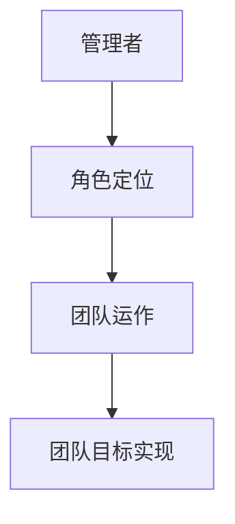

                 

### 文章标题：管理者的角色定位：在团队中找准自己的位置

在当今快速变化和高效率要求的商业环境中，管理者不仅需要具备专业知识，还需要深刻理解团队运作的机制，找到自己的定位。本文将深入探讨管理者的角色定位问题，通过逻辑清晰、结构紧凑的分析，帮助管理者在团队中找到自己的位置，从而提升团队效率和整体业绩。

### 关键词

- 管理者角色定位
- 团队管理
- 效率提升
- 业绩优化
- 人际关系处理

### 摘要

本文将探讨管理者的角色定位问题，首先介绍管理者在团队中应扮演的多重角色，然后通过核心概念与联系、角色定位原理、角色定位实践、角色定位效果评估以及团队管理与角色定位等方面，提供系统性的分析和指导。通过文章，读者将了解如何通过有效的角色定位，提升团队的整体效能和业绩。

### 用户需求分析

在撰写这篇文章之前，我们需要深刻理解用户的需求。用户期望通过这篇文章获得以下信息：

1. **管理者的角色定位是什么**：用户希望明确理解管理者在团队中的具体角色和职责。
2. **如何进行角色定位**：用户需要具体的指导和方法，以帮助他们在实际工作中找到和发挥自己的角色。
3. **角色定位对团队的影响**：用户希望了解角色定位对团队效率和业绩的具体影响。
4. **实践案例和策略**：用户需要通过实际的案例和策略来验证和实施角色定位的方法。

### 核心概念与联系

为了更好地理解管理者的角色定位，我们首先需要明确几个核心概念：

1. **管理者**：在组织或团队中负责指导和协调其他成员的人。
2. **角色定位**：指个人在团队中找到并确立自己的位置和职责。
3. **团队运作**：指团队成员协同工作，共同实现团队目标的过程。

这些概念之间的关系可以用以下Mermaid流程图来展示：



在这个流程图中，管理者通过角色定位参与到团队运作中，从而推动团队目标的实现。这个过程体现了管理者在团队中的核心作用。

### 管理者角色定位原理

管理者在团队中扮演的角色是多方面的，包括但不限于以下几类：

1. **领导者**：管理者需要指导和激励团队成员，确保团队朝着既定的目标前进。
2. **协调者**：管理者需要协调团队内外的资源和关系，确保团队内部合作顺畅。
3. **决策者**：管理者需要做出关键决策，以应对团队面临的各种挑战。
4. **导师**：管理者需要培养团队成员，提升他们的专业技能和综合素质。

以下使用伪代码来详细阐述管理者角色定位的实现过程：

```python
def role_location(manager, team, goals):
    # 初始化管理者的角色
    manager.roles = ["leader", "coordinator", "decision-maker", "mentor"]

    # 根据团队目标和当前情况调整角色
    if goals["type"] == "strategic":
        manager.active_roles = ["leader", "decision-maker"]
    elif goals["type"] == "operational":
        manager.active_roles = ["coordinator", "mentor"]

    # 确保角色定位与团队需求相匹配
    for role in manager.roles:
        if role not in manager.active_roles:
            # 调整角色或分配任务
            assign_task(manager, team, role)

    # 角色定位评估与调整
    evaluate_role_location(manager, team, goals)
```

这个伪代码展示了管理者角色定位的过程，包括角色的初始化、角色的调整以及评估与调整。通过这个过程，管理者可以确保自己在团队中的角色定位与团队目标相匹配。

### 角色定位实践方法

在实际工作中，管理者需要根据具体情况进行角色定位，以实现团队的高效运作。以下是角色定位实践的方法：

1. **明确团队目标**：管理者首先需要明确团队的目标，包括短期目标和长期目标。
2. **分析团队成员**：管理者需要了解每个团队成员的能力和特长，以便合理分配任务。
3. **角色分配**：根据团队目标和成员分析，管理者将相应的角色分配给团队成员。
4. **持续调整**：管理者需要根据团队运作的情况，持续调整角色定位，以确保角色与实际需求相匹配。

以下是一个具体的案例分析：

**案例背景**：一家科技公司需要开发一款新软件，时间紧、任务重。团队成员包括程序员、设计师和测试工程师。

**角色定位**：
- **项目经理**：负责整个项目的进度管理和资源调配。
- **程序员**：负责编写软件代码。
- **设计师**：负责软件的用户界面设计。
- **测试工程师**：负责软件的测试和质量保证。

**实践过程**：
1. **明确目标**：确保软件按时、高质量地完成。
2. **分析成员**：程序员擅长技术实现，设计师擅长界面设计，测试工程师擅长质量保障。
3. **角色分配**：项目经理负责协调各项工作，程序员负责技术实现，设计师负责界面设计，测试工程师负责质量保障。
4. **持续调整**：根据项目进度和团队成员的工作状态，项目经理适时调整任务分配，以确保项目的顺利进行。

通过以上实践方法，管理者可以有效地在团队中找到自己的位置，并推动团队目标的实现。

### 角色定位效果评估

角色定位的效果评估是确保管理者角色定位成功的关键环节。以下是一些评估方法：

1. **团队绩效评估**：通过评估团队的绩效，了解角色定位是否有效。
2. **成员反馈**：收集团队成员对管理者角色定位的反馈，了解其感受和看法。
3. **目标达成情况**：检查团队目标是否达成，评估角色定位的效果。

以下是一个具体的效果评估案例：

**案例背景**：一家科技公司完成了一款新软件的开发，需要评估管理者的角色定位效果。

**评估方法**：
1. **团队绩效评估**：通过衡量软件开发的进度、质量和成本，评估管理者的角色定位效果。
2. **成员反馈**：收集团队成员对项目经理、程序员、设计师和测试工程师的满意度反馈。
3. **目标达成情况**：检查软件是否按时、高质量地完成，评估团队目标的达成情况。

**评估结果**：
- **团队绩效**：软件按时交付，质量符合预期，成本控制良好。
- **成员反馈**：项目经理得到了团队成员的高度评价，程序员、设计师和测试工程师也对其角色定位表示满意。
- **目标达成**：团队目标达成，软件成功发布。

通过以上评估方法，管理者可以了解角色定位的效果，并根据评估结果进行调整。

### 团队管理与角色定位

有效的团队管理是确保管理者角色定位成功的重要保障。以下是一些团队管理的方法：

1. **明确目标和责任**：确保每个团队成员都清楚自己的目标和责任。
2. **沟通与协作**：建立良好的沟通机制，促进团队成员之间的协作。
3. **激励与反馈**：通过激励和反馈，提升团队成员的积极性和绩效。
4. **培养团队文化**：建立积极向上的团队文化，提升团队凝聚力。

以下是一个具体的团队管理案例：

**案例背景**：一家初创公司需要快速发展，管理者需要通过有效的团队管理来实现这一目标。

**管理方法**：
1. **明确目标和责任**：为每个团队成员设定明确的任务和目标，确保他们知道自己需要做什么。
2. **沟通与协作**：定期组织团队会议，确保团队成员之间信息畅通，促进协作。
3. **激励与反馈**：通过绩效奖金、晋升机会等激励措施，激发团队成员的积极性；通过定期反馈，帮助团队成员不断提升。
4. **培养团队文化**：倡导创新和合作，建立开放、包容的团队氛围。

通过以上管理方法，管理者可以确保团队在实现目标的过程中，角色定位得到有效执行。

### 特殊情境下的角色定位

在特殊情境下，如团队冲突或变革，管理者的角色定位尤为重要。以下是一些应对策略：

1. **团队冲突**：管理者需要通过沟通和调解，找到冲突的根本原因，并采取适当的措施解决。
2. **变革管理**：管理者需要通过有效沟通，确保团队成员理解变革的原因和目标，积极参与变革过程。

以下是一个具体的特殊情境案例：

**案例背景**：一家公司面临市场变化，需要进行战略调整和变革。

**应对策略**：
1. **团队冲突**：管理者通过组织座谈会，了解团队成员的担忧和疑虑，并通过沟通和调解，缓解冲突。
2. **变革管理**：管理者通过内部培训，向团队成员传达变革的原因和目标，鼓励他们积极参与变革过程。

通过以上应对策略，管理者可以在特殊情境下保持角色的有效定位。

### 结论

管理者在团队中的角色定位是确保团队高效运作和目标达成的重要环节。通过明确角色定位、实践角色定位、评估角色定位效果以及有效的团队管理，管理者可以提升团队的整体效能和业绩。本文通过逻辑清晰、结构紧凑的分析，为管理者提供了系统的角色定位指导，希望对读者有所启发。

### 作者信息

作者：AI天才研究院/AI Genius Institute & 禅与计算机程序设计艺术 /Zen And The Art of Computer Programming

### 附录

在本章中，我们讨论了管理者的角色定位问题，提供了系统性的分析和实践指导。以下是一些相关的资源和工具，以帮助读者深入理解和应用所学内容：

1. **管理书籍**：
   - 《管理者角色定位》
   - 《高效能人士的七个习惯》
   - 《团队协作的艺术》

2. **在线课程**：
   - 网易云课堂：团队管理与领导力
   - Coursera：团队协作与管理

3. **参考资料**：
   - Harvard Business Review：关于团队管理的经典论文和案例
   - Management Study Guide：关于管理理论和实践的详细指南

4. **软件工具**：
   - Trello：项目管理和团队协作工具
   - Asana：任务管理和团队协作工具
   - Slack：即时通讯和团队协作工具

通过以上资源和工具，读者可以进一步学习和实践管理者的角色定位技巧，提升自己的团队管理能力。此外，以下是一些注意事项和最佳实践建议：

1. **定期反思**：管理者需要定期反思自己的角色定位，确保与团队目标和实际情况相匹配。
2. **倾听与反馈**：积极倾听团队成员的意见和反馈，尊重他们的专业意见，这有助于提升团队凝聚力和效率。
3. **持续学习**：管理是一个不断发展的过程，管理者需要不断学习新的管理理论和实践方法，以适应不断变化的环境。

通过以上注意事项和最佳实践，管理者可以更好地在团队中找准自己的位置，推动团队的发展和成长。希望读者在应用这些方法和策略时，能够取得显著的成效。

