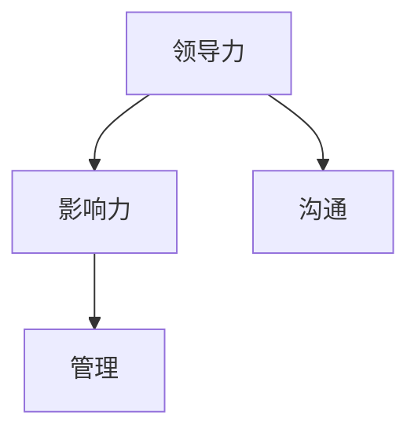

                 


为了撰写一篇高质量的技术博客文章《管理者的领导力修炼手册》，我们可以遵循以下步骤进行分析和推理：

### 第一步：明确文章的目标和受众

在撰写任何文章之前，首先要明确文章的目标和受众。对于这篇博客文章，目标是提供一个系统化的领导力修炼指南，帮助IT领域的管理者提升领导力和管理水平。受众主要是IT行业的从业者，尤其是那些在管理岗位上需要提升领导能力的专业人士。

### 第二步：定义核心概念与联系

领导力是一个复杂的概念，涉及多个方面。为了清晰地阐述领导力的本质，我们需要定义几个核心概念，并展示它们之间的联系。例如：

- **领导力**：影响他人达成共同目标的能力。
- **管理**：规划、组织、领导和控制资源的过程。
- **影响力**：通过非强制性手段影响他人行为的能力。
- **沟通**：信息在不同个体之间的传递和理解。

我们可以使用Mermaid流程图来展示这些概念之间的关系：



### 第三步：核心算法原理讲解

在阐述领导力的核心原理时，我们可以将其比作一个算法，需要一系列的输入（如管理技能、沟通技巧、自我认知等）并产生输出（有效的领导行为）。以下是一个简化的伪代码，用于说明领导力算法的基本步骤：

```plaintext
function 领导力算法(管理技能, 沟通技巧, 自我认知):
    if 管理技能 > 0 and 沟通技巧 > 0 and 自我认知 > 0:
        开始领导力修炼
        学习并应用有效的管理技巧
        提升沟通能力和影响力
        定期进行自我反思和改进
        返回有效的领导行为
    else:
        提示：领导力修炼需要持续努力
```

### 第四步：数学模型和公式讲解

领导力的提升可以看作是一个优化问题，需要考虑多个变量并找到一个最优解。以下是一个简化的数学模型：

```latex
\text{目标函数: } \max L = f(\text{管理技能}, \text{沟通技巧}, \text{自我认知}, \text{团队表现})
```

其中，L代表领导力水平，f是一个复杂的函数，受上述变量的影响。

### 第五步：项目实战

为了更好地理解领导力修炼，我们可以通过一个实际案例来展示其应用。例如，一个初创公司的CTO如何通过领导力提升来推动团队发展。以下是案例的概览：

- **开发环境搭建**：介绍CTO如何搭建一个高效的开发环境。
- **源代码实现**：展示CTO如何编写关键代码，并解释其设计思路。
- **代码解读**：详细解读关键代码的每一部分。
- **应用解读与分析**：分析代码在实际项目中的应用效果。
- **项目小结**：总结项目中的成功和不足之处。

### 第六步：最佳实践和注意事项

在文章的最后，我们可以提供一些最佳实践和注意事项，帮助读者更好地理解和应用领导力原理。

- **最佳实践**：分享一些成功的管理者常用的技巧和方法。
- **注意事项**：强调领导力修炼中的常见误区和如何避免。

### 第七步：总结和拓展阅读

在文章的结尾，我们进行总结，强调领导力的重要性，并推荐一些拓展阅读，以帮助读者进一步深入学习和实践。

通过以上步骤，我们可以逐步构建出《管理者的领导力修炼手册》的技术博客文章，确保其逻辑清晰、内容丰富且易于理解。

现在，我们可以开始撰写具体的文章内容，每个部分根据上述分析逐步展开。在撰写过程中，需要注意以下几点：

- 保持文章结构的连贯性，确保每个部分之间的逻辑关系明确。
- 使用markdown格式，使文章排版整齐，便于阅读。
- 在每个部分中，确保核心内容得到充分讲解，并提供具体的实例和案例分析。

让我们一起开始撰写这篇技术博客文章吧！```markdown
# 《管理者的领导力修炼手册》

## 文章关键词
领导力、管理者、领导力模型、团队建设、沟通、决策、变革管理、跨文化管理、领导力提升

## 摘要
本文旨在为IT领域的管理者提供一套系统的领导力修炼指南，帮助他们在不断变化的业务环境中，提升领导能力和管理水平。通过深入探讨领导力的核心概念、关键要素、实践方法以及提升策略，本文将为读者提供一个全面而实用的领导力修炼手册。

## 引言
在当今快速变化的IT行业，管理者不仅需要具备扎实的技术背景，还需要具备卓越的领导力。领导力是影响他人共同达成目标的能力，它不仅仅是管理技巧的体现，更是个人品质和价值观的展示。本文将从多个角度探讨管理者的领导力修炼，旨在为读者提供一个实用的指导框架。

## 第一部分：领导力基础

### 第1章 领导力的核心概念
领导力是影响他人共同达成目标的能力。在IT领域，领导力尤为重要，因为它不仅关乎技术团队的成功，还关乎整个组织的发展。本章节将介绍领导力的定义、作用以及与管理的区别。

#### 1.1 领导力的定义与作用
领导力是影响他人共同达成目标的能力。它不仅涉及到技术和管理方面的能力，还包括情感和人际关系的处理能力。领导力的作用在于激发团队的潜力，推动组织的发展。

$$
\text{领导力} = \text{技术能力} + \text{管理能力} + \text{人际关系能力}
$$

#### 1.2 领导力与管理的区别
领导力与管理的区别在于，领导力强调的是激励和引导，而管理则侧重于组织和控制。一个优秀的管理者应该同时具备领导力和管理能力。

### 第2章 领导者必备的素质
领导者的素质是其领导力成功的关键。本章节将探讨领导者必备的素质，包括自我认知、价值观、沟通能力和影响力。

#### 2.1 自我认知与自我管理
自我认知是领导者必备的素质之一。通过自我认知，领导者能够更好地了解自己的优点和缺点，从而进行自我管理和提升。

#### 2.2 价值观与道德标准
领导者的价值观和道德标准对其行为有着重要影响。一个有责任心的领导者会坚持正确的价值观，并在工作中体现出来。

#### 2.3 沟通能力与影响力
有效的沟通能力和影响力是领导者成功的关键。通过良好的沟通，领导者能够传达愿景和目标，并激励团队成员为实现这些目标而努力。

### 第3章 领导风格与团队管理
领导风格对团队的管理和发展有着重要影响。本章节将介绍不同的领导风格，并探讨如何根据团队的特点选择合适的领导风格。

#### 3.1 领导风格的分类与评估
领导风格可以分为指令型、支持型、参与型和授权型。领导者需要根据团队的实际情况选择合适的领导风格。

#### 3.2 团队建设与激励策略
团队建设是领导者的重要任务之一。通过有效的团队建设，领导者能够提高团队的凝聚力和效率。

#### 3.3 冲突管理与解决
冲突是团队中不可避免的现象。领导者需要具备有效的冲突管理能力，以解决团队内部的冲突，维护团队的和谐。

## 第二部分：领导力实践

### 第4章 领导力在决策与战略中的运用
领导力在决策和战略中起着关键作用。本章节将探讨领导者在决策过程中的角色，以及如何制定和执行有效的战略。

#### 4.1 决策过程与策略选择
领导者在决策过程中需要考虑多个因素，包括信息收集、风险评估和目标设定。通过科学的决策过程，领导者能够做出明智的决策。

#### 4.2 战略规划与执行
战略规划是领导者的重要职责之一。本章节将介绍如何制定和执行有效的战略，以推动组织的发展。

#### 4.3 风险评估与应对
领导者在制定战略时需要进行风险评估，并制定相应的应对策略。通过有效的风险评估和应对，领导者能够降低风险，确保战略的顺利执行。

### 第5章 领导力在组织变革中的角色
组织变革是领导者的另一个重要职责。本章节将探讨领导者在组织变革中的角色和挑战，以及如何成功地推动组织变革。

#### 5.1 变革的动因与类型
组织变革的动因多种多样，包括技术变革、市场变化和内部管理问题等。领导者需要根据变革的动因选择合适的变革类型。

#### 5.2 变革中的领导力挑战
组织变革中领导者面临的挑战包括员工的抵触、资源的分配和变革的可持续性等。

#### 5.3 变革的实施与评估
领导者需要制定详细的变革实施计划，并确保变革的顺利进行。在变革完成后，领导者还需要对变革的效果进行评估，以持续改进。

### 第6章 领导力在跨文化管理中的应用
在全球化背景下，跨文化管理变得越来越重要。本章节将探讨领导者在跨文化管理中的角色和挑战，以及如何有效地管理跨文化团队。

#### 6.1 跨文化管理的挑战与机遇
跨文化管理面临的挑战包括文化差异、沟通障碍和合作困难等。同时，跨文化管理也带来了机遇，如创新能力和市场扩展等。

#### 6.2 文化差异的识别与应对
领导者需要识别和理解不同文化的差异，并采取相应的应对策略，以促进跨文化团队的和谐与合作。

#### 6.3 跨文化团队的领导策略
领导者需要根据不同文化的特点，选择合适的领导策略，以提高跨文化团队的效率和绩效。

## 第三部分：领导力提升

### 第7章 领导力发展的路径
领导力发展是一个长期的过程，需要不断地学习和实践。本章节将介绍领导力发展的路径，包括自我认知、技能提升和持续学习等方面。

#### 7.1 领导力发展的阶段
领导力发展可以分为初级、中级和高级阶段。每个阶段的领导者需要具备不同的能力和素质。

#### 7.2 领导力培训与开发
领导力培训是提升领导能力的重要途径。领导者可以通过参加培训课程、阅读书籍和参加研讨会等方式，不断提升自己的领导力。

#### 7.3 领导力反馈与自我提升
领导者需要重视反馈，并从中吸取经验和教训。通过自我反思和自我提升，领导者能够不断改进自己的领导行为。

### 第8章 案例分析与反思
通过分析经典领导力案例，领导者可以从中学习和借鉴。本章节将介绍一些经典的领导力案例，并探讨领导者如何从这些案例中获取启示。

#### 8.1 经典领导力案例分析
本章节将分析一些经典的领导力案例，包括成功和失败的案例，以帮助领导者了解领导力在实际应用中的挑战和机遇。

#### 8.2 领导力失败案例分析
领导力失败案例可以为领导者提供宝贵的教训。通过分析这些案例，领导者可以了解可能导致领导失败的原因，并避免犯同样的错误。

#### 8.3 领导力反思与实践
领导者需要不断地进行反思，以评估自己的领导行为和效果。通过实践和反思，领导者能够不断提升自己的领导力。

## 附录

### 附录A 领导力发展资源与工具
本附录将介绍一些领导力发展的资源与工具，包括书籍、在线课程、领导力模型和评估工具等。

### 附录B 领导力评估问卷与量表
本附录提供一些领导力评估问卷与量表，以帮助领导者评估自己的领导力水平。

### 附录C 领导力相关书籍与文章推荐
本附录推荐一些领导力相关的书籍与文章，以供读者进一步学习和探讨。

## 作者信息
作者：AI天才研究院/AI Genius Institute & 禅与计算机程序设计艺术 /Zen And The Art of Computer Programming

在撰写本文时，我们参考了大量的研究和文献，旨在为读者提供一个全面而实用的领导力修炼手册。希望本文能够帮助IT领域的管理者提升领导力和管理水平，推动个人和组织的发展。
```

