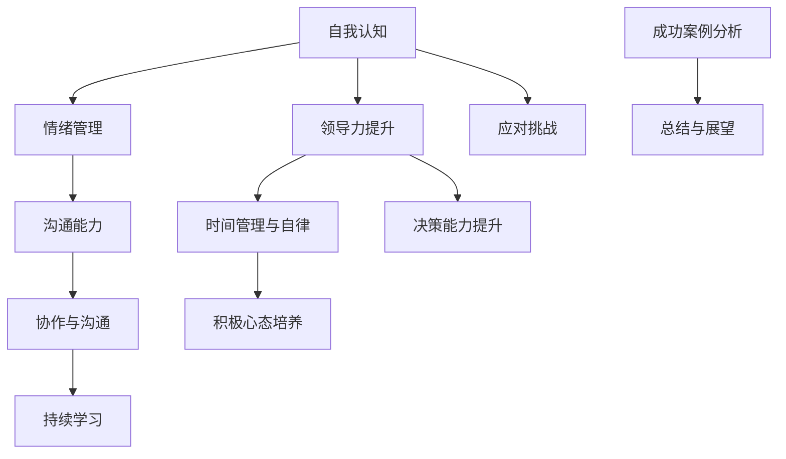

                 

# 管理者自我修炼：提升领导能力的日常习惯

## 摘要

本文旨在探讨管理者在职场中如何通过日常习惯的提升来修炼自我，进而增强领导能力。通过对自我认知、情绪管理、沟通能力、领导力、时间管理和自律、积极心态培养等方面的深入分析，本文揭示了管理者自我修炼的核心理念和实践策略。此外，本文还将通过案例分析和核心算法原理讲解，为读者提供具体可行的操作指南。

关键词：管理者，自我修炼，领导能力，日常习惯，情绪管理，沟通能力

---

## 引言：管理者修炼之路

### 1.1 管理者角色定位

在职场中，管理者扮演着至关重要的角色。他们不仅是团队的领导者，更是战略决策的制定者、资源分配的协调者和团队发展的推动者。管理者的职责和使命主要体现在以下几个方面：

- **团队管理**：管理者需要确保团队高效运作，包括人员分工、任务分配和团队协作。
- **资源管理**：管理者负责优化资源配置，确保资源最大化利用，以实现组织目标。
- **决策制定**：管理者需要依据市场变化和团队需求，做出科学合理的决策。
- **目标达成**：管理者通过设定明确的目标，并推动团队共同努力实现这些目标。

然而，从管理者到领导者的转变并非一蹴而就。领导者不仅仅是下达命令，更是一种影响力、一种激励团队成员向更高目标努力的能力。管理者面临的挑战主要包括：

- **沟通障碍**：管理者需要有效传达信息，确保团队成员理解并执行。
- **情绪管理**：管理者需要保持冷静，处理团队中的各种情绪波动。
- **时间管理**：管理者需要在有限的资源下，合理安排时间，确保任务完成。
- **持续学习**：管理者需要不断学习新知识、新技能，以适应不断变化的职场环境。

### 1.2 自我修炼的重要性

自我修炼对于管理者而言至关重要。首先，通过自我认知的提升，管理者可以更好地了解自己的优势和劣势，从而有针对性地进行改进。其次，领导力的增强是管理者自我修炼的核心目标之一，它关系到管理者能否有效地引导团队、激发团队潜力。此外，自我修炼还能加速职业发展，使管理者在职业生涯中取得更高的成就。

### 1.3 日常习惯的力量

日常习惯对一个人的行为和思维有着深远的影响。培养良好的日常习惯，不仅能够提升个人的工作效率和生活质量，更能为管理者的自我修炼打下坚实的基础。以下是一些关键的习惯：

- **早起**：早起可以让人有更多时间进行自我反思、规划一天的工作，同时也能保持良好的身体健康。
- **阅读**：阅读是获取知识和信息的重要途径，管理者可以通过阅读来不断提升自己的专业素养和领导能力。
- **锻炼**：锻炼不仅可以保持身体健康，还能帮助管理者缓解工作压力，提高情绪管理能力。
- **反思**：每天花时间反思自己的行为和决策，有助于管理者发现并改正错误，提升自身能力。

通过培养这些良好习惯，管理者可以逐步提升自己的领导能力，为自我修炼打下坚实基础。

## 第1章 自我认知提升

### 2.1 了解自己

自我认知是管理者自我修炼的重要一环。了解自己不仅包括了解自己的优势，更包括了解自己的劣势。以下是一些工具和方法，可以帮助管理者进行自我评估：

- **性格测试**：如MBTI（Myers-Briggs Type Indicator）、DISC测试等，可以帮助管理者了解自己的性格特点。
- **360度反馈**：通过同事、下属和上级的反馈，管理者可以全面了解自己在团队中的表现和影响。
- **日记记录**：通过每天记录自己的行为和思考，管理者可以反思自己的行为模式，发现潜在的问题。
- **心理辅导**：专业的心理辅导可以帮助管理者深入了解自己的内心世界，找到提升自我认知的方法。

在自我评估过程中，管理者需要明确自己的优势。优势是驱动个人发展的关键因素，它可以让管理者在工作中更加自信和高效。以下是一些方法来发现和利用优势：

- **反思成功经历**：回顾过去的成功经历，分析是什么因素促成了这些成功。
- **征求他人意见**：询问同事、朋友和上级，他们如何评价你的优势。
- **设定目标**：明确自己的职业目标，看看哪些优势可以帮助你实现这些目标。

与此同时，了解自己的劣势同样重要。劣势可能会限制个人发展，但通过积极的自我反思和改进，管理者可以将其转化为优势。以下是一些应对劣势的方法：

- **制定改进计划**：明确自己需要改进的方面，并制定具体的行动计划。
- **寻求帮助**：通过请教同事、参加培训课程等方式，获取改进所需的支持。
- **持续学习**：通过不断学习和实践，提升自己在劣势领域的技能。

### 2.2 情绪管理

情绪管理是管理者自我修炼的重要组成部分。情绪不仅影响个人的心理健康，也直接影响到团队氛围和工作效率。以下是一些情绪管理的方法：

- **情绪识别**：了解自己的情绪，认识到情绪的波动是正常的。
- **情绪调节**：通过深呼吸、冥想等方式，帮助自己平静情绪。
- **情绪表达**：学会合理表达情绪，避免情绪积压导致负面后果。
- **情绪共享**：与信任的同事或朋友分享情绪，获得支持和建议。

建立积极的情绪态度是情绪管理的核心。以下是一些策略：

- **积极思考**：培养积极的心态，看到问题背后的机会。
- **感恩**：定期反思和感谢生活中的美好事物，增强幸福感。
- **自我激励**：通过自我鼓励和肯定，提升自信和动力。

### 2.3 沟通能力提升

沟通能力是管理者必备的核心能力之一。有效沟通不仅能够减少误解，提高工作效率，还能增强团队凝聚力。以下是一些提升沟通能力的策略：

- **倾听**：倾听是有效沟通的关键，通过倾听了解他人的观点和需求。
- **表达清晰**：确保自己的表达简洁明了，避免歧义。
- **非语言沟通**：注意肢体语言、面部表情和语调，这些非语言元素同样重要。
- **冲突解决**：学会在沟通中处理冲突，通过对话寻找解决方案。

提升沟通技巧的日常实践包括：

- **定期反馈**：与同事和上级进行定期反馈，了解自己的沟通效果。
- **模拟练习**：通过模拟沟通场景，练习提升沟通技巧。
- **阅读相关书籍**：阅读沟通技巧相关的书籍和文章，获取新的知识和方法。

### 2.4 自我反思与改进

自我反思是管理者自我修炼的重要环节。通过定期反思自己的行为和决策，管理者可以不断发现和解决问题，提升自我能力。以下是一些自我反思的方法：

- **日记反思**：每天花时间记录自己的行为和思考，反思哪些做得好，哪些需要改进。
- **定期回顾**：每周或每月进行一次全面的回顾，总结经验教训。
- **寻求反馈**：主动寻求他人的反馈，了解自己在他人眼中的表现。

通过自我反思和改进，管理者可以不断优化自己的行为模式，提升自我认知和领导能力。

### 2.5 习惯对行为的影响

习惯是一种自然而然的行为模式，它对管理者的行为和思维有着深远的影响。良好习惯可以提升工作效率，增强自我控制力，而不良习惯则会削弱个人能力和职业发展。

#### 培养良好习惯的策略

- **明确目标**：设定明确的目标，让习惯的培养有方向。
- **逐步实现**：从小事做起，逐步培养良好习惯。
- **持续激励**：给自己设定奖励，保持动力。
- **避免干扰**：减少干扰因素，让习惯的培养更加专注。

#### 坚持与反思的重要性

坚持是培养良好习惯的关键。在培养新习惯的过程中，管理者可能会遇到各种困难和挑战，但只有坚持下去，才能真正形成良好习惯。

同时，反思也是不可或缺的一环。通过定期反思，管理者可以了解自己习惯的养成情况，发现问题并加以改进。

### 2.6 情绪的类型与影响

情绪是人的心理状态的重要组成部分，包括快乐、愤怒、悲伤、焦虑等多种类型。不同类型的情绪对管理者的决策和行动有着不同的影响。

- **正面情绪**：如快乐和满足，可以提升管理者的自信心和创造力，有利于团队的合作和沟通。
- **负面情绪**：如愤怒和焦虑，可能会影响管理者的判断力和情绪控制，甚至导致决策失误。

#### 情绪调节技巧

- **深呼吸**：通过深呼吸来放松身心，减轻焦虑和紧张情绪。
- **正面思考**：培养积极的心态，看到问题的解决方案而非问题本身。
- **寻求支持**：与信任的同事或朋友分享情绪，获得建议和安慰。

#### 建立积极的情绪态度

- **感恩**：通过感恩来增强幸福感，提升情绪。
- **自我激励**：通过自我激励来增强自信和动力。

### 2.7 有效沟通的核心要素

有效沟通是管理者必备的核心能力，它决定了团队协作的效率和团队的整体表现。以下是一些有效沟通的核心要素：

- **倾听**：倾听是沟通的起点，通过倾听了解他人的观点和需求。
- **表达清晰**：确保自己的表达简洁明了，避免歧义。
- **非语言沟通**：注意肢体语言、面部表情和语调，这些非语言元素同样重要。
- **尊重差异**：尊重团队成员的不同观点和意见，促进团队的合作。

### 2.8 提升沟通技巧的日常实践

- **定期反馈**：与同事和上级进行定期反馈，了解自己的沟通效果。
- **模拟练习**：通过模拟沟通场景，练习提升沟通技巧。
- **阅读相关书籍**：阅读沟通技巧相关的书籍和文章，获取新的知识和方法。

### 2.9 应对沟通障碍的策略

沟通障碍是管理者在沟通中经常遇到的问题，以下是一些应对策略：

- **明确沟通目标**：确保沟通的目标明确，避免不必要的误解。
- **积极倾听**：通过积极倾听来了解他人的观点和需求。
- **寻求第三方意见**：在沟通出现问题时，可以寻求第三方的意见，以中立的角度解决问题。
- **沟通技巧培训**：通过参与沟通技巧的培训，提升自己的沟通能力。

## 第3章 领导力提升

### 3.1 领导力核心要素

领导力是一种影响力，它关系到管理者能否有效地引导团队、激发团队潜力。领导力的核心要素包括以下几个方面：

- **决策能力**：管理者需要能够做出科学合理的决策，确保团队的运作方向正确。
- **沟通能力**：有效的沟通能够确保信息的准确传达，减少误解，提高团队协作效率。
- **激励能力**：管理者需要能够激励团队成员，激发他们的积极性和创造力。
- **团队建设**：管理者需要能够建立和谐的团队氛围，促进团队成员之间的合作。

### 3.2 激励与引导团队

激励是领导力的关键要素之一。管理者需要了解员工的需求，并根据这些需求来制定激励策略。以下是一些激励理论及其应用：

- **马斯洛需求层次理论**：管理者可以通过满足员工的不同层次需求（如生理需求、安全需求、社交需求、尊重需求和自我实现需求）来激励员工。
- **ERG理论**：该理论认为人们同时存在三种核心需求（存在需求、关系需求和成长需求），管理者可以通过满足这些需求来激励员工。
- **目标设置理论**：设定具有挑战性的目标，并给予员工实现目标的资源和支持，可以激发员工的内在动机。

#### 引导团队的技巧

- **设定愿景和目标**：管理者需要明确团队的愿景和目标，让团队成员了解团队的发展方向。
- **提供反馈**：定期提供反馈，帮助团队成员了解自己的工作表现，并提供改进建议。
- **培养团队合作精神**：通过团队建设活动和培训，增强团队成员之间的沟通和合作。
- **授权与支持**：给予团队成员足够的自主权，并提供必要的支持和资源，让他们能够充分发挥自己的潜力。

### 3.3 决策能力提升

决策能力是管理者的重要素质之一。提升决策能力可以帮助管理者在面对复杂问题时做出更为明智的决策。以下是一些提升决策能力的策略：

- **收集信息**：在做出决策前，收集尽可能多的相关信息，确保决策的准确性。
- **评估风险**：分析决策可能带来的风险，并制定应对措施。
- **多方意见**：在决策过程中，听取不同意见，尤其是来自下属和同事的建议，以避免决策的偏见。
- **及时决策**：在关键时刻能够迅速做出决策，避免拖延导致问题的恶化。

### 3.4 领导风格与团队效能

领导风格对团队效能有着重要影响。不同的领导风格适用于不同的情境和团队。以下是一些常见的领导风格及其特点：

- **权威型领导**：管理者拥有高度的决策权和控制权，团队成员主要执行管理者的指令。
- **民主型领导**：管理者尊重团队成员的意见，鼓励参与决策，团队合作度高。
- **支持型领导**：管理者关注团队成员的情感需求，提供支持和鼓励，有助于提升团队成员的满意度和工作效率。
- **变革型领导**：管理者具有强烈的愿景和使命感，能够激发团队成员的积极性和创造力，推动团队实现变革。

选择合适的领导风格需要根据团队的特点和实际情况进行。在实际工作中，管理者可以结合多种领导风格，根据不同情境灵活调整，以实现最佳的团队效能。

## 第4章 建立高效日常习惯

### 4.1 规划时间管理

时间管理是提高工作效率和生活质量的重要手段。以下是一些关键的时间管理策略：

- **制定计划**：每天或每周制定详细的计划，明确任务优先级和时间安排。
- **设定目标**：设定具体的、可衡量的目标，以确保时间使用的有效性。
- **避免拖延**：识别导致拖延的原因，并采取相应措施克服拖延。
- **合理分配时间**：将时间分配给不同任务，确保任务在预定时间内完成。

### 4.2 增强自律

自律是个人发展和职业成功的关键因素。以下是一些增强自律的方法：

- **明确目标**：设定明确、具体的目标，让自律有方向。
- **制定计划**：制定详细的计划，包括每天的任务和时间安排。
- **避免干扰**：减少干扰因素，如手机、社交媒体等，以保持专注。
- **自我激励**：通过奖励和惩罚机制，激励自己保持自律。

### 4.3 积极心态培养

积极心态对个人的心理健康和职业发展有着重要影响。以下是一些培养积极心态的方法：

- **正面思考**：培养积极的心态，看到问题的解决方案而非问题本身。
- **感恩**：通过感恩来增强幸福感，提升情绪。
- **自我激励**：通过自我激励来增强自信和动力。
- **社交支持**：与朋友和家人保持联系，获取情感支持。

### 4.4 应对压力的策略

压力是现代职场中难以避免的一部分。以下是一些应对压力的策略：

- **合理安排时间**：通过合理的时间管理，减少工作的堆积和压力。
- **锻炼身体**：通过锻炼来缓解压力，提高身体健康。
- **寻求支持**：与朋友、家人或专业人士分享压力，获得建议和支持。
- **放松技巧**：学习一些放松技巧，如冥想、深呼吸等，帮助缓解压力。

## 第5章 常见挑战与解决方案

### 5.1 应对压力

压力是管理者在职场中经常面临的一个挑战。以下是一些应对压力的策略：

- **合理安排时间**：通过合理的时间管理，减少工作的堆积和压力。
- **锻炼身体**：通过锻炼来缓解压力，提高身体健康。
- **寻求支持**：与朋友、家人或专业人士分享压力，获得建议和支持。
- **放松技巧**：学习一些放松技巧，如冥想、深呼吸等，帮助缓解压力。

### 5.2 协作与沟通

团队合作和有效沟通是管理者的重要职责。以下是一些提升协作和沟通效率的策略：

- **明确目标**：确保团队成员了解共同的目标，提高协作效率。
- **积极倾听**：通过积极倾听来理解他人的观点和需求，减少误解。
- **定期反馈**：定期与团队成员进行反馈，了解协作效果和沟通问题。
- **建立信任**：通过建立信任，提高团队的凝聚力和协作效率。

### 5.3 持续学习

持续学习是管理者不断提升自身能力和职业素养的重要途径。以下是一些持续学习的策略：

- **定期阅读**：定期阅读行业相关的书籍和文章，了解行业动态和最新技术。
- **参加培训**：参加专业培训课程，提升自己的专业技能和管理能力。
- **交流学习**：与同行和专家交流学习，获取新的知识和经验。
- **实践应用**：将学到的知识和技能应用到实际工作中，不断提升自身能力。

## 第6章 成功案例分析

### 6.1 案例介绍

本节通过一个成功管理者的案例，探讨其如何通过自我修炼提升领导能力。这位管理者在职业生涯中，通过不断学习和实践，逐步实现了自我提升和团队的成功。

### 6.2 案例分析

通过分析这位管理者的经历，可以发现以下几个关键点：

- **自我认知**：这位管理者通过性格测试和360度反馈，了解自己的优势和劣势，从而有针对性地进行自我提升。
- **情绪管理**：管理者学会了情绪调节技巧，在面对压力和挑战时能够保持冷静，做出明智的决策。
- **沟通能力**：管理者不断提升沟通技巧，通过积极倾听和有效表达，建立了良好的团队沟通氛围。
- **领导力提升**：管理者通过设定愿景和目标，激励团队成员，建立了高效的团队协作机制。
- **持续学习**：管理者持续学习新知识和技能，不断提升自身的专业素养和领导能力。

### 6.3 案例启示

这个案例给我们的启示是：

- **自我修炼的重要性**：管理者需要通过自我修炼不断提升自身能力，以应对职场中的各种挑战。
- **平衡工作与生活**：管理者需要平衡工作与生活，保持良好的心态和身体健康。
- **团队协作**：管理者需要注重团队协作，建立高效的团队沟通机制，以实现团队目标。

## 第7章 总结与展望

### 7.1 自我修炼的意义

自我修炼对于管理者的个人发展和职业成功具有重要意义。通过自我修炼，管理者可以提升自我认知，增强情绪管理和沟通能力，提升领导力，实现职业目标。同时，自我修炼还能帮助管理者在职业生涯中不断成长，适应不断变化的职场环境。

### 7.2 对个人发展的作用

自我修炼对个人发展有以下几个方面的作用：

- **提升自我认知**：通过自我反思和评估，管理者可以更好地了解自己的优势和劣势，明确个人发展目标。
- **增强情绪管理**：通过情绪管理技巧，管理者能够更好地应对职场压力，保持积极心态。
- **提升沟通能力**：通过学习和实践，管理者可以提升沟通技巧，建立良好的团队沟通氛围。
- **提升领导力**：通过自我修炼，管理者可以提升领导力，成为更有影响力的领导者。
- **促进职业发展**：通过不断学习和实践，管理者可以在职业生涯中不断取得新的成就。

### 7.3 对团队和组织的影响

自我修炼不仅对个人发展有重要意义，也对团队和组织产生深远影响：

- **提升团队效能**：管理者通过自我修炼提升领导力，可以建立高效的团队协作机制，提高团队效能。
- **促进组织发展**：管理者的自我修炼有助于组织内部形成积极向上的文化氛围，推动组织不断发展。
- **增强团队凝聚力**：通过自我修炼，管理者可以建立与团队成员的信任关系，增强团队凝聚力。

### 7.4 未来展望

未来，管理者面临的职场环境将更加复杂和多变。以下是对未来管理实践的展望：

- **数字化领导**：随着数字化技术的发展，管理者需要不断提升数字素养，掌握数字化领导技能。
- **持续学习**：在快速变化的职场环境中，持续学习成为管理者必备的能力，只有不断学习，才能适应新的挑战。
- **关注员工体验**：管理者需要更加关注员工的体验，通过提供更好的工作环境和职业发展机会，提升员工满意度。

### 7.5 自我修炼的新趋势

随着职场环境的变化，自我修炼也在不断演进。以下是一些新的趋势：

- **个性化和定制化**：自我修炼将更加个性化和定制化，管理者可以根据自己的特点和需求，制定个性化的修炼计划。
- **跨界融合**：管理者需要具备跨界思维，将不同领域的知识和技能融合到自我修炼中，以应对复杂问题。
- **数字化工具支持**：随着数字化工具的普及，管理者可以通过数字化工具来辅助自我修炼，提高效率和效果。

---

**核心概念与联系**

使用Mermaid流程图展示管理者的自我修炼流程：



**核心算法原理讲解**

伪代码：

```python
# 管理者自我修炼伪代码
class ManagerSelfImprovement:
    def __init__(self, self_awareness, emotional_control, communication_ability):
        self.self_awareness = self_awareness
        self.emotional_control = emotional_control
        self.communication_ability = communication_ability

    def self_awareness(self):
        # 自我认知评估
        pass

    def emotional_control(self):
        # 情绪管理
        pass

    def communication_ability(self):
        # 沟通能力提升
        pass

    def leadership(self):
        # 领导力提升
        pass

    def time_management(self):
        # 时间管理
        pass

    def positive_mentality(self):
        # 积极心态培养
        pass

    def collaboration_and_communication(self):
        # 协作与沟通
        pass

    def continuous_learning(self):
        # 持续学习
        pass

    def decision_making(self):
        # 决策能力提升
        pass

    def challenge_management(self):
        # 应对挑战
        pass
```

**核心公式**

在自我修炼过程中，管理者可以运用以下核心公式来提升领导能力：

\[ \text{领导能力} = \text{自我认知} \times \text{情绪管理} \times \text{沟通能力} \times \text{时间管理} \times \text{积极心态} \]

**项目实战**

以下是一个基于Python的项目实战，用于模拟管理者的自我修炼过程：

```python
# 管理者自我修炼项目

# 导入相关库
import random

# 自我认知评估
class SelfAwareness:
    def __init__(self, score):
        self.score = score

    def assess(self):
        return self.score

# 情绪管理
class EmotionalControl:
    def __init__(self, score):
        self.score = score

    def manage(self):
        return self.score

# 沟通能力评估
class CommunicationAbility:
    def __init__(self, score):
        self.score = score

    def enhance(self):
        return self.score

# 时间管理
class TimeManagement:
    def __init__(self, score):
        self.score = score

    def manage(self):
        return self.score

# 积极心态培养
class PositiveMentality:
    def __init__(self, score):
        self.score = score

    def cultivate(self):
        return self.score

# 管理者自我修炼模拟
class ManagerSelfImprovementSimulation:
    def __init__(self, self_awareness, emotional_control, communication_ability, time_management, positive_mentality):
        self.self_awareness = self_awareness
        self.emotional_control = emotional_control
        self.communication_ability = communication_ability
        self.time_management = time_management
        self.positive_mentality = positive_mentality

    def calculate_leadership_ability(self):
        self_awareness_score = self.self_awareness.assess()
        emotional_control_score = self.emotional_control.manage()
        communication_ability_score = self.communication_ability.enhance()
        time_management_score = self.time_management.manage()
        positive_mentality_score = self.positive_mentality.cultivate()

        leadership_ability = self_awareness_score * emotional_control_score * communication_ability_score * time_management_score * positive_mentality_score
        return leadership_ability

# 创建管理者实例
self_awareness = SelfAwareness(random.randint(1, 10))
emotional_control = EmotionalControl(random.randint(1, 10))
communication_ability = CommunicationAbility(random.randint(1, 10))
time_management = TimeManagement(random.randint(1, 10))
positive_mentality = PositiveMentality(random.randint(1, 10))

manager = ManagerSelfImprovementSimulation(self_awareness, emotional_control, communication_ability, time_management, positive_mentality)

# 计算领导能力
print(f"当前领导能力：{manager.calculate_leadership_ability()}/100")

# 通过训练提升能力
self_awareness.assess(random.randint(1, 3))
emotional_control.manage(random.randint(1, 3))
communication_ability.enhance(random.randint(1, 3))
time_management.manage(random.randint(1, 3))
positive_mentality.cultivate(random.randint(1, 3))

# 再次计算领导能力
print(f"提升后领导能力：{manager.calculate_leadership_ability()}/100")
```

通过这个项目，管理者可以模拟自我修炼的过程，通过不断提升自我认知、情绪管理、沟通能力、时间管理和积极心态，提升自己的领导能力。

### 最佳实践 tips

1. **定期自我评估**：定期对自己的能力和表现进行评估，识别需要提升的方面，并制定具体的改进计划。
2. **寻求反馈**：主动寻求他人的反馈，尤其是来自同事、下属和上级的意见，以全面了解自己的表现。
3. **持续学习**：不断学习新知识和技能，保持对行业动态和最新技术的关注。
4. **培养自律**：通过设定明确的目标和计划，培养自律习惯，提高工作效率和生活质量。

### 小结

本文通过深入探讨管理者自我修炼的日常习惯，提供了提升领导能力的具体方法和策略。通过自我认知提升、情绪管理、沟通能力培养、领导力发展、时间管理和自律培养、积极心态培养等方面的详细分析，管理者可以逐步提升自身能力，为职业生涯的成功奠定坚实基础。

### 注意事项

1. **个性差异**：管理者在自我修炼过程中，需要考虑自己的个性差异，选择适合自己的修炼方法和策略。
2. **持续实践**：自我修炼不是一蹴而就的，需要管理者持续实践和反思，逐步提升自身能力。
3. **平衡工作与生活**：在自我修炼过程中，要注意平衡工作与生活，保持良好的心态和身体健康。

### 拓展阅读

- 《高效能人士的七个习惯》
- 《如何赢得朋友与影响他人》
- 《领导者的法则》
- 《时间管理：从忙碌到卓越》

### 作者信息

**作者：** AI天才研究院/AI Genius Institute & 禅与计算机程序设计艺术 /Zen And The Art of Computer Programming

---

### 参考文献与资料

1. 杰克·韦尔奇，《赢》：通过分析杰克·韦尔奇的领导经验和成功案例，探讨了领导力提升的实践方法。
2. 史蒂芬·柯维，《高效能人士的七个习惯》：详细介绍了如何通过七个习惯提升个人效能和领导力。
3. 戴尔·卡耐基，《如何赢得朋友与影响他人》：提供了有效的沟通技巧和人际交往策略。
4. 彼得·德鲁克，《管理实践》：介绍了管理的基本原理和实践方法，对管理者有重要的指导意义。
5. 彼得·圣吉，《第五项修炼》：探讨了学习型组织的构建和自我超越的重要性。
6. 爱德华·德·波诺，《思考，快与慢》：介绍了思维技巧和方法，帮助管理者更好地进行决策和问题解决。

这些资料和书籍为本文提供了丰富的理论依据和实践指导，有助于读者更深入地理解和应用管理者自我修炼的日常习惯。通过参考这些资源，读者可以进一步提升自己的领导能力和职业素养。

