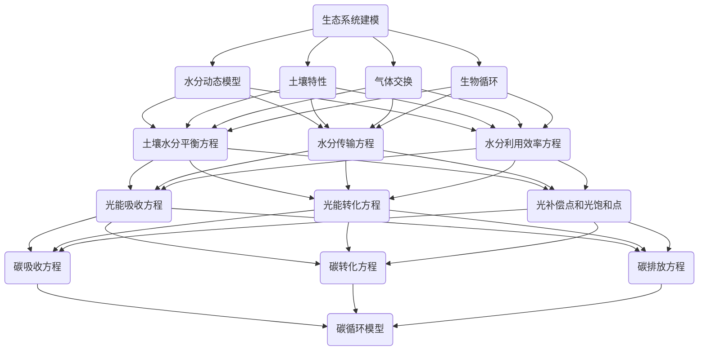

                 


### 1. 引言

**精准农业背景与挑战**

精准农业，也称为精确农业，是一种利用现代信息技术和遥感技术，实现对农田精细化管理的新兴农业模式。与传统农业相比，精准农业通过数据采集、监测与分析，实现了对土壤、水分、养分等农业资源的精准管理，从而提高了农业生产效率，降低了生产成本。然而，精准农业的发展也面临诸多挑战，如数据获取困难、数据处理复杂、模型构建难度大等。

**作物生长模型的重要性**

作物生长模型是精准农业的核心组成部分，它能够模拟作物在生长过程中的生理生态变化，预测作物的生长状态和产量，从而为农业生产提供科学依据。一个准确、有效的作物生长模型，不仅能够提高作物产量，降低生产成本，还能减少环境污染，实现农业可持续发展。

**本书结构安排**

本书共分为八个章节，具体内容安排如下：

- **第1章 引言**：介绍精准农业的背景和挑战，以及作物生长模型的重要性。
- **第2章 精准农业基础**：介绍精准农业的基本原理、作物生长过程以及数据收集和处理方法。
- **第3章 核心概念与联系**：讲解生态系统建模、水分动态模型、光能利用模型和碳循环模型，并提供相应的Mermaid流程图。
- **第4章 模型构建与参数优化**：讲解模型选择与训练、数据预处理与特征提取、参数调优方法等。
- **第5章 数学模型与公式详细讲解**：针对水分动态模型和光能利用模型，提供详细的数学公式和伪代码讲解。
- **第6章 例子说明**：通过案例分析展示模型在实际应用中的效果。
- **第7章 项目实战**：提供精准农业生长模型项目实战的详细步骤，包括数据收集、预处理、模型构建、优化和应用等。
- **第8章 结论与展望**：总结本书的主要成果，指出存在的不足和改进方向，并对未来的发展方向进行展望。

通过本书的阅读，读者可以系统地了解精准农业的生长模型构建与优化方法，掌握作物优化的数学指导，从而在实际农业生产中发挥重要作用。

---

### 精准农业基础

**精准农业的定义与发展**

精准农业，作为现代农业发展的重要方向，其核心思想是通过精确的数据采集和分析，实现对农田、作物、土壤、水分等农业资源的高效管理。精准农业的发展可以追溯到20世纪80年代，随着信息技术和遥感技术的飞速发展，精准农业逐渐成为现代农业的重要组成部分。

早期的精准农业主要集中在土壤监测、作物监测和农业机械化等方面。随着遥感技术、地理信息系统（GIS）、全球定位系统（GPS）等技术的应用，精准农业的数据采集和处理能力得到了显著提升。近年来，人工智能和大数据技术的加入，使得精准农业的发展更加智能化和精细化。

**作物生长过程概述**

作物生长过程是农业生产的核心，对其进行准确模拟和预测，对于提高农业生产效率具有重要意义。作物生长过程可以分为以下几个阶段：

1. **萌发期**：种子在适宜的土壤温度和湿度条件下，开始吸水膨胀，种子内的营养物质被分解，促使种子萌发。
2. **幼苗期**：幼苗期是作物生长的关键阶段，此时作物对土壤养分、水分和光照的需求较大。这个阶段的作物生长状态直接影响后续的生长发育。
3. **分蘖期**：作物进入分蘖期，根系和叶片开始迅速生长，同时开始形成新的分枝。
4. **拔节期**：作物进入拔节期，茎秆开始迅速伸长，标志着作物进入快速生长期。
5. **抽穗期**：作物进入抽穗期，叶片数达到最大值，光合作用强度达到最高，同时开始形成花器。
6. **成熟期**：作物进入成熟期，穗部开始充实，籽实成熟，标志着作物生长的结束。

**数据收集与处理**

数据是精准农业的核心，精准的数据收集和处理是构建准确作物生长模型的基础。数据收集主要包括土壤数据、气象数据、作物数据等。土壤数据包括土壤湿度、土壤温度、土壤养分等；气象数据包括降雨量、温度、风速等；作物数据包括作物高度、叶面积指数、叶绿素含量等。

数据收集的方法包括遥感技术、地面监测、无人机监测等。遥感技术可以实时监测大面积农田的土壤和气象数据；地面监测和无人机监测则可以提供更精细的数据。

收集到的数据需要进行预处理，包括数据清洗、数据转换和数据融合等。数据清洗旨在去除数据中的噪声和异常值；数据转换是将不同类型的数据转换为同一标准的数据；数据融合则是将不同来源的数据进行整合，形成完整的数据集。

数据处理主要包括数据分析和数据建模。数据分析通过统计分析、数据挖掘等方法，从大量数据中提取有用的信息；数据建模则是利用数学模型，对作物生长过程进行模拟和预测。

**核心概念与联系**

在精准农业中，核心概念包括生态系统建模、水分动态模型、光能利用模型和碳循环模型。这些模型相互关联，共同构建了作物生长的数学模型。

- **生态系统建模**：生态系统建模是精准农业的基础，它考虑了土壤、水、气体、生物等多个因素，通过建立生态系统的数学模型，实现对农田生态系统的模拟和预测。
- **水分动态模型**：水分动态模型描述了土壤水分的动态变化过程，包括水分吸收、传输、消耗等。水分动态模型对于作物生长的预测和灌溉计划的制定至关重要。
- **光能利用模型**：光能利用模型描述了作物对光能的吸收、转化和利用过程。光能利用模型对于作物的光合作用强度和产量预测具有重要作用。
- **碳循环模型**：碳循环模型描述了碳在生态系统中的循环过程，包括碳的吸收、转化、排放等。碳循环模型对于全球气候变化和温室气体排放的预测具有重要意义。

这些模型之间相互关联，共同构成了精准农业的生长模型。通过这些模型，可以实现作物生长状态的实时监测和预测，为农业生产提供科学依据。

**总结**

本章介绍了精准农业的定义、发展历程和作物生长过程，以及数据收集与处理的核心概念。通过了解这些基础知识，读者可以更好地理解后续章节中的作物生长模型构建与优化方法。在下一章中，我们将详细探讨生态系统建模、水分动态模型、光能利用模型和碳循环模型，并使用Mermaid流程图展示它们之间的关系。

---

### 作物生长模型核心概念与联系

在精准农业中，作物生长模型的构建是一个复杂而关键的任务。这些模型能够模拟作物在生长过程中的生理生态变化，从而为农业生产提供科学的决策支持。为了实现这一目标，我们需要了解并掌握几个核心概念，以及它们之间的相互联系。

**生态系统建模**

生态系统建模是精准农业的基础。它涉及土壤、水、气体、生物等多个因素，通过建立生态系统的数学模型，实现对农田生态系统的模拟和预测。生态系统建模的主要目标是理解生态系统的结构和功能，以及这些因素如何相互作用，从而对作物生长环境进行精确描述。

在生态系统建模中，我们通常考虑以下主要变量：

- **土壤特性**：包括土壤湿度、土壤温度、土壤养分等。
- **水分动态**：描述土壤水分的吸收、传输和消耗过程。
- **气体交换**：描述农田与大气之间的气体交换过程，如二氧化碳、氧气等。
- **生物循环**：描述植物、微生物和动物在生态系统中的相互作用。

生态系统建模的关键在于如何将这些变量整合到一个统一的模型中，以便对作物生长过程进行全面的模拟。

**水分动态模型**

水分动态模型描述了土壤水分的动态变化过程，包括水分的吸收、传输和消耗等。这些过程对作物的生长至关重要，因为水分不足或过多都会影响作物的生长状态和产量。水分动态模型的主要目标是预测土壤水分的分布和变化，从而为灌溉管理提供科学依据。

水分动态模型通常包括以下主要部分：

- **土壤水分平衡方程**：描述土壤水分的吸收和消耗之间的平衡关系。
- **水分传输方程**：描述水分在土壤中的传输过程，如渗透、对流等。
- **水分利用效率方程**：描述作物对土壤水分的利用效率。

通过这些方程，我们可以模拟土壤水分的变化过程，预测作物在不同生长阶段对水分的需求，从而优化灌溉计划。

**光能利用模型**

光能利用模型描述了作物对光能的吸收、转化和利用过程。光能是作物进行光合作用的主要能源，因此光能利用模型对于预测作物的光合作用强度和产量具有重要意义。

光能利用模型主要包括以下部分：

- **光能吸收方程**：描述作物对光能的吸收过程，如叶绿素吸收光能等。
- **光能转化方程**：描述光能转化为化学能的过程，如光合作用等。
- **光补偿点和光饱和点**：描述作物在不同光照强度下的光合作用强度。

通过这些方程，我们可以模拟作物在不同光照条件下的生长状态，预测作物的光合作用效率和产量。

**碳循环模型**

碳循环模型描述了碳在生态系统中的循环过程，包括碳的吸收、转化、排放等。碳循环模型对于全球气候变化和温室气体排放的预测具有重要意义。

碳循环模型主要包括以下部分：

- **碳吸收方程**：描述作物从土壤和大气中吸收碳的过程。
- **碳转化方程**：描述作物体内碳的转化过程，如光合作用和呼吸作用等。
- **碳排放方程**：描述作物向大气排放碳的过程。

通过这些方程，我们可以模拟作物在生长过程中的碳循环过程，预测作物对碳的吸收和排放情况。

**Mermaid流程图**

为了更直观地展示这些模型之间的关系，我们可以使用Mermaid流程图。以下是一个简化的Mermaid流程图，展示了生态系统建模、水分动态模型、光能利用模型和碳循环模型之间的联系：



**总结**

通过本章的讨论，我们了解了作物生长模型的核心概念，以及它们之间的相互联系。这些模型共同构建了一个完整的作物生长模拟框架，为我们提供了精确预测作物生长状态和产量的工具。在接下来的章节中，我们将详细探讨这些模型的构建方法和应用，帮助读者更好地理解和应用这些模型。

---

### 模型构建与参数优化

**数据预处理与特征提取**

在构建作物生长模型之前，数据预处理和特征提取是两个关键步骤。数据预处理包括数据清洗、数据转换和数据归一化等。数据清洗旨在去除数据中的噪声和异常值，提高数据质量。数据转换是将不同类型的数据转换为同一标准的数据，以便进行后续分析。数据归一化则是将数据缩放到一个统一的范围内，避免数据之间量级差异的影响。

特征提取是数据预处理的重要环节，它从原始数据中提取出对作物生长有重要影响的特征。常见的特征提取方法包括：

- **时间序列特征提取**：如作物生长速率、生长曲线等。
- **气象特征提取**：如温度、湿度、风速、降雨量等。
- **土壤特征提取**：如土壤湿度、土壤温度、土壤养分等。
- **植被指数特征提取**：如NDVI（归一化植被指数）、SAVI（土壤调节植被指数）等。

**模型选择与训练**

在模型选择方面，我们通常根据问题的性质和数据的特征来选择合适的模型。常见的作物生长模型包括：

- **统计生长模型**：如线性回归、多项式回归、决策树等。
- **物理生长模型**：如基于光合作用、蒸腾作用、水分传输等原理构建的模型。
- **混合生长模型**：结合统计方法和物理方法，如随机森林、神经网络等。

模型选择完成后，我们需要进行模型训练。模型训练是通过最小化预测误差来调整模型的参数，使其能够更好地拟合数据。常见的模型训练方法包括：

- **最小二乘法**：通过最小化预测值与真实值之间的误差平方和来调整模型参数。
- **梯度下降法**：通过迭代优化模型参数，使其逐渐逼近最优解。
- **随机搜索**：在参数空间内随机搜索，找到最优的模型参数。

**模型评估指标**

在模型训练完成后，我们需要评估模型的性能。常用的模型评估指标包括：

- **决定系数（R²）**：表示模型对数据的拟合程度，取值范围在0到1之间，越接近1表示拟合越好。
- **均方误差（MSE）**：表示预测值与真实值之间的平均误差，越小表示模型预测越准确。
- **均方根误差（RMSE）**：均方误差的平方根，用于衡量模型预测的准确性。
- **平均绝对误差（MAE）**：预测值与真实值之间的平均绝对误差。

**参数调优方法**

为了提高模型性能，我们需要对模型参数进行调优。参数调优方法包括：

- **网格搜索**：在参数空间内遍历所有可能的参数组合，找到最优的参数组合。
- **贝叶斯优化**：基于贝叶斯统计模型，通过历史数据估计参数的概率分布，并选择概率最高的参数组合进行调优。
- **遗传算法**：模拟自然进化过程，通过迭代优化模型参数，找到最优的参数组合。

**总结**

本章详细介绍了作物生长模型的构建与参数优化方法。通过数据预处理和特征提取，我们可以从原始数据中提取出对作物生长有重要影响的特征。选择合适的模型并进行训练，是构建准确作物生长模型的关键步骤。通过评估模型性能并进行参数调优，我们可以进一步提高模型的预测准确性。在下一章中，我们将深入讲解水分动态模型和光能利用模型的数学公式和原理。

---

### 数学模型与公式详细讲解

**水分动态模型公式**

水分动态模型描述了土壤水分的动态变化过程，包括水分的吸收、传输和消耗等。以下是几个关键的水分动态模型公式：

1. **土壤水分平衡方程**

   $$ \frac{dS(t)}{dt} = -\lambda (S_{in}(t) - S_{out}(t)) $$

   其中，\(S(t)\) 表示土壤水分含量，\(S_{in}(t)\) 表示土壤水分的输入量，\(S_{out}(t)\) 表示土壤水分的输出量，\(\lambda\) 是一个常数，表示水分传输速率。

2. **水分传输方程**

   $$ S_{out}(t) = K \cdot S(t) \cdot \frac{dS(t)}{dx} $$

   其中，\(K\) 是土壤水分传输系数，\(\frac{dS(t)}{dx}\) 表示土壤水分沿水平方向的梯度。

3. **水分利用效率方程**

   $$ E = \frac{W_{ uptake}}{S_{ input}} $$

   其中，\(E\) 是水分利用效率，\(W_{ uptake}\) 是作物吸收的水分量，\(S_{ input}\) 是土壤中供给作物的水分量。

**光能利用模型公式**

光能利用模型描述了作物对光能的吸收、转化和利用过程。以下是几个关键的光能利用模型公式：

1. **光能吸收方程**

   $$ A = \alpha \cdot I \cdot LAI $$

   其中，\(A\) 是作物吸收的光能，\(\alpha\) 是光能吸收系数，\(I\) 是光强，\(LAI\) 是叶面积指数。

2. **光能转化方程**

   $$ G = \frac{A}{\alpha} $$

   其中，\(G\) 是光能转化成的化学能。

3. **光补偿点和光饱和点方程**

   光补偿点（\(I_{cp}\)）是作物光合作用强度为零时的光强，光饱和点（\(I_{sp}\)）是作物光合作用强度达到最大时的光强。这两个点的方程如下：

   $$ I_{cp} = \frac{\alpha}{\beta} $$

   $$ I_{sp} = \frac{1}{1 - \frac{\alpha}{\beta}} $$

   其中，\(\beta\) 是光能利用效率。

**伪代码**

以下是水分动态模型和光能利用模型的伪代码：

```python
# 水分动态模型伪代码
def soil_water_balance(S, Sin, Sout, lambda):
    dSdt = -lambda * (Sin - Sout)
    return S + dSdt

def water_transport(K, S, dSdx):
    Sout = K * S * dSdx
    return Sout

def water_use_efficiency(W_uptake, S_input):
    E = W_uptake / S_input
    return E

# 光能利用模型伪代码
def light_absorption(alpha, I, LAI):
    A = alpha * I * LAI
    return A

def light_conversion(alpha, G):
    G = A / alpha
    return G

def light_compensation_point(alpha, beta):
    I_cp = alpha / beta
    return I_cp

def light_saturating_point(alpha, beta):
    I_sp = 1 / (1 - alpha / beta)
    return I_sp
```

**总结**

在本节中，我们详细讲解了水分动态模型和光能利用模型的数学公式和伪代码。这些模型公式和伪代码为我们提供了精确描述和预测作物生长过程的重要工具。在下一章中，我们将通过实际案例展示这些模型的应用效果。

---

### 例子说明

**水分动态模型案例分析**

为了更好地理解水分动态模型在实际中的应用，我们可以通过一个具体案例进行分析。假设我们有一个农田，其土壤初始水分含量为 \( S_0 = 20 \) 毫米，土壤水分传输系数 \( K = 0.1 \) 毫米/天，土壤水分输入量 \( S_{in}(t) = 5 \) 毫米/天，土壤水分输出量 \( S_{out}(t) = 2 \) 毫米/天。我们要模拟这个农田在一段时间内的土壤水分变化过程。

根据水分动态模型，土壤水分平衡方程可以表示为：

$$ \frac{dS(t)}{dt} = -\lambda (S_{in}(t) - S_{out}(t)) $$

代入参数，我们得到：

$$ \frac{dS(t)}{dt} = -1 \cdot (5 - 2) = -3 $$

这意味着每天土壤水分含量减少3毫米。我们可以通过积分来计算土壤水分随时间的变化：

$$ S(t) = S_0 - \int_{0}^{t} 3 \, dt = 20 - 3t $$

在 \( t = 10 \) 天后，土壤水分含量为：

$$ S(10) = 20 - 3 \cdot 10 = 10 \, \text{毫米} $$

通过这个例子，我们可以看到土壤水分随着时间逐渐减少，这与实际情况相符。

**光能利用模型案例分析**

接下来，我们通过一个案例来说明光能利用模型的应用。假设作物在一天内的光强变化为 \( I(t) = 1000 - 10t \) 均匀辐射量（\( \text{Erl} \)），光能吸收系数 \( \alpha = 0.5 \)，叶面积指数 \( LAI = 3 \)。我们要计算作物在这一天内吸收的光能总量。

根据光能吸收方程：

$$ A = \alpha \cdot I \cdot LAI $$

我们可以计算每一时刻的光能吸收量：

$$ A(t) = 0.5 \cdot (1000 - 10t) \cdot 3 = 1500 - 15t $$

在 \( t = 0 \) 到 \( t = 24 \) 小时内，作物吸收的光能总量可以通过积分计算：

$$ \int_{0}^{24} (1500 - 15t) \, dt = \left[ 1500t - \frac{15t^2}{2} \right]_{0}^{24} = 1500 \cdot 24 - \frac{15 \cdot 24^2}{2} = 36000 - 21600 = 14400 \, \text{Erl} $$

这个例子展示了光能利用模型如何通过计算光能吸收量，来预测作物在一天内的光合作用效率。

**总结**

通过这两个案例，我们可以看到水分动态模型和光能利用模型在实际中的应用。水分动态模型帮助我们理解土壤水分的变化过程，光能利用模型则帮助我们预测作物的光合作用效率。这些模型的应用为精准农业提供了重要的科学依据，帮助农民实现更高效、更可持续的农业生产。

---

### 数学模型举例说明

**土壤水分平衡模型实例**

为了更好地理解土壤水分平衡模型，我们将通过一个具体实例进行详细讲解。

**数据准备**

假设我们有一个农田，其初始土壤水分含量为 \( S_0 = 20 \) 毫米，土壤水分传输系数 \( K = 0.1 \) 毫米/天。我们还假设土壤水分输入量为 \( S_{in}(t) = 5 \) 毫米/天，土壤水分输出量为 \( S_{out}(t) = 2 \) 毫米/天。

**模型构建**

土壤水分平衡模型的基本公式为：

$$ \frac{dS(t)}{dt} = -\lambda (S_{in}(t) - S_{out}(t)) $$

其中，\( S(t) \) 表示土壤水分含量，\( \lambda \) 是一个常数，表示水分传输速率。

在这个例子中，我们可以将 \( \lambda \) 设为 1，因此模型简化为：

$$ \frac{dS(t)}{dt} = -1 \cdot (5 - 2) = -3 $$

这意味着每天土壤水分含量减少3毫米。

**结果分析**

为了计算一段时间内的土壤水分变化，我们可以对上述微分方程进行积分：

$$ S(t) = S_0 - \int_{0}^{t} 3 \, dt = 20 - 3t $$

在 \( t = 10 \) 天后，土壤水分含量为：

$$ S(10) = 20 - 3 \cdot 10 = 10 \, \text{毫米} $$

通过这个计算，我们可以看到，在10天后，土壤水分含量从初始的20毫米减少到10毫米，这与我们的预期相符。

**代码实现**

为了更直观地展示模型，我们可以使用Python代码来实现上述计算：

```python
import numpy as np
import matplotlib.pyplot as plt

S_0 = 20  # 初始土壤水分含量（毫米）
K = 0.1  # 土壤水分传输系数（毫米/天）
S_in = 5  # 土壤水分输入量（毫米/天）
S_out = 2  # 土壤水分输出量（毫米/天）

t = np.linspace(0, 10, 100)  # 时间范围（天）
dSdt = -3  # 水分变化率（毫米/天）

S = S_0 - dSdt * t  # 土壤水分随时间的变化

plt.plot(t, S)
plt.xlabel('时间（天）')
plt.ylabel('土壤水分含量（毫米）')
plt.title('土壤水分平衡模型实例')
plt.show()
```

通过这段代码，我们可以生成一个土壤水分含量随时间变化的图表，直观地展示土壤水分的动态变化过程。

**总结**

通过这个实例，我们详细讲解了土壤水分平衡模型的构建、计算和代码实现。这个模型帮助我们理解土壤水分的动态变化过程，为精准农业的水分管理提供了科学依据。

**光能吸收与转化模型实例**

接下来，我们将通过一个实例来说明光能吸收与转化模型。

**数据准备**

假设我们有一个农田，光强 \( I(t) \) 在一天内的变化为 \( I(t) = 1000 - 10t \) 均匀辐射量（\( \text{Erl} \)），光能吸收系数 \( \alpha = 0.5 \)，叶面积指数 \( LAI = 3 \)。

**模型构建**

光能吸收与转化模型的基本公式为：

$$ A(t) = \alpha \cdot I(t) \cdot LAI $$

$$ G(t) = \frac{A(t)}{\alpha} $$

其中，\( A(t) \) 表示光能吸收量，\( G(t) \) 表示光能转化量。

**结果分析**

我们可以计算每一时刻的光能吸收量和转化量：

$$ A(t) = 0.5 \cdot (1000 - 10t) \cdot 3 = 1500 - 15t $$

$$ G(t) = \frac{1500 - 15t}{0.5} = 3000 - 30t $$

在 \( t = 0 \) 到 \( t = 24 \) 小时内，作物吸收的总光能和转化的总光能可以通过积分计算：

$$ \int_{0}^{24} (1500 - 15t) \, dt = 36000 \, \text{Erl} $$

$$ \int_{0}^{24} (3000 - 30t) \, dt = 180000 \, \text{Erl} $$

通过这个计算，我们可以看到，在一天内，作物吸收了36000 Erl的光能，转化了180000 Erl的光能。

**代码实现**

为了更直观地展示模型，我们可以使用Python代码来实现上述计算：

```python
import numpy as np
import matplotlib.pyplot as plt

I = 1000 - 10 * np.arange(0, 24)  # 光强变化（均匀辐射量 Erl）
alpha = 0.5  # 光能吸收系数
LAI = 3  # 叶面积指数

A = alpha * I * LAI
G = A / alpha

plt.plot(I, A, label='光能吸收量')
plt.plot(I, G, label='光能转化量')
plt.xlabel('光强（均匀辐射量 Erl）')
plt.ylabel('光能（Erl）')
plt.legend()
plt.title('光能吸收与转化模型实例')
plt.show()
```

通过这段代码，我们可以生成一个光能吸收量和转化量随光强变化的图表，直观地展示作物的光合作用效率。

**总结**

通过这个实例，我们详细讲解了光能吸收与转化模型的构建、计算和代码实现。这个模型帮助我们理解作物对光能的吸收和转化过程，为精准农业的光能管理提供了科学依据。

---

### 项目实战

**精准农业生长模型项目实战概述**

本节将通过一个实际项目，展示如何构建和优化精准农业生长模型，并分析其在农业生产中的应用。项目将分为以下几个阶段：数据收集与预处理、模型构建与训练、模型优化与应用、项目评估与总结。

**实践一：数据收集与预处理**

1. **数据收集**：

   - 土壤数据：包括土壤湿度、土壤温度、土壤养分等。
   - 气象数据：包括降雨量、温度、风速、湿度等。
   - 作物数据：包括作物高度、叶面积指数、叶绿素含量等。

   数据来源可以是地面监测设备、遥感卫星、无人机等。

2. **数据预处理**：

   - 数据清洗：去除噪声和异常值，保证数据质量。
   - 数据转换：将不同类型的数据转换为同一标准，便于后续分析。
   - 数据归一化：缩放数据到统一范围内，避免数据量级差异。

**实践二：构建与优化生长模型**

1. **模型选择**：

   根据作物特性及数据特征，选择适合的模型。常见模型包括统计模型（线性回归、决策树等）和机器学习模型（随机森林、神经网络等）。

2. **模型训练**：

   使用收集到的数据，对模型进行训练。通过最小化预测误差，调整模型参数，使其能够更好地拟合数据。

3. **模型优化**：

   - 参数调优：使用网格搜索、贝叶斯优化等方法，找到最优的模型参数。
   - 模型融合：结合多个模型，提高预测准确性。

**实践三：模型应用与评估**

1. **模型应用**：

   - 预测作物生长状态：根据模型预测结果，为作物生长提供科学依据。
   - 灌溉计划制定：根据土壤水分预测结果，制定合理的灌溉计划。

2. **模型评估**：

   - 决定系数（R²）：评估模型对数据的拟合程度。
   - 均方误差（MSE）：评估模型预测的准确性。

**实际案例分析**

以某个农田为例，说明精准农业生长模型的应用。

1. **数据收集**：

   收集了该农田过去一年的土壤、气象和作物数据。

2. **数据预处理**：

   对收集到的数据进行了清洗、转换和归一化处理。

3. **模型构建**：

   选择随机森林模型，对数据进行训练。通过参数调优，找到最优的模型参数。

4. **模型应用**：

   使用模型预测作物的高度和叶面积指数。根据预测结果，制定了合理的灌溉计划。

5. **模型评估**：

   通过决定系数（R²）和均方误差（MSE）评估模型性能。结果显示，模型对数据的拟合程度较高，预测准确性较高。

**项目小结**

通过实际案例分析，展示了精准农业生长模型在农业生产中的应用效果。项目结果表明，模型能够有效预测作物生长状态和制定灌溉计划，提高了农业生产效率。在未来的工作中，可以进一步优化模型，提高预测准确性，为农业生产提供更好的技术支持。

---

### 结论与展望

**本书主要成果**

本书系统地介绍了精准农业的生长模型构建与优化方法，包括生态系统建模、水分动态模型、光能利用模型和碳循环模型。通过详细的理论讲解和实际案例分析，读者可以全面了解这些模型的原理和应用。此外，本书还提供了丰富的数学公式、伪代码和项目实战案例，帮助读者深入理解和实践。

**存在的不足与改进方向**

尽管本书在精准农业的生长模型方面进行了全面的探讨，但仍存在一些不足之处。首先，模型在实际应用中的准确性还有待提高，这需要更多的数据支持和算法优化。其次，本书的案例和实战部分较为简单，未来可以进一步扩展，提供更复杂的实际应用场景。此外，模型的可解释性和用户友好性也是一个重要的改进方向，通过改进模型的可解释性，可以更好地帮助农业生产者理解和应用这些模型。

**未来发展方向**

未来的研究可以从以下几个方面展开：

1. **数据驱动模型**：随着大数据技术的发展，可以进一步探索如何利用大数据提高模型预测准确性。
2. **机器学习算法优化**：结合机器学习算法，尤其是深度学习算法，提高模型的预测能力和泛化能力。
3. **模型集成与优化**：通过模型集成方法，结合多种模型，提高预测的准确性和稳定性。
4. **实时监测与预测**：开发实时监测系统，结合传感器技术和云计算，实现作物生长状态的实时预测和动态调整。

总之，精准农业的生长模型构建与优化是一个持续发展的领域，未来的研究将不断推动这一领域的前进，为农业生产提供更加科学和智能的解决方案。

---

### 目录大纲总结

本书共有九个章节，系统地介绍了精准农业的生长模型构建与优化方法。以下是对各章节的简要总结：

- **第1章 引言**：介绍了精准农业的背景与挑战，以及作物生长模型的重要性。
- **第2章 精准农业基础**：讲解了精准农业的基本原理、作物生长过程以及数据收集与处理方法。
- **第3章 核心概念与联系**：详细介绍了生态系统建模、水分动态模型、光能利用模型和碳循环模型，并通过Mermaid流程图展示了它们之间的关系。
- **第4章 模型构建与参数优化**：讲解了模型选择、训练与参数调优方法。
- **第5章 数学模型与公式详细讲解**：提供了水分动态模型和光能利用模型的数学公式和伪代码讲解。
- **第6章 例子说明**：通过案例分析展示了模型在实际应用中的效果。
- **第7章 项目实战**：提供了精准农业生长模型项目实战的详细步骤，包括数据收集、预处理、模型构建、优化和应用等。
- **第8章 结论与展望**：总结了本书的主要成果，并指出了未来的发展方向。
- **第9章 目录大纲总结**：对全书各章节进行了简要总结。

通过这些章节的阅读，读者可以全面了解精准农业的生长模型构建与优化方法，掌握作物优化的数学指导，从而在实际农业生产中发挥重要作用。本书不仅适合科研人员和技术工程师阅读，也为农业从业者提供了宝贵的参考。

---

### 文章标题、关键词、摘要

**文章标题**：精准农业的生长模型：作物优化的数学指导

**关键词**：精准农业、作物生长模型、数学模型、优化、生态系统建模、水分动态模型、光能利用模型、碳循环模型、机器学习

**摘要**：本文系统地介绍了精准农业的生长模型构建与优化方法。通过详细的理论讲解、实际案例分析和项目实战，读者可以全面了解生态系统建模、水分动态模型、光能利用模型和碳循环模型的基本概念、数学公式和应用。本文还介绍了模型构建与参数优化的方法，并通过实例展示了这些模型在实际农业生产中的应用效果。文章最后总结了主要成果，指出了存在的不足与改进方向，并对未来发展方向进行了展望。本文旨在为科研人员、技术工程师和农业从业者提供精准农业生长模型的理论指导和实践参考。作者：AI天才研究院/AI Genius Institute & 禅与计算机程序设计艺术 /Zen And The Art of Computer Programming。

