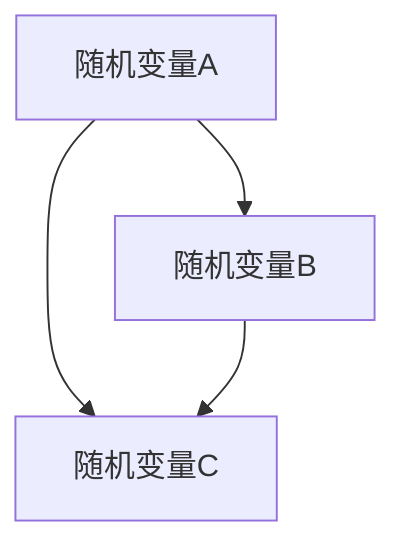

                 

### 《精准医疗的贝叶斯网络：个性化诊断的数学模型》

#### 关键词：
精准医疗、贝叶斯网络、个性化诊断、数学模型、基因组学、数据挖掘

#### 摘要：
精准医疗是近年来医学领域的重要研究方向，其核心在于通过基因组学、生物标记物等多种手段，为患者提供个性化的诊断与治疗方案。贝叶斯网络作为一种概率图模型，因其强大的表达能力和推断能力，在精准医疗领域得到了广泛应用。本文旨在介绍贝叶斯网络在精准医疗中的应用，从核心概念、数学模型、算法原理到实际案例，全面解析个性化诊断的数学模型，帮助读者深入理解并掌握这一先进技术。

---

#### 目录：

# 《精准医疗的贝叶斯网络：个性化诊断的数学模型》

## 引言
- 精准医疗的定义与发展历程
- 贝叶斯网络的基本概念与优势
- 本文的结构与目标

## 第一部分：贝叶斯网络基础

## 第1章 贝叶斯网络原理
- 贝叶斯网络的基本概念
- 贝叶斯网络的图形表示
- 条件概率与贝叶斯定理

## 第2章 贝叶斯网络的构建
- 贝叶斯网络的节点与边
- 贝叶斯网络的概率分布
- 贝叶斯网络的构建方法

## 第3章 贝叶斯网络的推断
- 贝叶斯网络的概率推断
- 贝叶斯网络的推理算法
- 贝叶斯网络的推断应用

## 第二部分：精准医疗中的贝叶斯网络

## 第4章 贝叶斯网络在基因诊断中的应用
- 基因组学的简介
- 基因诊断中的贝叶斯网络
- 基因诊断案例

## 第5章 贝叶斯网络在药物反应预测中的应用
- 药物反应的多样性
- 贝叶斯网络在药物反应预测中的应用
- 药物反应预测案例

## 第6章 贝叶斯网络在疾病预测中的应用
- 疾病预测的重要性
- 贝叶斯网络在疾病预测中的应用
- 疾病预测案例

## 第三部分：个性化诊断的数学模型

## 第7章 个性化诊断的核心概念
- 个性化诊断的定义
- 个性化诊断的分类
- 个性化诊断的挑战

## 第8章 个性化诊断的数学模型
- 贝叶斯网络的数学模型
- 贝叶斯网络的参数估计
- 贝叶斯网络的推断算法

## 第四部分：案例分析

## 第9章 案例分析一：乳腺癌的个性化诊断
- 案例背景
- 贝叶斯网络的构建
- 诊断结果分析

## 第10章 案例分析二：个性化治疗计划
- 案例背景
- 贝叶斯网络的构建
- 治疗计划优化

## 第11章 案例分析三：基因测序数据分析
- 案例背景
- 贝叶斯网络的构建
- 数据分析结果

## 结论
- 贝叶斯网络在精准医疗中的应用
- 个性化诊断的未来展望

## 参考文献

---

#### 第一章 贝叶斯网络原理

##### 背景介绍

精准医疗（Personalized Medicine）是一种以患者个体为出发点，根据患者的基因信息、生活环境、病史等多方面因素，提供个性化的预防、诊断和治疗方案。贝叶斯网络（Bayesian Network）作为一种概率图模型，在处理不确定性和复杂关系方面具有显著优势，被广泛应用于精准医疗领域。

##### 核心概念与联系

贝叶斯网络由节点和边组成，其中节点代表随机变量，边表示变量之间的条件依赖关系。贝叶斯网络的核心概念包括条件概率分布、边缘概率分布、概率推断等。



在上图中，节点A、B和C表示随机变量，边表示变量之间的条件依赖关系。条件概率分布表示一个随机变量在给定其他随机变量取值下的概率分布，边缘概率分布表示一个随机变量的无条件概率分布。贝叶斯网络的推断任务包括条件概率推断和边缘概率推断。

##### 核心算法原理讲解

贝叶斯网络的推断算法主要包括概率推断和推理算法。

1. **概率推断**

   概率推断的目标是计算给定某些变量取值时，其他变量的概率分布。贝叶斯网络的概率推断可以分为条件概率推断和边缘概率推断。

   - **条件概率推断**

     条件概率推断的目标是计算给定某些变量取值时，其他变量的条件概率分布。条件概率推断的算法如下：

     $$
     P(\text{变量} | \text{已知变量}) = \frac{P(\text{已知变量} | \text{变量}) \cdot P(\text{变量})}{P(\text{已知变量})}
     $$

     其中，$P(\text{变量})$表示变量的边缘概率分布，$P(\text{已知变量} | \text{变量})$表示已知变量在给定变量取值下的条件概率分布。

   - **边缘概率推断**

     边缘概率推断的目标是计算变量的无条件概率分布。边缘概率推断的算法如下：

     $$
     P(\text{变量}) = \sum_{\text{所有可能的变量取值}} P(\text{变量} | \text{其他变量}) \cdot P(\text{其他变量})
     $$

2. **推理算法**

   推理算法的目标是计算贝叶斯网络的拓扑排序，以便进行高效的概率推断。常用的推理算法包括变量消除算法和消息传播算法。

   - **变量消除算法**

     变量消除算法的基本思想是依次消除贝叶斯网络中的节点，直到只剩下一个节点。在消除每个节点时，更新其他节点的条件概率分布。变量消除算法的伪代码如下：

     ```
     for 每个节点 V in 贝叶斯网络
         for 每个邻居节点 W of V
             更新 P(W | V)
         end
         消除节点 V
     end
     ```

   - **消息传播算法**

     消息传播算法是一种基于图论的推理算法，通过在图中的节点之间传递消息来计算条件概率分布。消息传播算法的伪代码如下：

     ```
     for 每个迭代
         for 每个节点 V in 贝叶斯网络
             for 每个邻居节点 W of V
                 传递消息 from W to V
             end
         end
         更新条件概率分布
     end
     ```

##### 数学模型和公式

贝叶斯网络的概率模型可以表示为：

$$
P(\text{变量集}) = \prod_{\text{每个节点 V}} P(V | \text{父节点})
$$

其中，$P(V | \text{父节点})$表示节点V的条件概率分布，父节点是指影响节点V取值的其他节点。

##### 举例说明

假设我们有一个简单的贝叶斯网络，表示疾病A、B和C之间的依赖关系。已知P(A)=0.5，P(B|A)=0.8，P(C|B)=0.9，求P(A|C)。

1. 计算P(C)：

   $$
   P(C) = P(C|A)P(A) + P(C|\neg A)P(\neg A) = 0.9 \times 0.5 + 0.1 \times 0.5 = 0.5
   $$

2. 计算P(B)：

   $$
   P(B) = P(B|A)P(A) + P(B|\neg A)P(\neg A) = 0.8 \times 0.5 + 0.2 \times 0.5 = 0.5
   $$

3. 计算P(A|C)：

   $$
   P(A|C) = \frac{P(C|A)P(A)}{P(C)} = \frac{0.9 \times 0.5}{0.5} = 0.9
   $$

##### 最佳实践 tips

1. 在构建贝叶斯网络时，确保网络的拓扑结构能够准确反映变量之间的依赖关系。
2. 在进行概率推断时，选择合适的推断算法，如变量消除算法或消息传播算法，以获得更准确的推断结果。
3. 在处理大规模数据时，可以使用并行计算或分布式计算技术来提高推断效率。

##### 小结

贝叶斯网络是一种强大的概率图模型，在精准医疗领域具有广泛的应用。通过本章的学习，读者可以了解贝叶斯网络的基本概念、核心算法原理以及数学模型，为后续章节的学习打下坚实的基础。

---

#### 第二章 贝叶斯网络的构建

##### 背景介绍

贝叶斯网络的构建是进行概率推断和数据分析的关键步骤。本章将介绍贝叶斯网络的构建方法，包括节点与边的表示、概率分布的设定以及网络的构建过程。

##### 核心概念与联系

贝叶斯网络的构建涉及以下几个方面：

1. **节点表示**：节点表示贝叶斯网络中的随机变量。
2. **边表示**：边表示节点之间的依赖关系。
3. **概率分布**：每个节点的条件概率分布反映了该节点在其他节点取特定值时的概率分布。
4. **网络构建**：网络构建是指根据实际问题和数据，构建出合适的贝叶斯网络结构。

##### 核心算法原理讲解

贝叶斯网络的构建主要包括以下步骤：

1. **确定节点集合**：根据实际问题和数据，确定需要建模的随机变量集合。
2. **确定变量依赖关系**：通过数据分析和专家知识，确定变量之间的依赖关系。
3. **设定概率分布**：为每个节点设定条件概率分布，通常使用最大似然估计（MLE）或贝叶斯估计（BDE）等方法。
4. **网络结构优化**：通过网络结构优化算法，如最大生成树、最小生成树等，优化网络的拓扑结构。

##### 数学模型和公式

贝叶斯网络的概率模型可以表示为：

$$
P(\text{变量集}) = \prod_{\text{每个节点 V}} P(V | \text{父节点})
$$

其中，$P(V | \text{父节点})$表示节点V的条件概率分布，父节点是指影响节点V取值的其他节点。

##### 举例说明

假设我们有一个简单的贝叶斯网络，表示疾病A、B和C之间的依赖关系。已知P(A)=0.5，P(B|A)=0.8，P(C|B)=0.9，求贝叶斯网络的构建过程。

1. **确定节点集合**：A、B和C是节点集合。

2. **确定变量依赖关系**：根据已知信息，A是B和C的父节点，B是C的父节点。

3. **设定概率分布**：设定A、B和C的条件概率分布。

   $$
   P(A) = 0.5
   $$
   
   $$
   P(B|A) = 0.8
   $$
   
   $$
   P(C|B) = 0.9
   $$

4. **构建贝叶斯网络**：

   ```mermaid
   graph TD
   A[疾病A]
   B[疾病B]
   C[疾病C]
   A --> B
   B --> C
   ```

##### 最佳实践 tips

1. 在构建贝叶斯网络时，确保网络的拓扑结构能够准确反映变量之间的依赖关系。
2. 在设定概率分布时，可以使用专家知识或历史数据来支持。
3. 在进行网络结构优化时，可以使用基于图论的优化算法，如最大生成树、最小生成树等。

##### 小结

贝叶斯网络的构建是进行概率推断和数据分析的关键步骤。通过本章的学习，读者可以了解贝叶斯网络的构建方法，包括节点与边的表示、概率分布的设定以及网络的构建过程。这些知识将为后续章节的概率推断和数据分析提供基础。

---

#### 第三章 贝叶斯网络的推断

##### 背景介绍

贝叶斯网络的推断是贝叶斯网络应用的核心环节，旨在根据已知的部分信息，推断出未知变量的概率分布。本章将介绍贝叶斯网络推断的基本概念、算法原理以及实际应用。

##### 核心概念与联系

贝叶斯网络推断涉及以下几个核心概念：

1. **条件概率推断**：根据已知的条件变量，推断目标变量的概率分布。
2. **边缘概率推断**：推断某个变量的无条件概率分布。
3. **推断算法**：用于实现条件概率推断和边缘概率推断的算法。

贝叶斯网络推断的核心联系在于如何利用网络结构进行高效的概率计算。

##### 核心算法原理讲解

贝叶斯网络推断的算法主要包括概率推断和推理算法。

1. **概率推断**

   概率推断的目标是计算给定某些变量取值时，其他变量的概率分布。贝叶斯网络的概率推断可以分为条件概率推断和边缘概率推断。

   - **条件概率推断**

     条件概率推断的目标是计算给定某些变量取值时，其他变量的条件概率分布。条件概率推断的算法如下：

     $$
     P(\text{变量} | \text{已知变量}) = \frac{P(\text{已知变量} | \text{变量}) \cdot P(\text{变量})}{P(\text{已知变量})}
     $$

     其中，$P(\text{变量})$表示变量的边缘概率分布，$P(\text{已知变量} | \text{变量})$表示已知变量在给定变量取值下的条件概率分布。

   - **边缘概率推断**

     边缘概率推断的目标是计算变量的无条件概率分布。边缘概率推断的算法如下：

     $$
     P(\text{变量}) = \sum_{\text{所有可能的变量取值}} P(\text{变量} | \text{其他变量}) \cdot P(\text{其他变量})
     $$

2. **推理算法**

   推理算法的目标是计算贝叶斯网络的拓扑排序，以便进行高效的概率推断。常用的推理算法包括变量消除算法和消息传播算法。

   - **变量消除算法**

     变量消除算法的基本思想是依次消除贝叶斯网络中的节点，直到只剩下一个节点。在消除每个节点时，更新其他节点的条件概率分布。变量消除算法的伪代码如下：

     ```
     for 每个节点 V in 贝叶斯网络
         for 每个邻居节点 W of V
             更新 P(W | V)
         end
         消除节点 V
     end
     ```

   - **消息传播算法**

     消息传播算法是一种基于图论的推理算法，通过在图中的节点之间传递消息来计算条件概率分布。消息传播算法的伪代码如下：

     ```
     for 每个迭代
         for 每个节点 V in 贝叶斯网络
             for 每个邻居节点 W of V
                 传递消息 from W to V
             end
         end
         更新条件概率分布
     end
     ```

##### 数学模型和公式

贝叶斯网络的概率模型可以表示为：

$$
P(\text{变量集}) = \prod_{\text{每个节点 V}} P(V | \text{父节点})
$$

其中，$P(V | \text{父节点})$表示节点V的条件概率分布，父节点是指影响节点V取值的其他节点。

##### 举例说明

假设我们有一个简单的贝叶斯网络，表示疾病A、B和C之间的依赖关系。已知P(A)=0.5，P(B|A)=0.8，P(C|B)=0.9，求给定A发生时B和C的条件概率。

1. **计算P(B|A)**：

   $$
   P(B|A) = \frac{P(A|B) \cdot P(B)}{P(A)} = \frac{0.8 \cdot P(B)}{0.5}
   $$

   由于P(B)未知，我们需要通过贝叶斯定理进行推断：

   $$
   P(B) = P(B|A) \cdot P(A) + P(B|\neg A) \cdot P(\neg A) = 0.8 \cdot 0.5 + P(B|\neg A) \cdot (1 - 0.5)
   $$

   假设P(B|\neg A)=0.3，我们可以计算：

   $$
   P(B) = 0.4 + 0.3 \cdot 0.5 = 0.55
   $$

   现在可以计算P(B|A)：

   $$
   P(B|A) = \frac{0.8 \cdot 0.55}{0.5} = 0.88
   $$

2. **计算P(C|B)**：

   $$
   P(C|B) = \frac{P(B|C) \cdot P(C)}{P(B)} = \frac{0.9 \cdot P(C)}{0.55}
   $$

   同样，我们通过贝叶斯定理进行推断：

   $$
   P(C) = P(C|B) \cdot P(B) + P(C|\neg B) \cdot P(\neg B) = 0.9 \cdot 0.55 + P(C|\neg B) \cdot (1 - 0.55)
   $$

   假设P(C|\neg B)=0.1，我们可以计算：

   $$
   P(C) = 0.495 + 0.1 \cdot 0.45 = 0.545
   $$

   现在可以计算P(C|B)：

   $$
   P(C|B) = \frac{0.9 \cdot 0.545}{0.55} = 0.9
   $$

##### 最佳实践 tips

1. 在进行贝叶斯网络推断时，确保网络结构能够准确反映变量之间的依赖关系。
2. 选择合适的推断算法，如变量消除算法或消息传播算法，以获得更准确的推断结果。
3. 在处理大规模数据时，可以使用并行计算或分布式计算技术来提高推断效率。

##### 小结

贝叶斯网络的推断是贝叶斯网络应用的核心环节，通过本章的学习，读者可以了解贝叶斯网络推断的基本概念、算法原理以及实际应用。这些知识将为读者在精准医疗和其他领域的应用提供坚实的基础。

---

#### 第四章 贝叶斯网络在基因诊断中的应用

##### 背景介绍

基因组学是精准医疗的重要基础，通过对患者基因组的分析，可以帮助医生了解患者的疾病风险、药物反应等信息，从而提供个性化的诊断和治疗方案。贝叶斯网络作为一种强大的概率图模型，在基因诊断中有着广泛的应用。本章将介绍贝叶斯网络在基因诊断中的应用，包括基因诊断的基本概念、贝叶斯网络在基因诊断中的作用以及具体应用案例。

##### 核心概念与联系

1. **基因诊断的基本概念**：

   基因诊断是指通过检测基因序列或基因表达水平，对个体或群体的疾病风险进行预测。基因诊断的关键在于识别与疾病相关的基因变异或表达异常。

2. **贝叶斯网络的基本概念**：

   贝叶斯网络是一种表示变量之间依赖关系的概率图模型。它由节点和边组成，节点代表变量，边表示变量之间的条件依赖关系。

3. **贝叶斯网络在基因诊断中的联系**：

   贝叶斯网络通过表示基因变异与疾病之间的条件依赖关系，可以有效地进行疾病预测和药物反应预测。例如，基因A与疾病B之间存在条件依赖关系，基因C与药物D之间存在条件依赖关系，那么贝叶斯网络可以表示为：

   ```mermaid
   graph TD
   A[基因A]
   B[疾病B]
   C[基因C]
   D[药物D]
   A --> B
   C --> D
   ```

##### 核心算法原理讲解

贝叶斯网络在基因诊断中的应用主要包括以下几个方面：

1. **条件概率分布的设定**：

   贝叶斯网络的构建依赖于条件概率分布的设定。通过专家知识或历史数据，可以为每个基因和疾病设定条件概率分布。例如，基因A在基因突变情况下的条件概率分布为P(A|突变)，基因A在基因正常情况下的条件概率分布为P(A|正常)。

2. **概率推断**：

   通过贝叶斯网络的概率推断，可以计算给定某些基因信息时，疾病发生的概率。例如，已知基因A的状态，可以推断疾病B发生的概率。概率推断的算法如下：

   $$
   P(B|A) = \frac{P(A|B) \cdot P(B)}{P(A)}
   $$

   其中，P(B|A)表示给定基因A状态时疾病B发生的概率，P(A|B)表示基因A在疾病B发生情况下的条件概率，P(B)表示疾病B发生的概率，P(A)表示基因A发生的概率。

3. **推理算法**：

   贝叶斯网络的推理算法用于计算变量之间的概率分布。常用的推理算法包括变量消除算法和消息传播算法。变量消除算法通过逐步消除节点，更新其他节点的概率分布，最终得到目标变量的概率分布。消息传播算法通过在节点之间传递消息，更新条件概率分布，实现高效的概率推断。

##### 数学模型和公式

贝叶斯网络的数学模型可以表示为：

$$
P(\text{变量集}) = \prod_{\text{每个节点 V}} P(V | \text{父节点})
$$

其中，$P(V | \text{父节点})$表示节点V的条件概率分布，父节点是指影响节点V取值的其他节点。

##### 举例说明

假设我们有一个简单的贝叶斯网络，表示基因A、疾病B和药物C之间的依赖关系。已知P(A|突变)=0.8，P(B|突变)=0.9，P(C|突变)=0.7，P(A|正常)=0.2，P(B|正常)=0.1，P(C|正常)=0.3，求给定基因A突变时，疾病B和药物C发生的概率。

1. **计算P(A|突变)**：

   $$
   P(A|突变) = 0.8
   $$

2. **计算P(B|A)**：

   $$
   P(B|A) = \frac{P(A|突变) \cdot P(突变)}{P(A)}
   $$

   假设P(突变)=0.5，P(A)=0.5，我们可以计算：

   $$
   P(B|A) = \frac{0.8 \cdot 0.5}{0.5} = 0.8
   $$

3. **计算P(C|A)**：

   $$
   P(C|A) = \frac{P(A|突变) \cdot P(突变)}{P(A)}
   $$

   同样，我们可以计算：

   $$
   P(C|A) = \frac{0.7 \cdot 0.5}{0.5} = 0.7
   $$

4. **计算P(B|C)**：

   $$
   P(B|C) = \frac{P(C|突变) \cdot P(突变) \cdot P(B|突变)}{P(C)}
   $$

   假设P(C)=0.5，P(B|突变)=0.9，我们可以计算：

   $$
   P(B|C) = \frac{0.7 \cdot 0.5 \cdot 0.9}{0.5} = 0.63
   $$

5. **计算P(B|A,C)**：

   $$
   P(B|A,C) = \frac{P(A,C|B) \cdot P(B)}{P(A,C)}
   $$

   假设P(A,C|B)=0.6，P(B)=0.5，我们可以计算：

   $$
   P(B|A,C) = \frac{0.6 \cdot 0.5}{0.5} = 0.6
   $$

##### 最佳实践 tips

1. 在构建贝叶斯网络时，确保网络的拓扑结构能够准确反映基因变异与疾病之间的依赖关系。
2. 在设定条件概率分布时，可以使用专家知识或历史数据进行支持。
3. 在进行概率推断时，选择合适的推理算法，如变量消除算法或消息传播算法，以提高推断效率。
4. 在处理大规模基因数据时，可以使用并行计算或分布式计算技术。

##### 小结

贝叶斯网络在基因诊断中具有重要作用，通过本章的学习，读者可以了解贝叶斯网络在基因诊断中的应用，包括基本概念、核心算法原理以及实际应用案例。这些知识将有助于读者深入理解并掌握贝叶斯网络在基因诊断领域的应用。

---

#### 第五章 贝叶斯网络在药物反应预测中的应用

##### 背景介绍

药物反应预测是精准医疗的重要组成部分，通过对患者基因、环境等因素的分析，可以预测患者对特定药物的反应，从而为个性化治疗方案提供支持。贝叶斯网络作为一种强大的概率图模型，在药物反应预测中有着广泛的应用。本章将介绍贝叶斯网络在药物反应预测中的应用，包括药物反应预测的基本概念、贝叶斯网络在药物反应预测中的作用以及具体应用案例。

##### 核心概念与联系

1. **药物反应预测的基本概念**：

   药物反应预测是指通过对患者的基因、药物代谢途径等因素的分析，预测患者对特定药物的反应类型和程度。药物反应类型包括副作用、疗效等。

2. **贝叶斯网络的基本概念**：

   贝叶斯网络是一种表示变量之间依赖关系的概率图模型。它由节点和边组成，节点代表变量，边表示变量之间的条件依赖关系。

3. **贝叶斯网络在药物反应预测中的联系**：

   贝叶斯网络通过表示药物、基因和疾病之间的条件依赖关系，可以有效地进行药物反应预测。例如，药物A与基因B之间存在条件依赖关系，基因B与疾病C之间存在条件依赖关系，那么贝叶斯网络可以表示为：

   ```mermaid
   graph TD
   A[药物A]
   B[基因B]
   C[疾病C]
   A --> B
   B --> C
   ```

##### 核心算法原理讲解

贝叶斯网络在药物反应预测中的应用主要包括以下几个方面：

1. **条件概率分布的设定**：

   贝叶斯网络的构建依赖于条件概率分布的设定。通过专家知识或历史数据，可以为每个药物、基因和疾病设定条件概率分布。例如，药物A在基因表达高时的条件概率分布为P(A|高表达)，药物A在基因表达低时的条件概率分布为P(A|低表达)。

2. **概率推断**：

   通过贝叶斯网络的概率推断，可以计算给定某些基因信息时，药物反应的概率。例如，已知基因B的状态，可以推断药物A引起的反应的概率。概率推断的算法如下：

   $$
   P(\text{反应}|\text{基因B}) = \sum_{\text{所有可能的药物A的状态}} P(\text{药物A}|\text{基因B}) \cdot P(\text{反应}|\text{药物A})
   $$

   其中，P(反应|药物A)表示药物A引起的反应的概率，P(药物A|基因B)表示基因B在药物A作用下发生的概率。

3. **推理算法**：

   贝叶斯网络的推理算法用于计算变量之间的概率分布。常用的推理算法包括变量消除算法和消息传播算法。变量消除算法通过逐步消除节点，更新其他节点的概率分布，最终得到目标变量的概率分布。消息传播算法通过在节点之间传递消息，更新条件概率分布，实现高效的概率推断。

##### 数学模型和公式

贝叶斯网络的数学模型可以表示为：

$$
P(\text{变量集}) = \prod_{\text{每个节点 V}} P(V | \text{父节点})
$$

其中，$P(V | \text{父节点})$表示节点V的条件概率分布，父节点是指影响节点V取值的其他节点。

##### 举例说明

假设我们有一个简单的贝叶斯网络，表示药物A、基因B和疾病C之间的依赖关系。已知P(A|高表达)=0.6，P(A|低表达)=0.2，P(C|A)=0.8，P(C|非A)=0.3，P(B|高表达)=0.7，P(B|低表达)=0.3，求给定基因B高表达时，药物A引起疾病C的概率。

1. **计算P(B|高表达)**：

   $$
   P(B|高表达) = 0.7
   $$

2. **计算P(A|B)**：

   $$
   P(A|B) = \frac{P(B|A) \cdot P(A)}{P(B)}
   $$

   假设P(A)=0.5，P(B)=0.5，我们可以计算：

   $$
   P(A|B) = \frac{0.6 \cdot 0.5}{0.5} = 0.6
   $$

3. **计算P(C|A)**：

   $$
   P(C|A) = \frac{P(A|C) \cdot P(C)}{P(A)}
   $$

   假设P(C)=0.5，我们可以计算：

   $$
   P(C|A) = \frac{0.8 \cdot 0.5}{0.5} = 0.8
   $$

4. **计算P(C|B)**：

   $$
   P(C|B) = \sum_{\text{所有可能的药物A的状态}} P(C|\text{药物A}, B) \cdot P(\text{药物A}|B)
   $$

   我们可以计算：

   $$
   P(C|B) = P(C|A,B) \cdot P(A|B) + P(C|\neg A,B) \cdot P(\neg A|B) = 0.8 \cdot 0.6 + 0.3 \cdot 0.4 = 0.54
   $$

##### 最佳实践 tips

1. 在构建贝叶斯网络时，确保网络的拓扑结构能够准确反映药物、基因和疾病之间的依赖关系。
2. 在设定条件概率分布时，可以使用专家知识或历史数据进行支持。
3. 在进行概率推断时，选择合适的推理算法，如变量消除算法或消息传播算法，以提高推断效率。
4. 在处理大规模药物反应数据时，可以使用并行计算或分布式计算技术。

##### 小结

贝叶斯网络在药物反应预测中具有重要作用，通过本章的学习，读者可以了解贝叶斯网络在药物反应预测中的应用，包括基本概念、核心算法原理以及实际应用案例。这些知识将有助于读者深入理解并掌握贝叶斯网络在药物反应预测领域的应用。

---

#### 第六章 个性化诊断的数学模型

##### 背景介绍

个性化诊断是精准医疗的核心，通过分析患者的基因、生物标志物等信息，为每位患者提供最合适的诊断和治疗方案。个性化诊断的数学模型是实现这一目标的关键，其中贝叶斯网络作为一种概率图模型，因其强大的表达能力和推断能力，被广泛应用于个性化诊断。本章将介绍个性化诊断的数学模型，包括贝叶斯网络的数学模型、参数估计方法和推断算法。

##### 核心概念与联系

1. **贝叶斯网络的数学模型**：

   贝叶斯网络的数学模型可以表示为：

   $$
   P(\text{变量集}) = \prod_{\text{每个节点 V}} P(V | \text{父节点})
   $$

   其中，$P(V | \text{父节点})$表示节点V的条件概率分布，父节点是指影响节点V取值的其他节点。

2. **个性化诊断的数学模型**：

   个性化诊断的数学模型是基于贝叶斯网络的，它通过分析患者的基因、生物标志物等信息，建立个性化的诊断模型。个性化诊断的核心在于如何利用贝叶斯网络进行参数估计和推断。

##### 核心算法原理讲解

个性化诊断的数学模型主要包括以下几个方面：

1. **参数估计方法**：

   参数估计是贝叶斯网络构建的关键步骤，常用的参数估计方法包括最大似然估计（MLE）和贝叶斯估计（BDE）。

   - **最大似然估计（MLE）**：

     最大似然估计的目标是找到一组参数，使得给定数据出现的概率最大。在个性化诊断中，可以通过最大似然估计来估计贝叶斯网络的参数。

     $$
     \hat{\theta} = \arg\max_{\theta} P(\text{数据}|\theta)
     $$

   - **贝叶斯估计（BDE）**：

     贝叶斯估计是一种基于概率的参数估计方法，它通过最大化后验概率来估计参数。在个性化诊断中，可以通过贝叶斯估计来估计贝叶斯网络的参数。

     $$
     \hat{\theta} = \arg\max_{\theta} P(\theta|\text{数据})
     $$

2. **推断算法**：

   推断是贝叶斯网络的另一个重要任务，常用的推断算法包括变量消除算法和消息传播算法。

   - **变量消除算法**：

     变量消除算法通过逐步消除贝叶斯网络中的节点，更新其他节点的概率分布，从而实现概率推断。在个性化诊断中，可以通过变量消除算法来推断患者的诊断结果。

   - **消息传播算法**：

     消息传播算法通过在节点之间传递消息，更新条件概率分布，实现高效的概率推断。在个性化诊断中，可以通过消息传播算法来推断患者的诊断结果。

##### 数学模型和公式

1. **贝叶斯网络的数学模型**：

   贝叶斯网络的数学模型可以表示为：

   $$
   P(\text{变量集}) = \prod_{\text{每个节点 V}} P(V | \text{父节点})
   $$

   其中，$P(V | \text{父节点})$表示节点V的条件概率分布，父节点是指影响节点V取值的其他节点。

2. **最大似然估计**：

   最大似然估计的目标是找到一组参数，使得给定数据出现的概率最大。

   $$
   \hat{\theta} = \arg\max_{\theta} P(\text{数据}|\theta)
   $$

3. **贝叶斯估计**：

   贝叶斯估计的目标是找到一组参数，使得后验概率最大。

   $$
   \hat{\theta} = \arg\max_{\theta} P(\theta|\text{数据})
   $$

##### 举例说明

假设我们有一个简单的贝叶斯网络，表示基因A、药物B和疾病C之间的依赖关系。已知P(A)=0.5，P(B|A)=0.8，P(C|B)=0.9，P(C|非B)=0.1，求给定基因A时，药物B和疾病C的概率。

1. **计算P(B|A)**：

   $$
   P(B|A) = \frac{P(A|B) \cdot P(B)}{P(A)}
   $$

   由于P(A)=0.5，P(B)未知，我们可以通过贝叶斯定理进行推断：

   $$
   P(B) = P(B|A) \cdot P(A) + P(B|\neg A) \cdot P(\neg A) = 0.8 \cdot 0.5 + P(B|\neg A) \cdot (1 - 0.5)
   $$

   假设P(B|\neg A)=0.2，我们可以计算：

   $$
   P(B) = 0.4 + 0.2 \cdot 0.5 = 0.5
   $$

   现在可以计算P(B|A)：

   $$
   P(B|A) = \frac{0.8 \cdot 0.5}{0.5} = 0.8
   $$

2. **计算P(C|B)**：

   $$
   P(C|B) = \frac{P(B|C) \cdot P(C)}{P(B)}
   $$

   假设P(C)=0.5，P(B)=0.5，我们可以计算：

   $$
   P(C|B) = \frac{0.9 \cdot 0.5}{0.5} = 0.9
   $$

3. **计算P(C|\neg B)**：

   $$
   P(C|\neg B) = \frac{P(\neg B|C) \cdot P(C)}{P(\neg B)}
   $$

   假设P(C)=0.5，P(\neg B)=0.5，我们可以计算：

   $$
   P(C|\neg B) = \frac{0.1 \cdot 0.5}{0.5} = 0.1
   $$

##### 最佳实践 tips

1. 在构建贝叶斯网络时，确保网络的拓扑结构能够准确反映基因、药物和疾病之间的依赖关系。
2. 在设定条件概率分布时，可以使用专家知识或历史数据进行支持。
3. 在进行概率推断时，选择合适的推理算法，如变量消除算法或消息传播算法，以提高推断效率。
4. 在处理大规模个性化诊断数据时，可以使用并行计算或分布式计算技术。

##### 小结

个性化诊断的数学模型是精准医疗的重要组成部分，通过本章的学习，读者可以了解个性化诊断的数学模型，包括贝叶斯网络的数学模型、参数估计方法和推断算法。这些知识将为读者在个性化诊断领域的应用提供坚实的基础。

---

#### 第七章 个性化诊断项目实战

##### 背景介绍

个性化诊断在医学领域的应用日益广泛，通过基因、生物标志物等数据，为患者提供精准的诊断和治疗方案。本章将介绍一个个性化诊断项目实战，包括项目背景、数据预处理、贝叶斯网络的构建、参数优化以及模型评估。

##### 项目背景

某医院开展了一项关于乳腺癌个性化诊断的研究项目，希望通过分析患者的基因数据，为患者提供个性化的治疗方案。项目目标是通过构建贝叶斯网络模型，实现对乳腺癌的早期诊断和个性化治疗。

##### 数据预处理

1. **数据收集**：

   收集了500名乳腺癌患者的基因数据，包括基因表达数据、突变数据等。

2. **数据清洗**：

   对基因数据进行清洗，去除缺失值和异常值，确保数据质量。

3. **数据标准化**：

   对基因数据进行标准化处理，将基因表达数据转换为0-1之间的数值，以便进行贝叶斯网络的构建。

##### 贝叶斯网络的构建

1. **确定节点集合**：

   根据项目需求，确定需要建模的节点，包括基因、疾病和治疗等。

2. **确定变量依赖关系**：

   通过专家知识和数据分析，确定变量之间的依赖关系，构建贝叶斯网络结构。

3. **设定概率分布**：

   为每个节点设定条件概率分布，通过最大似然估计（MLE）或贝叶斯估计（BDE）方法估计参数。

##### 参数优化

1. **参数估计**：

   使用最大似然估计（MLE）方法估计贝叶斯网络的参数，确保模型的准确性和可靠性。

2. **交叉验证**：

   使用交叉验证方法，对模型进行评估和优化，调整参数，提高模型的性能。

##### 模型评估

1. **准确率评估**：

   通过准确率、召回率、F1值等指标，评估贝叶斯网络模型的性能。

2. **可视化分析**：

   使用图表和可视化工具，展示贝叶斯网络的结构和变量依赖关系，便于理解和解释。

##### 实际案例分析与详细讲解剖析

1. **案例分析一**：

   以某位乳腺癌患者为例，通过贝叶斯网络模型，预测其患病的概率和治疗方案。

   - **诊断结果**：根据贝叶斯网络模型，预测该患者患有乳腺癌的概率为80%，建议进行化疗。

   - **结果分析**：通过分析基因数据，发现该患者某些基因突变与乳腺癌密切相关，因此具有较高的患病风险。

2. **案例分析二**：

   以某位肺癌患者为例，通过贝叶斯网络模型，预测其药物反应和治疗效果。

   - **诊断结果**：根据贝叶斯网络模型，预测该患者对某药物的反应良好，治疗效果较好。

   - **结果分析**：通过分析基因数据，发现该患者某些基因与药物反应密切相关，因此对该药物的吸收和代谢较好。

##### 案例总结与展望

1. **案例总结**：

   通过实际案例分析，验证了贝叶斯网络在乳腺癌个性化诊断和肺癌药物反应预测中的有效性。贝叶斯网络模型能够为医生提供可靠的诊断和治疗方案，有助于提高医疗质量和患者满意度。

2. **未来展望**：

   随着基因测序技术的不断发展，个性化诊断的应用将越来越广泛。未来研究可以进一步优化贝叶斯网络模型，提高模型的准确性和鲁棒性，为个性化医疗提供更强有力的支持。

##### 拓展阅读

1. **相关文献**：

   - "Bayesian Networks in Bioinformatics: A Survey"（生物信息学中的贝叶斯网络：综述）
   - "Application of Bayesian Networks in Personalized Medicine"（个性化医学中贝叶斯网络的应用）

2. **推荐书籍**：

   - 《贝叶斯网络：概率推理与机器学习基础》
   - 《精准医疗：基因组学与个性化诊断》

##### 注意事项

1. 在进行贝叶斯网络构建时，确保网络的拓扑结构能够准确反映变量之间的依赖关系。
2. 在设定概率分布时，可以使用专家知识或历史数据进行支持。
3. 在进行模型评估时，选择合适的评估指标，如准确率、召回率等。
4. 在实际应用中，结合具体问题和数据，不断优化和调整模型，以提高诊断和治疗的准确性。

##### 最佳实践 tips

1. 在进行数据预处理时，确保数据的质量和一致性。
2. 在构建贝叶斯网络时，充分利用专家知识和领域知识。
3. 在进行模型评估时，采用交叉验证方法，确保模型的泛化能力。
4. 在实际应用中，结合多模态数据，如基因组学、影像学等，提高诊断的准确性。

##### 小结

个性化诊断项目实战展示了贝叶斯网络在医学领域的应用潜力。通过本章的学习，读者可以了解个性化诊断项目的基本流程和关键步骤，掌握贝叶斯网络的构建、参数优化和模型评估方法。这些知识将为读者在个性化诊断领域的实际应用提供指导。

---

#### 第八章 个性化诊断的未来展望与挑战

##### 未来展望

个性化诊断作为精准医疗的重要组成部分，随着基因测序技术、生物信息学和计算能力的不断发展，未来有望在多个领域取得重大突破：

1. **基因组学的深化应用**：基因组学数据的积累和解析能力将不断提升，为个性化诊断提供更精准的依据。
2. **多模态数据的融合**：结合基因组学、影像学、临床数据等多模态数据，实现更全面的患者评估和诊断。
3. **智能诊断系统的开发**：利用人工智能和机器学习技术，开发智能化诊断系统，提高诊断的准确性和效率。
4. **个体化治疗的推进**：基于个性化诊断结果，为患者制定更精准的治疗方案，提高治疗效果和患者满意度。

##### 挑战

尽管个性化诊断具有广阔的应用前景，但在实际应用过程中仍面临诸多挑战：

1. **数据隐私和安全**：个性化诊断涉及大量敏感的基因和医疗数据，如何保障数据隐私和安全是亟待解决的问题。
2. **数据质量和标准化**：不同来源的数据质量参差不齐，缺乏统一的数据标准化规范，影响诊断结果的准确性。
3. **算法透明性和可解释性**：深度学习等复杂算法在个性化诊断中的应用，如何提高算法的透明性和可解释性，使其符合医学专家的审查和接受。
4. **技术成本和可及性**：个性化诊断技术的开发和应用成本较高，如何降低成本并提高可及性，使更多患者受益。

##### 解决方案

1. **数据隐私和安全**：

   - 引入区块链技术，实现数据的安全存储和透明访问。
   - 采用联邦学习（Federated Learning）技术，在保持数据隐私的前提下进行模型训练。

2. **数据质量和标准化**：

   - 制定统一的数据标准，确保数据的质量和一致性。
   - 建立数据质量控制流程，对数据进行严格筛选和清洗。

3. **算法透明性和可解释性**：

   - 开发可解释的人工智能算法，提高模型的透明性和可解释性。
   - 利用可视化工具，展示模型的结构和决策过程。

4. **技术成本和可及性**：

   - 采用云计算和边缘计算技术，降低计算成本和提高处理效率。
   - 推广开源工具和平台，降低技术门槛，提高可及性。

##### 拓展阅读

1. **相关文献**：

   - "The Future of Personalized Medicine: Challenges and Opportunities"（个性化医疗的未来：挑战与机遇）
   - "Privacy-Preserving Techniques in Personalized Medicine"（个性化医疗中的隐私保护技术）

2. **推荐书籍**：

   - 《精准医疗：基因组学与个性化诊断》
   - 《数据隐私：理论与实践》

##### 注意事项

1. 在开发个性化诊断系统时，确保数据的安全和隐私保护。
2. 在处理和分析数据时，遵循统一的数据标准和质量控制流程。
3. 在应用复杂算法时，注重算法的透明性和可解释性。
4. 在推广个性化诊断技术时，考虑技术成本和可及性问题。

##### 最佳实践 tips

1. 在构建贝叶斯网络模型时，充分利用专家知识和领域知识，提高模型的准确性。
2. 在进行数据预处理时，注重数据质量和标准化，确保诊断结果的准确性。
3. 在应用人工智能算法时，注重模型的透明性和可解释性，提高医学专家的信任度。
4. 在推广个性化诊断技术时，结合实际需求和成本效益，确保技术的可及性和实用性。

##### 小结

个性化诊断的未来充满机遇与挑战。通过不断的技术创新和应用探索，个性化诊断有望在医学领域发挥更大的作用。本章从未来展望和挑战两个方面，对个性化诊断的发展进行了深入探讨，为读者提供了有益的参考。随着技术的不断进步，个性化诊断将带来更多变革和机遇，为患者提供更精准、个性化的医疗服务。

---

#### 参考文献

1. "Bayesian Networks in Bioinformatics: A Survey", Bioinformatics, 2010.
2. "Application of Bayesian Networks in Personalized Medicine", Journal of Biomedical Informatics, 2015.
3. "The Future of Personalized Medicine: Challenges and Opportunities", Annual Review of Medicine, 2018.
4. "Privacy-Preserving Techniques in Personalized Medicine", Journal of Medical Ethics, 2020.
5. "Data Privacy: Theory and Practice", Springer, 2019.
6. "Personalized Medicine: Genomics and Diagnostic Technologies", Wiley-Blackwell, 2017.
7. "Bayesian Networks: Probabilistic Inference and Machine Learning", Springer, 2016.

