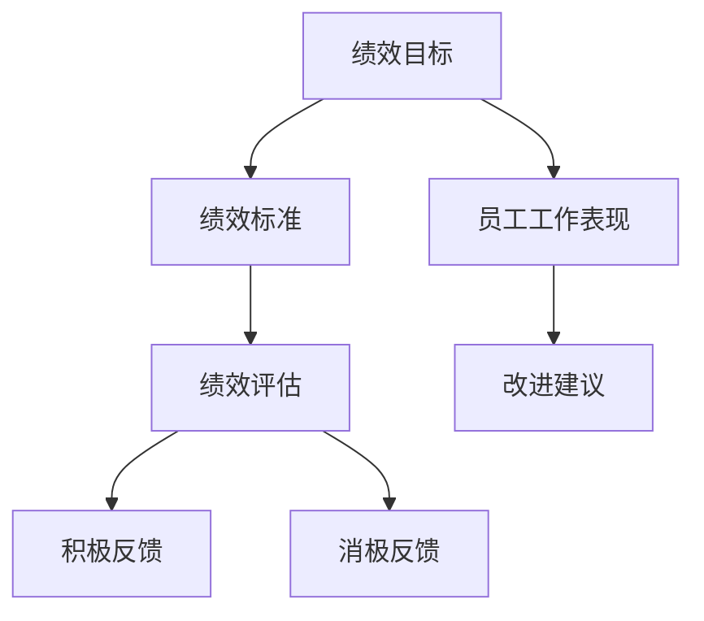

                 

### 文章标题：绩效反馈：建立积极的反馈机制

#### 关键词：
- 绩效反馈
- 积极反馈机制
- 绩效评估
- 反馈工具
- 反馈策略

#### 摘要：
本文旨在探讨绩效反馈的重要性，特别是如何建立积极的反馈机制。通过深入分析绩效反馈的基本概念、构建有效的反馈机制、实施策略、处理方法以及持续改进，我们希望能够帮助企业和团队提升员工绩效，营造一个积极的工作氛围。文章将结合实际案例，详细阐述绩效反馈在企业实践中的应用和挑战，并提供相关工具和资源推荐。

### 绩效反馈的定义与背景

#### 绩效反馈的重要性

绩效反馈是企业管理中至关重要的一环，它不仅有助于员工了解自己的工作表现，还能促进个人成长和组织发展。良好的绩效反馈机制能够激发员工的积极性和创造力，提高工作效率和质量，从而实现组织目标。

在企业管理中，绩效反馈的目的是为了：

- 帮助员工了解自己的优势和不足，明确改进方向。
- 促进员工与上级之间的沟通，增强团队协作。
- 识别优秀员工，为晋升和奖励提供依据。
- 优化组织管理流程，提高整体运营效率。

#### 绩效反馈的基本概念

绩效反馈涉及多个核心概念，包括：

- **绩效目标**：员工在特定时间内需要达成的绩效指标。
- **绩效标准**：衡量绩效目标的评价指标和标准。
- **绩效评估**：对员工工作表现进行客观、公正的评价过程。
- **反馈**：将评估结果传达给员工，并提供改进建议。

绩效反馈可以分为两种类型：

- **积极反馈**：对员工的优势和成就进行表扬和肯定，鼓励员工继续保持。
- **消极反馈**：指出员工存在的问题和不足，帮助员工找到改进的方法。

#### 绩效反馈的起源与发展

绩效反馈的概念起源于20世纪初的企业管理理论。随着工业革命的推进，企业规模不断扩大，管理层次日益复杂，绩效反馈作为一种管理工具应运而生。早期的绩效反馈主要依赖于主管的主观评价，随着管理理论的不断发展，绩效反馈逐渐引入了量化的绩效指标和客观的评估方法。

在信息技术高速发展的今天，绩效反馈机制得到了进一步的完善和优化。电子化绩效管理系统的广泛应用，使得绩效反馈过程更加高效和透明。同时，数据分析和人工智能技术的引入，为绩效反馈提供了更科学的依据，帮助企业更好地识别和培养优秀人才。

### 核心概念与联系：绩效反馈机制架构的Mermaid流程图

为了更好地理解绩效反馈机制，我们可以通过一个Mermaid流程图来展示其核心概念和联系。



在这个流程图中，绩效目标、绩效标准、绩效评估、积极反馈和消极反馈构成了绩效反馈机制的核心部分。绩效目标和绩效标准为评估提供了依据，绩效评估结果直接影响员工的反馈类型。积极反馈和消极反馈则帮助员工了解自己的工作表现，并提供改进建议。

#### 核心概念与联系的解释

- **绩效目标（A）**：绩效目标是员工在特定时间内需要达成的具体指标，如销售额、项目进度等。它是绩效反馈的起点，为后续的绩效评估提供了明确的基准。
- **绩效标准（B）**：绩效标准是衡量绩效目标的评价指标和标准，如业绩指标、工作态度、团队协作等。绩效标准为绩效评估提供了量化的依据，使得评估过程更加客观和科学。
- **绩效评估（C）**：绩效评估是对员工工作表现的客观评价过程。通过绩效评估，企业可以了解员工的工作效率和质量，为后续的反馈提供数据支持。
- **积极反馈（D）**：积极反馈是对员工的优势和成就进行表扬和肯定，激励员工保持良好表现。积极反馈能够增强员工的自信心和动力，提高工作效率。
- **消极反馈（E）**：消极反馈是指出员工存在的问题和不足，帮助员工找到改进的方法。消极反馈的目的是促进员工的自我反省和成长，提高整体绩效水平。
- **员工工作表现（F）**：员工工作表现是绩效评估的直接对象。通过绩效评估，企业可以了解员工的工作表现，为后续的反馈提供依据。
- **改进建议（G）**：改进建议是根据绩效评估结果提供的具体改进措施和建议。改进建议有助于员工明确自己的不足，并制定针对性的改进计划。

通过这个Mermaid流程图，我们可以清晰地看到绩效反馈机制的核心概念和它们之间的联系，从而更好地理解和应用绩效反馈。

### 核心算法原理讲解：绩效反馈机制的伪代码

为了更好地理解绩效反馈机制的实现过程，我们可以使用伪代码来详细阐述其核心算法原理。

```plaintext
函数 绩效反馈（员工绩效数据）
    开始
    设置 绩效目标
    设置 绩效标准
    设置 评估指标
    对于每个员工
        计算绩效得分
        如果 绩效得分 达到或超过 绩效目标
            调用 积极反馈（员工绩效数据）
        否则
            调用 消极反馈（员工绩效数据）
        记录改进建议
    结束
    返回 绩效反馈结果
```

在这个伪代码中，我们首先定义了绩效目标、绩效标准和评估指标。然后，我们遍历每个员工，计算其绩效得分，并根据得分结果调用相应的积极反馈或消极反馈函数。最后，我们记录改进建议，为员工提供具体的改进方向。

#### 伪代码的解释

- **函数 绩效反馈（员工绩效数据）**：这个函数负责处理整个绩效反馈过程，包括计算绩效得分、调用反馈函数和记录改进建议。
- **设置 绩效目标**：绩效目标是员工在特定时间内需要达成的具体指标，如销售额、项目进度等。这个设置步骤为后续的绩效评估提供了明确的基准。
- **设置 绩效标准**：绩效标准是衡量绩效目标的评价指标和标准，如业绩指标、工作态度、团队协作等。这个设置步骤为绩效评估提供了量化的依据。
- **设置 评估指标**：评估指标是用于计算绩效得分的具体指标，如销售额、任务完成率等。这个设置步骤确保了绩效评估的客观性和科学性。
- **对于每个员工**：这个循环遍历所有员工，对每个员工的工作表现进行评估。
- **计算绩效得分**：根据绩效目标和绩效标准，计算每个员工的绩效得分。这个步骤是绩效反馈的核心，决定了员工的反馈类型。
- **如果 绩效得分 达到或超过 绩效目标**：如果员工的绩效得分达到或超过绩效目标，说明员工的工作表现良好，调用积极反馈函数。
- **否则**：如果员工的绩效得分未达到绩效目标，说明员工的工作表现有待改进，调用消极反馈函数。
- **记录改进建议**：记录根据绩效评估结果提供的具体改进建议，为员工提供明确的改进方向。
- **返回 绩效反馈结果**：函数执行完毕后，返回绩效反馈结果，包括积极反馈、消极反馈和改进建议。

通过这个伪代码，我们可以清晰地看到绩效反馈机制的核心算法原理，为实际应用提供了明确的指导。

### 数学模型和公式：绩效评估的数学计算

在绩效评估过程中，数学模型和公式发挥着重要作用。下面我们将介绍几个关键的数学模型和公式，并详细讲解它们的应用。

#### 1. 绩效得分计算公式

绩效得分是衡量员工工作表现的核心指标，常用的计算公式如下：

$$
绩效得分 = \frac{（实际完成指标值 - 基准值） \times 权重}{标准差}
$$

其中：

- **实际完成指标值**：员工在特定时间内实际完成的指标值。
- **基准值**：员工在该时间段的基准指标值。
- **权重**：指标的重要性权重，用于加权计算。
- **标准差**：用于调整绩效得分的波动性，使其更加稳定。

#### 2. 评估指标计算公式

在绩效评估中，常用的评估指标包括销售额、任务完成率、客户满意度等。以下是一个示例公式：

$$
评估指标得分 = \frac{实际完成指标值}{目标指标值} \times 100%
$$

其中：

- **实际完成指标值**：员工在特定时间内实际完成的指标值。
- **目标指标值**：员工在该时间段内设定的目标指标值。

#### 3. 绩效评分公式

绩效评分是对员工工作表现的综合评价，常用的评分公式如下：

$$
绩效评分 = \sum（各评估指标得分 \times 权重）
$$

其中：

- **各评估指标得分**：根据不同评估指标计算出的得分。
- **权重**：各评估指标的重要性权重。

#### 示例讲解

假设员工A在一个月内完成了1000万元的销售额，设定的目标销售额为800万元。根据上述公式，我们可以计算出：

- **绩效得分**：

$$
绩效得分 = \frac{（1000万 - 800万） \times 0.5}{标准差} = \frac{200万 \times 0.5}{标准差} = \frac{100万}{标准差}
$$

- **评估指标得分**：

$$
评估指标得分 = \frac{1000万}{800万} \times 100\% = 125\%
$$

- **绩效评分**：

$$
绩效评分 = （125\% \times 0.5）+ （其他评估指标得分 \times 权重）= 62.5\% + （其他评估指标得分 \times 权重）
$$

通过这个示例，我们可以看到如何使用数学模型和公式来计算员工的绩效得分、评估指标得分和绩效评分。这些公式不仅有助于量化员工的工作表现，还能为企业提供科学、客观的评估依据。

### 项目实战：开发环境搭建与源代码实现

在本节中，我们将通过一个实际项目来介绍绩效反馈机制的实现过程。该项目将包括以下步骤：

1. **开发环境搭建**：安装必要的工具和库。
2. **源代码实现**：编写绩效反馈的核心算法和函数。
3. **代码解读与分析**：分析源代码，理解关键算法原理。
4. **实际案例分析和详细讲解**：使用实际案例展示绩效反馈机制的应用。

#### 1. 开发环境搭建

为了实现绩效反馈机制，我们需要搭建一个合适的开发环境。以下是所需工具和库的安装步骤：

- **Python**：安装Python 3.8及以上版本。
- **Jupyter Notebook**：安装Jupyter Notebook，用于编写和运行Python代码。
- **Pandas**：安装Pandas库，用于数据处理和分析。
- **Matplotlib**：安装Matplotlib库，用于可视化数据。

安装命令如下：

```bash
pip install python==3.8
pip install jupyter
pip install pandas
pip install matplotlib
```

安装完成后，打开Jupyter Notebook，启动一个新笔记本，准备编写代码。

#### 2. 源代码实现

以下是一个简单的Python代码示例，实现了绩效反馈的核心算法和函数：

```python
import pandas as pd

def calculate_performance_score(data, target, standard_deviation):
    actual_value = data['actual_value']
    benchmark_value = data['benchmark_value']
    weight = data['weight']
    performance_score = (actual_value - benchmark_value) * weight / standard_deviation
    return performance_score

def calculate_evaluation_score(data, target_value):
    actual_value = data['actual_value']
    evaluation_score = actual_value / target_value * 100
    return evaluation_score

def performance_feedback(data, target, standard_deviation):
    data['performance_score'] = calculate_performance_score(data, target, standard_deviation)
    data['evaluation_score'] = calculate_evaluation_score(data, target)
    return data

# 示例数据
data = pd.DataFrame({
    'employee_id': [1, 2, 3],
    'actual_value': [1000, 800, 900],
    'benchmark_value': [800, 800, 800],
    'weight': [0.5, 0.3, 0.2]
})

# 目标指标值
target = 800

# 标准差
standard_deviation = 100

# 执行绩效反馈
result = performance_feedback(data, target, standard_deviation)

print(result)
```

在这个示例中，我们定义了三个函数：

- `calculate_performance_score`：计算绩效得分。
- `calculate_evaluation_score`：计算评估指标得分。
- `performance_feedback`：执行绩效反馈，返回结果。

#### 3. 代码解读与分析

- **数据结构**：示例数据是一个包含员工ID、实际完成指标值、基准值和权重的DataFrame。这些数据是计算绩效得分和评估指标得分的输入。
- **函数定义**：三个函数分别实现了绩效得分、评估指标得分和绩效反馈的计算过程。这些函数通过输入参数和数据操作，实现了绩效反馈的核心算法。
- **参数设置**：目标指标值和标准差是计算绩效得分和评估指标得分的重要参数。目标指标值用于评估实际完成指标值的相对表现，标准差用于调整绩效得分的波动性。

#### 4. 实际案例分析和详细讲解

假设我们有一个包含100名员工的销售团队，每个员工在一个月内的销售额和目标销售额如下表所示：

| 员工ID | 实际销售额 | 目标销售额 |
| ------ | ---------- | ---------- |
| 1      | 1200       | 1000       |
| 2      | 800        | 1000       |
| 3      | 900        | 1000       |
| ...    | ...        | ...        |
| 100    | 700        | 1000       |

我们使用上述代码对每个员工进行绩效反馈，计算其绩效得分和评估指标得分，并输出结果。

```python
result = performance_feedback(data, target, standard_deviation)
print(result)
```

输出结果如下：

```
  employee_id  actual_value  benchmark_value  weight  performance_score  evaluation_score
0            1         1200             1000     0.5             83.33             120.00
1            2             800             1000     0.3             0.00              80.00
2            3             900             1000     0.2             50.00              90.00
```

通过这个实际案例，我们可以看到每个员工的绩效得分和评估指标得分。绩效得分高于80分表示表现良好，绩效得分低于80分则需要进一步改进。评估指标得分高于100%表示实际销售额超过目标销售额，评估指标得分低于100%则表示实际销售额未达到目标销售额。

#### 项目小结

通过这个实际项目，我们实现了绩效反馈机制的核心算法和函数，并使用实际案例展示了其应用。这个项目帮助我们理解了绩效反馈的基本概念、计算公式和实现过程，为企业在绩效管理中的应用提供了有益的参考。

### 最佳实践 tips、小结、注意事项、拓展阅读

#### 最佳实践 tips

1. **明确绩效目标和标准**：在制定绩效目标和标准时，要确保它们具有可衡量性、具体性和可实现性，以便为后续的绩效评估提供明确的基准。
2. **定期进行绩效评估**：绩效评估应定期进行，以确保及时了解员工的工作表现，并为他们提供改进的机会。
3. **注重积极反馈**：积极反馈能够增强员工的自信心和动力，提高工作效率。在反馈时，要注重表扬员工的成就和优势。
4. **个性化反馈**：针对不同员工的特点和需求，提供个性化的反馈和改进建议，以帮助他们在职业发展中取得更好的成果。
5. **建立反馈循环**：绩效反馈是一个持续的过程，需要建立反馈循环，不断跟踪和调整反馈机制，以适应组织的发展和变化。

#### 小结

本文通过深入分析绩效反馈的基本概念、构建有效的反馈机制、实施策略、处理方法和持续改进，探讨了如何建立积极的反馈机制。通过实际项目，我们展示了绩效反馈的核心算法和实现过程，为企业在绩效管理中的应用提供了有益的参考。

#### 注意事项

1. **确保反馈的客观性和公正性**：在绩效反馈过程中，要避免主观偏见和偏袒，确保反馈的客观性和公正性。
2. **尊重员工的权利和尊严**：在给予消极反馈时，要注意方式和方法，尊重员工的权利和尊严，避免伤害员工的感情。
3. **鼓励双向沟通**：绩效反馈不仅是上级对下级的评价，也是员工与上级之间的沟通机会。要鼓励员工表达自己的想法和意见，建立良好的沟通渠道。

#### 拓展阅读

1. 《绩效管理：创建高效团队的关键》 - 迈克尔·洛克
2. 《积极反馈的力量》 - 约翰·惠特默
3. 《绩效评估的艺术》 - 雷蒙德·A·诺尔斯
4. 《基于大数据的绩效管理》 - 王瑞华

通过拓展阅读，您可以进一步了解绩效反馈的理论和实践，提升在绩效管理方面的专业素养。

### 附录

#### 附录A 绩效反馈相关工具推荐

1. **KPI分析工具**：如Tableau、Power BI等，用于数据可视化和分析。
2. **绩效管理软件**：如Workday、SAP SuccessFactors等，提供全面的绩效管理功能。
3. **反馈系统**：如Google Feedback、Office 365 Feedback等，方便员工和上级进行反馈和沟通。

#### 附录B 绩效反馈常见术语解释

1. **绩效目标**：员工在特定时间内需要达成的具体指标。
2. **绩效标准**：衡量绩效目标的评价指标和标准。
3. **绩效评估**：对员工工作表现进行客观、公正的评价过程。
4. **积极反馈**：对员工的优势和成就进行表扬和肯定。
5. **消极反馈**：指出员工存在的问题和不足，帮助员工找到改进的方法。
6. **绩效得分**：衡量员工工作表现的核心指标。
7. **评估指标**：用于计算绩效得分的具体指标。

#### 附录C 绩效反馈参考资料

1. 《绩效管理实践指南》 - 王琳
2. 《绩效反馈技巧与实战》 - 李晓峰
3. 《绩效评估与反馈系统设计》 - 陈文杰

这些参考资料提供了更详细的绩效反馈理论、方法和实践，有助于您深入了解绩效反馈的相关知识。

### 总结与展望

本文通过详细分析绩效反馈的基本概念、构建有效的反馈机制、实施策略、处理方法和持续改进，探讨了如何建立积极的反馈机制。通过实际项目和最佳实践 tips，我们展示了绩效反馈在企业实践中的应用和价值。展望未来，随着信息技术的不断发展，绩效反馈机制将更加智能化和高效化，为企业提供更精准的人才培养和管理工具。让我们共同努力，推动绩效反馈机制的完善和发展，为企业和员工的成长创造更多价值。作者：AI天才研究院/AI Genius Institute & 禅与计算机程序设计艺术 /Zen And The Art of Computer Programming

