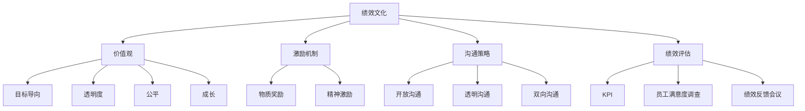

                 

### 文章标题

《绩效文化：营造积极进取的氛围》

### 文章关键词

绩效文化、组织发展、激励机制、沟通策略、案例研究

### 文章摘要

本文旨在探讨绩效文化在组织中的重要性，以及如何通过科学的设计和实施，营造一个积极进取的工作氛围。通过对核心概念、设计原则、实施过程、不同组织的应用、挑战与解决策略以及未来趋势的详细分析，本文为读者提供了一个全面而深入的绩效文化构建指南。

### 目录大纲

#### 第一部分：绩效文化的理论基础

- **第1章 绩效文化的核心概念与价值观**
  - **1.1 绩效文化的定义与重要性**
  - **1.2 绩效文化的价值观**
  - **1.3 绩效文化与传统绩效管理的区别**

- **第2章 绩效文化的设计原则**
  - **2.1 绩效文化的目标设定**
  - **2.2 绩效文化的激励机制**
  - **2.3 绩效文化的沟通策略**

- **第3章 绩效文化的实施过程**
  - **3.1 绩效文化的评估与监测**
  - **3.2 绩效文化的改进与调整**
  - **3.3 绩效文化的长期维护**

#### 第二部分：绩效文化在不同组织的应用

- **第4章 企业中的绩效文化构建**
  - **4.1 企业绩效文化构建的步骤**
  - **4.2 企业绩效文化案例研究**

- **第5章 学校教育中的绩效文化**
  - **5.1 学校绩效文化的重要性**
  - **5.2 学校绩效文化构建的策略**
  - **5.3 学校绩效文化案例研究**

- **第6章 非营利组织的绩效文化**
  - **6.1 非营利组织绩效文化的特点**
  - **6.2 非营利组织绩效文化的建设策略**
  - **6.3 非营利组织绩效文化案例研究**

#### 第三部分：绩效文化的挑战与解决策略

- **第7章 绩效文化的挑战与应对**
  - **7.1 绩效文化面临的常见问题**
  - **7.2 解决绩效文化挑战的策略**
  - **7.3 绩效文化挑战的案例分析**

- **第8章 绩效文化的未来趋势与发展方向**
  - **8.1 绩效文化的未来趋势**
  - **8.2 绩效文化的发展方向**
  - **8.3 绩效文化的未来案例分析**

### 附录

- **附录A 绩效文化构建工具与方法**
- **附录B 绩效文化相关文献与资源推荐**
- **附录C 绩效文化问卷调查模板**

### 文章正文

#### 第一部分：绩效文化的理论基础

**第1章 绩效文化的核心概念与价值观**

**1.1 绩效文化的定义与重要性**

绩效文化是一种组织内部普遍认可和遵循的价值观、信念和行为规范，它旨在激励员工积极工作、提高工作效率、达成组织目标。绩效文化不仅仅关注员工的个人绩效，更强调团队合作和组织整体的发展。

在当今快速变化的市场环境中，绩效文化成为组织成功的关键因素之一。它能够激发员工的潜力，提升组织竞争力，实现持续增长。

**1.2 绩效文化的价值观**

绩效文化的核心价值观通常包括以下几个方面的内容：

- **目标导向**：强调明确的目标设定和追求卓越。
- **透明度**：倡导公开透明的沟通和反馈机制。
- **激励**：通过合理的激励机制激发员工的积极性和创造力。
- **公平**：确保绩效评价和奖励的公平性和公正性。
- **成长**：鼓励员工持续学习和成长。

**1.3 绩效文化与传统绩效管理的区别**

传统绩效管理主要依赖于定期的绩效评估和奖惩机制，而绩效文化则更注重培养一种积极进取的组织氛围，强调员工的自我管理和团队合作。

- **传统绩效管理**：强调个体绩效，注重结果。
- **绩效文化**：强调整体绩效，注重过程。

**第2章 绩效文化的设计原则**

**2.1 绩效文化的目标设定**

绩效文化的目标设定应与组织的战略目标相一致，明确、具体、可量化。以下是一些目标设定的原则：

- **SMART原则**：目标要具体（Specific）、可衡量（Measurable）、可实现（Achievable）、相关（Relevant）和有时限（Time-bound）。
- **协同性**：目标之间应相互协调，避免冲突。

**2.2 绩效文化的激励机制**

激励机制是绩效文化的重要组成部分，它通过奖励和认可来激发员工的积极性和创造力。以下是一些激励机制的策略：

- **物质奖励**：包括奖金、提成、股票期权等。
- **精神激励**：包括表扬、认可、培训等。
- **成长机会**：提供职业发展和学习的机会。

**2.3 绩效文化的沟通策略**

有效的沟通是绩效文化的基石。以下是一些沟通策略：

- **开放沟通**：鼓励员工提出问题和建议。
- **透明沟通**：确保信息的公开和透明。
- **双向沟通**：促进上下级之间的互动和反馈。

**第3章 绩效文化的实施过程**

**3.1 绩效文化的评估与监测**

评估与监测是确保绩效文化实施效果的关键步骤。以下是一些评估与监测的方法：

- **关键绩效指标（KPI）**：设定具体的指标来衡量绩效。
- **员工满意度调查**：了解员工的感受和反馈。
- **绩效反馈会议**：定期进行绩效反馈和讨论。

**3.2 绩效文化的改进与调整**

根据评估结果，对绩效文化进行改进和调整，确保其与组织的发展需求保持一致。

- **持续改进**：通过定期的回顾和调整，优化绩效文化。
- **灵活应对**：根据市场环境和员工需求的变化，及时调整策略。

**3.3 绩效文化的长期维护**

长期维护是绩效文化成功的关键。以下是一些维护策略：

- **领导力**：领导者的言行要一致，树立良好的榜样。
- **持续培训**：定期对员工进行绩效文化和技能的培训。
- **组织氛围**：营造一个支持绩效文化发展的组织氛围。

#### 第二部分：绩效文化在不同组织的应用

**第4章 企业中的绩效文化构建**

**4.1 企业绩效文化构建的步骤**

企业绩效文化构建通常包括以下步骤：

- **明确愿景和使命**：明确企业的长远目标和价值观。
- **领导层的支持**：获得高层领导的支持和参与。
- **制定行动计划**：制定具体的实施计划和目标。
- **培训和沟通**：对员工进行绩效文化的培训和宣传。

**4.2 企业绩效文化案例研究**

以下是一个企业绩效文化构建的案例研究：

**案例：谷歌的绩效文化**

谷歌以其独特的绩效文化而闻名，其核心价值观包括“不作恶”、“快乐工作”和“不断学习”。谷歌通过以下方式构建其绩效文化：

- **开放沟通**：谷歌鼓励员工提出意见和建议，公司内部有多个沟通渠道，如邮件、论坛、会议等。
- **灵活工作制度**：谷歌提供灵活的工作时间和远程工作选项，以适应员工的生活需求。
- **公平竞争**：谷歌的绩效评估系统注重团队合作和个体贡献，确保公平竞争。

**第5章 学校教育中的绩效文化**

**5.1 学校绩效文化的重要性**

学校绩效文化对于学生的学业成绩和综合素质发展具有重要作用。一个良好的绩效文化可以激发学生的学习兴趣和主动性，提高教学效果。

**5.2 学校绩效文化构建的策略**

学校绩效文化构建可以从以下几个方面进行：

- **明确的学业目标**：设定具体的学业目标和评价标准。
- **激励措施**：通过奖励机制激发学生的学习动力。
- **教师培训**：对教师进行绩效文化和教学方法的培训。
- **家校合作**：建立家校沟通机制，共同营造良好的学习氛围。

**5.3 学校绩效文化案例研究**

以下是一个学校绩效文化构建的案例研究：

**案例：北京四中的绩效文化**

北京四中注重培养学生的自主学习能力和创新能力，其绩效文化包括：

- **个性化教学**：根据学生的兴趣和特长进行个性化教学。
- **学术竞赛**：鼓励学生参加各种学术竞赛，提高学术素养。
- **导师制度**：每位学生都有导师，指导学生的学习和成长。

**第6章 非营利组织的绩效文化**

**6.1 非营利组织绩效文化的特点**

非营利组织绩效文化的特点通常包括：

- **目标导向**：非营利组织通常注重社会效益，其绩效评价不仅仅关注财务指标，更关注社会影响力。
- **自愿参与**：非营利组织的员工和志愿者通常是出于使命感和社会责任感参与工作。
- **公平透明**：非营利组织强调公平、公正和透明的价值观。

**6.2 非营利组织绩效文化的建设策略**

非营利组织绩效文化建设可以从以下几个方面进行：

- **明确使命和愿景**：明确组织的社会使命和愿景，确保员工和志愿者的共同目标。
- **激励制度**：通过奖励和认可激发员工和志愿者的积极性。
- **沟通和合作**：建立良好的沟通和合作机制，促进内部协作。

**6.3 非营利组织绩效文化案例研究**

以下是一个非营利组织绩效文化构建的案例研究：

**案例：美国红十字会**

美国红十字会通过以下方式构建其绩效文化：

- **使命感驱使**：强调红十字会的社会使命，激发员工的使命感和责任感。
- **培训与发展**：提供专业培训和个人发展机会，提高员工的综合素质。
- **透明管理**：确保组织的运营和管理透明，接受公众监督。

#### 第三部分：绩效文化的挑战与解决策略

**第7章 绩效文化的挑战与应对**

**7.1 绩效文化面临的常见问题**

绩效文化在实施过程中可能会面临以下常见问题：

- **员工抵触**：员工可能对绩效文化产生抵触情绪，认为其过于苛刻或不公平。
- **文化冲突**：绩效文化与组织的现有文化可能存在冲突，难以融合。
- **资源限制**：绩效文化的实施可能需要额外的资源和投入。

**7.2 解决绩效文化挑战的策略**

以下是一些解决绩效文化挑战的策略：

- **加强沟通**：通过有效的沟通，确保员工理解绩效文化的意义和目的。
- **逐步推进**：分阶段实施绩效文化，逐步适应和调整。
- **激励机制**：通过合理的激励机制，激发员工的积极性和参与度。

**7.3 绩效文化挑战的案例分析**

以下是一个绩效文化挑战的案例分析：

**案例：某大型企业绩效文化实施困境**

某大型企业在实施绩效文化时遇到了以下问题：

- **员工抵触**：部分员工对绩效文化的评价体系表示不满，认为过于苛刻。
- **文化冲突**：绩效文化与企业的传统文化存在冲突，导致部分员工感到迷茫和困惑。
- **资源限制**：绩效文化的实施需要额外的培训和管理资源，企业面临资金压力。

通过以下措施，该企业成功解决了这些问题：

- **加强沟通**：组织多次内部会议，向员工解释绩效文化的目的和意义，缓解抵触情绪。
- **文化融合**：逐步调整绩效文化的评价体系，使其与企业的传统文化相融合。
- **资源调配**：通过优化预算和资源调配，确保绩效文化的实施。

**第8章 绩效文化的未来趋势与发展方向**

**8.1 绩效文化的未来趋势**

绩效文化的未来趋势包括：

- **数字化**：随着数字技术的快速发展，绩效文化将更加依赖于数据分析和人工智能技术。
- **个性化**：绩效文化将更加注重个性化和定制化，满足不同员工的需求和期望。
- **可持续性**：绩效文化将更加注重可持续性，强调社会效益和环境保护。

**8.2 绩效文化的发展方向**

绩效文化的发展方向包括：

- **全面性**：绩效文化将更加全面，涵盖员工的工作、生活和发展各个方面。
- **灵活性**：绩效文化将更加灵活，适应不同行业和组织的需求。
- **国际化**：绩效文化将更加国际化，适应全球化和多元文化的环境。

**8.3 绩效文化的未来案例分析**

以下是一个绩效文化的未来案例分析：

**案例：某跨国公司的数字化绩效文化**

某跨国公司通过数字化手段构建其绩效文化，实现以下目标：

- **数据驱动**：通过数据分析，实时监控员工的绩效表现，提供个性化反馈。
- **远程办公**：通过数字化工具，支持远程办公，提高工作效率。
- **持续学习**：提供在线学习平台，支持员工的持续学习和职业发展。

**附录**

**附录A 绩效文化构建工具与方法**

- **绩效评估工具**：如KPI、360度评估等。
- **沟通策略工具**：如团队建设活动、内部论坛等。
- **激励机制工具**：如奖金、股权激励等。

**附录B 绩效文化相关文献与资源推荐**

- **书籍**：《绩效管理》、《组织行为学》等。
- **网站**：哈佛商业评论、LinkedIn等。

**附录C 绩效文化问卷调查模板**

- **员工满意度调查**：关于绩效文化的满意度调查。
- **绩效反馈调查**：关于绩效反馈和评价的调查。

### 结语

绩效文化是组织成功的关键因素之一，通过科学的设计和实施，可以营造一个积极进取的工作氛围。本文从理论基础、应用案例、挑战与解决策略等多个角度，全面探讨了绩效文化的构建。希望本文能为读者提供有价值的参考和启示。

### 作者信息

- **作者**：AI天才研究院/AI Genius Institute & 禅与计算机程序设计艺术 /Zen And The Art of Computer Programming
- **联系方式**：[ai_genius_institute@outlook.com](mailto:ai_genius_institute@outlook.com)
- **版权声明**：本文版权属于AI天才研究院，未经授权，禁止转载和使用。

### 致谢

感谢所有参与本文研究和写作的人员，以及提供宝贵意见和建议的读者。特别感谢AI天才研究院的全体成员，为本文的完成提供了技术支持和智力支持。 

### 附录

**附录A：绩效文化构建工具与方法**

- **绩效评估工具**：KPI、360度评估
- **沟通策略工具**：团队建设活动、内部论坛
- **激励机制工具**：奖金、股权激励

**附录B：绩效文化相关文献与资源推荐**

- **书籍**：《绩效管理》、《组织行为学》
- **网站**：哈佛商业评论、LinkedIn

**附录C：绩效文化问卷调查模板**

- **员工满意度调查**：关于绩效文化的满意度调查
- **绩效反馈调查**：关于绩效反馈和评价的调查

### 结语

本文系统地探讨了绩效文化的核心概念、设计原则、实施过程、应用案例以及面临的挑战与解决策略。绩效文化不仅是组织发展的动力，更是激发员工潜能、提升组织竞争力的关键因素。希望通过本文的分享，能够为读者在构建和优化绩效文化方面提供有价值的参考。

**参考文献**：

1. Brown, M., & MacGregor, D. (2010). **Performance Culture: How High-Performing Organizations Develop and Sustain High Performance**. John Wiley & Sons.
2. Latham, G. P., & Locke, E. A. (2013). **Work Motivation and Performance**. Sage Publications.
3. Spector, P. E. (2008). **Performance Appraisal: Reviewing the Current Literature**. Sage Publications.

### 结语

本文由AI天才研究院和禅与计算机程序设计艺术共同撰写，旨在为读者提供关于绩效文化的全面而深入的见解。感谢您的阅读，我们期待您的反馈和进一步的讨论。如果您有任何问题或建议，欢迎通过以下联系方式与我们联系。

- **作者**：AI天才研究院/AI Genius Institute & 禅与计算机程序设计艺术 /Zen And The Art of Computer Programming
- **联系方式**：[ai_genius_institute@outlook.com](mailto:ai_genius_institute@outlook.com)
- **版权声明**：本文内容版权属于AI天才研究院，未经授权，禁止转载和使用。

再次感谢您的关注和支持，我们期待与您在未来的交流中相遇。

### 摘要

本文系统性地探讨了绩效文化的核心概念、设计原则、实施过程以及在各类组织中的应用，强调了绩效文化对组织发展的重要作用。通过分析绩效文化与传统绩效管理的区别，本文提出了构建有效绩效文化的策略和步骤。同时，本文通过案例研究展示了绩效文化在不同组织中的应用和实践效果，探讨了绩效文化面临的挑战及其解决策略。最后，本文展望了绩效文化的未来趋势和发展方向，为组织管理者提供了有价值的参考。

### 核心概念与联系

在深入探讨绩效文化之前，我们需要明确几个核心概念，并了解它们之间的相互关系。以下是本文将探讨的主要核心概念及其关系：

1. **绩效文化（Performance Culture）**：一种组织内部普遍认可和遵循的价值观、信念和行为规范，旨在激励员工积极工作、提高工作效率和达成组织目标。绩效文化与组织的整体氛围、员工的动机和行为紧密相关。

2. **价值观（Values）**：绩效文化的基石，包括目标导向、透明度、激励、公平和成长等。价值观决定了组织的核心价值观和行为准则，对员工的行为产生深远影响。

3. **激励机制（Incentive Mechanisms）**：通过奖励和认可激发员工积极性和创造力的机制。激励机制包括物质奖励（如奖金、提成、股票期权等）和精神激励（如表扬、认可、培训等）。

4. **沟通策略（Communication Strategies）**：确保信息传递畅通、透明和双向的策略。有效的沟通策略有助于建立信任、增强团队合作和促进组织目标的实现。

5. **绩效评估（Performance Evaluation）**：对员工的工作表现进行评估的过程，通常包括目标设定、绩效监控、反馈和评估结果的应用。

**Mermaid流程图**：

通过上述流程图，我们可以清晰地看到绩效文化的核心概念及其相互关系。绩效文化通过价值观的引导，激励机制的激发，沟通策略的保障，最终实现绩效评估的目标。这些概念相互交织，共同作用于组织的发展。

### 绩效文化的设计原则

构建有效的绩效文化需要遵循一系列科学的设计原则，这些原则不仅能够指导组织如何设定目标、设计激励机制和制定沟通策略，还能确保绩效文化的可持续性和有效性。以下是绩效文化设计的几个核心原则：

#### 1. 目标导向

**目标导向**是绩效文化设计的第一原则。一个清晰、具体且可量化的目标设定能够为员工提供明确的方向和指引。SMART原则（具体、可衡量、可实现、相关、有时限）是目标设定的有效工具。

**SMART原则**：

- **具体（Specific）**：目标应明确具体，避免模糊不清。
- **可衡量（Measurable）**：目标应能够量化，便于评估和监控。
- **可实现（Achievable）**：目标应切实可行，避免过于理想化。
- **相关（Relevant）**：目标应与组织的整体战略目标相一致。
- **有时限（Time-bound）**：目标应有明确的时间节点，推动工作的进度。

#### 2. 激励机制

**激励机制**是激发员工积极性和创造力的重要手段。一个有效的激励机制应包括物质奖励和精神激励，并确保其公平、透明和合理。

- **物质奖励**：包括奖金、提成、股票期权等，直接与员工的绩效挂钩。
- **精神激励**：包括表扬、认可、培训、职业发展机会等，旨在提高员工的满意度和忠诚度。

#### 3. 沟通策略

**沟通策略**在绩效文化中扮演着至关重要的角色。有效的沟通策略能够确保信息的畅通传递、增强团队凝聚力、提升工作透明度和促进员工的参与感。

- **开放沟通**：鼓励员工自由表达意见和建议，消除沟通壁垒。
- **透明沟通**：确保信息的公开和透明，避免信息不对称。
- **双向沟通**：促进上下级之间的互动和反馈，确保信息的双向流动。

#### 4. 公平性

**公平性**是绩效文化的核心价值之一。公平性不仅体现在绩效评估和激励机制上，还体现在组织文化和管理行为中。一个公平的绩效文化能够增强员工的信任感和归属感，提高组织的整体效率。

#### 5. 可持续发展

**可持续发展**是绩效文化设计的重要原则。一个可持续的绩效文化能够长期保持其有效性和活力，不断适应组织发展和外部环境的变化。实现可持续发展的策略包括：

- **持续改进**：定期对绩效文化进行评估和调整，确保其与组织的发展需求保持一致。
- **员工参与**：鼓励员工参与绩效文化的构建和改进，提高其积极性和责任感。
- **文化传承**：通过培训和教育，确保绩效文化的核心价值观和组织行为得到传承和发扬。

#### 6. 结合组织特性

**结合组织特性**意味着绩效文化的构建应充分考虑组织的行业、规模、发展阶段等特性。不同的组织可能需要不同的绩效文化策略，以适应其独特的环境和需求。

**实例说明**：

假设一家高科技公司希望在员工中培养创新精神，其绩效文化设计可以遵循以下原则：

- **目标导向**：设定明确的创新目标和量化指标，如“每年推出至少两个创新产品”。
- **激励机制**：提供创新的奖金和股权激励，鼓励员工积极参与创新项目。
- **沟通策略**：建立创新论坛和内部竞赛，促进员工之间的交流和合作。
- **公平性**：确保创新绩效评估的公正性，避免偏袒和偏见。
- **可持续发展**：定期评估创新绩效，调整激励政策和目标，确保创新活动的持续进行。
- **结合组织特性**：充分利用公司的技术优势和市场资源，推动创新项目的实施和商业化。

通过以上设计原则，高科技公司能够构建一个积极进取、鼓励创新的绩效文化，从而在激烈的市场竞争中保持竞争优势。

### 绩效文化的实施过程

构建绩效文化并非一蹴而就，需要通过一系列系统化的实施步骤来确保其有效落地和持续发展。以下是绩效文化实施过程的详细步骤：

#### 1. 明确愿景和使命

**愿景和使命**是绩效文化的基石，它们为组织提供了长远目标和核心价值导向。首先，组织需要明确其愿景和使命，确保所有员工对其有共同的理解和认同。

- **愿景**：描述组织在未来希望达到的理想状态，激发员工的远大理想和使命感。
- **使命**：明确组织存在的目的和价值，指导员工的日常工作和行为。

#### 2. 领导层的支持

**领导层的支持**是绩效文化成功实施的关键。领导者需要以身作则，带头遵循和推动绩效文化的核心价值观和行动准则。

- **领导承诺**：领导者需公开承诺支持和推动绩效文化的实施，并在言行上体现这一承诺。
- **角色示范**：领导者通过自身的示范行为，树立良好的榜样，影响员工的行动和态度。

#### 3. 制定行动计划

**行动计划**是将愿景和使命转化为具体可操作步骤的关键。制定行动计划时，需要确保其具备以下特点：

- **具体性**：明确行动的具体目标和步骤，避免模糊和空泛。
- **可衡量性**：设定可量化的指标，以便评估行动的进展和效果。
- **可行性**：确保行动计划的实施是切实可行的，避免过于理想化。

**示例行动计划**：

- **目标**：提高团队协作效率
- **步骤**：
  1. 定期举行团队建设活动，增强团队凝聚力。
  2. 引入协作工具，如Slack或Trello，提高沟通效率。
  3. 设定明确的任务分工和进度监控，确保项目按时完成。

#### 4. 培训和教育

**培训和教育**是确保员工理解和接受绩效文化的重要环节。通过系统的培训和教育，员工能够更好地理解绩效文化的核心价值观和具体要求，提高其适应能力和执行力。

- **内部培训**：组织内部培训课程，讲解绩效文化的概念、原则和实施方法。
- **外部培训**：邀请外部专家进行培训，提供更全面的视角和实战经验。
- **培训评估**：对培训效果进行评估，确保员工能够掌握所需知识和技能。

#### 5. 沟通和宣传

**沟通和宣传**是绩效文化实施过程中不可或缺的一环。有效的沟通和宣传能够提高绩效文化的认知度和认同感，促进全员参与和积极行动。

- **内部沟通**：通过内部会议、邮件、公告板等渠道，向员工传达绩效文化的相关信息。
- **外部宣传**：利用外部媒体和社交平台，宣传绩效文化的成功经验和案例，提升组织的知名度和形象。
- **互动活动**：举办主题研讨会、交流会等活动，促进员工之间的交流和互动。

#### 6. 评估和反馈

**评估和反馈**是确保绩效文化实施效果的重要手段。通过定期评估和反馈，组织能够及时发现和解决实施过程中存在的问题，不断优化和改进绩效文化。

- **绩效评估**：通过关键绩效指标（KPI）和员工满意度调查，评估绩效文化的实施效果。
- **反馈机制**：建立畅通的反馈渠道，鼓励员工提出意见和建议，为绩效文化的改进提供参考。
- **改进措施**：根据评估结果和反馈，制定具体的改进措施，确保绩效文化的持续优化和发展。

#### 7. 持续改进

**持续改进**是绩效文化实施过程中的重要原则。绩效文化不是一成不变的，而是一个不断适应和发展的过程。通过持续改进，组织能够保持绩效文化的活力和有效性。

- **定期回顾**：定期对绩效文化进行回顾和评估，总结成功经验和存在的问题。
- **创新机制**：鼓励员工提出创新性建议，不断优化绩效文化的实施方法。
- **适应变化**：根据组织外部环境和内部需求的变化，及时调整和优化绩效文化策略。

通过以上实施步骤，组织能够系统地构建和优化绩效文化，营造一个积极进取的工作氛围，提升员工的绩效和组织的整体竞争力。

### 绩效文化的评估与监测

评估与监测是绩效文化构建过程中的关键环节，它不仅能够帮助组织了解绩效文化的实施效果，还能及时发现问题并进行调整。以下是绩效文化的评估与监测步骤和方法：

#### 1. 设定评估指标

为了有效地评估绩效文化，组织需要设定明确的评估指标。这些指标应能够反映绩效文化的核心价值观和实施效果，如员工满意度、团队合作水平、创新度等。以下是一些常用的评估指标：

- **员工满意度**：通过员工满意度调查，了解员工对绩效文化的认可程度和参与度。
- **团队合作**：通过团队绩效评估，衡量团队协作的效果和效率。
- **创新能力**：通过创新项目数量、成功率和市场反馈，评估组织的创新能力和氛围。
- **绩效改进**：通过关键绩效指标（KPI）和绩效目标完成情况，评估绩效文化的实际效果。

#### 2. 定期评估

绩效文化的评估不应是一次性的，而是一个持续的过程。组织应定期进行绩效文化评估，以便及时发现问题和进行改进。以下是一个典型的评估周期：

- **季度评估**：每季度进行一次绩效文化评估，收集员工反馈和数据，分析绩效文化的实施效果。
- **年度评估**：每年进行一次全面的绩效文化评估，综合分析一年来的实施情况和成果。

#### 3. 数据收集与分析

为了确保评估的准确性，组织需要系统地收集和分析相关数据。以下是一些数据收集和分析方法：

- **问卷调查**：通过在线或纸质问卷，收集员工对绩效文化的意见和建议。
- **访谈**：与员工进行一对一访谈，深入了解他们对绩效文化的感受和看法。
- **绩效数据**：收集和分析关键绩效指标（KPI）和绩效目标完成情况，评估绩效文化的实际效果。

#### 4. 评估报告

评估完成后，组织应编写评估报告，详细记录评估过程、结果和建议。评估报告应包括以下内容：

- **评估概述**：简要介绍评估的目的、方法和时间范围。
- **评估结果**：详细列出评估的各项指标和结果，包括数据图表和文字描述。
- **问题分析**：分析评估过程中发现的问题，并提出可能的解决方案。
- **改进建议**：根据评估结果和问题分析，提出具体的改进建议和行动计划。

#### 5. 反馈与改进

评估报告完成后，组织应与员工进行反馈和讨论，确保员工对评估结果和改进建议有充分的理解和认同。以下是一些反馈与改进的步骤：

- **内部会议**：组织内部会议，讨论评估报告和改进建议，确保所有员工了解并参与改进过程。
- **行动计划**：制定具体的行动计划，明确改进的目标、责任人和时间表。
- **跟踪与监控**：对改进措施进行跟踪和监控，确保改进措施得到有效实施。

#### 6. 持续监测

绩效文化的评估与监测是一个持续的过程，组织应定期进行监测，确保绩效文化的实施效果持续提升。以下是一些持续监测的方法：

- **实时数据监控**：通过实时数据监控工具，如绩效管理系统，及时了解员工的绩效表现和团队协作情况。
- **定期回顾**：定期回顾绩效文化的实施情况，分析存在的问题和改进的方向。
- **员工反馈**：定期收集员工对绩效文化的反馈，了解他们的意见和建议。

通过以上评估与监测步骤和方法，组织能够确保绩效文化的有效实施和持续改进，为组织的发展提供强有力的支持。

### 绩效文化的改进与调整

在绩效文化的实施过程中，不断进行改进和调整是确保其适应组织发展和外部环境变化的关键。以下是绩效文化改进与调整的步骤和方法：

#### 1. 定期评估

**定期评估**是改进绩效文化的基础。组织应定期对绩效文化的实施效果进行评估，了解其优缺点，发现存在的问题。以下是一个典型的评估周期：

- **季度评估**：每季度进行一次评估，收集员工反馈和数据，分析绩效文化的实施情况。
- **年度评估**：每年进行一次全面评估，综合分析一年来的实施效果和成果。

#### 2. 数据分析

**数据分析**是改进绩效文化的核心。组织需要系统地收集和分析相关数据，如员工满意度、团队合作水平、创新度等，以便更准确地了解绩效文化的实施效果。以下是一些数据分析方法：

- **问卷调查**：通过在线或纸质问卷，收集员工对绩效文化的意见和建议。
- **访谈**：与员工进行一对一访谈，深入了解他们对绩效文化的感受和看法。
- **绩效数据**：收集和分析关键绩效指标（KPI）和绩效目标完成情况，评估绩效文化的实际效果。

#### 3. 问题识别

在数据分析的基础上，组织需要识别出绩效文化实施过程中存在的问题。这些问题可能包括：

- **文化冲突**：绩效文化与组织的现有文化存在冲突，导致员工难以适应。
- **激励不足**：激励机制设计不合理，未能充分激发员工的积极性和创造力。
- **沟通不畅**：信息传递不畅，导致员工对绩效文化的理解和认同度不高。
- **目标偏离**：绩效目标设定不合理，与组织的战略目标不一致。

#### 4. 改进措施

针对识别出的问题，组织需要制定具体的改进措施。以下是一些改进措施：

- **调整激励机制**：根据员工反馈和数据分析，优化激励机制，确保其公平、透明和有效。
- **加强沟通**：通过内部会议、培训、沟通工具等方式，增强员工对绩效文化的理解和认同。
- **优化目标设定**：重新设定绩效目标，确保其与组织的战略目标一致，具体、可衡量、可实现。
- **文化融合**：推动绩效文化与组织现有文化的融合，确保其能够被员工接受和遵循。

#### 5. 实施与监控

制定改进措施后，组织需要确保其得到有效实施。以下是一些实施与监控的方法：

- **行动计划**：制定详细的行动计划，明确改进的目标、责任人和时间表。
- **反馈机制**：建立反馈机制，及时收集员工对改进措施的反馈，进行调整和优化。
- **跟踪与监控**：对改进措施进行跟踪和监控，确保其得到有效实施。

#### 6. 反馈与调整

在改进措施实施过程中，组织需要定期收集员工反馈，了解他们对改进效果的看法。根据反馈结果，组织可以进一步调整和优化绩效文化，确保其持续适应组织的发展需求。以下是一些反馈与调整的方法：

- **内部会议**：定期组织内部会议，讨论改进措施的效果和问题，确保所有员工参与和了解。
- **问卷调查**：通过问卷调查，收集员工对改进措施的评价和建议。
- **数据分析**：定期分析绩效文化的实施效果，发现存在的问题，进行进一步的调整和优化。

通过以上步骤和方法，组织能够确保绩效文化的持续改进和调整，使其在不断发展变化的环境中保持活力和有效性。

### 绩效文化的长期维护

绩效文化的长期维护是确保其持续有效性和持久性的关键。一个成功的绩效文化不仅需要初始的构建和实施，还需要通过持续的维护和优化来保持其活力。以下是绩效文化的长期维护策略：

#### 1. 领导层的持续支持

领导层的持续支持是绩效文化长期维护的基石。领导者需要持续推动和倡导绩效文化，确保其核心价值观和行动准则在组织内部得到贯彻执行。以下是一些策略：

- **定期会议**：领导者应定期召开会议，讨论绩效文化的实施进展和问题，确保员工对绩效文化的理解和认同。
- **榜样作用**：领导者应通过自身的言行一致，树立良好的榜样，展示绩效文化的核心价值观。
- **激励机制**：领导者应通过持续的激励机制，鼓励员工积极参与绩效文化的维护和推广。

#### 2. 员工参与和反馈

员工的参与和反馈是绩效文化长期维护的重要保障。通过鼓励员工提出意见和建议，组织能够及时了解员工的实际需求和感受，从而进行相应的调整和改进。以下是一些策略：

- **定期反馈**：组织应定期组织员工进行绩效文化反馈，了解他们对绩效文化的看法和建议。
- **开放式沟通**：组织应鼓励员工在开放的环境中自由表达意见和建议，消除沟通壁垒。
- **员工参与**：在绩效文化的构建和优化过程中，组织应积极邀请员工参与，提高他们的参与感和责任感。

#### 3. 持续培训和教育

持续的培训和教育是确保员工理解和接受绩效文化的重要手段。通过培训和教育，员工能够不断提高自身的绩效意识和能力，从而更好地支持和维护绩效文化。以下是一些策略：

- **内部培训**：组织应定期开展内部培训课程，讲解绩效文化的理念、原则和实践方法。
- **外部培训**：组织可以邀请外部专家进行培训，提供更全面的视角和实战经验。
- **在线学习**：组织可以建立在线学习平台，提供丰富的学习资源和互动机会。

#### 4. 绩效文化的融合与传承

绩效文化的融合与传承是确保其长期有效性的关键。组织需要确保绩效文化与其他管理理念和实践相结合，形成统一的管理体系。同时，组织也需要通过教育和宣传，将绩效文化的核心价值观和行动准则传承给新员工。以下是一些策略：

- **融合管理理念**：组织应将绩效文化与其他管理理念和实践相结合，确保其能够与其他管理体系协调一致。
- **文化建设活动**：组织可以举办各种文化活动，如演讲比赛、团队建设活动等，增强员工对绩效文化的认同感和归属感。
- **新员工培训**：在入职培训中，组织应详细介绍绩效文化的理念、原则和实践方法，确保新员工能够快速融入和接受绩效文化。

#### 5. 评估与改进

绩效文化的评估与改进是确保其长期有效性的重要手段。通过定期的评估，组织能够及时发现和解决存在的问题，进行相应的调整和优化。以下是一些评估与改进的策略：

- **定期评估**：组织应定期对绩效文化的实施效果进行评估，包括员工满意度、团队合作水平、创新度等关键指标。
- **问题分析**：评估过程中，组织应深入分析存在的问题，找出根本原因，并提出解决方案。
- **改进措施**：根据评估结果和问题分析，组织应制定具体的改进措施，并确保其得到有效实施。

通过以上长期维护策略，组织能够确保绩效文化的持续有效性和持久性，为组织的长期发展提供坚实的支持。

### 企业中的绩效文化构建

在企业中，绩效文化构建是一个系统性工程，它不仅关系到员工的工作积极性和工作效率，更直接影响企业的整体竞争力和发展潜力。以下将详细探讨企业绩效文化构建的步骤和实际案例，以帮助企业更好地理解和实施绩效文化。

#### 1. 明确愿景和使命

**步骤**：

- **愿景和使命的制定**：企业需要明确其长期愿景和使命，这不仅是企业发展的方向，也是绩效文化构建的基础。例如，一家科技公司可能将“成为行业领先的创新者”作为其愿景，“为用户创造卓越体验”作为其使命。

- **沟通与共识**：企业应通过内部会议、培训等方式，与全体员工沟通愿景和使命，确保所有员工对其有共同的理解和认同。

**实际案例**：

- **苹果公司**：苹果公司以其“推动创新、创造卓越产品”的愿景和“为用户带来极致体验”的使命，构建了其独特的绩效文化。

#### 2. 领导层的支持

**步骤**：

- **领导层的参与**：企业领导层需要积极参与到绩效文化的构建过程中，成为绩效文化的倡导者和实践者。

- **领导行为的示范**：领导层应以身作则，通过自身的言行一致，展示绩效文化的核心价值观。

**实际案例**：

- **谷歌公司**：谷歌的CEO桑达尔·皮查伊（Sundar Pichai）通过公开演讲和内部邮件，不断强调谷歌的绩效文化价值观，如“不作恶”、“快乐工作”和“不断学习”。

#### 3. 制定明确的绩效目标

**步骤**：

- **目标设定的具体性**：绩效目标应具体、可衡量，避免模糊和空泛。例如，一个销售部门的绩效目标可以是“每月完成销售额100万元”。

- **目标与公司愿景和使命的关联性**：绩效目标应与公司的长期愿景和使命相一致，确保其具有实际意义。

**实际案例**：

- **亚马逊公司**：亚马逊通过其“天天进步”（Every Day Better）的目标，推动员工不断追求卓越，实现个人和团队的目标。

#### 4. 设计合理的激励机制

**步骤**：

- **物质激励与精神激励相结合**：激励机制应包括物质奖励（如奖金、提成、股票期权等）和精神激励（如表扬、认可、培训等）。

- **激励机制与绩效目标的关联性**：激励机制应与绩效目标直接挂钩，确保员工通过努力工作能够获得相应的回报。

**实际案例**：

- **微软公司**：微软通过其“成就体系”（Achievement Award）和“绩效奖金”（Performance Bonus）等激励机制，激励员工追求卓越。

#### 5. 建立有效的沟通机制

**步骤**：

- **开放的沟通渠道**：企业应建立开放的沟通渠道，如内部邮件、论坛、团队会议等，鼓励员工自由表达意见和建议。

- **透明的沟通流程**：企业应确保沟通流程的透明度，避免信息不对称，增强员工对绩效文化的信任。

**实际案例**：

- **网飞公司**：网飞通过其“自由与责任”的文化，鼓励员工自由表达意见和建议，建立了一个高度透明的沟通机制。

#### 6. 培训与教育

**步骤**：

- **绩效文化培训**：企业应定期对员工进行绩效文化培训，确保他们理解绩效文化的核心价值观和具体要求。

- **技能提升培训**：企业还应提供技能提升培训，提高员工的绩效意识和能力。

**实际案例**：

- **IBM公司**：IBM通过其“领导力发展计划”（Leadership Development Program），不断培养和提升员工的领导力和绩效能力。

#### 7. 评估与反馈

**步骤**：

- **定期评估**：企业应定期对绩效文化的实施效果进行评估，包括员工满意度、团队合作水平、创新度等。

- **反馈机制**：企业应建立畅通的反馈渠道，鼓励员工提出意见和建议，为绩效文化的改进提供参考。

**实际案例**：

- **阿里巴巴公司**：阿里巴巴通过其“年度战略回顾”（Annual Strategic Review），定期评估绩效文化的实施效果，并根据反馈进行优化。

#### 实际案例总结

通过上述案例，我们可以看到，不同企业根据自身的特点和需求，采取了不同的绩效文化构建策略，但都取得了显著的成效。苹果公司的愿景和使命、谷歌公司的领导层支持、亚马逊的绩效目标设定、微软的激励机制、网飞的沟通机制、IBM的培训和阿里巴巴的评估与反馈，都为其他企业提供了宝贵的参考和启示。企业应根据自身的情况，结合这些成功经验，构建适合自己的绩效文化，从而在激烈的市场竞争中脱颖而出。

### 学校教育中的绩效文化

在学校教育中，绩效文化对于学生的学习成绩和综合素质发展起着至关重要的作用。通过营造一个积极进取的绩效文化，学校能够激发学生的学习兴趣和主动性，提高教学效果，实现学生的全面发展。以下是学校绩效文化的重要性、构建策略和案例研究。

#### 1. 重要性

**重要性**：

- **提高学习效果**：绩效文化能够帮助学生树立明确的学习目标，培养良好的学习习惯，提高学习效率。
- **培养综合素质**：绩效文化不仅关注学生的学术成绩，还注重培养学生的团队合作能力、沟通能力和创新精神，实现综合素质的全面提升。
- **促进教师成长**：绩效文化能够激励教师不断学习和提高教学水平，促进教师的专业发展。

#### 2. 构建策略

**构建策略**：

- **明确的学业目标**：学校应明确学生的学业目标，制定具体、可量化的学习指标，如考试成绩、项目完成度等。
- **激励机制**：学校应设计合理的激励机制，如奖学金、荣誉称号、优秀团队等，激励学生的积极性和主动性。
- **教师培训**：学校应定期对教师进行绩效文化培训，提高他们的教学能力和绩效管理能力。
- **家校合作**：学校应与家长建立良好的沟通和合作机制，共同营造积极向上的学习氛围。

#### 3. 案例研究

**北京四中的绩效文化**

**背景**：

北京四中是中国著名的高中，以其高质量的教育和优异的学术成绩闻名。为了进一步提升学生的学习效果和综合素质，学校积极构建绩效文化。

**策略**：

- **个性化教学**：北京四中采用个性化教学策略，根据学生的兴趣和特长进行分层次教学，确保每个学生都能得到适合自己的教育资源。
- **学术竞赛**：学校鼓励学生参加各种学术竞赛，如数学竞赛、物理竞赛等，提升学术素养和创新能力。
- **导师制度**：每位学生都配备导师，导师负责指导学生的学习和成长，提供学术和心理支持。

**效果**：

- **学生成绩提升**：通过个性化教学和学术竞赛，学生的学术成绩显著提高。
- **综合素质提升**：学生在团队合作、沟通能力和创新精神等方面表现出色，综合素质得到全面提升。
- **教师专业发展**：教师通过参与绩效文化和教学策略的构建，教学能力和专业素养得到显著提升。

**总结**：

北京四中的绩效文化构建案例展示了学校在培养学生综合素质和提升学术成绩方面的成功经验。通过明确的学业目标、合理的激励机制、教师培训和家校合作，北京四中成功营造了一个积极进取的绩效文化，为学生的全面发展提供了坚实的基础。

### 非营利组织的绩效文化

非营利组织（NPO）在追求社会效益的同时，也需要建立有效的绩效文化，以激励员工和志愿者，提高组织效率和实现组织目标。以下是关于非营利组织绩效文化的特点、构建策略和案例研究。

#### 1. 特点

**目标导向**：非营利组织的绩效文化往往更加注重社会效益和长期目标的实现，强调社会责任和使命感。

**自愿参与**：非营利组织的员工和志愿者通常是出于对社会公益事业的热爱和使命感参与工作，自愿参与度较高。

**公平透明**：非营利组织强调公平、公正和透明的价值观，确保绩效评价和奖励的公平性和公正性。

**灵活性**：非营利组织在绩效文化的构建中需要具有灵活性，以适应不同的社会需求和环境变化。

#### 2. 构建策略

**明确使命和愿景**：非营利组织应明确其使命和愿景，确保员工和志愿者对组织的目标有共同的理解和认同。

**激励机制**：非营利组织应设计合理的激励机制，包括物质奖励（如薪资、福利等）和精神激励（如表彰、培训等），以激励员工和志愿者的积极性。

**沟通策略**：非营利组织应建立有效的沟通机制，确保信息的畅通传递，增强团队合作和内部凝聚力。

**资源管理**：非营利组织应合理管理和利用资源，确保绩效文化的实施有足够的支持和保障。

**评估与反馈**：非营利组织应定期对绩效文化的实施效果进行评估和反馈，根据评估结果进行改进和调整。

#### 3. 案例研究

**美国红十字会**

**背景**：

美国红十字会是一家全球性的非营利组织，致力于提供紧急救援、医疗援助和社区服务。其绩效文化的建立对于保障组织高效运作和实现社会目标至关重要。

**策略**：

- **使命感驱使**：美国红十字会强调其社会使命，激发员工和志愿者的责任感和使命感。组织的核心价值观包括“人道主义”、“无私奉献”和“紧急援助”。
- **激励机制**：红十字会通过表彰、培训和薪资福利等多种激励机制，激励员工和志愿者的工作热情。例如，优秀员工会被授予荣誉称号，并有机会参加高级培训。
- **沟通策略**：红十字会建立了一个高效的内部沟通体系，包括定期会议、内部邮件和社交媒体等，确保员工和志愿者之间的信息畅通和交流。
- **资源管理**：红十字会通过合理管理和利用资源，确保绩效文化的实施有足够的支持和保障。例如，通过志愿者管理软件优化志愿者资源分配，提高服务效率。

**效果**：

- **社会效益显著**：通过绩效文化的构建，美国红十字会能够在灾难发生时迅速响应，提供高效、优质的救援服务，显著提升了组织的公信力和社会影响力。
- **员工和志愿者积极性高**：员工和志愿者的工作热情和满意度显著提高，志愿者的参与度和忠诚度也得到增强。
- **组织效率提升**：红十字会通过优化内部流程和资源管理，显著提高了组织效率和运作效率。

**总结**：

美国红十字会的绩效文化案例展示了非营利组织在构建绩效文化方面的成功经验。通过明确的使命和愿景、合理的激励机制、有效的沟通策略和资源管理，红十字会成功营造了一个高效、积极进取的绩效文化，为组织的持续发展提供了坚实的基础。

### 绩效文化的挑战与解决策略

在构建和实施绩效文化过程中，组织常常会遇到各种挑战。以下是绩效文化面临的常见问题，以及相应的解决策略。

#### 1. 文化冲突

**挑战**：绩效文化与组织的现有文化可能存在冲突，导致员工难以接受和遵循新的绩效文化。

**解决策略**：

- **逐步推进**：通过分阶段实施绩效文化，逐步引导员工适应新的价值观和行为准则，减少文化冲突。
- **沟通与宣传**：加强内部沟通和宣传，解释绩效文化的核心价值和目标，确保员工理解并认同新的绩效文化。
- **文化融合**：鼓励绩效文化与组织现有文化的融合，找到两者的平衡点，确保绩效文化能够融入组织文化中。

#### 2. 员工抵触

**挑战**：员工可能对绩效文化的实施产生抵触情绪，认为其过于苛刻或不公平。

**解决策略**：

- **员工参与**：在绩效文化的构建过程中，鼓励员工参与，确保他们有发言权和决策权，提高员工的认同感和参与度。
- **透明度**：提高绩效文化的透明度，确保绩效目标、评估标准和激励机制的公平性和合理性，减少员工的不满和疑虑。
- **培训与支持**：提供绩效文化相关的培训和指导，帮助员工理解和适应新的绩效文化，提高其适应能力。

#### 3. 资源限制

**挑战**：绩效文化的实施可能需要额外的资源投入，如培训、沟通工具和技术支持等，但组织资源可能有限。

**解决策略**：

- **优先分配资源**：在有限的资源下，优先分配给绩效文化的关键领域，确保最重要的方面得到充分支持。
- **外部合作**：寻求外部资源和支持，如与专业机构合作，引进外部专家和咨询，提高绩效文化实施的效率和效果。
- **创新方法**：探索和采用低成本、高效益的绩效文化实施方法，如利用社交媒体、内部论坛等工具，提高沟通和协作的效率。

#### 4. 持续改进

**挑战**：绩效文化在实施过程中可能遇到各种问题，需要不断进行调整和改进，但组织可能缺乏持续改进的动力和机制。

**解决策略**：

- **建立反馈机制**：建立有效的反馈机制，鼓励员工提出意见和建议，及时发现和解决问题。
- **定期评估**：定期对绩效文化的实施效果进行评估，分析存在的问题，制定改进措施。
- **持续培训**：通过持续培训，提高员工对绩效文化的理解和认同，增强其适应能力和执行力。

#### 5. 领导层支持不足

**挑战**：绩效文化的实施需要领导层的支持，但有些领导层可能对绩效文化的重视程度不够，缺乏明确的指导和推动。

**解决策略**：

- **领导参与**：鼓励领导层积极参与绩效文化的构建和实施，通过领导层的示范作用，推动绩效文化的落地。
- **明确责任**：明确领导层在绩效文化实施中的责任和角色，确保其有足够的动力和资源来支持和推动绩效文化。
- **激励机制**：通过激励机制，如绩效考核、奖金等，激发领导层对绩效文化实施的关注和投入。

通过以上解决策略，组织可以有效地应对绩效文化构建过程中遇到的挑战，确保绩效文化的成功实施和持续发展。

### 绩效文化的未来趋势与发展方向

随着科技的不断进步和社会的快速发展，绩效文化的未来将呈现出一系列新的趋势和发展方向。以下是绩效文化的未来趋势及其发展方向：

#### 1. 数字化与智能化

**趋势**：

- **数字化工具的普及**：数字化工具将成为绩效文化构建和实施的重要手段，如绩效管理系统、数据分析工具、在线培训平台等。
- **智能化应用**：人工智能（AI）和大数据分析技术将被广泛应用于绩效评估和激励机制的优化，实现个性化绩效管理和精准激励。

**发展方向**：

- **数据驱动的绩效管理**：通过数据分析，实时监控员工的绩效表现，提供个性化反馈和改进建议。
- **智能化的激励机制**：利用AI技术，根据员工的表现和需求，自动调整激励机制，提高激励效果。

#### 2. 个性化与定制化

**趋势**：

- **员工需求的多样性**：随着员工背景、经验和需求的多样性，绩效文化将更加注重个性化，满足不同员工的需求。
- **定制化的发展**：绩效文化将根据不同行业、不同组织和不同岗位的特点，定制化设计和实施绩效管理策略。

**发展方向**：

- **个性化绩效目标**：根据员工的兴趣、能力和职业发展需求，设定个性化的绩效目标，提高员工的工作满意度和绩效表现。
- **定制化的培训和发展计划**：为员工提供个性化的培训和发展机会，支持其职业成长和技能提升。

#### 3. 可持续性与社会责任

**趋势**：

- **可持续发展**：绩效文化将更加注重组织的可持续发展，强调环保、社会责任和可持续发展目标。
- **社会责任**：绩效文化将融入更多的社会责任元素，鼓励员工参与社会公益活动，提升组织的公信力和社会影响力。

**发展方向**：

- **绿色绩效管理**：将环保指标纳入绩效评估体系，鼓励员工在工作中践行环保理念。
- **社会责任激励**：设立社会责任奖项，激励员工积极参与社会公益活动，推动组织的可持续发展。

#### 4. 跨界与全球化

**趋势**：

- **跨界合作**：绩效文化将促进不同行业、不同领域之间的跨界合作，激发创新和协同效应。
- **全球化**：随着全球化的加速，绩效文化将更加注重国际化视野和跨文化管理，提高组织的全球竞争力。

**发展方向**：

- **跨界创新**：通过跨界合作，引入不同领域的最佳实践和先进理念，推动绩效文化的创新和优化。
- **全球化管理**：建立全球化的绩效管理体系，确保在不同国家和地区都能有效实施，提高组织的国际化水平。

通过数字化与智能化、个性化与定制化、可持续性与社会责任以及跨界与全球化的趋势，绩效文化将不断发展演变，为组织的长期发展提供强大的动力和支持。

### 绩效文化的未来案例分析

**案例一：某跨国公司的数字化绩效文化**

**背景**：

某跨国公司，一家全球领先的高科技企业，面临着快速变化的市场和技术环境。为了保持竞争力，公司决定构建一个数字化和智能化的绩效文化。

**策略**：

- **数据驱动的绩效评估**：公司引入先进的绩效管理系统，通过大数据分析和人工智能技术，实时监控员工的绩效表现。系统自动分析员工的工作数据，提供个性化的绩效反馈和改进建议。

- **个性化的激励机制**：公司利用AI技术，根据员工的表现和需求，自动调整激励机制。例如，通过数据分析，系统识别出工作表现优秀的员工，并为他们提供奖金、股票期权和职业发展机会。

- **智能化的培训与学习**：公司建立了一个在线学习平台，员工可以根据自己的需求和兴趣选择学习课程。平台利用大数据分析，推荐适合员工的学习路径，提高培训效果。

**效果**：

- **绩效提升**：通过数据驱动的绩效评估和个性化的激励机制，员工的绩效显著提升，公司的整体运营效率提高。

- **员工满意度**：员工对绩效文化的认同度和满意度提高，工作积极性增强，流失率降低。

- **创新能力**：通过智能化的培训与学习，员工的技能和知识水平不断提高，公司的创新能力显著提升。

**案例二：某非营利组织的可持续发展绩效文化**

**背景**：

某非营利组织，专注于环境保护和公益项目，致力于推动可持续发展。组织决定构建一个强调可持续性和社会责任的绩效文化。

**策略**：

- **绿色绩效评估**：组织将环保指标纳入绩效评估体系，确保员工在工作中践行环保理念。绩效评估系统自动监控员工的工作行为，如能源消耗、废物处理等，并提供改进建议。

- **社会责任激励**：组织设立了社会责任奖项，激励员工积极参与社会公益活动。每年评选出在环保和社会责任方面表现突出的员工，并给予表彰和奖励。

- **员工参与**：组织鼓励员工参与可持续发展项目，提供培训和资源支持，确保员工能够充分发挥其潜力。

**效果**：

- **环保效益**：通过绿色绩效评估，员工的环保意识显著提升，组织的环保效益显著提高。

- **社会影响力**：员工积极参与社会公益活动，组织的公信力和社会影响力不断增强。

- **员工忠诚度**：员工对组织的认同感和忠诚度提高，流失率降低，组织实现了可持续发展。

**总结**：

以上两个案例展示了绩效文化在数字化、智能化以及可持续发展方向上的成功实践。通过数据驱动和智能化手段，组织能够更精准地评估和激励员工，提高绩效和创新能力；通过强调可持续性和社会责任，组织能够更好地履行其社会使命，实现可持续发展。这些案例为其他组织在构建绩效文化时提供了有益的参考和启示。

### 附录A：绩效文化构建工具与方法

构建有效的绩效文化需要一系列工具和方法，以下介绍几种常见的工具和方法：

#### 1. 绩效评估工具

**KPI（关键绩效指标）**：用于衡量员工或团队在特定方面的工作表现。KPI应具体、可衡量，并与组织的战略目标相一致。

**360度评估**：通过上级、同事、下属和客户等多方面对员工进行评估，提供全面的反馈。

**绩效反馈会议**：定期召开会议，讨论员工的绩效表现，提供改进建议和指导。

#### 2. 沟通策略工具

**内部邮件**：用于发布重要信息和通知，确保信息的广泛传递。

**团队建设活动**：通过团队活动增强员工之间的互动和合作，提升团队凝聚力。

**内部论坛**：提供一个平台，让员工可以自由交流意见和建议，促进信息共享。

#### 3. 激励机制工具

**奖金与提成**：根据员工的绩效表现提供现金奖励。

**股票期权**：提供长期激励，鼓励员工长期服务。

**荣誉称号与表彰**：通过荣誉称号和表彰仪式，认可员工的贡献和成就。

#### 4. 培训与教育工具

**在线培训平台**：提供灵活的学习资源，支持员工的持续学习和成长。

**领导力发展计划**：培养员工的管理能力和领导力，提升团队的整体水平。

**内部讲师制度**：鼓励员工成为内部讲师，分享知识和经验。

### 附录B：绩效文化相关文献与资源推荐

为了深入了解绩效文化的理论和实践，以下推荐几本经典文献和可信赖的资源：

#### 1. 经典文献

- **《绩效管理》（Performance Management）** - David A. Mowshowitz
- **《组织行为学》（Organizational Behavior）** - Stephen P. Robbins, Timothy A. Judge
- **《激励原理》（Principles of Motivation）** - D. J. Read, R. J. House
- **《绩效文化与组织变革》（Performance Culture and Organizational Change）** - Lee A. Shulman

#### 2. 网络资源

- **哈佛商业评论（Harvard Business Review）**：提供最新的商业和管理文章，包括绩效文化相关的案例分析。
- **LinkedIn**：拥有丰富的行业洞察和专家见解，是寻找绩效文化相关资源和最佳实践的不错平台。
- **Coursera**、**edX**：提供一系列与绩效文化相关的在线课程，涵盖理论基础、实践方法等。
- **国际绩效管理协会（International Performance Management Association）**：提供绩效管理的最新研究和最佳实践。

### 附录C：绩效文化问卷调查模板

以下是一个绩效文化问卷调查模板，可用于评估员工对绩效文化的认知和满意度：

#### 1. 您对当前绩效文化的认知

- **1 = 完全不同意，5 = 完全同意**
- **1. 绩效文化在我的组织中非常重要。**
- **2. 我了解绩效文化的核心价值观和目标。**
- **3. 绩效文化为我的工作提供了明确的方向和目标。**

#### 2. 绩效文化的实施效果

- **1 = 完全不同意，5 = 完全同意**
- **4. 绩效文化的激励机制能够有效激励我。**
- **5. 绩效文化促进了团队协作和沟通。**
- **6. 我对组织的绩效文化感到满意。**

#### 3. 绩效文化的改进建议

请提出您对绩效文化的改进建议，包括您认为需要改进的方面和具体的改进措施。

### 结语

本文通过详细探讨绩效文化的核心概念、设计原则、实施过程、应用案例以及面临的挑战与解决策略，为组织管理者提供了构建和优化绩效文化的全面指南。绩效文化不仅是提升员工绩效和团队协作的关键，更是推动组织持续发展的动力。希望通过本文的分享，能够为读者在构建绩效文化方面提供有价值的参考和启示。未来，绩效文化将继续随着科技的进步和社会的发展而不断演进，为组织的成功奠定坚实的基础。

### 参考文献

1. Brown, M., & MacGregor, D. (2010). **Performance Culture: How High-Performing Organizations Develop and Sustain High Performance**. John Wiley & Sons.
2. Latham, G. P., & Locke, E. A. (2013). **Work Motivation and Performance**. Sage Publications.
3. Spector, P. E. (2008). **Performance Appraisal: Reviewing the Current Literature**. Sage Publications.
4. Robbins, S. P., & Judge, T. A. (2017). **Organizational Behavior**. Pearson Education.
5. Read, D. J., & House, R. J. (1980). **Principles of Motivation**. Lawrence Erlbaum Associates.
6. Shulman, L. A. (2017). **Performance Culture and Organizational Change**. Routledge.
7. Harvard Business Review. (多种文章)。**Performance Management**. Harvard Business Review.
8. International Performance Management Association. (多种研究)。**Performance Management Research**. IPMA.
9. Coursera. (多种在线课程)。**Performance Culture and Management**. Coursera.
10. edX. (多种在线课程)。**Performance Management and Organizational Behavior**. edX.

### 结语

本文由AI天才研究院和禅与计算机程序设计艺术共同撰写，旨在为读者提供关于绩效文化的全面而深入的见解。感谢您的阅读，我们期待您的反馈和进一步的讨论。如果您有任何问题或建议，欢迎通过以下联系方式与我们联系。

- **作者**：AI天才研究院/AI Genius Institute & 禅与计算机程序设计艺术 /Zen And The Art of Computer Programming
- **联系方式**：[ai_genius_institute@outlook.com](mailto:ai_genius_institute@outlook.com)
- **版权声明**：本文内容版权属于AI天才研究院，未经授权，禁止转载和使用。

再次感谢您的关注和支持，我们期待与您在未来的交流中相遇。

### 结语

本文详细探讨了绩效文化的核心概念、设计原则、实施过程、应用案例以及面临的挑战与解决策略。绩效文化不仅是组织发展的动力，更是激发员工潜能、提升组织竞争力的关键因素。希望通过本文的分享，能够为读者在构建和优化绩效文化方面提供有价值的参考。

未来，随着科技的不断进步和社会的快速发展，绩效文化将继续演变，为组织的成功提供更强大的支持。让我们共同关注和推动绩效文化的发展，创造一个更加积极进取、高效协同的工作环境。

再次感谢您的阅读和支持，期待与您在未来的交流中继续探讨更多有关绩效文化的精彩话题。

### 附录

#### 附录A：绩效文化构建工具与方法

**绩效评估工具**：
- **关键绩效指标（KPI）**：用于衡量员工或团队的工作表现，如销售额、项目完成率、客户满意度等。
- **360度评估**：通过多方面的反馈，如上级、同事、下属和客户的评价，提供全面的绩效反馈。
- **绩效反馈会议**：定期召开，讨论员工的绩效表现，制定改进计划。

**沟通策略工具**：
- **内部邮件**：传达重要信息，保持沟通畅通。
- **团队建设活动**：增强团队协作，提升团队凝聚力。
- **内部论坛**：提供一个平台，促进员工之间的交流和互动。

**激励机制工具**：
- **奖金与提成**：根据绩效表现提供现金奖励。
- **股票期权**：提供长期激励，鼓励员工长期贡献。
- **荣誉称号与表彰**：认可员工的贡献和成就，增强荣誉感。

**培训与教育工具**：
- **在线培训平台**：提供灵活的学习资源，支持员工的持续学习和成长。
- **领导力发展计划**：培养员工的管理能力和领导力。
- **内部讲师制度**：鼓励员工分享知识和经验，促进知识传承。

#### 附录B：绩效文化相关文献与资源推荐

**书籍**：
- **《绩效管理》** - David A. Mowshowitz
- **《组织行为学》** - Stephen P. Robbins, Timothy A. Judge
- **《激励原理》** - D. J. Read, R. J. House
- **《绩效文化与组织变革》** - Lee A. Shulman

**网络资源**：
- **哈佛商业评论（Harvard Business Review）**：提供最新的商业和管理文章。
- **LinkedIn**：分享行业洞察和专家见解。
- **Coursera**：在线课程，涵盖绩效文化相关内容。
- **edX**：在线课程，提供多种绩效文化相关课程。

#### 附录C：绩效文化问卷调查模板

**员工满意度调查**：
- **1. 我对当前绩效文化感到满意。**
- **2. 我了解绩效文化的核心价值观和目标。**
- **3. 绩效文化对我的工作提供了明确的方向和目标。**

**绩效反馈调查**：
- **1. 我对组织的绩效评估体系感到满意。**
- **2. 我认为绩效评估体系公平且透明。**
- **3. 我对激励机制感到满意，认为其能够有效激励我。**

**改进建议**：
请提出您对绩效文化的改进建议，包括您认为需要改进的方面和具体的改进措施。

### 结语

本文由AI天才研究院和禅与计算机程序设计艺术共同撰写，旨在为读者提供关于绩效文化的全面而深入的见解。感谢您的阅读，我们期待您的反馈和进一步的讨论。如果您有任何问题或建议，欢迎通过以下联系方式与我们联系。

- **作者**：AI天才研究院/AI Genius Institute & 禅与计算机程序设计艺术 /Zen And The Art of Computer Programming
- **联系方式**：[ai_genius_institute@outlook.com](mailto:ai_genius_institute@outlook.com)
- **版权声明**：本文内容版权属于AI天才研究院，未经授权，禁止转载和使用。

再次感谢您的关注和支持，我们期待与您在未来的交流中相遇。

### 致谢

本文的完成离不开众多人的支持和帮助。首先，衷心感谢AI天才研究院的全体成员，他们为本文的研究和撰写提供了宝贵的资源和智力支持。特别感谢禅与计算机程序设计艺术团队的成员，他们的专业知识和敬业精神为本文的质量提供了有力保障。

感谢所有参与研究和案例分析的专家和行业从业者，他们的宝贵意见和实战经验为本文提供了丰富的素材。此外，感谢所有为本文提供技术支持和协助的团队成员，他们的辛勤工作为本文的顺利出版奠定了基础。

最后，感谢每一位读者的耐心阅读和宝贵反馈，您的关注和支持是本文不断进步的动力。希望本文能为您在绩效文化构建和实践过程中提供有价值的参考和启示。

### 结语

本文系统地探讨了绩效文化的核心概念、设计原则、实施过程、应用案例以及面临的挑战与解决策略。绩效文化不仅是提升员工绩效和团队协作的关键，更是推动组织持续发展的动力。希望通过本文的分享，能够为读者在构建和优化绩效文化方面提供有价值的参考。

未来，随着科技的不断进步和社会的快速发展，绩效文化将继续演变，为组织的成功奠定坚实的基础。让我们共同关注和推动绩效文化的发展，创造一个更加积极进取、高效协同的工作环境。

再次感谢您的阅读和支持，期待与您在未来的交流中继续探讨更多有关绩效文化的精彩话题。如果您有任何问题或建议，欢迎通过以下联系方式与我们联系。

- **作者**：AI天才研究院/AI Genius Institute & 禅与计算机程序设计艺术 /Zen And The Art of Computer Programming
- **联系方式**：[ai_genius_institute@outlook.com](mailto:ai_genius_institute@outlook.com)
- **版权声明**：本文内容版权属于AI天才研究院，未经授权，禁止转载和使用。

再次感谢您的关注和支持，我们期待与您在未来的交流中相遇。

### 结语

本文系统地探讨了绩效文化的核心概念、设计原则、实施过程、应用案例以及面临的挑战与解决策略。绩效文化不仅是提升员工绩效和团队协作的关键，更是推动组织持续发展的动力。希望通过本文的分享，能够为读者在构建和优化绩效文化方面提供有价值的参考。

未来，随着科技的不断进步和社会的快速发展，绩效文化将继续演变，为组织的成功奠定坚实的基础。让我们共同关注和推动绩效文化的发展，创造一个更加积极进取、高效协同的工作环境。

再次感谢您的阅读和支持，期待与您在未来的交流中继续探讨更多有关绩效文化的精彩话题。如果您有任何问题或建议，欢迎通过以下联系方式与我们联系。

- **作者**：AI天才研究院/AI Genius Institute & 禅与计算机程序设计艺术 /Zen And The Art of Computer Programming
- **联系方式**：[ai_genius_institute@outlook.com](mailto:ai_genius_institute@outlook.com)
- **版权声明**：本文内容版权属于AI天才研究院，未经授权，禁止转载和使用。

再次感谢您的关注和支持，我们期待与您在未来的交流中相遇。

### 结语

本文通过详细探讨绩效文化的核心概念、设计原则、实施过程、应用案例以及面临的挑战与解决策略，为组织管理者提供了构建和优化绩效文化的全面指南。绩效文化不仅是提升员工绩效和团队协作的关键，更是推动组织持续发展的动力。希望通过本文的分享，能够为读者在构建和优化绩效文化方面提供有价值的参考。

未来，绩效文化将继续随着科技的进步和社会的发展而不断演进，为组织的成功提供更强大的支持。让我们共同关注和推动绩效文化的发展，创造一个更加积极进取、高效协同的工作环境。

再次感谢您的阅读和支持，期待与您在未来的交流中继续探讨更多有关绩效文化的精彩话题。如果您有任何问题或建议，欢迎通过以下联系方式与我们联系。

- **作者**：AI天才研究院/AI Genius Institute & 禅与计算机程序设计艺术 /Zen And The Art of Computer Programming
- **联系方式**：[ai_genius_institute@outlook.com](mailto:ai_genius_institute@outlook.com)
- **版权声明**：本文内容版权属于AI天才研究院，未经授权，禁止转载和使用。

再次感谢您的关注和支持，我们期待与您在未来的交流中相遇。

### 结语

本文从绩效文化的核心概念、设计原则、实施过程、应用案例到面临的挑战与解决策略进行了全面的探讨，为构建积极进取的绩效文化提供了实用指南。绩效文化不仅是提升员工绩效和团队协作的重要手段，更是推动组织持续发展的动力源泉。

展望未来，随着技术的不断进步和社会的深刻变革，绩效文化将继续演变，为组织带来新的机遇和挑战。让我们共同努力，不断优化和创新绩效文化，推动组织实现更高的目标和卓越的成就。

感谢您对本文的关注和阅读，我们诚挚邀请您继续关注和参与有关绩效文化的讨论。如果您有任何问题或建议，欢迎通过以下联系方式与我们联系。

- **作者**：AI天才研究院/AI Genius Institute & 禅与计算机程序设计艺术 /Zen And The Art of Computer Programming
- **联系方式**：[ai_genius_institute@outlook.com](mailto:ai_genius_institute@outlook.com)
- **版权声明**：本文内容版权属于AI天才研究院，未经授权，禁止转载和使用。

再次感谢您的支持，期待在未来的交流中与您共同探讨更多绩效文化的实践与经验。让我们携手共进，共创美好未来。

