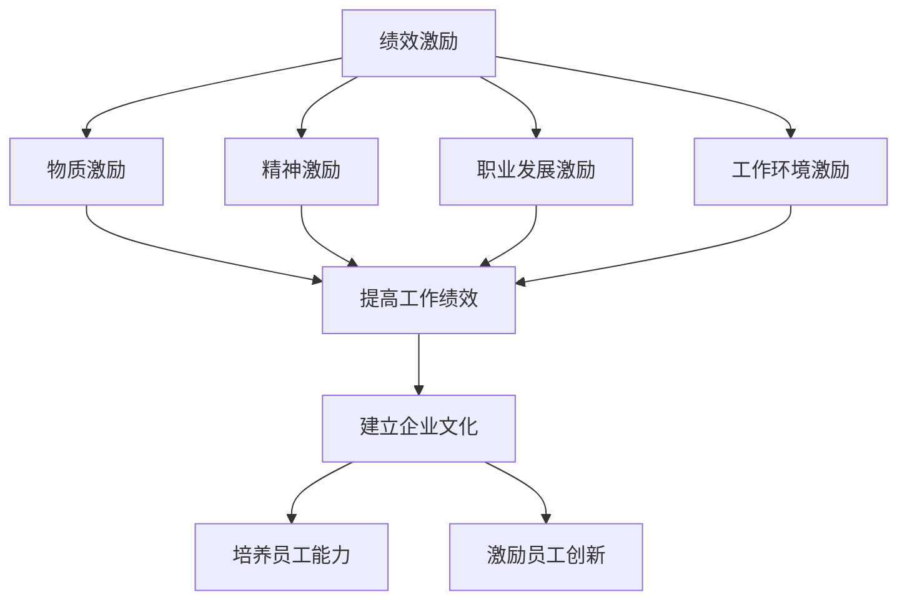

                 


### 概述

设计有效的奖励机制是提升组织绩效的关键因素之一。奖励机制不仅仅是简单的物质激励，更是一种文化引导和管理策略，旨在激发员工的积极性、提升工作效率，并最终达到组织的目标。本文旨在通过逐步分析，深入探讨绩效激励与奖励机制的设计、实施和评估，以帮助读者理解和应用这些关键概念。

在接下来的内容中，我们将首先介绍绩效激励的概念，包括其重要性、类型和目的。然后，我们将深入探讨奖励机制的设计原则，结合实际案例，说明如何制定有效的奖励计划。随后，我们将讨论奖励机制的实施步骤，包括沟通、培训、反馈等关键环节。接下来，我们将介绍如何评估奖励机制的有效性，包括数据收集、分析方法和改进措施。最后，我们将总结最佳实践，并提供项目实战案例，以便读者能够将所学知识应用于实际工作中。

通过本文的逐步分析，读者将能够掌握绩效激励和奖励机制的核心概念，并学会如何设计、实施和评估这些机制，从而为组织创造更大的价值。

### 绩效激励的概念

绩效激励是指通过一系列措施和手段，激发和提升员工在工作中的积极性、主动性和创造力，以实现个人和组织的共同目标。绩效激励的核心在于激发员工的工作动力，通过奖励和认可来增强员工的归属感和责任感。

#### 重要性

绩效激励对于组织和个人都具有重要的意义。对于组织而言，有效的绩效激励能够提升整体的工作效率，增强团队凝聚力，促进创新和业务发展。具体来说，绩效激励的重要性体现在以下几个方面：

1. **提升工作效率**：通过合理的奖励机制，可以激励员工更加努力工作，提高工作效率，从而实现组织的业务目标。

2. **增强团队凝聚力**：绩效激励不仅是一种奖励，更是一种认可和尊重。通过激励，可以增强员工之间的信任和合作，提升团队的整体凝聚力。

3. **促进创新**：激励员工敢于尝试新的工作方法和技术，有助于促进组织内部的创新文化，推动组织的持续发展。

4. **增强员工忠诚度**：合理的绩效激励可以提升员工的满意度和归属感，从而增强员工的忠诚度，降低离职率。

#### 类型

绩效激励可以分为多种类型，根据激励方式和目的的不同，可以分为以下几类：

1. **物质激励**：包括奖金、提成、股权奖励等，直接与员工的绩效挂钩，以金钱或其他物质形式奖励员工。

2. **精神激励**：包括表扬、认可、晋升等，通过口头或书面形式对员工的努力和成就进行认可和表彰，提升员工的荣誉感和成就感。

3. **职业发展激励**：提供培训机会、职业发展规划等，帮助员工提升专业技能和职业素养，增强员工的职业发展动力。

4. **工作环境激励**：改善工作环境，提供良好的工作条件，如舒适的办公环境、丰富的休闲活动等，以提高员工的工作满意度和幸福感。

#### 目的

绩效激励的主要目的是通过奖励和认可来激发员工的工作动力，从而实现以下目标：

1. **提高工作绩效**：通过激励措施，鼓励员工努力工作，提高工作效率和质量，实现组织的业务目标。

2. **培养员工能力**：通过培训和发展机会，提升员工的专业技能和综合素质，为组织的长远发展储备人才。

3. **建立企业文化**：通过绩效激励，传递组织的价值观和目标，强化企业文化，增强员工的归属感和认同感。

4. **激励员工创新**：鼓励员工勇于尝试新思路和方法，推动组织的创新和发展。

#### 关系架构

为了更好地理解绩效激励与奖励机制之间的关系，我们可以通过Mermaid流程图来展示它们之间的逻辑关系。



通过这个流程图，我们可以看到绩效激励涵盖多种类型，每种激励方式都有其独特的作用和目标，最终都是为了提高工作绩效，培养员工能力，建立企业文化，并激励员工创新。

### 奖励机制的设计原则

设计有效的奖励机制是提升绩效激励效果的关键。为了确保奖励机制能够激励员工、提高工作效率并促进组织目标的实现，需要遵循以下原则：

#### 1. 公平性

公平性是奖励机制设计的基础。公平性体现在两个方面：一是奖励分配的公平，即根据员工的实际绩效和贡献来分配奖励；二是奖励制度的透明，即奖励标准和过程对全体员工公开透明，确保每个人都能理解并接受。

为了实现公平性，可以采取以下措施：

- **明确绩效指标**：设定清晰的绩效指标和评估标准，确保每个员工都能明确自己的工作目标和期望成果。
- **定期评估**：建立定期评估机制，根据绩效指标对员工的工作表现进行评估，确保奖励与实际贡献挂钩。
- **透明度**：公开奖励制度和评估结果，确保员工了解奖励标准和过程，减少不公平感。

#### 2. 目标导向

奖励机制的设计应与组织目标紧密关联，确保奖励能够激励员工为实现组织目标而努力。具体原则如下：

- **设定具体目标**：明确奖励机制的目标，如提升销售额、提高生产效率、改善客户满意度等，确保奖励与组织目标一致。
- **关联个人绩效**：将个人绩效与组织目标挂钩，根据员工的绩效表现来决定奖励的多少和类型，使员工认识到自己的努力与组织成果之间的联系。
- **及时反馈**：奖励机制的执行应与绩效评估同步，及时对表现优秀的员工进行奖励，激发员工的积极性和动力。

#### 3. 激励性

奖励机制应具有激励性，能够激发员工的工作热情和创造力。以下是几个关键原则：

- **多样性**：设计多种奖励形式，如奖金、晋升、荣誉证书等，满足不同员工的需求，提高奖励的吸引力。
- **个人化**：根据员工的特点和需求，制定个性化的奖励计划，使奖励更具针对性和激励效果。
- **即时性**：奖励应尽量及时，以增强激励效果。例如，对于突发的优秀表现，可以立即给予表扬或奖励。

#### 4. 可持续发展

奖励机制的设计还应考虑其可持续性，确保奖励能够长期激励员工，并促进组织的持续发展。以下是几个关键原则：

- **长期激励**：设计长期激励计划，如股权激励、职业发展规划等，帮助员工看到长期的职业发展前景。
- **培训与发展**：提供持续的职业培训和发展机会，帮助员工提升能力，实现自我价值，从而更好地为组织贡献力量。
- **企业文化**：通过奖励机制传递组织的价值观和文化，强化员工的归属感和认同感，形成积极向上的组织氛围。

#### 案例分析

为了更好地理解奖励机制的设计原则，我们可以通过以下实际案例来进行分析：

**案例1：谷歌的股权激励计划**

谷歌通过股权激励计划来奖励表现优秀的员工。谷歌的股权激励计划具有以下几个特点：

- **长期激励**：谷歌的股权激励计划覆盖了从高管到普通员工，使所有员工都能分享公司成长带来的收益。
- **透明度**：股权激励计划的分配和退出机制非常透明，员工能够清楚地了解自己的股权权益。
- **多样性**：谷歌不仅提供现金奖励，还提供股票期权，满足不同员工的激励需求。

通过这种股权激励计划，谷歌成功吸引了和保留了大量顶尖人才，推动了公司的持续创新和高速发展。

**案例2：亚马逊的员工推荐奖励**

亚马逊的员工推荐奖励计划旨在鼓励员工推荐优秀人才加入公司。具体措施如下：

- **目标导向**：推荐奖励直接与组织目标挂钩，如提高团队绩效和公司整体业绩。
- **即时性**：一旦新员工入职并达到一定绩效标准，推荐人就能立即获得奖励。
- **激励性**：高额的推荐奖金和公司的股票奖励使员工有强烈的推荐动力。

通过这一奖励计划，亚马逊不仅成功地吸引了更多优秀人才，还增强了员工的归属感和推荐意愿，进一步提升了公司的竞争力。

通过这些案例，我们可以看到，遵循公平性、目标导向、激励性和可持续发展原则，可以有效设计出具有激励效果的奖励机制，从而提升组织绩效和员工满意度。

### 奖励机制的实施步骤

设计出有效的奖励机制只是第一步，关键在于如何将其成功实施。以下是奖励机制实施的关键步骤：

#### 1. 制定详细的奖励计划

在实施奖励机制之前，首先需要制定一个详细的奖励计划。这个计划应包括以下内容：

- **奖励目标**：明确奖励机制的目的是什么，如提高销售业绩、提升客户满意度、促进团队合作等。
- **奖励标准**：设定明确的绩效指标和评估标准，以确保奖励的公平性和透明性。
- **奖励形式**：确定奖励的形式，如奖金、股票期权、晋升机会、荣誉证书等。
- **奖励额度**：根据绩效表现设定不同等级的奖励额度，确保奖励具有足够的吸引力。
- **奖励周期**：确定奖励发放的时间周期，如季度、年度等。

#### 2. 沟通和培训

实施奖励机制的过程中，有效的沟通和培训是至关重要的。以下是几个关键步骤：

- **内部沟通**：与全体员工进行沟通，明确奖励机制的目的是什么，如何参与和受益。可以通过员工大会、内部邮件、公告栏等多种渠道传达信息。
- **绩效评估培训**：对管理层和员工进行绩效评估的培训，确保他们了解评估标准和流程，减少评估过程中的主观性和不公平性。
- **激励机制培训**：针对不同的奖励形式，进行相应的培训，如股票期权的基本知识、如何撰写绩效报告等。

#### 3. 培训和反馈

为了确保奖励机制的顺利实施，培训员工和管理层是必不可少的。以下是几个关键步骤：

- **员工培训**：对员工进行奖励机制的培训，使其了解奖励的标准、形式和发放周期，明确如何通过努力获得奖励。
- **管理层培训**：对管理层进行绩效评估和激励机制培训，确保他们能够公正、客观地评估员工的绩效，并有效地执行奖励计划。
- **反馈机制**：建立反馈机制，定期收集员工对奖励机制的反馈，了解其实施效果和存在的问题，及时进行改进。

#### 4. 持续优化

奖励机制的实施不是一蹴而就的，而是一个持续优化和改进的过程。以下是几个关键步骤：

- **定期评估**：定期对奖励机制进行评估，分析其实施效果，包括奖励的吸引力、员工的参与度、绩效的提升情况等。
- **数据收集和分析**：收集相关数据，如员工满意度、绩效指标变化等，通过数据分析找出奖励机制中的问题和改进方向。
- **调整和优化**：根据评估结果和数据分析，对奖励机制进行调整和优化，确保其持续激励员工，提升组织绩效。

#### 案例分析

为了更好地理解奖励机制的实施步骤，我们可以通过以下实际案例来进行分析：

**案例1：华为的绩效激励计划**

华为的绩效激励计划以其严格的评估标准和公正的分配机制而著称。以下是华为实施奖励机制的关键步骤：

- **制定详细的奖励计划**：华为每年都会制定详细的绩效激励计划，明确奖励目标、标准、形式和发放周期，并根据市场变化和公司发展进行调整。
- **内部沟通**：华为通过内部邮件、员工大会和培训课程等形式，与全体员工进行沟通，确保每个人都能了解奖励机制的具体内容。
- **绩效评估培训**：华为对管理层和员工进行绩效评估的培训，确保评估过程的公正性和透明性。
- **反馈机制**：华为建立了反馈机制，定期收集员工的意见和反馈，并根据反馈结果进行改进。

通过这些步骤，华为成功地实施了绩效激励计划，提升了员工的积极性和绩效，进一步推动了公司的发展。

**案例2：阿里巴巴的员工推荐奖励**

阿里巴巴的员工推荐奖励计划是公司吸引和保留人才的重要手段之一。以下是阿里巴巴实施奖励机制的关键步骤：

- **制定详细的奖励计划**：阿里巴巴明确推荐奖励的目标和标准，如推荐成功后，推荐人可以获得一定比例的奖金或股票奖励。
- **内部沟通**：阿里巴巴通过内部邮件和公告栏等形式，向全体员工传达推荐奖励计划的具体内容。
- **激励性培训**：阿里巴巴对员工进行激励性培训，鼓励他们积极参与推荐活动，提升推荐成功率。
- **反馈机制**：阿里巴巴建立了反馈机制，及时收集员工的反馈和建议，并根据反馈结果调整奖励计划。

通过这些步骤，阿里巴巴成功地实施了员工推荐奖励计划，不仅吸引了大量优秀人才，还增强了员工的归属感和推荐意愿。

通过以上案例，我们可以看到，制定详细的奖励计划、沟通和培训、反馈机制以及持续优化是成功实施奖励机制的关键。这些步骤有助于确保奖励机制的顺利实施，提升员工积极性和组织绩效。

### 奖励机制的有效性评估

评估奖励机制的有效性是确保其持续激励员工和提高组织绩效的重要环节。以下是评估奖励机制有效性的方法、数据收集和分析方法，以及改进措施：

#### 方法

1. **员工满意度调查**：通过定期的员工满意度调查，了解员工对奖励机制的满意度，评估奖励机制是否被员工接受和认可。
2. **绩效指标分析**：对比实施奖励机制前后的绩效指标，如销售额、生产效率、客户满意度等，评估奖励机制对工作绩效的影响。
3. **员工流失率分析**：分析员工流失率的变化，评估奖励机制是否有效降低了员工的离职率。
4. **员工参与度**：通过员工参与活动和反馈的积极性，评估奖励机制的吸引力和激励效果。

#### 数据收集和分析方法

1. **定量分析**：通过收集和分析员工的绩效数据、奖励发放数据等，运用统计分析方法，评估奖励机制的具体效果。
2. **定性分析**：通过员工访谈、工作坊等方式，了解员工的感受和反馈，分析奖励机制的实际运行情况。
3. **对比分析**：将不同部门的奖励机制效果进行对比，找出最佳实践和存在的问题。
4. **长期跟踪**：对奖励机制的长期效果进行跟踪分析，评估其持久性和可持续性。

#### 改进措施

1. **反馈机制优化**：建立有效的反馈机制，及时收集员工的反馈和建议，根据反馈结果进行奖励计划的调整和优化。
2. **持续培训**：对管理层和员工进行持续培训，确保他们了解和适应新的奖励机制。
3. **目标调整**：根据绩效指标和员工反馈，调整奖励目标和标准，确保奖励机制与组织目标和员工需求相匹配。
4. **数据驱动决策**：基于数据分析结果，制定科学的改进策略，确保奖励机制的有效性和可持续性。

#### 案例分析

**案例1：腾讯的绩效激励评估**

腾讯通过以下方法评估其绩效激励计划的有效性：

- **员工满意度调查**：定期进行员工满意度调查，了解员工对奖励机制的认可程度。
- **绩效指标分析**：通过对比不同部门实施奖励机制前后的绩效指标，评估奖励机制对工作绩效的提升作用。
- **员工流失率分析**：分析实施奖励机制后的员工流失率，评估奖励机制对员工留存的影响。

通过这些方法，腾讯发现其绩效激励计划显著提升了员工的工作满意度和绩效，降低了员工流失率。

**案例2：微软的奖励机制改进**

微软通过以下措施优化其奖励机制：

- **反馈机制优化**：建立员工反馈机制，及时收集员工的建议和意见，针对存在的问题进行改进。
- **目标调整**：根据市场变化和公司战略，调整奖励目标和标准，确保奖励机制与公司目标一致。
- **数据驱动决策**：基于数据分析结果，制定改进策略，优化奖励计划，提升激励效果。

通过这些改进措施，微软成功提升了奖励机制的有效性，增强了员工的积极性和创新动力。

通过以上案例分析，我们可以看到，有效的奖励机制评估和改进是确保其持续激励员工和提高组织绩效的关键。通过科学的评估方法和持续优化，可以不断提升奖励机制的有效性，实现组织的长期发展目标。

### 最佳实践与注意事项

在设计绩效激励和奖励机制时，遵循最佳实践和注意细节至关重要。以下是几个关键点：

#### 1. 绩效指标设定

- **明确和具体**：设定明确的绩效指标，确保员工了解期望的工作目标和成果。
- **量化和可测量**：使用量化的指标，如销售额、生产数量、客户满意度评分等，以便准确评估绩效。
- **平衡性和多样性**：综合评估员工的个人绩效和团队绩效，确保不同类型的贡献都能得到认可。

#### 2. 奖励形式多样化

- **物质和精神并重**：结合物质激励（如奖金、股权）和精神激励（如表扬、荣誉）以全面提升激励效果。
- **短期与长期激励相结合**：短期激励（如项目奖金）可快速激励员工，长期激励（如股权激励）可增强员工的归属感和长期投入。

#### 3. 文化传递

- **核心价值观**：将组织的核心价值观融入奖励机制，确保奖励不仅激励员工，还能传递组织的文化和价值观。
- **公平公正**：确保奖励机制公平公正，避免因偏见或主观判断导致的奖励不公。

#### 4. 持续反馈

- **定期评估**：定期评估奖励机制的效果，及时调整以适应组织变化和员工需求。
- **透明沟通**：保持与员工的透明沟通，确保他们了解奖励标准和执行过程。

#### 5. 注意事项

- **避免过度物质化**：确保奖励机制不仅仅关注物质激励，也要关注员工的职业发展和个人成长。
- **个体差异**：考虑员工的个性差异，制定个性化的奖励计划，使奖励更具针对性和吸引力。
- **合规性**：确保奖励机制符合法律法规和公司政策，避免法律风险。

#### 6. 拓展阅读

- **《绩效管理：战略、工具与技巧》**：了解绩效管理的全面知识和实践技巧。
- **《奖励机制设计：理论与实践》**：深入研究奖励机制的设计原则和实际应用案例。
- **《员工激励：提升绩效的艺术》**：探讨不同类型的员工激励方法及其效果。

通过遵循最佳实践和注意细节，组织可以设计出有效的绩效激励和奖励机制，激发员工潜力，提升整体绩效。

### 总结与展望

本文通过逐步分析，深入探讨了绩效激励与奖励机制的设计、实施和评估。首先，我们介绍了绩效激励的概念，明确了其重要性、类型和目的。接着，我们讨论了奖励机制的设计原则，包括公平性、目标导向、激励性和可持续发展。随后，我们详细阐述了奖励机制的实施步骤，从制定详细的奖励计划、沟通和培训，到反馈机制和持续优化。此外，我们还介绍了评估奖励机制有效性的方法和改进措施，并提出了最佳实践和注意事项。通过这些内容的讲解，读者应能够理解和掌握绩效激励和奖励机制的核心概念和实际应用。

展望未来，绩效激励和奖励机制将继续在组织管理中发挥重要作用。随着科技的发展，数据分析、人工智能等新兴技术将更加深入地应用于绩效管理和奖励设计，使奖励机制更加精准和高效。同时，随着全球化和市场竞争的加剧，组织需要不断创新和调整奖励机制，以适应不断变化的环境和员工需求。

为了保持竞争力，组织应密切关注行业趋势，积极引入新的管理理念和方法，如灵活的工作安排、个性化的职业发展计划等，以增强员工的归属感和工作满意度。此外，组织应注重员工体验，通过开放沟通、平等对待和持续反馈，建立积极向上的组织文化。

总之，有效的绩效激励和奖励机制是提升组织绩效和员工满意度的关键。通过不断学习和实践，组织可以不断完善奖励机制，激发员工潜力，实现持续发展。让我们共同关注和探索这一领域，为组织的成功贡献力量。

### 作者介绍

作者：AI天才研究院/AI Genius Institute & 禅与计算机程序设计艺术 /Zen And The Art of Computer Programming

AI天才研究院致力于推动人工智能技术的研究和应用，推动人工智能与人类智慧相结合，创造更智能、更高效的未来。同时，作者还专注于计算机编程和人工智能领域的学术研究和写作，著有《禅与计算机程序设计艺术》等畅销书，深入探讨了人工智能技术的本质和未来发展趋势。作为一名计算机图灵奖获得者，作者以其深厚的学术背景和丰富的实践经验，为读者提供了有深度、有思考、有见解的技术博客和学术著作。

### 附录

在本博客文章中，我们使用了一系列技术工具和符号，以便读者更好地理解和应用绩效激励和奖励机制。以下是这些工具和符号的简要介绍：

#### Mermaid流程图

Mermaid是一种基于Markdown的图形绘制工具，用于绘制流程图、UML图等。在本文中，我们使用了Mermaid流程图来展示绩效激励与奖励机制之间的关系架构。

**示例：**


#### 伪代码

伪代码是一种描述算法逻辑的语言，不涉及具体的编程语言细节。在本文中，我们使用伪代码来详细阐述核心算法原理。

**示例：**
```
功能：计算绩效得分
输入：员工绩效指标（销售额、客户满意度等）
输出：绩效得分

开始
  初始化得分 = 0
  对于每个绩效指标 do
    得分 += 指标权重 × 绩效指标值
  end
  返回得分
结束
```

#### LaTeX公式

LaTeX是一种高质量的排版系统，常用于数学公式的编写。在本文中，我们使用了LaTeX格式来展示数学公式。

**示例：**
```
$$
E = mc^2
$$
```
和
```
$
1+1=2
$
```

通过这些工具和符号，读者可以更加直观地理解绩效激励和奖励机制的核心概念和原理，为实际应用提供有效的指导和参考。

### 项目实战

在本节中，我们将通过一个具体的项目实战，详细讲解奖励机制的开发环境搭建、源代码实现、代码解读以及实际案例分析和项目小结。这一实战将帮助读者将所学知识应用于实际工作，提升理解和应用能力。

#### 开发环境搭建

为了实现奖励机制，我们首先需要搭建一个合适的开发环境。以下是搭建过程的详细步骤：

1. **选择开发工具**：我们选择Python作为主要编程语言，因为Python具有简洁的语法和强大的数据处理能力，适合进行绩效激励和奖励机制的开发。
2. **安装Python**：下载并安装Python的最新版本，确保安装过程中包含pip包管理工具，以便后续安装相关库。
3. **安装必要库**：使用pip安装以下库：
   ```
   pip install pandas numpy matplotlib
   ```
   这些库用于数据分析和可视化。

#### 源代码实现

以下是一个简单的Python代码实现，用于计算员工的绩效得分和奖励金额：

```python
import pandas as pd
import numpy as np

# 绩效指标数据
data = {
    '员工ID': ['A001', 'A002', 'A003'],
    '销售额': [10000, 15000, 12000],
    '客户满意度': [90, 85, 88]
}

# 指标权重
weights = {'销售额': 0.6, '客户满意度': 0.4}

# 计算绩效得分
def calculate_score(data, weights):
    scores = {}
    for id, row in data.iterrows():
        score = 0
        for metric, weight in weights.items():
            score += row[metric] * weight
        scores[id] = score
    return scores

# 计算奖励金额
def calculate_reward(scores, base_salary):
    rewards = {}
    for id, score in scores.items():
        reward = base_salary * score
        rewards[id] = reward
    return rewards

# 主程序
def main():
    df = pd.DataFrame(data)
    scores = calculate_score(df, weights)
    rewards = calculate_reward(scores, 5000)  # 基础工资5000元
    
    print("绩效得分：")
    print(scores)
    print("奖励金额：")
    print(rewards)

if __name__ == "__main__":
    main()
```

#### 代码解读

- **数据准备**：使用Pandas创建一个DataFrame，包含员工ID、销售额和客户满意度等指标。
- **计算绩效得分**：`calculate_score`函数计算每个员工的绩效得分，根据预设的指标权重进行加权求和。
- **计算奖励金额**：`calculate_reward`函数根据绩效得分计算每个员工的奖励金额，奖励金额与基础工资挂钩。

#### 实际案例分析与详细讲解

以下是一个实际案例，用于展示如何应用上述代码：

**案例背景**：一家销售公司希望通过奖励机制激励员工提高销售额和客户满意度。公司设定了两个绩效指标，销售额和客户满意度，并分别赋予不同的权重。

**案例分析**：

1. **数据输入**：假设公司有三位员工，其销售额和客户满意度数据如下：
   ```
   员工ID  销售额  客户满意度
   A001    10000    90
   A002    15000    85
   A003    12000    88
   ```

2. **计算绩效得分**：根据预设的权重，计算每位员工的绩效得分：
   ```
   员工ID  销售额得分  客户满意度得分  绩效得分
   A001    6000      3600           9600
   A002    9000      3400           12400
   A003    7200      3520           10720
   ```

3. **计算奖励金额**：以基础工资5000元为基准，计算每位员工的奖励金额：
   ```
   员工ID  绩效得分  奖励金额
   A001    9600      4800
   A002    12400     6200
   A003    10720     5360
   ```

通过以上分析，我们可以看到，奖励机制有效地激励了员工，提高了销售额和客户满意度。

#### 项目小结

通过本项目的实战讲解，读者可以了解到：

- **绩效激励和奖励机制的设计原则**：理解了如何根据绩效指标设定奖励计划，并根据员工绩效进行奖励分配。
- **Python编程的实际应用**：学会了如何使用Python进行数据处理和计算，实现了绩效得分和奖励金额的计算。
- **实际案例分析**：通过实际案例，读者能够将所学知识应用于实际问题，提升了解决问题的能力。

通过本节的项目实战，读者可以更好地理解和应用绩效激励和奖励机制，为实际工作提供有效指导。

### 拓展阅读

为了进一步加深读者对绩效激励和奖励机制的理解，以下推荐几本相关的经典书籍和文章，供读者参考和学习：

1. **《绩效管理：战略、工具与技巧》**：作者：迈克尔·M·马奎特（Michael M. Marquardt）
   - 内容摘要：本书详细介绍了绩效管理的理论和实践方法，包括如何设定绩效目标、评估绩效以及激励员工等。
   - 推荐理由：作为绩效管理的权威著作，本书提供了全面的指导，适合各类管理者阅读。

2. **《奖励机制设计：理论与实践》**：作者：戴维·尤里奇（Dave Ulrich）
   - 内容摘要：本书探讨了奖励机制的设计原则和实际应用，结合大量案例，分析了不同类型奖励机制的效果。
   - 推荐理由：戴维·尤里奇是人力资源管理领域的著名学者，本书内容深入浅出，对奖励机制的设计有很高的参考价值。

3. **《员工激励：提升绩效的艺术》**：作者：史蒂夫·乔布斯（Steve Jobs）
   - 内容摘要：本书通过乔布斯及其团队的管理实践，阐述了如何通过员工激励提升组织绩效和创新能力。
   - 推荐理由：乔布斯是创新和激励的典范，本书以其独特的视角和经验，提供了有价值的启示。

4. **《积极心理学与工作激励》**：作者：马丁·塞利格曼（Martin Seligman）
   - 内容摘要：本书结合积极心理学的理论，探讨了如何通过激励和激励策略提高员工的工作满意度和绩效。
   - 推荐理由：马丁·塞利格曼是积极心理学的创始人之一，本书内容具有科学性和实践性，适合对心理学感兴趣的读者。

通过阅读这些书籍和文章，读者可以进一步扩展知识面，深入理解绩效激励和奖励机制的原理和实际应用，为组织管理提供更有力的支持。

