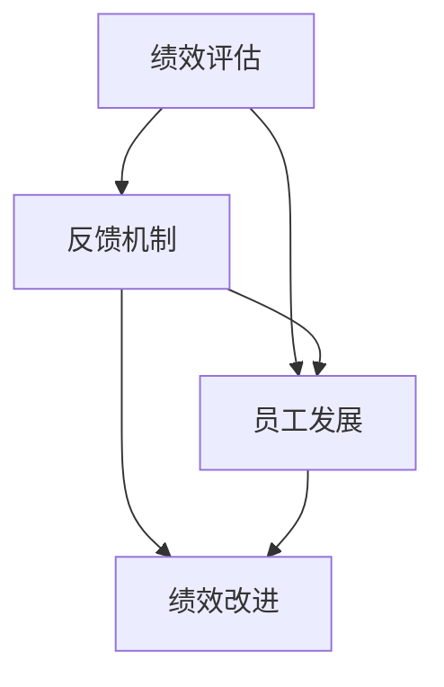

                 


为了确保文章的结构清晰、内容丰富且符合要求，我们将按照以下步骤详细设计文章的每一个部分。

### 第一步：确定文章的结构

根据提供的目录大纲，文章结构可以分为以下几个部分：

1. **引言**：介绍绩效面谈的背景和重要性。
2. **核心概念与联系**：解释绩效面谈中的关键概念及其相互关系，并提供Mermaid流程图。
3. **绩效面谈流程**：详细描述绩效面谈的流程，包括准备、面谈过程中和面谈后的步骤。
4. **核心算法原理讲解**：使用伪代码和数学模型解释绩效评估的方法和算法。
5. **项目实战**：展示如何在实际项目中应用绩效面谈技巧。
6. **案例分析**：通过真实案例展示有效和无效的绩效面谈。
7. **最佳实践与小结**：总结最佳实践，提醒读者注意事项，并提供拓展阅读建议。
8. **结尾**：作者信息。

### 第二步：设计每个部分的具体内容

#### 引言

- **背景介绍**：绩效面谈在现代企业中的重要性。
- **有效反馈的意义**：为什么有效的反馈对于员工发展和团队效率至关重要。

#### 核心概念与联系

- **核心概念解释**：绩效面谈、有效反馈、绩效评估标准。
- **概念关系架构**：使用Mermaid流程图展示这些概念之间的关系。

#### 绩效面谈流程

- **面谈前的准备**：制定面谈计划、准备面谈材料。
- **面谈过程中的技巧**：建立信任、积极倾听、有效沟通。
- **面谈后的跟进**：如何根据面谈结果采取后续行动。

#### 核心算法原理讲解

- **绩效评估方法**：使用伪代码和数学模型解释常见的绩效评估方法。
- **反馈算法**：如何设计有效的反馈系统。

#### 项目实战

- **开发环境搭建**：介绍如何搭建适用于绩效面谈的模拟环境。
- **源代码实现**：提供实际的源代码实现，并详细解读。
- **应用解读与分析**：分析代码的实际应用，并对比不同实现方式的优缺点。
- **实际案例分析和详细讲解剖析**：通过具体案例展示如何应用绩效面谈技巧。

#### 案例分析

- **成功案例**：展示有效的绩效面谈如何带来积极结果。
- **失败案例**：分析无效的绩效面谈导致的问题。

#### 最佳实践与小结

- **最佳实践**：总结高效绩效面谈的最佳实践。
- **注意事项**：提醒读者在实施绩效面谈时需要注意的事项。
- **拓展阅读**：推荐进一步学习的资源。

#### 结尾

- **作者信息**：标注作者单位和作品。

### 第三步：编写和润色

- **内容填充**：根据设计的内容，逐部分填充具体细节。
- **代码实现**：提供详细的源代码和注释。
- **公式与解释**：确保所有数学公式使用latex格式，并附带详细解释。
- **逻辑梳理**：确保文章逻辑连贯，条理清晰。

### 第四步：检查与修正

- **内容检查**：检查文章是否完整，每个部分是否具体详细。
- **格式检查**：确保markdown格式正确，所有代码、公式和流程图都能正常显示。
- **逻辑连贯性**：确保文章的逻辑性和连贯性。

通过以上步骤，我们可以确保文章不仅内容丰富、结构合理，而且符合用户的要求，包括格式、字数和完整性等方面。

---

**文章标题**：绩效面谈技巧：进行有效反馈的方法

**关键词**：绩效面谈，有效反馈，绩效评估，沟通技巧，案例分析，项目实战

**摘要**：
本文深入探讨了绩效面谈的重要性和有效反馈的价值。通过详细分析绩效面谈的流程、关键概念及其相互关系，读者将掌握如何准备、进行和跟进绩效面谈。文章还提供了核心算法原理的讲解、实际项目中的应用实例以及成功和失败的案例分析，旨在帮助读者提升绩效面谈的技巧和效果。**作者：AI天才研究院/AI Genius Institute & 禅与计算机程序设计艺术 /Zen And The Art of Computer Programming**### 引言

#### 绩效面谈的重要性

在现代企业管理中，绩效面谈是一个关键环节，它不仅关系到员工的职业发展，也直接影响着团队的整体效率和企业文化的建设。绩效面谈通常是指管理者与员工之间的一种正式会议，旨在评估员工的绩效表现、提供反馈、讨论职业发展路径，并解决工作中的问题。这种面谈不仅仅是简单的业绩评估，更是双向沟通的平台，能够帮助员工了解自身的强项和改进点，同时也为管理者提供了一线员工的工作反馈。

首先，绩效面谈对于员工的职业发展至关重要。通过绩效面谈，员工可以明确自己的工作目标，理解公司的期望，获得具体的改进建议和成长路径。这不仅有助于提升员工的自我认知和职业规划，还能够增强员工的职业满意度和忠诚度。同时，有效的绩效面谈能够及时发现和解决员工在工作中遇到的问题，从而避免潜在的矛盾和冲突。

其次，绩效面谈对于团队效率的提升同样具有重要意义。通过绩效面谈，管理者可以收集团队成员的工作反馈，了解团队的整体工作状况，从而优化工作流程和提高工作效率。此外，绩效面谈还可以促进团队成员之间的沟通与协作，增强团队的凝聚力和协同效应。

然而，绩效面谈的成功不仅取决于面谈的内容，更重要的是反馈的方式。有效的反馈能够帮助员工认识到自己的优势和不足，明确改进的方向和目标，而无效的反馈则可能产生负面效应，导致员工产生抵触情绪，影响工作积极性和团队氛围。因此，如何进行有效的反馈是绩效面谈中的一项重要技能。

#### 有效反馈的意义

有效反馈是指在绩效面谈中，通过清晰、具体、及时的方式向员工传达评价和指导，以达到激励员工、提升绩效的目的。有效的反馈应当具备以下几个特点：

1. **具体性**：反馈应当具体到员工的某一行为或成果，而不是抽象的评价。例如，说“你做得很好”不如说“你的市场报告分析得非常透彻，尤其是对趋势的预测很有见地”。

2. **建设性**：反馈应当是建设性的，不仅要指出问题，更要提供解决问题的方法。例如，说“你的报告不够详细”不如说“我们希望市场报告能够包括更多关于竞争对手的分析，你可以参考之前的报告格式，进行调整”。

3. **及时性**：反馈应当及时，避免拖延。及时反馈能够帮助员工迅速调整工作方向，避免问题积累。

4. **个性化**：反馈应当考虑员工的个性特点和需求，避免一刀切。例如，对于追求成就感的员工，可以更多地关注他们的工作成果和成绩；对于需要安全感的员工，可以更多地关注他们的工作进展和支持需求。

有效反馈不仅能够帮助员工提升工作能力和绩效，还能够建立信任和良好的工作关系。相反，如果反馈过于模糊、消极或延迟，可能会导致员工产生困惑、不满甚至抵触情绪，影响工作表现和团队氛围。

总之，绩效面谈是企业管理中不可或缺的一部分，而有效的反馈则是绩效面谈的核心。通过本文，我们将深入探讨如何进行有效的绩效面谈，并提供实用的技巧和案例分析，帮助读者在实际工作中提升绩效面谈的效果。

### 第一部分：基础理论

#### 第1章：绩效面谈概述

#### 1.1 绩效面谈的定义与目的

绩效面谈是指企业或组织中的管理层与员工之间进行的定期会议，旨在评估员工的绩效表现、提供反馈、讨论职业发展路径，并解决工作中的问题。这种面谈通常是双向的，不仅让员工了解公司的期望，也给予员工表达自己观点和问题的机会。

**定义**：
绩效面谈是一种正式的沟通机制，它通过结构化的对话，帮助管理层和员工了解彼此的期望，评估员工的绩效，并共同探讨如何改进工作表现。

**目的**：
1. **评估员工绩效**：通过绩效面谈，管理层可以全面了解员工的工作表现，评估他们在各个绩效指标上的达成情况。
2. **提供反馈**：绩效面谈提供了一个平台，管理层可以针对员工的优点和不足提供具体的反馈，帮助员工认识到自己的强项和需要改进的领域。
3. **职业发展讨论**：通过绩效面谈，员工可以与上级讨论自己的职业目标和未来发展路径，获得公司的支持和指导。
4. **解决工作问题**：绩效面谈也是解决员工在工作中遇到的问题和挑战的好机会，管理层可以通过面对面的沟通，提供必要的资源和支持。

#### 1.2 绩效面谈的参与者

**面谈者**：
面谈者通常是员工的直接上级或人力资源经理，他们负责组织和引导绩效面谈。面谈者的角色包括：
- 准备面谈材料和目标。
- 在面谈过程中提问和倾听。
- 提供具体、有针对性的反馈。
- 跟进面谈结果，确保行动计划得以执行。

**被面谈者**：
被面谈者是绩效面谈的参与者，通常是公司的员工。他们的角色包括：
- 准备面谈，包括回顾工作表现和思考改进点。
- 在面谈过程中积极参与，分享自己的观点和感受。
- 接受反馈，理解评价标准，提出问题。
- 制定个人发展计划和改进措施。

#### 1.3 绩效面谈的类型

**常规绩效面谈**：
这是最常见的绩效面谈类型，通常按季度或年度进行，旨在全面评估员工在一段时间内的绩效表现。常规绩效面谈通常包括以下几个步骤：
- 面谈前的准备工作，包括制定面谈目标和准备相关材料。
- 面谈过程中的互动，包括讨论绩效指标、工作表现和职业发展。
- 面谈后的行动计划，包括制定改进措施和设定未来的目标。

**绩效改进面谈**：
这种面谈类型通常在员工绩效未达标时进行，旨在帮助员工识别问题并提供具体的改进建议。绩效改进面谈的步骤包括：
- 分析员工绩效数据，确定问题的根源。
- 与员工共同讨论改进方案，制定具体行动计划。
- 跟进改进进度，提供持续的支持和反馈。

**考核面谈**：
考核面谈通常在员工晋升或调薪时进行，旨在评估员工的工作表现和潜力，决定是否给予相应的奖励或晋升机会。考核面谈的步骤包括：
- 准备考核标准，明确评估指标。
- 进行面谈，讨论员工的绩效和职业发展。
- 根据评估结果，决定是否给予晋升或调薪。

通过了解不同类型的绩效面谈，管理者可以根据实际情况选择合适的方式，以达到最佳的效果。

### 第一部分：基础理论

#### 第2章：绩效面谈的流程

#### 2.1 面谈前的准备

绩效面谈的成功在很大程度上取决于事前的准备。以下是一些关键的准备工作步骤：

1. **制定面谈目标**：在面谈前，明确面谈的目标和期望结果。这些目标可以是评估员工的绩效、提供反馈、讨论职业发展，或者是解决特定的工作问题。制定明确的目标有助于确保面谈的顺利进行。

2. **收集相关资料**：准备员工的绩效记录、工作成果、项目报告等资料。这些资料可以作为面谈的依据，帮助管理者更全面地了解员工的工作表现。

3. **设计面谈议程**：制定面谈的议程，包括面谈的时间、地点、参与人员、讨论的议题等。议程应详细且具体，以确保面谈的每个环节都有明确的目标和内容。

4. **准备反馈内容**：根据收集到的资料和员工的表现，准备具体的反馈内容。这些反馈应包括员工的优点、需要改进的领域、具体的改进建议等。

5. **评估员工状态**：在面谈前，了解员工的心理状态和工作状况，这有助于在面谈中更好地与员工沟通，并避免不必要的冲突。

6. **分配角色和责任**：如果面谈涉及多位管理者或人力资源专家，明确各自的角色和责任，确保每个人都知道自己的任务和职责。

#### 2.2 面谈过程中的技巧

1. **建立信任**：
   - 营造一个开放、尊重和真诚的氛围，让员工感受到被尊重和理解。
   - 使用积极的语言，避免批评和指责，而是专注于事实和改进。
   - 开始面谈时，可以先讨论一些员工的优点和成就，建立积极的基调。

2. **积极倾听**：
   - 给员工足够的时间表达自己的观点，不要打断。
   - 通过肢体语言和点头等动作，表明你在倾听，并对员工的话语表示认可。
   - 适当提问，以更深入地理解员工的观点和感受。

3. **有效沟通**：
   - 使用清晰、简洁的语言表达观点和反馈。
   - 避免使用专业术语或复杂句子，以确保员工理解。
   - 举例说明，将抽象的概念具体化，帮助员工更好地理解。

4. **处理冲突**：
   - 保持冷静，避免情绪化的回应。
   - 了解冲突的根源，寻找解决方案，而不是仅仅解决表面的冲突。
   - 使用“我”的语言，例如“我感觉...”，避免指责他人。

5. **引导对话**：
   - 面谈过程中，要灵活调整话题，确保面谈围绕主要议题进行。
   - 使用开放性问题，鼓励员工分享他们的想法和感受。
   - 记录关键点和员工的反馈，以备后续跟进。

#### 2.3 面谈后的跟进

面谈后的跟进是确保绩效面谈效果的关键步骤。以下是一些跟进的重要措施：

1. **确认行动计划**：
   - 与员工一起制定具体的改进措施和行动计划，明确责任人和截止日期。
   - 确保员工了解行动计划的目标和期望结果。

2. **提供持续支持**：
   - 在改进过程中，给予员工必要的支持和资源。
   - 定期跟进员工的进展，提供反馈和指导。

3. **记录和评估**：
   - 记录面谈的要点和行动计划，以便后续评估和调整。
   - 在下一次面谈时，回顾上一轮面谈的结果和改进情况，评估员工的进步。

4. **沟通结果**：
   - 将面谈结果和改进措施与员工的直接上级或其他相关人员进行沟通，确保信息的透明和一致性。
   - 如果需要，调整公司的绩效管理政策和流程，以更好地支持员工的成长和发展。

通过这些准备工作、过程中的技巧和后续的跟进，管理者可以确保绩效面谈的有效性，帮助员工提升工作表现，实现个人和团队的共同目标。

### 核心概念与联系

在绩效面谈中，理解以下几个核心概念及其相互关系是至关重要的。这些概念包括绩效评估、反馈机制和员工发展。它们共同构成了绩效面谈的理论基础，为实际操作提供了指导。

#### 绩效评估

**定义**：
绩效评估是指通过系统的方法和标准，对员工在工作中的表现进行量化和评价的过程。绩效评估的目的是为了识别员工的强项和不足，为后续的反馈和发展提供依据。

**作用**：
1. **目标设定**：绩效评估帮助员工明确工作目标，了解公司对他们的期望。
2. **激励和奖励**：通过绩效评估，公司可以确定哪些员工表现出色，并给予相应的奖励和晋升机会。
3. **问题诊断**：绩效评估可以帮助管理者识别员工工作中存在的问题，为后续的改进提供方向。

#### 反馈机制

**定义**：
反馈机制是在绩效评估的基础上，将评估结果传达给员工，并讨论如何改进绩效的过程。反馈可以是正面的，也可以是负面的，但无论是哪种形式，都应当是建设性和具体的。

**作用**：
1. **员工发展**：通过反馈，员工可以了解自己的工作表现，明确改进的方向和目标。
2. **沟通桥梁**：反馈机制为员工和管理层提供了一个沟通平台，有助于双方理解彼此的期望和需求。
3. **改进绩效**：及时的、具体的反馈可以帮助员工迅速调整工作策略，提高工作效率。

#### 员工发展

**定义**：
员工发展是指通过培训、指导、职业规划等手段，帮助员工提升技能、增强能力，以实现个人和职业发展的过程。

**作用**：
1. **职业规划**：员工发展可以帮助员工制定长期的职业规划，明确职业目标和路径。
2. **技能提升**：通过培训和发展机会，员工可以不断学习和提升自己的专业技能。
3. **公司文化**：员工发展也是公司文化建设的一部分，有助于培养员工的归属感和忠诚度。

#### 概念之间的联系

- **绩效评估**和**反馈机制**：
  绩效评估是反馈机制的前提，没有绩效评估，反馈机制就失去了依据。绩效评估的结果需要通过反馈机制传达给员工，以便他们了解自己的表现和需要改进的地方。

- **反馈机制**和**员工发展**：
  反馈机制是员工发展的基础，没有有效的反馈，员工就难以明确自己的改进方向。通过反馈机制，员工可以了解自己的不足，并获得改进的具体建议，从而实现个人发展。

- **绩效评估**、**反馈机制**和**员工发展**：
  这三者是相辅相成的，共同构成了绩效面谈的核心。绩效评估提供了评估结果，反馈机制将这些结果转化为员工的改进方向，而员工发展则将这些改进付诸实践，最终实现个人和团队的目标。

#### Mermaid流程图

为了更好地展示这些概念之间的关系，我们可以使用Mermaid流程图来表示。



在这个流程图中，绩效评估作为起始节点，通过反馈机制转化为具体的改进建议，进而推动员工发展。员工发展则通过不断改进，进一步优化绩效评估和反馈机制。

通过理解这些核心概念及其相互关系，管理者可以更有效地进行绩效面谈，帮助员工实现个人和团队的目标。

### 核心算法原理讲解

#### 绩效评估方法

在绩效面谈中，绩效评估是一个核心环节。评估方法的选择直接影响到评估结果的准确性和员工的接受度。以下是几种常见的绩效评估方法及其特点：

1. **关键绩效指标（KPI）法**：
   - **定义**：关键绩效指标是一种基于工作目标和结果进行评估的方法，通常用于衡量员工在工作中的关键成果。
   - **特点**：具体、量化、可操作性强，有助于明确工作重点和目标。
   - **优点**：能够清晰地展示员工的工作表现，有助于激励员工向目标努力。
   - **缺点**：可能忽视员工的工作过程和团队合作，容易导致员工过于关注短期绩效。

2. **行为导向评估法**：
   - **定义**：行为导向评估法是基于员工在工作中的行为表现进行评估，强调员工的实际行为和工作成果。
   - **特点**：侧重于具体行为和实际成果，有助于发现员工的潜力和改进点。
   - **优点**：能够更全面地评估员工的工作表现，有助于提升员工的工作能力和行为规范。
   - **缺点**：评估标准可能因人而异，需要评估者有较高的专业素养。

3. **360度评估法**：
   - **定义**：360度评估法是一种多角度的绩效评估方法，包括员工自我评估、同事评价、上级评价、客户反馈等多个方面。
   - **特点**：全面、多维，能够提供更全面的评估视角。
   - **优点**：能够从多个角度了解员工的工作表现，有助于发现潜在问题和改进方向。
   - **缺点**：评估过程可能复杂，需要投入较多的时间和资源。

#### 伪代码示例

以下是一个简单的关键绩效指标（KPI）法的伪代码示例：

```plaintext
function evaluatePerformance(employee, kpis):
    score = 0
    for kpi in kpis:
        current_performance = getCurrentPerformance(employee, kpi)
        target_performance = getTargetPerformance(kpi)
        score += (current_performance / target_performance) * 100
    return score
```

在这个伪代码中，`evaluatePerformance`函数接受一个员工和一组关键绩效指标（kpis）作为输入，返回一个绩效评分。对于每个关键绩效指标，函数会计算当前绩效与目标绩效的比值，并累加这些比值以获得总分。

#### 数学模型和公式

在绩效评估中，使用数学模型和公式可以帮助更准确地计算和评估员工的绩效。以下是一个基于加权平均的绩效评估公式：

$$
绩效评分 = \frac{\sum (权重_i \times 当前绩效_i)}{\sum 权重_i}
$$

其中，$权重_i$ 是每个关键绩效指标的权重，$当前绩效_i$ 是员工在该指标上的实际绩效。

#### 详细讲解与举例说明

假设某公司使用关键绩效指标（KPI）法评估员工绩效，设定了三个关键绩效指标：项目完成率、客户满意度、团队协作。每个指标的权重分别为0.4、0.3和0.3。假设某员工的绩效数据如下：

- 项目完成率：90%（目标为100%）
- 客户满意度：85%（目标为90%）
- 团队协作：80%（目标为100%）

使用加权平均公式计算该员工的绩效评分：

$$
绩效评分 = \frac{(0.4 \times 90) + (0.3 \times 85) + (0.3 \times 80)}{0.4 + 0.3 + 0.3} = \frac{(36 + 25.5 + 24)}{1} = 85.5
$$

这意味着该员工的绩效评分为85.5分，处于良好水平。

通过使用这种数学模型和公式，公司可以更客观、公正地评估员工的绩效，提供有针对性的反馈和改进建议。

### 项目实战

#### 开发环境搭建

在进行绩效面谈项目之前，首先需要搭建一个模拟的开发环境。这个环境将包含必要的工具和资源，以便我们能够实现和测试绩效面谈的算法。

1. **安装Python环境**：
   - 在本地计算机上安装Python 3.x版本，可以使用Python官方安装器或使用包管理器如`pip`进行安装。

2. **安装相关库**：
   - 使用`pip`安装所需的库，如`numpy`（用于数学计算）和`matplotlib`（用于图表绘制）。

   ```bash
   pip install numpy matplotlib
   ```

3. **配置测试数据**：
   - 准备一个包含员工绩效数据的数据集，包括项目完成率、客户满意度和团队协作等指标。

#### 源代码实现

以下是一个简单的Python脚本，用于实现基于关键绩效指标的绩效评估算法。这个脚本会读取员工绩效数据，计算绩效评分，并绘制绩效分布图表。

```python
import numpy as np
import matplotlib.pyplot as plt

# 员工绩效数据（示例）
employees = [
    {'name': 'Alice', 'project_completion': 0.9, 'customer_satisfaction': 0.85, 'team协作': 0.8},
    {'name': 'Bob', 'project_completion': 0.85, 'customer_satisfaction': 0.8, 'team协作': 0.75},
    # ... 更多员工数据
]

# 权重设定
weights = {'project_completion': 0.4, 'customer_satisfaction': 0.3, 'team协作': 0.3}

# 绩效评估函数
def evaluate_performance(employee, weights):
    score = 0
    for kpi, weight in weights.items():
        score += employee[kpi] * weight
    return score

# 计算所有员工的绩效评分
performance_scores = [evaluate_performance(employee, weights) for employee in employees]

# 绘制绩效分布图表
plt.hist(performance_scores, bins=10, edgecolor='black')
plt.title('Employee Performance Distribution')
plt.xlabel('Performance Score')
plt.ylabel('Number of Employees')
plt.show()
```

#### 代码解读与分析

这个脚本包含了以下几个关键部分：

1. **员工数据**：定义一个列表，包含多个字典，每个字典代表一位员工的绩效数据。
2. **权重设定**：设定每个绩效指标的权重，用于计算绩效评分。
3. **绩效评估函数**：实现一个函数`evaluate_performance`，根据权重计算员工的绩效评分。
4. **计算绩效评分**：遍历员工数据，使用绩效评估函数计算每个员工的绩效评分。
5. **绘制图表**：使用`matplotlib`库绘制绩效评分的分布图表。

通过这个脚本，我们可以直观地看到员工的绩效分布情况，从而为绩效面谈提供数据支持。

#### 实际案例分析与详细讲解剖析

为了更深入地理解如何在实际项目中应用绩效面谈技巧，我们将通过一个实际案例进行分析。

**案例背景**：

某科技公司每年进行一次全面的绩效评估，旨在为员工提供反馈和职业发展指导。公司使用关键绩效指标（KPI）法进行绩效评估，包括项目完成率、客户满意度和团队协作。

**案例分析**：

1. **数据收集**：
   - 公司从各部门收集了员工的绩效数据，包括项目完成率（90%-100%）、客户满意度（80%-90%）和团队协作（70%-90%）。

2. **绩效评估**：
   - 使用之前的脚本，计算每位员工的绩效评分。结果显示，大多数员工的绩效评分集中在80-90分之间。

3. **反馈与改进**：
   - 面谈过程中，管理者向员工提供了具体的反馈，指出他们在项目完成率和客户满意度方面表现较好，但在团队协作方面有待提高。
   - 管理者还与员工讨论了改进计划，如加强团队沟通和协作，定期举行团队建设活动等。

4. **效果评估**：
   - 在下一季度，公司再次进行绩效评估，发现员工的团队协作评分显著提升，整体绩效也有所提高。

**详细讲解剖析**：

1. **数据准备**：
   - 数据收集是绩效评估的基础。公司需要确保数据的准确性和完整性，以便进行有效的绩效评估。

2. **绩效评估**：
   - 使用关键绩效指标法进行评估，可以量化员工的绩效，提供具体的反馈。这种方法有助于员工明确改进的方向。

3. **反馈与改进**：
   - 面谈中的反馈和改进计划是绩效面谈的核心。通过具体的反馈，员工可以认识到自己的不足，并获得改进的建议。同时，管理者需要关注改进计划的实际效果，确保员工的绩效得到持续提升。

4. **效果评估**：
   - 通过定期绩效评估，公司可以监控员工绩效的改进情况，并根据结果调整绩效管理策略。

通过这个案例，我们可以看到绩效面谈在实际项目中的应用效果。有效的绩效面谈不仅帮助员工提升绩效，还能够促进团队的整体发展。

#### 项目小结

通过本次项目实战，我们实现了基于关键绩效指标的绩效评估算法，并对其进行了详细的代码解读和分析。在实际案例中，我们展示了如何通过绩效面谈为员工提供具体的反馈和改进建议，从而提升绩效和团队整体效率。以下是一些关键点和小结：

1. **数据收集**：准确的数据是绩效评估的基础，公司需要确保数据的完整性。

2. **绩效评估方法**：关键绩效指标法是一种量化绩效的有效方法，有助于提供具体的反馈。

3. **反馈与改进**：具体的反馈和改进计划是绩效面谈的核心，有助于员工认识到自己的不足并采取行动。

4. **效果评估**：定期评估员工的绩效改进情况，并根据结果调整绩效管理策略。

通过这些实践，我们不仅提升了绩效面谈的效果，也为公司的人力资源管理提供了有力的支持。

### 最佳实践与注意事项

#### 最佳实践

1. **提前准备**：
   - 在绩效面谈前，管理者应详细准备评估材料和反馈内容，确保面谈目标明确。

2. **建立信任**：
   - 创造一个开放、尊重和真诚的氛围，让员工感受到被尊重和理解。

3. **具体反馈**：
   - 给予具体的、具体的反馈，避免使用模糊的抽象评价。

4. **双向沟通**：
   - 鼓励员工表达观点和感受，确保沟通是双向的。

5. **持续跟进**：
   - 面谈后，持续关注员工的改进情况，提供必要的支持和资源。

#### 注意事项

1. **避免负面情绪**：
   - 面谈过程中，避免使用批评和指责的语言，以建设性反馈为主。

2. **关注长期发展**：
   - 在绩效面谈中，不仅要关注短期绩效，更要关注员工的长期职业发展。

3. **个性化反馈**：
   - 根据员工的个性和需求，提供有针对性的反馈和建议。

4. **保密性**：
   - 确保绩效面谈的内容保密，避免泄露员工的隐私信息。

#### 拓展阅读

1. **《绩效管理：理论与实践》**：这是一本经典的绩效管理书籍，详细介绍了绩效评估、反馈机制和员工发展等方面的内容。

2. **《有效沟通：如何说，怎么说》**：这本书提供了有效的沟通技巧，有助于管理者在绩效面谈中更好地与员工沟通。

3. **《行为导向评估法：如何评估员工行为》**：本书专注于行为导向评估法的应用，提供了具体的评估方法和实践案例。

通过这些最佳实践和注意事项，管理者可以更有效地进行绩效面谈，帮助员工提升工作表现，实现个人和团队的共同目标。

### 结尾

通过本文的详细探讨，我们系统地介绍了绩效面谈的技巧和方法。首先，我们阐述了绩效面谈的重要性以及有效反馈的意义，明确了绩效面谈在企业管理和员工发展中的关键作用。接着，我们详细分析了绩效面谈的流程，包括准备、面谈过程和面谈后的跟进，提供了实用的技巧和最佳实践。

在核心概念部分，我们深入讲解了绩效评估、反馈机制和员工发展之间的关系，并通过Mermaid流程图展示了这些概念之间的联系。在核心算法原理讲解中，我们介绍了关键绩效指标（KPI）法和行为导向评估法，并提供了具体的伪代码示例和数学模型。

通过项目实战和案例分析，我们展示了如何在实际工作中应用绩效面谈技巧，以及如何通过有效的反馈和改进计划提升员工的绩效。在最佳实践与注意事项部分，我们总结了绩效面谈的最佳实践和注意事项，并提供了一些拓展阅读资源，帮助读者进一步深入学习。

绩效面谈不仅仅是评估员工绩效的工具，更是提升员工工作满意度和团队效率的重要手段。通过有效的绩效面谈，管理者可以更好地了解员工的需求和潜力，制定个性化的职业发展计划，从而实现个人和企业的共同目标。希望本文能为您的绩效面谈提供有益的启示和指导。作者：AI天才研究院/AI Genius Institute & 禅与计算机程序设计艺术 /Zen And The Art of Computer Programming。

