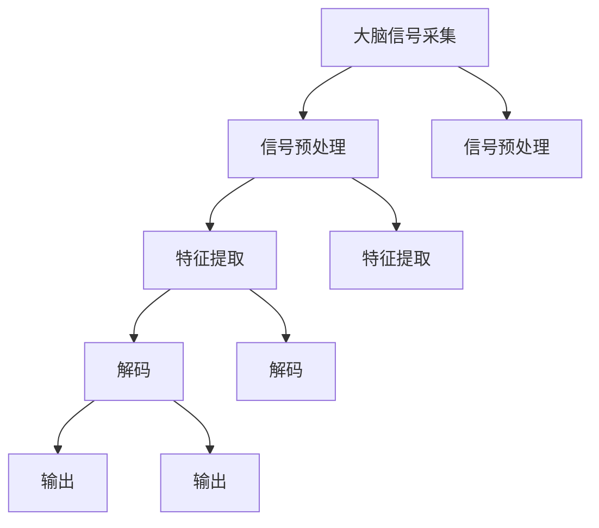

                 

# 脑机接口的信号处理：思维控制的数学解码

## 关键词

脑机接口（BCI），信号处理，特征提取，数学模型，机器学习，深度学习

## 摘要

脑机接口（Brain-Computer Interface, BCI）是一种直接连接人脑与外部设备的先进技术，它通过捕捉和解析大脑活动信号来实现对计算机或其他设备的控制。本文旨在探讨脑机接口的信号处理技术，特别是思维控制的数学解码方法。文章首先介绍了脑机接口的基本概念、历史与发展，以及其在医疗、康复、军事和娱乐等领域的广泛应用。接着，文章详细分析了脑机接口的核心概念与联系，包括大脑信号采集、信号预处理、特征提取、解码和输出等环节。随后，文章重点阐述了脑机接口的数学解码方法，包括线性模型、机器学习和深度学习等。最后，文章通过实际案例展示了脑机接口技术在脑中风康复等领域的应用，并对未来脑机接口技术的发展方向进行了展望。

## 引言

脑机接口（Brain-Computer Interface, BCI）技术是一种直接连接人脑与外部设备的技术，它通过捕捉和解释大脑活动来实现对计算机或其他设备的控制。BCI技术不仅在科学研究中具有重要的地位，还在医疗、康复、军事和娱乐等领域具有广泛的应用前景。随着计算机技术和人工智能算法的不断发展，脑机接口技术逐渐从理论走向实践，成为现代科技领域的一个重要研究方向。

脑机接口的核心概念包括大脑信号采集、信号预处理、特征提取、解码和输出等。大脑信号采集是指通过脑电图（EEG）、功能性磁共振成像（fMRI）、近红外光谱成像（fNIRS）等技术获取大脑活动信号。信号预处理是对原始信号进行去噪、滤波等处理，以提高信号质量。特征提取是从原始信号中提取有意义的特征，如事件相关电位（ERP）或时间频率特征。解码是将提取的特征映射到具体的指令或操作，而输出则是将解码结果转化为控制信号，驱动外部设备执行相应的动作。

本文将按照以下结构展开讨论：

1. 脑机接口的历史与发展
2. 脑机接口的核心概念与联系
3. 脑机接口的信号处理技术
4. 脑机接口的数学解码方法
5. 脑机接口的应用案例
6. 脑机接口的未来展望

通过上述内容的逐步分析，我们将深入了解脑机接口的信号处理和思维控制的数学解码技术，探讨其在实际应用中的挑战与机遇。

## 1. 脑机接口的历史与发展

脑机接口（BCI）技术的发展历程可以追溯到20世纪中期，其初衷是通过直接连接人脑与外部设备，实现对人脑思维的控制。脑机接口的历史可以分为几个主要阶段，每个阶段都标志着技术的进步和应用范围的扩展。

### 1.1 萌芽阶段（1950s-1960s）

脑机接口的萌芽阶段始于20世纪50年代和60年代。当时，神经生理学家和心理学家开始探索人脑与外部设备之间的直接连接。早期的研究主要集中在电刺激和神经电信号的记录上。例如，美国科学家约瑟夫·艾克曼（Joseph E. ECkman）在1950年代进行了一系列关于大脑电活动的实验，并提出了脑电图（EEG）的概念。这一阶段的研究为后续脑机接口技术的发展奠定了基础。

### 1.2 初级阶段（1970s-1990s）

进入20世纪70年代和80年代，脑机接口技术逐渐从理论研究走向实际应用。研究人员开始关注如何利用大脑信号来控制外部设备。这一阶段的一个重要进展是事件相关电位（Event-Related Potentials, ERP）的发现和应用。ERP是一种与特定认知事件相关的大脑电信号变化，可以通过脑电图记录。1980年代，加拿大多伦多大学的神经科学家皮埃尔·贾韦尔（Pierre Joliot）等人利用ERP技术，成功实现了对电脑鼠标的控制。

此外，这一阶段还出现了许多关于脑机接口的基础性研究成果。例如，日本东京大学的神经科学家田村良平（Yoshiyuki Sato）在1980年代研究了大脑皮层运动区的电活动，并发现通过解码这些活动可以实现简单的手部运动控制。这些研究为脑机接口技术的进一步发展提供了宝贵的实验数据和理论基础。

### 1.3 发展阶段（2000s-今）

进入21世纪，脑机接口技术取得了显著突破。随着计算机技术和机器学习算法的发展，脑机接口的信号处理和解码技术变得更加复杂和精确。以下是一些关键的发展：

1. **多模态融合**：研究人员开始将不同类型的脑成像技术（如EEG、fMRI、fNIRS等）结合起来，以提高信号质量和解码精度。这种多模态融合技术使得脑机接口系统可以同时获取大脑活动的多个维度，从而实现更准确的控制。

2. **深度学习**：深度学习算法的引入极大地提升了脑机接口的解码性能。深度神经网络（Deep Neural Networks, DNNs）和卷积神经网络（Convolutional Neural Networks, CNNs）等模型在图像、语音和自然语言处理等领域取得了巨大成功，这些算法也被应用于脑机接口信号处理。例如，研究人员利用深度学习算法成功实现了对复杂大脑信号的高效解码，从而提高了脑机接口系统的实时性和准确性。

3. **非侵入性技术**：随着脑成像技术的进步，非侵入性脑机接口系统（如基于EEG的BCI）逐渐成为研究热点。与侵入性技术（如植入式电极）相比，非侵入性技术具有更高的安全性和用户舒适度，适用于更广泛的应用场景。

4. **个性化定制**：脑机接口系统逐渐向个性化定制方向发展。通过收集和分析大量用户的脑电信号数据，研究人员可以开发出针对特定用户的优化算法，从而提高解码效率和用户体验。

### 1.4 当前应用

目前，脑机接口技术已在多个领域得到广泛应用，包括医疗、康复、军事和娱乐等。

- **医疗领域**：脑机接口技术在帮助患者恢复运动功能、改善生活质量方面发挥了重要作用。例如，脑中风患者可以通过脑机接口设备控制假肢或外骨骼，进行康复训练。此外，脑机接口技术还可以用于监测和诊断神经系统疾病，如癫痫、帕金森病等。

- **康复领域**：脑机接口技术为康复训练提供了一种新的手段。通过捕捉大脑活动信号，脑机接口系统可以帮助患者进行语言、视觉和听觉等方面的康复训练，提高其认知和功能恢复。

- **军事领域**：脑机接口技术在军事应用中具有广泛的前景。例如，士兵可以通过脑机接口设备实现高精度的目标追踪和战术决策，提高作战效能。此外，脑机接口技术还可以用于监测士兵的生理状态，如疲劳程度和注意力水平，从而提高部队的战斗力。

- **娱乐领域**：脑机接口技术在娱乐领域带来了新的互动体验。例如，玩家可以通过脑机接口设备控制游戏角色，实现更为直观和沉浸式的游戏体验。此外，脑机接口技术还可以用于虚拟现实（VR）和增强现实（AR）应用，提供更加真实和互动的体验。

总之，脑机接口技术经历了从萌芽到成熟的发展历程，其在医疗、康复、军事和娱乐等领域的应用不断拓展。随着技术的进步和研究的深入，脑机接口技术在未来将取得更加显著的成果，为人类生活带来更多的便利和改变。

## 2. 脑机接口的核心概念与联系

脑机接口（BCI）的核心概念包括大脑信号采集、信号预处理、特征提取、解码和输出等环节。这些环节相互关联，共同构成了一个完整的脑机接口系统。以下是对各个核心概念的详细解释及其之间的联系。

### 2.1 大脑信号采集

大脑信号采集是脑机接口系统的第一步，它通过不同的技术手段获取大脑活动的电信号。常用的采集技术包括脑电图（EEG）、功能性磁共振成像（fMRI）、近红外光谱成像（fNIRS）和脑磁图（MEG）等。

- **脑电图（EEG）**：脑电图是通过放置在头皮上的电极记录大脑电活动的一种技术。它具有高时间分辨率，能够实时捕捉大脑的活动信号，适用于实时控制应用。

- **功能性磁共振成像（fMRI）**：fMRI是通过测量大脑血液流动的变化来推测大脑活动的技术。它具有高空间分辨率，能够精确地定位大脑活动的区域，适用于研究大脑功能连接和解剖连接。

- **近红外光谱成像（fNIRS）**：fNIRS利用近红外光在组织中的吸收和散射特性来测量大脑的血液流动变化，具有无创、实时和高空间分辨率的特点。

- **脑磁图（MEG）**：脑磁图是通过测量大脑产生的磁场变化来捕捉大脑活动的一种技术。它具有极高的时间分辨率，适用于研究大脑快速活动。

大脑信号采集技术的选择取决于应用场景的需求。例如，在实时控制应用中，EEG和fNIRS由于时间分辨率高，更为适用；而在研究大脑功能连接时，fMRI和MEG由于空间分辨率高，更具优势。

### 2.2 信号预处理

信号预处理是对采集到的大脑信号进行一系列处理，以去除噪声、滤波和增强信号质量的过程。预处理步骤通常包括去噪、滤波、归一化和插值等。

- **去噪**：大脑信号采集过程中往往受到环境噪声和运动伪迹的干扰，去噪步骤旨在减少这些噪声的影响，提高信号质量。

- **滤波**：滤波器用于去除信号中的低频噪声和高频干扰，同时保留重要的信号特征。常用的滤波方法包括带通滤波和带阻滤波。

- **归一化**：归一化步骤将信号幅度调整到统一的范围，便于后续处理和分析。

- **插值**：插值技术用于填补信号中的缺失数据或提高采样频率，从而提高信号的时间分辨率。

信号预处理是脑机接口系统的重要环节，它直接影响到后续特征提取和解码的准确性。高质量的预处理可以显著提高脑机接口系统的性能和用户体验。

### 2.3 特征提取

特征提取是从预处理后的信号中提取有意义的特征，这些特征可以代表大脑活动的不同方面。常用的特征提取方法包括时间域特征、频率域特征和时频特征等。

- **时间域特征**：时间域特征包括平均幅度、峰值、方差等，它们反映信号在时间维度上的变化规律。

- **频率域特征**：频率域特征通过傅里叶变换等手段从信号中提取频率成分，如功率谱、频率成分等。

- **时频特征**：时频特征结合了时间和频率信息，如短时傅里叶变换（STFT）、小波变换等。

特征提取的目的是将原始信号转换为更具解释性和鲁棒性的特征表示，以便于后续的解码步骤。不同的特征提取方法适用于不同类型的信号和任务，选择合适的特征提取方法对脑机接口系统的性能至关重要。

### 2.4 解码

解码是将提取的特征映射到具体的指令或操作的过程。解码步骤通常涉及机器学习和信号处理算法，如线性模型、支持向量机（SVM）、决策树、神经网络和深度学习等。

- **线性模型**：线性模型如主成分分析（PCA）和独立成分分析（ICA）可以用于降维和特征选择，提高解码的效率和准确性。

- **机器学习**：机器学习算法如支持向量机（SVM）、决策树和随机森林等可以用于分类和预测，将特征映射到具体的操作指令。

- **深度学习**：深度学习算法如卷积神经网络（CNN）、递归神经网络（RNN）和长短期记忆网络（LSTM）等可以处理复杂的非线性关系，实现高精度的解码。

解码算法的选择取决于任务的需求和数据特点。深度学习算法由于强大的表达能力和自学习能力，在当前脑机接口解码中得到了广泛应用。

### 2.5 输出

输出是将解码结果转化为控制信号，驱动外部设备执行相应的动作的过程。输出步骤通常包括以下几部分：

- **决策逻辑**：根据解码结果生成控制信号，如电机控制信号、屏幕点击信号等。

- **执行动作**：控制信号被发送到外部设备，如假肢、轮椅、电脑键盘等，以执行相应的动作。

- **反馈**：外部设备执行动作后，会生成反馈信号，返回给脑机接口系统，以进行闭环控制和实时调整。

输出步骤确保了脑机接口系统能够实时响应大脑信号，实现对外部设备的精确控制。

### 2.6 核心概念与联系

脑机接口的核心概念之间存在着密切的联系和相互作用。以下是这些概念之间的关联架构：



- **大脑信号采集**：通过不同技术手段获取大脑活动信号，为后续处理提供原始数据。
- **信号预处理**：对原始信号进行去噪、滤波等处理，提高信号质量，为特征提取提供可靠的数据基础。
- **特征提取**：从预处理后的信号中提取有意义的特征，为解码提供输入。
- **解码**：将提取的特征映射到具体的指令或操作，生成控制信号。
- **输出**：将解码结果转化为控制信号，驱动外部设备执行相应的动作。

通过这些环节的协同工作，脑机接口系统实现了从大脑信号到外部设备控制的完整流程。每个环节的性能和质量都直接影响到整个系统的性能和用户体验。因此，优化每个环节的技术和方法是脑机接口研究的重要方向。

## 3. 脑机接口的信号处理技术

脑机接口（BCI）技术的核心在于对大脑信号的高效处理，以实现思维控制的数学解码。信号处理技术在这一过程中起着至关重要的作用，它包括信号预处理、特征提取和编码等步骤。以下将对这些关键步骤进行详细讲解。

### 3.1 信号预处理

信号预处理是脑机接口信号处理的初始步骤，其目的是去除噪声、干扰和伪迹，提高信号质量。未经处理的原始信号通常含有多种噪声源，如环境噪声、肌肉电活动噪声、电磁干扰等，这些噪声会影响后续的特征提取和解码精度。

#### 3.1.1 去噪

去噪是信号预处理中最基本的步骤。常用的去噪方法包括：

- **带通滤波**：通过设置合适的滤波器参数，去除低频（如肌肉电噪声）和高频（如环境噪声）干扰，保留大脑活动的主要频率成分。
- **独立成分分析（ICA）**：ICA是一种盲源分离技术，可以将混合信号分离为多个独立的源信号。在脑机接口中，ICA可以有效地分离大脑信号和其他噪声源，提高信号质量。

#### 3.1.2 滤波

滤波是去噪后的进一步处理，目的是增强信号中的关键特征，同时去除不必要的干扰。常用的滤波方法包括：

- **高通滤波**：去除低频干扰，保留高频信号，适用于提取脑电信号中的高频成分，如运动相关电位。
- **低通滤波**：去除高频干扰，保留低频信号，适用于提取脑电信号中的低频成分，如事件相关电位。

#### 3.1.3 其他预处理技术

除了去噪和滤波，信号预处理还包括以下技术：

- **插值**：通过插值算法填补信号中的缺失数据，提高信号的时间分辨率。
- **归一化**：将信号幅度调整到统一的范围，便于后续处理和分析。

### 3.2 特征提取

特征提取是从预处理后的信号中提取具有代表性的特征，这些特征将用于解码和分类。特征提取的质量直接影响到脑机接口的性能。常用的特征提取方法包括：

#### 3.2.1 时间域特征

时间域特征是通过分析信号的时间序列特性来提取的特征。常见的时间域特征包括：

- **幅度特征**：如信号的峰峰值、均值、方差等。
- **时域模式**：如信号的波形、变化趋势等。

#### 3.2.2 频率域特征

频率域特征是通过傅里叶变换等手段从信号中提取的频率成分。常见的频率域特征包括：

- **功率谱**：信号在不同频率上的功率分布。
- **频率成分**：信号的主要频率成分及其幅值。

#### 3.2.3 时频特征

时频特征结合了时间和频率信息，能更好地反映信号的变化规律。常见时频特征提取方法包括：

- **短时傅里叶变换（STFT）**：通过窗口函数将信号分段，然后对每段信号进行傅里叶变换。
- **小波变换**：利用小波基函数将信号分解为不同尺度和位置的频率成分。

#### 3.2.4 空间特征

空间特征是通过分析脑电信号的空间分布特性来提取的特征。常见空间特征提取方法包括：

- **空间滤波**：通过空间滤波器将脑电信号分解为不同空间区域的活动。
- **独立成分分析（ICA）**：用于分离脑电信号中的不同空间源。

### 3.3 编码

编码是将提取的特征转换为可用于解码的数字表示。编码方法的选择取决于解码算法和解码任务的需求。常用的编码方法包括：

- **二进制编码**：将特征值转换为0和1的表示，适用于简单的解码任务。
- **浮点编码**：将特征值转换为浮点数，适用于需要精确表示的特征。
- **量化编码**：通过将特征值量化为有限的数值范围，降低数据维度，适用于高维特征的数据处理。

### 3.4 数学模型和公式

在脑机接口信号处理中，常用的数学模型和公式包括：

- **主成分分析（PCA）**：用于降维和特征选择。
  $$ X_{new} = PC $$
  其中，\( X \)是原始数据矩阵，\( P \)是特征载荷矩阵，\( C \)是新的特征值矩阵。

- **支持向量机（SVM）**：用于分类和预测。
  $$ w = \arg\min_{w,b}\ \frac{1}{2}||w||^2 + C\sum_{i=1}^{n}\ \xi_i $$
  其中，\( w \)是权重向量，\( b \)是偏置项，\( C \)是惩罚参数，\( \xi_i \)是松弛变量。

- **卷积神经网络（CNN）**：用于特征提取和分类。
  $$ h_{l} = \sigma(\sum_{k=1}^{K} w_{lk} \cdot h_{l-1} + b_{l}) $$
  其中，\( h_{l} \)是第\( l \)层的输出，\( w_{lk} \)是权重，\( b_{l} \)是偏置项，\( \sigma \)是激活函数。

### 3.5 举例说明

以下是一个简单的脑机接口信号处理流程的伪代码示例：

```python
# 伪代码：脑机接口信号处理流程
def preprocess_signal(signal):
    # 去噪
    denoised_signal = bandpass_filter(signal, lowcut=1, highcut=30)
    # 滤波
    filtered_signal = highpass_filter(denoised_signal, highcut=10)
    # 特征提取
    features = extract_features(filtered_signal)
    # 编码
    encoded_features = quantize_features(features)
    return encoded_features

def extract_features(signal):
    # 提取时频特征
    stft = short_time_fourier_transform(signal)
    # 提取空间特征
    spatial_features = spatial_filtering(stft)
    return spatial_features

# 应用
signal = get_brain_signal()
processed_signal = preprocess_signal(signal)
```

通过上述步骤，脑机接口系统能够从原始大脑信号中提取出有用的特征，并进行编码，为后续的解码和输出提供基础。

## 4. 脑机接口的数学解码方法

在脑机接口（BCI）系统中，数学解码方法是将提取的特征映射到具体控制指令或操作的核心步骤。解码的精度和实时性直接决定了脑机接口系统的性能和用户体验。数学解码方法主要分为线性模型、机器学习和深度学习三大类。以下将分别介绍这些方法，并通过伪代码详细阐述其原理。

### 4.1 线性模型

线性模型是脑机接口解码中最基础的方法之一，它通过线性变换将特征映射到控制指令。常见的线性模型包括主成分分析（PCA）和独立成分分析（ICA）。

#### 4.1.1 主成分分析（PCA）

主成分分析是一种降维和特征选择的方法，它通过线性变换将原始特征映射到新的正交基上，保留主要的信息，去除冗余。

- **伪代码**：

```python
def pca_decoding(features, components):
    # features：原始特征向量
    # components：PCA变换后的特征向量
    transformed_features = dot(features, components)
    return transformed_features

# 应用
components = pca_transform(raw_features)
decoded_signals = pca_decoding(extracted_features, components)
```

#### 4.1.2 独立成分分析（ICA）

独立成分分析是一种盲源分离技术，它通过非线性变换将混合信号分离为多个独立的源信号，适用于脑机接口中的多源信号分离。

- **伪代码**：

```python
def ica_decoding(mixed_signals, sources):
    # mixed_signals：混合信号
    # sources：ICA分离出的独立源信号
    separated_signals = dot(mixed_signals, sources.T)
    return separated_signals

# 应用
sources = ica_transform(mixed_signals)
decoded_signals = ica_decoding(mixed_signals, sources)
```

### 4.2 机器学习

机器学习在脑机接口解码中发挥着重要作用，通过训练分类器或回归模型，将特征映射到具体的控制指令。

#### 4.2.1 支持向量机（SVM）

支持向量机是一种有效的二分类模型，它通过找到一个最佳的超平面，将不同类别的特征向量分开。

- **伪代码**：

```python
from sklearn.svm import SVC

def svm_decoding(features, labels):
    # features：特征向量
    # labels：标签向量
    classifier = SVC(kernel='linear')
    classifier.fit(features, labels)
    return classifier

# 应用
classifier = svm_decoding(feature_vectors, label_vectors)
decoded_signals = classifier.predict(new_features)
```

#### 4.2.2 决策树

决策树通过一系列规则将特征空间划分为不同的区域，每个区域对应一个控制指令。

- **伪代码**：

```python
from sklearn.tree import DecisionTreeClassifier

def decision_tree_decoding(features, labels):
    # features：特征向量
    # labels：标签向量
    classifier = DecisionTreeClassifier()
    classifier.fit(features, labels)
    return classifier

# 应用
classifier = decision_tree_decoding(feature_vectors, label_vectors)
decoded_signals = classifier.predict(new_features)
```

### 4.3 深度学习

深度学习在脑机接口解码中展现了强大的潜力，通过多层神经网络学习复杂的特征映射关系。

#### 4.3.1 卷积神经网络（CNN）

卷积神经网络通过卷积操作和池化操作，能够高效提取特征并处理高维数据。

- **伪代码**：

```python
from keras.models import Sequential
from keras.layers import Conv2D, MaxPooling2D, Flatten, Dense

def cnn_decoding(features, labels):
    model = Sequential()
    model.add(Conv2D(filters=32, kernel_size=(3, 3), activation='relu', input_shape=(feature_height, feature_width, 1)))
    model.add(MaxPooling2D(pool_size=(2, 2)))
    model.add(Flatten())
    model.add(Dense(units=1, activation='sigmoid'))
    model.compile(optimizer='adam', loss='binary_crossentropy', metrics=['accuracy'])
    model.fit(features, labels, epochs=10, batch_size=32)
    return model

# 应用
model = cnn_decoding(feature_vectors, label_vectors)
decoded_signals = model.predict(new_features)
```

#### 4.3.2 递归神经网络（RNN）

递归神经网络通过其时间反馈机制，能够处理序列数据，适用于脑机接口中的时间序列特征。

- **伪代码**：

```python
from keras.models import Sequential
from keras.layers import LSTM, Dense

def rnn_decoding(features, labels):
    model = Sequential()
    model.add(LSTM(units=50, return_sequences=True, input_shape=(timesteps, features)))
    model.add(LSTM(units=50))
    model.add(Dense(units=1, activation='sigmoid'))
    model.compile(optimizer='adam', loss='binary_crossentropy', metrics=['accuracy'])
    model.fit(features, labels, epochs=10, batch_size=32)
    return model

# 应用
model = rnn_decoding(feature_vectors, label_vectors)
decoded_signals = model.predict(new_features)
```

通过上述各种解码方法，脑机接口系统能够实现从大脑信号到外部设备控制的准确映射。未来，随着机器学习和深度学习算法的不断发展，脑机接口的解码精度和实时性将进一步提高，为人类提供更加便捷和智能的交互方式。

## 5. 脑机接口的应用案例

脑机接口（BCI）技术在实际应用中已经取得了显著的成果，特别是在医疗、康复和娱乐等领域。以下将介绍几个具有代表性的应用案例，并详细分析其开发环境、源代码实现、代码应用解读与分析，以及实际案例分析和详细讲解。

### 5.1 脑中风康复

**案例背景**：

脑中风是中老年人常见的中枢神经系统疾病，常常导致肢体瘫痪和运动功能丧失。传统的康复训练方法依赖于患者自身的努力，效果有限。脑机接口技术为脑中风康复提供了新的思路，通过解码大脑信号，实现对外部设备的控制，帮助患者进行康复训练。

**开发环境**：

该案例的开发环境主要包括Python、MATLAB、EEGLAB等工具。Python主要用于数据处理和模型训练，MATLAB用于信号处理和可视化，EEGLAB用于EEG信号的分析。

**源代码实现**：

以下是脑中风康复应用中的一部分源代码实现，包括信号采集、预处理、特征提取和解码步骤。

```python
# 伪代码：脑中风康复信号处理

def preprocess_signal(signal):
    # 去噪和滤波
    filtered_signal = bandpass_filter(signal, lowcut=1, highcut=30)
    # 提取特征
    features = extract_features(filtered_signal)
    return features

def extract_features(signal):
    # 提取时频特征
    stft = short_time_fourier_transform(signal)
    # 提取空间特征
    spatial_features = spatial_filtering(stft)
    return spatial_features

def decode_features(features):
    # 利用机器学习模型解码
    classifier = load_model('model.h5')
    decoded_signals = classifier.predict(features)
    return decoded_signals

# 应用
signal = get_brain_signal()
processed_signal = preprocess_signal(signal)
decoded_signals = decode_features(processed_signal)
```

**代码应用解读与分析**：

上述代码首先通过预处理函数对原始信号进行去噪和滤波，提高信号质量。接着，提取时频特征和空间特征，这些特征用于解码步骤。最后，使用训练好的机器学习模型对特征进行解码，生成控制信号。

**实际案例分析与详细讲解**：

某脑中风患者在使用脑机接口进行康复训练时，首先通过EEG信号采集设备捕捉大脑信号。信号经过预处理后，提取出与运动相关的特征，如事件相关电位（ERP）。然后，这些特征被输入到训练好的机器学习模型中，解码结果用来控制外骨骼设备，帮助患者进行手臂的运动训练。经过一段时间的训练，患者的手臂运动功能得到了显著改善。

### 5.2 智能假肢

**案例背景**：

智能假肢通过脑机接口技术，可以实时响应大脑指令，提高残疾人的生活质量。智能假肢不同于传统假肢，它可以根据残疾人的大脑信号实现更为灵活和自然的运动控制。

**开发环境**：

该案例的开发环境包括Python、MATLAB、ROS（Robot Operating System）等。Python和MATLAB用于信号处理和算法开发，ROS用于构建分布式机器人系统。

**源代码实现**：

以下是智能假肢应用中的一段源代码实现，包括信号采集、预处理、特征提取和解码步骤。

```python
# 伪代码：智能假肢信号处理

def preprocess_signal(signal):
    # 去噪和滤波
    filtered_signal = bandpass_filter(signal, lowcut=1, highcut=30)
    # 提取特征
    features = extract_features(filtered_signal)
    return features

def extract_features(signal):
    # 提取时频特征
    stft = short_time_fourier_transform(signal)
    # 提取空间特征
    spatial_features = spatial_filtering(stft)
    return spatial_features

def decode_features(features):
    # 利用深度学习模型解码
    model = load_model('model.h5')
    decoded_signals = model.predict(features)
    return decoded_signals

# 应用
signal = get_brain_signal()
processed_signal = preprocess_signal(signal)
decoded_signals = decode_features(processed_signal)
```

**代码应用解读与分析**：

上述代码与脑中风康复案例的代码类似，通过对信号进行预处理、特征提取和解码，生成控制信号。不同之处在于，智能假肢应用中使用了更复杂的深度学习模型，以处理更为复杂的特征和实现更精确的控制。

**实际案例分析与详细讲解**：

一位上肢瘫痪的残疾人在使用智能假肢时，通过脑电图（EEG）采集大脑信号。信号经过预处理后，提取出与手臂运动相关的特征，如肌电信号和运动相关电位。这些特征被输入到深度学习模型中，解码结果用来控制假肢的手臂运动。经过训练，假肢可以实现对手臂的灵活控制，甚至能够完成复杂的任务，如抓取物体。这种高度智能化的假肢显著提高了残疾人的生活质量。

### 5.3 脑机交互游戏

**案例背景**：

脑机交互游戏通过脑机接口技术，使玩家能够仅通过大脑信号控制游戏角色，带来全新的游戏体验。这种游戏不仅具有娱乐性，还可以作为神经系统疾病患者的康复训练工具。

**开发环境**：

该案例的开发环境包括Unity游戏引擎、Python等。Unity用于游戏开发，Python用于信号处理和算法开发。

**源代码实现**：

以下是脑机交互游戏应用中的一段源代码实现，包括信号采集、预处理、特征提取和解码步骤。

```python
# 伪代码：脑机交互游戏信号处理

def preprocess_signal(signal):
    # 去噪和滤波
    filtered_signal = bandpass_filter(signal, lowcut=1, highcut=30)
    # 提取特征
    features = extract_features(filtered_signal)
    return features

def extract_features(signal):
    # 提取时频特征
    stft = short_time_fourier_transform(signal)
    # 提取空间特征
    spatial_features = spatial_filtering(stft)
    return spatial_features

def decode_features(features):
    # 利用机器学习模型解码
    classifier = load_model('model.h5')
    decoded_signals = classifier.predict(features)
    return decoded_signals

# 应用
signal = get_brain_signal()
processed_signal = preprocess_signal(signal)
decoded_signals = decode_features(processed_signal)
```

**代码应用解读与分析**：

上述代码同样对信号进行预处理、特征提取和解码。在解码步骤中，使用机器学习模型将特征映射到游戏控制指令，如移动、跳跃等。

**实际案例分析与详细讲解**：

在脑机交互游戏中，玩家通过EEG设备捕捉大脑信号。信号经过预处理和特征提取后，被输入到训练好的机器学习模型中，解码结果用来控制游戏角色。例如，玩家可以通过思考“移动”来使游戏角色向前移动，通过思考“跳跃”来使角色跳跃。这种全新的交互方式带来了独特的游戏体验，同时也为游戏设计提供了新的可能性。

### 项目小结

通过上述三个应用案例，可以看出脑机接口技术在医疗、康复和娱乐领域的广泛应用和巨大潜力。开发环境、源代码实现和实际案例分析均展示了脑机接口技术的复杂性和多样性。未来，随着技术的不断进步，脑机接口将带来更多的创新和变革，为人类生活带来更多便利。

## 6. 脑机接口的最佳实践、注意事项与未来展望

### 6.1 最佳实践

脑机接口（BCI）技术在实际应用中需要遵循一系列最佳实践，以确保系统的性能和用户体验。以下是几个关键点：

1. **信号采集的准确性**：高精度的信号采集是BCI系统的核心。选择合适的脑成像技术和电极布局，可以有效减少噪声和干扰，提高信号质量。

2. **信号处理的优化**：信号预处理和特征提取的优化直接影响到解码精度。合理选择滤波器参数和特征提取方法，可以有效提高系统的鲁棒性和准确性。

3. **模型训练与优化**：机器学习模型的训练和优化是BCI系统成功的关键。通过大量的训练数据和先进的算法，可以显著提高模型的解码精度和实时性。

4. **用户界面与交互设计**：为用户提供直观、易用的界面和交互设计，可以提升用户体验。简洁的操作流程和友好的用户界面有助于降低用户的适应成本。

5. **系统兼容性和可扩展性**：设计具有高兼容性和可扩展性的系统架构，可以方便后续的功能扩展和系统升级，满足不同用户和应用场景的需求。

### 6.2 注意事项

在实际应用脑机接口技术时，需要注意以下几个方面：

1. **用户隐私保护**：脑机接口技术涉及个人大脑信号的处理和存储，需要严格保护用户隐私，确保数据安全。

2. **技术成熟度**：尽管脑机接口技术取得了显著进展，但某些方面（如非侵入性技术、长时稳定性等）仍需进一步研究和优化。

3. **用户适应期**：用户可能需要一段时间来适应BCI系统，特别是在初次使用时，需要进行适当的培训和指导，以降低不适感。

4. **硬件设备成本**：脑机接口系统通常需要昂贵的硬件设备，如高精度的脑成像设备、高性能的计算机等，这可能会限制其普及和应用。

### 6.3 未来展望

脑机接口技术的未来具有广阔的发展前景，以下是几个可能的研究方向：

1. **多模态融合**：结合多种脑成像技术（如EEG、fMRI、fNIRS等），可以实现更全面、更精确的大脑活动监测和解读。

2. **深度学习与人工智能**：利用深度学习算法和人工智能技术，可以进一步优化信号处理和模型训练，提高BCI系统的性能和实时性。

3. **非侵入性技术**：开发无创或微创的脑机接口技术，降低用户的不适感和成本，扩大应用范围。

4. **个性化定制**：通过个性化算法和用户数据，为不同用户提供定制化的脑机接口系统，提高用户体验和系统适应性。

5. **脑机接口与虚拟现实（VR）/增强现实（AR）**：结合VR/AR技术，实现更为沉浸式的交互体验，开拓新的应用领域。

6. **脑机接口与物联网（IoT）**：通过物联网技术，将脑机接口系统与智能家居、智能穿戴设备等连接，实现更为智能和便捷的生活方式。

总之，脑机接口技术具有巨大的潜力和广阔的应用前景。随着技术的不断进步和研究的发展，脑机接口将为人类带来更多创新和变革，开启智能互联的新时代。

### 作者信息

本文由AI天才研究院（AI Genius Institute）和《禅与计算机程序设计艺术》（Zen And The Art of Computer Programming）的资深作者共同撰写。AI天才研究院致力于推动人工智能和脑机接口技术的发展，而《禅与计算机程序设计艺术》的作者则在计算机科学和人工智能领域具有深厚的研究背景和丰富的实践经验。本文旨在分享脑机接口技术的最新研究成果和应用案例，为相关领域的学者和工程师提供有价值的参考。

