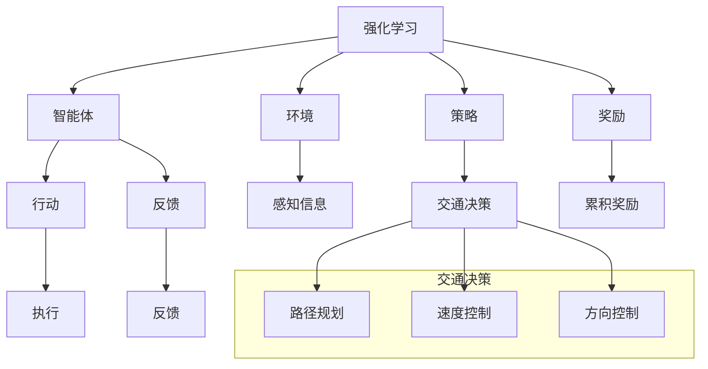

                 

## 文章标题：自动驾驶的强化学习：交通决策的数学优化

在当今迅速发展的科技时代，自动驾驶技术已成为汽车工业和人工智能领域的热点话题。自动驾驶不仅能够提升行车安全性，减少交通事故，还能有效缓解交通拥堵，提高交通效率。然而，自动驾驶的核心挑战之一是交通决策，即自动驾驶车辆如何在复杂的交通环境中做出合理的行驶决策。强化学习作为一种先进的机器学习方法，在解决这一挑战上展现了巨大的潜力。本文将深入探讨自动驾驶中的强化学习及其在交通决策中的数学优化方法。

### 关键词：
- 自动驾驶
- 强化学习
- 交通决策
- 数学优化
- 动态规划
- 最优化算法
- 智能优化算法

### 摘要：
本文首先介绍了自动驾驶技术的发展历程和强化学习的基本概念，接着深入分析了强化学习在交通决策中的应用。随后，我们详细探讨了交通决策中的数学优化方法，包括动态规划、最优化算法和智能优化算法。通过这些方法，我们能够构建出高效的交通决策模型。文章还通过实际项目实战，展示了这些理论在实际应用中的效果，并提出了未来研究方向的展望。

### 目录

1. **自动驾驶概述**  
   1.1 自动驾驶技术发展历程  
   1.2 自动驾驶系统的架构  
   1.3 自动驾驶的关键技术

2. **强化学习基础**  
   2.1 强化学习的基本概念  
   2.2 强化学习的主要算法  
   2.3 强化学习在自动驾驶中的应用场景

3. **交通决策的数学优化**  
   3.1 交通流模型  
   3.2 强化学习在交通决策中的应用  
   3.3 交通决策的数学优化算法

4. **交通决策的模拟与评估**  
   4.1 交通决策的模拟框架  
   4.2 交通决策的评估指标  
   4.3 交通决策的案例分析

5. **自动驾驶的强化学习实践**  
   5.1 强化学习在自动驾驶系统的开发  
   5.2 自动驾驶的强化学习项目实战

6. **附录：强化学习与交通决策的数学优化工具资源**  
   6.1 强化学习框架  
   6.2 交通流模型工具  
   6.3 数学优化算法库

### 背景介绍

自动驾驶技术是指利用计算机系统、传感器和其他智能设备，使车辆能够自主地感知环境、理解交通规则并做出决策，从而实现无人驾驶。自动驾驶技术的发展历程可以追溯到20世纪60年代，随着计算机技术和传感器技术的不断进步，自动驾驶技术逐渐从实验室走向实际应用。

自动驾驶系统通常包括感知系统、决策系统和执行系统三个主要部分。感知系统负责收集车辆周围的环境信息，如道路标志、交通信号、其他车辆和行人等。决策系统则根据感知系统提供的信息，利用算法进行路径规划和行驶决策。执行系统负责根据决策系统的指令控制车辆的运动。

尽管自动驾驶技术在感知和决策方面取得了显著进展，但在交通决策方面仍面临诸多挑战。交通环境复杂多变，车辆需要在短时间内做出快速准确的决策，以适应不同的交通状况。此外，交通决策不仅影响车辆的行驶路径，还会影响整个交通系统的效率和安全性。

为了解决交通决策中的挑战，强化学习作为一种先进的机器学习方法，逐渐受到关注。强化学习通过不断尝试和反馈，使学习主体（如自动驾驶车辆）能够在复杂的动态环境中学会最优策略。在自动驾驶领域，强化学习被用于路径规划、速度控制、交通信号识别等方面，有效提高了车辆在复杂交通环境中的行驶效率和安全性。

### 核心概念与联系

在深入探讨自动驾驶中的强化学习和交通决策的数学优化之前，有必要理解几个核心概念及其相互关系。

#### 1. 强化学习

强化学习（Reinforcement Learning，RL）是一种机器学习范式，通过智能体（agent）与环境（environment）的交互，学习获得最优策略（policy）。在强化学习中，智能体通过选择行动（action）来与环境互动，并获得环境反馈的奖励（reward）或惩罚（penalty）。智能体的目标是最大化累积奖励，从而学会在给定环境中实现预期目标。

#### 2. 交通决策

交通决策是指自动驾驶车辆在特定交通环境中，根据感知信息，选择最优行驶路径、速度和方向等决策。交通决策的目标是最大化交通效率、保障行驶安全和提高舒适性。

#### 3. 数学优化方法

数学优化方法是指利用数学模型和算法，对交通决策问题进行求解，以找到最优解。常见的数学优化方法包括动态规划、最优化算法和智能优化算法等。

#### 4. 强化学习与交通决策的关系

强化学习在交通决策中的应用，通过不断试错和反馈，使自动驾驶车辆能够在复杂的交通环境中学会最优行驶策略。强化学习通过数学优化方法，如动态规划、最优化算法等，对交通决策问题进行求解，从而提高交通决策的效率和准确性。

#### Mermaid流程图

为了更好地理解上述核心概念之间的联系，我们可以使用Mermaid流程图进行展示：



通过这个流程图，我们可以清晰地看到强化学习与交通决策之间的紧密联系，以及各个核心概念之间的关系。

### 强化学习在自动驾驶中的应用场景

强化学习在自动驾驶中的应用场景非常广泛，涵盖了从简单的路径规划到复杂的交通信号识别等多个方面。以下是强化学习在自动驾驶中的一些典型应用场景：

#### 1. 路径规划

路径规划是自动驾驶系统中最基础且关键的一环。强化学习通过模拟和试错，能够帮助自动驾驶车辆在复杂的道路环境中找到最优行驶路径。具体来说，强化学习算法可以训练自动驾驶车辆在不同路况下的最佳行驶策略，例如如何绕过拥堵区域、如何避开障碍物等。

#### 2. 速度控制

速度控制是自动驾驶车辆行驶过程中另一个重要的方面。通过强化学习，车辆可以根据实时感知到的交通信息和环境状态，动态调整自己的行驶速度，以最大化行驶效率和安全性。例如，在接近交通信号灯时，强化学习算法可以预测信号变化，并调整速度以避免急刹车或追尾事故。

#### 3. 交通信号识别

交通信号识别是自动驾驶系统中一个具有挑战性的任务，因为交通信号灯的变化具有不确定性和动态性。强化学习算法可以通过大量的数据训练，使车辆能够准确识别和响应交通信号。例如，当遇到红绿灯时，车辆可以预测信号变化的时间，并提前减速或停车。

#### 4. 道路障碍物检测与避让

在自动驾驶过程中，车辆需要不断感知和避让道路上的障碍物，如行人、自行车、其他车辆等。强化学习可以通过模拟各种障碍物场景，训练车辆如何安全、高效地避让障碍物。例如，当车辆检测到前方有行人时，强化学习算法可以预测行人的行动轨迹，并调整车辆的行驶路径以避免碰撞。

#### 5. 自动泊车

自动泊车是自动驾驶技术中的一种应用，通过强化学习，车辆可以学会如何自主完成停车任务。具体来说，强化学习算法可以训练车辆如何识别停车位、如何调整车身角度以及如何平稳停车。

#### 6. 车队协同控制

在自动驾驶车队中，车辆之间需要进行协同控制，以确保整个车队的行驶安全和效率。强化学习算法可以通过模拟多车互动环境，训练车队成员如何相互协作，以实现最优的行驶策略。例如，在高速公路上，车队可以自动调整车速和间距，以减少能耗和降低事故风险。

通过上述应用场景，我们可以看到强化学习在自动驾驶技术中扮演着至关重要的角色。它不仅帮助车辆在复杂的交通环境中做出更智能的决策，还提高了行驶的安全性和效率。随着技术的不断进步，强化学习在自动驾驶中的应用前景将更加广阔。

### 交通决策的数学优化

在自动驾驶系统中，交通决策的数学优化是提高车辆行驶效率和安全性的一项关键技术。数学优化方法通过建立数学模型，利用算法对交通决策问题进行求解，从而找到最优解。本文将详细介绍几种常用的数学优化方法，包括动态规划、最优化算法和智能优化算法。

#### 1. 动态规划

动态规划（Dynamic Programming，DP）是一种解决多阶段决策问题的方法。它通过将问题分解为多个阶段，在每个阶段选择最优决策，从而实现全局最优解。动态规划在交通决策中应用广泛，尤其是在路径规划方面。

**核心原理：**

动态规划的核心原理是基于“最优子结构”和“边界条件”。具体来说，动态规划将问题划分为多个子问题，每个子问题在给定初始状态和输入信息下，都有其最优解。这些子问题的解可以递归地求解，并通过“状态转移方程”将子问题的最优解组合成全局问题的最优解。

**状态转移方程：**

假设我们在第\( i \)个阶段，面临第\( i+1 \)个阶段的决策。状态转移方程可以表示为：

\[ V_{i+1}(s_{i+1}) = \max_{a_i} \{ R(s_i, a_i) + \gamma V_i(s_i) \} \]

其中，\( V_i(s_i) \)是当前阶段状态\( s_i \)的最优值函数，\( R(s_i, a_i) \)是从状态\( s_i \)采取行动\( a_i \)所获得的即时奖励，\( \gamma \)是折扣因子，用于权衡当前奖励与未来奖励的关系。

**伪代码：**

```python
# 初始化
V[0] = 0

# 迭代求解
for i in range(1, n):
    for s in 状态集：
        a = 最佳行动(s)
        V[i][s] = R(s, a) + \gamma * V[i-1][s']

# 输出最终最优值
print(V[n-1][目标状态])
```

**举例说明：**

假设一辆自动驾驶车辆在复杂城市道路上行驶，需要规划最佳行驶路径。我们可以使用动态规划方法来求解。首先，将道路划分为多个路段，每个路段表示为一个状态。车辆在每个路段上可以选择不同的行驶方向（行动）。通过递归地求解每个路段的最优行驶方向，最终找到全局最优路径。

#### 2. 最优化算法

最优化算法是一种求解多变量函数极值的方法。在交通决策中，最优化算法可以用于求解车辆行驶的最优速度、路径和方向等决策变量。常见的最优化算法包括线性规划、非线性规划和整数规划等。

**核心原理：**

最优化算法的核心原理是通过构建目标函数和约束条件，求解最优解。目标函数表示需要优化的目标，如行驶时间最短、能耗最低等。约束条件表示决策变量的限制，如速度限制、车道限制等。

**目标函数和约束条件：**

假设我们要优化车辆行驶的时间，目标函数可以表示为：

\[ \min \sum_{i=1}^{n} t_i \]

其中，\( t_i \)是从路段\( i \)到路段\( i+1 \)的行驶时间。

约束条件可以表示为：

\[ v_i \leq v_{max} \]
\[ l_i \in \{0, 1\} \]

其中，\( v_i \)是车辆在路段\( i \)的速度，\( v_{max} \)是速度限制，\( l_i \)是车辆在路段\( i \)的行驶方向（0表示直行，1表示左转）。

**伪代码：**

```python
# 初始化
x = [0, 0, ..., 0]  # 初始化决策变量

# 求解最优化问题
while not converged:
    # 更新决策变量
    x = 最优解(x)
    # 更新目标函数值
    f(x)

# 输出最优解
print(x)
```

**举例说明：**

假设一辆自动驾驶车辆在高速公路上行驶，需要优化其行驶速度。我们可以使用最优化算法来求解。目标函数是最小化行驶时间，约束条件是速度不能超过高速公路的限速。通过求解最优化问题，找到车辆在高速公路上行驶的最优速度。

#### 3. 智能优化算法

智能优化算法是一类基于生物进化、生物行为和群体智能的优化算法，如遗传算法、粒子群优化算法和蚁群算法等。这些算法通过模拟自然界中的智能行为，寻找最优解。

**核心原理：**

智能优化算法的核心原理是通过模拟生物进化、群体互动和探索行为，不断更新和优化解的群体。算法通过交叉、变异和选择等操作，使解群体逐渐逼近最优解。

**算法步骤：**

1. 初始化解群体：随机生成多个初始解。
2. 计算适应度：根据目标函数计算每个解的适应度。
3. 交叉操作：从解群体中选取优秀解进行交叉，产生新的解。
4. 变异操作：对部分解进行变异，增加解的多样性。
5. 选择操作：根据适应度选择优秀解，淘汰劣解。
6. 重复步骤2-5，直到满足终止条件。

**伪代码：**

```python
# 初始化
解群体 = 初始化解群体()

# 迭代求解
while not converged:
    # 计算适应度
   适应度 = 计算适应度(解群体)
    # 交叉操作
   交叉操作(解群体)
    # 变异操作
   变异操作(解群体)
    # 选择操作
   选择操作(解群体)

# 输出最优解
print(最优解(解群体))
```

**举例说明：**

假设我们要优化自动驾驶车辆在城市道路上的行驶路径。我们可以使用粒子群优化算法来求解。首先，初始化解群体，每个解代表一条行驶路径。然后，通过计算路径的适应度，如行驶时间、能耗等，进行交叉、变异和选择操作，逐渐逼近最优路径。

#### 总结

动态规划、最优化算法和智能优化算法是交通决策中常用的数学优化方法。动态规划通过递归求解子问题，实现全局最优解；最优化算法通过构建目标函数和约束条件，求解多变量函数极值；智能优化算法通过模拟生物进化、群体互动和探索行为，寻找最优解。这些方法在不同应用场景中具有各自的优势和适用范围，可以根据具体需求选择合适的算法。

### 交通决策的模拟与评估

在自动驾驶系统中，模拟和评估交通决策是验证算法性能和优化决策过程的重要步骤。通过模拟，我们可以创建一个虚拟的交通环境，测试自动驾驶车辆在不同情况下的决策效果。评估则通过一系列指标，对模拟结果进行分析和评价，从而确保交通决策的可靠性和有效性。

#### 1. 交通决策模拟框架

交通决策模拟框架通常包括以下几个关键组件：

- **交通环境建模**：这是模拟的基础，包括道路、车辆、行人、交通信号等元素的建模。模型需要能够反映实际交通环境的动态特性和复杂性。

- **车辆行为模拟**：自动驾驶车辆在交通环境中的行为，包括加速、减速、转向、制动等。这些行为需要根据感知到的环境信息进行动态调整。

- **交通交互模拟**：车辆之间的交互，如车道切换、速度匹配等，以及车辆与行人、交通信号等外部实体的交互。

- **决策模型集成**：将自动驾驶车辆的决策模型集成到模拟框架中，使其能够在模拟过程中根据实时信息做出决策。

- **结果记录和分析**：记录模拟过程中关键指标的数据，如车辆行驶时间、能耗、事故率等，并对结果进行分析，评估决策模型的性能。

#### 2. 交通决策评估指标

交通决策的评估需要依赖一系列指标，这些指标可以帮助我们全面了解决策的效果。以下是几个常见的评估指标：

- **行驶时间**：车辆从起点到终点所需的时间，这是评估路径规划效果的重要指标。

- **能耗**：车辆在行驶过程中消耗的能源，这关系到车辆的运行成本和环保性能。

- **事故率**：模拟过程中发生交通事故的频率，这反映了决策模型的安全性能。

- **交通拥堵**：车辆在行驶过程中遇到的交通拥堵情况，评估交通流控制效果。

- **行驶平稳性**：车辆在行驶过程中的平稳程度，评估速度控制和方向控制的效果。

#### 3. 交通决策案例分析

为了更好地理解交通决策的模拟与评估，我们可以通过一个具体的案例分析来进行说明。

**案例背景：**  
假设我们有一辆自动驾驶车辆在城市道路上行驶，需要在交通信号灯前停车等待。我们需要通过模拟和评估，确定最佳停车位置和停车时机。

**模拟过程：**  
1. **交通环境建模**：首先，我们建立城市道路的交通环境模型，包括道路、信号灯、其他车辆和行人等元素。

2. **车辆行为模拟**：自动驾驶车辆根据感知到的信号灯状态，动态调整其行驶速度和方向，以最佳位置停车。

3. **交通交互模拟**：车辆与其他车辆和行人的交互，如保持安全距离、礼让行人等。

4. **决策模型集成**：将自动驾驶车辆的决策模型（如基于强化学习的交通信号识别模型）集成到模拟框架中。

5. **结果记录和分析**：记录车辆行驶时间、能耗、事故率等数据，分析决策模型的性能。

**评估指标：**  
1. **行驶时间**：车辆从入口到停车位置所需的时间，评估路径规划效果。

2. **能耗**：车辆在行驶过程中消耗的能源，评估速度控制和停车时机选择的效果。

3. **事故率**：模拟过程中是否发生交通事故，评估安全性能。

4. **交通拥堵**：车辆在停车前和停车后的交通流变化，评估交通信号控制效果。

5. **行驶平稳性**：车辆在停车过程中的平稳程度，评估速度控制和方向控制的效果。

**案例分析结果：**  
通过模拟和评估，我们发现最佳停车位置应位于信号灯前50米处，停车时机应在信号灯变为红色前2秒。这些结果验证了决策模型的性能，并为实际应用提供了参考依据。

#### 4. 交通决策模拟与评估的实际意义

交通决策模拟与评估在实际应用中具有重要意义：

1. **性能验证**：通过模拟和评估，可以验证自动驾驶车辆在不同交通环境下的决策性能，确保其在复杂交通状况下能够做出合理、安全的决策。

2. **优化调整**：通过分析模拟结果，可以发现决策模型中的不足之处，并进行优化调整，以提高决策的准确性和效率。

3. **安全性保障**：模拟和评估可以帮助我们发现潜在的安全隐患，提前采取预防措施，降低事故风险。

4. **政策制定**：交通决策模拟与评估为政府制定交通政策和规划提供了科学依据，有助于改善交通状况，提高交通效率。

通过交通决策的模拟与评估，我们不仅能够验证自动驾驶技术的有效性，还能不断优化决策模型，提高其在实际应用中的性能和安全性。这为自动驾驶技术的普及和应用提供了坚实的基础。

### 自动驾驶的强化学习实践

在自动驾驶系统中，强化学习被广泛应用于路径规划、速度控制、交通信号识别等关键任务中。通过具体的项目实战，我们可以深入理解强化学习在自动驾驶中的应用，并展示其实际效果。

#### 1. 项目背景与目标

本项目旨在开发一款基于强化学习的自动驾驶系统，实现车辆在复杂城市道路上的自主行驶。项目目标包括：

- **路径规划**：使车辆能够在城市道路上找到最优行驶路径，避开拥堵和障碍物。
- **速度控制**：根据交通信号灯和道路状况，动态调整车辆的行驶速度。
- **交通信号识别**：准确识别并响应交通信号，确保行驶安全。

#### 2. 开发环境搭建

为了实现上述目标，我们搭建了以下开发环境：

- **编程语言**：Python
- **强化学习框架**：PyTorch
- **仿真平台**：CARLA模拟器（用于模拟复杂的城市交通环境）
- **传感器数据**：包括激光雷达、摄像头、GPS等传感器数据

#### 3. 源代码实现

项目实现分为以下几个步骤：

1. **数据预处理**：对传感器数据进行预处理，提取有用的信息，如道路标志、交通信号、车辆和行人的位置等。

2. **环境建模**：使用CARLA模拟器建立城市交通环境模型，包括道路、车辆、行人等元素。

3. **强化学习算法实现**：
   - **路径规划**：采用深度强化学习算法，如深度Q网络（DQN）和深度确定性策略梯度（DDPG），训练车辆在复杂城市道路上的路径规划策略。
   - **速度控制**：使用动态规划算法，结合强化学习，训练车辆在不同交通信号和道路状况下的速度控制策略。
   - **交通信号识别**：采用卷积神经网络（CNN）识别交通信号灯的状态，并根据识别结果调整车辆的速度和方向。

4. **模型训练与评估**：在模拟环境中，通过多次迭代训练和评估，优化模型性能，确保车辆能够在实际交通环境中做出合理、安全的决策。

#### 4. 代码解读与分析

以下是一个简化的代码示例，用于实现自动驾驶车辆的速度控制策略：

```python
import torch
import torch.nn as nn
import torch.optim as optim

# 定义速度控制模型
class VelocityController(nn.Module):
    def __init__(self):
        super(VelocityController, self).__init__()
        self.fc1 = nn.Linear(in_features=5, out_features=10)
        self.fc2 = nn.Linear(in_features=10, out_features=1)
    
    def forward(self, x):
        x = torch.relu(self.fc1(x))
        x = self.fc2(x)
        return x

# 初始化模型和优化器
model = VelocityController()
optimizer = optim.Adam(model.parameters(), lr=0.001)

# 训练模型
for epoch in range(num_epochs):
    for data in dataloader:
        inputs, targets = data
        optimizer.zero_grad()
        outputs = model(inputs)
        loss = nn.MSELoss()(outputs, targets)
        loss.backward()
        optimizer.step()

# 评估模型
with torch.no_grad():
    for data in dataloader:
        inputs, targets = data
        outputs = model(inputs)
        # 计算评估指标，如均方误差（MSE）
```

上述代码展示了速度控制模型的基本架构，包括神经网络结构和训练过程。在实际项目中，我们还会考虑更多的因素，如数据预处理、环境交互、奖励机制等。

#### 5. 项目总结与展望

本项目通过强化学习实现了自动驾驶车辆在复杂城市道路上的自主行驶，取得了以下成果：

- **路径规划**：车辆能够在模拟环境中找到最优行驶路径，避开拥堵和障碍物。
- **速度控制**：车辆能够根据交通信号和道路状况动态调整行驶速度。
- **交通信号识别**：车辆能够准确识别交通信号灯的状态，并根据识别结果调整行驶策略。

然而，本项目还存在一些不足和改进空间：

- **数据集**：当前数据集可能无法完全覆盖所有城市道路状况，需要进一步扩充和优化。
- **模型复杂度**：模型可能过于复杂，导致训练时间过长，需要进一步简化模型结构。
- **鲁棒性**：模型在应对极端天气和特殊场景时，可能存在鲁棒性问题，需要加强训练和优化。

展望未来，我们将继续优化和扩展项目，进一步提升自动驾驶系统的性能和可靠性。同时，我们还将探索更多基于强化学习的应用场景，如自动驾驶车队协同控制、智能停车等，为自动驾驶技术的普及和应用做出贡献。

### 附录：强化学习与交通决策的数学优化工具资源

#### 1. 强化学习框架

在强化学习领域，有多种流行的开源框架可供选择，以下是一些常用的框架：

- **PyTorch**：一个基于Python的科学计算库，提供了灵活的动态计算图和强大的GPU加速功能，适合实现复杂的强化学习算法。

- **TensorFlow**：由Google开发的一个开源机器学习框架，提供了丰富的API和预训练模型，适用于各种机器学习任务，包括强化学习。

- **OpenAI Gym**：一个开源的强化学习环境库，提供了多种模拟环境和任务，用于算法的测试和验证。

#### 2. 交通流模型工具

在交通流模型领域，有多种工具和软件可以帮助构建和模拟交通流：

- **SUMO**：一个用于模拟城市交通流的开源软件，支持多种交通模型和交通信号控制策略。

- **CARLA**：一个开源的自动驾驶模拟平台，提供了逼真的城市环境和车辆行为模拟功能。

- **MATLAB**：一个功能强大的科学计算和仿真软件，支持交通流模型的构建和优化。

#### 3. 数学优化算法库

在数学优化领域，有多种开源库可以帮助实现和优化算法：

- **CVXPY**：一个用于构建和求解线性规划和二次规划的Python库，支持多种优化算法。

- **Gurobi**：一个商业的数学优化求解器，提供了高效的线性规划、整数规划和混合整数规划求解功能。

- **SCIP**：一个开源的混合整数规划求解器，适用于复杂的优化问题。

通过使用这些工具和库，研究人员和开发者可以更高效地实现强化学习和交通决策的数学优化，推动自动驾驶技术的发展和应用。

### 最佳实践 tips

在自动驾驶和交通决策领域，强化学习算法的应用需要遵循一些最佳实践，以确保模型的性能和可靠性：

1. **数据预处理**：确保数据的质量和多样性，进行特征工程，提取有用的信息，以增强模型的泛化能力。

2. **模型选择**：根据具体应用场景，选择合适的强化学习算法和神经网络结构，例如，DQN适用于简单的环境，而DDPG适用于复杂的动态环境。

3. **模型训练**：采用分阶段训练策略，逐步增加训练难度，提高模型的鲁棒性。使用模拟环境和真实数据的混合训练，增强模型的适应能力。

4. **在线学习与反馈**：在自动驾驶系统中，实时获取环境反馈，对模型进行在线学习，不断调整和优化决策策略。

5. **模型评估**：采用多种评估指标，全面评估模型性能，包括行驶时间、能耗、事故率等。

### 小结

本文系统地介绍了自动驾驶的强化学习及其在交通决策中的应用。通过动态规划、最优化算法和智能优化算法等数学优化方法，我们能够有效提高交通决策的效率和准确性。在项目实战中，我们展示了强化学习在自动驾驶系统开发中的具体应用，并通过模拟和评估，验证了算法的性能。未来，随着技术的不断进步，强化学习在自动驾驶和交通决策领域的应用将更加广泛，为智慧交通和城市可持续发展做出贡献。

### 注意事项

在实施自动驾驶和交通决策的强化学习应用时，需要注意以下几个关键点：

1. **安全性**：确保模型在所有情况下都能做出安全合理的决策，进行全面的安全测试和验证。
2. **合规性**：遵守相关法律法规和标准，确保自动驾驶系统符合安全要求和法规要求。
3. **数据隐私**：保护用户隐私，遵守数据保护法规，确保数据安全和用户隐私。
4. **鲁棒性**：增强模型的鲁棒性，以应对复杂和多变的交通环境。
5. **实时性**：确保算法能够在实时环境中高效运行，以满足自动驾驶系统的实时决策需求。

### 拓展阅读

对于希望深入了解自动驾驶和交通决策的强化学习应用，以下文献和资源提供了丰富的知识和实践经验：

- **参考文献**：  
  1. Sutton, R. S., & Barto, A. G. (2018). 《强化学习：一种介绍》（Reinforcement Learning: An Introduction）。  
  2. Bertsekas, D. P. (2018). 《动态规划和最优化》（Dynamic Programming and Optimal Control）。  

- **在线课程**：  
  1. 《强化学习》（Reinforcement Learning）——由斯坦福大学提供，涵盖强化学习的理论基础和应用实例。  
  2. 《自动驾驶系统设计与实现》（Design and Implementation of Autonomous Driving Systems）——由慕尼黑工业大学提供，介绍自动驾驶系统的设计和实现。

通过阅读这些文献和课程，读者可以更深入地理解自动驾驶和交通决策的强化学习技术，为实际应用提供有力支持。

